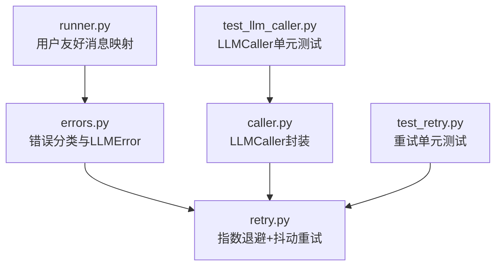
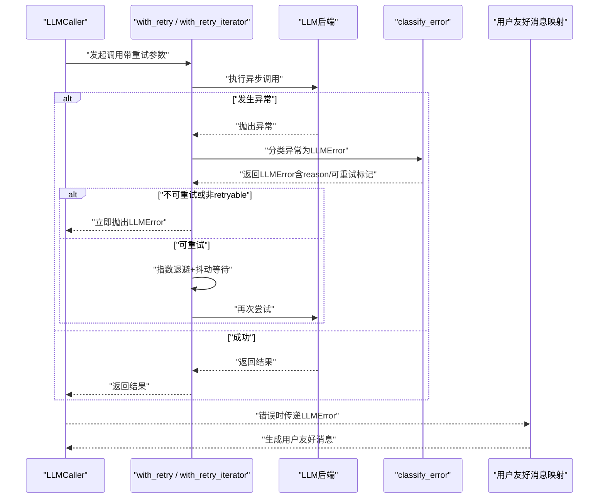
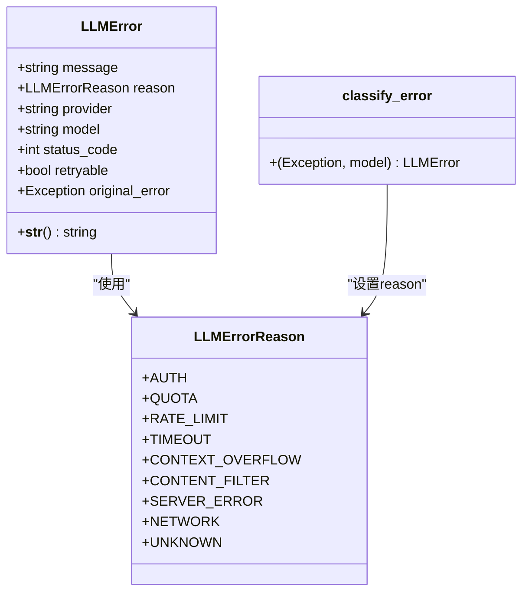
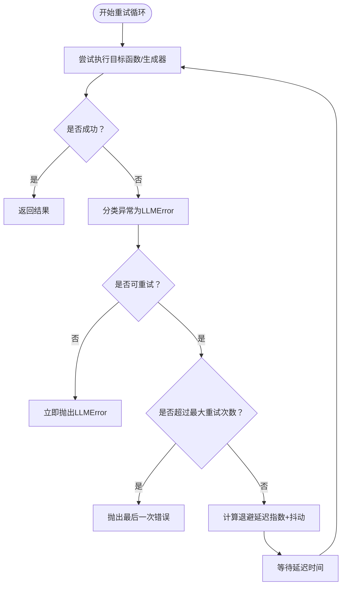
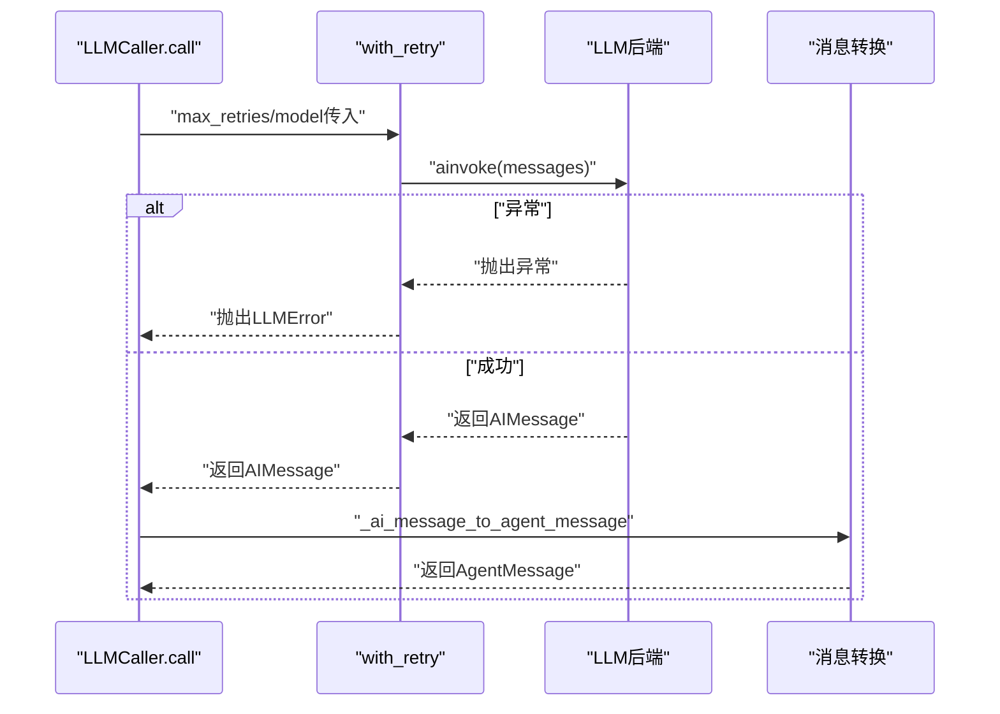
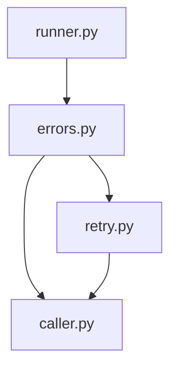

# 错误处理与重试

<cite>
**本文引用的文件**
- [errors.py](file://src/ark_agentic/core/llm/errors.py)
- [retry.py](file://src/ark_agentic/core/llm/retry.py)
- [caller.py](file://src/ark_agentic/core/llm/caller.py)
- [test_retry.py](file://tests/unit/core/test_retry.py)
- [test_llm_caller.py](file://tests/unit/core/test_llm_caller.py)
- [runner.py](file://src/ark_agentic/core/runner.py)
</cite>

## 目录
1. [简介](#简介)
2. [项目结构](#项目结构)
3. [核心组件](#核心组件)
4. [架构总览](#架构总览)
5. [详细组件分析](#详细组件分析)
6. [依赖分析](#依赖分析)
7. [性能考虑](#性能考虑)
8. [故障排查指南](#故障排查指南)
9. [结论](#结论)
10. [附录](#附录)

## 简介
本文件聚焦于 LLM 错误处理与重试机制的技术文档，涵盖以下要点：
- LLMError 类的错误分类与错误原因枚举（AUTH、QUOTA、RATE_LIMIT、TIMEOUT、CONTEXT_OVERFLOW、CONTENT_FILTER、SERVER_ERROR、NETWORK）
- 用户友好错误消息生成策略
- 指数退避重试策略、抖动机制、最大重试次数配置
- 错误恢复流程与 LLMCaller 的重试实现
- 错误传播机制、超时处理与异常捕获策略
- 具体的配置与使用示例路径（以源码路径形式给出）

## 项目结构
与错误处理与重试直接相关的模块位于 core/llm 子目录，主要文件如下：
- 错误定义与分类：src/ark_agentic/core/llm/errors.py
- 重试工具：src/ark_agentic/core/llm/retry.py
- LLM 调用封装：src/ark_agentic/core/llm/caller.py
- 单元测试：tests/unit/core/test_retry.py、tests/unit/core/test_llm_caller.py
- 用户友好消息映射：src/ark_agentic/core/runner.py

图表来源
- [errors.py:1-160](file://src/ark_agentic/core/llm/errors.py#L1-L160)
- [retry.py:1-162](file://src/ark_agentic/core/llm/retry.py#L1-L162)
- [caller.py:1-218](file://src/ark_agentic/core/llm/caller.py#L1-L218)
- [test_retry.py:1-263](file://tests/unit/core/test_retry.py#L1-L263)
- [test_llm_caller.py:1-48](file://tests/unit/core/test_llm_caller.py#L1-L48)
- [runner.py:592-610](file://src/ark_agentic/core/runner.py#L592-L610)

章节来源
- [errors.py:1-160](file://src/ark_agentic/core/llm/errors.py#L1-L160)
- [retry.py:1-162](file://src/ark_agentic/core/llm/retry.py#L1-L162)
- [caller.py:1-218](file://src/ark_agentic/core/llm/caller.py#L1-L218)
- [test_retry.py:1-263](file://tests/unit/core/test_retry.py#L1-L263)
- [test_llm_caller.py:1-48](file://tests/unit/core/test_llm_caller.py#L1-L48)
- [runner.py:592-610](file://src/ark_agentic/core/runner.py#L592-L610)

## 核心组件
- LLMErrorReason：错误原因枚举，覆盖认证、配额、速率限制、超时、上下文溢出、内容过滤、服务器错误、网络错误与未知错误。
- LLMError：结构化错误对象，包含 message、reason、provider、model、status_code、retryable、original_error 等字段，并提供统一字符串表示。
- classify_error：根据异常文本关键字进行智能分类，设置对应 reason 与 retryable 标记。
- with_retry / with_retry_iterator：指数退避+抖动的异步重试工具，支持最大重试次数、基础延迟与最大延迟配置。
- LLMCaller：封装 LLM 调用（非流式与流式），内部通过 with_retry 与 with_retry_iterator 自动执行重试。
- 用户友好消息映射：在运行器中根据 LLMError.reason 生成面向用户的提示语。

章节来源
- [errors.py:17-52](file://src/ark_agentic/core/llm/errors.py#L17-L52)
- [errors.py:55-159](file://src/ark_agentic/core/llm/errors.py#L55-L159)
- [retry.py:45-161](file://src/ark_agentic/core/llm/retry.py#L45-L161)
- [caller.py:26-218](file://src/ark_agentic/core/llm/caller.py#L26-L218)
- [runner.py:592-610](file://src/ark_agentic/core/runner.py#L592-L610)

## 架构总览
下图展示了错误处理与重试的整体架构，包括错误分类、重试策略、LLMCaller 调用与用户友好消息映射：

图表来源
- [caller.py:70-192](file://src/ark_agentic/core/llm/caller.py#L70-L192)
- [retry.py:45-161](file://src/ark_agentic/core/llm/retry.py#L45-L161)
- [errors.py:55-159](file://src/ark_agentic/core/llm/errors.py#L55-L159)
- [runner.py:592-610](file://src/ark_agentic/core/runner.py#L592-L610)

## 详细组件分析

### LLMError 与错误分类
- 错误原因枚举（LLMErrorReason）：包含 AUTH、QUOTA、RATE_LIMIT、TIMEOUT、CONTEXT_OVERFLOW、CONTENT_FILTER、SERVER_ERROR、NETWORK、UNKNOWN。
- LLMError 结构：message、reason、provider、model、status_code、retryable、original_error；__str__ 提供统一格式化输出。
- classify_error：基于异常字符串的关键字匹配进行分类，为网络、速率限制、超时、服务器、认证、配额、上下文溢出、内容过滤等场景设置相应 reason 与 retryable 标记；默认 UNKNOWN。

图表来源
- [errors.py:17-52](file://src/ark_agentic/core/llm/errors.py#L17-L52)
- [errors.py:31-52](file://src/ark_agentic/core/llm/errors.py#L31-L52)
- [errors.py:55-159](file://src/ark_agentic/core/llm/errors.py#L55-L159)

章节来源
- [errors.py:17-52](file://src/ark_agentic/core/llm/errors.py#L17-L52)
- [errors.py:31-52](file://src/ark_agentic/core/llm/errors.py#L31-L52)
- [errors.py:55-159](file://src/ark_agentic/core/llm/errors.py#L55-L159)

### 指数退避与抖动重试策略
- 适用范围：仅对 retryable=True 的错误进行重试（网络、速率限制、超时、服务器错误）；认证、配额、上下文溢出、内容过滤等直接抛出，不重试。
- 指数退避公式：delay = min(base_delay * 2^attempt, max_delay)，随后乘以抖动因子 jitter ∈ [0.5, 1.0]。
- with_retry：对异步函数进行重试，记录每次重试的日志，最终在达到最大重试次数后抛出最后一次错误。
- with_retry_iterator：对异步生成器进行重试，仅在“开流前”发生的错误重试；一旦首个 chunk 产出即视为成功，避免中途重试导致重复输出。

图表来源
- [retry.py:45-161](file://src/ark_agentic/core/llm/retry.py#L45-L161)

章节来源
- [retry.py:22-29](file://src/ark_agentic/core/llm/retry.py#L22-L29)
- [retry.py:32-36](file://src/ark_agentic/core/llm/retry.py#L32-L36)
- [retry.py:45-96](file://src/ark_agentic/core/llm/retry.py#L45-L96)
- [retry.py:99-161](file://src/ark_agentic/core/llm/retry.py#L99-L161)

### LLMCaller 的重试实现与错误传播
- 非流式调用（call）：通过 with_retry 包裹 llm.ainvoke，传入 max_retries 与 model 名称，最终将 AIMessage 转换为 AgentMessage 并返回。
- 流式调用（call_streaming）：通过 with_retry_iterator 包裹 llm.astream，支持 content_callback 与 thinking_callback；识别 Thinking 模型的 reasoning_content 字段并路由到 thinking 回调。
- 错误传播：当 with_retry/with_retry_iterator 捕获异常时，会将其分类为 LLMError 并按策略决定是否重试或抛出；最终由调用方（如 runner）接收并生成用户友好消息。

图表来源
- [caller.py:70-94](file://src/ark_agentic/core/llm/caller.py#L70-L94)
- [retry.py:45-96](file://src/ark_agentic/core/llm/retry.py#L45-L96)

章节来源
- [caller.py:70-94](file://src/ark_agentic/core/llm/caller.py#L70-L94)
- [caller.py:96-192](file://src/ark_agentic/core/llm/caller.py#L96-L192)
- [retry.py:45-96](file://src/ark_agentic/core/llm/retry.py#L45-L96)

### 用户友好错误消息生成
- 在运行器中，根据 LLMError.reason 返回对应的中文提示语，覆盖 AUTH、QUOTA、RATE_LIMIT、TIMEOUT、CONTEXT_OVERFLOW、CONTENT_FILTER、SERVER_ERROR、NETWORK 等场景。
- 该映射用于向用户展示更易懂的错误信息，提升用户体验。

章节来源
- [runner.py:592-610](file://src/ark_agentic/core/runner.py#L592-L610)

## 依赖分析
- LLMCaller 依赖 with_retry 与 with_retry_iterator 来实现重试。
- with_retry 与 with_retry_iterator 依赖 classify_error 对异常进行分类。
- classify_error 依赖 LLMErrorReason 与 LLMError。
- 用户友好消息映射依赖 LLMErrorReason。

图表来源
- [errors.py:17-52](file://src/ark_agentic/core/llm/errors.py#L17-L52)
- [errors.py:31-52](file://src/ark_agentic/core/llm/errors.py#L31-L52)
- [retry.py:16-42](file://src/ark_agentic/core/llm/retry.py#L16-L42)
- [caller.py:18-19](file://src/ark_agentic/core/llm/caller.py#L18-L19)
- [runner.py:592-610](file://src/ark_agentic/core/runner.py#L592-L610)

章节来源
- [errors.py:17-52](file://src/ark_agentic/core/llm/errors.py#L17-L52)
- [errors.py:31-52](file://src/ark_agentic/core/llm/errors.py#L31-L52)
- [retry.py:16-42](file://src/ark_agentic/core/llm/retry.py#L16-L42)
- [caller.py:18-19](file://src/ark_agentic/core/llm/caller.py#L18-L19)
- [runner.py:592-610](file://src/ark_agentic/core/runner.py#L592-L610)

## 性能考虑
- 指数退避与抖动：避免雪崩效应，降低集中重试带来的压力；抖动因子确保不同实例的重试时间分散。
- 最大重试次数与延迟上限：防止无限重试与过长等待；合理设置 base_delay 与 max_delay 以平衡响应速度与稳定性。
- 流式重试策略：仅在“开流前”重试，避免中途重试导致重复输出与资源浪费。
- 日志记录：在每次重试时记录尝试次数、原因与延迟，便于监控与排障。

## 故障排查指南
- 无法重试的错误类型：认证失败、配额不足、上下文溢出、内容过滤触发等，这些错误不会被重试，应直接处理或引导用户修复配置。
- 重试未生效：确认异常被正确分类为 retryable=True；检查 max_retries、base_delay、max_delay 参数是否合理。
- 流式中途失败：若首个 chunk 已产出，中途异常将不再重试，需检查上游逻辑或网络稳定性。
- 用户体验：结合用户友好消息映射，向用户提供清晰的提示与建议。

章节来源
- [retry.py:22-29](file://src/ark_agentic/core/llm/retry.py#L22-L29)
- [retry.py:99-161](file://src/ark_agentic/core/llm/retry.py#L99-L161)
- [runner.py:592-610](file://src/ark_agentic/core/runner.py#L592-L610)

## 结论
本系统采用“最小化错误分类 + 指数退避+抖动重试”的策略，在保证稳定性的同时尽量减少对用户的影响。LLMErrorReason 与 classify_error 提供了清晰的错误分类与可扩展性；with_retry 与 with_retry_iterator 实现了灵活的重试控制；LLMCaller 将重试无缝集成到调用流程中；用户友好消息映射提升了用户体验。通过合理的参数配置与监控，可在高并发场景下保持系统的鲁棒性。

## 附录

### 配置与使用示例（以源码路径为准）
- 配置重试参数（with_retry）：
  - 示例路径：[with_retry 定义:45-96](file://src/ark_agentic/core/llm/retry.py#L45-L96)
  - 关键参数：max_retries、base_delay、max_delay、model
- 配置重试参数（with_retry_iterator）：
  - 示例路径：[with_retry_iterator 定义:99-161](file://src/ark_agentic/core/llm/retry.py#L99-L161)
  - 关键参数：max_retries、base_delay、max_delay、model
- LLMCaller 初始化与调用：
  - 示例路径：[LLMCaller.__init__:29-36](file://src/ark_agentic/core/llm/caller.py#L29-L36)
  - 示例路径：[LLMCaller.call:70-94](file://src/ark_agentic/core/llm/caller.py#L70-L94)
  - 示例路径：[LLMCaller.call_streaming:96-192](file://src/ark_agentic/core/llm/caller.py#L96-L192)
- 错误分类与原因枚举：
  - 示例路径：[LLMErrorReason:17-28](file://src/ark_agentic/core/llm/errors.py#L17-L28)
  - 示例路径：[LLMError:31-52](file://src/ark_agentic/core/llm/errors.py#L31-L52)
  - 示例路径：[classify_error:55-159](file://src/ark_agentic/core/llm/errors.py#L55-L159)
- 用户友好消息映射：
  - 示例路径：[用户友好消息映射:592-610](file://src/ark_agentic/core/runner.py#L592-L610)
- 单元测试参考：
  - 示例路径：[重试单元测试:1-263](file://tests/unit/core/test_retry.py#L1-L263)
  - 示例路径：[LLMCaller单元测试:1-48](file://tests/unit/core/test_llm_caller.py#L1-L48)