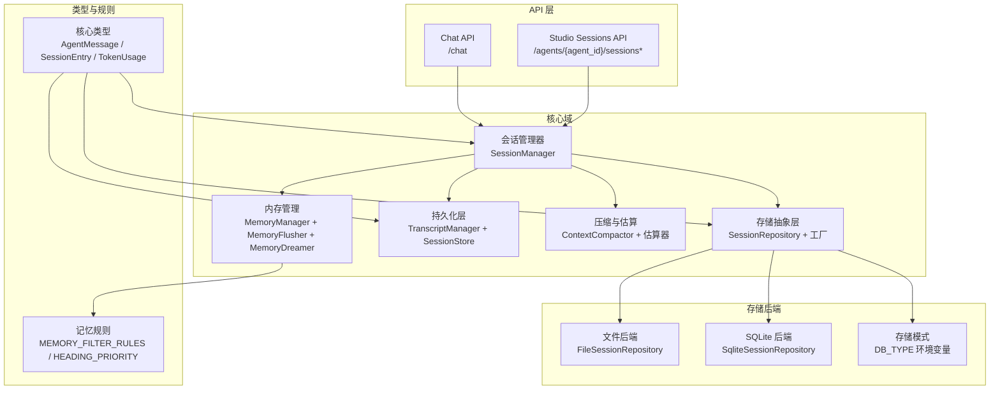
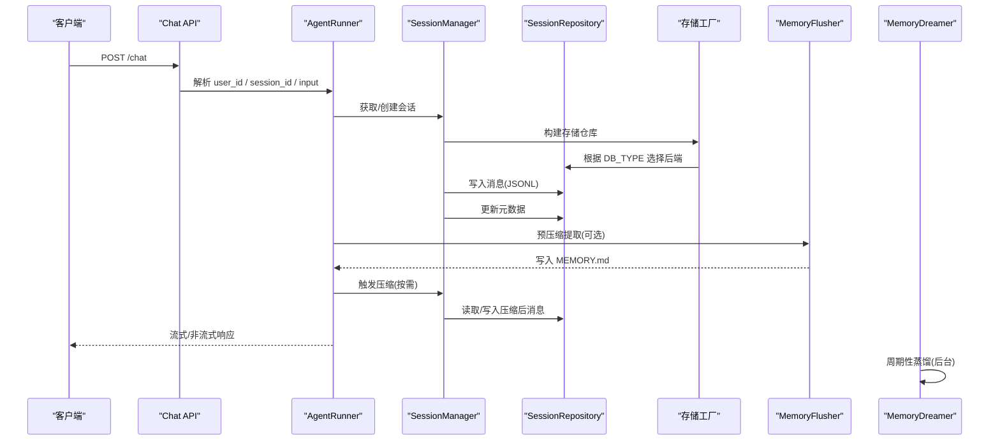
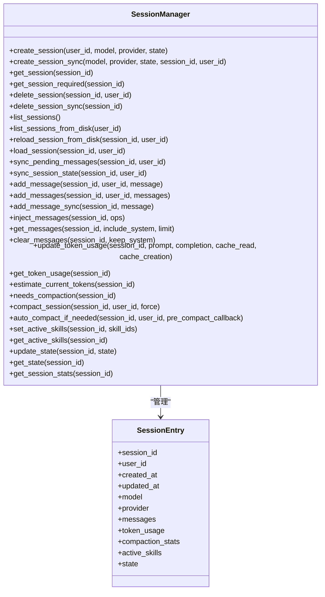
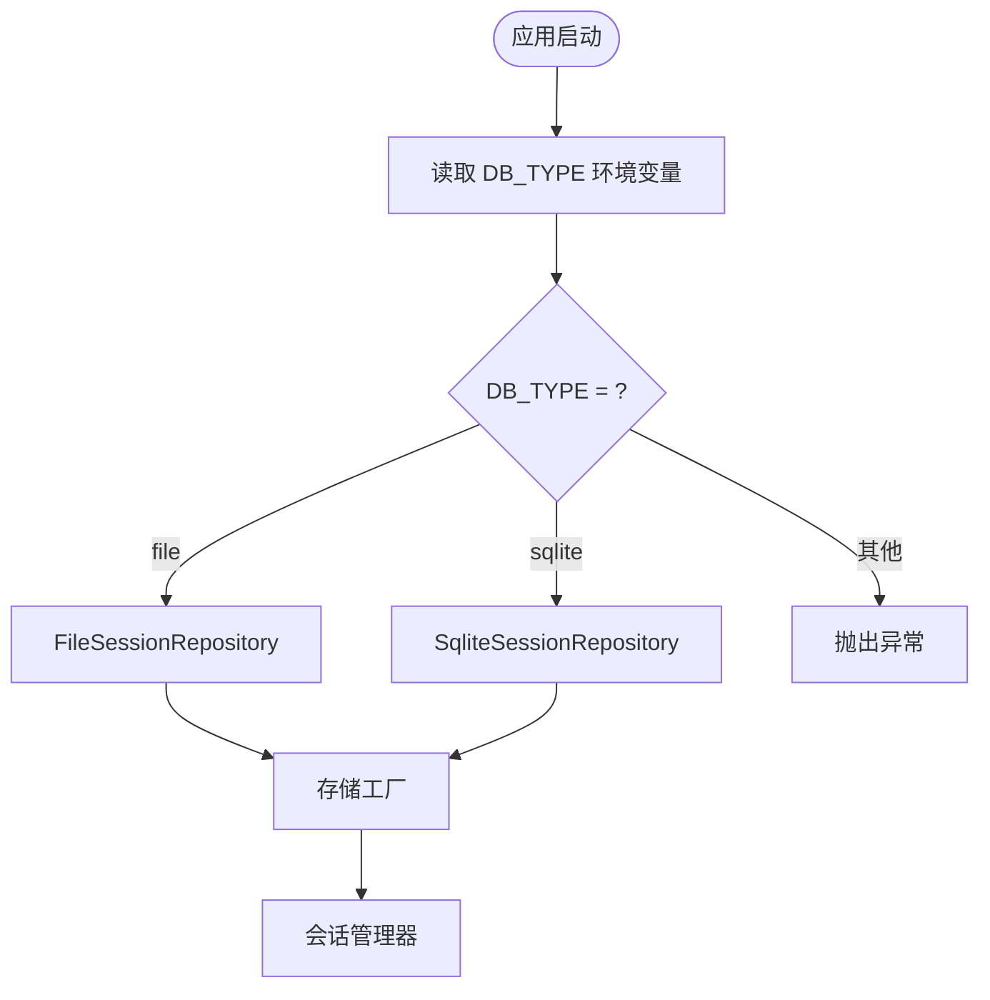
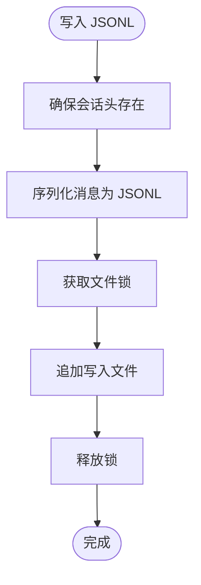
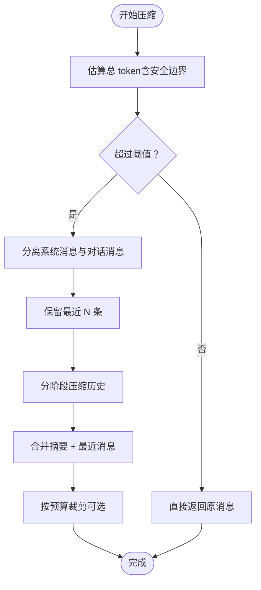
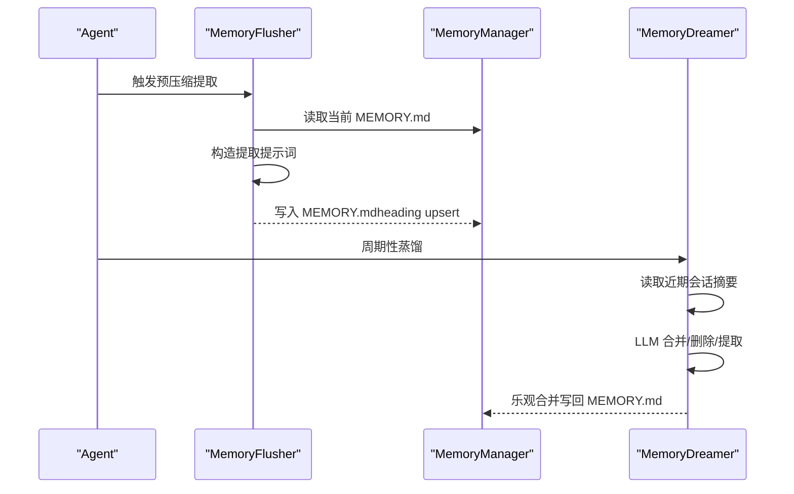
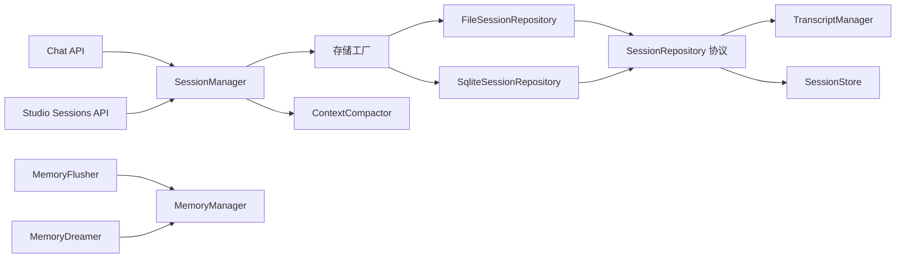
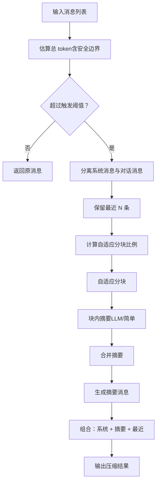

# 会话与内存管理

<cite>
**本文档引用的文件**
- [session.py](file://src/ark_agentic/core/session/manager.py)
- [persistence.py](file://src/ark_agentic/core/persistence.py)
- [compaction.py](file://src/ark_agentic/core/compaction.py)
- [types.py](file://src/ark_agentic/core/types.py)
- [manager.py](file://src/ark_agentic/core/memory/manager.py)
- [user_profile.py](file://src/ark_agentic/core/memory/user_profile.py)
- [rules.py](file://src/ark_agentic/core/memory/rules.py)
- [dream.py](file://src/ark_agentic/core/memory/dream.py)
- [extractor.py](file://src/ark_agentic/core/memory/extractor.py)
- [sessions.py](file://src/ark_agentic/plugins/studio/api/sessions.py)
- [chat.py](file://src/ark_agentic/api/chat.py)
- [app.py](file://src/ark_agentic/app.py)
- [factory.py](file://src/ark_agentic/core/storage/factory.py)
- [mode.py](file://src/ark_agentic/core/storage/mode.py)
- [entries.py](file://src/ark_agentic/core/storage/entries.py)
- [session.py](file://src/ark_agentic/core/storage/protocols/session.py)
- [session.py](file://src/ark_agentic/core/storage/file/session.py)
- [session.py](file://src/ark_agentic/core/storage/database/sqlite/session.py)
- [test_session.py](file://tests/unit/core/test_session.py)
- [test_memory_unified.py](file://tests/unit/core/test_memory_unified.py)
</cite>

## 更新摘要
**所做更改**
- 更新了存储系统架构，引入了新的存储抽象层和工厂模式
- 重新组织了会话管理器位置，从 core/session.py 迁移到 core/session/manager.py
- 新增了存储模式选择机制（DB_TYPE 环境变量）
- 增强了会话存储的协议化设计，支持文件和数据库两种后端
- 完善了存储仓库的工厂构建模式

## 目录
1. [简介](#简介)
2. [项目结构](#项目结构)
3. [核心组件](#核心组件)
4. [架构概览](#架构概览)
5. [详细组件分析](#详细组件分析)
6. [依赖关系分析](#依赖关系分析)
7. [性能考量](#性能考量)
8. [故障排查指南](#故障排查指南)
9. [结论](#结论)
10. [附录](#附录)

## 简介
本文件面向会话与内存管理系统，围绕以下目标展开：  
- 会话生命周期与状态维护：创建、加载、持久化、删除与统计  
- 内存管理的数据持久化策略：heading-based markdown、预压缩提取与周期性蒸馏  
- 用户档案的个性化管理：规则驱动的长期记忆与短期记忆分离  
- 消息压缩算法：自适应分块、摘要生成与多阶段压缩  
- 长期记忆存储与短期记忆管理：flush + dream 两阶段策略  
- 内存优化策略、数据备份恢复与隐私保护机制  
- 会话状态调试与内存使用监控方法  
- **新增** 存储系统重构：抽象层设计、工厂模式、多后端支持

## 项目结构
系统采用模块化设计，核心分为会话管理、存储抽象层、持久化层、压缩与记忆三大域，配合 Studio API 与 Chat API 提供可视化与交互能力。

**图表来源**
- [chat.py:27-177](file://src/ark_agentic/api/chat.py#L27-L177)
- [sessions.py:84-200](file://src/ark_agentic/plugins/studio/api/sessions.py#L84-L200)
- [session.py](file://src/ark_agentic/core/session/manager.py)
- [factory.py:30-67](file://src/ark_agentic/core/storage/factory.py#L30-L67)
- [mode.py:19-31](file://src/ark_agentic/core/storage/mode.py#L19-L31)
- [session.py:44-101](file://src/ark_agentic/core/storage/file/session.py#L44-L101)
- [session.py:42-74](file://src/ark_agentic/core/storage/database/sqlite/session.py#L42-L74)
- [persistence.py:392-787](file://src/ark_agentic/core/persistence.py#L392-L787)
- [compaction.py:421-742](file://src/ark_agentic/core/compaction.py#L421-L742)
- [manager.py](file://src/ark_agentic/core/memory/manager.py)
- [extractor.py:98-187](file://src/ark_agentic/core/memory/extractor.py#L98-L187)
- [dream.py:190-323](file://src/ark_agentic/core/memory/dream.py#L190-L323)
- [types.py:19-422](file://src/ark_agentic/core/types.py#L19-L422)

**章节来源**
- [app.py:137-249](file://src/ark_agentic/app.py#L137-L249)

## 核心组件
- 会话管理器：负责会话生命周期、消息管理、Token 统计、上下文压缩与状态维护  
- **存储抽象层**：SessionRepository 协议定义，支持文件和 SQLite 两种后端实现  
- **存储工厂**：根据 DB_TYPE 环境变量动态选择存储后端，提供统一的构建接口  
- 持久化层：JSONL 转录与会话元数据存储，带文件锁与缓存  
- 压缩与估算：消息分块、摘要生成、多阶段压缩与安全边界估算  
- 内存管理：heading-based markdown 写入、预压缩提取（flush）、周期性蒸馏（dream）  
- 类型与规则：统一的消息、会话、Token 与压缩统计类型，以及记忆规则与优先级  

**章节来源**
- [session.py](file://src/ark_agentic/core/session/manager.py)
- [factory.py:30-67](file://src/ark_agentic/core/storage/factory.py#L30-L67)
- [mode.py:19-31](file://src/ark_agentic/core/storage/mode.py#L19-L31)
- [session.py:18-194](file://src/ark_agentic/core/storage/protocols/session.py#L18-L194)
- [session.py:44-101](file://src/ark_agentic/core/storage/file/session.py#L44-L101)
- [session.py:42-74](file://src/ark_agentic/core/storage/database/sqlite/session.py#L42-L74)
- [persistence.py:392-787](file://src/ark_agentic/core/persistence.py#L392-L787)
- [compaction.py:421-742](file://src/ark_agentic/core/compaction.py#L421-L742)
- [manager.py](file://src/ark_agentic/core/memory/manager.py)
- [user_profile.py:26-138](file://src/ark_agentic/core/memory/user_profile.py#L26-L138)
- [rules.py:7-32](file://src/ark_agentic/core/memory/rules.py#L7-L32)
- [types.py:19-422](file://src/ark_agentic/core/types.py#L19-L422)

## 架构概览
系统通过 Chat API 接收请求，解析用户与会话标识，交由 AgentRunner 调度至对应 Agent；Agent 通过 SessionManager 管理会话与消息，必要时触发压缩；MemoryFlusher 在压缩前抽取长期记忆，MemoryDreamer 周期性蒸馏整合；存储抽象层根据 DB_TYPE 环境变量选择合适的后端实现，保证业务逻辑与存储细节的解耦。

**图表来源**
- [chat.py:27-177](file://src/ark_agentic/api/chat.py#L27-L177)
- [session.py](file://src/ark_agentic/core/session/manager.py)
- [factory.py:30-67](file://src/ark_agentic/core/storage/factory.py#L30-L67)
- [mode.py:19-31](file://src/ark_agentic/core/storage/mode.py#L19-L31)
- [persistence.py:392-787](file://src/ark_agentic/core/persistence.py#L392-L787)
- [extractor.py:98-187](file://src/ark_agentic/core/memory/extractor.py#L98-L187)
- [dream.py:190-323](file://src/ark_agentic/core/memory/dream.py#L190-L323)

## 详细组件分析

### 会话管理器（SessionManager）
- 生命周期：创建、同步/异步加载、磁盘列表、重载、删除、同步待定消息与状态  
- 消息管理：追加单条/批量消息、同步待持久化队列、注入外部历史、过滤与限制读取  
- Token 统计：累计 prompt/completion/cache 使用量，估算当前 token  
- 上下文压缩：按配置判断是否需要压缩、多阶段摘要、保留近期消息、更新压缩统计  
- 技能与状态：活跃技能快照、会话状态（ADK-style scratchpad）  
- 统计接口：导出会话关键指标（消息数、token、压缩次数、活跃技能）

**图表来源**
- [session.py](file://src/ark_agentic/core/session/manager.py)
- [types.py:350-422](file://src/ark_agentic/core/types.py#L350-L422)

**章节来源**
- [session.py](file://src/ark_agentic/core/session/manager.py)
- [types.py:350-422](file://src/ark_agentic/core/types.py#L350-L422)

### 存储抽象层与工厂模式
**更新** 引入了全新的存储抽象层设计，实现了业务逻辑与存储实现的完全解耦。

- **存储模式选择**：通过 DB_TYPE 环境变量动态选择存储后端（file 或 sqlite）
- **协议化设计**：SessionRepository 协议定义了会话存储的标准接口
- **工厂模式**：build_session_repository 和 build_memory_repository 提供统一的构建接口
- **多后端支持**：FileSessionRepository 和 SqliteSessionRepository 实现相同协议的不同后端

**图表来源**
- [mode.py:19-31](file://src/ark_agentic/core/storage/mode.py#L19-L31)
- [factory.py:30-67](file://src/ark_agentic/core/storage/factory.py#L30-L67)
- [session.py:18-194](file://src/ark_agentic/core/storage/protocols/session.py#L18-L194)

**章节来源**
- [factory.py:30-67](file://src/ark_agentic/core/storage/factory.py#L30-L67)
- [mode.py:19-31](file://src/ark_agentic/core/storage/mode.py#L19-L31)
- [session.py:18-194](file://src/ark_agentic/core/storage/protocols/session.py#L18-L194)

### 文件存储后端（FileSessionRepository）
- **文件结构**：每个用户一个目录，会话存储为 JSONL 文件，元数据存储为 sessions.json
- **并发控制**：使用文件锁确保多进程安全访问
- **缓存机制**：元数据 sessions.json 采用 TTL 缓存提高性能
- **路径管理**：提供完整的路径辅助函数管理文件结构

**章节来源**
- [session.py:44-101](file://src/ark_agentic/core/storage/file/session.py#L44-L101)
- [session.py:224-242](file://src/ark_agentic/core/storage/file/session.py#L224-L242)
- [session.py:305-371](file://src/ark_agentic/core/storage/file/session.py#L305-L371)

### SQLite 存储后端（SqliteSessionRepository）
- **数据库模式**：使用两个表存储会话元数据和消息内容
- **事务管理**：所有操作都在事务中执行，确保数据一致性
- **序列化支持**：消息内容以 JSONL 格式存储，支持复杂数据结构
- **权限控制**：每个查询都包含 user_id 条件，确保数据隔离

**章节来源**
- [session.py:42-74](file://src/ark_agentic/core/storage/database/sqlite/session.py#L42-L74)
- [session.py:112-136](file://src/ark_agentic/core/storage/database/sqlite/session.py#L112-L136)
- [session.py:169-181](file://src/ark_agentic/core/storage/database/sqlite/session.py#L169-L181)

### 持久化层（TranscriptManager 与 SessionStore）
- JSONL 转录：会话头（SessionHeader）+ 多条消息（MessageEntry）  
- 文件锁：跨平台文件锁，支持超时与过期清理  
- 会话元数据：每用户 sessions.json，缓存 TTL，原子更新  
- 序列化/反序列化：消息、工具调用、工具结果的双向转换  
- 原始读写：/raw 接口支持校验与全量写回，失败抛出验证异常  

**图表来源**
- [persistence.py:444-487](file://src/ark_agentic/core/persistence.py#L444-L487)
- [persistence.py:264-387](file://src/ark_agentic/core/persistence.py#L264-L387)

**章节来源**
- [persistence.py:392-787](file://src/ark_agentic/core/persistence.py#L392-L787)

### 上下文压缩（ContextCompactor）
- 估算与安全边界：字符/词估算 + 20% 安全余量  
- 自适应分块：根据上下文窗口动态调整块比例，避免单条消息过大  
- 多阶段摘要：历史分块 → 块内摘要 → 合并摘要 → 生成摘要消息  
- 保留近期：按配置保留最后 N 条消息不压缩  
- 预算裁剪：按历史占比预算裁剪最早消息，确保不超过预算  

**图表来源**
- [compaction.py:458-518](file://src/ark_agentic/core/compaction.py#L458-L518)
- [compaction.py:519-625](file://src/ark_agentic/core/compaction.py#L519-L625)

**章节来源**
- [compaction.py:421-742](file://src/ark_agentic/core/compaction.py#L421-L742)

### 内存管理（MemoryManager、MemoryFlusher、MemoryDreamer）
- MemoryManager：按 user_id 定位 MEMORY.md，heading-level upsert，读写便捷方法  
- MemoryFlusher：预压缩提取，从完整对话中抽取长期记忆，写入 MEMORY.md  
- MemoryDreamer：周期性蒸馏，读取近期会话 + 当前记忆 → LLM 合并/删除/提取 → 乐观合并写回  
- 规则与优先级：MEMORY_FILTER_RULES 与 HEADING_PRIORITY 统一长期记忆标准与保留顺序  

**图表来源**
- [manager.py](file://src/ark_agentic/core/memory/manager.py)
- [extractor.py:98-187](file://src/ark_agentic/core/memory/extractor.py#L98-L187)
- [dream.py:190-323](file://src/ark_agentic/core/memory/dream.py#L190-L323)
- [rules.py:7-32](file://src/ark_agentic/core/memory/rules.py#L7-L32)

**章节来源**
- [manager.py](file://src/ark_agentic/core/memory/manager.py)
- [user_profile.py:26-138](file://src/ark_agentic/core/memory/user_profile.py#L26-L138)
- [extractor.py:98-187](file://src/ark_agentic/core/memory/extractor.py#L98-L187)
- [dream.py:190-323](file://src/ark_agentic/core/memory/dream.py#L190-L323)
- [rules.py:7-32](file://src/ark_agentic/core/memory/rules.py#L7-L32)

### Studio 会话 API
- 列表与详情：以磁盘 JSONL 为准，返回会话项与消息明细  
- 原始读写：/raw GET 返回 JSONL 文本，PUT 校验后全量写回并重载内存  
- 安全校验：RawJsonlValidationError，包含行号等信息  

**章节来源**
- [sessions.py:84-200](file://src/ark_agentic/plugins/studio/api/sessions.py#L84-L200)
- [persistence.py:31-37](file://src/ark_agentic/core/persistence.py#L31-L37)

### Chat API 与会话生命周期
- 自动会话创建：若未提供 session_id，则创建新会话并返回  
- 输入上下文注入：user:* 前缀、trace_id、幂等键等临时上下文  
- 流式与非流式：支持 SSE 事件流与一次性响应  
- 会话加载：若不存在则从磁盘加载，支持代理切换场景重建会话  

**章节来源**
- [chat.py:27-177](file://src/ark_agentic/api/chat.py#L27-L177)

## 依赖关系分析
**更新** 存储系统重构后，依赖关系发生了根本性变化：

- 会话管理器通过存储工厂获取 SessionRepository 实例，不再直接依赖具体存储实现
- 存储工厂根据 DB_TYPE 环境变量动态选择 FileSessionRepository 或 SqliteSessionRepository
- SessionRepository 协议定义了统一的接口，确保不同后端的一致性
- 持久化层提供跨平台文件锁与缓存，保障并发安全与性能
- 内存管理器与压缩器解耦，通过回调在压缩前抽取长期记忆
- Studio API 与 Chat API 通过注册表与 Runner 协作，统一接入会话与记忆能力

**图表来源**
- [session.py](file://src/ark_agentic/core/session/manager.py)
- [factory.py:30-67](file://src/ark_agentic/core/storage/factory.py#L30-L67)
- [session.py:18-194](file://src/ark_agentic/core/storage/protocols/session.py#L18-L194)
- [session.py:44-101](file://src/ark_agentic/core/storage/file/session.py#L44-L101)
- [session.py:42-74](file://src/ark_agentic/core/storage/database/sqlite/session.py#L42-L74)
- [persistence.py:392-787](file://src/ark_agentic/core/persistence.py#L392-L787)
- [compaction.py:421-441](file://src/ark_agentic/core/compaction.py#L421-L441)
- [manager.py](file://src/ark_agentic/core/memory/manager.py)
- [extractor.py:98-107](file://src/ark_agentic/core/memory/extractor.py#L98-L107)
- [dream.py:190-195](file://src/ark_agentic/core/memory/dream.py#L190-L195)
- [chat.py:27-40](file://src/ark_agentic/api/chat.py#L27-L40)
- [sessions.py:84-97](file://src/ark_agentic/plugins/studio/api/sessions.py#L84-L97)

**章节来源**
- [session.py](file://src/ark_agentic/core/session/manager.py)
- [factory.py:30-67](file://src/ark_agentic/core/storage/factory.py#L30-L67)
- [session.py:18-194](file://src/ark_agentic/core/storage/protocols/session.py#L18-L194)
- [session.py:44-101](file://src/ark_agentic/core/storage/file/session.py#L44-L101)
- [session.py:42-74](file://src/ark_agentic/core/storage/database/sqlite/session.py#L42-L74)
- [persistence.py:392-441](file://src/ark_agentic/core/persistence.py#L392-L441)
- [compaction.py:421-441](file://src/ark_agentic/core/compaction.py#L421-L441)
- [manager.py](file://src/ark_agentic/core/memory/manager.py)
- [extractor.py:98-107](file://src/ark_agentic/core/memory/extractor.py#L98-L107)
- [dream.py:190-195](file://src/ark_agentic/core/memory/dream.py#L190-L195)
- [chat.py:27-40](file://src/ark_agentic/api/chat.py#L27-L40)
- [sessions.py:84-97](file://src/ark_agentic/plugins/studio/api/sessions.py#L84-L97)

## 性能考量
**更新** 存储系统重构带来了新的性能考量：

- **存储模式选择**：DB_TYPE 环境变量直接影响性能表现，file 模式适合单机部署，sqlite 模式适合需要 ACID 特性的场景
- **文件锁开销**：FileSessionRepository 使用文件锁，需要考虑锁竞争对性能的影响
- **缓存策略**：FileSessionRepository 对 sessions.json 实施 TTL 缓存，需要合理设置缓存参数
- **事务管理**：SqliteSessionRepository 所有操作都在事务中执行，提供更好的数据一致性但可能影响并发性能
- **Token 估算与安全边界**：估算误差较大时留 20% 余量，避免越界  
- **自适应分块**：根据平均消息大小与上下文窗口动态调整块比例，平衡吞吐与稳定性  
- **预压缩提取**：在压缩前抽取长期记忆，减少历史消息长度，提升压缩效率  
- **周期性蒸馏**：定期合并/精简记忆，控制 MEMORY.md 规模，避免超限  

**建议**：
- 根据部署环境选择合适的存储模式（DB_TYPE=file 或 sqlite）
- 监控文件锁等待时间和数据库连接池使用情况
- 合理设置缓存 TTL 和后端连接参数
- 调整压缩阈值与块大小以匹配业务上下文窗口
- 合理设置预保留近期消息数，兼顾上下文完整性

## 故障排查指南
**更新** 存储系统重构后的故障排查指南：

- **存储模式配置错误**
  - 检查 DB_TYPE 环境变量是否正确设置为 'file' 或 'sqlite'
  - 验证存储后端的可用性和权限设置
  - 查看存储工厂的初始化日志，确认后端选择正确
- **文件存储问题**
  - 检查 sessions.json 与 .lock 文件是否存在与权限
  - 查看文件锁超时日志，确认是否存在僵尸锁
  - 验证文件路径和目录权限，确保多进程访问安全
- **数据库存储问题**
  - 检查数据库连接配置和可用性
  - 验证数据库表结构和索引完整性
  - 查看事务执行日志，确认数据一致性
- **压缩异常**
  - 确认上下文窗口与触发阈值配置是否合理
  - 检查摘要器是否可用，必要时降级为简单截断
- **内存写入不生效**
  - 确认 heading-based 写入是否包含合法标题
  - 检查 MEMORY.md 是否被外部进程修改导致乐观合并失败
- **数据备份与恢复**
  - MemoryDreamer 写入前会生成 .bak 备份，失败时可回滚  
  - JSONL 文件可直接复制迁移，注意时间戳与锁文件处理
  - SQLite 数据库支持标准的数据库备份和恢复机制
- **隐私保护**
  - MEMORY.md 为单一用户文件，建议结合文件系统权限与加密存储  
  - 避免在 MEMORY.md 中记录敏感信息，遵循规则中的"不记录"清单

**章节来源**
- [mode.py:23-26](file://src/ark_agentic/core/storage/mode.py#L23-L26)
- [factory.py:40-47](file://src/ark_agentic/core/storage/factory.py#L40-L47)
- [factory.py:64-67](file://src/ark_agentic/core/storage/factory.py#L64-L67)
- [persistence.py:31-37](file://src/ark_agentic/core/persistence.py#L31-L37)
- [persistence.py:264-387](file://src/ark_agentic/core/persistence.py#L264-L387)
- [session.py:347-351](file://src/ark_agentic/core/storage/file/session.py#L347-L351)
- [session.py:343-347](file://src/ark_agentic/core/storage/database/sqlite/session.py#L343-L347)
- [dream.py:242-288](file://src/ark_agentic/core/memory/dream.py#L242-L288)

## 结论
**更新** 存储系统重构后的系统优势：

本系统通过"会话 + 存储抽象层 + 持久化 + 压缩 + 内存"的协同设计，实现了高效、可靠且可扩展的会话与记忆管理：

- **存储抽象层**：通过 SessionRepository 协议和工厂模式，实现了业务逻辑与存储实现的完全解耦
- **多后端支持**：支持文件和 SQLite 两种存储后端，通过 DB_TYPE 环境变量动态选择
- **会话生命周期清晰**：状态与统计完备，支持多种存储后端的一致性操作
- **持久化采用 JSONL + 文件锁**：兼顾一致性与性能，支持文件和数据库两种模式
- **压缩算法具备自适应与多阶段摘要能力**：有效控制上下文规模
- **内存管理以 heading-based markdown 为核心**：结合预压缩提取与周期性蒸馏，实现长期记忆的高质量维护
- **提供 Studio 与 Chat 双通道访问**：满足可视化与交互需求
- **增强的可扩展性**：新的存储抽象层为未来支持更多存储后端（如 S3）奠定了基础

## 附录

### 会话状态调试与内存使用监控
- 会话状态  
  - 使用 get_session_stats 导出消息数、token 估算、压缩统计与活跃技能  
  - 通过 /agents/{agent_id}/sessions/{session_id}/raw 查看原始 JSONL  
- 内存使用  
  - MEMORY.md 大小与 heading 数量可作为长期记忆规模指标  
  - truncate_profile 与 HEADING_PRIORITY 控制记忆体积与优先级  
- 压缩行为  
  - 观察压缩统计字段（original/compacted 消息与 token）  
  - 调整 trigger_threshold 与 preserve_recent 以适配业务场景  
- **存储监控**  
  - 监控 DB_TYPE 环境变量配置状态  
  - 查看存储工厂的后端选择日志  
  - 监控文件锁等待时间和数据库连接池使用情况  

**章节来源**
- [session.py](file://src/ark_agentic/core/session/manager.py)
- [sessions.py:146-200](file://src/ark_agentic/plugins/studio/api/sessions.py#L146-L200)
- [user_profile.py:96-138](file://src/ark_agentic/core/memory/user_profile.py#L96-L138)
- [compaction.py:409-420](file://src/ark_agentic/core/compaction.py#L409-L420)
- [mode.py:19-31](file://src/ark_agentic/core/storage/mode.py#L19-L31)
- [factory.py:30-67](file://src/ark_agentic/core/storage/factory.py#L30-L67)

### 关键流程图：消息压缩算法

**图表来源**
- [compaction.py:458-518](file://src/ark_agentic/core/compaction.py#L458-L518)
- [compaction.py:519-625](file://src/ark_agentic/core/compaction.py#L519-L625)

### 单元测试要点
- 会话管理：创建/加载/删除、消息增删、Token 统计、压缩触发与执行  
- **存储抽象层**：协议一致性测试、工厂模式测试、多后端兼容性测试  
- 内存管理：heading upsert、预压缩提取、周期性蒸馏、规则与优先级  

**章节来源**
- [test_session.py:18-266](file://tests/unit/core/test_session.py#L18-L266)
- [test_memory_unified.py:35-160](file://tests/unit/core/test_memory_unified.py#L35-L160)

### 存储系统配置指南
**新增** 如何配置和使用新的存储系统：

- **环境配置**：设置 DB_TYPE 环境变量为 'file' 或 'sqlite'
- **文件模式配置**：需要提供 sessions_dir 参数指向会话存储目录
- **数据库模式配置**：需要配置数据库连接参数，存储工厂会自动获取引擎
- **运行时切换**：通过修改 DB_TYPE 环境变量可以在不同存储模式间切换
- **生产部署建议**：使用 sqlite 模式获得更好的数据一致性和并发控制

**章节来源**
- [mode.py:19-31](file://src/ark_agentic/core/storage/mode.py#L19-L31)
- [factory.py:30-67](file://src/ark_agentic/core/storage/factory.py#L30-L67)
- [session.py:47-49](file://src/ark_agentic/core/storage/file/session.py#L47-L49)
- [session.py:45-46](file://src/ark_agentic/core/storage/database/sqlite/session.py#L45-L46)