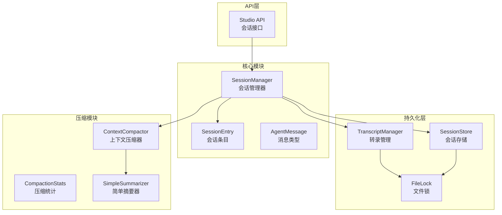
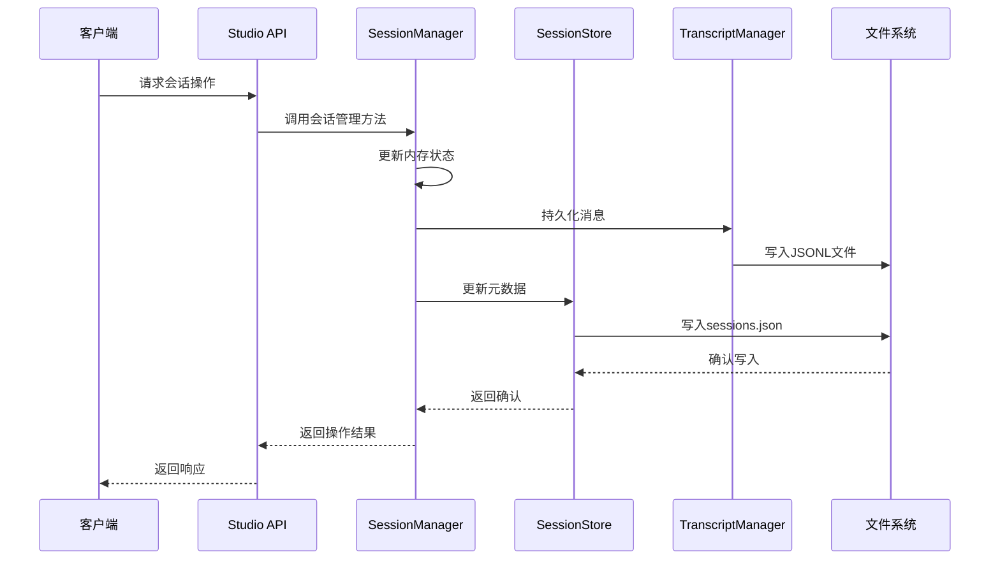
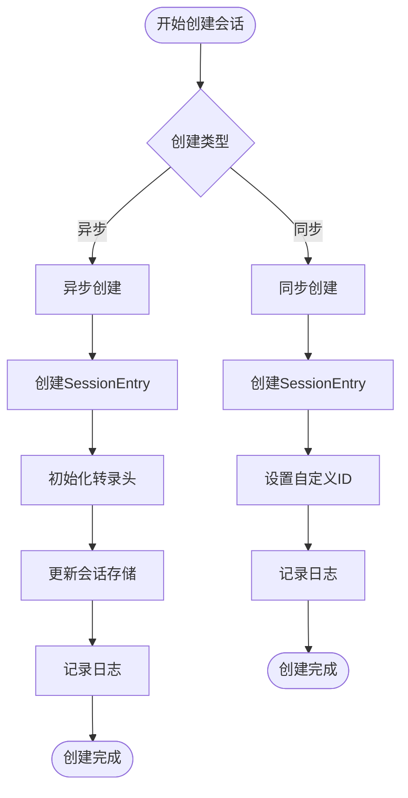
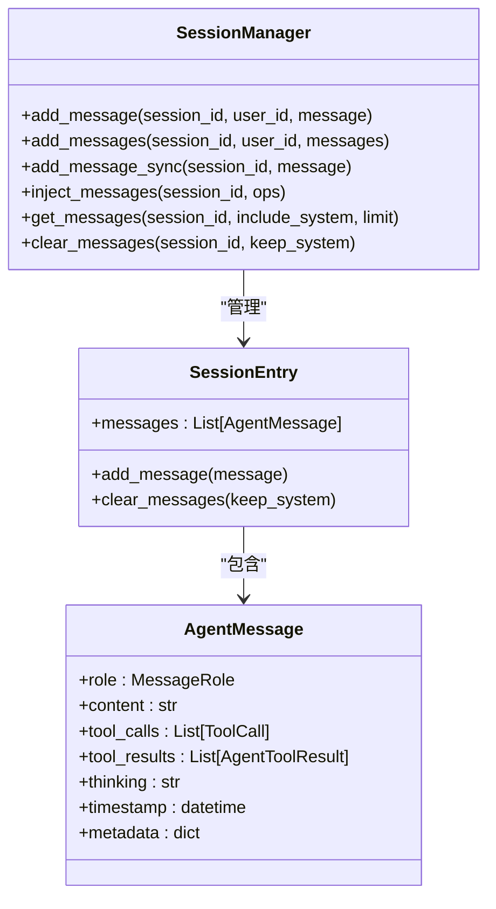
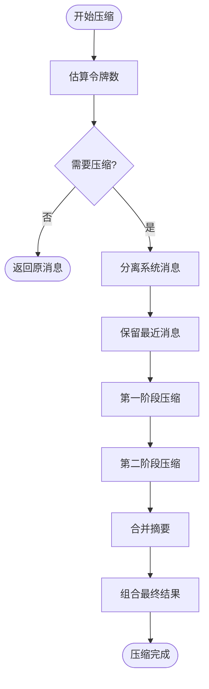
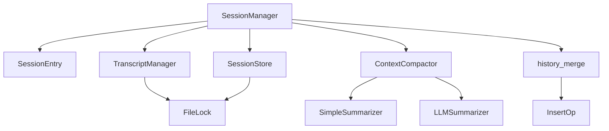

# 会话管理

<cite>
**本文档引用的文件**
- [session.py](file://src/ark_agentic/core/session.py)
- [types.py](file://src/ark_agentic/core/types.py)
- [persistence.py](file://src/ark_agentic/core/persistence.py)
- [compaction.py](file://src/ark_agentic/core/compaction.py)
- [history_merge.py](file://src/ark_agentic/core/history_merge.py)
- [sessions.py](file://src/ark_agentic/studio/api/sessions.py)
- [test_session.py](file://tests/unit/core/test_session.py)
- [test_persistence.py](file://tests/unit/core/test_persistence.py)
</cite>

## 目录
1. [简介](#简介)
2. [项目结构](#项目结构)
3. [核心组件](#核心组件)
4. [架构概览](#架构概览)
5. [详细组件分析](#详细组件分析)
6. [依赖分析](#依赖分析)
7. [性能考虑](#性能考虑)
8. [故障排除指南](#故障排除指南)
9. [结论](#结论)
10. [附录](#附录)

## 简介
本文件详细阐述了会话管理系统的设计与实现，重点围绕会话管理器(SessionManager)的核心功能。系统提供了完整的会话生命周期管理、消息管理、状态管理、统计信息查询以及上下文压缩能力。同时，系统采用异步I/O和文件锁机制确保并发安全性，并通过JSONL格式实现消息持久化。

## 项目结构
会话管理系统主要分布在以下模块中：
- 核心会话管理：SessionManager类及其相关类型定义
- 持久化层：TranscriptManager和SessionStore负责消息和元数据存储
- 上下文压缩：ContextCompactor和相关算法实现消息压缩
- 历史合并：history_merge模块提供外部历史合并功能
- API接口：Studio API提供会话查询和原始数据访问

**图表来源**
- [session.py:24-482](file://src/ark_agentic/core/session.py#L24-L482)
- [persistence.py:392-787](file://src/ark_agentic/core/persistence.py#L392-L787)
- [compaction.py:421-742](file://src/ark_agentic/core/compaction.py#L421-L742)

**章节来源**
- [session.py:1-482](file://src/ark_agentic/core/session.py#L1-L482)
- [persistence.py:1-787](file://src/ark_agentic/core/persistence.py#L1-L787)
- [compaction.py:1-742](file://src/ark_agentic/core/compaction.py#L1-L742)

## 核心组件
会话管理系统的核心组件包括：

### SessionManager
会话管理器是整个系统的核心控制器，负责：
- 会话生命周期管理：创建、加载、删除会话
- 消息管理：添加、注入、清理消息
- 状态管理：更新和获取会话状态
- 统计信息：提供会话统计和使用情况
- 上下文压缩：自动或手动压缩历史消息

### SessionEntry
会话条目类封装了单个会话的所有信息：
- 唯一标识符(session_id)
- 用户关联(user_id)
- 模型配置(model, provider)
- 消息历史(messages)
- Token使用统计(token_usage)
- 压缩统计(compaction_stats)
- 活跃技能(active_skills)
- 会话状态(state)

### TranscriptManager
转录管理器负责JSONL格式的消息持久化：
- 文件锁定机制确保并发安全
- 消息序列化和反序列化
- 会话文件管理和清理
- 原始数据读写接口

### SessionStore
会话存储负责元数据持久化：
- per-user sessions.json文件管理
- 缓存机制提升性能
- 异步更新和删除操作
- 文件锁保证数据一致性

**章节来源**
- [session.py:24-482](file://src/ark_agentic/core/session.py#L24-L482)
- [types.py:350-422](file://src/ark_agentic/core/types.py#L350-L422)
- [persistence.py:392-787](file://src/ark_agentic/core/persistence.py#L392-L787)

## 架构概览
系统采用分层架构设计，各层职责明确：

**图表来源**
- [sessions.py:84-200](file://src/ark_agentic/studio/api/sessions.py#L84-L200)
- [session.py:40-114](file://src/ark_agentic/core/session.py#L40-L114)
- [persistence.py:444-487](file://src/ark_agentic/core/persistence.py#L444-L487)

## 详细组件分析

### 会话生命周期管理

#### 会话创建流程
会话创建分为两种模式：

1. **异步创建(create_session)**：完整持久化流程
   - 创建SessionEntry实例
   - 初始化转录文件头
   - 更新会话存储元数据
   - 记录日志信息

2. **同步创建(create_session_sync)**：仅内存创建
   - 创建SessionEntry实例
   - 可设置自定义session_id和user_id
   - 适用于子任务继承场景

**图表来源**
- [session.py:40-92](file://src/ark_agentic/core/session.py#L40-L92)

#### 会话删除流程
会话删除采用多层清理策略：
- 内存层面：从_session字典移除
- 存储层面：删除转录文件和元数据
- 文件层面：清理锁文件

**章节来源**
- [session.py:103-121](file://src/ark_agentic/core/session.py#L103-L121)
- [persistence.py:576-587](file://src/ark_agentic/core/persistence.py#L576-L587)

### 消息管理

#### 消息添加机制
系统提供多种消息添加方式：

1. **即时添加(add_message)**：同步持久化
2. **批量添加(add_messages)**：批量持久化
3. **同步添加(add_message_sync)**：仅内存添加，延迟持久化
4. **外部注入(inject_messages)**：基于锚点的外部历史注入

**图表来源**
- [session.py:265-359](file://src/ark_agentic/core/session.py#L265-L359)
- [types.py:199-238](file://src/ark_agentic/core/types.py#L199-L238)

#### 外部历史注入
外部历史注入通过InsertOp操作实现：
- 基于时间戳锚点定位插入位置
- 支持相对位置插入(before/after)
- 自动去重和顺序保持

**章节来源**
- [session.py:291-334](file://src/ark_agentic/core/session.py#L291-L334)
- [history_merge.py:22-243](file://src/ark_agentic/core/history_merge.py#L22-L243)

### 状态管理

#### 会话状态更新
状态管理采用增量更新策略：
- 浅合并更新(update_state)
- 键值对读取(get_state)
- 自动时间戳更新

#### 技能管理
- 活跃技能列表维护(set_active_skills/get_active_skills)
- 技能状态与会话生命周期绑定

**章节来源**
- [session.py:445-449](file://src/ark_agentic/core/session.py#L445-L449)
- [session.py:434-442](file://src/ark_agentic/core/session.py#L434-L442)

### 统计信息

#### 会话统计接口
get_session_stats提供全面的会话信息：
- 基本信息：session_id、时间戳、模型配置
- 消息统计：消息数量、估算token数
- Token使用：输入、输出、总计
- 压缩统计：原始消息数、压缩后消息数、最后压缩时间
- 技能状态：活跃技能列表

**章节来源**
- [session.py:456-481](file://src/ark_agentic/core/session.py#L456-L481)

### 上下文压缩

#### 压缩策略
系统采用多阶段压缩策略：
1. **令牌估算**：使用安全边界估算避免溢出
2. **自适应分块**：根据上下文窗口动态调整分块大小
3. **摘要生成**：对历史块生成摘要
4. **阶段合并**：多阶段摘要后合并
5. **结果聚合**：组合摘要和最近消息

**图表来源**
- [compaction.py:458-517](file://src/ark_agentic/core/compaction.py#L458-L517)

**章节来源**
- [compaction.py:421-742](file://src/ark_agentic/core/compaction.py#L421-L742)

## 依赖分析

### 组件耦合关系

**图表来源**
- [session.py:24-482](file://src/ark_agentic/core/session.py#L24-L482)
- [compaction.py:203-350](file://src/ark_agentic/core/compaction.py#L203-L350)

### 数据流分析
系统采用双向数据流：
- **写入路径**：内存状态 → 持久化存储
- **读取路径**：持久化存储 → 内存状态
- **同步机制**：定期同步和事件驱动同步

**章节来源**
- [session.py:240-262](file://src/ark_agentic/core/session.py#L240-L262)
- [persistence.py:718-787](file://src/ark_agentic/core/persistence.py#L718-L787)

## 性能考虑

### 并发控制策略
系统采用多层次并发控制：

1. **文件锁机制**：跨平台文件锁确保文件级互斥
2. **缓存策略**：SessionStore使用TTL缓存减少磁盘I/O
3. **异步操作**：大量I/O操作采用异步模式
4. **批处理优化**：批量消息写入减少文件系统调用

### 性能优化建议
- 合理设置压缩阈值，避免频繁压缩
- 使用批量操作减少磁盘I/O
- 适当调整缓存TTL提升性能
- 监控文件锁等待时间

**章节来源**
- [persistence.py:264-387](file://src/ark_agentic/core/persistence.py#L264-L387)
- [persistence.py:688-787](file://src/ark_agentic/core/persistence.py#L688-L787)

## 故障排除指南

### 常见问题及解决方案

#### 会话创建失败
- **症状**：会话创建后无法加载
- **原因**：转录文件头创建失败或权限问题
- **解决**：检查sessions目录权限，确认磁盘空间充足

#### 消息持久化异常
- **症状**：消息添加后丢失
- **原因**：文件锁获取超时或磁盘I/O错误
- **解决**：检查文件系统状态，增加超时时间

#### 并发冲突
- **症状**：多进程同时操作同一会话
- **原因**：缺少适当的锁机制
- **解决**：使用系统自带的文件锁，避免竞态条件

**章节来源**
- [persistence.py:287-357](file://src/ark_agentic/core/persistence.py#L287-L357)
- [test_session.py:225-266](file://src/ark_agentic/tests/unit/core/test_session.py#L225-L266)

### 日志监控
系统提供详细的日志信息：
- 会话生命周期事件
- 持久化操作状态
- 压缩过程统计
- 错误和警告信息

**章节来源**
- [session.py:66-67](file://src/ark_agentic/core/session.py#L66-L67)
- [session.py:226-227](file://src/ark_agentic/core/session.py#L226-L227)

## 结论
会话管理系统通过精心设计的架构实现了高可靠性的消息持久化和状态管理。系统采用异步I/O、文件锁和缓存等技术确保了在高并发场景下的稳定性。上下文压缩功能有效控制了长对话的内存占用，而灵活的API接口为不同使用场景提供了合适的抽象层次。

## 附录

### API参考

#### 会话管理API
- `create_session(user_id, model, provider, state)`：创建新会话
- `load_session(session_id, user_id)`：加载会话
- `delete_session(session_id, user_id)`：删除会话
- `add_message(session_id, user_id, message)`：添加消息
- `get_session_stats(session_id)`：获取统计信息

#### 持久化API
- `TranscriptManager.ensure_header(session_id, user_id)`：确保转录头存在
- `SessionStore.update(user_id, session_key, entry)`：更新会话元数据

**章节来源**
- [session.py:40-481](file://src/ark_agentic/core/session.py#L40-L481)
- [persistence.py:428-635](file://src/ark_agentic/core/persistence.py#L428-L635)