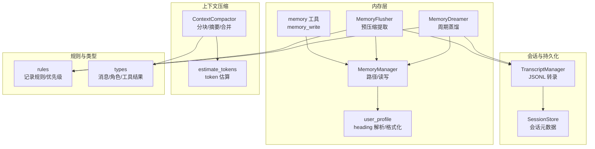
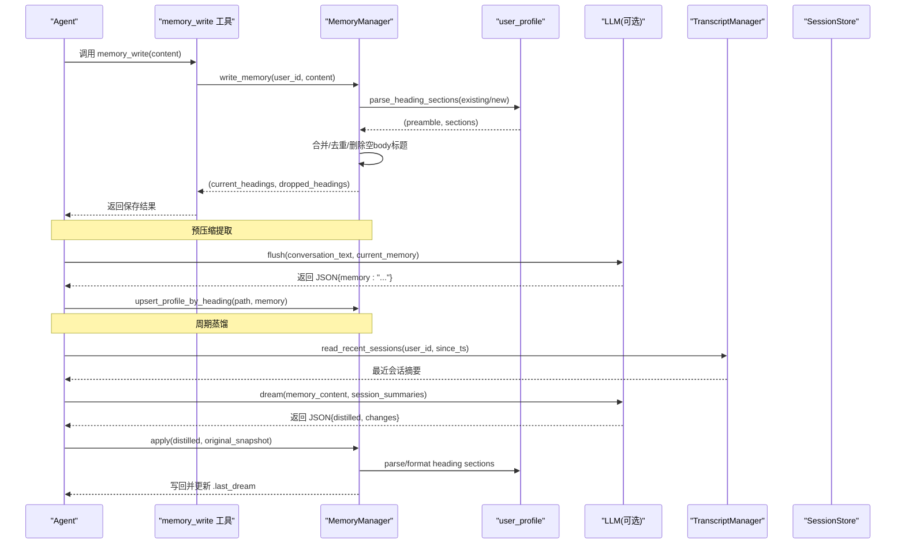
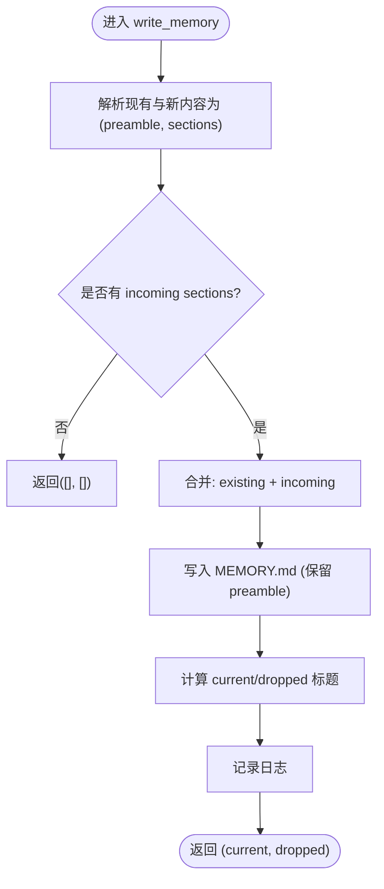
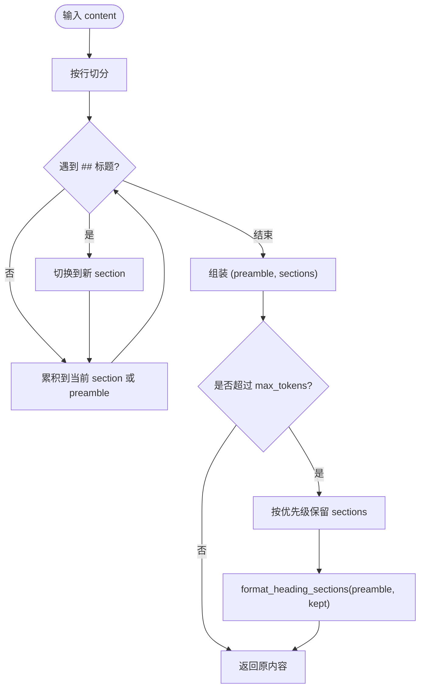
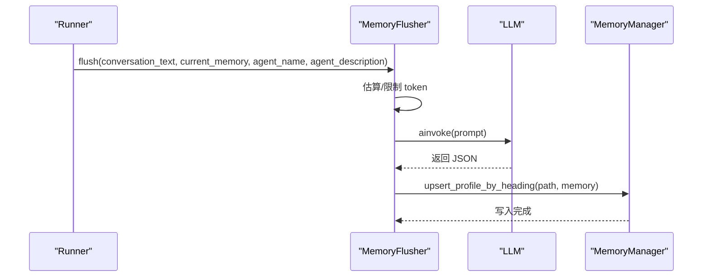
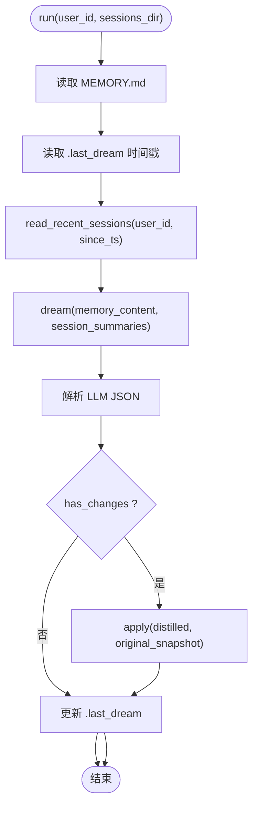
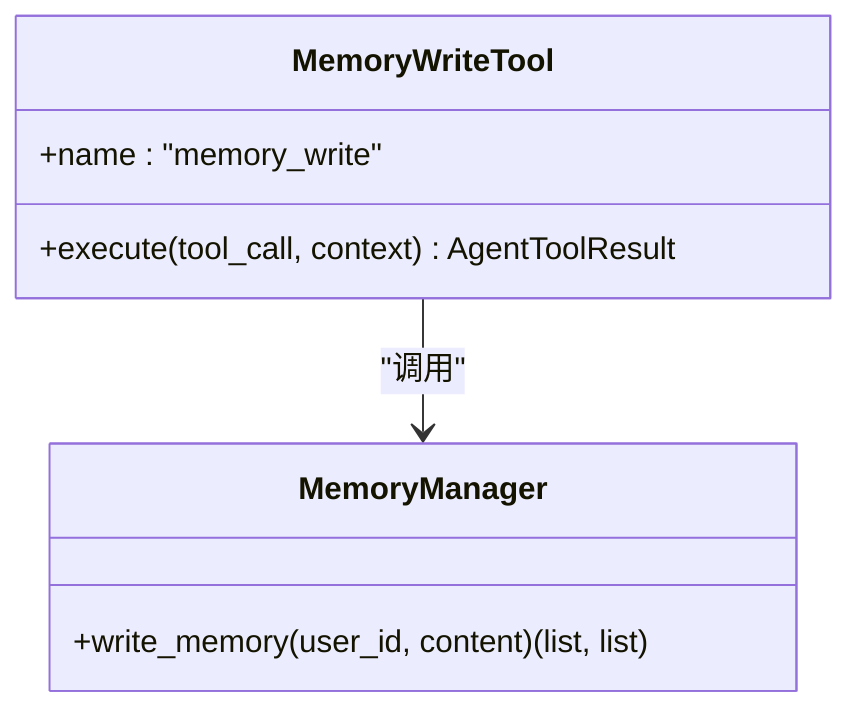
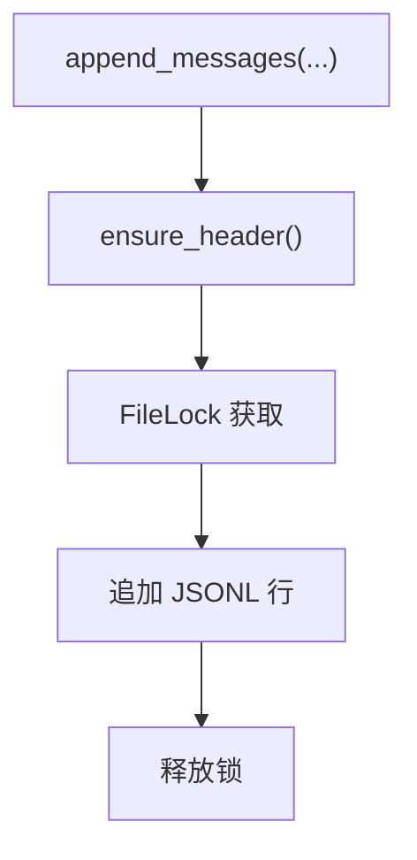
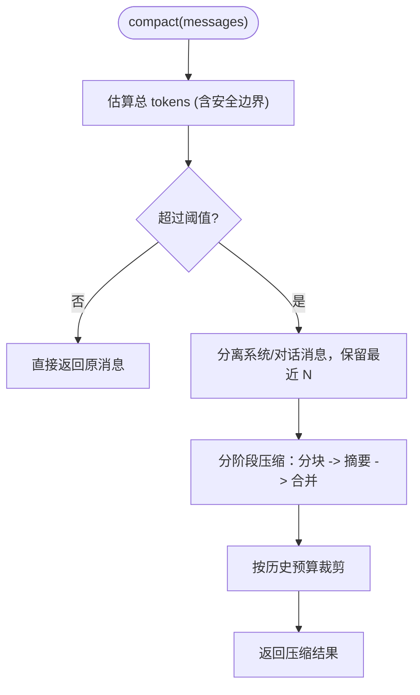
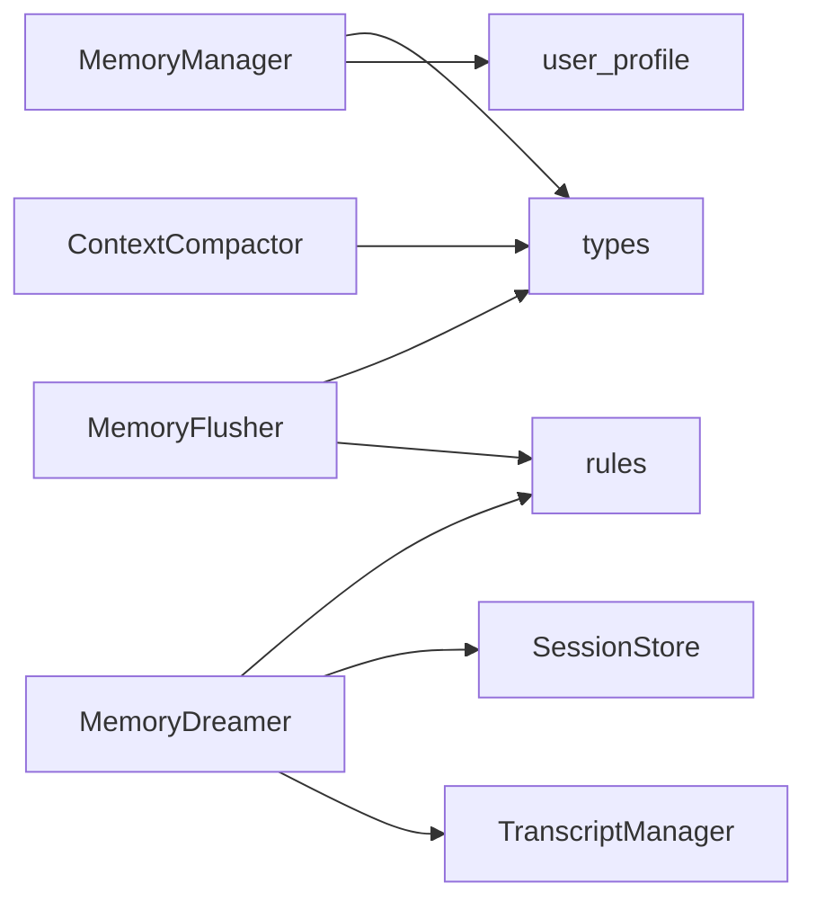

# 内存管理

<cite>
**本文引用的文件**
- [manager.py](file://src/ark_agentic/core/memory/manager.py)
- [user_profile.py](file://src/ark_agentic/core/memory/user_profile.py)
- [extractor.py](file://src/ark_agentic/core/memory/extractor.py)
- [dream.py](file://src/ark_agentic/core/memory/dream.py)
- [rules.py](file://src/ark_agentic/core/memory/rules.py)
- [memory.py](file://src/ark_agentic/core/tools/memory.py)
- [persistence.py](file://src/ark_agentic/core/persistence.py)
- [compaction.py](file://src/ark_agentic/core/compaction.py)
- [types.py](file://src/ark_agentic/core/types.py)
- [test_memory_tools.py](file://tests/unit/core/test_memory_tools.py)
- [test_memory_unified.py](file://tests/unit/core/test_memory_unified.py)
</cite>

## 目录
1. [简介](#简介)
2. [项目结构](#项目结构)
3. [核心组件](#核心组件)
4. [架构总览](#架构总览)
5. [详细组件分析](#详细组件分析)
6. [依赖关系分析](#依赖关系分析)
7. [性能考量](#性能考量)
8. [故障排除指南](#故障排除指南)
9. [结论](#结论)
10. [附录](#附录)

## 简介
本文件面向“内存管理系统”的设计与实现，聚焦于短期记忆与长期记忆的存储策略、记忆提取与压缩流程、数据持久化方案、检索与索引机制、缓存策略、生命周期管理、内存使用监控、垃圾回收与性能调优，以及配置项、扩展接口与故障排除建议。系统采用“heading-based markdown”作为统一的记忆数据模型，结合预压缩提取、周期性记忆蒸馏与上下文压缩，形成从会话到长期记忆的闭环。

## 项目结构
围绕内存管理的关键模块如下：
- 存储与路径：MemoryManager、user_profile（heading 解析/格式化）
- 记忆提取：MemoryFlusher（预压缩前的 LLM 提取）
- 记忆蒸馏：MemoryDreamer（周期性 LLM 蒸馏，合并/删除/提取）
- 工具接口：memory 工具（memory_write）
- 会话持久化：TranscriptManager/SessionStore（JSONL 会话转录与元数据）
- 上下文压缩：ContextCompactor（分块、摘要、合并）
- 类型与规则：types、rules（消息类型、角色、规则与优先级）

图表来源
- [manager.py:24-92](file://src/ark_agentic/core/memory/manager.py#L24-L92)
- [user_profile.py:26-138](file://src/ark_agentic/core/memory/user_profile.py#L26-L138)
- [extractor.py:98-187](file://src/ark_agentic/core/memory/extractor.py#L98-L187)
- [dream.py:190-323](file://src/ark_agentic/core/memory/dream.py#L190-L323)
- [memory.py:39-114](file://src/ark_agentic/core/tools/memory.py#L39-L114)
- [persistence.py:392-787](file://src/ark_agentic/core/persistence.py#L392-L787)
- [compaction.py:421-742](file://src/ark_agentic/core/compaction.py#L421-L742)
- [rules.py:7-32](file://src/ark_agentic/core/memory/rules.py#L7-L32)
- [types.py:18-422](file://src/ark_agentic/core/types.py#L18-L422)

章节来源
- [manager.py:24-92](file://src/ark_agentic/core/memory/manager.py#L24-L92)
- [user_profile.py:26-138](file://src/ark_agentic/core/memory/user_profile.py#L26-L138)
- [extractor.py:98-187](file://src/ark_agentic/core/memory/extractor.py#L98-L187)
- [dream.py:190-323](file://src/ark_agentic/core/memory/dream.py#L190-L323)
- [memory.py:39-114](file://src/ark_agentic/core/tools/memory.py#L39-L114)
- [persistence.py:392-787](file://src/ark_agentic/core/persistence.py#L392-L787)
- [compaction.py:421-742](file://src/ark_agentic/core/compaction.py#L421-L742)
- [rules.py:7-32](file://src/ark_agentic/core/memory/rules.py#L7-L32)
- [types.py:18-422](file://src/ark_agentic/core/types.py#L18-L422)

## 核心组件
- MemoryManager：负责按 user_id 定位 MEMORY.md 路径，提供读写能力；支持 heading-level upsert，空内容删除标题，返回当前与被删除的标题集合。
- user_profile：提供 heading-based markdown 的解析/格式化、按 heading 合并、按优先级截断（heading-aware truncation）。
- MemoryFlusher：在上下文压缩前，调用 LLM 从完整对话中抽取需要长期保存的信息，写入 MEMORY.md。
- MemoryDreamer：周期性蒸馏，读取近期会话摘要与当前记忆，经 LLM 合并/删除/提取，乐观合并写回。
- memory 工具：Agent 主动写入长期记忆，遵循 heading upsert 与空内容删除语义。
- TranscriptManager/SessionStore：JSONL 会话转录与元数据存储，支撑记忆蒸馏的时间窗口与会话读取。
- ContextCompactor：上下文压缩器，估算 token、自适应分块、摘要生成与合并，支持简单截断与 LLM 摘要回退。
- rules：统一的“记录/不记录”规则与 heading 优先级，贯穿提取与蒸馏。
- types：消息角色、工具结果类型、AgentMessage 等核心类型，支撑上下文与工具链。

章节来源
- [manager.py:24-92](file://src/ark_agentic/core/memory/manager.py#L24-L92)
- [user_profile.py:26-138](file://src/ark_agentic/core/memory/user_profile.py#L26-L138)
- [extractor.py:98-187](file://src/ark_agentic/core/memory/extractor.py#L98-L187)
- [dream.py:190-323](file://src/ark_agentic/core/memory/dream.py#L190-L323)
- [memory.py:39-114](file://src/ark_agentic/core/tools/memory.py#L39-L114)
- [persistence.py:392-787](file://src/ark_agentic/core/persistence.py#L392-L787)
- [compaction.py:421-742](file://src/ark_agentic/core/compaction.py#L421-L742)
- [rules.py:7-32](file://src/ark_agentic/core/memory/rules.py#L7-L32)
- [types.py:18-422](file://src/ark_agentic/core/types.py#L18-L422)

## 架构总览
系统以 MEMORY.md 为单一事实来源，通过以下路径实现记忆闭环：
- 短期记忆：会话 JSONL（TranscriptManager/SessionStore）记录原始交互
- 预压缩提取：MemoryFlusher 在压缩前抽取长期有效信息
- 周期蒸馏：MemoryDreamer 周期性合并/删除/提取，保持保守策略
- 长期记忆：heading-based markdown，heading-level upsert，空内容删除
- 上下文压缩：ContextCompactor 在推理前将历史压缩至预算内

图表来源
- [memory.py:67-108](file://src/ark_agentic/core/tools/memory.py#L67-L108)
- [manager.py:45-69](file://src/ark_agentic/core/memory/manager.py#L45-L69)
- [user_profile.py:66-94](file://src/ark_agentic/core/memory/user_profile.py#L66-L94)
- [extractor.py:108-143](file://src/ark_agentic/core/memory/extractor.py#L108-L143)
- [dream.py:289-322](file://src/ark_agentic/core/memory/dream.py#L289-L322)
- [persistence.py:99-139](file://src/ark_agentic/core/persistence.py#L99-L139)

## 详细组件分析

### MemoryManager（记忆管理器）
- 职责
  - 按 user_id 定位 MEMORY.md 路径
  - 提供 read_memory/write_memory
  - heading-level upsert：同名标题覆盖，空内容删除标题
  - 返回当前标题与被删除标题，便于审计与监控
- 关键行为
  - 不存在文件时返回空字符串
  - 无任何 “##” 标题时返回空结果
  - 保留 preamble（如标题行），合并 sections
- 并发与健壮性
  - 写入前创建父目录
  - 发现遗留 .memory 目录发出告警（不再使用）

图表来源
- [manager.py:45-69](file://src/ark_agentic/core/memory/manager.py#L45-L69)
- [user_profile.py:26-94](file://src/ark_agentic/core/memory/user_profile.py#L26-L94)

章节来源
- [manager.py:24-92](file://src/ark_agentic/core/memory/manager.py#L24-L92)
- [user_profile.py:26-94](file://src/ark_agentic/core/memory/user_profile.py#L26-L94)

### user_profile（用户记忆模型与截断）
- 数据模型
  - heading-based markdown：## 标题 + 内容
  - preamble 保留（如文件头注释）
- 操作
  - 解析/格式化：parse_heading_sections / format_heading_sections
  - upsert：同名覆盖，保留 preamble
  - 截断：按优先级保留（heading-aware），避免截断半句
- 优先级
  - 优先级顺序：身份信息 > 回复风格 > 业务偏好 > 风险偏好

图表来源
- [user_profile.py:26-138](file://src/ark_agentic/core/memory/user_profile.py#L26-L138)
- [rules.py:30-31](file://src/ark_agentic/core/memory/rules.py#L30-L31)

章节来源
- [user_profile.py:26-138](file://src/ark_agentic/core/memory/user_profile.py#L26-L138)
- [rules.py:30-31](file://src/ark_agentic/core/memory/rules.py#L30-L31)

### MemoryFlusher（预压缩记忆提取）
- 目标
  - 在上下文压缩前，从完整对话中抽取长期有效信息
- 流程
  - 限制最大 token（默认 6000），必要时截断末尾
  - 组装 prompt，调用 LLM 返回 JSON{memory: "..."}
  - 通过 upsert_profile_by_heading 写入 MEMORY.md
- 回调
  - 提供 make_pre_compact_callback，可在压缩前触发全量提取

图表来源
- [extractor.py:108-143](file://src/ark_agentic/core/memory/extractor.py#L108-L143)
- [user_profile.py:66-94](file://src/ark_agentic/core/memory/user_profile.py#L66-L94)
- [manager.py:45-69](file://src/ark_agentic/core/memory/manager.py#L45-L69)

章节来源
- [extractor.py:98-187](file://src/ark_agentic/core/memory/extractor.py#L98-L187)
- [user_profile.py:66-94](file://src/ark_agentic/core/memory/user_profile.py#L66-L94)

### MemoryDreamer（周期记忆蒸馏）
- 目标
  - 周期性将近期会话与当前记忆合并蒸馏，保守保留，避免误删
- 触发条件
  - 至少间隔 min_hours（默认 24h）
  - 或自上次蒸馏以来达到 min_sessions（默认 3）
- 流程
  - 读取 .last_dream 时间戳，限定最近会话范围
  - read_recent_sessions 汇总用户+助手对话
  - LLM 输出 JSON{distilled, changes}
  - 乐观合并：保留蒸馏期间并发写入的新标题
  - 更新 .last_dream

图表来源
- [dream.py:289-322](file://src/ark_agentic/core/memory/dream.py#L289-L322)
- [dream.py:147-176](file://src/ark_agentic/core/memory/dream.py#L147-L176)
- [persistence.py:99-139](file://src/ark_agentic/core/persistence.py#L99-L139)

章节来源
- [dream.py:190-323](file://src/ark_agentic/core/memory/dream.py#L190-L323)
- [persistence.py:99-139](file://src/ark_agentic/core/persistence.py#L99-L139)

### memory 工具（memory_write）
- 功能
  - Agent 主动写入长期记忆
  - 仅接受 heading-based markdown 片段
  - 同名覆盖，空内容删除标题
  - 返回 saved、current_headings、dropped_headings
- 参数与错误
  - content 必填；无 heading 时拒绝
  - 缺失 user:id 上下文时报错

图表来源
- [memory.py:39-114](file://src/ark_agentic/core/tools/memory.py#L39-L114)
- [manager.py:45-69](file://src/ark_agentic/core/memory/manager.py#L45-L69)

章节来源
- [memory.py:39-114](file://src/ark_agentic/core/tools/memory.py#L39-L114)
- [manager.py:45-69](file://src/ark_agentic/core/memory/manager.py#L45-L69)

### 会话持久化（TranscriptManager/SessionStore）
- TranscriptManager
  - JSONL 转录：保证文件以换行结尾，追加消息
  - 加锁（FileLock）保障并发安全
  - 读取最近内容、列出会话、删除会话
- SessionStore
  - per-user sessions.json 元数据缓存（TTL）
  - 读写/更新/删除会话条目，带锁

图表来源
- [persistence.py:444-487](file://src/ark_agentic/core/persistence.py#L444-L487)
- [persistence.py:688-787](file://src/ark_agentic/core/persistence.py#L688-L787)

章节来源
- [persistence.py:392-787](file://src/ark_agentic/core/persistence.py#L392-L787)

### 上下文压缩（ContextCompactor）
- 估算与阈值
  - estimate_tokens/estimate_message_tokens
  - 带安全边界（1.2）估算总 token
  - 触发阈值 = target_tokens × trigger_threshold
- 分块与摘要
  - 自适应分块：根据消息平均大小动态调整分块比例
  - 正常消息分块后摘要，超大消息单独处理并省略说明
  - 多阶段摘要合并，最终生成摘要消息
- 截断预算
  - prune_to_budget：按历史预算上限裁剪最早消息

图表来源
- [compaction.py:458-517](file://src/ark_agentic/core/compaction.py#L458-L517)
- [compaction.py:519-618](file://src/ark_agentic/core/compaction.py#L519-L618)
- [compaction.py:647-668](file://src/ark_agentic/core/compaction.py#L647-L668)

章节来源
- [compaction.py:34-84](file://src/ark_agentic/core/compaction.py#L34-L84)
- [compaction.py:421-742](file://src/ark_agentic/core/compaction.py#L421-L742)

## 依赖关系分析
- 组件耦合
  - MemoryManager 依赖 user_profile（heading 解析/格式化）
  - MemoryFlusher/Extractor 依赖 rules（记录规则）、types（消息类型）
  - MemoryDreamer 依赖 TranscriptManager/SessionStore（会话读取）、rules、types
  - ContextCompactor 依赖 compaction 估算与 types
- 外部依赖
  - LLM（LangChain BaseChatModel）：用于提取与蒸馏
  - 文件系统：MEMORY.md、JSONL 会话文件、.last_dream 时间戳
- 潜在循环依赖
  - 未见循环导入；模块间通过函数/类调用解耦

图表来源
- [manager.py:51-51](file://src/ark_agentic/core/memory/manager.py#L51-L51)
- [extractor.py:16-16](file://src/ark_agentic/core/memory/extractor.py#L16-L16)
- [dream.py:20-21](file://src/ark_agentic/core/memory/dream.py#L20-L21)
- [persistence.py:392-407](file://src/ark_agentic/core/persistence.py#L392-L407)
- [compaction.py:12-14](file://src/ark_agentic/core/compaction.py#L12-L14)

章节来源
- [manager.py:51-51](file://src/ark_agentic/core/memory/manager.py#L51-L51)
- [extractor.py:16-16](file://src/ark_agentic/core/memory/extractor.py#L16-L16)
- [dream.py:20-21](file://src/ark_agentic/core/memory/dream.py#L20-L21)
- [persistence.py:392-407](file://src/ark_agentic/core/persistence.py#L392-L407)
- [compaction.py:12-14](file://src/ark_agentic/core/compaction.py#L12-L14)

## 性能考量
- Token 估算
  - 字符/词估算，中文约 0.7 token/字，英文约 1.3 token/词，消息结构开销 +4
  - 生产建议：使用 tiktoken 或模型自带 tokenizer
- 压缩策略
  - 安全边界 1.2，避免估算误差导致溢出
  - 自适应分块比例随消息平均大小动态调整
  - 超大消息单独处理并省略说明，避免摘要失败
- I/O 与锁
  - JSONL 追加前保证文件以换行结尾，避免损坏
  - FileLock 跨平台（Unix 使用 O_EXCL，Windows 使用文件存在性）
- 内存与磁盘
  - MEMORY.md 采用 heading-level upsert，避免全量重写
  - 截断按优先级保留，避免频繁大文件写入
  - .last_dream 降低蒸馏频率，减少 LLM 调用成本

[本节为通用性能讨论，无需特定文件来源]

## 故障排除指南
- 写入失败或无效果
  - 确认 content 为 heading-based markdown（至少包含一个 “## 标题”）
  - 空内容会删除对应标题；若未生效，检查是否存在同名标题
  - 检查工作目录权限与磁盘空间
- 蒸馏未触发
  - 检查 .last_dream 文件是否存在与时间戳
  - 确认自上次蒸馏以来会话数量达到阈值（默认 3）
- LLM 返回异常
  - 提取/蒸馏返回非 JSON 时会记录警告；检查 prompt 与模型响应格式
  - 若摘要失败，回退为简单截断
- 会话读取异常
  - JSONL 行格式错误会抛出 RawJsonlValidationError
  - 使用 FileLock 避免并发写入冲突

章节来源
- [memory.py:73-108](file://src/ark_agentic/core/tools/memory.py#L73-L108)
- [manager.py:45-69](file://src/ark_agentic/core/memory/manager.py#L45-L69)
- [dream.py:224-234](file://src/ark_agentic/core/memory/dream.py#L224-L234)
- [persistence.py:598-635](file://src/ark_agentic/core/persistence.py#L598-L635)

## 结论
本内存管理系统以 heading-based markdown 为核心数据模型，结合预压缩提取与周期性蒸馏，形成从短期会话到长期记忆的稳健闭环。通过规则统一、乐观合并、文件锁与安全边界等机制，系统在功能与可靠性之间取得平衡。生产环境中建议引入更精确的 token 估算与 LLM 摘要，同时完善监控与告警，持续优化压缩阈值与触发策略。

[本节为总结性内容，无需特定文件来源]

## 附录

### 配置选项与扩展接口
- MemoryManager
  - workspace_dir：工作目录（MEMORY.md 存放位置）
- MemoryFlusher
  - llm_factory：延迟获取 LLM 实例（依赖注入）
  - _MAX_FLUSH_TOKENS：最大输入 token 限制
- MemoryDreamer
  - llm_factory：延迟获取 LLM 实例
  - should_dream/min_hours/min_sessions：蒸馏触发策略
- ContextCompactor
  - context_window/output_reserve/system_reserve/target_tokens/trigger_threshold
  - target_chunk_tokens/max_chunk_tokens/summary_max_tokens/preserve_recent
  - summary_parts/max_history_share
- rules
  - MEMORY_FILTER_RULES：记录/不记录规则
  - HEADING_PRIORITY：保留优先级

章节来源
- [manager.py:18-35](file://src/ark_agentic/core/memory/manager.py#L18-L35)
- [extractor.py:28-106](file://src/ark_agentic/core/memory/extractor.py#L28-L106)
- [dream.py:147-182](file://src/ark_agentic/core/memory/dream.py#L147-L182)
- [compaction.py:355-407](file://src/ark_agentic/core/compaction.py#L355-L407)
- [rules.py:7-31](file://src/ark_agentic/core/memory/rules.py#L7-L31)

### 数据模型与索引机制
- 数据模型
  - MEMORY.md：heading-based markdown（preamble + sections）
  - JSONL：会话转录（消息列表）
  - sessions.json：会话元数据（per-user）
- 索引与检索
  - 无专用索引；检索基于 heading 名称匹配与内容扫描
  - 截断与优先级保留确保检索效率与一致性

章节来源
- [user_profile.py:26-63](file://src/ark_agentic/core/memory/user_profile.py#L26-L63)
- [persistence.py:50-101](file://src/ark_agentic/core/persistence.py#L50-L101)
- [persistence.py:637-686](file://src/ark_agentic/core/persistence.py#L637-L686)

### 生命周期管理与监控
- 生命周期
  - 创建：首次写入时创建目录与文件
  - 更新：heading-level upsert；空内容删除标题
  - 蒸馏：周期性合并/删除/提取
  - 截断：按优先级保留，避免超限
- 监控
  - 日志记录：写入、蒸馏、摘要失败、截断警告
  - 统计：压缩前后消息数与 token 数

章节来源
- [manager.py:66-69](file://src/ark_agentic/core/memory/manager.py#L66-L69)
- [dream.py:247-287](file://src/ark_agentic/core/memory/dream.py#L247-L287)
- [user_profile.py:133-137](file://src/ark_agentic/core/memory/user_profile.py#L133-L137)
- [compaction.py:485-508](file://src/ark_agentic/core/compaction.py#L485-L508)

### 测试验证要点
- memory_write 工具
  - heading upsert、空内容删除、并发安全
- 统一记忆模型
  - 单文件 per-user、preamble 保留、预压缩提取写入
- 规则与优先级
  - 记录/不记录规则、heading 优先级

章节来源
- [test_memory_tools.py:40-162](file://tests/unit/core/test_memory_tools.py#L40-L162)
- [test_memory_unified.py:35-160](file://tests/unit/core/test_memory_unified.py#L35-L160)