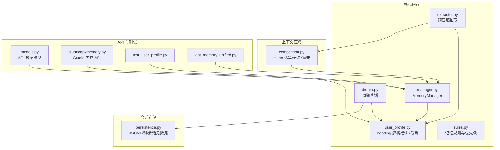
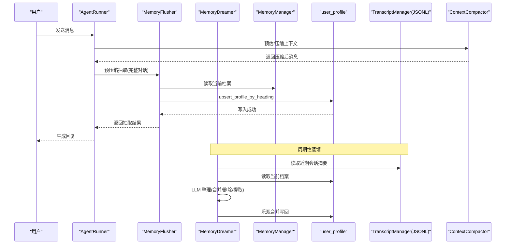
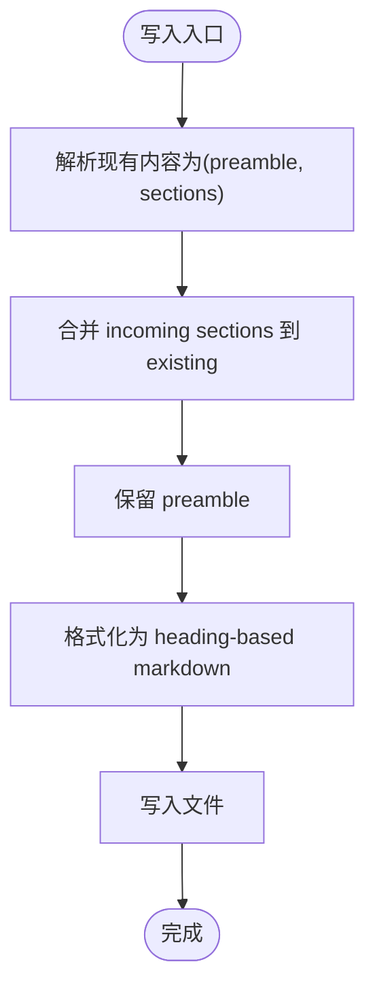
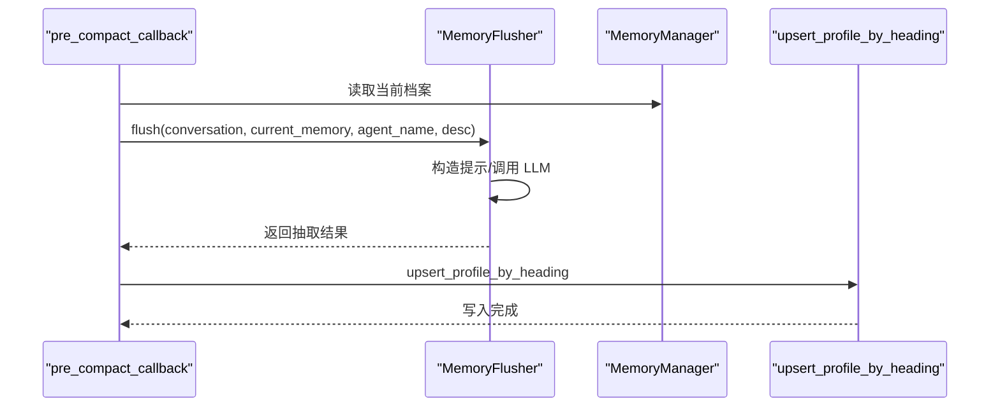
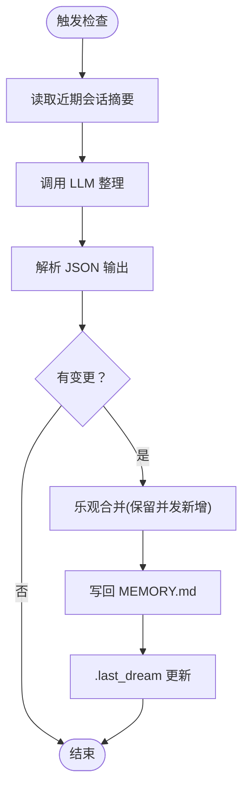
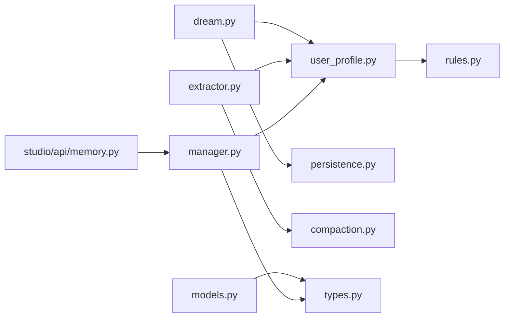

# 用户档案

<cite>
**本文档引用的文件**   
- [user_profile.py](file://src/ark_agentic/core/memory/user_profile.py)
- [manager.py](file://src/ark_agentic/core/memory/manager.py)
- [rules.py](file://src/ark_agentic/core/memory/rules.py)
- [dream.py](file://src/ark_agentic/core/memory/dream.py)
- [extractor.py](file://src/ark_agentic/core/memory/extractor.py)
- [compaction.py](file://src/ark_agentic/core/compaction.py)
- [types.py](file://src/ark_agentic/core/types.py)
- [models.py](file://src/ark_agentic/api/models.py)
- [persistence.py](file://src/ark_agentic/core/persistence.py)
- [memory.py](file://src/ark_agentic/studio/api/memory.py)
- [test_user_profile.py](file://tests/unit/core/test_user_profile.py)
- [test_memory_unified.py](file://tests/unit/core/test_memory_unified.py)
</cite>

## 目录
1. [简介](#简介)
2. [项目结构](#项目结构)
3. [核心组件](#核心组件)
4. [架构总览](#架构总览)
5. [详细组件分析](#详细组件分析)
6. [依赖关系分析](#依赖关系分析)
7. [性能考量](#性能考量)
8. [故障排查指南](#故障排查指南)
9. [结论](#结论)
10. [附录](#附录)

## 简介
本文件面向“用户档案管理”子系统，系统性阐述用户档案(UserProfile)的结构设计、数据序列化与版本管理、隐私与安全、访问控制与审计、以及扩展接口与批量操作能力。系统采用“heading-based markdown”的轻量持久化模型，结合预压缩记忆抽取、周期性记忆蒸馏与上下文压缩，形成从对话到长期记忆的闭环。

## 项目结构
用户档案相关代码主要分布在以下模块：
- 核心内存与档案：user_profile、manager、rules、dream、extractor
- 上下文压缩与摘要：compaction
- 会话持久化：persistence（JSONL 转录）
- API 数据模型：models
- Studio 内存 API：studio/api/memory
- 单元测试：tests 下的 user_profile 与 memory_unified

图表来源
- [user_profile.py:1-138](file://src/ark_agentic/core/memory/user_profile.py#L1-L138)
- [manager.py:1-92](file://src/ark_agentic/core/memory/manager.py#L1-L92)
- [rules.py:1-32](file://src/ark_agentic/core/memory/rules.py#L1-L32)
- [dream.py:1-323](file://src/ark_agentic/core/memory/dream.py#L1-L323)
- [extractor.py:1-187](file://src/ark_agentic/core/memory/extractor.py#L1-L187)
- [compaction.py:1-742](file://src/ark_agentic/core/compaction.py#L1-L742)
- [persistence.py:1-787](file://src/ark_agentic/core/persistence.py#L1-L787)
- [models.py:1-104](file://src/ark_agentic/api/models.py#L1-L104)
- [memory.py:1-160](file://src/ark_agentic/studio/api/memory.py#L1-L160)
- [test_user_profile.py:1-240](file://tests/unit/core/test_user_profile.py#L1-L240)
- [test_memory_unified.py:1-160](file://tests/unit/core/test_memory_unified.py#L1-L160)

章节来源
- [user_profile.py:1-138](file://src/ark_agentic/core/memory/user_profile.py#L1-L138)
- [manager.py:1-92](file://src/ark_agentic/core/memory/manager.py#L1-L92)
- [rules.py:1-32](file://src/ark_agentic/core/memory/rules.py#L1-L32)
- [dream.py:1-323](file://src/ark_agentic/core/memory/dream.py#L1-L323)
- [extractor.py:1-187](file://src/ark_agentic/core/memory/extractor.py#L1-L187)
- [compaction.py:1-742](file://src/ark_agentic/core/compaction.py#L1-L742)
- [persistence.py:1-787](file://src/ark_agentic/core/persistence.py#L1-L787)
- [models.py:1-104](file://src/ark_agentic/api/models.py#L1-L104)
- [memory.py:1-160](file://src/ark_agentic/studio/api/memory.py#L1-L160)
- [test_user_profile.py:1-240](file://tests/unit/core/test_user_profile.py#L1-L240)
- [test_memory_unified.py:1-160](file://tests/unit/core/test_memory_unified.py#L1-L160)

## 核心组件
- heading-based 用户档案：以“## 标题 + 内容”的 Markdown 片段组织，支持按标题 upsert 合并、保留前言、截断与优先级保留。
- MemoryManager：提供按 user_id 的 MEMORY.md 路径解析与读写封装。
- 记忆规则与优先级：统一“记录/不记录”标准与注入优先级，确保一致性。
- 预压缩抽取 MemoryFlusher：在上下文压缩前，从完整对话中抽取需长期保存的信息写入档案。
- 周期蒸馏 MemoryDreamer：定期读取近期会话摘要与当前档案，经 LLM 整理后乐观合并。
- 上下文压缩 Compaction：估算 token、自适应分块、摘要生成与裁剪，保障上下文窗口。
- 会话持久化 Persistence：JSONL 转录、文件锁、会话元数据与缓存。
- Studio 内存 API：扫描、读取与编辑 MEMORY.md 的受控接口。

章节来源
- [user_profile.py:26-138](file://src/ark_agentic/core/memory/user_profile.py#L26-L138)
- [manager.py:18-92](file://src/ark_agentic/core/memory/manager.py#L18-L92)
- [rules.py:7-31](file://src/ark_agentic/core/memory/rules.py#L7-L31)
- [extractor.py:98-187](file://src/ark_agentic/core/memory/extractor.py#L98-L187)
- [dream.py:190-323](file://src/ark_agentic/core/memory/dream.py#L190-L323)
- [compaction.py:34-742](file://src/ark_agentic/core/compaction.py#L34-L742)
- [persistence.py:392-787](file://src/ark_agentic/core/persistence.py#L392-L787)
- [memory.py:105-160](file://src/ark_agentic/studio/api/memory.py#L105-L160)

## 架构总览
用户档案贯穿“对话 → 记忆抽取 → 长期档案 → 系统提示注入 → 周期蒸馏”的闭环，同时通过上下文压缩与会话 JSONL 存储保证性能与可观测性。

图表来源
- [extractor.py:152-187](file://src/ark_agentic/core/memory/extractor.py#L152-L187)
- [dream.py:289-323](file://src/ark_agentic/core/memory/dream.py#L289-L323)
- [manager.py:41-70](file://src/ark_agentic/core/memory/manager.py#L41-L70)
- [user_profile.py:66-94](file://src/ark_agentic/core/memory/user_profile.py#L66-L94)
- [compaction.py:458-518](file://src/ark_agentic/core/compaction.py#L458-L518)
- [persistence.py:488-508](file://src/ark_agentic/core/persistence.py#L488-L508)

## 详细组件分析

### heading-based 用户档案与序列化
- 结构：以“## 标题 + 内容”片段组织，支持前言(preamble)保留；空内容标题视为删除。
- upsert 语义：同名标题覆盖，新增标题追加，保留前言。
- 截断策略：按 HEADING_PRIORITY 优先保留，确保不截断半句。
- 令牌估算：提供 estimate_tokens 估算，配合压缩与蒸馏使用。

图表来源
- [user_profile.py:26-94](file://src/ark_agentic/core/memory/user_profile.py#L26-L94)
- [user_profile.py:96-138](file://src/ark_agentic/core/memory/user_profile.py#L96-L138)
- [rules.py:30](file://src/ark_agentic/core/memory/rules.py#L30)

章节来源
- [user_profile.py:26-138](file://src/ark_agentic/core/memory/user_profile.py#L26-L138)
- [rules.py:30](file://src/ark_agentic/core/memory/rules.py#L30)

### MemoryManager 与路径管理
- 提供 memory_path(user_id)、read_memory(user_id)、write_memory(user_id, content)。
- write_memory 返回当前标题集合与被删除标题集合，便于审计与追踪。

章节来源
- [manager.py:18-92](file://src/ark_agentic/core/memory/manager.py#L18-L92)

### 记忆规则与注入优先级
- 记录/不记录清单：统一“长期有效信息/短期一次性信息”的判定标准。
- 注入优先级：身份信息 > 回复风格 > 业务偏好 > 风险偏好，确保系统提示注入时的权重。

章节来源
- [rules.py:7-31](file://src/ark_agentic/core/memory/rules.py#L7-L31)

### 预压缩记忆抽取 MemoryFlusher
- 在上下文压缩前，从完整对话中抽取需长期保存的信息，写入 MEMORY.md。
- 通过回调在压缩前触发，确保抽取与压缩顺序正确。
- 限制抽取上下文长度，避免超限。

图表来源
- [extractor.py:152-187](file://src/ark_agentic/core/memory/extractor.py#L152-L187)
- [extractor.py:108-151](file://src/ark_agentic/core/memory/extractor.py#L108-L151)
- [user_profile.py:66-94](file://src/ark_agentic/core/memory/user_profile.py#L66-L94)

章节来源
- [extractor.py:98-187](file://src/ark_agentic/core/memory/extractor.py#L98-L187)

### 周期蒸馏 MemoryDreamer
- 定期读取近期会话摘要与当前档案，经 LLM 整理后乐观合并，保留并发写入的新标题。
- 通过 .last_dream 时间戳控制蒸馏频率，满足会话数量阈值才触发。

图表来源
- [dream.py:147-176](file://src/ark_agentic/core/memory/dream.py#L147-L176)
- [dream.py:289-323](file://src/ark_agentic/core/memory/dream.py#L289-L323)

章节来源
- [dream.py:190-323](file://src/ark_agentic/core/memory/dream.py#L190-L323)

### 上下文压缩与摘要
- 估算 token、自适应分块、摘要生成与裁剪，保障上下文窗口。
- 提供 SimpleSummarizer 与 LLMSummarizer 两种摘要策略，失败时回退。

章节来源
- [compaction.py:34-742](file://src/ark_agentic/core/compaction.py#L34-L742)

### 会话持久化与文件锁
- JSONL 转录：SessionHeader/MessageEntry 序列化/反序列化。
- 文件锁：跨平台文件锁，避免并发写入冲突。
- 会话元数据：sessions.json 缓存与锁，支持增删改查。

章节来源
- [persistence.py:392-787](file://src/ark_agentic/core/persistence.py#L392-L787)

### Studio 内存 API
- 列表扫描：扫描工作区内可发现的 MEMORY.md 文件，按用户分组。
- 内容读取/写入：受路径遍历保护，支持按相对路径读取与写入。

章节来源
- [memory.py:105-160](file://src/ark_agentic/studio/api/memory.py#L105-L160)

## 依赖关系分析

图表来源
- [user_profile.py:1-138](file://src/ark_agentic/core/memory/user_profile.py#L1-L138)
- [manager.py:1-92](file://src/ark_agentic/core/memory/manager.py#L1-L92)
- [rules.py:1-32](file://src/ark_agentic/core/memory/rules.py#L1-L32)
- [extractor.py:1-187](file://src/ark_agentic/core/memory/extractor.py#L1-L187)
- [dream.py:1-323](file://src/ark_agentic/core/memory/dream.py#L1-L323)
- [persistence.py:1-787](file://src/ark_agentic/core/persistence.py#L1-L787)
- [compaction.py:1-742](file://src/ark_agentic/core/compaction.py#L1-L742)
- [types.py:1-422](file://src/ark_agentic/core/types.py#L1-L422)
- [models.py:1-104](file://src/ark_agentic/api/models.py#L1-L104)
- [memory.py:1-160](file://src/ark_agentic/studio/api/memory.py#L1-L160)

章节来源
- [user_profile.py:1-138](file://src/ark_agentic/core/memory/user_profile.py#L1-L138)
- [manager.py:1-92](file://src/ark_agentic/core/memory/manager.py#L1-L92)
- [rules.py:1-32](file://src/ark_agentic/core/memory/rules.py#L1-L32)
- [extractor.py:1-187](file://src/ark_agentic/core/memory/extractor.py#L1-L187)
- [dream.py:1-323](file://src/ark_agentic/core/memory/dream.py#L1-L323)
- [persistence.py:1-787](file://src/ark_agentic/core/persistence.py#L1-L787)
- [compaction.py:1-742](file://src/ark_agentic/core/compaction.py#L1-L742)
- [types.py:1-422](file://src/ark_agentic/core/types.py#L1-L422)
- [models.py:1-104](file://src/ark_agentic/api/models.py#L1-L104)
- [memory.py:1-160](file://src/ark_agentic/studio/api/memory.py#L1-L160)

## 性能考量
- token 估算与安全边界：提供简化估算，实际建议使用模型 tokenizer。
- 自适应分块与摘要：根据消息平均大小动态调整分块比例，避免超上下文。
- 截断优先级：heading-aware 截断，优先保留高价值头部。
- 文件锁与 JSONL：避免并发写入导致的损坏，保证会话转录可靠性。
- 缓存与 TTL：会话元数据 sessions.json 带 TTL 缓存，降低频繁 IO。

章节来源
- [compaction.py:34-742](file://src/ark_agentic/core/compaction.py#L34-L742)
- [persistence.py:688-787](file://src/ark_agentic/core/persistence.py#L688-L787)

## 故障排查指南
- 写入无 heading：upsert 会跳过无 heading 的内容，确认输入是否包含“## 标题”。
- 路径遍历保护：Studio API 对 file_path 进行绝对路径解析与遍历检查，拒绝越权访问。
- 文件锁超时：JSONL 写入使用 FileLock，若超时检查锁文件是否过期并清理。
- LLM 摘要失败：LLMSummarizer 失败时回退 SimpleSummarizer，检查网络与模型配置。
- 并发写入：MemoryDreamer 采用乐观合并，保留并发期间新增的标题，避免丢失。

章节来源
- [user_profile.py:66-94](file://src/ark_agentic/core/memory/user_profile.py#L66-L94)
- [memory.py:83-89](file://src/ark_agentic/studio/api/memory.py#L83-L89)
- [persistence.py:264-387](file://src/ark_agentic/core/persistence.py#L264-L387)
- [dream.py:224-235](file://src/ark_agentic/core/memory/dream.py#L224-L235)

## 结论
本系统以 heading-based markdown 为核心，结合预压缩抽取、周期蒸馏与上下文压缩，形成高效稳定的用户档案管理闭环。通过严格的规则与优先级、文件锁与 JSONL 转录、以及受控的 Studio API，兼顾了易用性、安全性与可维护性。对于扩展与批量操作，建议在现有 upsert 与 Studio API 基础上增加批量写入与字段校验层，以进一步提升吞吐与一致性。

## 附录

### 用户档案数据模型与序列化
- 结构：preamble + {heading: content}
- 序列化：parse_heading_sections/format_heading_sections
- 版本管理：当前为单文件 per user，无显式版本号；可通过 heading 内容语义演进
- 迁移策略：建议在规则中新增 heading 时提供迁移脚本，将旧字段映射到新 heading

章节来源
- [user_profile.py:26-94](file://src/ark_agentic/core/memory/user_profile.py#L26-L94)
- [rules.py:7-31](file://src/ark_agentic/core/memory/rules.py#L7-L31)

### 隐私保护、数据加密与访问控制
- 隐私保护：通过规则限定“记录/不记录”，避免敏感短期信息进入档案
- 加密存储：当前未见内置加密实现，建议在文件系统层面或引入透明加密
- 访问控制：Studio API 通过路径遍历检查与用户认证接口保护，建议结合 RBAC

章节来源
- [rules.py:7-28](file://src/ark_agentic/core/memory/rules.py#L7-L28)
- [memory.py:83-89](file://src/ark_agentic/studio/api/memory.py#L83-L89)

### 审计日志
- 写入日志：upsert_profile_by_heading 记录写入的 heading 数量
- 截断日志：truncate_profile 记录 token 前后对比
- 蒸馏日志：MemoryDreamer 记录变更摘要与应用结果

章节来源
- [user_profile.py:91-94](file://src/ark_agentic/core/memory/user_profile.py#L91-L94)
- [user_profile.py:133-137](file://src/ark_agentic/core/memory/user_profile.py#L133-L137)
- [dream.py:248-288](file://src/ark_agentic/core/memory/dream.py#L248-L288)

### 扩展接口与批量操作
- 扩展接口：MemoryManager 的 write_memory 返回当前/删除标题集合，便于审计
- 批量操作：建议在 Studio API 增加批量写入端点，结合规则校验与事务性锁

章节来源
- [manager.py:45-70](file://src/ark_agentic/core/memory/manager.py#L45-L70)
- [memory.py:105-160](file://src/ark_agentic/studio/api/memory.py#L105-L160)

### 用户画像生成、行为分析与个性化推荐
- 画像生成：MemoryDreamer 与 MemoryFlusher 从对话中抽取偏好与特征，形成 heading-based 画像
- 行为分析：结合会话摘要与历史，识别交互模式与偏好变化
- 推荐实现：可在工具层基于档案 heading 生成个性化策略，或在前端渲染 A2UI 卡片

章节来源
- [dream.py:35-66](file://src/ark_agentic/core/memory/dream.py#L35-L66)
- [extractor.py:41-61](file://src/ark_agentic/core/memory/extractor.py#L41-L61)