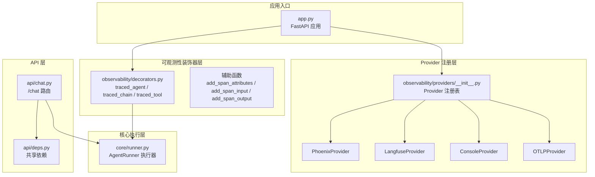
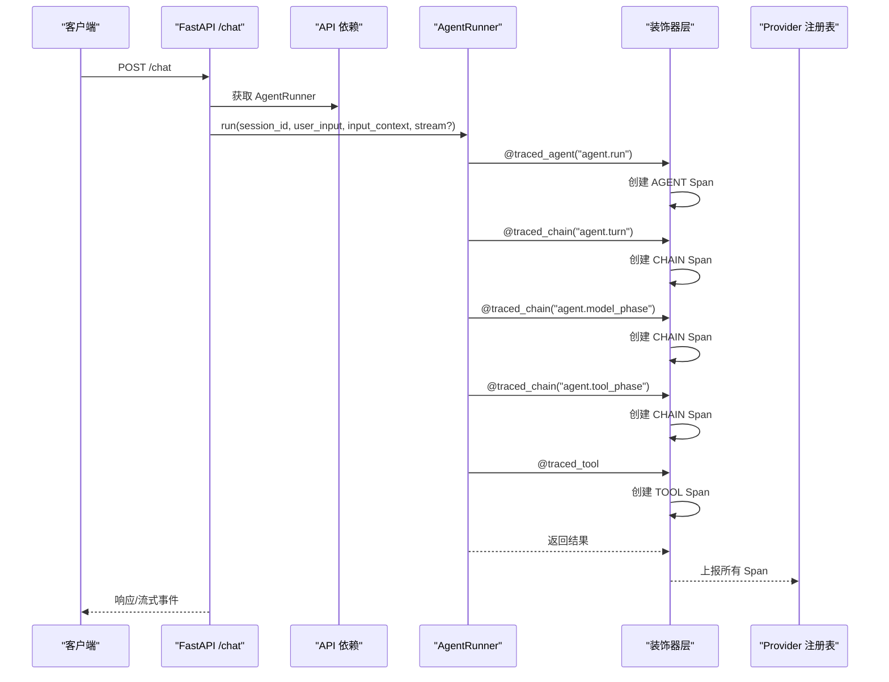
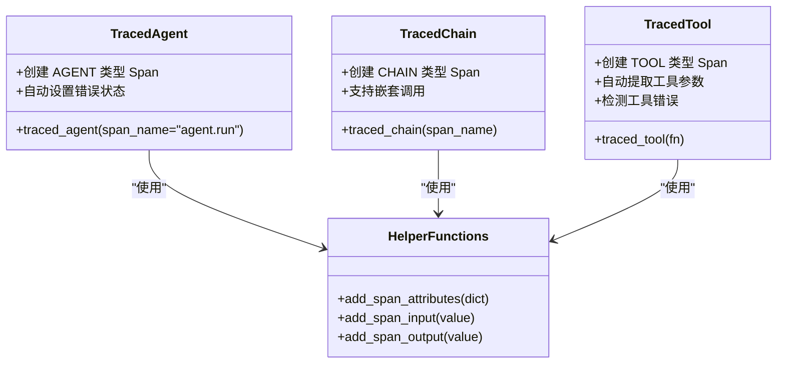
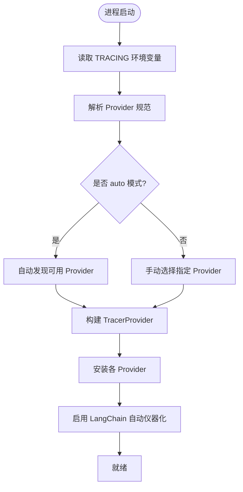
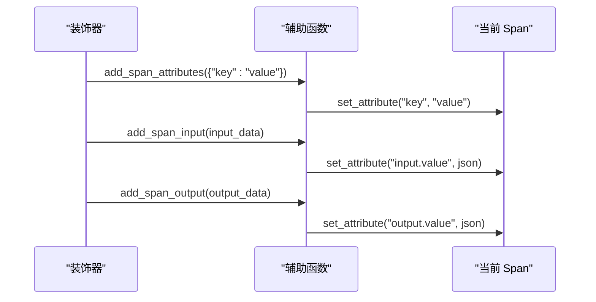
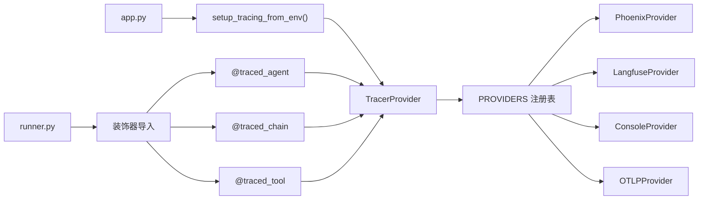

# 可观测性与监控

<cite>
**本文引用的文件**
- [app.py](file://src/ark_agentic/app.py)
- [decorators.py](file://src/ark_agentic/core/observability/decorators.py)
- [tracing.py](file://src/ark_agentic/core/observability/tracing.py)
- [providers/__init__.py](file://src/ark_agentic/core/observability/providers/__init__.py)
- [providers/phoenix.py](file://src/ark_agentic/core/observability/providers/phoenix.py)
- [providers/langfuse.py](file://src/ark_agentic/core/observability/providers/langfuse.py)
- [providers/console.py](file://src/ark_agentic/core/observability/providers/console.py)
- [providers/otlp.py](file://src/ark_agentic/core/observability/providers/otlp.py)
- [runner.py](file://src/ark_agentic/core/runner.py)
- [chat.py](file://src/ark_agentic/api/chat.py)
- [deps.py](file://src/ark_agentic/api/deps.py)
- [.env-sample](file://.env-sample)
- [test_tracing.py](file://tests/unit/core/test_tracing.py)
</cite>

## 更新摘要
**所做更改**
- 完全重构可观测性系统架构，从 Phoenix 回调系统迁移到基于 OpenTelemetry 的装饰器架构
- 新增 traced_agent()、traced_chain()、traced_tool() 三个核心装饰器
- 新增 add_span_attributes()、add_span_input()、add_span_output() 三个辅助函数
- 重新设计 Provider 注册表，支持多 Provider 并行导出
- 更新环境变量配置，使用 TRACING 统一控制 Provider 选择
- 移除旧的回调系统，采用装饰器模式实现更清晰的追踪边界

## 目录
1. [简介](#简介)
2. [项目结构](#项目结构)
3. [核心组件](#核心组件)
4. [架构总览](#架构总览)
5. [组件详解](#组件详解)
6. [依赖关系分析](#依赖关系分析)
7. [性能考量](#性能考量)
8. [故障排查指南](#故障排查指南)
9. [结论](#结论)
10. [附录](#附录)

## 简介
本文件面向重构后的可观测性与监控系统，围绕基于 OpenTelemetry 的装饰器架构展开，重点说明以下方面：
- 装饰器架构设计：通过 traced_agent()、traced_chain()、traced_tool() 三个核心装饰器实现细粒度的追踪控制。
- 多 Provider 支持：统一的 Provider 注册表支持 Phoenix、Langfuse、Console、OTLP 等多种后端。
- 动态属性注入：add_span_attributes()、add_span_input()、add_span_output() 提供运行时动态属性写入。
- 环境变量驱动：TRACING 环境变量统一控制 Provider 选择和启用方式。
- 分布式追踪与链路分析：通过装饰器在执行边界创建语义化 Span，支持复杂的嵌套调用树。

## 项目结构
重构后的可观测性系统采用三层架构：业务回调层、装饰器层、Provider 注册层，形成清晰的职责分离。

**图表来源**
- [app.py:93](file://src/ark_agentic/app.py#L93)
- [decorators.py:101](file://src/ark_agentic/core/observability/decorators.py#L101)
- [providers/__init__.py:30](file://src/ark_agentic/core/observability/providers/__init__.py#L30)
- [runner.py:38](file://src/ark_agentic/core/runner.py#L38)

## 核心组件
- **装饰器层**：traced_agent()、traced_chain()、traced_tool() 三个装饰器分别处理 Agent、Chain、Tool 三类执行阶段。
- **辅助函数**：add_span_attributes()、add_span_input()、add_span_output() 提供运行时动态属性写入能力。
- **Provider 注册表**：PROVIDERS 字典统一管理所有可用的追踪后端，支持自动发现和手动选择。
- **环境变量配置**：TRACING 环境变量控制 Provider 选择，支持逗号分隔的多 Provider 组合。
- **自动仪器化**：集成 openinference-instrumentation-langchain，自动捕获 LLM 调用细节。

**章节来源**
- [decorators.py:101](file://src/ark_agentic/core/observability/decorators.py#L101)
- [decorators.py:149](file://src/ark_agentic/core/observability/decorators.py#L149)
- [providers/__init__.py:30](file://src/ark_agentic/core/observability/providers/__init__.py#L30)
- [tracing.py:56](file://src/ark_agentic/core/observability/tracing.py#L56)

## 架构总览
重构后的架构采用装饰器模式，在执行边界精确控制追踪行为，形成清晰的调用树结构。

**图表来源**
- [chat.py:27](file://src/ark_agentic/api/chat.py#L27)
- [runner.py:38](file://src/ark_agentic/core/runner.py#L38)
- [decorators.py:101](file://src/ark_agentic/core/observability/decorators.py#L101)

## 组件详解

### 装饰器架构设计
重构后的装饰器系统提供三种核心装饰器，分别处理不同类型的执行阶段：

- **traced_agent()**：包装 AgentRunner.run() 方法，创建 AGENT 类型的 Span，适用于整个 Agent 执行过程的追踪。
- **traced_chain()**：包装执行循环中的各个阶段（turn、model_phase、tool_phase），创建 CHAIN 类型的 Span，表示链式调用过程。
- **traced_tool()**：包装 ToolExecutor._execute_single() 方法，创建 TOOL 类型的 Span，自动从 ToolCall.name 获取工具名称。

**图表来源**
- [decorators.py:101](file://src/ark_agentic/core/observability/decorators.py#L101)
- [decorators.py:149](file://src/ark_agentic/core/observability/decorators.py#L149)

**章节来源**
- [decorators.py:78](file://src/ark_agentic/core/observability/decorators.py#L78)
- [decorators.py:101](file://src/ark_agentic/core/observability/decorators.py#L101)
- [decorators.py:111](file://src/ark_agentic/core/observability/decorators.py#L111)

### Provider 注册表与多后端支持
新的 Provider 注册表采用统一接口 TracingProvider，支持多种追踪后端的并行导出：

- **PhoenixProvider**：支持 Arize Phoenix 本地或远程收集器，自动仪器化支持。
- **LangfuseProvider**：支持 Langfuse Cloud，使用 Basic Auth 认证。
- **ConsoleProvider**：本地开发用控制台输出，便于调试。
- **OTLPProvider**：通用 OTLP 导出器，支持任意兼容的 OTel 收集器。

**图表来源**
- [tracing.py:56](file://src/ark_agentic/core/observability/tracing.py#L56)
- [providers/__init__.py:30](file://src/ark_agentic/core/observability/providers/__init__.py#L30)

**章节来源**
- [tracing.py:35](file://src/ark_agentic/core/observability/tracing.py#L35)
- [providers/__init__.py:30](file://src/ark_agentic/core/observability/providers/__init__.py#L30)

### 辅助函数与动态属性注入
装饰器系统提供三个辅助函数，支持运行时动态属性写入：

- **add_span_attributes()**：将字典形式的静态属性写入当前 Span，自动类型转换和空值过滤。
- **add_span_input()**：将输入值序列化为 JSON 写入 input.value 属性，便于链路分析。
- **add_span_output()**：将输出值序列化为 JSON 写入 output.value 属性，支持复杂对象结构。

**图表来源**
- [decorators.py:149](file://src/ark_agentic/core/observability/decorators.py#L149)
- [decorators.py:165](file://src/ark_agentic/core/observability/decorators.py#L165)

**章节来源**
- [decorators.py:149](file://src/ark_agentic/core/observability/decorators.py#L149)
- [decorators.py:165](file://src/ark_agentic/core/observability/decorators.py#L165)

### API 集成与生命周期管理
应用启动时通过 setup_tracing_from_env() 初始化追踪系统，支持多 Provider 并行工作：

- **启动流程**：读取 TRACING 环境变量 → 解析 Provider 规范 → 构建 TracerProvider → 安装各 Provider → 启用 LangChain 自动仪器化。
- **关闭流程**：优雅关闭所有已安装的 Provider → 清理 TracerProvider 资源。
- **错误处理**：Provider 安装失败不影响主流程，记录警告信息继续执行。

**章节来源**
- [app.py:93](file://src/ark_agentic/app.py#L93)
- [tracing.py:56](file://src/ark_agentic/core/observability/tracing.py#L56)
- [tracing.py:102](file://src/ark_agentic/core/observability/tracing.py#L102)

## 依赖关系分析
重构后的依赖关系更加清晰，采用装饰器模式替代回调系统：

**图表来源**
- [app.py:93](file://src/ark_agentic/app.py#L93)
- [runner.py:38](file://src/ark_agentic/core/runner.py#L38)
- [decorators.py:101](file://src/ark_agentic/core/observability/decorators.py#L101)

**章节来源**
- [app.py:93](file://src/ark_agentic/app.py#L93)
- [runner.py:38](file://src/ark_agentic/core/runner.py#L38)
- [decorators.py:101](file://src/ark_agentic/core/observability/decorators.py#L101)

## 性能考量
新架构在保持高性能的同时提供了更好的可观测性：

- **零成本降级**：未配置 TRACING 时使用 OpenTelemetry NoOp tracer，装饰器调用几乎无额外开销。
- **批量导出**：所有 Provider 使用 BatchSpanProcessor，减少网络往返开销。
- **内存友好**：装饰器只在执行边界创建 Span，避免持续的追踪开销。
- **自动仪器化**：LangChain 自动仪器化捕获 LLM 调用细节，无需手动添加追踪代码。

**章节来源**
- [tracing.py:64](file://src/ark_agentic/core/observability/tracing.py#L64)
- [providers/phoenix.py:32](file://src/ark_agentic/core/observability/providers/phoenix.py#L32)
- [providers/langfuse.py:40](file://src/ark_agentic/core/observability/providers/langfuse.py#L40)

## 故障排查指南
针对新架构的常见问题和解决方案：

### 环境变量配置
- **TRACING 选择**：支持 console、phoenix、langfuse、otlp 或逗号分隔的组合，auto 模式自动启用有凭据的 Provider。
- **Phoenix 配置**：PHOENIX_COLLECTOR_ENDPOINT 必填，支持本地 6006 端口。
- **Langfuse 配置**：LANGFUSE_PUBLIC_KEY 和 LANGFUSE_SECRET_KEY 必填，LANGFUSE_HOST 可选。
- **OTLP 配置**：OTEL_EXPORTER_OTLP_ENDPOINT 必填，支持自定义头部。

### Provider 初始化问题
- **自动发现失败**：检查凭据环境变量是否正确设置，查看应用启动日志中的 Provider 状态。
- **安装失败**：单个 Provider 安装失败不会影响其他 Provider，查看对应 Provider 的错误日志。
- **网络连接**：确保能够访问配置的收集器端点，检查防火墙和代理设置。

### 装饰器使用问题
- **装饰器顺序**：确保装饰器按照正确的执行顺序应用，Agent 装饰器在外层，Chain 装饰器在内层。
- **属性写入**：使用 add_span_attributes() 在装饰器内部正确写入动态属性。
- **异常处理**：装饰器自动处理异常并设置 Span 状态，检查异常类型和消息。

**章节来源**
- [.env-sample:35](file://.env-sample#L35)
- [providers/phoenix.py:18](file://src/ark_agentic/core/observability/providers/phoenix.py#L18)
- [providers/langfuse.py:19](file://src/ark_agentic/core/observability/providers/langfuse.py#L19)
- [test_tracing.py:127](file://tests/unit/core/test_tracing.py#L127)

## 结论
重构后的可观测性系统以装饰器架构为核心，提供了更清晰、更灵活的追踪能力：

- **明确的执行边界**：通过 traced_agent()、traced_chain()、traced_tool() 精确定位执行阶段。
- **统一的 Provider 管理**：PROVIDERS 注册表支持多后端并行导出，便于混合部署。
- **动态属性注入**：add_span_* 辅助函数支持运行时动态属性写入，适应复杂业务场景。
- **零成本降级**：未配置时自动降级为 NoOp tracer，不影响生产性能。
- **自动仪器化**：LangChain 自动仪器化捕获 LLM 调用细节，提供完整的端到端追踪。

建议在生产环境中：
- 使用 TRACING=auto 自动发现可用的 Provider，或明确指定需要的后端。
- 结合 Provider UI 建立关键指标看板，重点关注错误率、延迟分布和资源使用情况。
- 基于装饰器生成的语义化属性建立告警规则，实现精准的问题定位。

## 附录
- **环境变量清单**
  - TRACING：控制启用的 Provider，支持逗号分隔的多个值或 auto 模式
  - PHOENIX_COLLECTOR_ENDPOINT：Phoenix 收集器端点地址
  - LANGFUSE_PUBLIC_KEY/SECRET_KEY：Langfuse 认证凭据
  - LANGFUSE_HOST：Langfuse 服务主机地址
  - OTEL_EXPORTER_OTLP_ENDPOINT/HEADERS：OTLP 导出器配置
- **装饰器使用示例**
  - @traced_agent("agent.run")：包装 AgentRunner.run()
  - @traced_chain("agent.turn")：包装执行循环阶段
  - @traced_tool：包装工具执行方法
- **辅助函数**
  - add_span_attributes()：写入静态属性
  - add_span_input()：写入输入数据
  - add_span_output()：写入输出数据

**章节来源**
- [.env-sample:35](file://.env-sample#L35)
- [decorators.py:101](file://src/ark_agentic/core/observability/decorators.py#L101)
- [decorators.py:149](file://src/ark_agentic/core/observability/decorators.py#L149)