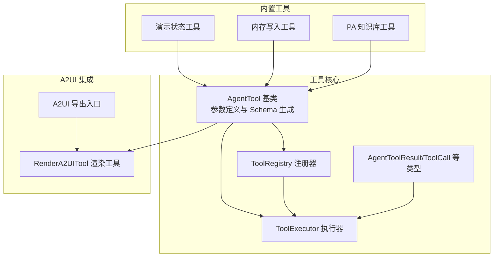
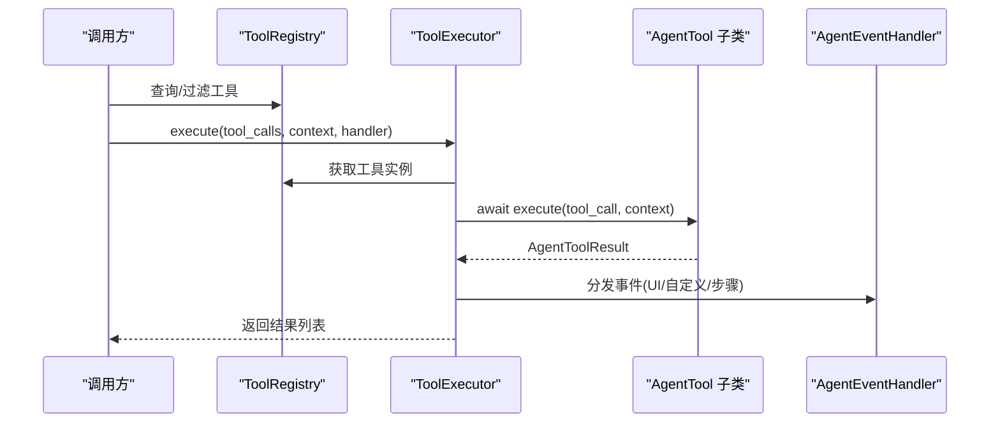
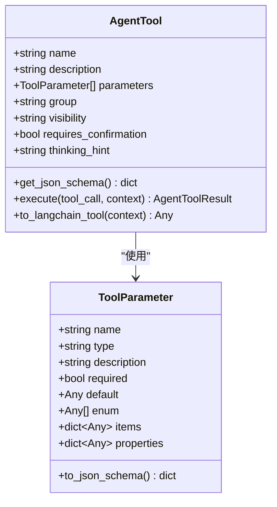
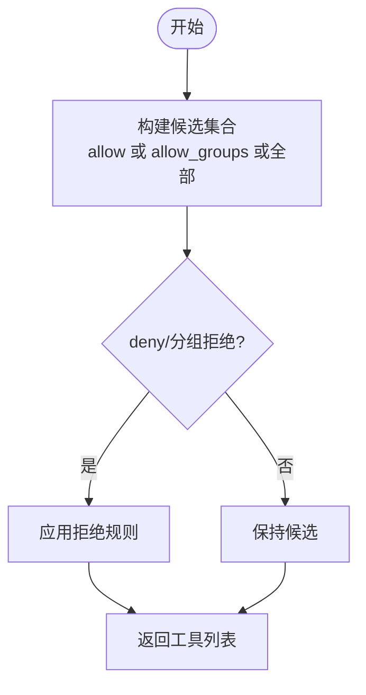
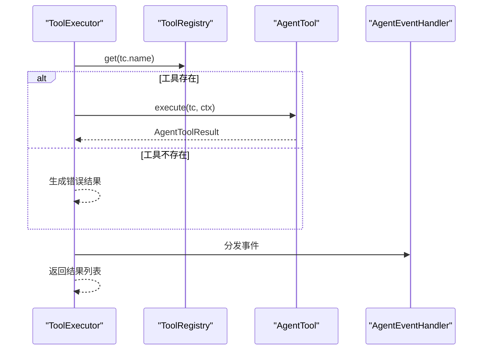
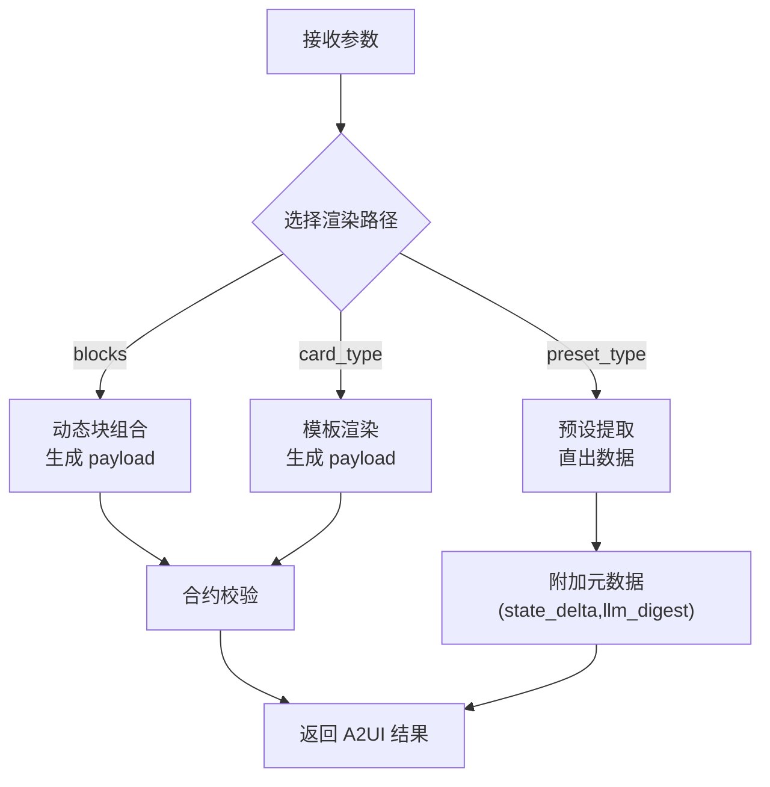
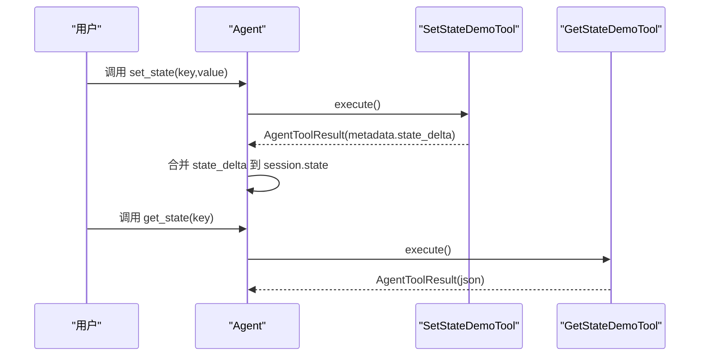
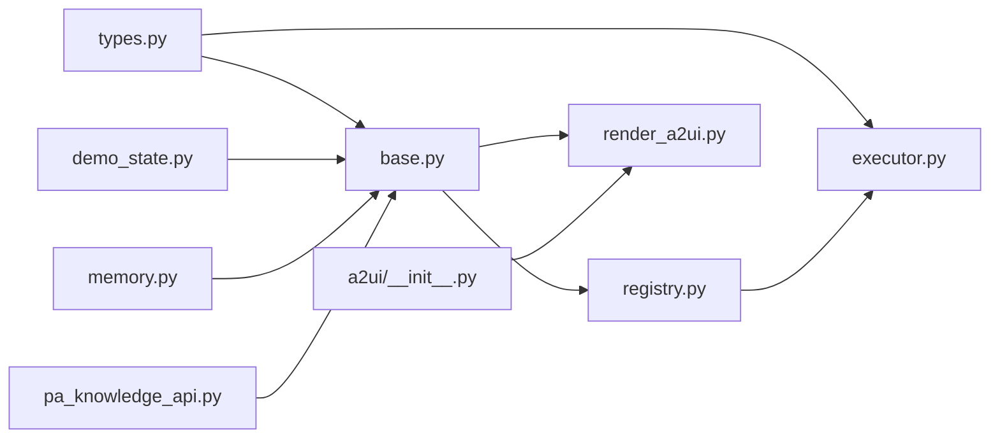

# 工具基类设计

<cite>
**本文档引用的文件**
- [base.py](file://src/ark_agentic/core/tools/base.py)
- [__init__.py](file://src/ark_agentic/core/tools/__init__.py)
- [registry.py](file://src/ark_agentic/core/tools/registry.py)
- [executor.py](file://src/ark_agentic/core/tools/executor.py)
- [types.py](file://src/ark_agentic/core/types.py)
- [__init__.py](file://src/ark_agentic/core/a2ui/__init__.py)
- [render_a2ui.py](file://src/ark_agentic/core/tools/render_a2ui.py)
- [demo_state.py](file://src/ark_agentic/core/tools/demo_state.py)
- [memory.py](file://src/ark_agentic/core/tools/memory.py)
- [pa_knowledge_api.py](file://src/ark_agentic/core/tools/pa_knowledge_api.py)
- [manage_tools.py](file://src/ark_agentic/agents/meta_builder/tools/manage_tools.py)
- [account_overview.py](file://src/ark_agentic/agents/securities/tools/agent/account_overview.py)
</cite>

## 目录
1. [简介](#简介)
2. [项目结构](#项目结构)
3. [核心组件](#核心组件)
4. [架构总览](#架构总览)
5. [详细组件分析](#详细组件分析)
6. [依赖分析](#依赖分析)
7. [性能考虑](#性能考虑)
8. [故障排查指南](#故障排查指南)
9. [结论](#结论)
10. [附录](#附录)

## 简介
本文件系统性阐述 Ark-Agentic 工具基类设计，围绕 AgentTool 抽象基类、接口规范、扩展机制、元数据定义、参数验证、JSON Schema 生成与 A2UI 集成进行深入解析。文档还提供自定义工具开发的完整指南、最佳实践与设计模式，并给出工具基类继承体系、钩子函数与回调机制的使用示例。

## 项目结构
工具系统位于 core/tools 子模块，围绕以下核心文件组织：
- 基类与参数读取：base.py
- 注册器与执行器：registry.py、executor.py
- 类型定义：types.py
- A2UI 渲染工具：render_a2ui.py
- 示例与内置工具：demo_state.py、memory.py、pa_knowledge_api.py
- 自定义工具管理：manage_tools.py
- 业务工具示例：agents/securities/tools/agent/account_overview.py

**图表来源**
- [base.py:46-163](file://src/ark_agentic/core/tools/base.py#L46-L163)
- [registry.py:14-93](file://src/ark_agentic/core/tools/registry.py#L14-L93)
- [executor.py:29-127](file://src/ark_agentic/core/tools/executor.py#L29-L127)
- [types.py:70-196](file://src/ark_agentic/core/types.py#L70-L196)
- [__init__.py:1-39](file://src/ark_agentic/core/a2ui/__init__.py#L1-L39)
- [render_a2ui.py:178-363](file://src/ark_agentic/core/tools/render_a2ui.py#L178-L363)

**章节来源**
- [base.py:1-289](file://src/ark_agentic/core/tools/base.py#L1-L289)
- [__init__.py:1-53](file://src/ark_agentic/core/tools/__init__.py#L1-L53)

## 核心组件
- AgentTool 抽象基类：定义工具元数据、参数、JSON Schema 生成、LangChain 适配与异步执行接口。
- ToolParameter：参数定义的数据结构，支持基础类型、枚举、数组项与对象属性的 JSON Schema 生成。
- ToolRegistry：工具注册、分组、筛选与 Schema 列表导出。
- ToolExecutor：工具执行器，统一调度、超时控制、错误兜底与事件分发。
- AgentToolResult/ToolCall：工具调用结果与请求载体，支持多种结果类型与事件承载。
- RenderA2UITool：统一 A2UI 渲染工具，支持 blocks、card_type、preset_type 三种渲染路径。
- 内置工具：演示状态工具、内存写入工具、PA 知识库工具等。

**章节来源**
- [base.py:16-163](file://src/ark_agentic/core/tools/base.py#L16-L163)
- [registry.py:14-178](file://src/ark_agentic/core/tools/registry.py#L14-L178)
- [executor.py:29-127](file://src/ark_agentic/core/tools/executor.py#L29-L127)
- [types.py:70-196](file://src/ark_agentic/core/types.py#L70-L196)
- [render_a2ui.py:178-363](file://src/ark_agentic/core/tools/render_a2ui.py#L178-L363)

## 架构总览
工具系统采用“抽象基类 + 注册器 + 执行器”的分层设计，结合 A2UI 渲染能力，形成从工具定义到执行、事件分发与前端渲染的完整闭环。

**图表来源**
- [registry.py:41-67](file://src/ark_agentic/core/tools/registry.py#L41-L67)
- [executor.py:43-100](file://src/ark_agentic/core/tools/executor.py#L43-L100)
- [types.py:85-196](file://src/ark_agentic/core/types.py#L85-L196)

## 详细组件分析

### AgentTool 抽象基类与参数系统
- 元数据字段：name、description、parameters、group、visibility、requires_confirmation、thinking_hint。
- 参数定义：ToolParameter 支持基础类型、枚举、数组 items、对象 properties，并可生成 JSON Schema。
- JSON Schema 生成：get_json_schema 输出 OpenAI 函数调用格式。
- LangChain 适配：to_langchain_tool 将 AgentTool.execute 包装为 StructuredTool，自动注入上下文。
- 参数读取辅助函数：提供字符串、整数、浮点、布尔、列表、字典的读取与必需参数校验。

**图表来源**
- [base.py:46-163](file://src/ark_agentic/core/tools/base.py#L46-L163)

**章节来源**
- [base.py:16-163](file://src/ark_agentic/core/tools/base.py#L16-L163)

### ToolRegistry 工具注册与筛选
- 注册与批量注册：register/register_all。
- 查找与存在性：get/get_required/has/unregister/clear。
- 分组管理：按 group 维护工具列表。
- Schema 生成：get_schemas 支持按名称、分组与排除列表筛选。
- 策略过滤：filter 支持白名单/黑名单与分组维度的组合过滤。

**图表来源**
- [registry.py:130-168](file://src/ark_agentic/core/tools/registry.py#L130-L168)

**章节来源**
- [registry.py:14-178](file://src/ark_agentic/core/tools/registry.py#L14-L178)

### ToolExecutor 工具执行与事件分发
- 执行策略：限制每轮最大调用次数，全并行执行 tool_calls。
- 超时与错误处理：统一捕获超时与异常，生成错误结果。
- 事件分发：将 AgentToolResult.events 统一分发至 AgentEventHandler，支持 UI 组件事件、自定义事件与步骤事件。

**图表来源**
- [executor.py:43-100](file://src/ark_agentic/core/tools/executor.py#L43-L100)
- [types.py:44-98](file://src/ark_agentic/core/types.py#L44-L98)

**章节来源**
- [executor.py:29-127](file://src/ark_agentic/core/tools/executor.py#L29-L127)

### A2UI 集成与 RenderA2UITool
- 三类渲染路径：
  - blocks：动态块组合，支持 Grammar-Guided Decoding 的 oneOf 约束。
  - card_type：基于模板与提取器的卡片渲染。
  - preset_type：预设类型直出前端就绪数据。
- 动态参数生成：根据配置对象动态生成 LLM 可见参数，确保互斥性与完整性。
- 严格校验：A2UI 合约校验，支持宽松/强制模式，记录警告与错误。
- 状态与摘要：自动路由 llm_digest 与 state_delta 到结果元数据。

**图表来源**
- [render_a2ui.py:328-363](file://src/ark_agentic/core/tools/render_a2ui.py#L328-L363)
- [__init__.py:1-39](file://src/ark_agentic/core/a2ui/__init__.py#L1-L39)

**章节来源**
- [render_a2ui.py:178-663](file://src/ark_agentic/core/tools/render_a2ui.py#L178-L663)
- [__init__.py:1-39](file://src/ark_agentic/core/a2ui/__init__.py#L1-L39)

### 内置工具示例

#### 演示状态工具（SetStateDemoTool/GetStateDemoTool）
- SetStateDemoTool：通过 metadata.state_delta 将键值对增量写入会话状态。
- GetStateDemoTool：从 context 读取会话状态并返回对应值。

**图表来源**
- [demo_state.py:16-113](file://src/ark_agentic/core/tools/demo_state.py#L16-L113)

**章节来源**
- [demo_state.py:16-113](file://src/ark_agentic/core/tools/demo_state.py#L16-L113)

#### 内存写入工具（MemoryWriteTool）
- 通过 MemoryManager 增量更新用户记忆，支持同名覆盖与空内容删除。
- 严格要求 context 中包含 user:id。

**章节来源**
- [memory.py:39-114](file://src/ark_agentic/core/tools/memory.py#L39-L114)

#### PA 知识库工具（PAKnowledgeAPITool）
- 支持动态 token（app_secret + token_auth_url）或静态 token。
- 并行检索多个 query，融合去重结果，带 TTL 缓存与并发锁保护。

**章节来源**
- [pa_knowledge_api.py:71-231](file://src/ark_agentic/core/tools/pa_knowledge_api.py#L71-L231)

#### 自定义工具管理（ManageToolsTool）
- 提供 list/create/update/delete/read 原生工具的能力，支持用户二次确认机制。
- 与 Studio 工具服务对接，支持脚手架生成与源码读取。

**章节来源**
- [manage_tools.py:185-315](file://src/ark_agentic/agents/meta_builder/tools/manage_tools.py#L185-L315)

#### 业务工具示例（AccountOverviewTool）
- 从 context 优先读取 user:* 前缀参数，兼容裸 key，支持账户类型切换。
- 通过服务适配器调用后端接口，写入 state_delta 以便后续工具复用。

**章节来源**
- [account_overview.py:57-108](file://src/ark_agentic/agents/securities/tools/agent/account_overview.py#L57-L108)

## 依赖分析
- AgentTool 依赖类型系统（AgentToolResult、ToolCall）与 A2UI 渲染能力。
- ToolRegistry 依赖 AgentTool，提供注册、分组与 Schema 生成。
- ToolExecutor 依赖 ToolRegistry、AgentEventHandler 与类型系统，负责执行与事件分发。
- RenderA2UITool 依赖 A2UI 模块（composer、blocks、theme、preset_registry、renderer）。
- 内置工具均继承 AgentTool，遵循统一接口与参数规范。

**图表来源**
- [types.py:70-196](file://src/ark_agentic/core/types.py#L70-L196)
- [base.py:46-163](file://src/ark_agentic/core/tools/base.py#L46-L163)
- [registry.py:14-93](file://src/ark_agentic/core/tools/registry.py#L14-L93)
- [executor.py:29-127](file://src/ark_agentic/core/tools/executor.py#L29-L127)
- [render_a2ui.py:178-363](file://src/ark_agentic/core/tools/render_a2ui.py#L178-L363)
- [__init__.py:1-39](file://src/ark_agentic/core/a2ui/__init__.py#L1-L39)

**章节来源**
- [types.py:70-196](file://src/ark_agentic/core/types.py#L70-L196)
- [base.py:46-163](file://src/ark_agentic/core/tools/base.py#L46-L163)
- [registry.py:14-93](file://src/ark_agentic/core/tools/registry.py#L14-L93)
- [executor.py:29-127](file://src/ark_agentic/core/tools/executor.py#L29-L127)
- [render_a2ui.py:178-363](file://src/ark_agentic/core/tools/render_a2ui.py#L178-L363)
- [__init__.py:1-39](file://src/ark_agentic/core/a2ui/__init__.py#L1-L39)

## 性能考虑
- 执行并发：ToolExecutor 使用 asyncio.gather 并行执行工具调用，受 max_calls_per_turn 限制，避免过载。
- 超时控制：对单个工具调用设置超时，防止阻塞影响整体流程。
- 结果聚合：PA 知识库工具并行请求多个 query，使用 gather(return_exceptions=True) 保证部分失败不影响整体结果。
- A2UI 校验：严格模式下进行合约校验，建议在开发阶段启用，生产可按需调整。

[本节为通用指导，不直接分析具体文件]

## 故障排查指南
- 工具未找到：ToolExecutor 在工具缺失时返回错误结果，检查 ToolRegistry 是否正确注册。
- 执行超时：查看日志中的超时错误，适当提高超时时间或优化工具内部逻辑。
- 参数缺失：使用参数读取辅助函数的必需版本，确保 LLM 传入必要参数。
- A2UI 合约错误：严格模式下会返回错误，检查 blocks/items/schema 定义与模板渲染路径。
- 内存工具上下文缺失：确保 context 包含 user:id，否则抛出异常。

**章节来源**
- [executor.py:77-87](file://src/ark_agentic/core/tools/executor.py#L77-L87)
- [render_a2ui.py:635-662](file://src/ark_agentic/core/tools/render_a2ui.py#L635-L662)
- [memory.py:24-36](file://src/ark_agentic/core/tools/memory.py#L24-L36)

## 结论
AgentTool 基类提供了清晰的抽象与完善的扩展机制，配合 ToolRegistry 与 ToolExecutor 形成高内聚、低耦合的工具体系。通过 ToolParameter 与 JSON Schema 生成，工具具备良好的 LLM 友好性；借助 RenderA2UITool，工具可无缝输出前端可渲染的 A2UI 协议。内置工具与示例展示了参数读取、状态管理、外部服务集成与自定义工具管理的最佳实践。

[本节为总结性内容，不直接分析具体文件]

## 附录

### 自定义工具开发指南
- 继承 AgentTool，至少实现 name、description 与 execute 方法。
- 定义 parameters，使用 ToolParameter 描述类型、枚举、数组项与对象属性。
- 使用 get_json_schema 生成 LLM 可见的函数调用描述。
- 如需 LangChain 集成，使用 to_langchain_tool 适配。
- 在 ToolRegistry 中注册工具，或通过 Runner/Agent 生命周期注册。
- 若涉及 UI 渲染，可返回 A2UI 结果类型或使用 RenderA2UITool。

**章节来源**
- [base.py:46-163](file://src/ark_agentic/core/tools/base.py#L46-L163)
- [registry.py:24-40](file://src/ark_agentic/core/tools/registry.py#L24-L40)

### 设计模式与最佳实践
- 抽象基类 + 多态：统一接口，灵活扩展。
- 策略模式：ToolRegistry 的 filter 支持白/黑名单与分组策略。
- 适配器模式：LangChain 适配、服务适配器、A2UI 渲染器。
- 事件驱动：ToolExecutor 将事件统一分发，解耦工具与 UI。
- 数据驱动：ToolParameter 与 JSON Schema 驱动 LLM 参数生成。

[本节为概念性内容，不直接分析具体文件]