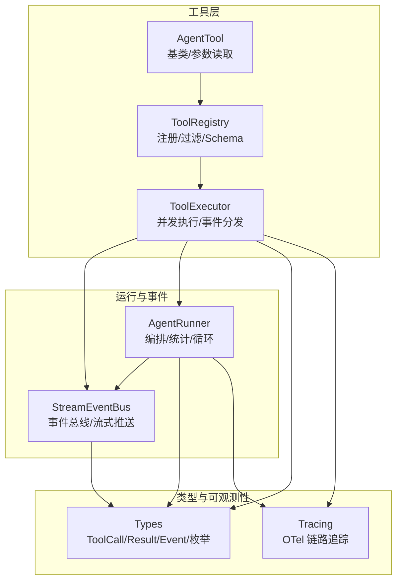
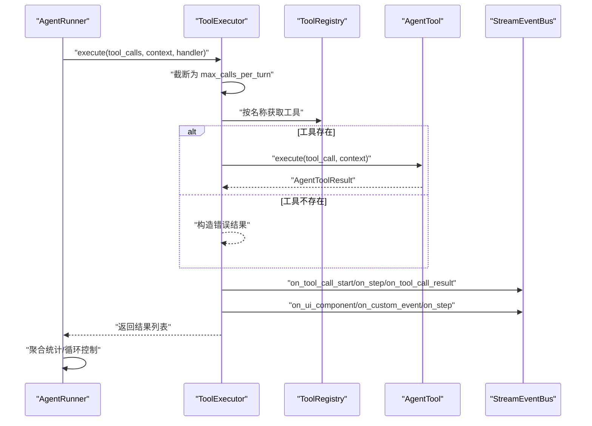
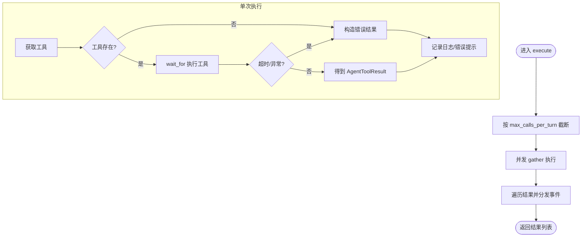
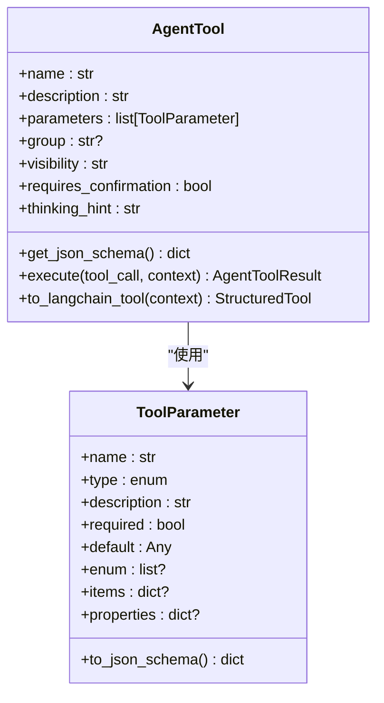
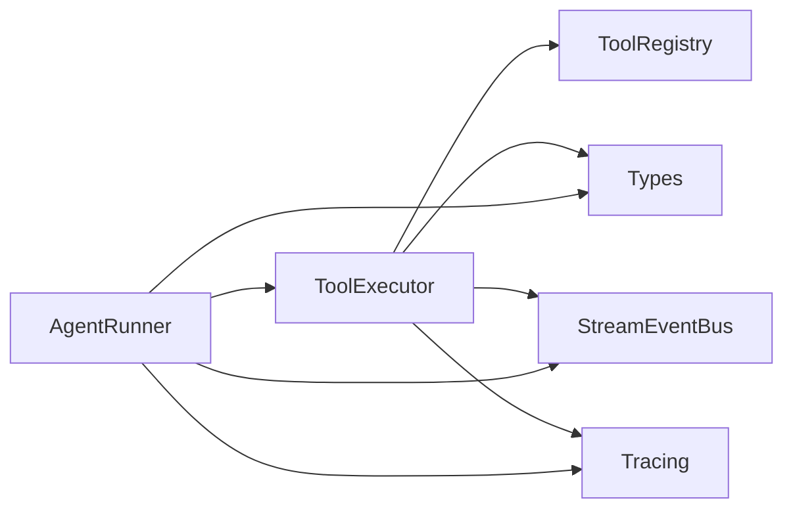

# 工具执行器

<cite>
**本文引用的文件**
- [executor.py](file://src/ark_agentic/core/tools/executor.py)
- [base.py](file://src/ark_agentic/core/tools/base.py)
- [registry.py](file://src/ark_agentic/core/tools/registry.py)
- [types.py](file://src/ark_agentic/core/types.py)
- [event_bus.py](file://src/ark_agentic/core/stream/event_bus.py)
- [runner.py](file://src/ark_agentic/core/runner.py)
- [tool.py](file://src/ark_agentic/core/subtask/tool.py)
- [test_tool_executor.py](file://tests/unit/core/test_tool_executor.py)
- [test_executor_parallel.py](file://tests/unit/core/test_executor_parallel.py)
- [tracing.py](file://src/ark_agentic/core/observability/tracing.py)
- [demo_a2ui.py](file://src/ark_agentic/core/tools/demo_a2ui.py)
- [memory.py](file://src/ark_agentic/core/tools/memory.py)
</cite>

## 目录
1. [简介](#简介)
2. [项目结构](#项目结构)
3. [核心组件](#核心组件)
4. [架构总览](#架构总览)
5. [详细组件分析](#详细组件分析)
6. [依赖分析](#依赖分析)
7. [性能考量](#性能考量)
8. [故障排除指南](#故障排除指南)
9. [结论](#结论)
10. [附录](#附录)

## 简介
本文件围绕“工具执行器”进行系统化说明，涵盖并发控制机制、异步执行策略、错误处理流程、生命周期管理、参数验证、结果处理与超时控制，并提供配置项、性能监控与调试技巧、最佳实践与故障排除建议。目标是帮助开发者与使用者全面理解工具执行器的设计与运行方式。

## 项目结构
工具执行器位于核心工具模块，配合注册表、类型定义、事件总线与运行器共同构成完整的工具执行链路。关键文件与职责如下：
- 工具执行器：负责按序并发执行工具调用、统一事件分发、超时与错误兜底
- 工具基类与参数读取：定义工具接口、参数校验与读取辅助函数
- 注册表：工具注册、查询、过滤与 Schema 生成
- 类型定义：工具调用、结果、事件、枚举等核心类型
- 事件总线：将执行器产生的事件转化为流式事件并推送
- 运行器：编排工具执行器，聚合结果与统计
- 子任务工具：基于并发与会话隔离的批量子任务执行
- 测试：覆盖并发、限流、事件分发、错误处理等场景
- 可观测性：OpenTelemetry 链路追踪与指标记录

图表来源
- [executor.py:29-127](file://src/ark_agentic/core/tools/executor.py#L29-L127)
- [registry.py:14-178](file://src/ark_agentic/core/tools/registry.py#L14-L178)
- [base.py:46-289](file://src/ark_agentic/core/tools/base.py#L46-L289)
- [types.py:44-200](file://src/ark_agentic/core/types.py#L44-L200)
- [event_bus.py:67-248](file://src/ark_agentic/core/stream/event_bus.py#L67-L248)
- [runner.py:193-200](file://src/ark_agentic/core/runner.py#L193-L200)
- [tracing.py:1-200](file://src/ark_agentic/core/observability/tracing.py#L1-L200)

章节来源
- [executor.py:1-127](file://src/ark_agentic/core/tools/executor.py#L1-L127)
- [registry.py:1-178](file://src/ark_agentic/core/tools/registry.py#L1-L178)
- [base.py:1-289](file://src/ark_agentic/core/tools/base.py#L1-L289)
- [types.py:1-200](file://src/ark_agentic/core/types.py#L1-L200)
- [event_bus.py:1-248](file://src/ark_agentic/core/stream/event_bus.py#L1-L248)
- [runner.py:1-200](file://src/ark_agentic/core/runner.py#L1-L200)
- [tracing.py:1-200](file://src/ark_agentic/core/observability/tracing.py#L1-L200)

## 核心组件
- 工具执行器（ToolExecutor）
  - 职责：按序并发执行工具调用、超时控制、错误兜底、事件统一分发
  - 关键行为：限制每轮工具调用数量、并发 gather、超时包装、异常捕获、事件派发
- 工具基类（AgentTool）
  - 职责：定义工具接口、参数 Schema、参数读取辅助函数、LangChain 适配
  - 关键行为：抽象 execute 方法、参数校验与默认值处理
- 工具注册表（ToolRegistry）
  - 职责：工具注册、查询、分组、过滤、Schema 生成
- 类型系统（Types）
  - 职责：定义 ToolCall、AgentToolResult、ToolEvent、ToolResultType、ToolLoopAction 等
- 事件总线（StreamEventBus）
  - 职责：将执行器与运行器回调转化为标准流式事件并入队
- 运行器（AgentRunner）
  - 职责：ReAct 循环编排、统计与聚合、与执行器协作
- 子任务工具（SpawnSubtasksTool）
  - 职责：批量子任务并发执行、会话隔离、超时与资源清理
- 可观测性（Tracing）
  - 职责：OTel 链路追踪、span 属性设置、错误标记与指标

章节来源
- [executor.py:29-127](file://src/ark_agentic/core/tools/executor.py#L29-L127)
- [base.py:46-289](file://src/ark_agentic/core/tools/base.py#L46-L289)
- [registry.py:14-178](file://src/ark_agentic/core/tools/registry.py#L14-L178)
- [types.py:44-200](file://src/ark_agentic/core/types.py#L44-L200)
- [event_bus.py:28-248](file://src/ark_agentic/core/stream/event_bus.py#L28-L248)
- [runner.py:92-155](file://src/ark_agentic/core/runner.py#L92-L155)
- [tool.py:61-319](file://src/ark_agentic/core/subtask/tool.py#L61-L319)
- [tracing.py:148-200](file://src/ark_agentic/core/observability/tracing.py#L148-L200)

## 架构总览
工具执行器在运行器的 ReAct 循环中被调用，接收一组 ToolCall，按序并发执行，完成后统一分发事件到事件总线，最终由运行器聚合结果与统计信息。

图表来源
- [executor.py:43-100](file://src/ark_agentic/core/tools/executor.py#L43-L100)
- [registry.py:41-50](file://src/ark_agentic/core/tools/registry.py#L41-L50)
- [event_bus.py:146-214](file://src/ark_agentic/core/stream/event_bus.py#L146-L214)
- [runner.py:193-200](file://src/ark_agentic/core/runner.py#L193-L200)

## 详细组件分析

### 工具执行器（并发、异步、事件分发）
- 并发控制
  - 使用 asyncio.gather 并发执行工具调用，提升吞吐
  - 通过 max_calls_per_turn 限制每轮并发数量，避免资源争用
- 异步执行策略
  - 对每个工具调用使用 asyncio.wait_for 包装，统一超时控制
  - 捕获 TimeoutError 与通用异常，构造错误结果
- 错误处理流程
  - 工具不存在：返回错误结果
  - 超时：记录日志并返回超时错误
  - 其他异常：记录错误并返回错误结果
- 事件分发
  - 统一将 UI 组件事件、自定义事件、步骤事件分发给 AgentEventHandler
  - 结果类型映射到 UI 协议字段，便于前端渲染
- 生命周期管理
  - 每个工具调用开始与结束均触发 handler 回调，保证 UI 与流式输出一致
  - 在错误情况下触发“尝试其他方式”的提示，增强用户体验

图表来源
- [executor.py:43-100](file://src/ark_agentic/core/tools/executor.py#L43-L100)

章节来源
- [executor.py:29-127](file://src/ark_agentic/core/tools/executor.py#L29-L127)
- [test_executor_parallel.py:40-144](file://tests/unit/core/test_executor_parallel.py#L40-L144)
- [test_tool_executor.py:47-162](file://tests/unit/core/test_tool_executor.py#L47-L162)

### 工具基类与参数验证
- 工具接口
  - 必须实现 async execute(tool_call, context) -> AgentToolResult
  - 支持 JSON Schema 导出，便于 LLM 函数调用
- 参数定义与读取
  - ToolParameter 定义参数类型、必填、默认值、枚举、对象/数组结构
  - 提供多种 read_*_param 辅助函数，支持字符串、整数、浮点、布尔、列表、字典的读取与校验
- LangChain 适配
  - 提供 to_langchain_tool 适配器，将 AgentTool.execute 映射为 StructuredTool.invoke

图表来源
- [base.py:46-289](file://src/ark_agentic/core/tools/base.py#L46-L289)

章节来源
- [base.py:16-289](file://src/ark_agentic/core/tools/base.py#L16-L289)

### 工具注册表（注册、过滤、Schema）
- 注册与查询
  - register/register_all：注册工具，支持分组索引
  - get/get_required：按名称获取工具
- 过滤策略
  - filter：支持白名单/黑名单工具与分组过滤
- Schema 生成
  - get_schemas：按名称/分组/排除生成 JSON Schema 列表

章节来源
- [registry.py:14-178](file://src/ark_agentic/core/tools/registry.py#L14-L178)

### 类型系统（工具调用、结果、事件）
- ToolCall：工具调用请求，包含 id、name、arguments
- AgentToolResult：工具结果，包含 result_type、content、is_error、metadata、loop_action、events、llm_digest
- ToolEvent 及其子类：自定义事件、UI 组件事件、步骤事件
- ToolResultType/ToolLoopAction：结果类型与循环控制信号

章节来源
- [types.py:44-200](file://src/ark_agentic/core/types.py#L44-L200)

### 事件总线（流式事件分发）
- AgentEventHandler 协议定义了 on_step、on_content_delta、on_tool_call_start、on_tool_call_result、on_thinking_delta、on_ui_component、on_custom_event 等回调
- StreamEventBus 实现：将回调转为 AgentStreamEvent 并推入队列，自动配对 step/text_message/thinking_message 的 start/finish 事件

章节来源
- [event_bus.py:28-248](file://src/ark_agentic/core/stream/event_bus.py#L28-L248)

### 运行器（编排与统计）
- RunnerConfig：包含模型、采样、最大轮次、单轮最大工具调用数、工具超时、自动压缩、提示配置、技能配置、子任务开关、Dream 开关等
- AgentRunner：ReAct 循环编排，与 ToolExecutor 协作，累积统计与聚合结果

章节来源
- [runner.py:92-155](file://src/ark_agentic/core/runner.py#L92-L155)
- [runner.py:193-200](file://src/ark_agentic/core/runner.py#L193-L200)

### 子任务工具（批量子任务并发执行）
- 并发与生命周期
  - 使用 asyncio.Semaphore 控制并发，支持超时与资源清理
  - 子任务创建独立会话，避免嵌套子任务
- 结果汇总
  - 汇总 state_delta、token 使用、转录等元数据
  - 支持可选的转录持久化

章节来源
- [tool.py:32-319](file://src/ark_agentic/core/subtask/tool.py#L32-L319)

### A2UI 与内存工具（示例）
- DemoA2UITool：返回 A2UI 结果，自动派发 UI 组件事件
- MemoryWriteTool：写入用户记忆，参数校验与错误处理

章节来源
- [demo_a2ui.py:17-74](file://src/ark_agentic/core/tools/demo_a2ui.py#L17-L74)
- [memory.py:39-114](file://src/ark_agentic/core/tools/memory.py#L39-L114)

## 依赖分析
- 组件耦合
  - ToolExecutor 依赖 ToolRegistry、AgentEventHandler、AgentToolResult、ToolCall、ToolResultType、ToolLoopAction、UIComponentToolEvent、CustomToolEvent、StepToolEvent
  - 运行器依赖 ToolExecutor、StreamEventBus、SessionManager、LLMCaller、回调系统
- 外部依赖
  - asyncio：并发与超时控制
  - OpenTelemetry：链路追踪（可选）

图表来源
- [executor.py:14-24](file://src/ark_agentic/core/tools/executor.py#L14-L24)
- [runner.py:33-50](file://src/ark_agentic/core/runner.py#L33-L50)
- [tracing.py:66-72](file://src/ark_agentic/core/observability/tracing.py#L66-L72)

章节来源
- [executor.py:1-127](file://src/ark_agentic/core/tools/executor.py#L1-L127)
- [runner.py:1-200](file://src/ark_agentic/core/runner.py#L1-L200)
- [tracing.py:1-200](file://src/ark_agentic/core/observability/tracing.py#L1-L200)

## 性能考量
- 并发策略
  - 使用 asyncio.gather 并行执行工具调用，显著降低总耗时
  - 通过 max_calls_per_turn 限制并发度，避免资源争用与过载
- 超时控制
  - 单个工具执行超时统一为 tool_timeout，防止阻塞
  - 子任务工具支持独立超时配置
- 结果聚合
  - 并发执行期间 state_delta 不互相可见，执行后在运行器层面顺序合并，避免竞态
- 日志与可观测性
  - 详细的执行日志与 OTel 链路追踪，便于定位瓶颈与异常

章节来源
- [test_executor_parallel.py:40-76](file://tests/unit/core/test_executor_parallel.py#L40-L76)
- [runner.py:92-120](file://src/ark_agentic/core/runner.py#L92-L120)
- [tool.py:32-42](file://src/ark_agentic/core/subtask/tool.py#L32-L42)
- [tracing.py:148-200](file://src/ark_agentic/core/observability/tracing.py#L148-L200)

## 故障排除指南
- 工具未找到
  - 现象：返回错误结果，内容包含“not found”
  - 处理：检查工具是否正确注册或名称是否匹配
- 超时
  - 现象：记录超时日志并返回超时错误
  - 处理：增大 tool_timeout 或优化工具执行逻辑
- 并发失败不影响其他工具
  - 现象：单个工具异常不会阻塞其他工具
  - 处理：关注错误结果并排查异常工具
- 事件未到达前端
  - 现象：UI 无反馈
  - 处理：确认 handler 正确传入且事件类型映射正确（如 A2UI -> UI 组件事件）
- 子任务超时或嵌套
  - 现象：子任务超时或拒绝嵌套
  - 处理：检查超时配置与会话标记

章节来源
- [test_tool_executor.py:47-162](file://tests/unit/core/test_tool_executor.py#L47-L162)
- [test_executor_parallel.py:107-144](file://tests/unit/core/test_executor_parallel.py#L107-L144)
- [executor.py:77-100](file://src/ark_agentic/core/tools/executor.py#L77-L100)
- [tool.py:110-116](file://src/ark_agentic/core/subtask/tool.py#L110-L116)

## 结论
工具执行器以单一职责为核心，通过并发执行、统一事件分发与完善的错误处理，实现了高可靠、高性能的工具调用链路。结合运行器的编排能力与事件总线的流式输出，能够满足复杂业务场景下的工具调度需求。通过合理的配置与可观测性手段，可以进一步提升系统的稳定性与可维护性。

## 附录

### 配置选项（工具执行器与运行器）
- ToolExecutor
  - timeout：单个工具执行超时（秒）
  - max_calls_per_turn：每轮并发工具调用上限
- RunnerConfig
  - model：模型名称
  - sampling：采样配置
  - max_retries：LLM 调用重试次数
  - max_turns：最大对话轮次
  - max_tool_calls_per_turn：单轮最大工具调用数
  - tool_timeout：单个工具执行超时（秒）
  - auto_compact：自动压缩
  - prompt_config/skill_config：提示与技能配置
  - enable_subtasks：启用子任务
  - enable_dream/dream_min_sessions：Dream 开关与触发阈值
  - accept_external_history：外部历史合并开关

章节来源
- [executor.py:32-42](file://src/ark_agentic/core/tools/executor.py#L32-L42)
- [runner.py:92-128](file://src/ark_agentic/core/runner.py#L92-L128)

### 参数验证与读取最佳实践
- 使用 ToolParameter 定义参数约束
- 使用 read_*_param 辅助函数进行类型转换与默认值处理
- 对必需参数使用 *_required 版本并在缺失时抛出明确异常

章节来源
- [base.py:169-289](file://src/ark_agentic/core/tools/base.py#L169-L289)

### 性能监控与调试技巧
- 启用 OTel 链路追踪，观察工具调用次数、错误数、耗时分布
- 在开发环境开启详细日志，定位超时与异常工具
- 使用子任务工具进行长耗时任务拆分与隔离

章节来源
- [tracing.py:148-200](file://src/ark_agentic/core/observability/tracing.py#L148-L200)
- [tool.py:183-198](file://src/ark_agentic/core/subtask/tool.py#L183-L198)