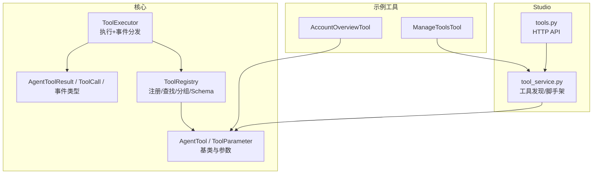
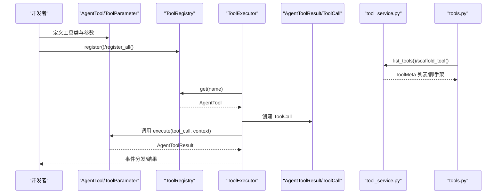
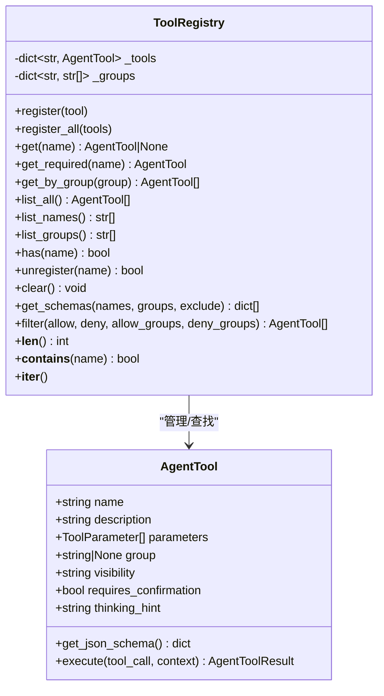
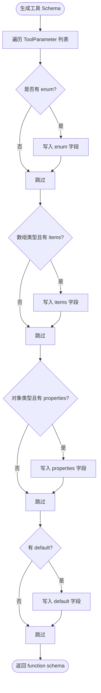
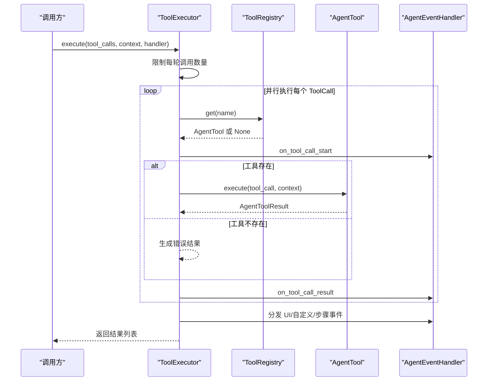
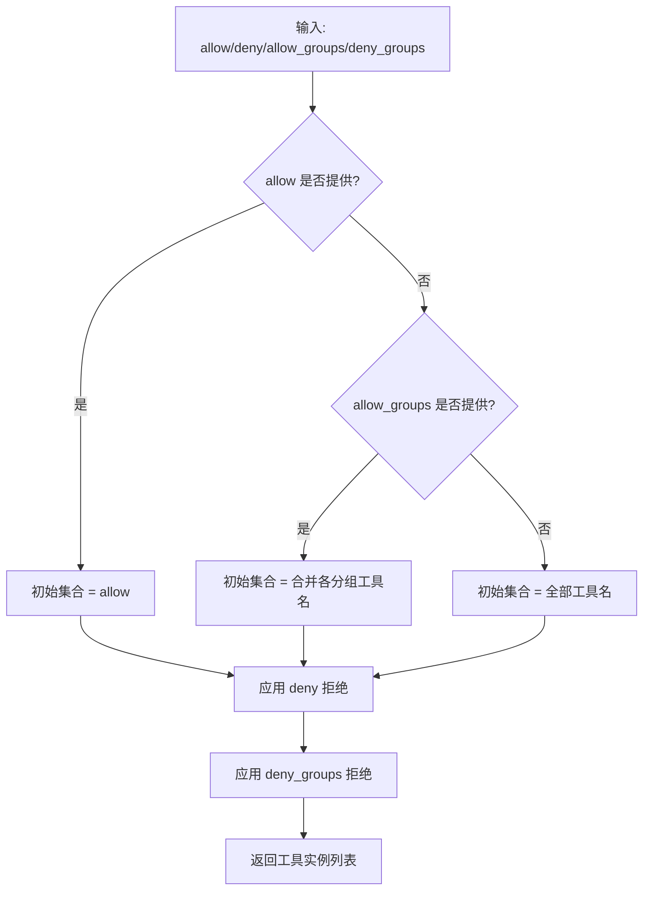
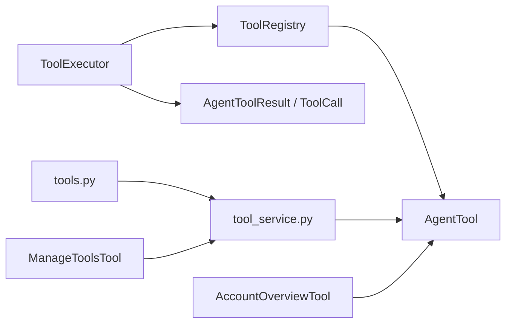

# 工具注册表

<cite>
**本文引用的文件**
- [src/ark_agentic/core/tools/registry.py](file://src/ark_agentic/core/tools/registry.py)
- [src/ark_agentic/core/tools/base.py](file://src/ark_agentic/core/tools/base.py)
- [src/ark_agentic/core/tools/executor.py](file://src/ark_agentic/core/tools/executor.py)
- [src/ark_agentic/core/types.py](file://src/ark_agentic/core/types.py)
- [src/ark_agentic/studio/services/tool_service.py](file://src/ark_agentic/studio/services/tool_service.py)
- [src/ark_agentic/studio/api/tools.py](file://src/ark_agentic/studio/api/tools.py)
- [src/ark_agentic/agents/securities/tools/agent/account_overview.py](file://src/ark_agentic/agents/securities/tools/agent/account_overview.py)
- [src/ark_agentic/agents/meta_builder/tools/manage_tools.py](file://src/ark_agentic/agents/meta_builder/tools/manage_tools.py)
- [tests/unit/core/test_tools.py](file://tests/unit/core/test_tools.py)
</cite>

## 目录
1. [简介](#简介)
2. [项目结构](#项目结构)
3. [核心组件](#核心组件)
4. [架构总览](#架构总览)
5. [详细组件分析](#详细组件分析)
6. [依赖关系分析](#依赖关系分析)
7. [性能考量](#性能考量)
8. [故障排查指南](#故障排查指南)
9. [结论](#结论)
10. [附录](#附录)

## 简介
本文件系统性阐述工具注册表（ToolRegistry）的设计与实现，涵盖工具注册、查找、分组管理、Schema 生成、生命周期管理、批量注册、权限过滤策略与工具发现机制。同时提供最佳实践、性能优化建议与常见问题解决方案，并通过真实代码路径示例展示如何正确使用工具注册表进行工具管理。

## 项目结构
围绕工具注册表的关键模块分布如下：
- 核心注册与基类：core/tools/registry.py、core/tools/base.py
- 工具执行器：core/tools/executor.py
- 核心类型与事件：core/types.py
- Studio 工具服务与 API：studio/services/tool_service.py、studio/api/tools.py
- 示例工具与复合工具：agents/securities/tools/agent/account_overview.py、agents/meta_builder/tools/manage_tools.py
- 单元测试：tests/unit/core/test_tools.py

**图表来源**
- [src/ark_agentic/core/tools/registry.py:14-178](file://src/ark_agentic/core/tools/registry.py#L14-L178)
- [src/ark_agentic/core/tools/base.py:46-163](file://src/ark_agentic/core/tools/base.py#L46-L163)
- [src/ark_agentic/core/tools/executor.py:29-127](file://src/ark_agentic/core/tools/executor.py#L29-L127)
- [src/ark_agentic/core/types.py:70-196](file://src/ark_agentic/core/types.py#L70-L196)
- [src/ark_agentic/studio/services/tool_service.py:40-176](file://src/ark_agentic/studio/services/tool_service.py#L40-L176)
- [src/ark_agentic/studio/api/tools.py:41-66](file://src/ark_agentic/studio/api/tools.py#L41-L66)
- [src/ark_agentic/agents/securities/tools/agent/account_overview.py:57-108](file://src/ark_agentic/agents/securities/tools/agent/account_overview.py#L57-L108)
- [src/ark_agentic/agents/meta_builder/tools/manage_tools.py:185-315](file://src/ark_agentic/agents/meta_builder/tools/manage_tools.py#L185-L315)

**章节来源**
- [src/ark_agentic/core/tools/registry.py:14-178](file://src/ark_agentic/core/tools/registry.py#L14-L178)
- [src/ark_agentic/core/tools/base.py:46-163](file://src/ark_agentic/core/tools/base.py#L46-L163)
- [src/ark_agentic/core/tools/executor.py:29-127](file://src/ark_agentic/core/tools/executor.py#L29-L127)
- [src/ark_agentic/core/types.py:70-196](file://src/ark_agentic/core/types.py#L70-L196)
- [src/ark_agentic/studio/services/tool_service.py:40-176](file://src/ark_agentic/studio/services/tool_service.py#L40-L176)
- [src/ark_agentic/studio/api/tools.py:41-66](file://src/ark_agentic/studio/api/tools.py#L41-L66)
- [src/ark_agentic/agents/securities/tools/agent/account_overview.py:57-108](file://src/ark_agentic/agents/securities/tools/agent/account_overview.py#L57-L108)
- [src/ark_agentic/agents/meta_builder/tools/manage_tools.py:185-315](file://src/ark_agentic/agents/meta_builder/tools/manage_tools.py#L185-L315)

## 核心组件
- ToolRegistry：集中管理工具注册、查找、分组、Schema 生成与过滤。
- AgentTool/ToolParameter：工具抽象与参数定义，提供 OpenAI 兼容的 JSON Schema。
- ToolExecutor：工具执行器，负责并发执行、超时与错误兜底、事件分发。
- Studio 工具服务与 API：提供工具发现（AST 解析）、脚手架生成与 HTTP 接口。
- 示例工具：AccountOverviewTool、ManageToolsTool，展示工具定义与复杂工具的实现。

**章节来源**
- [src/ark_agentic/core/tools/registry.py:14-178](file://src/ark_agentic/core/tools/registry.py#L14-L178)
- [src/ark_agentic/core/tools/base.py:46-163](file://src/ark_agentic/core/tools/base.py#L46-L163)
- [src/ark_agentic/core/tools/executor.py:29-127](file://src/ark_agentic/core/tools/executor.py#L29-L127)
- [src/ark_agentic/studio/services/tool_service.py:40-176](file://src/ark_agentic/studio/services/tool_service.py#L40-L176)
- [src/ark_agentic/studio/api/tools.py:41-66](file://src/ark_agentic/studio/api/tools.py#L41-L66)
- [src/ark_agentic/agents/securities/tools/agent/account_overview.py:57-108](file://src/ark_agentic/agents/securities/tools/agent/account_overview.py#L57-L108)
- [src/ark_agentic/agents/meta_builder/tools/manage_tools.py:185-315](file://src/ark_agentic/agents/meta_builder/tools/manage_tools.py#L185-L315)

## 架构总览
工具注册表贯穿“定义—注册—执行—反馈”的闭环：工具通过 AgentTool 定义，经 ToolRegistry 注册与分组，ToolExecutor 依据 ToolCall 并发执行并分发事件，Studio 侧提供工具发现与脚手架能力。

**图表来源**
- [src/ark_agentic/core/tools/base.py:46-163](file://src/ark_agentic/core/tools/base.py#L46-L163)
- [src/ark_agentic/core/tools/registry.py:24-93](file://src/ark_agentic/core/tools/registry.py#L24-L93)
- [src/ark_agentic/core/tools/executor.py:43-101](file://src/ark_agentic/core/tools/executor.py#L43-L101)
- [src/ark_agentic/core/types.py:70-196](file://src/ark_agentic/core/types.py#L70-L196)
- [src/ark_agentic/studio/services/tool_service.py:40-176](file://src/ark_agentic/studio/services/tool_service.py#L40-L176)
- [src/ark_agentic/studio/api/tools.py:41-66](file://src/ark_agentic/studio/api/tools.py#L41-L66)

## 详细组件分析

### ToolRegistry 设计与实现
- 数据结构
  - 工具字典：name -> AgentTool
  - 分组映射：group -> [tool_name...]
- 关键方法
  - register：去重校验、登记工具、同步写入分组
  - register_all：批量注册
  - get/get_required：按名查找与断言存在
  - get_by_group：按分组返回工具实例
  - list_all/list_names/list_groups：枚举工具、名称、分组
  - has/unregister/clear：存在性判断、注销、清空
  - get_schemas：按 names/groups/exclude 返回 OpenAI 兼容 JSON Schema 列表
  - filter：白名单/黑名单 + 分组白名单/黑名单组合过滤
  - 集合协议：__len__/__contains__/__iter__
- 复杂度
  - register/get/unregister/has：平均 O(1)
  - get_schemas/filter：O(N) 遍历工具集合并筛选
  - 分组查询：O(M)（M 为分组内工具数）

**图表来源**
- [src/ark_agentic/core/tools/registry.py:14-178](file://src/ark_agentic/core/tools/registry.py#L14-L178)
- [src/ark_agentic/core/tools/base.py:46-163](file://src/ark_agentic/core/tools/base.py#L46-L163)

**章节来源**
- [src/ark_agentic/core/tools/registry.py:24-178](file://src/ark_agentic/core/tools/registry.py#L24-L178)
- [src/ark_agentic/core/tools/base.py:46-163](file://src/ark_agentic/core/tools/base.py#L46-L163)

### AgentTool 与参数 Schema 生成
- AgentTool
  - 必填属性：name、description
  - 可选属性：group、visibility、requires_confirmation、thinking_hint
  - 抽象方法：execute(tool_call, context) -> AgentToolResult
  - 辅助：to_langchain_tool（可选）
- ToolParameter
  - 支持类型：string/integer/number/boolean/array/object
  - 支持约束：enum/items/properties/default
  - to_json_schema：输出 JSON Schema
- get_json_schema
  - 输出 OpenAI function calling 兼容格式（type=function，包含 name/description/parameters）

**图表来源**
- [src/ark_agentic/core/tools/base.py:16-44](file://src/ark_agentic/core/tools/base.py#L16-L44)
- [src/ark_agentic/core/tools/base.py:79-101](file://src/ark_agentic/core/tools/base.py#L79-L101)

**章节来源**
- [src/ark_agentic/core/tools/base.py:16-163](file://src/ark_agentic/core/tools/base.py#L16-L163)

### ToolExecutor 生命周期与执行流程
- 并发执行：限制每轮最大调用次数，使用 gather 并行执行
- 超时与错误兜底：wait_for 超时捕获，异常记录并返回错误结果
- 事件分发：统一将 AgentToolResult.events 转换为 UI/自定义/步骤事件
- 思维提示：根据工具 thinking_hint 更新步骤状态

**图表来源**
- [src/ark_agentic/core/tools/executor.py:43-101](file://src/ark_agentic/core/tools/executor.py#L43-L101)
- [src/ark_agentic/core/tools/registry.py:41-50](file://src/ark_agentic/core/tools/registry.py#L41-L50)
- [src/ark_agentic/core/types.py:50-67](file://src/ark_agentic/core/types.py#L50-L67)

**章节来源**
- [src/ark_agentic/core/tools/executor.py:29-127](file://src/ark_agentic/core/tools/executor.py#L29-L127)
- [src/ark_agentic/core/types.py:50-196](file://src/ark_agentic/core/types.py#L50-L196)

### 权限过滤策略与工具发现机制
- 权限过滤（filter）
  - 支持 allow/deny 白黑名单与 allow_groups/deny_groups 分组维度
  - 先构建初始集合（allow 优先、否则 allow_groups、否则全量），再应用拒绝集合
- 工具发现（Studio）
  - list_tools：递归扫描 agent/tools 下的 Python 文件，AST 解析提取 Tool 元信息
  - scaffold_tool：生成脚手架文件，渲染模板并解析元数据
  - API：提供 HTTP 接口列出工具与生成脚手架

**图表来源**
- [src/ark_agentic/core/tools/registry.py:130-168](file://src/ark_agentic/core/tools/registry.py#L130-L168)
- [src/ark_agentic/studio/services/tool_service.py:40-176](file://src/ark_agentic/studio/services/tool_service.py#L40-L176)

**章节来源**
- [src/ark_agentic/core/tools/registry.py:130-168](file://src/ark_agentic/core/tools/registry.py#L130-L168)
- [src/ark_agentic/studio/services/tool_service.py:40-176](file://src/ark_agentic/studio/services/tool_service.py#L40-L176)
- [src/ark_agentic/studio/api/tools.py:41-66](file://src/ark_agentic/studio/api/tools.py#L41-L66)

### 实际使用示例（代码路径）
- 定义工具类与参数：[示例工具定义:57-108](file://src/ark_agentic/agents/securities/tools/agent/account_overview.py#L57-L108)
- 复合工具（管理工具）：[ManageToolsTool:185-315](file://src/ark_agentic/agents/meta_builder/tools/manage_tools.py#L185-L315)
- 注册与过滤：[注册/过滤用法:24-168](file://src/ark_agentic/core/tools/registry.py#L24-L168)
- 执行与事件：[执行器调用链:43-101](file://src/ark_agentic/core/tools/executor.py#L43-L101)
- Studio 发现与脚手架：[工具服务:40-176](file://src/ark_agentic/studio/services/tool_service.py#L40-L176)

**章节来源**
- [src/ark_agentic/agents/securities/tools/agent/account_overview.py:57-108](file://src/ark_agentic/agents/securities/tools/agent/account_overview.py#L57-L108)
- [src/ark_agentic/agents/meta_builder/tools/manage_tools.py:185-315](file://src/ark_agentic/agents/meta_builder/tools/manage_tools.py#L185-L315)
- [src/ark_agentic/core/tools/registry.py:24-168](file://src/ark_agentic/core/tools/registry.py#L24-L168)
- [src/ark_agentic/core/tools/executor.py:43-101](file://src/ark_agentic/core/tools/executor.py#L43-L101)
- [src/ark_agentic/studio/services/tool_service.py:40-176](file://src/ark_agentic/studio/services/tool_service.py#L40-L176)

## 依赖关系分析
- ToolRegistry 依赖 AgentTool（运行时存储与查找）
- ToolExecutor 依赖 ToolRegistry（按名获取工具）、AgentToolResult/ToolCall（执行与结果）
- Studio 工具服务依赖 AgentTool（解析元信息）、AST（静态分析）
- 示例工具依赖 AgentTool 基类与工具服务（脚手架生成）

**图表来源**
- [src/ark_agentic/core/tools/registry.py:14-178](file://src/ark_agentic/core/tools/registry.py#L14-L178)
- [src/ark_agentic/core/tools/executor.py:29-127](file://src/ark_agentic/core/tools/executor.py#L29-L127)
- [src/ark_agentic/core/types.py:70-196](file://src/ark_agentic/core/types.py#L70-L196)
- [src/ark_agentic/studio/services/tool_service.py:40-176](file://src/ark_agentic/studio/services/tool_service.py#L40-L176)
- [src/ark_agentic/studio/api/tools.py:41-66](file://src/ark_agentic/studio/api/tools.py#L41-L66)
- [src/ark_agentic/agents/securities/tools/agent/account_overview.py:57-108](file://src/ark_agentic/agents/securities/tools/agent/account_overview.py#L57-L108)
- [src/ark_agentic/agents/meta_builder/tools/manage_tools.py:185-315](file://src/ark_agentic/agents/meta_builder/tools/manage_tools.py#L185-L315)

**章节来源**
- [src/ark_agentic/core/tools/registry.py:14-178](file://src/ark_agentic/core/tools/registry.py#L14-L178)
- [src/ark_agentic/core/tools/executor.py:29-127](file://src/ark_agentic/core/tools/executor.py#L29-L127)
- [src/ark_agentic/core/types.py:70-196](file://src/ark_agentic/core/types.py#L70-L196)
- [src/ark_agentic/studio/services/tool_service.py:40-176](file://src/ark_agentic/studio/services/tool_service.py#L40-L176)
- [src/ark_agentic/studio/api/tools.py:41-66](file://src/ark_agentic/studio/api/tools.py#L41-L66)
- [src/ark_agentic/agents/securities/tools/agent/account_overview.py:57-108](file://src/ark_agentic/agents/securities/tools/agent/account_overview.py#L57-L108)
- [src/ark_agentic/agents/meta_builder/tools/manage_tools.py:185-315](file://src/ark_agentic/agents/meta_builder/tools/manage_tools.py#L185-L315)

## 性能考量
- 查询与注册
  - 使用字典 O(1) 查找，register/unregister 为 O(1)，适合高频查找场景
- Schema 生成
  - get_schemas/filter 遍历工具集，建议在变更频率较低时缓存结果
- 并发执行
  - ToolExecutor 限制每轮最大调用数，避免资源争用；合理设置超时时间
- 分组与过滤
  - 分组查询 O(M)，若频繁按组过滤，可考虑预构建索引或缓存常用分组集合
- Studio 工具发现
  - AST 解析为 CPU 密集型，建议在后台线程或异步任务中执行，避免阻塞 API

[本节为通用性能建议，不直接分析具体文件]

## 故障排查指南
- 注册重复工具
  - 现象：抛出 ValueError
  - 处理：确保工具名唯一；必要时先 unregister 再 register
  - 参考：[注册去重逻辑:26-28](file://src/ark_agentic/core/tools/registry.py#L26-L28)
- 工具不存在
  - 现象：get 返回 None；get_required 抛 KeyError
  - 处理：确认工具是否已注册；检查命名一致性
  - 参考：[查找方法:41-50](file://src/ark_agentic/core/tools/registry.py#L41-L50)
- 执行超时/异常
  - 现象：返回错误结果；日志记录超时/异常
  - 处理：调整超时阈值；完善工具内部异常处理
  - 参考：[执行与错误兜底:77-88](file://src/ark_agentic/core/tools/executor.py#L77-L88)
- Schema 生成不符合预期
  - 现象：缺少 required 字段或类型不匹配
  - 处理：核对 ToolParameter 的 required/enum/items/properties/default
  - 参考：[Schema 生成:79-101](file://src/ark_agentic/core/tools/base.py#L79-L101)
- Studio 工具发现为空
  - 现象：list_tools 返回空列表
  - 处理：确认工具文件位于 agents/{agent_id}/tools 下；工具类继承 AgentTool
  - 参考：[工具发现:40-176](file://src/ark_agentic/studio/services/tool_service.py#L40-L176)

**章节来源**
- [src/ark_agentic/core/tools/registry.py:26-50](file://src/ark_agentic/core/tools/registry.py#L26-L50)
- [src/ark_agentic/core/tools/executor.py:77-88](file://src/ark_agentic/core/tools/executor.py#L77-L88)
- [src/ark_agentic/core/tools/base.py:79-101](file://src/ark_agentic/core/tools/base.py#L79-L101)
- [src/ark_agentic/studio/services/tool_service.py:40-176](file://src/ark_agentic/studio/services/tool_service.py#L40-L176)

## 结论
ToolRegistry 以简洁的数据结构与清晰的方法边界实现了工具的全生命周期管理：从定义、注册、分组、Schema 生成，到执行与事件分发。结合 Studio 的工具发现与脚手架能力，形成“定义—注册—执行—反馈—迭代”的高效闭环。通过合理的权限过滤与性能优化策略，可在复杂场景中保持高可用与高扩展性。

[本节为总结性内容，不直接分析具体文件]

## 附录

### 最佳实践清单
- 工具定义
  - 明确 name 与 description；为复杂工具提供 group 与 visibility
  - 参数使用 ToolParameter 描述，尽量提供 enum/required/items/properties/default
- 注册与分组
  - 使用 register_all 批量注册；为工具设置 group 便于策略控制
  - 避免重复注册；必要时先 unregister
- 权限与过滤
  - 使用 filter 组合 allow/deny 与 allow_groups/deny_groups
  - 分组白名单优先于全量集合，减少不必要的暴露
- 执行与可观测性
  - 设置合理的超时与每轮最大调用数；利用 ToolExecutor 的事件分发
  - 为工具提供 thinking_hint，提升用户体验
- Studio 工具管理
  - 使用 scaffold_tool 生成脚手架；通过 list_tools 快速发现工具
  - 对复合工具（如 ManageToolsTool）提供明确的参数与确认流程

### 常见问题速查
- 问：如何批量注册工具？
  - 答：使用 register_all；参考 [批量注册:36-40](file://src/ark_agentic/core/tools/registry.py#L36-L40)
- 问：如何按分组获取工具？
  - 答：使用 get_by_group；参考 [按分组获取:52-55](file://src/ark_agentic/core/tools/registry.py#L52-L55)
- 问：如何生成 OpenAI 兼容的工具 Schema？
  - 答：调用 get_schemas；参考 [Schema 生成:94-128](file://src/ark_agentic/core/tools/registry.py#L94-L128)
- 问：如何限制工具可见性？
  - 答：使用 filter 的 allow/deny/allow_groups/deny_groups；参考 [权限过滤:130-168](file://src/ark_agentic/core/tools/registry.py#L130-L168)
- 问：如何在 Studio 中发现工具？
  - 答：调用 list_tools；参考 [工具发现:40-176](file://src/ark_agentic/studio/services/tool_service.py#L40-L176)

**章节来源**
- [src/ark_agentic/core/tools/registry.py:36-168](file://src/ark_agentic/core/tools/registry.py#L36-L168)
- [src/ark_agentic/studio/services/tool_service.py:40-176](file://src/ark_agentic/studio/services/tool_service.py#L40-L176)