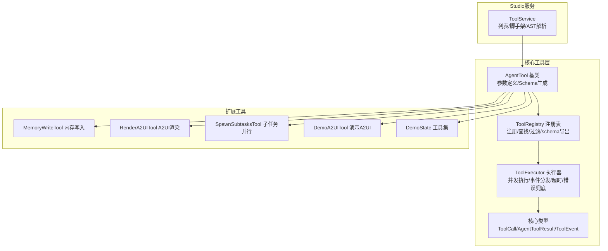
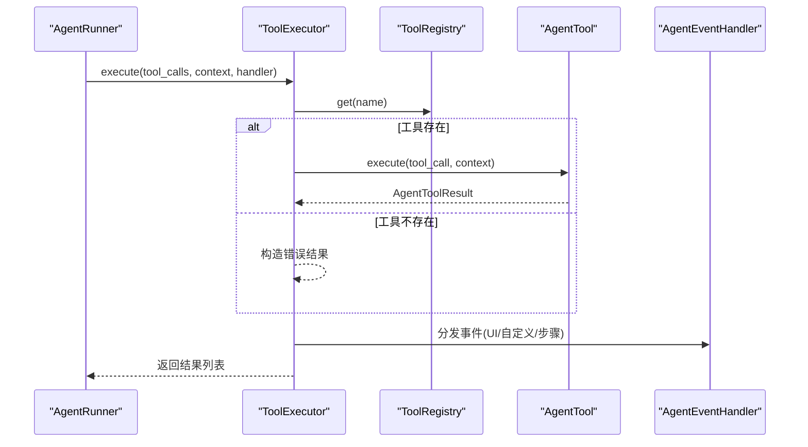
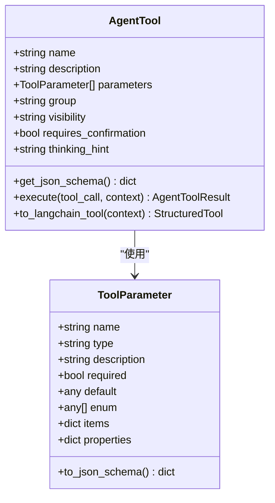
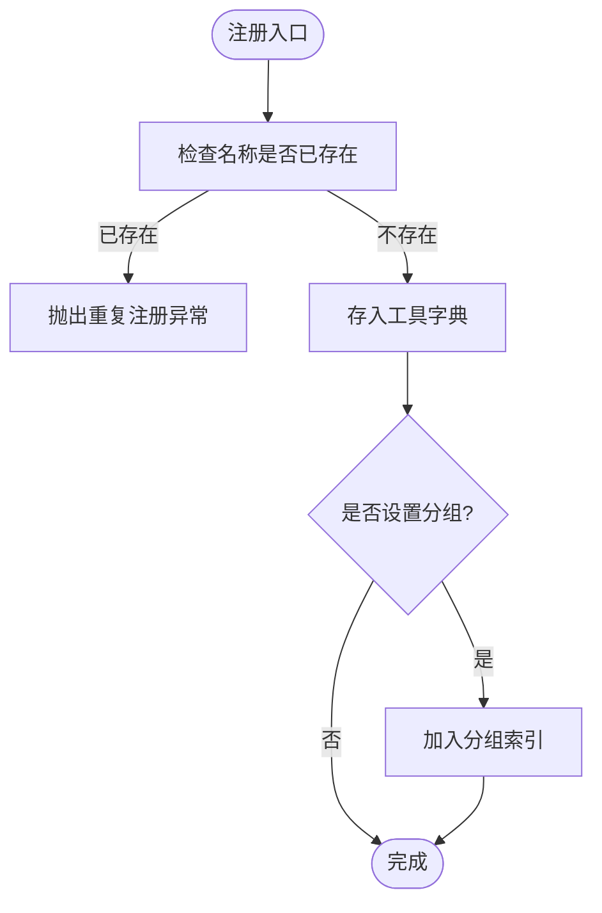
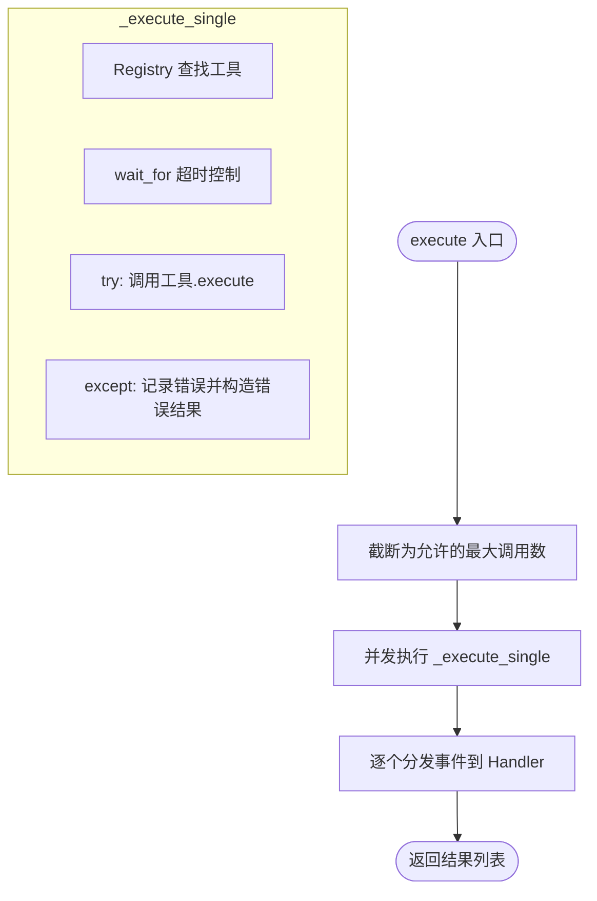
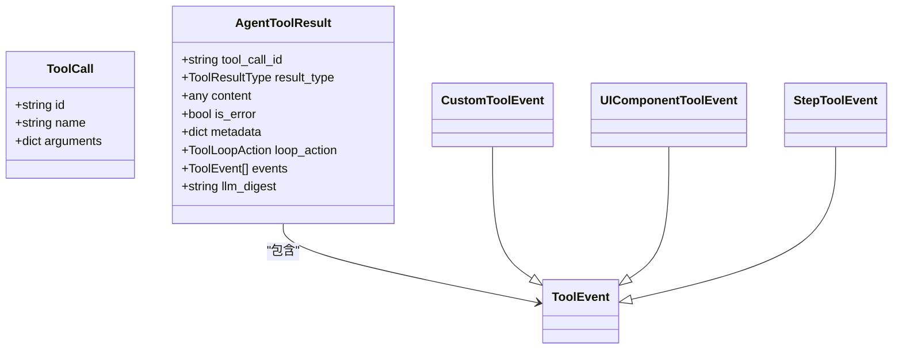
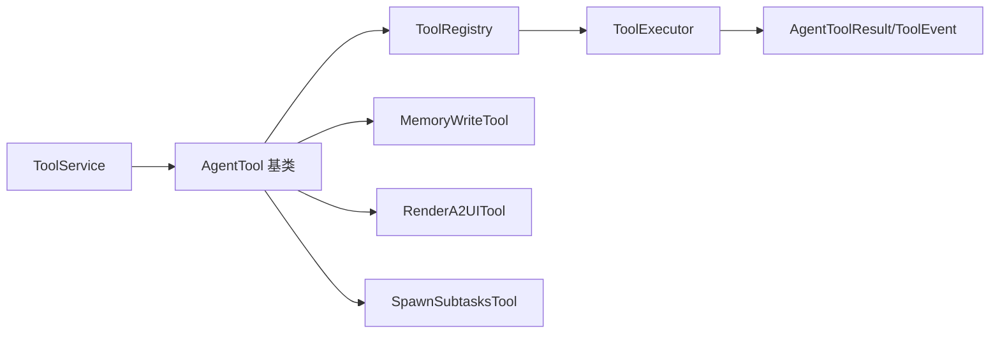

# 工具系统架构

<cite>
**本文引用的文件**
- [src/ark_agentic/core/tools/base.py](file://src/ark_agentic/core/tools/base.py)
- [src/ark_agentic/core/tools/registry.py](file://src/ark_agentic/core/tools/registry.py)
- [src/ark_agentic/core/tools/executor.py](file://src/ark_agentic/core/tools/executor.py)
- [src/ark_agentic/core/tools/__init__.py](file://src/ark_agentic/core/tools/__init__.py)
- [src/ark_agentic/core/types.py](file://src/ark_agentic/core/types.py)
- [src/ark_agentic/core/subtask/tool.py](file://src/ark_agentic/core/subtask/tool.py)
- [src/ark_agentic/core/tools/memory.py](file://src/ark_agentic/core/tools/memory.py)
- [src/ark_agentic/core/tools/render_a2ui.py](file://src/ark_agentic/core/tools/render_a2ui.py)
- [src/ark_agentic/studio/services/tool_service.py](file://src/ark_agentic/studio/services/tool_service.py)
- [src/ark_agentic/agents/securities/tools/agent/account_overview.py](file://src/ark_agentic/agents/securities/tools/agent/account_overview.py)
- [src/ark_agentic/agents/meta_builder/tools/manage_tools.py](file://src/ark_agentic/agents/meta_builder/tools/manage_tools.py)
- [src/ark_agentic/core/tools/demo_a2ui.py](file://src/ark_agentic/core/tools/demo_a2ui.py)
- [src/ark_agentic/core/tools/demo_state.py](file://src/ark_agentic/core/tools/demo_state.py)
</cite>

## 目录
1. [简介](#简介)
2. [项目结构](#项目结构)
3. [核心组件](#核心组件)
4. [架构总览](#架构总览)
5. [详细组件分析](#详细组件分析)
6. [依赖分析](#依赖分析)
7. [性能考虑](#性能考虑)
8. [故障排查指南](#故障排查指南)
9. [结论](#结论)
10. [附录](#附录)

## 简介
本文件系统性阐述工具系统的架构设计与实现要点，涵盖工具注册表的设计模式、工具执行器的并发控制机制、工具基类的抽象设计，以及工具生命周期管理、参数验证、结果处理与错误传播机制。文档还提供自定义工具开发指南、工具适配器模式与工具组合策略，并总结最佳实践与性能优化技巧。

## 项目结构
工具系统位于核心模块中，围绕“工具基类 + 注册表 + 执行器”的三层架构组织，同时提供内存工具、A2UI 渲染工具、子任务工具等扩展能力，并通过 Studio 服务提供工具脚手架与元数据解析能力。

**图表来源**
- [src/ark_agentic/core/tools/base.py:46-163](file://src/ark_agentic/core/tools/base.py#L46-L163)
- [src/ark_agentic/core/tools/registry.py:14-178](file://src/ark_agentic/core/tools/registry.py#L14-L178)
- [src/ark_agentic/core/tools/executor.py:29-127](file://src/ark_agentic/core/tools/executor.py#L29-L127)
- [src/ark_agentic/core/types.py:44-196](file://src/ark_agentic/core/types.py#L44-L196)
- [src/ark_agentic/core/tools/memory.py:39-114](file://src/ark_agentic/core/tools/memory.py#L39-L114)
- [src/ark_agentic/core/tools/render_a2ui.py:178-685](file://src/ark_agentic/core/tools/render_a2ui.py#L178-L685)
- [src/ark_agentic/core/subtask/tool.py:61-319](file://src/ark_agentic/core/subtask/tool.py#L61-L319)
- [src/ark_agentic/core/tools/demo_a2ui.py:17-74](file://src/ark_agentic/core/tools/demo_a2ui.py#L17-L74)
- [src/ark_agentic/core/tools/demo_state.py:16-113](file://src/ark_agentic/core/tools/demo_state.py#L16-L113)
- [src/ark_agentic/studio/services/tool_service.py:40-235](file://src/ark_agentic/studio/services/tool_service.py#L40-L235)

**章节来源**
- [src/ark_agentic/core/tools/__init__.py:7-53](file://src/ark_agentic/core/tools/__init__.py#L7-L53)

## 核心组件
- 工具基类与参数系统：统一的工具抽象、参数定义与 JSON Schema 生成，支持 LangChain 适配。
- 工具注册表：集中管理工具注册、分组、查找、过滤与 Schema 导出。
- 工具执行器：并发执行工具调用、超时控制、错误兜底与事件分发。
- 核心类型：统一的工具调用、结果、事件与循环控制信号的数据结构。
- 扩展工具：内存写入、A2UI 渲染、子任务并行、演示工具等。
- Studio 工具服务：工具列表、脚手架生成与基于 AST 的元数据解析。

**章节来源**
- [src/ark_agentic/core/tools/base.py:46-163](file://src/ark_agentic/core/tools/base.py#L46-L163)
- [src/ark_agentic/core/tools/registry.py:14-178](file://src/ark_agentic/core/tools/registry.py#L14-L178)
- [src/ark_agentic/core/tools/executor.py:29-127](file://src/ark_agentic/core/tools/executor.py#L29-L127)
- [src/ark_agentic/core/types.py:44-196](file://src/ark_agentic/core/types.py#L44-L196)
- [src/ark_agentic/studio/services/tool_service.py:40-235](file://src/ark_agentic/studio/services/tool_service.py#L40-L235)

## 架构总览
工具系统采用“职责单一、接口清晰、事件驱动”的设计。工具基类定义统一抽象，注册表负责工具生命周期管理与策略过滤，执行器负责并发执行与事件分发，核心类型确保跨模块一致的数据契约。

**图表来源**
- [src/ark_agentic/core/tools/executor.py:43-101](file://src/ark_agentic/core/tools/executor.py#L43-L101)
- [src/ark_agentic/core/types.py:69-196](file://src/ark_agentic/core/types.py#L69-L196)

## 详细组件分析

### 工具基类与参数系统
- 抽象设计：AgentTool 定义工具的基本信息（名称、描述、分组、可见性、确认需求、思考提示）、参数定义（ToolParameter）与 JSON Schema 生成方法。
- 参数读取辅助：提供字符串、整数、浮点、布尔、列表、字典等参数读取与校验辅助函数，支持必需参数与默认值。
- 适配器模式：提供 to_langchain_tool 适配器，将 AgentTool.execute 适配为 LangChain StructuredTool，便于生态集成。

**图表来源**
- [src/ark_agentic/core/tools/base.py:46-163](file://src/ark_agentic/core/tools/base.py#L46-L163)

**章节来源**
- [src/ark_agentic/core/tools/base.py:16-163](file://src/ark_agentic/core/tools/base.py#L16-L163)

### 工具注册表
- 职责：注册工具、按名称/分组检索、批量注册、注销、清空、过滤策略、Schema 导出。
- 设计要点：维护工具字典与分组索引；支持白名单/黑名单与分组维度的过滤；支持命名空间去重与排除策略。

**图表来源**
- [src/ark_agentic/core/tools/registry.py:24-40](file://src/ark_agentic/core/tools/registry.py#L24-L40)

**章节来源**
- [src/ark_agentic/core/tools/registry.py:14-178](file://src/ark_agentic/core/tools/registry.py#L14-L178)

### 工具执行器
- 并发控制：限制每轮最大调用次数，使用 asyncio.gather 并行执行；对单次调用设置超时与异常兜底。
- 生命周期管理：记录开始/结束日志、思考提示、错误回退提示；将 AgentToolResult.events 统一分发到 AgentEventHandler。
- 结果处理：根据结果类型映射 UI 协议；支持 JSON、TEXT、A2UI、IMAGE、ERROR 等类型。

**图表来源**
- [src/ark_agentic/core/tools/executor.py:43-101](file://src/ark_agentic/core/tools/executor.py#L43-L101)

**章节来源**
- [src/ark_agentic/core/tools/executor.py:29-127](file://src/ark_agentic/core/tools/executor.py#L29-L127)

### 核心类型与事件系统
- 工具调用：ToolCall 包含 id、name、arguments。
- 工具结果：AgentToolResult 支持多种结果类型（JSON/TEXT/A2UI/IMAGE/ERROR），并携带事件、循环控制信号与元数据。
- 事件：ToolEvent 抽象，包含自定义事件、UI 组件事件、步骤事件等。

**图表来源**
- [src/ark_agentic/core/types.py:69-196](file://src/ark_agentic/core/types.py#L69-L196)

**章节来源**
- [src/ark_agentic/core/types.py:44-196](file://src/ark_agentic/core/types.py#L44-L196)

### 内存工具
- 功能：Agent 主动增量更新用户长期记忆，支持标题级内容写入、覆盖与删除。
- 参数：content（markdown 格式，仅写变化部分）。
- 上下文：要求 context 中提供 user:id，通过 MemoryProvider 解析 MemoryManager。

**章节来源**
- [src/ark_agentic/core/tools/memory.py:39-114](file://src/ark_agentic/core/tools/memory.py#L39-L114)

### A2UI 渲染工具
- 能力：统一的 A2UI 渲染工具，支持三种互斥渲染路径：
  - blocks：动态块组合，生成完整 A2UI 事件。
  - card_type：模板渲染，结合提取器输出完整事件。
  - preset_type：预设渲染，直接输出前端就绪数据。
- 参数动态生成：根据配置对象动态生成 LLM 可见参数，确保语法引导与字段约束。
- 数据增强：支持将 llm_digest 与 state_delta 注入到 AgentToolResult.metadata。

**章节来源**
- [src/ark_agentic/core/tools/render_a2ui.py:178-685](file://src/ark_agentic/core/tools/render_a2ui.py#L178-L685)

### 子任务工具
- 设计：接收任务列表，内部使用 asyncio.gather 并行执行，每个子任务创建独立 AgentRunner + 临时会话，实现上下文隔离。
- 防嵌套：通过会话 ID 标记避免子任务再次 spawn 子任务。
- 聚合：汇总子任务状态增量、Token 使用、转录等信息回传父 Runner。

**章节来源**
- [src/ark_agentic/core/subtask/tool.py:61-319](file://src/ark_agentic/core/subtask/tool.py#L61-L319)

### Studio 工具服务
- 列表：扫描 Agent 目录下的工具文件，通过 AST 解析提取工具元数据（名称、描述、分组、参数）。
- 脚手架：根据模板生成 AgentTool 模板文件，支持参数规格渲染。
- 安全：对非法标识符、文件存在性进行校验与错误提示。

**章节来源**
- [src/ark_agentic/studio/services/tool_service.py:40-235](file://src/ark_agentic/studio/services/tool_service.py#L40-L235)

### 自定义工具开发指南
- 继承 AgentTool，至少定义 name 与 description；可选 group、visibility、requires_confirmation、thinking_hint。
- 定义 parameters，使用 ToolParameter 描述参数类型、是否必需、默认值、枚举与子结构。
- 实现 execute 方法，返回 AgentToolResult（可使用便捷构造器：json_result/text_result/image_result/a2ui_result/error_result）。
- 参数读取：优先使用 read_*_param 辅助函数进行类型转换与默认值处理。
- 事件：必要时在 AgentToolResult.events 中附加 UIComponentToolEvent、CustomToolEvent、StepToolEvent。
- 适配 LangChain：如需对接 LangChain 生态，使用 to_langchain_tool 适配器。

**章节来源**
- [src/ark_agentic/core/tools/base.py:46-163](file://src/ark_agentic/core/tools/base.py#L46-L163)
- [src/ark_agentic/core/types.py:85-196](file://src/ark_agentic/core/types.py#L85-L196)

### 工具适配器模式
- 服务适配：在工具中通过 create_service_adapter 创建服务适配器，将工具参数映射到服务调用，实现工具与外部服务解耦。
- 示例：账户总览工具通过上下文参数与服务适配器协作，完成参数解析与调用。

**章节来源**
- [src/ark_agentic/agents/securities/tools/agent/account_overview.py:57-108](file://src/ark_agentic/agents/securities/tools/agent/account_overview.py#L57-L108)

### 工具组合策略
- 复合工具：通过 ManageToolsTool 提供工具的 CRUD 与读取能力，结合 Studio 服务实现工具的自动化管理。
- 子任务并行：SpawnSubtasksTool 将多意图任务拆分为独立子任务，实现并行执行与上下文隔离。
- A2UI 组合：RenderA2UITool 支持 blocks、card_type、preset_type 三种渲染路径，满足不同 UI 场景。

**章节来源**
- [src/ark_agentic/agents/meta_builder/tools/manage_tools.py:185-315](file://src/ark_agentic/agents/meta_builder/tools/manage_tools.py#L185-L315)
- [src/ark_agentic/core/subtask/tool.py:61-319](file://src/ark_agentic/core/subtask/tool.py#L61-L319)
- [src/ark_agentic/core/tools/render_a2ui.py:178-685](file://src/ark_agentic/core/tools/render_a2ui.py#L178-L685)

## 依赖分析
- 组件内聚：工具基类、注册表、执行器职责清晰，低耦合。
- 外部依赖：LangChain 适配器为可选依赖；A2UI 渲染依赖前端协议与模板系统；子任务工具依赖会话管理器。
- 循环依赖：未发现直接循环依赖；事件分发遵循依赖倒置（工具声明事件，执行器分发）。

**图表来源**
- [src/ark_agentic/core/tools/base.py:46-163](file://src/ark_agentic/core/tools/base.py#L46-L163)
- [src/ark_agentic/core/tools/registry.py:14-178](file://src/ark_agentic/core/tools/registry.py#L14-L178)
- [src/ark_agentic/core/tools/executor.py:29-127](file://src/ark_agentic/core/tools/executor.py#L29-L127)
- [src/ark_agentic/core/types.py:44-196](file://src/ark_agentic/core/types.py#L44-L196)
- [src/ark_agentic/studio/services/tool_service.py:40-235](file://src/ark_agentic/studio/services/tool_service.py#L40-L235)

**章节来源**
- [src/ark_agentic/core/tools/__init__.py:7-53](file://src/ark_agentic/core/tools/__init__.py#L7-L53)

## 性能考虑
- 并发与限流：执行器限制每轮最大调用数，避免资源争用；子任务工具使用信号量控制并发深度。
- 超时控制：对单次工具执行设置超时，防止阻塞影响整体吞吐。
- 事件分发：事件在执行器侧统一分发，减少工具对 UI/事件系统的耦合。
- Schema 生成：注册表按需生成 Schema，避免不必要的计算开销。
- A2UI 渲染：严格模式下进行合同校验，可在开发阶段暴露问题，避免运行期错误放大。

[本节为通用指导，无需特定文件引用]

## 故障排查指南
- 工具未找到：执行器在找不到工具时返回错误结果并记录告警，检查工具是否正确注册与命名。
- 超时错误：执行器捕获超时异常并返回错误结果，适当提高超时阈值或优化工具实现。
- 参数缺失：使用参数读取辅助函数时，注意必需参数与默认值处理；必要时在工具中显式校验。
- A2UI 合同校验：严格模式下若校验失败，返回错误结果并记录警告；检查模板与组件数据结构。
- 子任务防嵌套：若出现嵌套错误，检查会话 ID 标记与子任务配置。

**章节来源**
- [src/ark_agentic/core/tools/executor.py:63-101](file://src/ark_agentic/core/tools/executor.py#L63-L101)
- [src/ark_agentic/core/tools/render_a2ui.py:635-663](file://src/ark_agentic/core/tools/render_a2ui.py#L635-L663)
- [src/ark_agentic/core/subtask/tool.py:110-121](file://src/ark_agentic/core/subtask/tool.py#L110-L121)

## 结论
工具系统通过“基类抽象 + 注册表管理 + 执行器并发控制 + 事件驱动”的架构，实现了高内聚、低耦合、可扩展的工具生态。配合 Studio 服务与多种工具扩展（内存、A2UI、子任务、演示），开发者可以快速构建与维护复杂工具链路，并在保证性能与稳定性的同时提升用户体验。

[本节为总结性内容，无需特定文件引用]

## 附录

### 最佳实践清单
- 明确定义工具参数：使用 ToolParameter 精确描述类型、必需性与约束。
- 合理使用分组与可见性：通过 group 与 visibility 控制工具在不同场景下的呈现与可用性。
- 事件驱动设计：将 UI 更新、业务事件与步骤提示通过事件模型传递，保持工具职责单一。
- 参数读取与校验：优先使用参数读取辅助函数，避免类型转换错误。
- 超时与限流：为长耗时工具设置合理超时与并发上限，保障系统稳定性。
- A2UI 合同校验：在开发阶段启用严格校验，尽早暴露数据结构问题。
- 适配器模式：将外部服务封装为适配器，降低耦合度与测试难度。

[本节为通用指导，无需特定文件引用]