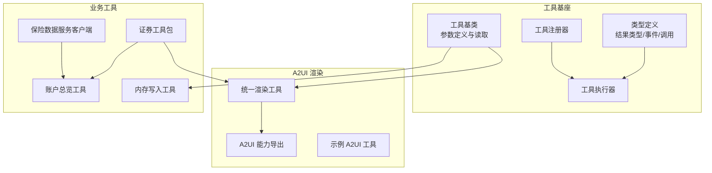
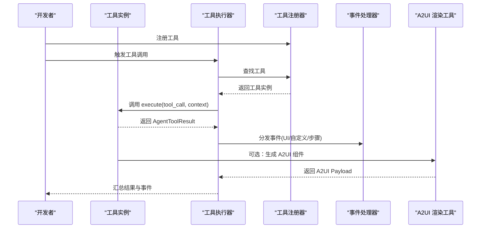
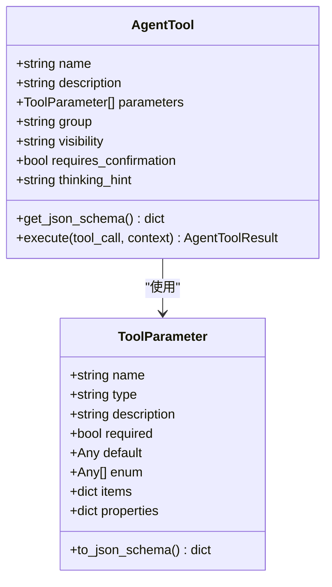
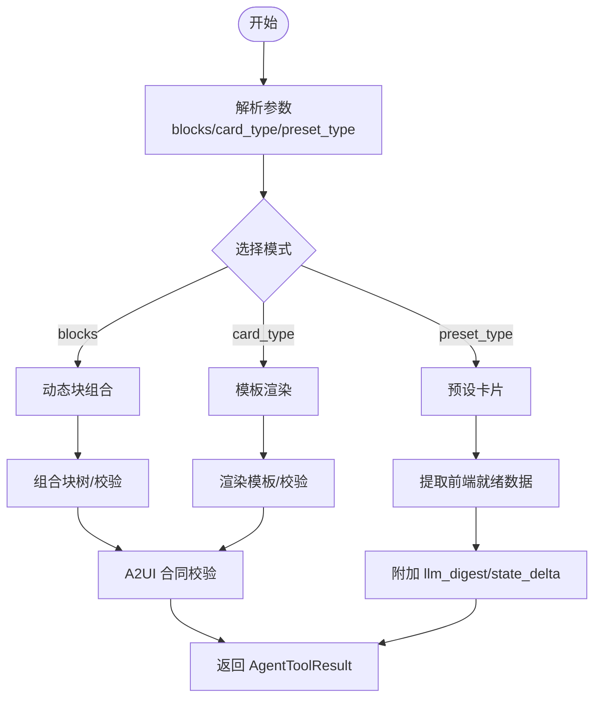
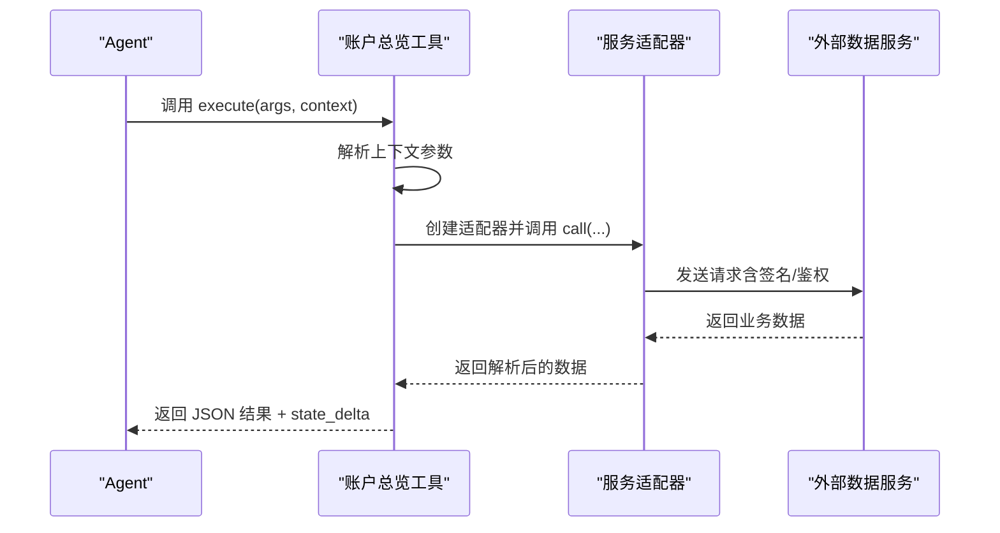
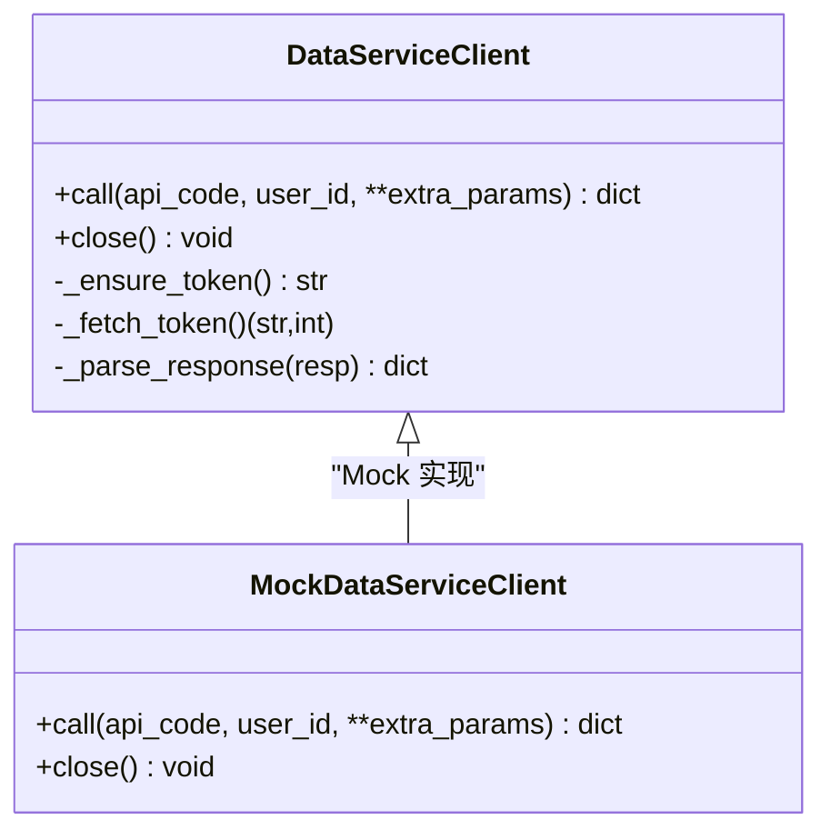
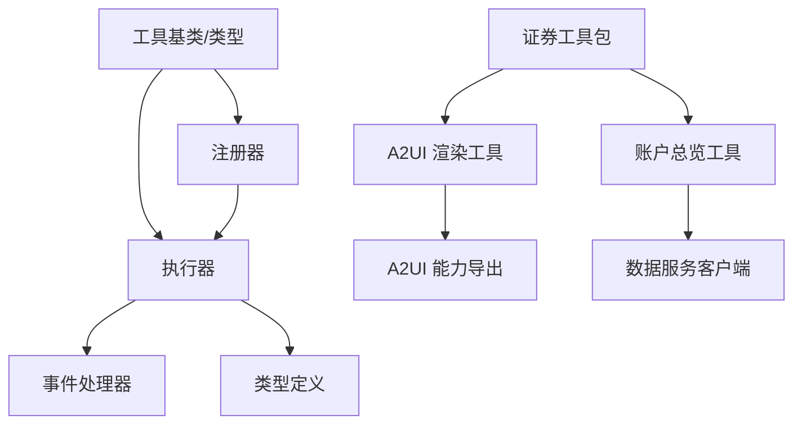

# 自定义工具开发

<cite>
**本文档引用的文件**
- [src/ark_agentic/core/tools/base.py](file://src/ark_agentic/core/tools/base.py)
- [src/ark_agentic/core/tools/render_a2ui.py](file://src/ark_agentic/core/tools/render_a2ui.py)
- [src/ark_agentic/core/tools/memory.py](file://src/ark_agentic/core/tools/memory.py)
- [src/ark_agentic/core/tools/executor.py](file://src/ark_agentic/core/tools/executor.py)
- [src/ark_agentic/core/tools/registry.py](file://src/ark_agentic/core/tools/registry.py)
- [src/ark_agentic/core/types.py](file://src/ark_agentic/core/types.py)
- [src/ark_agentic/core/a2ui/__init__.py](file://src/ark_agentic/core/a2ui/__init__.py)
- [src/ark_agentic/agents/securities/tools/__init__.py](file://src/ark_agentic/agents/securities/tools/__init__.py)
- [src/ark_agentic/agents/securities/tools/agent/account_overview.py](file://src/ark_agentic/agents/securities/tools/agent/account_overview.py)
- [src/ark_agentic/agents/insurance/tools/data_service.py](file://src/ark_agentic/agents/insurance/tools/data_service.py)
- [src/ark_agentic/core/tools/demo_a2ui.py](file://src/ark_agentic/core/tools/demo_a2ui.py)
- [tests/unit/core/test_tools.py](file://tests/unit/core/test_tools.py)
- [tests/integration/test_studio_tools.py](file://tests/integration/test_studio_tools.py)
</cite>

## 目录
1. [简介](#简介)
2. [项目结构](#项目结构)
3. [核心组件](#核心组件)
4. [架构总览](#架构总览)
5. [详细组件分析](#详细组件分析)
6. [依赖分析](#依赖分析)
7. [性能考虑](#性能考虑)
8. [故障排查指南](#故障排查指南)
9. [结论](#结论)
10. [附录](#附录)

## 简介
本指南面向希望在本项目中开发自定义工具的工程师，提供从需求分析到部署上线的全流程实践方法。文档聚焦三类工具的开发范式：
- A2UI 工具：以统一渲染工具为核心，支持动态块组合、模板渲染与预设卡片三种模式。
- 数据服务工具：封装外部 API 认证与调用，提供稳定的数据访问能力。
- 业务逻辑工具：面向具体业务场景，完成参数解析、上下文注入与结果封装。

同时，文档给出工具类继承与实现要求、参数定义与返回值规范、测试策略、调试技巧以及性能优化建议，帮助团队建立一致、可维护、可扩展的工具体系。

## 项目结构
围绕工具开发的核心目录与文件如下：
- 工具基座与通用工具
  - 工具基类与参数读取：[src/ark_agentic/core/tools/base.py](file://src/ark_agentic/core/tools/base.py)
  - 工具执行器与注册器：[src/ark_agentic/core/tools/executor.py](file://src/ark_agentic/core/tools/executor.py)、[src/ark_agentic/core/tools/registry.py](file://src/ark_agentic/core/tools/registry.py)
  - 类型定义：[src/ark_agentic/core/types.py](file://src/ark_agentic/core/types.py)
- A2UI 渲染工具
  - 统一渲染工具：[src/ark_agentic/core/tools/render_a2ui.py](file://src/ark_agentic/core/tools/render_a2ui.py)
  - A2UI 能力导出：[src/ark_agentic/core/a2ui/__init__.py](file://src/ark_agentic/core/a2ui/__init__.py)
  - 示例 A2UI 工具：[src/ark_agentic/core/tools/demo_a2ui.py](file://src/ark_agentic/core/tools/demo_a2ui.py)
- 业务工具示例
  - 证券工具包与账户总览工具：[src/ark_agentic/agents/securities/tools/__init__.py](file://src/ark_agentic/agents/securities/tools/__init__.py)、[src/ark_agentic/agents/securities/tools/agent/account_overview.py](file://src/ark_agentic/agents/securities/tools/agent/account_overview.py)
  - 保险数据服务客户端：[src/ark_agentic/agents/insurance/tools/data_service.py](file://src/ark_agentic/agents/insurance/tools/data_service.py)
- 记忆工具
  - 内存写入工具：[src/ark_agentic/core/tools/memory.py](file://src/ark_agentic/core/tools/memory.py)
- 测试
  - 工具单元测试：[tests/unit/core/test_tools.py](file://tests/unit/core/test_tools.py)
  - Studio 工具解析集成测试：[tests/integration/test_studio_tools.py](file://tests/integration/test_studio_tools.py)

**图表来源**
- [src/ark_agentic/core/tools/base.py:46-163](file://src/ark_agentic/core/tools/base.py#L46-L163)
- [src/ark_agentic/core/tools/render_a2ui.py:178-685](file://src/ark_agentic/core/tools/render_a2ui.py#L178-L685)
- [src/ark_agentic/core/tools/memory.py:39-114](file://src/ark_agentic/core/tools/memory.py#L39-L114)
- [src/ark_agentic/core/tools/executor.py:29-127](file://src/ark_agentic/core/tools/executor.py#L29-L127)
- [src/ark_agentic/core/tools/registry.py:14-178](file://src/ark_agentic/core/tools/registry.py#L14-L178)
- [src/ark_agentic/core/a2ui/__init__.py:1-39](file://src/ark_agentic/core/a2ui/__init__.py#L1-L39)
- [src/ark_agentic/agents/securities/tools/__init__.py:41-66](file://src/ark_agentic/agents/securities/tools/__init__.py#L41-L66)
- [src/ark_agentic/agents/securities/tools/agent/account_overview.py:57-108](file://src/ark_agentic/agents/securities/tools/agent/account_overview.py#L57-L108)
- [src/ark_agentic/agents/insurance/tools/data_service.py:22-231](file://src/ark_agentic/agents/insurance/tools/data_service.py#L22-L231)

**章节来源**
- [src/ark_agentic/core/tools/base.py:1-289](file://src/ark_agentic/core/tools/base.py#L1-L289)
- [src/ark_agentic/core/tools/render_a2ui.py:1-685](file://src/ark_agentic/core/tools/render_a2ui.py#L1-L685)
- [src/ark_agentic/core/tools/memory.py:1-114](file://src/ark_agentic/core/tools/memory.py#L1-L114)
- [src/ark_agentic/core/tools/executor.py:1-127](file://src/ark_agentic/core/tools/executor.py#L1-L127)
- [src/ark_agentic/core/tools/registry.py:1-178](file://src/ark_agentic/core/tools/registry.py#L1-L178)
- [src/ark_agentic/core/types.py:1-200](file://src/ark_agentic/core/types.py#L1-L200)
- [src/ark_agentic/core/a2ui/__init__.py:1-39](file://src/ark_agentic/core/a2ui/__init__.py#L1-L39)
- [src/ark_agentic/agents/securities/tools/__init__.py:1-66](file://src/ark_agentic/agents/securities/tools/__init__.py#L1-L66)
- [src/ark_agentic/agents/securities/tools/agent/account_overview.py:1-108](file://src/ark_agentic/agents/securities/tools/agent/account_overview.py#L1-L108)
- [src/ark_agentic/agents/insurance/tools/data_service.py:1-452](file://src/ark_agentic/agents/insurance/tools/data_service.py#L1-L452)
- [src/ark_agentic/core/tools/demo_a2ui.py:1-74](file://src/ark_agentic/core/tools/demo_a2ui.py#L1-L74)
- [tests/unit/core/test_tools.py:1-344](file://tests/unit/core/test_tools.py#L1-L344)
- [tests/integration/test_studio_tools.py:1-46](file://tests/integration/test_studio_tools.py#L1-L46)

## 核心组件
- 工具基类与参数系统
  - 工具基类提供统一的生命周期与抽象接口，强制子类定义名称与描述，并提供 JSON Schema 导出能力，便于 LLM 函数调用。
  - 参数定义支持多种类型与约束（必填、默认值、枚举、数组/对象项结构），并通过辅助函数进行安全读取。
- 工具执行与分发
  - 执行器负责并发执行工具调用、超时控制、错误兜底与事件分发，确保工具与 UI/事件层解耦。
  - 注册器提供工具注册、分组管理、Schema 生成与策略过滤，支撑运行时动态装配。
- A2UI 渲染工具
  - 统一渲染工具支持三种模式：动态块组合、模板渲染与预设卡片，参数随模式动态生成，严格校验输出契约。
- 业务工具与数据服务
  - 业务工具通过服务适配器对接外部数据源，实现参数映射、签名与鉴权、错误处理与状态回传。
  - 数据服务客户端封装认证令牌缓存、请求构建与响应解析，支持 Mock 模式用于本地开发与测试。

**章节来源**
- [src/ark_agentic/core/tools/base.py:46-163](file://src/ark_agentic/core/tools/base.py#L46-L163)
- [src/ark_agentic/core/tools/executor.py:29-127](file://src/ark_agentic/core/tools/executor.py#L29-L127)
- [src/ark_agentic/core/tools/registry.py:14-178](file://src/ark_agentic/core/tools/registry.py#L14-L178)
- [src/ark_agentic/core/tools/render_a2ui.py:178-685](file://src/ark_agentic/core/tools/render_a2ui.py#L178-L685)
- [src/ark_agentic/agents/securities/tools/agent/account_overview.py:57-108](file://src/ark_agentic/agents/securities/tools/agent/account_overview.py#L57-L108)
- [src/ark_agentic/agents/insurance/tools/data_service.py:22-231](file://src/ark_agentic/agents/insurance/tools/data_service.py#L22-L231)

## 架构总览
工具开发遵循“基类约束 + 执行器调度 + 注册器装配 + A2UI 渲染 + 业务适配”的分层架构。工具通过注册器集中管理，执行器按序并发执行并分发事件，A2UI 渲染工具将业务数据转化为前端组件协议，业务工具通过服务适配器与外部系统交互。

**图表来源**
- [src/ark_agentic/core/tools/registry.py:41-55](file://src/ark_agentic/core/tools/registry.py#L41-L55)
- [src/ark_agentic/core/tools/executor.py:43-100](file://src/ark_agentic/core/tools/executor.py#L43-L100)
- [src/ark_agentic/core/tools/render_a2ui.py:328-362](file://src/ark_agentic/core/tools/render_a2ui.py#L328-L362)

## 详细组件分析

### 工具基类与参数系统
- 继承与实现要求
  - 子类必须定义 name 与 description；可通过 group、visibility、requires_confirmation、thinking_hint 等属性增强行为。
  - 必须实现异步 execute 方法，接收 ToolCall 与上下文，返回 AgentToolResult。
- 参数定义与读取
  - ToolParameter 支持基础类型与复合类型（数组/对象），并可设置默认值、枚举与 items/properties。
  - 提供 read_*_param 与 read_*_param_required 辅助函数，保证参数安全解析与错误提示。
- JSON Schema 生成
  - get_json_schema 输出 OpenAI 兼容格式，用于 LLM 函数调用。

**图表来源**
- [src/ark_agentic/core/tools/base.py:46-163](file://src/ark_agentic/core/tools/base.py#L46-L163)

**章节来源**
- [src/ark_agentic/core/tools/base.py:16-163](file://src/ark_agentic/core/tools/base.py#L16-L163)

### 统一 A2UI 渲染工具
- 模式与参数
  - 支持 blocks（动态块组合）、card_type（模板渲染）、preset_type（预设卡片）三种模式，参数随模式动态生成且互斥。
  - 支持 surface_id 控制画布更新或新建，支持 card_args 作为可选 JSON 参数。
- 执行流程
  - 根据传入参数选择路径：blocks → 组合块树并校验；card_type → 加载模板并渲染；preset_type → 直接返回前端就绪数据。
  - 统一进行 A2UI 合同校验，记录警告与错误到元数据。
- 状态与摘要
  - 可从组件输出收集 llm_digest 与 state_delta，注入到 AgentToolResult 中，便于后续状态管理与摘要生成。

**图表来源**
- [src/ark_agentic/core/tools/render_a2ui.py:244-362](file://src/ark_agentic/core/tools/render_a2ui.py#L244-L362)
- [src/ark_agentic/core/tools/render_a2ui.py:635-662](file://src/ark_agentic/core/tools/render_a2ui.py#L635-L662)

**章节来源**
- [src/ark_agentic/core/tools/render_a2ui.py:178-685](file://src/ark_agentic/core/tools/render_a2ui.py#L178-L685)

### 业务逻辑工具（以账户总览为例）
- 参数与上下文
  - 支持从上下文读取用户相关参数（带 user: 前缀与裸键兼容），并提供默认值与回退策略。
  - 通过服务适配器调用外部 API，传递完整上下文以支持参数映射与签名。
- 结果封装
  - 成功时返回 JSON 结果并携带 state_delta，失败时返回错误结果，便于上层处理与回退。

**图表来源**
- [src/ark_agentic/agents/securities/tools/agent/account_overview.py:72-107](file://src/ark_agentic/agents/securities/tools/agent/account_overview.py#L72-L107)

**章节来源**
- [src/ark_agentic/agents/securities/tools/agent/account_overview.py:57-108](file://src/ark_agentic/agents/securities/tools/agent/account_overview.py#L57-L108)

### 数据服务工具（保险数据服务客户端）
- 认证与缓存
  - 支持 OAuth token 获取与缓存（带安全余量），避免频繁鉴权。
- 请求与响应
  - 统一 form-urlencoded 请求构建，支持错误分类与响应解析（多层嵌套 JSON）。
- Mock 模式
  - 通过环境变量启用 Mock 客户端，便于本地开发与测试，接口与真实客户端保持一致。

**图表来源**
- [src/ark_agentic/agents/insurance/tools/data_service.py:22-231](file://src/ark_agentic/agents/insurance/tools/data_service.py#L22-L231)
- [src/ark_agentic/agents/insurance/tools/data_service.py:236-452](file://src/ark_agentic/agents/insurance/tools/data_service.py#L236-L452)

**章节来源**
- [src/ark_agentic/agents/insurance/tools/data_service.py:1-452](file://src/ark_agentic/agents/insurance/tools/data_service.py#L1-L452)

### 记忆工具
- 写入语义
  - 增量更新长期记忆，支持同名覆盖与空内容删除，写入前检查已有标题，优先复用。
- 上下文要求
  - 需要在上下文中提供 user:id，否则抛出错误。
- 返回结果
  - 成功时返回保存状态与当前标题集合，失败时返回错误信息。

**章节来源**
- [src/ark_agentic/core/tools/memory.py:39-114](file://src/ark_agentic/core/tools/memory.py#L39-L114)

### 工具执行器与注册器
- 执行器
  - 并发执行工具调用，支持超时控制与错误兜底，将事件统一分发到处理器。
- 注册器
  - 提供注册、查找、分组、Schema 生成与策略过滤，支持白名单/黑名单与分组维度的灵活控制。

**章节来源**
- [src/ark_agentic/core/tools/executor.py:29-127](file://src/ark_agentic/core/tools/executor.py#L29-L127)
- [src/ark_agentic/core/tools/registry.py:14-178](file://src/ark_agentic/core/tools/registry.py#L14-L178)

## 依赖分析
- 组件耦合
  - 工具基类与类型定义为底层契约，统一了参数、结果与事件模型。
  - 执行器依赖注册器与事件处理器，实现工具调用与事件分发的解耦。
  - A2UI 渲染工具依赖 A2UI 能力导出（composer、validator、preset 等）。
  - 业务工具通过服务适配器与数据服务客户端交互，隔离外部依赖。
- 外部依赖
  - A2UI 渲染工具依赖模板渲染与主题配置，注册器与执行器不直接依赖外部系统。

**图表来源**
- [src/ark_agentic/core/tools/base.py:46-163](file://src/ark_agentic/core/tools/base.py#L46-L163)
- [src/ark_agentic/core/tools/executor.py:29-127](file://src/ark_agentic/core/tools/executor.py#L29-L127)
- [src/ark_agentic/core/tools/registry.py:14-178](file://src/ark_agentic/core/tools/registry.py#L14-L178)
- [src/ark_agentic/core/a2ui/__init__.py:1-39](file://src/ark_agentic/core/a2ui/__init__.py#L1-L39)
- [src/ark_agentic/agents/securities/tools/__init__.py:41-66](file://src/ark_agentic/agents/securities/tools/__init__.py#L41-L66)
- [src/ark_agentic/agents/insurance/tools/data_service.py:22-231](file://src/ark_agentic/agents/insurance/tools/data_service.py#L22-L231)

**章节来源**
- [src/ark_agentic/core/tools/base.py:1-289](file://src/ark_agentic/core/tools/base.py#L1-L289)
- [src/ark_agentic/core/tools/executor.py:1-127](file://src/ark_agentic/core/tools/executor.py#L1-L127)
- [src/ark_agentic/core/tools/registry.py:1-178](file://src/ark_agentic/core/tools/registry.py#L1-L178)
- [src/ark_agentic/core/a2ui/__init__.py:1-39](file://src/ark_agentic/core/a2ui/__init__.py#L1-L39)
- [src/ark_agentic/agents/securities/tools/__init__.py:1-66](file://src/ark_agentic/agents/securities/tools/__init__.py#L1-L66)
- [src/ark_agentic/agents/insurance/tools/data_service.py:1-452](file://src/ark_agentic/agents/insurance/tools/data_service.py#L1-L452)

## 性能考虑
- 并发与限流
  - 执行器对工具调用采用并发执行并限制每轮最大调用次数，避免资源争用与雪崩效应。
- 超时与降级
  - 对工具执行设置超时阈值，超时与异常均返回错误结果，便于上层快速恢复。
- A2UI 校验
  - 在严格模式下进行合同校验，提前暴露问题；非严格模式记录警告，平衡稳定性与灵活性。
- 数据服务缓存
  - 认证令牌缓存减少重复鉴权开销，建议合理设置过期时间与刷新策略。
- 参数解析
  - 使用参数读取辅助函数进行类型转换与默认值处理，降低异常分支与重复判断成本。

[本节为通用性能建议，不直接分析特定文件]

## 故障排查指南
- 工具未注册或名称错误
  - 检查注册器是否正确注册工具，确认名称拼写与大小写一致。
- 参数缺失或类型不匹配
  - 使用参数读取辅助函数进行显式校验，必要时在工具描述中明确必填项与默认值。
- A2UI 渲染失败
  - 关注校验错误与警告信息，核对组件结构、模板路径与数据 schema；在严格模式下定位首条错误。
- 数据服务调用异常
  - 检查认证配置、请求参数与响应解析逻辑；必要时启用 Mock 模式验证业务逻辑。
- 事件未到达前端
  - 确认执行器已分发事件，检查事件处理器是否正确订阅 UI/自定义/步骤事件。

**章节来源**
- [src/ark_agentic/core/tools/registry.py:41-55](file://src/ark_agentic/core/tools/registry.py#L41-L55)
- [src/ark_agentic/core/tools/render_a2ui.py:635-662](file://src/ark_agentic/core/tools/render_a2ui.py#L635-L662)
- [src/ark_agentic/agents/insurance/tools/data_service.py:114-128](file://src/ark_agentic/agents/insurance/tools/data_service.py#L114-L128)
- [src/ark_agentic/core/tools/executor.py:110-127](file://src/ark_agentic/core/tools/executor.py#L110-L127)

## 结论
通过统一的工具基类、严格的参数与结果规范、完善的执行与注册机制，以及灵活的 A2UI 渲染与数据服务适配，本项目形成了可扩展、可测试、可维护的工具开发体系。建议在新工具开发中遵循本文档的流程与规范，结合测试与调试最佳实践，确保工具质量与交付效率。

[本节为总结性内容，不直接分析特定文件]

## 附录

### 工具开发流程清单
- 需求分析
  - 明确工具目标、输入输出、边界条件与错误场景。
- 设计与实现
  - 继承 AgentTool，定义 name/description/parameters，实现 execute 并返回 AgentToolResult。
  - 如涉及 UI，使用统一渲染工具或直接构造 A2UI 组件。
  - 如涉及外部数据，封装数据服务客户端并处理认证与错误。
- 测试
  - 单元测试：覆盖参数解析、边界条件与错误路径。
  - 集成测试：验证工具注册、执行器调度与事件分发。
  - Studio 工具解析：确保工具文件可被解析并正确提取元信息。
- 部署与上线
  - 将工具注册到运行时，配置分组与可见性，监控执行耗时与错误率。

**章节来源**
- [tests/unit/core/test_tools.py:1-344](file://tests/unit/core/test_tools.py#L1-L344)
- [tests/integration/test_studio_tools.py:28-46](file://tests/integration/test_studio_tools.py#L28-L46)

### 参数定义与返回值规范
- 参数定义
  - 使用 ToolParameter 描述类型、必填、默认值、枚举与复合结构。
  - 通过 read_*_param 辅助函数进行安全读取，必要时使用 *_required 版本。
- 返回值
  - JSON：使用 json_result；文本：使用 text_result；图片：使用 image_result；A2UI：使用 a2ui_result；错误：使用 error_result。
  - 可附加 metadata、events、llm_digest、state_delta 等扩展信息。

**章节来源**
- [src/ark_agentic/core/tools/base.py:169-289](file://src/ark_agentic/core/tools/base.py#L169-L289)
- [src/ark_agentic/core/types.py:86-196](file://src/ark_agentic/core/types.py#L86-L196)

### A2UI 工具开发要点
- 选择模式
  - 动态块组合：适合复杂布局与交互，参数随类型约束。
  - 模板渲染：适合标准化卡片，通过模板与提取器解耦。
  - 预设卡片：适合快速落地的前端就绪数据。
- 参数生成
  - 根据配置动态生成参数描述与枚举，确保 LLM 调用准确。
- 合同校验
  - 严格模式下提前发现错误，非严格模式记录警告以便迭代。

**章节来源**
- [src/ark_agentic/core/tools/render_a2ui.py:244-325](file://src/ark_agentic/core/tools/render_a2ui.py#L244-L325)
- [src/ark_agentic/core/tools/render_a2ui.py:635-662](file://src/ark_agentic/core/tools/render_a2ui.py#L635-L662)

### 数据服务工具开发要点
- 认证与缓存
  - 统一管理 token 获取与缓存，避免重复鉴权。
- 请求构建
  - 固化 form 参数与头部字段，确保一致性。
- 响应解析
  - 处理多层嵌套 JSON 与异常分支，提供清晰的错误信息。
- Mock 支持
  - 通过环境变量切换 Mock/真实客户端，提升开发效率。

**章节来源**
- [src/ark_agentic/agents/insurance/tools/data_service.py:22-231](file://src/ark_agentic/agents/insurance/tools/data_service.py#L22-L231)
- [src/ark_agentic/agents/insurance/tools/data_service.py:433-452](file://src/ark_agentic/agents/insurance/tools/data_service.py#L433-L452)

### 业务逻辑工具开发要点
- 参数解析
  - 优先 user: 前缀，兼容裸键，提供默认值与回退策略。
- 服务适配
  - 通过适配器传递完整上下文，支持参数映射与签名。
- 结果封装
  - 成功返回 JSON 与 state_delta，失败返回错误结果，便于上层处理。

**章节来源**
- [src/ark_agentic/agents/securities/tools/agent/account_overview.py:32-107](file://src/ark_agentic/agents/securities/tools/agent/account_overview.py#L32-L107)

### 测试策略与调试技巧
- 单元测试
  - 覆盖参数读取、工具基类行为、注册器操作与类型定义。
- 集成测试
  - 验证工具注册、执行器调度、事件分发与 Studio 工具解析。
- 调试技巧
  - 使用日志记录工具调用开始/结束、错误与内容大小，定位性能瓶颈。
  - 在 A2UI 渲染阶段开启严格校验，快速发现契约问题。

**章节来源**
- [tests/unit/core/test_tools.py:1-344](file://tests/unit/core/test_tools.py#L1-L344)
- [tests/integration/test_studio_tools.py:1-46](file://tests/integration/test_studio_tools.py#L1-L46)
- [src/ark_agentic/core/tools/executor.py:69-100](file://src/ark_agentic/core/tools/executor.py#L69-L100)
- [src/ark_agentic/core/tools/render_a2ui.py:640-662](file://src/ark_agentic/core/tools/render_a2ui.py#L640-L662)