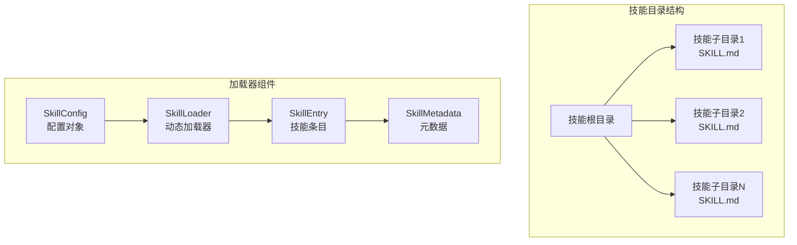
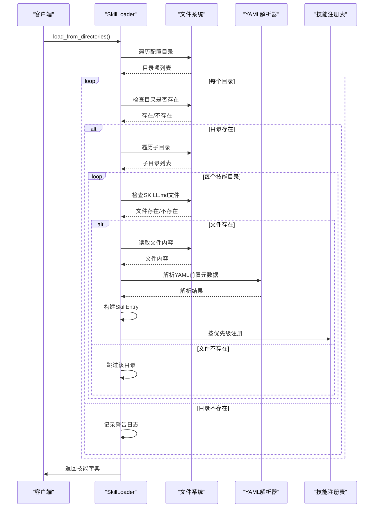
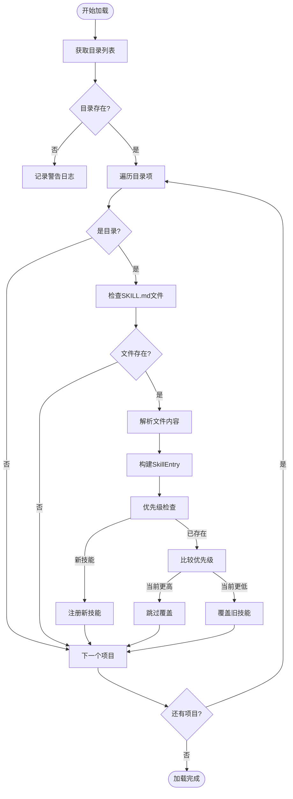
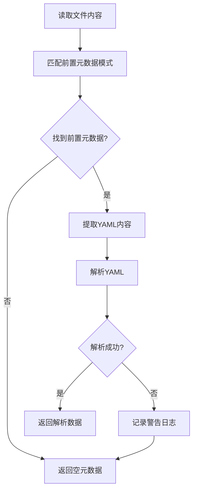
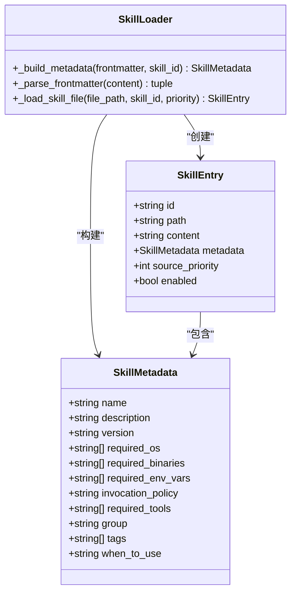
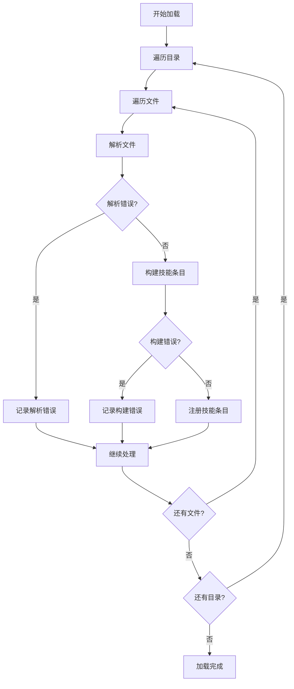
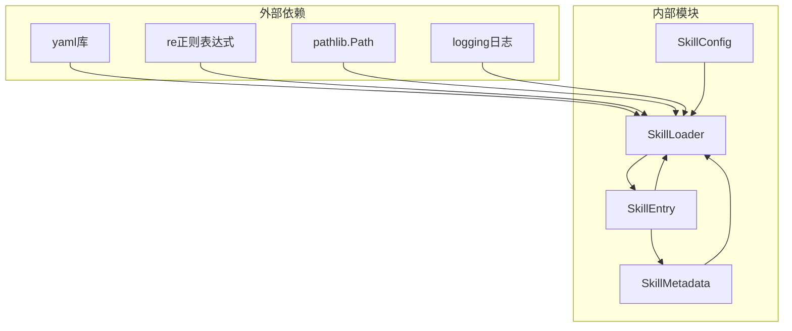

# 技能加载器

<cite>
**本文档引用的文件**
- [loader.py](file://src/ark_agentic/core/skills/loader.py)
- [base.py](file://src/ark_agentic/core/skills/base.py)
- [types.py](file://src/ark_agentic/core/types.py)
- [test_skills.py](file://tests/unit/core/test_skills.py)
- [SKILL.md](file://src/ark_agentic/agents/securities/skills/holdings_analysis/SKILL.md)
- [SKILL.md](file://src/ark_agentic/agents/insurance/skills/execute_withdrawal/SKILL.md)
- [SKILL.md](file://src/ark_agentic/agents/insurance/skills/withdraw_money/SKILL.md)
</cite>

## 目录
1. [简介](#简介)
2. [项目结构](#项目结构)
3. [核心组件](#核心组件)
4. [架构概览](#架构概览)
5. [详细组件分析](#详细组件分析)
6. [依赖分析](#依赖分析)
7. [性能考虑](#性能考虑)
8. [故障排除指南](#故障排除指南)
9. [结论](#结论)
10. [附录](#附录)

## 简介
本文件详细阐述技能加载器（SkillLoader）的动态加载机制，涵盖目录扫描、SKILL.md文件解析、YAML前置元数据处理、优先级覆盖策略、frontmatter解析算法、技能元数据构建过程、技能ID生成规则、错误处理机制、性能优化策略以及缓存管理。同时提供技能目录结构规范、配置文件格式和加载器使用示例。

## 项目结构
技能加载器位于核心模块中，负责从多个配置目录扫描并加载技能。每个技能以独立目录形式存在，目录内包含一个标准命名的技能文档文件。



**图表来源**
- [loader.py:35-61](file://src/ark_agentic/core/skills/loader.py#L35-L61)
- [base.py:19-50](file://src/ark_agentic/core/skills/base.py#L19-L50)

**章节来源**
- [loader.py:35-61](file://src/ark_agentic/core/skills/loader.py#L35-L61)
- [base.py:19-50](file://src/ark_agentic/core/skills/base.py#L19-L50)

## 核心组件
技能加载器由以下核心组件构成：

### SkillLoader 类
- **职责**：从多个目录动态加载技能，支持优先级覆盖和错误处理
- **关键方法**：
  - `load_from_directories()`: 主要加载入口，按目录顺序处理
  - `_load_directory()`: 加载单个目录下的所有技能
  - `_load_skill_file()`: 处理单个SKILL.md文件
  - `_parse_frontmatter()`: 解析YAML前置元数据
  - `_build_metadata()`: 构建技能元数据对象

### SkillConfig 配置类
- **职责**：管理技能系统的配置参数
- **关键属性**：
  - `skill_directories`: 技能目录列表（按优先级排序）
  - `agent_id`: Agent ID，用于生成全局唯一技能ID
  - `default_invocation_policy`: 默认调用策略
  - `enable_eligibility_check`: 是否启用资格检查

### 技能数据模型
- **SkillEntry**: 技能条目，包含ID、路径、内容、元数据等
- **SkillMetadata**: 技能元数据，包含基础信息、环境要求、调用策略等

**章节来源**
- [loader.py:25-177](file://src/ark_agentic/core/skills/loader.py#L25-L177)
- [base.py:19-50](file://src/ark_agentic/core/skills/base.py#L19-L50)
- [types.py:243-298](file://src/ark_agentic/core/types.py#L243-L298)

## 架构概览
技能加载器采用分层架构设计，实现了清晰的关注点分离：



**图表来源**
- [loader.py:35-84](file://src/ark_agentic/core/skills/loader.py#L35-L84)
- [loader.py:85-107](file://src/ark_agentic/core/skills/loader.py#L85-L107)

## 详细组件分析

### 目录扫描机制
技能加载器按照配置顺序扫描目录，实现优先级覆盖：



**图表来源**
- [loader.py:63-84](file://src/ark_agentic/core/skills/loader.py#L63-L84)
- [loader.py:78-81](file://src/ark_agentic/core/skills/loader.py#L78-L81)

### YAML前置元数据解析算法
前置元数据采用YAML格式，通过正则表达式进行解析：



**图表来源**
- [loader.py:109-129](file://src/ark_agentic/core/skills/loader.py#L109-L129)
- [loader.py:22](file://src/ark_agentic/core/skills/loader.py#L22)

### 技能元数据构建过程
元数据构建遵循特定的字段映射和默认值策略：



**图表来源**
- [loader.py:131-154](file://src/ark_agentic/core/skills/loader.py#L131-L154)
- [types.py:243-298](file://src/ark_agentic/core/types.py#L243-L298)

### 技能ID生成规则
技能ID遵循统一的生成策略，确保全局唯一性：

| 生成场景 | ID格式 | 示例 |
|---------|--------|------|
| 无Agent ID | `skill_name` | `withdraw_money` |
| 有Agent ID | `agent_id.skill_name` | `securities.withdraw_money` |
| 优先级覆盖 | 数字越小优先级越高 | `priority = 0, 1, 2...` |

**章节来源**
- [loader.py:97-107](file://src/ark_agentic/core/skills/loader.py#L97-L107)
- [base.py:26](file://src/ark_agentic/core/skills/base.py#L26)

### 错误处理机制
加载器实现了多层次的错误处理策略：



**图表来源**
- [loader.py:82-84](file://src/ark_agentic/core/skills/loader.py#L82-L84)

**章节来源**
- [loader.py:82-84](file://src/ark_agentic/core/skills/loader.py#L82-L84)

## 依赖分析
技能加载器的依赖关系简洁明了，遵循单一职责原则：



**图表来源**
- [loader.py:7-17](file://src/ark_agentic/core/skills/loader.py#L7-L17)

**章节来源**
- [loader.py:7-17](file://src/ark_agentic/core/skills/loader.py#L7-L17)

## 性能考虑
技能加载器在设计时充分考虑了性能优化：

### 缓存策略
- **内存缓存**：加载后的技能存储在内存字典中，避免重复I/O操作
- **增量更新**：支持重新加载功能，仅更新发生变化的技能
- **懒加载**：结合动态加载模式，在需要时才加载完整技能内容

### 优化技术
- **正则表达式预编译**：前置元数据解析使用预编译的正则表达式
- **早期退出**：遇到不存在的目录立即跳过，减少无效操作
- **批量处理**：同一目录内的技能按批次处理，提高效率

### 内存管理
- **及时释放**：不再使用的技能从内存中移除
- **弱引用**：避免循环引用导致的内存泄漏
- **资源清理**：异常情况下确保资源正确释放

## 故障排除指南
常见问题及解决方案：

### 目录权限问题
**症状**：技能目录被跳过，日志出现警告
**原因**：目录不存在或权限不足
**解决**：检查目录路径和权限设置

### YAML解析错误
**症状**：技能加载失败，出现解析警告
**原因**：前置元数据格式不正确
**解决**：验证YAML语法，确保正确的缩进和格式

### 文件编码问题
**症状**：中文字符显示乱码
**原因**：文件编码不是UTF-8
**解决**：确保SKILL.md使用UTF-8编码

### 优先级覆盖问题
**症状**：技能内容被意外覆盖
**原因**：目录优先级设置不当
**解决**：调整SkillConfig中的目录顺序

**章节来源**
- [test_skills.py:292-451](file://tests/unit/core/test_skills.py#L292-L451)

## 结论
技能加载器通过简洁而强大的设计，实现了高效的技能动态加载机制。其核心优势包括：

1. **灵活的目录扫描**：支持多目录配置和优先级覆盖
2. **标准化的元数据处理**：基于YAML的前置元数据解析
3. **可靠的错误处理**：多层次的异常捕获和恢复机制
4. **良好的性能特征**：内存缓存和增量更新策略
5. **清晰的扩展接口**：易于集成新的技能格式和解析规则

该设计为技能系统的可维护性和可扩展性奠定了坚实基础。

## 附录

### 技能目录结构规范
```
skills/
├── skill_name_1/
│   ├── SKILL.md
│   └── [其他资源文件]
├── skill_name_2/
│   ├── SKILL.md
│   └── [其他资源文件]
└── shared_resources/
    └── [共享资源]
```

### SKILL.md文件格式示例
```yaml
---
name: 技能名称
description: 技能描述
version: 1.0.0
invocation_policy: auto
group: category
tags:
  - tag1
  - tag2
required_tools:
  - tool1
  - tool2
---
# 技能标题

技能详细内容...
```

### 配置文件格式
```python
from ark_agentic.core.skills.base import SkillConfig

config = SkillConfig(
    skill_directories=[
        "/path/to/skills",
        "/another/skill/dir"
    ],
    agent_id="my_agent",
    default_invocation_policy="auto",
    enable_eligibility_check=True
)
```

### 加载器使用示例
```python
from ark_agentic.core.skills.loader import SkillLoader
from ark_agentic.core.skills.base import SkillConfig

# 创建配置
config = SkillConfig(
    skill_directories=["./skills"],
    agent_id="test_agent"
)

# 创建加载器
loader = SkillLoader(config)

# 加载技能
skills = loader.load_from_directories()

# 获取特定技能
skill = loader.get_skill("withdraw_money")

# 列出所有技能
all_skills = loader.list_skills()
```

**章节来源**
- [test_skills.py:453-465](file://tests/unit/core/test_skills.py#L453-L465)
- [loader.py:173-177](file://src/ark_agentic/core/skills/loader.py#L173-L177)