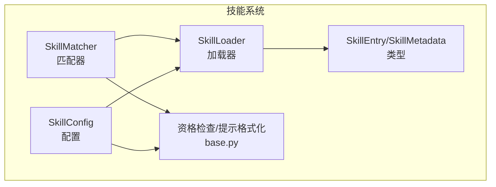
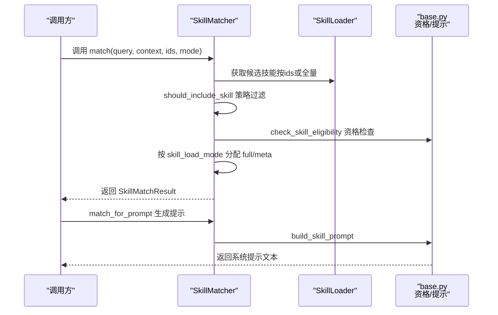
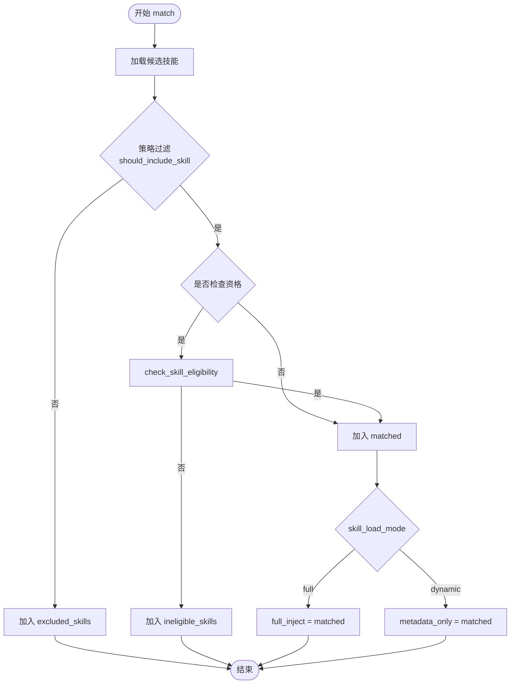
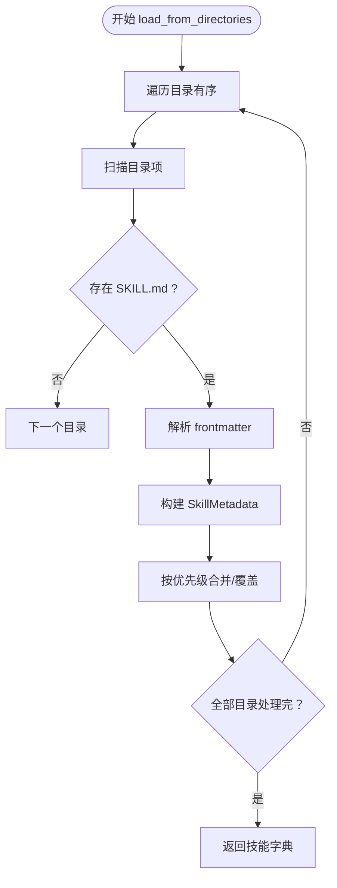
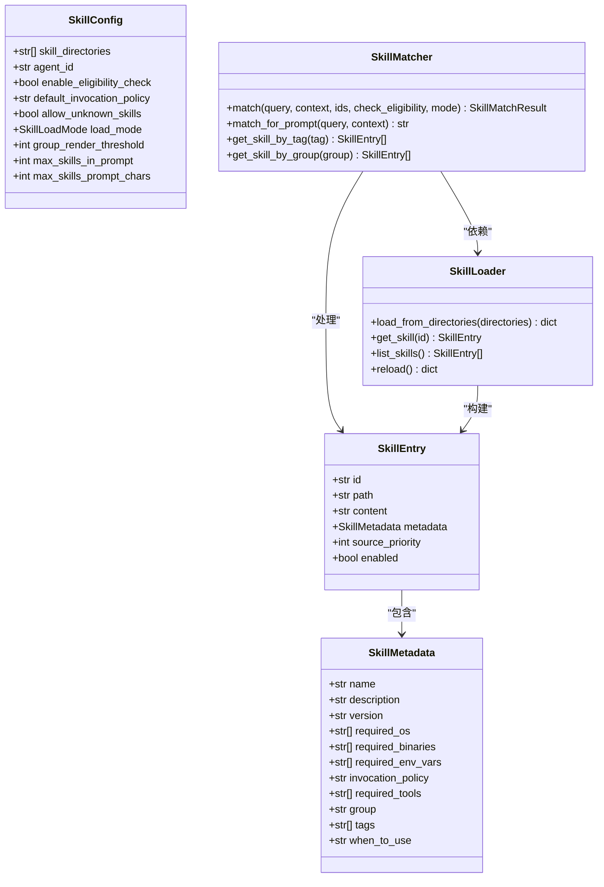
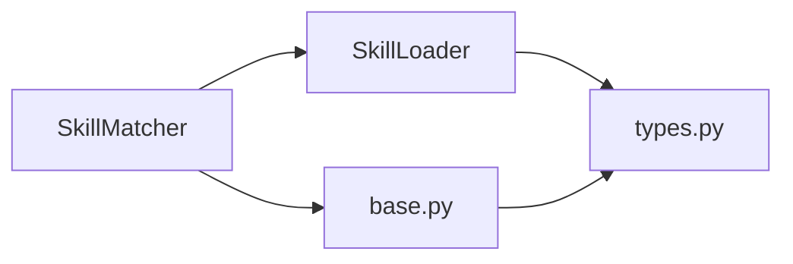

# 技能匹配器

<cite>
**本文档引用的文件**
- [matcher.py](file://src/ark_agentic/core/skills/matcher.py)
- [loader.py](file://src/ark_agentic/core/skills/loader.py)
- [base.py](file://src/ark_agentic/core/skills/base.py)
- [types.py](file://src/ark_agentic/core/types.py)
- [test_skills.py](file://tests/unit/core/test_skills.py)
- [test_runner_skill_load_mode.py](file://tests/unit/core/test_runner_skill_load_mode.py)
- [evals.json（资产概览）](file://tests/skills/asset_overview-workspace/evals/evals.json)
- [evals.json（保险需求澄清）](file://tests/skills/insurance/clarify_need/evals/evals.json)
- [eval_asset_overview_static.py](file://tests/skills/eval_asset_overview_static.py)
- [grounding_cache.py](file://src/ark_agentic/core/utils/grounding_cache.py)
- [matcher.py（股票搜索）](file://src/ark_agentic/agents/securities/tools/service/stock_search/matcher.py)
</cite>

## 目录
1. [简介](#简介)
2. [项目结构](#项目结构)
3. [核心组件](#核心组件)
4. [架构总览](#架构总览)
5. [详细组件分析](#详细组件分析)
6. [依赖分析](#依赖分析)
7. [性能考虑](#性能考虑)
8. [故障排查指南](#故障排查指南)
9. [结论](#结论)
10. [附录](#附录)

## 简介
本文件系统性阐述技能匹配器的设计与实现，涵盖意图识别、资格检查、匹配阈值与预算控制、配置选项、性能优化策略、扩展机制、评估方法、调试工具与常见问题处理，以及最佳实践与性能监控建议。技能匹配器负责在给定上下文下筛选出可用技能，并按“全文注入”或“动态按需加载”的模式进行分发，确保系统提示的规模与质量平衡。

## 项目结构
技能匹配器位于核心技能模块，主要由三部分组成：
- 匹配器：根据上下文与策略过滤技能，产出匹配结果
- 加载器：从目录扫描并解析技能元数据与正文
- 基础能力：资格检查、提示格式化、预算控制与渲染策略

图表来源
- [matcher.py:55-126](file://src/ark_agentic/core/skills/matcher.py#L55-L126)
- [loader.py:25-171](file://src/ark_agentic/core/skills/loader.py#L25-L171)
- [base.py:19-344](file://src/ark_agentic/core/skills/base.py#L19-L344)
- [types.py:243-308](file://src/ark_agentic/core/tuples/types.py#L243-L308)

章节来源
- [matcher.py:1-152](file://src/ark_agentic/core/skills/matcher.py#L1-L152)
- [loader.py:1-177](file://src/ark_agentic/core/skills/loader.py#L1-L177)
- [base.py:1-344](file://src/ark_agentic/core/skills/base.py#L1-L344)
- [types.py:243-308](file://src/ark_agentic/core/types.py#L243-L308)

## 核心组件
- SkillMatcher：执行匹配逻辑，按策略与资格过滤，再按加载模式分组
- SkillLoader：扫描目录、解析 frontmatter、构建 SkillEntry
- SkillConfig：技能系统配置（目录、默认策略、预算阈值等）
- SkillEntry/SkillMetadata：技能实体与元数据（含调用策略、分组、标签等）

章节来源
- [matcher.py:55-152](file://src/ark_agentic/core/skills/matcher.py#L55-L152)
- [loader.py:25-171](file://src/ark_agentic/core/skills/loader.py#L25-L171)
- [base.py:19-50](file://src/ark_agentic/core/skills/base.py#L19-L50)
- [types.py:243-298](file://src/ark_agentic/core/types.py#L243-L298)

## 架构总览
技能匹配器遵循“策略过滤 → 资格检查 → 预算与渲染”的流水线设计，支持两种加载模式：
- full：将技能正文注入系统提示
- dynamic：仅注入元数据，由模型按需通过 read_skill 加载

图表来源
- [matcher.py:64-135](file://src/ark_agentic/core/skills/matcher.py#L64-L135)
- [base.py:51-101](file://src/ark_agentic/core/skills/base.py#L51-L101)
- [base.py:306-325](file://src/ark_agentic/core/skills/base.py#L306-L325)

## 详细组件分析

### 匹配器（SkillMatcher）
职责与流程
- 输入：查询、上下文、指定技能ID集合、是否检查资格、加载模式
- 过滤：策略过滤（always/auto/manual）、资格检查（OS/二进制/环境变量/工具）
- 分配：full 模式全量注入，dynamic 模式仅元数据
- 输出：SkillMatchResult（full_inject、metadata_only、排除/不满足资格列表）

图表来源
- [matcher.py:64-126](file://src/ark_agentic/core/skills/matcher.py#L64-L126)
- [base.py:104-137](file://src/ark_agentic/core/skills/base.py#L104-L137)
- [base.py:51-101](file://src/ark_agentic/core/skills/base.py#L51-L101)

章节来源
- [matcher.py:55-152](file://src/ark_agentic/core/skills/matcher.py#L55-L152)
- [test_skills.py:490-546](file://tests/unit/core/test_skills.py#L490-L546)

### 加载器（SkillLoader）
职责与流程
- 从多个目录按优先级加载 SKILL.md
- 解析 YAML frontmatter，构建 SkillMetadata
- 合并覆盖：后目录同ID覆盖前目录
- 支持重新加载

图表来源
- [loader.py:35-84](file://src/ark_agentic/core/skills/loader.py#L35-L84)
- [loader.py:85-130](file://src/ark_agentic/core/skills/loader.py#L85-L130)
- [loader.py:131-154](file://src/ark_agentic/core/skills/loader.py#L131-L154)

章节来源
- [loader.py:25-177](file://src/ark_agentic/core/skills/loader.py#L25-L177)

### 基础能力（资格检查与提示格式化）
- 资格检查：操作系统、二进制命令、环境变量、工具依赖
- 提示格式化：扁平/分组渲染、预算控制（数量与字符上限）、截断提示
- 动态模式提示：加载指令 + 元数据段

图表来源
- [base.py:19-50](file://src/ark_agentic/core/skills/base.py#L19-L50)
- [types.py:243-298](file://src/ark_agentic/core/types.py#L243-L298)
- [types.py:274-298](file://src/ark_agentic/core/types.py#L274-L298)
- [matcher.py:55-152](file://src/ark_agentic/core/skills/matcher.py#L55-L152)
- [loader.py:25-171](file://src/ark_agentic/core/skills/loader.py#L25-L171)

章节来源
- [base.py:51-101](file://src/ark_agentic/core/skills/base.py#L51-L101)
- [base.py:104-137](file://src/ark_agentic/core/skills/base.py#L104-L137)
- [base.py:242-262](file://src/ark_agentic/core/skills/base.py#L242-L262)
- [base.py:207-240](file://src/ark_agentic/core/skills/base.py#L207-L240)
- [base.py:306-344](file://src/ark_agentic/core/skills/base.py#L306-L344)
- [types.py:303-308](file://src/ark_agentic/core/types.py#L303-L308)

## 依赖分析
- SkillMatcher 依赖 SkillLoader 与 base 模块（资格检查、提示构建）
- SkillLoader 依赖 SkillConfig 与 SkillEntry/SkillMetadata 类型
- 测试覆盖了策略过滤与分组渲染行为

图表来源
- [matcher.py:16-22](file://src/ark_agentic/core/skills/matcher.py#L16-L22)
- [loader.py:16-17](file://src/ark_agentic/core/skills/loader.py#L16-L17)
- [base.py](file://src/ark_agentic/core/skills/base.py#L16)

章节来源
- [test_skills.py:490-546](file://tests/unit/core/test_skills.py#L490-L546)
- [test_runner_skill_load_mode.py:355-388](file://tests/unit/core/test_runner_skill_load_mode.py#L355-L388)

## 性能考虑
- 预算控制
  - 数量上限：max_skills_in_prompt，默认 100
  - 字符上限：max_skills_prompt_chars，默认 50000
  - 渲染策略：≤ 阈值扁平渲染，> 阈值按 group 分组
- 动态模式优势
  - 减少系统提示长度，降低 token 消耗
  - 通过 read_skill 按需加载正文，提升响应速度
- 日志与可观测性
  - 匹配结果日志包含 full/meta/ineligible/excluded 计数
  - 建议结合会话追踪与 token 统计进行性能监控

章节来源
- [base.py:207-240](file://src/ark_agentic/core/skills/base.py#L207-L240)
- [base.py:242-262](file://src/ark_agentic/core/skills/base.py#L242-L262)
- [matcher.py:119-126](file://src/ark_agentic/core/skills/matcher.py#L119-L126)

## 故障排查指南
- 策略过滤导致技能缺失
  - 检查 invocation_policy：manual 需要显式指定 requested_skills
  - 测试用例验证了 manual 技能不会自动包含
- 资格检查失败
  - OS/二进制/环境变量/工具依赖缺失会被记录为不满足资格
  - 可通过日志查看具体原因列表
- 动态模式切换问题
  - 切换 active_skill 后，系统提示应更新为新技能正文
  - 工具门控可能随 required_tools 变化而变化
- 归一化事实缓存
  - GroundingCache 用于跨轮恢复工具结果，避免误触发 UNGROUNDED
  - TTL 默认 20 分钟，可按需调整

章节来源
- [test_skills.py:490-530](file://tests/unit/core/test_skills.py#L490-L530)
- [base.py:51-101](file://src/ark_agentic/core/skills/base.py#L51-L101)
- [test_runner_skill_load_mode.py:355-388](file://tests/unit/core/test_runner_skill_load_mode.py#L355-L388)
- [grounding_cache.py:31-89](file://src/ark_agentic/core/utils/grounding_cache.py#L31-L89)

## 结论
技能匹配器通过清晰的过滤链路与预算控制，在保证系统提示质量的同时兼顾性能与可维护性。配合动态加载与分组渲染，能够有效支撑大规模技能集的稳定运行。建议在生产环境中结合日志、追踪与 token 统计进行持续优化。

## 附录

### 配置选项与含义
- skill_directories：技能目录列表（按优先级）
- agent_id：用于生成全局唯一技能ID
- enable_eligibility_check：是否启用资格检查
- default_invocation_policy：默认调用策略（auto/manual/always）
- allow_unknown_skills：是否允许未知技能
- load_mode：Agent 级别加载模式（full/dynamic）
- group_render_threshold：扁平/分组阈值
- max_skills_in_prompt：最大技能条数
- max_skills_prompt_chars：最大字符数

章节来源
- [base.py:19-50](file://src/ark_agentic/core/skills/base.py#L19-L50)

### 匹配精度评估方法
- 静态评估：检查技能文档结构完整性、意图模型、路由边界、工具引用、执行流程、输出策略、错误处理、约束条件、两融支持等
- 动态评估：基于评测集（evals.json）进行意图识别与动作期望一致性校验

章节来源
- [eval_asset_overview_static.py:64-85](file://tests/skills/eval_asset_overview_static.py#L64-L85)
- [evals.json（资产概览）:1-39](file://tests/skills/asset_overview-workspace/evals/evals.json#L1-L39)
- [evals.json（保险需求澄清）:1-45](file://tests/skills/insurance/clarify_need/evals/evals.json#L1-L45)

### 调试工具与技巧
- 使用 match_for_prompt 快速生成系统提示文本，核对元数据与渲染效果
- 通过 get_skill_by_tag/get_skill_by_group 快速定位技能
- 观察日志中的匹配计数与不满足资格原因
- 在动态模式下验证 active_skill 正文与工具门控切换

章节来源
- [matcher.py:128-151](file://src/ark_agentic/core/skills/matcher.py#L128-L151)
- [matcher.py:119-126](file://src/ark_agentic/core/skills/matcher.py#L119-L126)

### 扩展机制
- 新增技能：在配置的目录中新增技能目录与 SKILL.md，frontmatter 中声明元数据
- 自定义策略：通过 invocation_policy 控制是否自动包含
- 自定义预算：调整 group_render_threshold、max_skills_in_prompt、max_skills_prompt_chars
- 自定义加载模式：在 Agent 级别设置 load_mode

章节来源
- [loader.py:35-61](file://src/ark_agentic/core/skills/loader.py#L35-L61)
- [base.py:19-50](file://src/ark_agentic/core/skills/base.py#L19-L50)

### 语义相似度与阈值设置（概念性说明）
仓库中未提供通用的语义相似度计算与阈值配置。若需引入语义匹配，可在 should_include_skill 或新增的语义匹配模块中实现，结合以下策略：
- 查询与技能描述的嵌入相似度
- 基于关键词/正则的快速过滤
- 二阶段：先粗排后精排
- 阈值建议：高召回（低阈值）与高精确（高阈值）的折中

[本节为概念性说明，不直接对应具体源码文件]

### 性能监控指南
- 关注 full 与 dynamic 模式的 token 使用差异
- 监控匹配后提示长度与分组渲染比例
- 观察资格检查失败率与重试次数
- 使用 GroundingCache 降低跨轮事实检索成本

章节来源
- [base.py:207-240](file://src/ark_agentic/core/skills/base.py#L207-L240)
- [grounding_cache.py:31-89](file://src/ark_agentic/core/utils/grounding_cache.py#L31-L89)

### 与其他匹配器的关系（概念性说明）
仓库中存在面向股票搜索的匹配器，采用分数计算与阈值决策。技能匹配器更偏向基于策略与资格的确定性过滤，两者可互补使用：前者用于实体/意图的细粒度匹配，后者用于技能集合的粗粒度筛选。

章节来源
- [matcher.py（股票搜索）:176-208](file://src/ark_agentic/agents/securities/tools/service/stock_search/matcher.py#L176-L208)