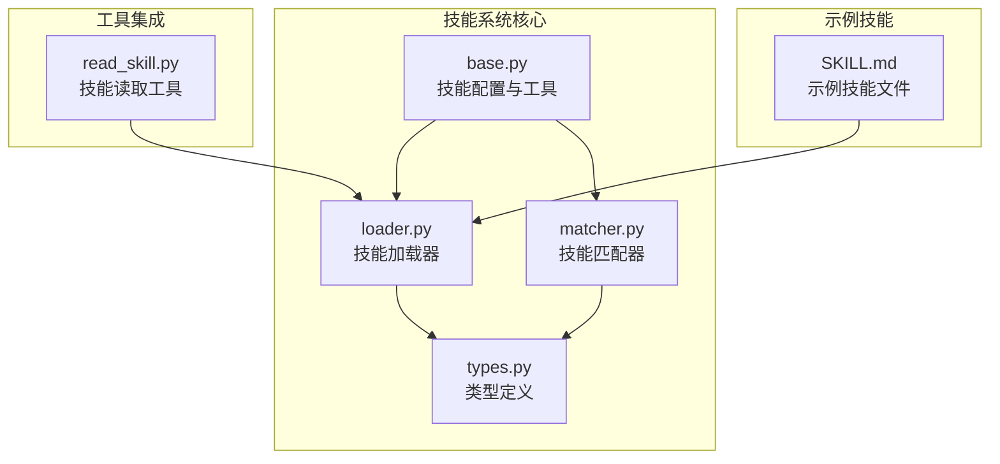
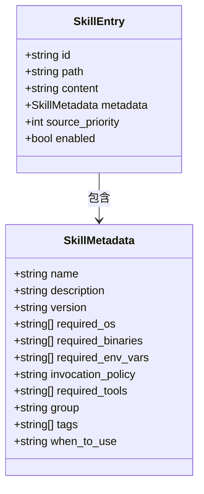
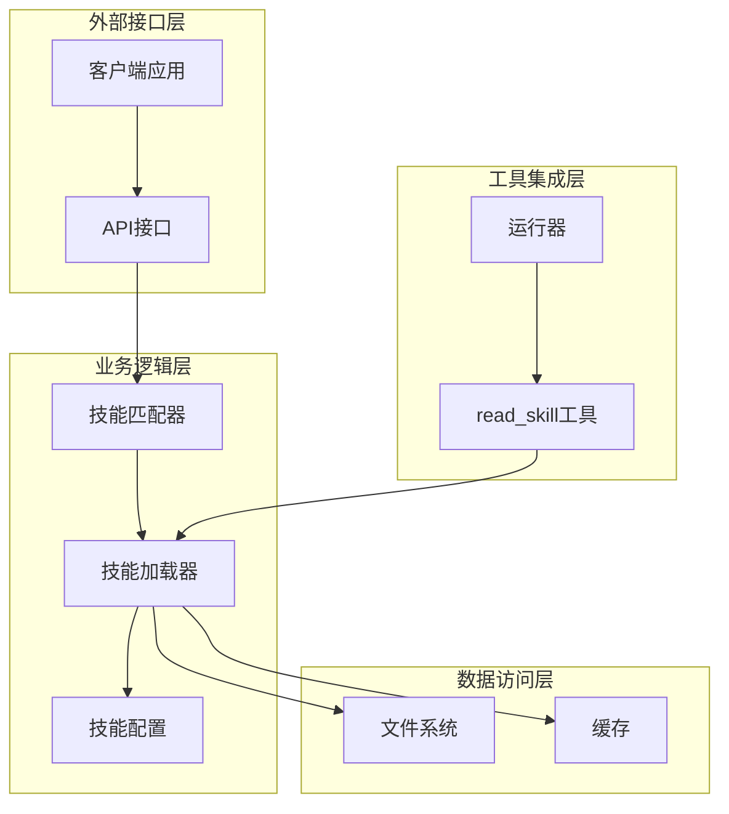
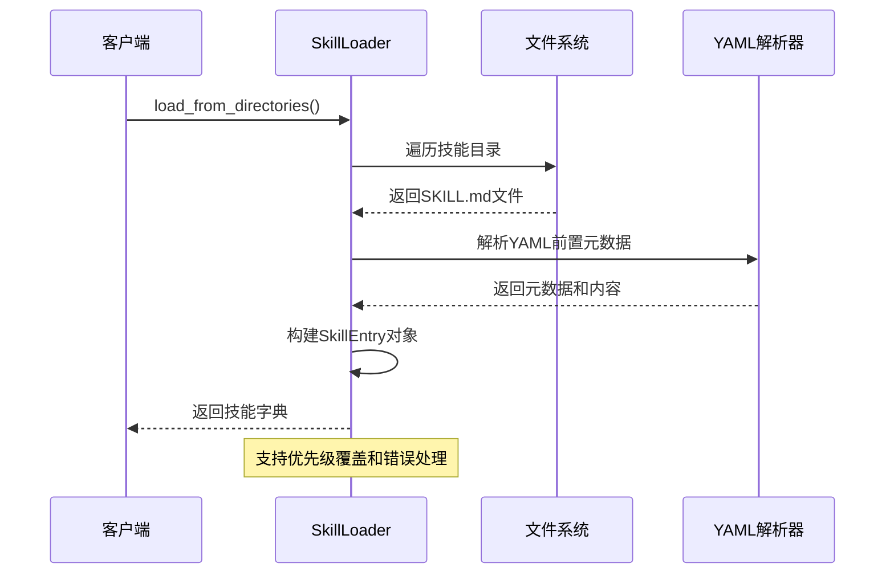
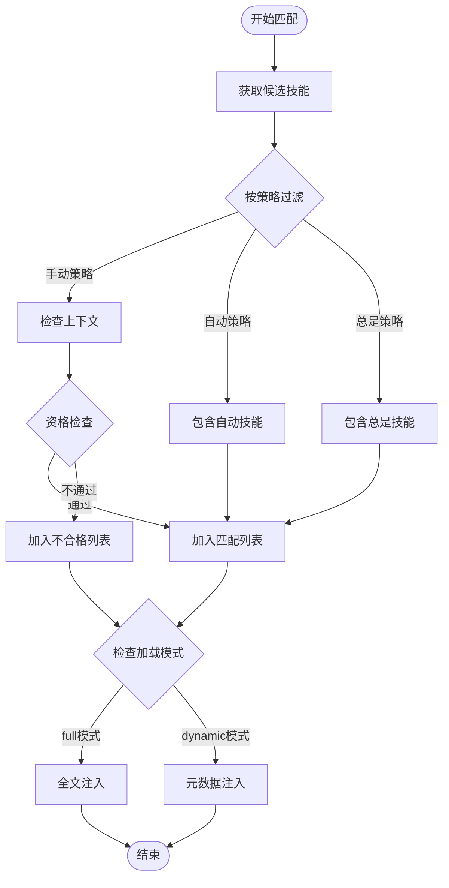
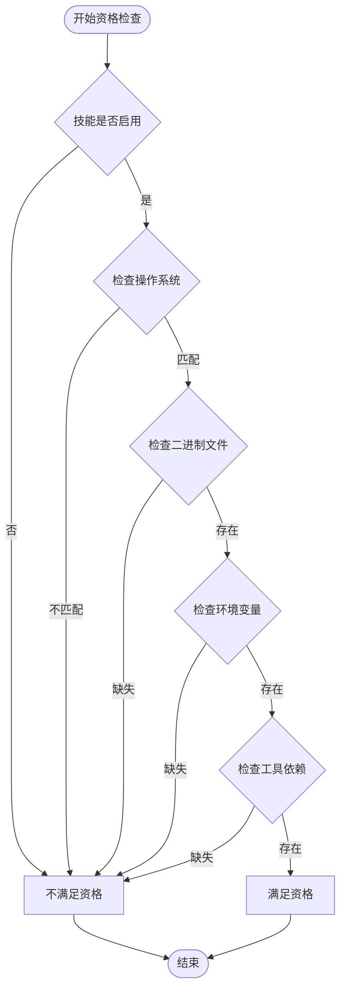
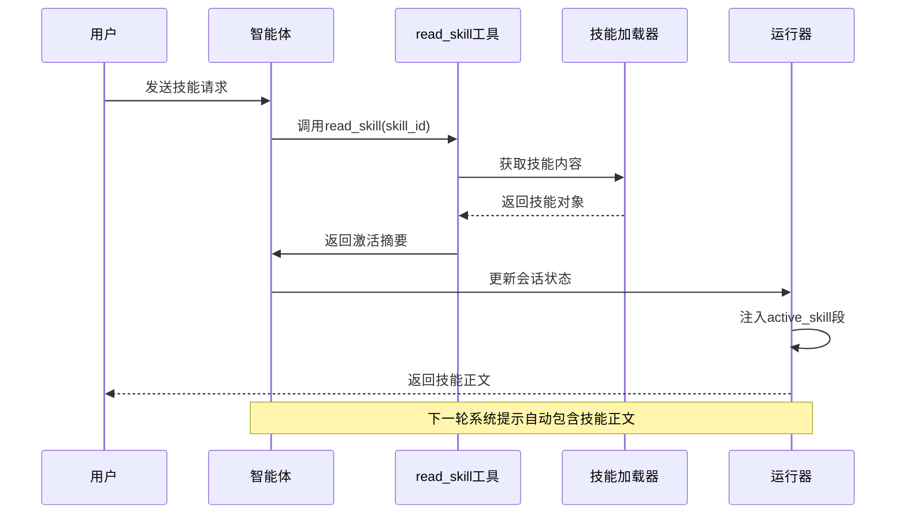
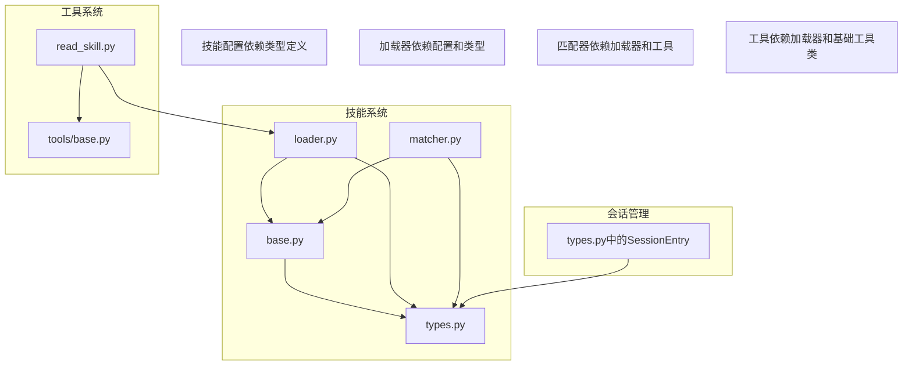

# 技能基类

<cite>
**本文档引用的文件**
- [base.py](file://src/ark_agentic/core/skills/base.py)
- [loader.py](file://src/ark_agentic/core/skills/loader.py)
- [matcher.py](file://src/ark_agentic/core/skills/matcher.py)
- [types.py](file://src/ark_agentic/core/types.py)
- [read_skill.py](file://src/ark_agentic/core/tools/read_skill.py)
- [SKILL.md](file://src/ark_agentic/agents/securities/skills/holdings_analysis/SKILL.md)
- [test_skills.py](file://tests/unit/core/test_skills.py)
</cite>

## 目录
1. [简介](#简介)
2. [项目结构](#项目结构)
3. [核心组件](#核心组件)
4. [架构概览](#架构概览)
5. [详细组件分析](#详细组件分析)
6. [依赖关系分析](#依赖关系分析)
7. [性能考虑](#性能考虑)
8. [故障排除指南](#故障排除指南)
9. [结论](#结论)
10. [附录](#附录)

## 简介

技能基类是 Ark Agentic 系统的核心基础设施，负责管理技能的发现、加载、匹配和执行。该系统采用模块化设计，支持多种技能加载模式和动态切换机制。

技能系统的主要特点：
- **模块化架构**：清晰的职责分离，便于扩展和维护
- **动态加载**：支持按需加载技能内容，优化上下文使用
- **资格检查**：自动验证技能执行所需的环境条件
- **灵活配置**：支持多种加载模式和自定义配置
- **类型安全**：完整的类型定义确保代码质量

## 项目结构

技能系统位于 `src/ark_agentic/core/skills/` 目录下，包含以下核心文件：

**图表来源**
- [base.py:1-344](file://src/ark_agentic/core/skills/base.py#L1-L344)
- [loader.py:1-177](file://src/ark_agentic/core/skills/loader.py#L1-L177)
- [matcher.py:1-152](file://src/ark_agentic/core/skills/matcher.py#L1-L152)
- [types.py:1-422](file://src/ark_agentic/core/types.py#L1-L422)

**章节来源**
- [base.py:1-50](file://src/ark_agentic/core/skills/base.py#L1-L50)
- [loader.py:1-30](file://src/ark_agentic/core/skills/loader.py#L1-L30)
- [matcher.py:1-25](file://src/ark_agentic/core/skills/matcher.py#L1-L25)

## 核心组件

### 技能配置系统

技能配置系统提供了灵活的配置选项，支持不同场景下的技能管理需求。

**技能配置参数**：
- `skill_directories`: 技能目录列表（支持优先级排序）
- `agent_id`: Agent ID，用于构建全局唯一技能ID
- `enable_eligibility_check`: 是否启用资格检查
- `default_invocation_policy`: 默认调用策略（auto/manual/always）
- `allow_unknown_skills`: 是否允许未知技能
- `load_mode`: 技能加载模式（full/dynamic）
- `group_render_threshold`: 分组渲染阈值
- `max_skills_in_prompt`: 最大技能数量限制
- `max_skills_prompt_chars`: 最大字符数限制

### 技能元数据模型

技能元数据定义了技能的基本属性和行为特征：

**图表来源**
- [types.py:243-298](file://src/ark_agentic/core/types.py#L243-L298)

**章节来源**
- [types.py:243-298](file://src/ark_agentic/core/types.py#L243-L298)
- [base.py:19-50](file://src/ark_agentic/core/skills/base.py#L19-L50)

## 架构概览

技能系统采用分层架构设计，各组件职责明确，耦合度低：

**图表来源**
- [matcher.py:55-126](file://src/ark_agentic/core/skills/matcher.py#L55-L126)
- [loader.py:25-84](file://src/ark_agentic/core/skills/loader.py#L25-L84)
- [read_skill.py:19-76](file://src/ark_agentic/core/tools/read_skill.py#L19-L76)

## 详细组件分析

### 技能加载器（SkillLoader）

技能加载器负责从文件系统中发现和加载技能文件：

**图表来源**
- [loader.py:35-84](file://src/ark_agentic/core/skills/loader.py#L35-L84)
- [loader.py:85-108](file://src/ark_agentic/core/skills/loader.py#L85-L108)

**章节来源**
- [loader.py:25-177](file://src/ark_agentic/core/skills/loader.py#L25-L177)

### 技能匹配器（SkillMatcher）

技能匹配器实现了复杂的匹配逻辑，支持多种匹配策略：

**图表来源**
- [matcher.py:64-126](file://src/ark_agentic/core/skills/matcher.py#L64-L126)

**章节来源**
- [matcher.py:55-152](file://src/ark_agentic/core/skills/matcher.py#L55-L152)

### 技能资格检查

系统提供了全面的技能资格检查机制：

**图表来源**
- [base.py:51-101](file://src/ark_agentic/core/skills/base.py#L51-L101)

**章节来源**
- [base.py:51-138](file://src/ark_agentic/core/skills/base.py#L51-L138)

### 动态技能加载机制

系统支持动态技能加载，通过 `read_skill` 工具实现：

**图表来源**
- [read_skill.py:44-76](file://src/ark_agentic/core/tools/read_skill.py#L44-L76)
- [base.py:328-344](file://src/ark_agentic/core/skills/base.py#L328-L344)

**章节来源**
- [read_skill.py:19-76](file://src/ark_agentic/core/tools/read_skill.py#L19-L76)
- [base.py:328-344](file://src/ark_agentic/core/skills/base.py#L328-L344)

## 依赖关系分析

技能系统与其他核心组件的依赖关系：

**图表来源**
- [base.py:16-16](file://src/ark_agentic/core/skills/base.py#L16-L16)
- [loader.py:16-17](file://src/ark_agentic/core/skills/loader.py#L16-L17)
- [matcher.py:16-22](file://src/ark_agentic/core/skills/matcher.py#L16-L22)
- [read_skill.py:14-16](file://src/ark_agentic/core/tools/read_skill.py#L14-L16)

**章节来源**
- [base.py:16-16](file://src/ark_agentic/core/skills/base.py#L16-L16)
- [loader.py:16-17](file://src/ark_agentic/core/skills/loader.py#L16-L17)
- [matcher.py:16-22](file://src/ark_agentic/core/skills/matcher.py#L16-L22)
- [read_skill.py:14-16](file://src/ark_agentic/core/tools/read_skill.py#L14-L16)

## 性能考虑

技能系统在设计时充分考虑了性能优化：

### 预算控制机制
- **技能数量限制**：通过 `max_skills_in_prompt` 控制技能数量
- **字符数限制**：通过 `max_skills_prompt_chars` 控制上下文大小
- **二分搜索优化**：使用二分搜索算法精确控制字符数

### 缓存策略
- **目录扫描缓存**：避免重复扫描已知目录
- **技能内容缓存**：减少重复读取相同技能文件
- **优先级覆盖缓存**：快速处理技能优先级冲突

### 内存优化
- **流式处理**：支持大量技能文件的流式处理
- **延迟加载**：仅在需要时加载技能内容
- **字符截断**：智能截断长描述避免内存溢出

## 故障排除指南

### 常见问题及解决方案

**技能加载失败**
- 检查技能目录权限和存在性
- 验证SKILL.md文件格式正确性
- 确认YAML前置元数据语法正确

**资格检查失败**
- 检查操作系统兼容性
- 验证必需二进制文件是否存在
- 确认环境变量已正确设置

**动态加载问题**
- 确认技能ID在可用技能列表中
- 检查会话状态中的 `_active_skill_id` 字段
- 验证工具调用顺序正确性

**章节来源**
- [loader.py:53-55](file://src/ark_agentic/core/skills/loader.py#L53-L55)
- [base.py:70-101](file://src/ark_agentic/core/skills/base.py#L70-L101)
- [read_skill.py:51-64](file://src/ark_agentic/core/tools/read_skill.py#L51-L64)

## 结论

技能基类系统提供了强大而灵活的技能管理框架，具有以下优势：

1. **模块化设计**：清晰的职责分离便于维护和扩展
2. **类型安全**：完整的类型定义确保代码质量
3. **性能优化**：智能预算控制和缓存策略
4. **动态加载**：支持按需加载技能内容
5. **灵活配置**：支持多种加载模式和自定义配置

该系统为构建复杂的智能体应用提供了坚实的基础，支持从简单到复杂的各种应用场景。

## 附录

### 技能开发最佳实践

**技能文件结构**
- 使用标准的YAML前置元数据格式
- 提供清晰的技能描述和使用场景
- 定义必要的工具依赖和环境要求

**配置建议**
- 合理设置 `group_render_threshold` 参数
- 根据应用场景选择合适的 `load_mode`
- 配置适当的预算限制参数

**测试指南**
- 编写单元测试验证技能加载逻辑
- 测试资格检查机制的正确性
- 验证动态加载功能的稳定性

**章节来源**
- [SKILL.md:1-243](file://src/ark_agentic/agents/securities/skills/holdings_analysis/SKILL.md#L1-L243)
- [test_skills.py:28-673](file://tests/unit/core/test_skills.py#L28-L673)