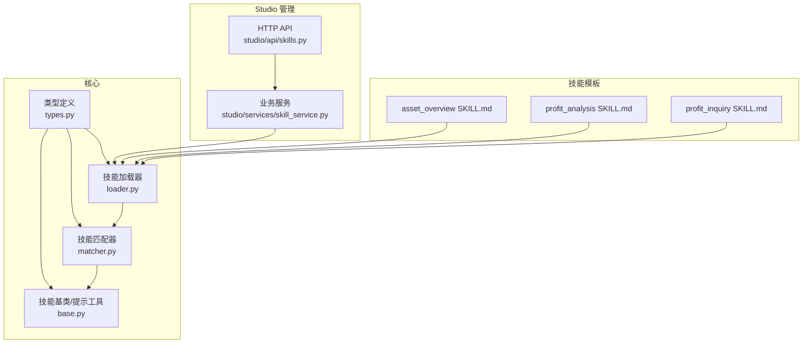
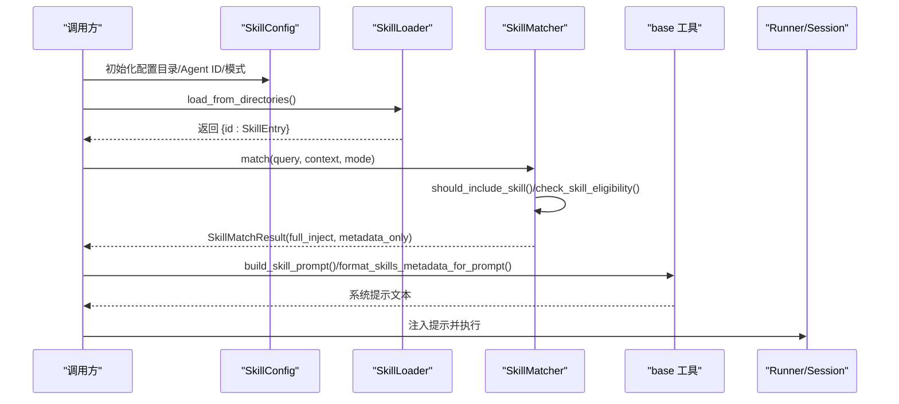
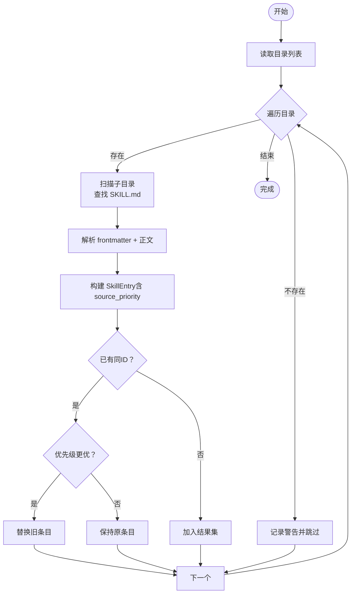
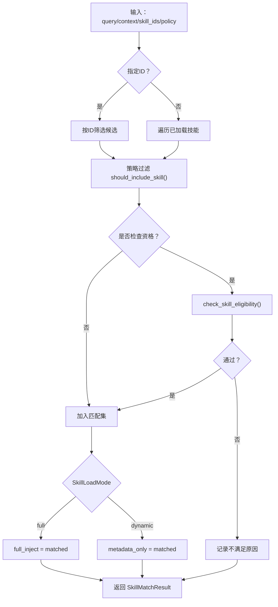
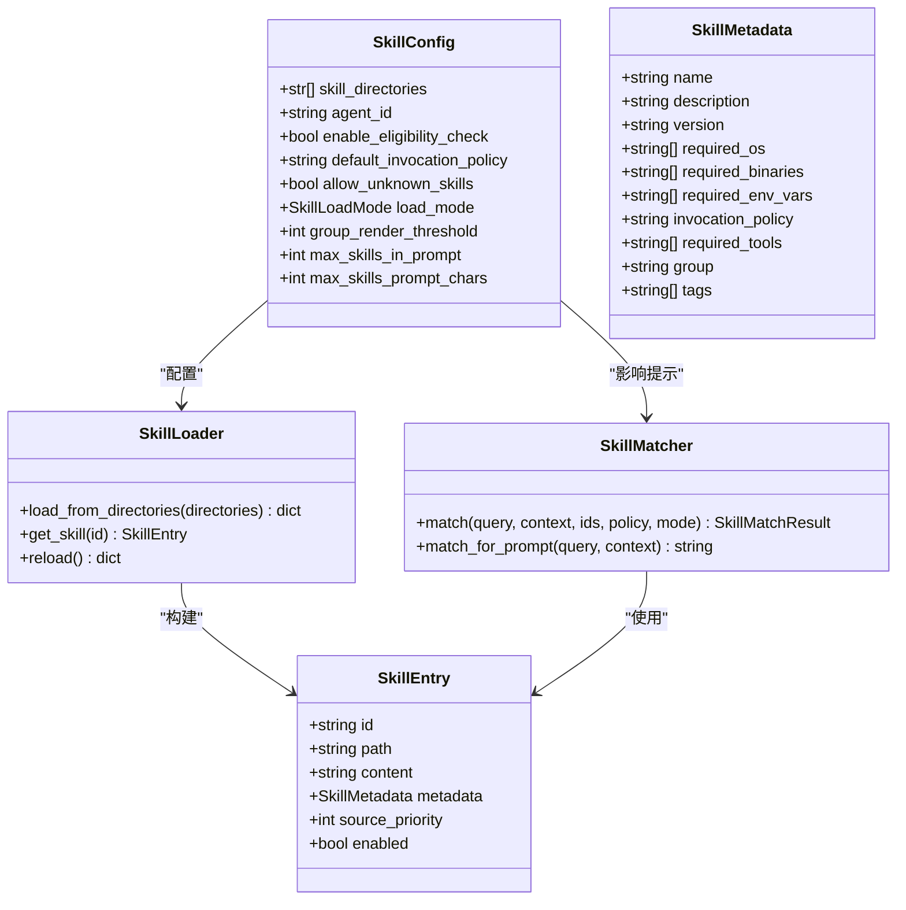
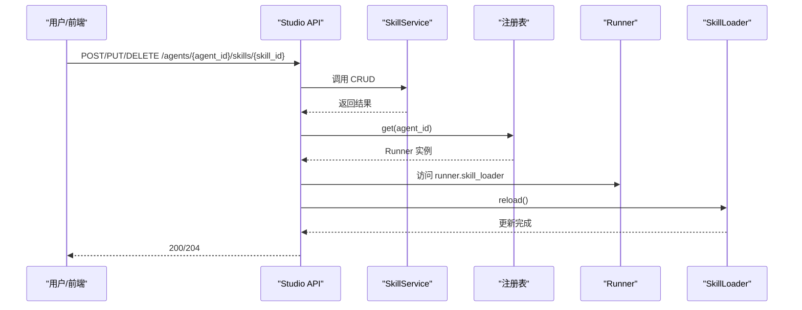
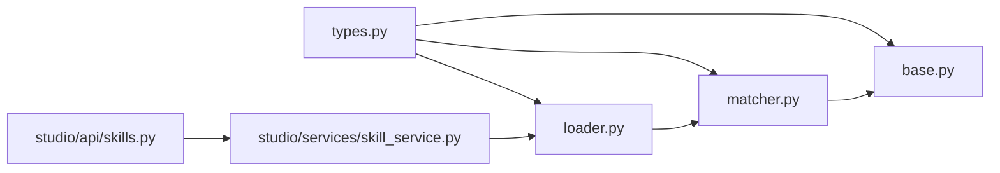

# 技能系统架构

<cite>
**本文引用的文件**
- [base.py](file://src/ark_agentic/core/skills/base.py)
- [loader.py](file://src/ark_agentic/core/skills/loader.py)
- [matcher.py](file://src/ark_agentic/core/skills/matcher.py)
- [types.py](file://src/ark_agentic/core/types.py)
- [skill_service.py](file://src/ark_agentic/studio/services/skill_service.py)
- [skills.py](file://src/ark_agentic/studio/api/skills.py)
- [asset_overview SKILL.md](file://src/ark_agentic/agents/securities/skills/asset_overview/SKILL.md)
- [profit_analysis SKILL.md](file://src/ark_agentic/agents/securities/skills/profit_analysis/SKILL.md)
- [profit_inquiry SKILL.md](file://src/ark_agentic/agents/securities/skills/profit_inquiry/SKILL.md)
- [test_skill_service.py](file://tests/integration/test_skill_service.py)
</cite>

## 目录
1. [引言](#引言)
2. [项目结构](#项目结构)
3. [核心组件](#核心组件)
4. [架构总览](#架构总览)
5. [详细组件分析](#详细组件分析)
6. [依赖分析](#依赖分析)
7. [性能考虑](#性能考虑)
8. [故障排查指南](#故障排查指南)
9. [结论](#结论)
10. [附录](#附录)

## 引言
本文件系统性阐述技能系统的架构与实现，重点覆盖以下方面：
- 技能加载器的动态加载机制与优先级覆盖策略
- 技能匹配器的意图识别与资格过滤算法
- 技能基类的抽象设计与提示注入策略
- 技能配置管理、版本控制与热更新机制
- 技能开发规范、模板设计与测试策略
- 扩展指南与性能监控方案

## 项目结构
技能系统围绕“类型定义—加载—匹配—提示注入—Studio 管理—热更新”的闭环展开，核心代码位于 core/skills 与 studio 两个子模块，技能模板位于 agents/*/skills/*。

图表来源
- [types.py:243-308](file://src/ark_agentic/core/types.py#L243-L308)
- [loader.py:25-177](file://src/ark_agentic/core/skills/loader.py#L25-L177)
- [matcher.py:55-152](file://src/ark_agentic/core/skills/matcher.py#L55-L152)
- [base.py:19-344](file://src/ark_agentic/core/skills/base.py#L19-L344)
- [skill_service.py:42-289](file://src/ark_agentic/studio/services/skill_service.py#L42-L289)
- [skills.py:57-113](file://src/ark_agentic/studio/api/skills.py#L57-L113)

章节来源
- [types.py:243-308](file://src/ark_agentic/core/types.py#L243-L308)
- [loader.py:35-61](file://src/ark_agentic/core/skills/loader.py#L35-L61)
- [matcher.py:64-126](file://src/ark_agentic/core/skills/matcher.py#L64-L126)
- [base.py:242-344](file://src/ark_agentic/core/skills/base.py#L242-L344)
- [skill_service.py:42-183](file://src/ark_agentic/studio/services/skill_service.py#L42-L183)
- [skills.py:57-113](file://src/ark_agentic/studio/api/skills.py#L57-L113)

## 核心组件
- 类型与配置
  - SkillMetadata/SkillEntry：技能元数据与条目，包含名称、描述、版本、调用策略、所需环境、分组与标签等
  - SkillLoadMode：full/dynamic 两种加载模式
  - SkillConfig：技能系统配置，含目录优先级、Agent ID、默认调用策略、预算阈值等
- 加载器 SkillLoader：从多目录扫描 SKILL.md，解析 YAML frontmatter，构建 SkillEntry，支持优先级覆盖
- 匹配器 SkillMatcher：按策略与资格过滤候选技能，再按加载模式分配 full_inject 与 metadata_only
- 基类工具 base.py：资格检查、包含判定、XML 渲染、预算截断、提示注入等
- Studio 管理：skill_service 提供 CRUD 与解析；skills API 提供 HTTP 端点并触发热更新

章节来源
- [types.py:243-308](file://src/ark_agentic/core/types.py#L243-L308)
- [base.py:19-50](file://src/ark_agentic/core/skills/base.py#L19-L50)
- [loader.py:25-108](file://src/ark_agentic/core/skills/loader.py#L25-L108)
- [matcher.py:55-127](file://src/ark_agentic/core/skills/matcher.py#L55-L127)
- [base.py:242-344](file://src/ark_agentic/core/skills/base.py#L242-L344)
- [skill_service.py:42-183](file://src/ark_agentic/studio/services/skill_service.py#L42-L183)
- [skills.py:57-113](file://src/ark_agentic/studio/api/skills.py#L57-L113)

## 架构总览
技能系统采用“配置驱动 + 动态加载 + 按需注入”的设计，核心流程如下：
- 配置阶段：设置 SkillConfig（目录优先级、Agent ID、加载模式、预算阈值）
- 加载阶段：SkillLoader 递归扫描目录，解析 frontmatter，构建 SkillEntry 并按优先级覆盖
- 匹配阶段：SkillMatcher 过滤策略/资格，按 SkillLoadMode 决定注入方式
- 注入阶段：base.build_skill_prompt 或 base.format_skills_metadata_for_prompt 生成系统提示
- 管理阶段：Studio API/Service 支持 CRUD 与热更新，写操作后触发 runner 的 skill_loader.reload()

图表来源
- [loader.py:35-61](file://src/ark_agentic/core/skills/loader.py#L35-L61)
- [matcher.py:64-126](file://src/ark_agentic/core/skills/matcher.py#L64-L126)
- [base.py:306-344](file://src/ark_agentic/core/skills/base.py#L306-L344)

## 详细组件分析

### 技能加载器：动态加载与优先级覆盖
- 目录扫描：遍历配置中的 skill_directories，按顺序处理，同一 ID 后者覆盖前者
- 文件解析：SKILL.md 使用 YAML frontmatter，解析为 SkillMetadata，正文作为 content
- 全局 ID：若配置包含 agent_id，则 skill.id = agent_id.skill_name
- 错误处理：目录不存在/文件解析失败记录警告，不影响其他技能加载
- 重新加载：reload() 重新扫描并覆盖缓存

图表来源
- [loader.py:35-108](file://src/ark_agentic/core/skills/loader.py#L35-L108)

章节来源
- [loader.py:35-108](file://src/ark_agentic/core/skills/loader.py#L35-L108)
- [loader.py:168-177](file://src/ark_agentic/core/skills/loader.py#L168-L177)

### 技能匹配器：意图识别与资格过滤
- 策略过滤：should_include_skill 按 invocation_policy（auto/manual/always）与 requested_skills 判定
- 资格检查：check_skill_eligibility 校验 OS、二进制、环境变量、工具依赖
- 模式分流：SkillLoadMode.full 时全部进入 full_inject；否则进入 metadata_only
- 结果聚合：SkillMatchResult 统一暴露 matched_skills 与 skill_ids，便于后续注入

图表来源
- [matcher.py:64-126](file://src/ark_agentic/core/skills/matcher.py#L64-L126)
- [base.py:104-138](file://src/ark_agentic/core/skills/base.py#L104-L138)
- [base.py:51-101](file://src/ark_agentic/core/skills/base.py#L51-L101)

章节来源
- [matcher.py:64-126](file://src/ark_agentic/core/skills/matcher.py#L64-L126)
- [base.py:104-138](file://src/ark_agentic/core/skills/base.py#L104-L138)
- [base.py:51-101](file://src/ark_agentic/core/skills/base.py#L51-L101)

### 技能基类：抽象设计与提示注入
- 资格检查：平台/二进制/环境变量/工具依赖
- 包含判定：策略与上下文驱动
- XML 渲染：扁平/分组两种格式，支持预算控制（数量与字符数）
- 提示构建：full 模式直接注入完整技能正文；dynamic 模式注入元数据并配合 read_skill 指令
- 动态激活：render_active_skill_section 支持当前激活技能的单独注入

图表来源
- [types.py:243-308](file://src/ark_agentic/core/types.py#L243-L308)
- [loader.py:25-108](file://src/ark_agentic/core/skills/loader.py#L25-L108)
- [matcher.py:55-127](file://src/ark_agentic/core/skills/matcher.py#L55-L127)
- [base.py:19-50](file://src/ark_agentic/core/skills/base.py#L19-L50)

章节来源
- [base.py:242-344](file://src/ark_agentic/core/skills/base.py#L242-L344)

### 配置管理、版本控制与热更新
- 配置管理
  - SkillConfig：集中管理目录优先级、Agent ID、默认调用策略、预算阈值
  - frontmatter：name/description/version/required_* 等元数据
- 版本控制
  - frontmatter.version：语义化版本，便于追踪变更
  - 模板示例：asset_overview SKILL.md 使用 "2.0"，profit_analysis 使用 "1.0"
- 热更新
  - Studio API 写操作后调用 _reload_skills，通过注册表获取 runner 的 skill_loader 并 reload
  - reload() 重新扫描目录并覆盖内存缓存，即时生效

图表来源
- [skills.py:44-53](file://src/ark_agentic/studio/api/skills.py#L44-L53)
- [skills.py:68-112](file://src/ark_agentic/studio/api/skills.py#L68-L112)
- [skill_service.py:104-153](file://src/ark_agentic/studio/services/skill_service.py#L104-L153)

章节来源
- [skills.py:44-53](file://src/ark_agentic/studio/api/skills.py#L44-L53)
- [skills.py:68-112](file://src/ark_agentic/studio/api/skills.py#L68-L112)
- [skill_service.py:104-153](file://src/ark_agentic/studio/services/skill_service.py#L104-L153)

### 技能开发规范与模板设计
- 目录结构：每个技能为独立目录，包含 SKILL.md
- frontmatter 必备字段：name、description、version、invocation_policy、group、tags、required_tools 等
- 模板要点
  - 明确核心职责与触发关键词
  - 定义意图与工具映射（表格形式）
  - 执行流程与失败处理
  - 输出策略与性能/安全约束
- 示例参考
  - asset_overview：账户总览，包含 MODE_CARD/MODE_TEXT 两种模式
  - profit_analysis：收益排行/曲线/日明细/分红事件
  - profit_inquiry：今日/累计收益与排名分析

章节来源
- [asset_overview SKILL.md:1-186](file://src/ark_agentic/agents/securities/skills/asset_overview/SKILL.md#L1-L186)
- [profit_analysis SKILL.md:1-58](file://src/ark_agentic/agents/securities/skills/profit_analysis/SKILL.md#L1-L58)
- [profit_inquiry SKILL.md:1-245](file://src/ark_agentic/agents/securities/skills/profit_inquiry/SKILL.md#L1-L245)

### 测试策略
- Service 层单元测试：覆盖 slugify/generate_skill_md/parse_skill_dir 的行为
- CRUD 行为测试：创建/更新/删除/列举，含异常场景（重复、不存在、非法名）
- 集成测试：验证 Studio API 写操作后触发 skill_loader.reload 的链路

章节来源
- [test_skill_service.py:42-142](file://tests/integration/test_skill_service.py#L42-L142)

## 依赖分析
- 组件耦合
  - SkillLoader 依赖 SkillConfig 与 SkillEntry/SkillMetadata 类型
  - SkillMatcher 依赖 SkillLoader 与 base.check_skill_eligibility/should_include_skill
  - Studio API/Service 依赖 SkillLoader（通过 runner 注册表）以实现热更新
- 外部依赖
  - YAML frontmatter 解析（yaml.safe_load）
  - 日志记录（logging）

图表来源
- [types.py:243-308](file://src/ark_agentic/core/types.py#L243-L308)
- [loader.py:25-108](file://src/ark_agentic/core/skills/loader.py#L25-L108)
- [matcher.py:55-127](file://src/ark_agentic/core/skills/matcher.py#L55-L127)
- [base.py:19-50](file://src/ark_agentic/core/skills/base.py#L19-L50)
- [skill_service.py:42-183](file://src/ark_agentic/studio/services/skill_service.py#L42-L183)
- [skills.py:57-113](file://src/ark_agentic/studio/api/skills.py#L57-L113)

## 性能考虑
- 预算控制
  - 按最大技能数与最大字符数进行二分搜索截断，避免提示过长
  - 超限时追加截断提示，保证上下文稳定
- 渲染优化
  - 小于阈值使用扁平 XML，大于阈值按 group 分组，提升可读性
- 加载优化
  - 目录按优先级顺序扫描，覆盖策略减少冗余
  - frontmatter 解析失败仅记录警告，不阻塞其他技能
- 注入策略
  - dynamic 模式仅注入元数据，LLM 按需 read_skill，降低初始提示体积

章节来源
- [base.py:207-262](file://src/ark_agentic/core/skills/base.py#L207-L262)
- [base.py:189-204](file://src/ark_agentic/core/skills/base.py#L189-L204)
- [loader.py:109-154](file://src/ark_agentic/core/skills/loader.py#L109-L154)

## 故障排查指南
- 加载失败
  - 目录不存在：检查 skill_directories 配置与权限
  - frontmatter 解析失败：确认 YAML 语法正确
  - 重复 ID：调整目录优先级或技能名称
- 匹配不到技能
  - 策略过滤：确认 invocation_policy 与 requested_skills
  - 资格不满足：检查 required_os/binaries/env_vars/tools
- 注入过大
  - 调整 group_render_threshold、max_skills_in_prompt、max_skills_prompt_chars
- 热更新无效
  - 确认 Studio API 写操作后调用了 _reload_skills
  - 检查注册表中是否存在对应 agent_id 的 runner

章节来源
- [loader.py:51-84](file://src/ark_agentic/core/skills/loader.py#L51-L84)
- [matcher.py:105-112](file://src/ark_agentic/core/skills/matcher.py#L105-L112)
- [base.py:207-262](file://src/ark_agentic/core/skills/base.py#L207-L262)
- [skills.py:44-53](file://src/ark_agentic/studio/api/skills.py#L44-L53)

## 结论
该技能系统以类型定义为基座，通过 SkillLoader 的动态加载与优先级覆盖、SkillMatcher 的策略与资格过滤、以及 base 的预算与提示注入策略，实现了灵活、可控、可扩展的技能管理与应用。结合 Studio 的 CRUD 与热更新能力，可在不重启服务的前提下快速迭代技能模板，满足复杂业务场景的持续演进需求。

## 附录
- 开发建议
  - 前置元数据尽量完整，便于资格检查与分组展示
  - 使用明确的 group/tags，提升检索与渲染效率
  - 在 SKILL.md 中清晰定义执行流程与失败处理，降低运行期不确定性
- 扩展指南
  - 新增加载模式：在 SkillLoadMode 扩展并在 base/build_skill_prompt 中接入
  - 新增匹配策略：在 should_include_skill 中扩展策略分支
  - 新增注入格式：在 base.format_skills_metadata_for_prompt 中扩展渲染器
- 监控建议
  - 记录 SkillLoader 的加载耗时与失败率
  - 统计 SkillMatcher 的匹配命中率与不满足原因分布
  - 监控提示长度与截断次数，评估预算参数合理性