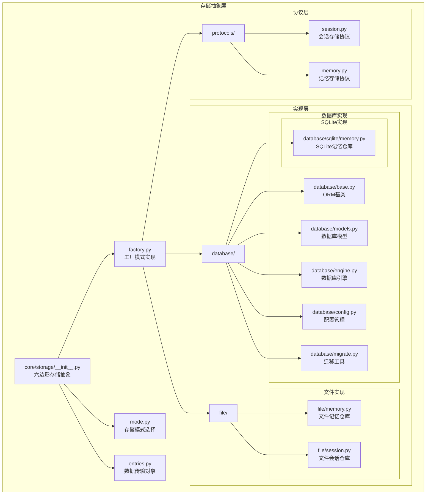
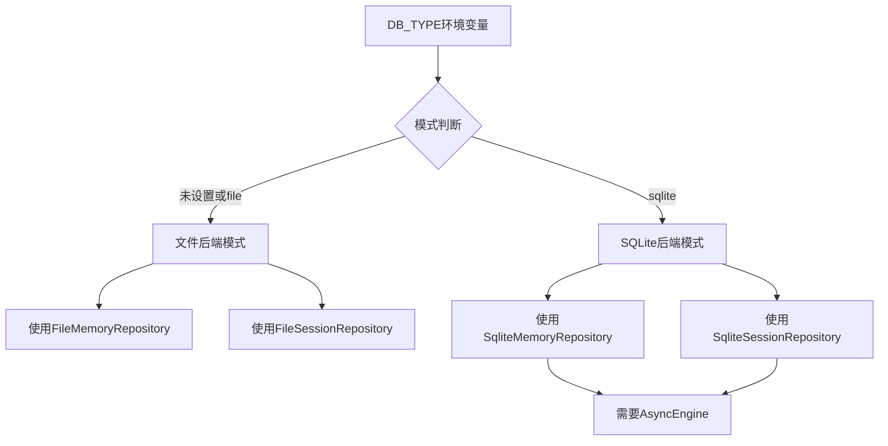
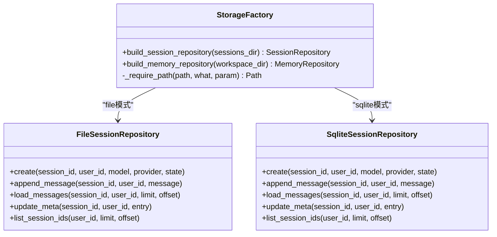
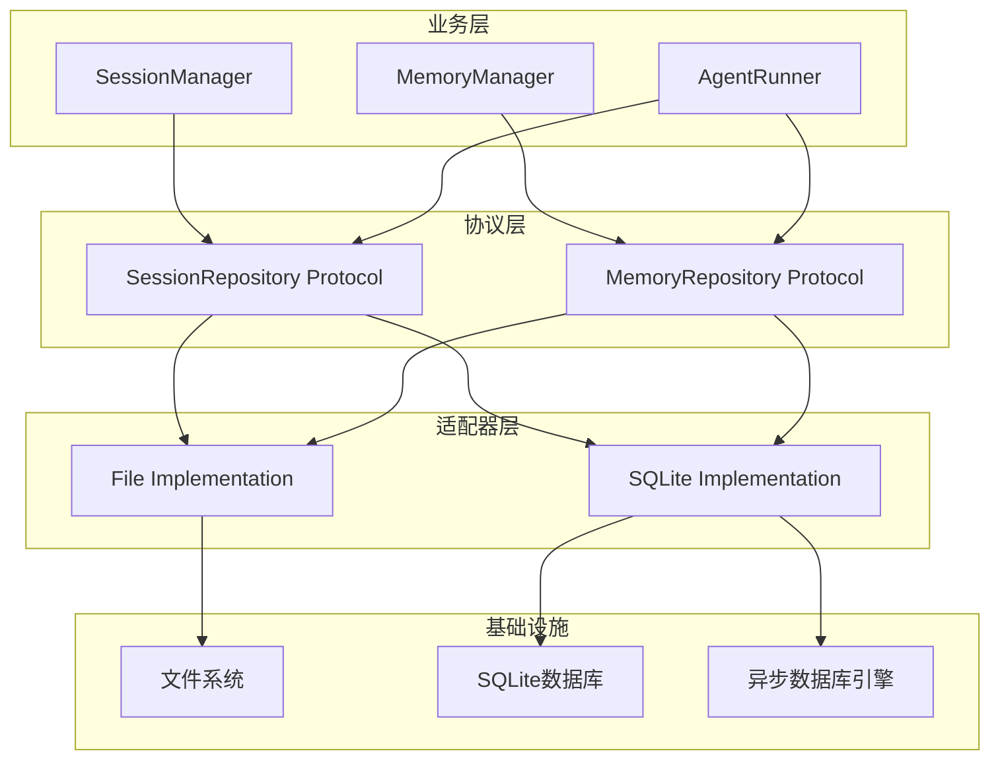
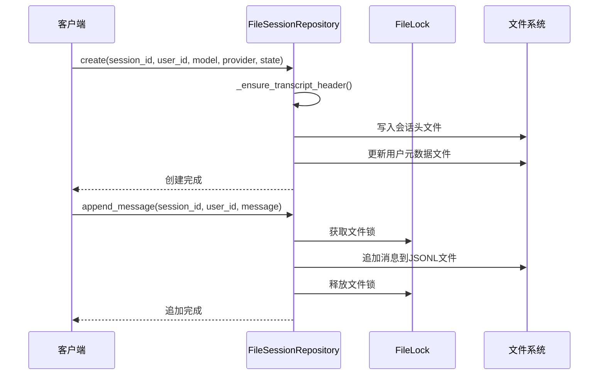
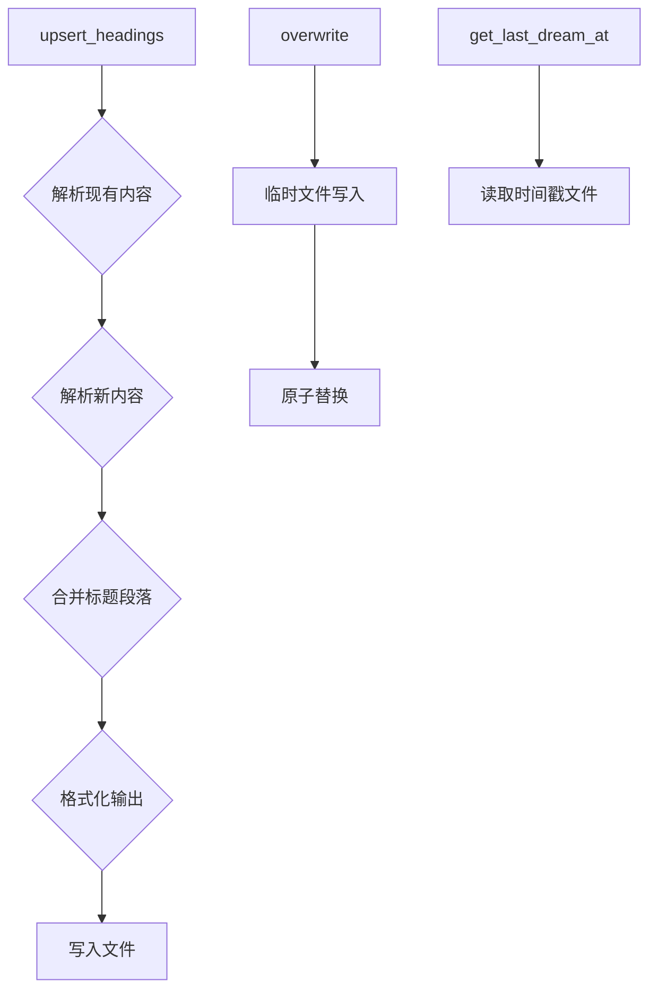
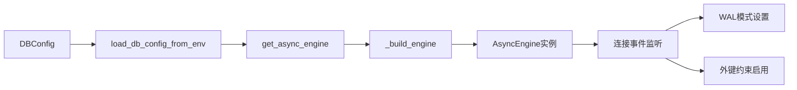
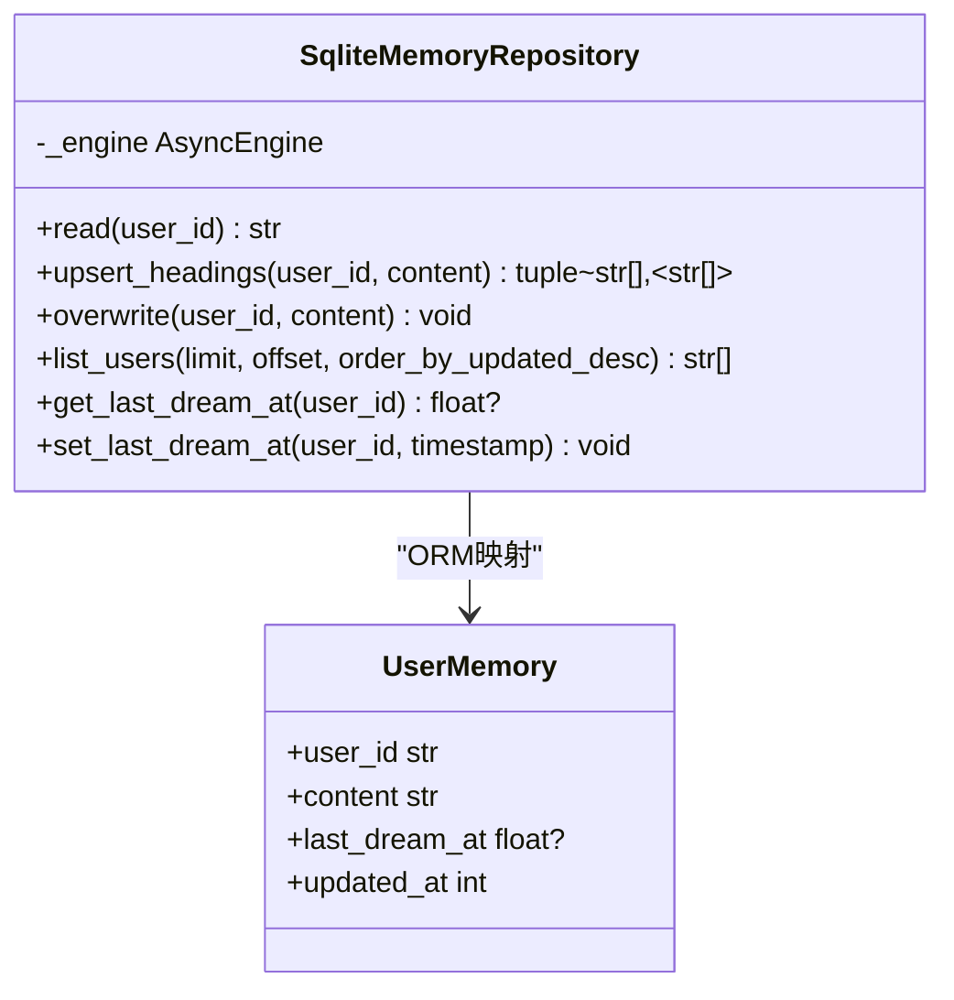
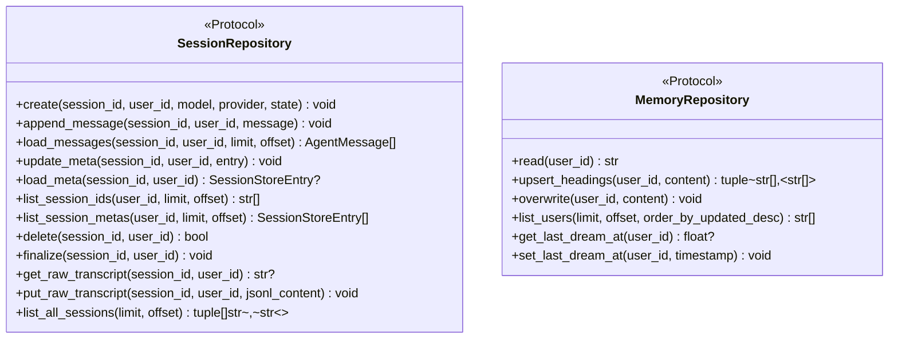
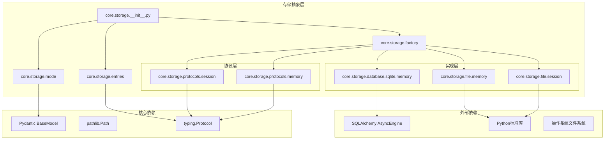

# 数据库与存储抽象

<cite>
**本文档引用的文件**
- [__init__.py](file://src/ark_agentic/core/storage/__init__.py)
- [factory.py](file://src/ark_agentic/core/storage/factory.py)
- [mode.py](file://src/ark_agentic/core/storage/mode.py)
- [entries.py](file://src/ark_agentic/core/storage/entries.py)
- [session.py](file://src/ark_agentic/core/storage/protocols/session.py)
- [memory.py](file://src/ark_agentic/core/storage/protocols/memory.py)
- [engine.py](file://src/ark_agentic/core/storage/database/engine.py)
- [config.py](file://src/ark_agentic/core/storage/database/config.py)
- [migrate.py](file://src/ark_agentic/core/storage/database/migrate.py)
- [models.py](file://src/ark_agentic/core/storage/database/models.py)
- [base.py](file://src/ark_agentic/core/storage/database/base.py)
- [memory.py](file://src/ark_agentic/core/storage/file/memory.py)
- [session.py](file://src/ark_agentic/core/storage/file/session.py)
- [memory.py](file://src/ark_agentic/core/storage/database/sqlite/memory.py)
- [database-and-storage-abstraction.md](file://docs/database-and-storage-abstraction.md)
</cite>

## 目录
1. [简介](#简介)
2. [项目结构](#项目结构)
3. [核心组件](#核心组件)
4. [架构概览](#架构概览)
5. [详细组件分析](#详细组件分析)
6. [依赖关系分析](#依赖关系分析)
7. [性能考虑](#性能考虑)
8. [故障排除指南](#故障排除指南)
9. [结论](#结论)

## 简介

本项目实现了完整的数据库与存储抽象层，采用六边形架构设计，提供统一的存储协议接口，支持文件系统和SQLite两种存储后端。该抽象层确保业务逻辑与具体存储实现解耦，通过工厂模式和环境变量配置实现运行时切换。

存储抽象层的核心设计理念：
- **协议优先**：业务层只依赖协议接口，不直接依赖具体实现
- **后端透明**：通过环境变量DB_TYPE动态选择存储后端
- **数据模型中立**：DTO对象与具体存储介质无关
- **渐进式演进**：为未来支持PostgreSQL、MySQL等其他数据库预留扩展空间

## 项目结构

存储抽象层采用分层组织结构，按照功能和职责进行模块划分：

**图表来源**
- [__init__.py:1-10](file://src/ark_agentic/core/storage/__init__.py#L1-L10)
- [factory.py:1-68](file://src/ark_agentic/core/storage/factory.py#L1-L68)
- [mode.py:1-32](file://src/ark_agentic/core/storage/mode.py#L1-L32)

**章节来源**
- [__init__.py:1-10](file://src/ark_agentic/core/storage/__init__.py#L1-L10)
- [factory.py:1-68](file://src/ark_agentic/core/storage/factory.py#L1-L68)
- [mode.py:1-32](file://src/ark_agentic/core/storage/mode.py#L1-L32)

## 核心组件

### 存储模式选择器

存储模式通过环境变量DB_TYPE进行控制，支持两种模式：
- **file模式**：使用本地文件系统存储，无需数据库引擎
- **sqlite模式**：使用SQLite数据库，需要异步数据库引擎

**图表来源**
- [mode.py:19-32](file://src/ark_agentic/core/storage/mode.py#L19-L32)

### 工厂模式实现

工厂类提供统一的仓库构建接口，根据当前存储模式返回相应的实现：

**图表来源**
- [factory.py:30-67](file://src/ark_agentic/core/storage/factory.py#L30-L67)

**章节来源**
- [factory.py:1-68](file://src/ark_agentic/core/storage/factory.py#L1-L68)
- [mode.py:1-32](file://src/ark_agentic/core/storage/mode.py#L1-L32)

## 架构概览

存储抽象层采用六边形架构（Hexagonal Architecture），将业务逻辑与外部系统隔离：

**图表来源**
- [__init__.py:1-10](file://src/ark_agentic/core/storage/__init__.py#L1-L10)
- [session.py:181-194](file://src/ark_agentic/core/storage/protocols/session.py#L181-L194)
- [memory.py:8-56](file://src/ark_agentic/core/storage/protocols/memory.py#L8-L56)

### 数据传输对象

SessionStoreEntry作为跨后端的数据传输对象，确保不同存储实现之间的数据一致性：

| 字段名称 | 类型 | 描述 | 默认值 |
|---------|------|------|--------|
| session_id | str | 会话唯一标识符 | 空字符串 |
| updated_at | int | 更新时间戳（毫秒） | 0 |
| model | str | AI模型名称 | "Qwen3-80B-Instruct" |
| provider | str | 模型提供商 | "ark" |
| prompt_tokens | int | 提示词令牌数 | 0 |
| completion_tokens | int | 生成令牌数 | 0 |
| total_tokens | int | 总令牌数 | 0 |
| compaction_count | int | 压缩次数 | 0 |
| active_skill_ids | list[str] | 活跃技能ID列表 | 空列表 |
| state | dict[str, Any] | 会话状态字典 | 空字典 |

**章节来源**
- [entries.py:15-62](file://src/ark_agentic/core/storage/entries.py#L15-L62)

## 详细组件分析

### 文件存储实现

文件存储实现提供了最简单的持久化方案，适用于开发环境和小型部署。

#### 文件会话仓库

**图表来源**
- [session.py:74-121](file://src/ark_agentic/core/storage/file/session.py#L74-L121)

文件会话仓库的关键特性：
- **原子性保证**：使用文件锁确保并发安全
- **元数据缓存**：用户元数据文件包含TTL缓存机制
- **JSONL格式**：消息以JSONL格式存储，便于解析和调试
- **文件锁定**：每个会话和元数据文件都有对应的.lock文件

#### 文件记忆仓库

文件记忆仓库实现基于Markdown文件的记忆存储：

**图表来源**
- [memory.py:44-82](file://src/ark_agentic/core/storage/file/memory.py#L44-L82)

**章节来源**
- [session.py:1-371](file://src/ark_agentic/core/storage/file/session.py#L1-L371)
- [memory.py:1-171](file://src/ark_agentic/core/storage/file/memory.py#L1-L171)

### SQLite存储实现

SQLite实现提供了生产级别的持久化能力，支持事务处理和并发访问。

#### 数据库引擎管理

**图表来源**
- [config.py:24-41](file://src/ark_agentic/core/storage/database/config.py#L24-L41)
- [engine.py:108-117](file://src/ark_agentic/core/storage/database/engine.py#L108-L117)

数据库引擎的关键配置：
- **连接字符串**：支持sqlite+aiosqlite和sqlite两种格式
- **连接池**：SQLite模式下仍保留pool_size配置字段
- **PRAGMA设置**：自动配置WAL模式、外键约束和同步级别
- **LRU缓存**：进程级引擎实例缓存，避免重复创建

#### SQLite记忆仓库

SQLite记忆仓库采用单行存储策略，每个用户一行记录完整Markdown内容：

**图表来源**
- [memory.py:25-141](file://src/ark_agentic/core/storage/database/sqlite/memory.py#L25-L141)
- [models.py:59-68](file://src/ark_agentic/core/storage/database/models.py#L59-L68)

**章节来源**
- [engine.py:1-164](file://src/ark_agentic/core/storage/database/engine.py#L1-L164)
- [config.py:1-41](file://src/ark_agentic/core/storage/database/config.py#L1-L41)
- [migrate.py:1-94](file://src/ark_agentic/core/storage/database/migrate.py#L1-L94)
- [models.py:1-70](file://src/ark_agentic/core/storage/database/models.py#L1-L70)
- [base.py:1-21](file://src/ark_agentic/core/storage/database/base.py#L1-L21)
- [memory.py:1-141](file://src/ark_agentic/core/storage/database/sqlite/memory.py#L1-L141)

### 协议接口设计

存储协议采用Python的Protocol类型，提供清晰的接口契约：

**图表来源**
- [session.py:181-194](file://src/ark_agentic/core/storage/protocols/session.py#L181-L194)
- [memory.py:8-56](file://src/ark_agentic/core/storage/protocols/memory.py#L8-L56)

**章节来源**
- [session.py:1-194](file://src/ark_agentic/core/storage/protocols/session.py#L1-L194)
- [memory.py:1-56](file://src/ark_agentic/core/storage/protocols/memory.py#L1-L56)

## 依赖关系分析

存储抽象层的依赖关系遵循依赖倒置原则，形成清晰的层次结构：

**图表来源**
- [factory.py:13-18](file://src/ark_agentic/core/storage/factory.py#L13-L18)
- [engine.py:23-27](file://src/ark_agentic/core/storage/database/engine.py#L23-L27)

**章节来源**
- [factory.py:1-68](file://src/ark_agentic/core/storage/factory.py#L1-L68)
- [engine.py:1-164](file://src/ark_agentic/core/storage/database/engine.py#L1-L164)

## 性能考虑

### 缓存策略

存储抽象层实现了多层次的缓存机制：

1. **文件元数据缓存**：文件会话仓库对用户元数据文件进行TTL缓存（默认45秒）
2. **进程级引擎缓存**：数据库引擎使用LRU缓存避免重复创建
3. **内存缓存层**：业务层的MemoryManager和SessionManager提供内存镜像

### 并发控制

- **文件锁机制**：文件实现使用.lock文件确保并发安全
- **数据库事务**：SQLite实现使用事务保证数据一致性
- **连接池管理**：数据库引擎支持连接池复用

### 查询优化

- **分页支持**：所有实现都支持limit/offset分页参数
- **索引设计**：数据库模型包含必要的索引优化查询性能
- **批量操作**：提供高效的批量读取和写入操作

## 故障排除指南

### 常见问题诊断

1. **存储模式配置错误**
   - 检查DB_TYPE环境变量值是否为"file"或"sqlite"
   - 确认DB_CONNECTION_STR格式正确

2. **文件权限问题**
   - 验证工作目录的读写权限
   - 检查.lock文件的创建和删除权限

3. **数据库连接问题**
   - 确认SQLite文件路径存在且可写
   - 检查数据库文件的完整性

### 调试建议

- 启用详细的日志记录
- 使用单元测试验证存储功能
- 在开发环境中使用内存SQLite进行快速迭代

**章节来源**
- [engine.py:46-68](file://src/ark_agentic/core/storage/database/engine.py#L46-L68)
- [session.py:34-36](file://src/ark_agentic/core/storage/file/session.py#L34-L36)

## 结论

本存储抽象层成功实现了业务逻辑与存储实现的完全解耦，提供了灵活的后端切换能力和良好的扩展性。通过协议驱动的设计，项目能够在不同部署场景间无缝切换存储后端，同时保持业务逻辑的稳定性。

关键优势包括：
- **环境驱动的配置**：通过DB_TYPE实现运行时后端切换
- **协议标准化**：统一的接口契约确保实现一致性
- **渐进式演进**：为未来数据库扩展预留了清晰的路径
- **生产就绪**：SQLite实现提供了可靠的生产级功能

该设计为项目的长期发展奠定了坚实的基础，支持从小规模部署到大规模生产的各种应用场景。