# 架构设计

<cite>
**本文引用的文件**   
- [src/ark_agentic/app.py](file://src/ark_agentic/app.py)
- [src/ark_agentic/core/runner.py](file://src/ark_agentic/core/runner.py)
- [src/ark_agentic/core/session.py](file://src/ark_agentic/core/session.py)
- [src/ark_agentic/core/tools/base.py](file://src/ark_agentic/core/tools/base.py)
- [src/ark_agentic/core/skills/base.py](file://src/ark_agentic/core/skills/base.py)
- [src/ark_agentic/core/a2ui/renderer.py](file://src/ark_agentic/core/a2ui/renderer.py)
- [src/ark_agentic/api/chat.py](file://src/ark_agentic/api/chat.py)
- [src/ark_agentic/studio/api/agents.py](file://src/ark_agentic/studio/api/agents.py)
- [src/ark_agentic/studio/__init__.py](file://src/ark_agentic/studio/__init__.py)
- [src/ark_agentic/studio/services/agent_service.py](file://src/ark_agentic/studio/services/agent_service.py)
- [src/ark_agentic/studio/services/skill_service.py](file://src/ark_agentic/studio/services/skill_service.py)
- [src/ark_agentic/studio/services/tool_service.py](file://src/ark_agentic/studio/services/tool_service.py)
- [src/ark_agentic/studio/frontend/package.json](file://src/ark_agentic/studio/frontend/package.json)
- [src/ark_agentic/agents/securities/agent.py](file://src/ark_agentic/agents/securities/agent.py)
- [src/ark_agentic/agents/insurance/agent.py](file://src/ark_agentic/agents/insurance/agent.py)
- [src/ark_agentic/core/types.py](file://src/ark_agentic/core/types.py)
- [src/ark_agentic/core/memory/manager.py](file://src/ark_agentic/core/memory/manager.py)
- [src/ark_agentic/core/stream/events.py](file://src/ark_agentic/core/stream/events.py)
- [src/ark_agentic/core/llm/caller.py](file://src/ark_agentic/core/llm/caller.py)
- [src/ark_agentic/core/a2ui/composer.py](file://src/ark_agentic/core/a2ui/composer.py)
- [src/ark_agentic/core/flow/__init__.py](file://src/ark_agentic/core/flow/__init__.py)
- [src/ark_agentic/core/flow/base_evaluator.py](file://src/ark_agentic/core/flow/base_evaluator.py)
- [src/ark_agentic/core/flow/task_registry.py](file://src/ark_agentic/core/flow/task_registry.py)
- [src/ark_agentic/core/flow/commit_flow_stage.py](file://src/ark_agentic/core/flow/commit_flow_stage.py)
- [src/ark_agentic/core/flow/callbacks.py](file://src/ark_agentic/core/flow/callbacks.py)
- [src/ark_agentic/core/subtask/tool.py](file://src/ark_agentic/core/subtask/tool.py)
- [src/ark_agentic/core/tools/resume_task.py](file://src/ark_agentic/core/tools/resume_task.py)
- [src/ark_agentic/static/home.html](file://src/ark_agentic/static/home.html)
- [README.md](file://README.md)
</cite>

## 更新摘要
**所做更改**   
- 新增维基系统章节，详细介绍 repowiki 目录结构、双语文档系统和 Wiki API 端点
- 更新架构总览图，反映 Wiki 文档系统的集成
- 新增 Wiki 目录树构建和页面渲染流程
- 更新依赖关系分析，体现 Wiki 系统与前端的交互

## 目录
1. [简介](#简介)
2. [项目结构](#项目结构)
3. [核心组件](#核心组件)
4. [架构总览](#架构总览)
5. [详细组件分析](#详细组件分析)
6. [TaskFlow 流程编排框架](#taskflow-流程编排框架)
7. [服务层重构](#服务层重构)
8. [前端现代化](#前端现代化)
9. [子任务并行执行](#子任务并行执行)
10. [维基系统](#维基系统)
11. [依赖关系分析](#依赖关系分析)
12. [性能考量](#性能考量)
13. [故障排查指南](#故障排查指南)
14. [结论](#结论)
15. [附录](#附录)

## 简介
本文件面向 Ark-Agentic 的整体架构设计，聚焦于 ReAct 执行引擎、工具系统、技能系统、A2UI 渲染系统、会话管理、TaskFlow 流程编排框架、Studio 服务层和维基系统。文档从系统边界、数据流、控制流与扩展性角度出发，结合代码级可视化图表，帮助读者快速理解并高效扩展该架构。

**更新** 本次更新重点反映了 TaskFlow 框架的重大引入、服务层的深度重构、前端的现代化升级以及新增的完整维基系统，确保架构文档与当前实现保持完全一致。

## 项目结构
- 应用入口与路由
  - FastAPI 应用入口负责装配 Agent、注册路由、挂载静态页面与 Studio。
  - Chat API 路由对接 ReAct 执行引擎，支持流式与非流式响应。
  - **新增** Wiki API 路由提供双语文档树和页面内容服务。
- Agent 层
  - 保险与证券两类 Agent，分别构建工具注册表、会话管理器、技能加载器与 Runner 配置，并可选启用 Memory 与主动服务 Job。
- 核心运行时
  - Runner 实现 ReAct 循环，集成 LLM 调用、工具执行、回调钩子、会话压缩与持久化。
  - SessionManager 负责会话生命周期、消息持久化、上下文压缩与 Token 统计。
  - 工具系统提供统一的 AgentTool 抽象与参数解析辅助。
  - 技能系统支持动态加载、资格检查与提示注入。
  - A2UI 渲染系统提供模板渲染与块组合能力。
  - LLMCaller 封装 LLM 调用与流式输出，统一错误与重试。
  - Studio API 提供 Agent 元数据的 CRUD 能力。
- TaskFlow 流程编排
  - BaseFlowEvaluator 提供流程评估与状态管理。
  - TaskRegistry 实现流程状态的持久化与恢复。
  - CommitFlowStageTool 支持阶段数据提交与验证。
- 服务层重构
  - Studio 服务层采用纯业务逻辑设计，支持 HTTP 端点和 Meta-Agent 工具双重调用。
  - AgentService、SkillService、ToolService 提供标准化的 CRUD 操作。
- 前端现代化
  - React 19 + Vite + TypeScript 构建的现代化前端框架。
  - 支持 SPA 路由和热重载开发体验。
- **新增** 维基系统
  - repowiki 目录提供完整的双语文档系统，包含架构设计、ReAct 执行引擎、工具系统架构、技能系统架构、会话与内存管理等内容。
  - 支持中文(zh)和英文(en)双语文档，通过元数据文件控制显示顺序。

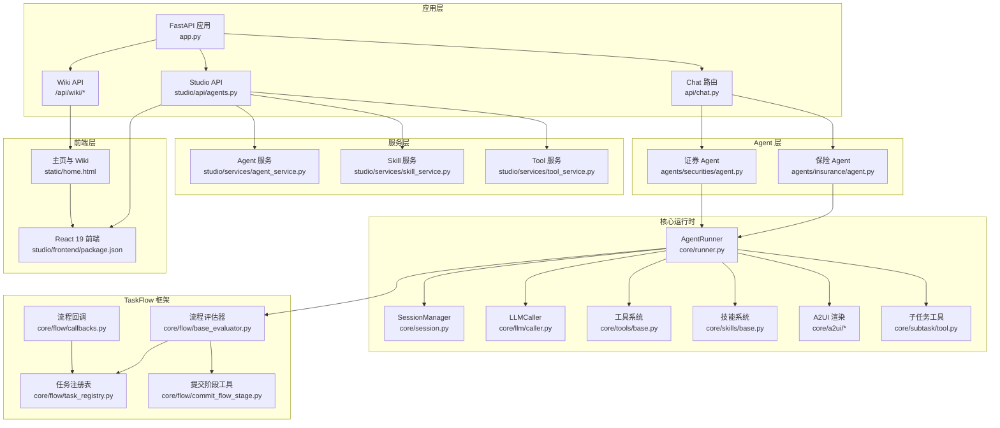

**图表来源**
- [src/ark_agentic/app.py:137-164](file://src/ark_agentic/app.py#L137-L164)
- [src/ark_agentic/api/chat.py:27-176](file://src/ark_agentic/api/chat.py#L27-L176)
- [src/ark_agentic/studio/api/agents.py:76-130](file://src/ark_agentic/studio/api/agents.py#L76-L130)
- [src/ark_agentic/studio/__init__.py:27-102](file://src/ark_agentic/studio/__init__.py#L27-L102)
- [src/ark_agentic/studio/services/agent_service.py:60-198](file://src/ark_agentic/studio/services/agent_service.py#L60-L198)
- [src/ark_agentic/studio/services/skill_service.py:44-294](file://src/ark_agentic/studio/services/skill_service.py#L44-L294)
- [src/ark_agentic/studio/services/tool_service.py:61-239](file://src/ark_agentic/studio/services/tool_service.py#L61-L239)
- [src/ark_agentic/studio/frontend/package.json:1-32](file://src/ark_agentic/studio/frontend/package.json#L1-L32)
- [src/ark_agentic/agents/insurance/agent.py:37-142](file://src/ark_agentic/agents/insurance/agent.py#L37-L142)
- [src/ark_agentic/agents/securities/agent.py:37-172](file://src/ark_agentic/agents/securities/agent.py#L37-L172)
- [src/ark_agentic/core/runner.py:193-311](file://src/ark_agentic/core/runner.py#L193-L311)
- [src/ark_agentic/core/session.py:24-67](file://src/ark_agentic/core/session.py#L24-L67)
- [src/ark_agentic/core/llm/caller.py:26-68](file://src/ark_agentic/core/llm/caller.py#L26-L68)
- [src/ark_agentic/core/tools/base.py:46-116](file://src/ark_agentic/core/tools/base.py#L46-L116)
- [src/ark_agentic/core/skills/base.py:19-50](file://src/ark_agentic/core/skills/base.py#L19-L50)
- [src/ark_agentic/core/a2ui/renderer.py:15-52](file://src/ark_agentic/core/a2ui/renderer.py#L15-L52)
- [src/ark_agentic/core/flow/base_evaluator.py:134-317](file://src/ark_agentic/core/flow/base_evaluator.py#L134-L317)
- [src/ark_agentic/core/flow/task_registry.py:32-124](file://src/ark_agentic/core/flow/task_registry.py#L32-L124)
- [src/ark_agentic/core/flow/commit_flow_stage.py:34-177](file://src/ark_agentic/core/flow/commit_flow_stage.py#L34-L177)
- [src/ark_agentic/core/flow/callbacks.py:100-142](file://src/ark_agentic/core/flow/callbacks.py#L100-L142)
- [src/ark_agentic/core/subtask/tool.py:61-319](file://src/ark_agentic/core/subtask/tool.py#L61-L319)
- [src/ark_agentic/static/home.html:1199-1352](file://src/ark_agentic/static/home.html#L1199-L1352)

**章节来源**
- [src/ark_agentic/app.py:137-164](file://src/ark_agentic/app.py#L137-L164)
- [src/ark_agentic/api/chat.py:27-176](file://src/ark_agentic/api/chat.py#L27-L176)

## 核心组件
- ReAct 执行引擎（AgentRunner）
  - 职责：构建系统提示、调用 LLM、执行工具、循环控制、回调钩子、结果汇总与统计。
  - 关键特性：最大轮次限制、单轮工具调用上限、工具超时、自动压缩、外部历史合并、Dream 后台蒸馏（可选）。
- 会话管理（SessionManager）
  - 职责：会话创建/加载/删除、消息持久化、上下文压缩、Token 统计、状态管理。
- 工具系统（AgentTool）
  - 职责：统一工具抽象、JSON Schema 导出、参数读取辅助、LangChain 适配。
- 技能系统（SkillConfig/SkillLoader）
  - 职责：技能目录扫描、动态/全量加载、资格检查、提示注入、预算控制。
- A2UI 渲染系统
  - 职责：模板渲染、块组合、主题与变换、事件派发。
- LLM 调用封装（LLMCaller）
  - 职责：消息转换、流式/非流式调用、Thinking 模型推理内容分流、重试与采样覆盖。
- 类型与事件（AgentMessage/ToolCall/AgentStreamEvent）
  - 职责：统一数据结构、事件模型与传输协议桥接。
- TaskFlow 流程编排框架
  - 职责：提供确定性状态机、阶段定义与验证、流程状态持久化与恢复。
- Studio 服务层
  - 职责：纯业务逻辑层，提供 Agent/Skill/Tool 的标准化 CRUD 操作。
- 子任务并行执行工具
  - 职责：支持批量子任务的并行执行与上下文隔离。
- **新增** 维基系统（Repowiki）
  - 职责：提供双语文档树构建、页面内容服务、元数据控制显示顺序。

**章节来源**
- [src/ark_agentic/core/runner.py:193-311](file://src/ark_agentic/core/runner.py#L193-L311)
- [src/ark_agentic/core/session.py:24-67](file://src/ark_agentic/core/session.py#L24-L67)
- [src/ark_agentic/core/tools/base.py:46-116](file://src/ark_agentic/core/tools/base.py#L46-L116)
- [src/ark_agentic/core/skills/base.py:19-50](file://src/ark_agentic/core/skills/base.py#L19-L50)
- [src/ark_agentic/core/a2ui/renderer.py:15-52](file://src/ark_agentic/core/a2ui/renderer.py#L15-L52)
- [src/ark_agentic/core/llm/caller.py:26-68](file://src/ark_agentic/core/llm/caller.py#L26-L68)
- [src/ark_agentic/core/types.py:18-422](file://src/ark_agentic/core/types.py#L18-L422)
- [src/ark_agentic/core/stream/events.py:67-115](file://src/ark_agentic/core/stream/events.py#L67-L115)
- [src/ark_agentic/core/flow/base_evaluator.py:134-317](file://src/ark_agentic/core/flow/base_evaluator.py#L134-L317)
- [src/ark_agentic/core/flow/task_registry.py:32-124](file://src/ark_agentic/core/flow/task_registry.py#L32-L124)
- [src/ark_agentic/core/flow/commit_flow_stage.py:34-177](file://src/ark_agentic/core/flow/commit_flow_stage.py#L34-L177)
- [src/ark_agentic/core/flow/callbacks.py:100-142](file://src/ark_agentic/core/flow/callbacks.py#L100-L142)
- [src/ark_agentic/core/subtask/tool.py:61-319](file://src/ark_agentic/core/subtask/tool.py#L61-L319)

## 架构总览
Ark-Agentic 采用"多 Agent + 统一 Runner + TaskFlow 编排 + 服务层重构 + 维基系统"的架构模式，API 层负责请求接入与事件流式输出，Runner 层负责 ReAct 循环与工具编排，TaskFlow 框架提供确定性的流程状态管理，底层通过会话管理、技能与工具系统提供可插拔扩展点。A2UI 渲染系统贯穿工具结果与 UI 组件的桥接。Studio 服务层提供纯业务逻辑支持，前端采用现代化 React 19 框架，维基系统提供完整的双语文档服务。

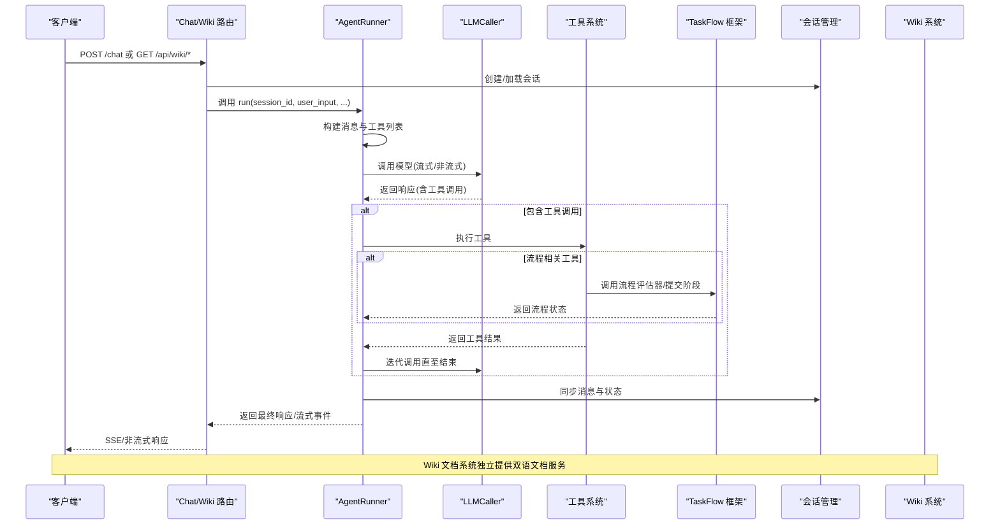

**图表来源**
- [src/ark_agentic/api/chat.py:27-176](file://src/ark_agentic/api/chat.py#L27-L176)
- [src/ark_agentic/core/runner.py:312-370](file://src/ark_agentic/core/runner.py#L312-L370)
- [src/ark_agentic/core/llm/caller.py:70-192](file://src/ark_agentic/core/llm/caller.py#L70-L192)
- [src/ark_agentic/core/tools/base.py:103-116](file://src/ark_agentic/core/tools/base.py#L103-L116)
- [src/ark_agentic/core/session.py:229-261](file://src/ark_agentic/core/session.py#L229-L261)
- [src/ark_agentic/core/flow/base_evaluator.py:166-229](file://src/ark_agentic/core/flow/base_evaluator.py#L166-L229)
- [src/ark_agentic/core/flow/commit_flow_stage.py:68-177](file://src/ark_agentic/core/flow/commit_flow_stage.py#L68-L177)
- [src/ark_agentic/app.py:198-263](file://src/ark_agentic/app.py#L198-L263)
- [src/ark_agentic/static/home.html:1199-1352](file://src/ark_agentic/static/home.html#L1199-L1352)

## 详细组件分析

### ReAct 执行引擎（AgentRunner）
- 生命周期与阶段
  - 解析运行参数 → 准备会话（钩子、上下文合并、历史合并、自动压缩）→ 执行 ReAct 循环（模型阶段/工具阶段/完成阶段）→ 结果收尾（钩子、状态清理、Dream 触发）。
- 关键配置
  - RunnerConfig：模型、采样、最大轮次、单轮工具调用上限、工具超时、自动压缩、提示配置、技能配置、子任务开关、Dream 开关与阈值、外部历史合并开关。
- 回调钩子
  - before_agent、before_model、after_model、before_tool、after_tool、before_loop_end、on_model_error 等，支持上下文更新与事件派发。
- 错误处理
  - 将 LLM 错误映射为用户友好提示，支持 AUTH、配额、限流、超时、上下文溢出、内容过滤、服务器错误、网络错误等分类。
- 模型与工具阶段
  - 模型阶段：支持流式与非流式，识别 Thinking 模型推理内容并路由到思考回调；解析工具调用 JSON。
  - 工具阶段：并发/串行执行、超时控制、状态合并、事件收集。
  - 完成阶段：before_loop_end 钩子可触发重试或提前结束。

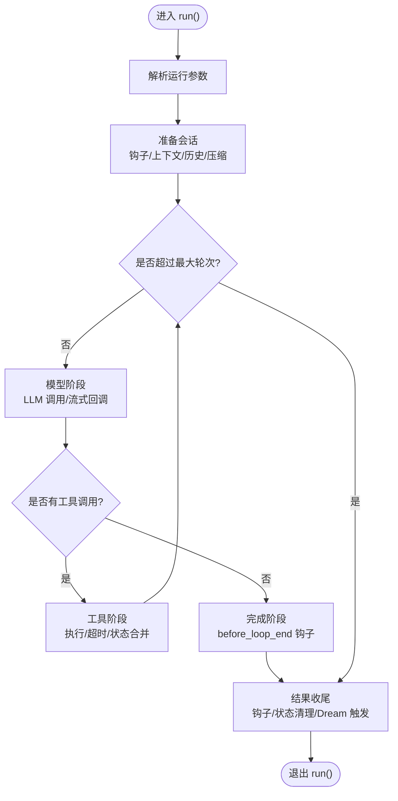

**图表来源**
- [src/ark_agentic/core/runner.py:312-370](file://src/ark_agentic/core/runner.py#L312-L370)
- [src/ark_agentic/core/runner.py:652-730](file://src/ark_agentic/core/runner.py#L652-L730)
- [src/ark_agentic/core/runner.py:760-800](file://src/ark_agentic/core/runner.py#L760-L800)

**章节来源**
- [src/ark_agentic/core/runner.py:92-128](file://src/ark_agentic/core/runner.py#L92-L128)
- [src/ark_agentic/core/runner.py:391-404](file://src/ark_agentic/core/runner.py#L391-L404)
- [src/ark_agentic/core/runner.py:592-610](file://src/ark_agentic/core/runner.py#L592-L610)

### 会话管理（SessionManager）
- 会话生命周期：创建、加载、重载、删除、列表。
- 消息管理：添加、批量添加、注入外部历史、清空、获取。
- 上下文压缩：按配置评估与压缩，记录统计。
- 状态与 Token：状态合并、临时状态清理、Token 统计与持久化。
- 持久化：TranscriptManager 与 SessionStore 双写，确保一致性。

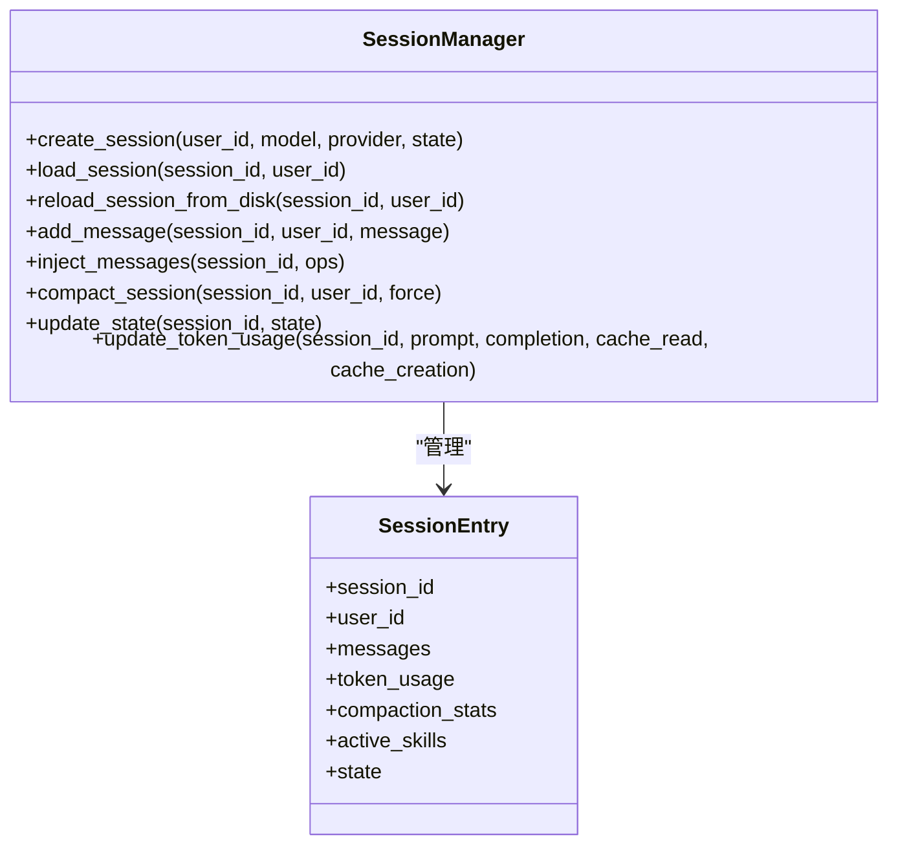

**图表来源**
- [src/ark_agentic/core/session.py:24-67](file://src/ark_agentic/core/session.py#L24-L67)
- [src/ark_agentic/core/session.py:350-381](file://src/ark_agentic/core/session.py#L350-L381)

**章节来源**
- [src/ark_agentic/core/session.py:40-67](file://src/ark_agentic/core/session.py#L40-L67)
- [src/ark_agentic/core/session.py:229-261](file://src/ark_agentic/core/session.py#L229-L261)
- [src/ark_agentic/core/session.py:387-430](file://src/ark_agentic/core/session.py#L387-L430)

### 工具系统（AgentTool）
- 抽象与规范：统一的工具基类、参数定义、JSON Schema 导出、LangChain 适配。
- 参数读取：字符串/整数/浮点/布尔/列表/字典等类型安全读取与校验。
- 与 Runner 集成：工具注册表、工具执行器、工具结果类型（JSON/TEXT/A2UI/ERROR）。

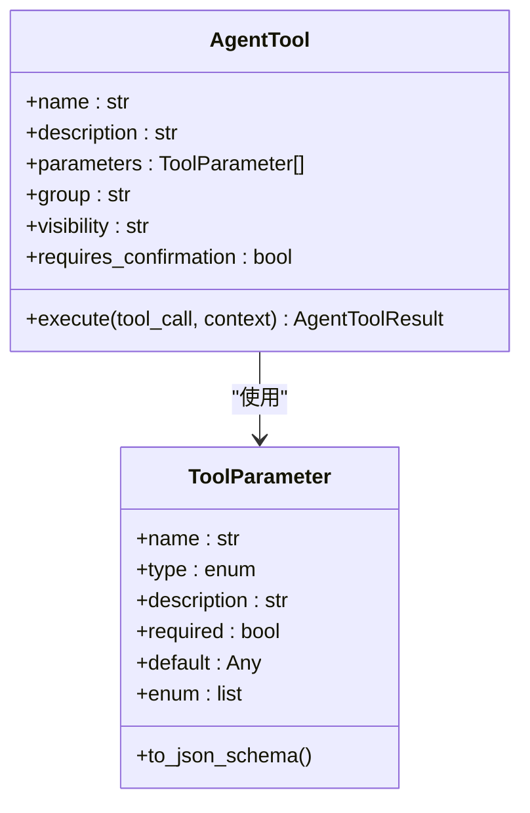

**图表来源**
- [src/ark_agentic/core/tools/base.py:46-116](file://src/ark_agentic/core/tools/base.py#L46-L116)
- [src/ark_agentic/core/tools/base.py:16-44](file://src/ark_agentic/core/tools/base.py#L16-L44)

**章节来源**
- [src/ark_agentic/core/tools/base.py:169-289](file://src/ark_agentic/core/tools/base.py#L169-L289)

### 技能系统（SkillConfig/SkillLoader）
- 配置：技能目录、Agent ID、加载模式（full/dynamic）、调用策略、预算控制。
- 动态加载：按需加载技能正文，支持资格检查（OS/二进制/环境变量/工具可用性）。
- 提示注入：扁平/分组渲染、预算截断、首行标题去重。

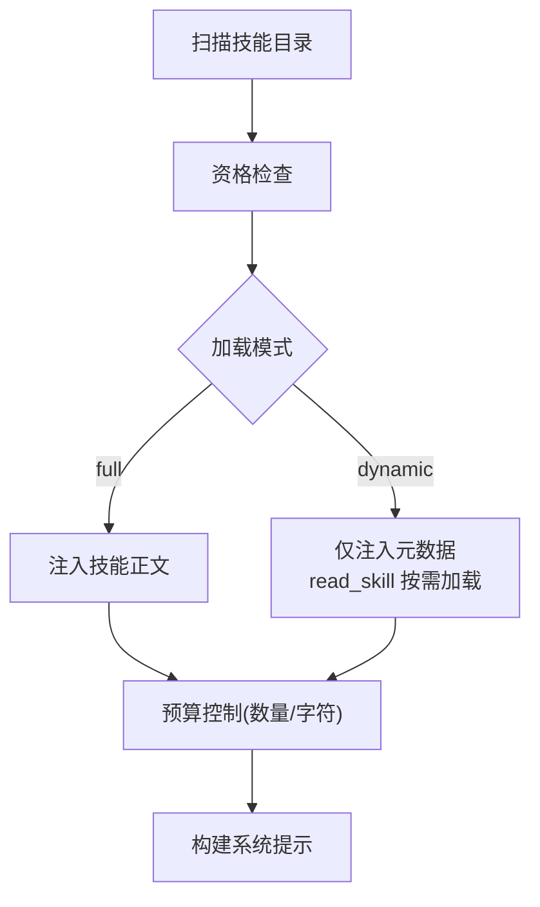

**图表来源**
- [src/ark_agentic/core/skills/base.py:51-101](file://src/ark_agentic/core/skills/base.py#L51-L101)
- [src/ark_agentic/core/skills/base.py:207-240](file://src/ark_agentic/core/skills/base.py#L207-L240)
- [src/ark_agentic/core/skills/base.py:242-304](file://src/ark_agentic/core/skills/base.py#L242-L304)

**章节来源**
- [src/ark_agentic/core/skills/base.py:19-50](file://src/ark_agentic/core/skills/base.py#L19-L50)
- [src/ark_agentic/core/skills/base.py:51-101](file://src/ark_agentic/core/skills/base.py#L51-L101)
- [src/ark_agentic/core/skills/base.py:242-304](file://src/ark_agentic/core/skills/base.py#L242-L304)

### A2UI 渲染系统
- 模板渲染：从模板目录读取 template.json，注入 surfaceId，合并 data。
- 块组合：BlockComposer 将块描述展开为完整 A2UI 负载，支持内联变换与主题。
- 事件派发：工具结果可自动转换为 UI_COMPONENT 事件，驱动前端渲染。

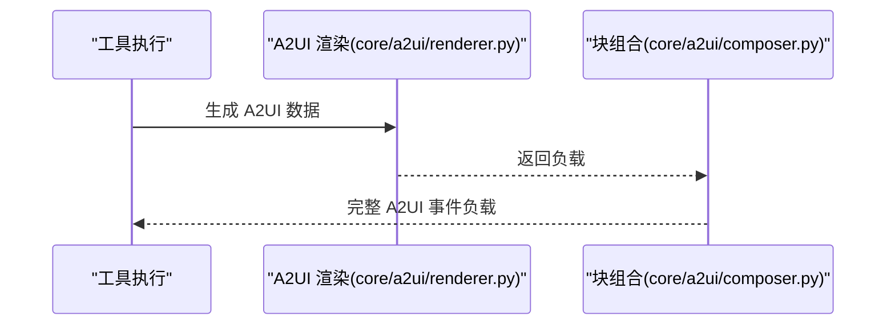

**图表来源**
- [src/ark_agentic/core/a2ui/renderer.py:15-52](file://src/ark_agentic/core/a2ui/renderer.py#L15-L52)
- [src/ark_agentic/core/a2ui/composer.py:60-122](file://src/ark_agentic/core/a2ui/composer.py#L60-L122)

**章节来源**
- [src/ark_agentic/core/a2ui/renderer.py:15-52](file://src/ark_agentic/core/a2ui/renderer.py#L15-L52)
- [src/ark_agentic/core/a2ui/composer.py:57-122](file://src/ark_agentic/core/a2ui/composer.py#L57-L122)

### LLM 调用封装（LLMCaller）
- 职责：消息转换、流式/非流式调用、Thinking 模型推理内容分流、重试与采样覆盖。
- 采样覆盖：支持背景任务（flush/dream/summarize）专用采样参数复用主 LLM 连接层。

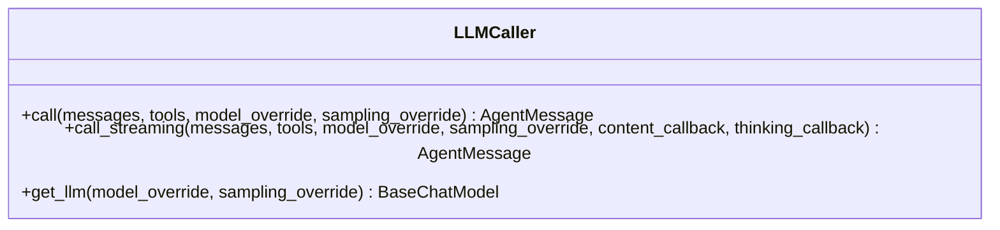

**图表来源**
- [src/ark_agentic/core/llm/caller.py:26-68](file://src/ark_agentic/core/llm/caller.py#L26-L68)
- [src/ark_agentic/core/llm/caller.py:70-192](file://src/ark_agentic/core/llm/caller.py#L70-L192)

**章节来源**
- [src/ark_agentic/core/llm/caller.py:26-68](file://src/ark_agentic/core/llm/caller.py#L26-L68)
- [src/ark_agentic/core/llm/caller.py:96-192](file://src/ark_agentic/core/llm/caller.py#L96-L192)

### API 与 Studio
- Chat API：支持流式与非流式响应，事件队列与 SSE 输出格式化。
- Studio API：基于文件系统扫描 agents 目录，提供 Agent 列表与元数据管理。
- **新增** Wiki API：提供双语文档树和页面内容服务，支持目录遍历和内容检索。

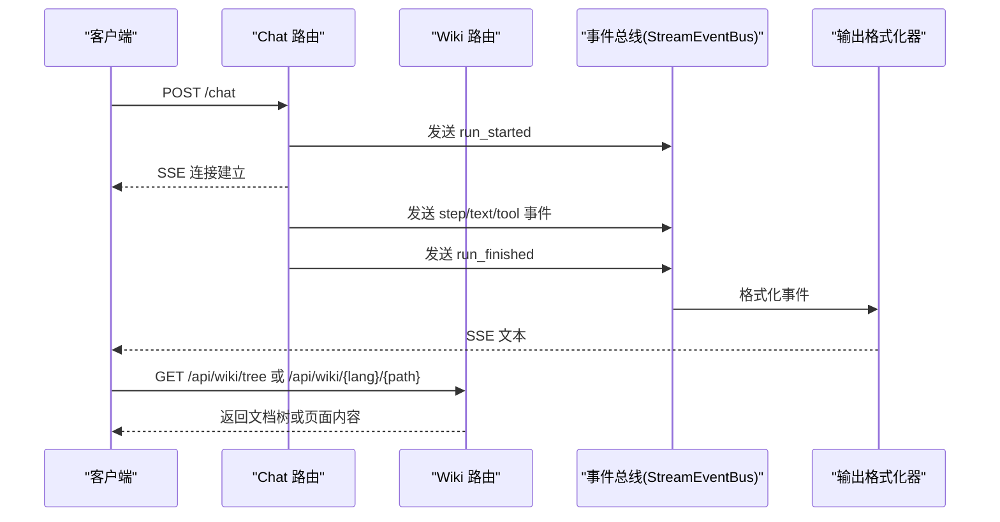

**图表来源**
- [src/ark_agentic/api/chat.py:115-176](file://src/ark_agentic/api/chat.py#L115-L176)
- [src/ark_agentic/core/stream/events.py:67-115](file://src/ark_agentic/core/stream/events.py#L67-L115)
- [src/ark_agentic/app.py:198-263](file://src/ark_agentic/app.py#L198-L263)

**章节来源**
- [src/ark_agentic/api/chat.py:27-176](file://src/ark_agentic/api/chat.py#L27-L176)
- [src/ark_agentic/studio/api/agents.py:76-130](file://src/ark_agentic/studio/api/agents.py#L76-L130)

## TaskFlow 流程编排框架

TaskFlow 是 Ark-Agentic 引入的核心流程编排框架，提供确定性的状态管理和阶段化工作流执行能力。

### 核心组件

#### BaseFlowEvaluator（流程评估器）
- 职责：继承自 AgentTool，提供通用的流程评估与状态管理能力。
- 关键特性：阶段遍历、Pydantic 数据验证、状态序列化、用户字段收集。
- 设计原则：每个业务流程继承此类，仅需定义 skill_name 和 stages。

#### StageDefinition（阶段定义）
- 职责：定义流程阶段的结构和验证规则。
- 关键字段：id、name、description、required、output_schema、reference_file、tools、field_sources。
- 校验机制：支持 Pydantic 模型验证，确保阶段数据完整性。

#### FlowEvaluatorRegistry（评估器注册表）
- 职责：全局单例注册表，维护 skill_name → evaluator 实例映射。
- 功能：注册、查找、枚举所有已注册的流程评估器。

#### TaskRegistry（任务注册表）
- 职责：管理 active_tasks.json 文件的读写与 TTL 清理。
- 功能：新增/更新任务记录、查询活动任务、自动清理过期任务。
- 数据格式：包含 flow_id、skill_name、current_stage、last_session_id 等关键信息。

#### CommitFlowStageTool（提交阶段工具）
- 职责：接收阶段完成数据，自动提取 tool 来源字段，验证并写入状态。
- 关键机制：支持 field_sources 声明，自动从 session.state 提取工具结果。
- 错误处理：提供详细的字段缺失和数据验证错误信息。

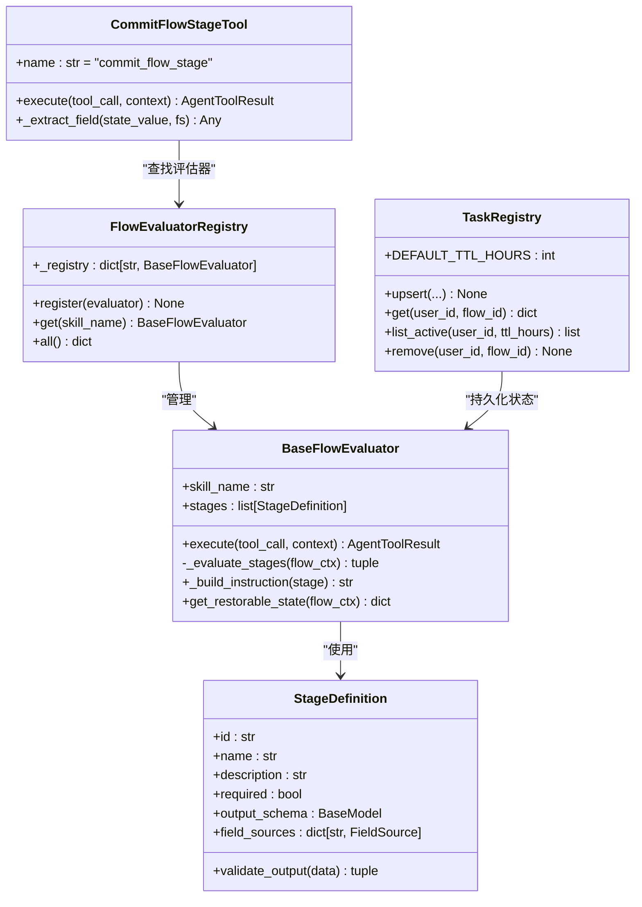

**图表来源**
- [src/ark_agentic/core/flow/base_evaluator.py:134-317](file://src/ark_agentic/core/flow/base_evaluator.py#L134-L317)
- [src/ark_agentic/core/flow/task_registry.py:32-124](file://src/ark_agentic/core/flow/task_registry.py#L32-L124)
- [src/ark_agentic/core/flow/commit_flow_stage.py:34-177](file://src/ark_agentic/core/flow/commit_flow_stage.py#L34-L177)

### 流程执行流程

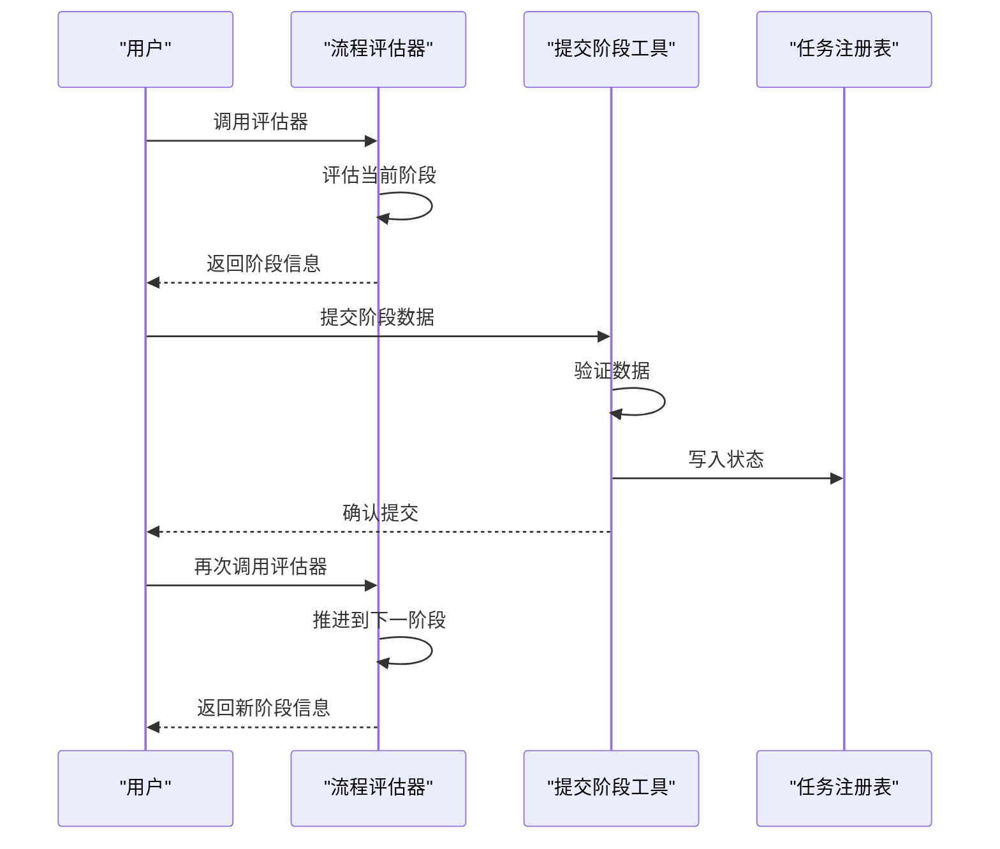

**图表来源**
- [src/ark_agentic/core/flow/base_evaluator.py:166-229](file://src/ark_agentic/core/flow/base_evaluator.py#L166-L229)
- [src/ark_agentic/core/flow/commit_flow_stage.py:68-177](file://src/ark_agentic/core/flow/commit_flow_stage.py#L68-L177)
- [src/ark_agentic/core/flow/callbacks.py:100-142](file://src/ark_agentic/core/flow/callbacks.py#L100-L142)

**章节来源**
- [src/ark_agentic/core/flow/__init__.py:1-19](file://src/ark_agentic/core/flow/__init__.py#L1-L19)
- [src/ark_agentic/core/flow/base_evaluator.py:134-317](file://src/ark_agentic/core/flow/base_evaluator.py#L134-L317)
- [src/ark_agentic/core/flow/task_registry.py:32-124](file://src/ark_agentic/core/flow/task_registry.py#L32-L124)
- [src/ark_agentic/core/flow/commit_flow_stage.py:34-177](file://src/ark_agentic/core/flow/commit_flow_stage.py#L34-L177)
- [src/ark_agentic/core/flow/callbacks.py:100-142](file://src/ark_agentic/core/flow/callbacks.py#L100-L142)

## 服务层重构

Studio 服务层采用了全新的三层架构设计，将业务逻辑与 HTTP 接口解耦，支持 HTTP 端点和 Meta-Agent 工具的双重调用模式。

### 三层架构设计

#### 服务层（Service Layer）
- 职责：纯业务逻辑层，不依赖 FastAPI 或任何 Web 框架。
- 特点：可被 HTTP 端点和 Phase 5 Meta-Agent 工具共同调用。
- 设计原则：关注业务领域模型，提供标准化的 CRUD 操作。

#### API 层（API Layer）
- 职责：HTTP 端点实现，负责请求验证、响应格式化。
- 特点：依赖服务层提供的业务逻辑，专注于接口层面的处理。

#### 控制台层（Studio Layer）
- 职责：提供可视化的管理界面和开发工具。
- 特点：集成 React 前端，支持实时编辑和预览。

### 核心服务组件

#### AgentService（Agent 服务）
- 职责：提供 Agent 脚手架创建和列表扫描功能。
- 关键功能：scaffold_agent（创建 Agent 目录结构）、list_agents（扫描 Agent 列表）、delete_agent（删除 Agent）。
- 数据模型：AgentMeta（Agent 元数据）、AgentScaffoldSpec（Agent 脚手架规格）。

#### SkillService（Skill 服务）
- 职责：提供 Skill 的 CRUD 和解析功能。
- 关键功能：list_skills（扫描 Skill 目录）、create_skill（创建 Skill）、update_skill（更新 Skill）、delete_skill（删除 Skill）。
- 数据模型：SkillMeta（Skill 元数据）、ToolParameterSpec（工具参数规格）。

#### ToolService（Tool 服务）
- 职责：提供 Tool 的列表、解析和脚手架生成功能。
- 关键功能：list_tools（列出所有 Tools）、scaffold_tool（生成脚手架）、parse_tool_file（解析工具文件）。
- 数据模型：ToolMeta（Tool 元数据）、ToolParameterSpec（工具参数规格）。

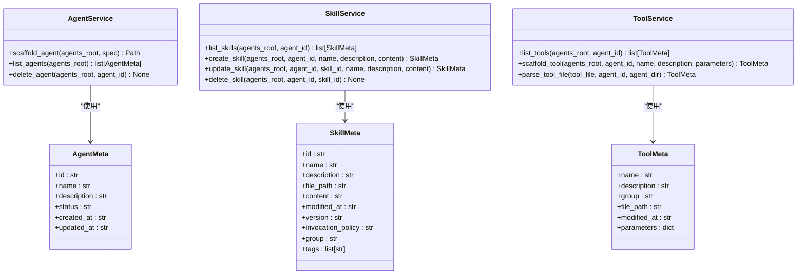

**图表来源**
- [src/ark_agentic/studio/services/agent_service.py:60-198](file://src/ark_agentic/studio/services/agent_service.py#L60-L198)
- [src/ark_agentic/studio/services/skill_service.py:44-294](file://src/ark_agentic/studio/services/skill_service.py#L44-L294)
- [src/ark_agentic/studio/services/tool_service.py:42-239](file://src/ark_agentic/studio/services/tool_service.py#L42-L239)

### 服务层集成流程

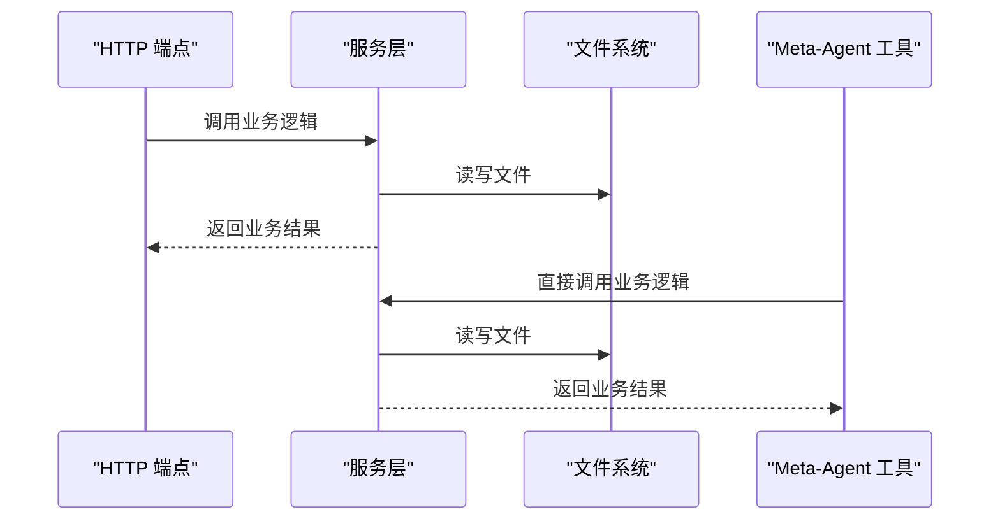

**图表来源**
- [src/ark_agentic/studio/services/agent_service.py:60-198](file://src/ark_agentic/studio/services/agent_service.py#L60-L198)
- [src/ark_agentic/studio/services/skill_service.py:44-294](file://src/ark_agentic/studio/services/skill_service.py#L44-L294)
- [src/ark_agentic/studio/services/tool_service.py:42-239](file://src/ark_agentic/studio/services/tool_service.py#L42-L239)

**章节来源**
- [src/ark_agentic/studio/__init__.py:27-102](file://src/ark_agentic/studio/__init__.py#L27-L102)
- [src/ark_agentic/studio/services/agent_service.py:60-198](file://src/ark_agentic/studio/services/agent_service.py#L60-L198)
- [src/ark_agentic/studio/services/skill_service.py:44-294](file://src/ark_agentic/studio/services/skill_service.py#L44-L294)
- [src/ark_agentic/studio/services/tool_service.py:42-239](file://src/ark_agentic/studio/services/tool_service.py#L42-L239)

## 前端现代化

Ark-Agentic 的前端采用了现代化的技术栈，基于 React 19、Vite 和 TypeScript 构建，提供优秀的开发体验和运行性能。

### 技术栈

#### React 19
- 最新版本的 React，提供更好的性能和开发体验。
- 支持并发特性和新的 Hooks API。
- 更好的 TypeScript 集成和类型安全。

#### Vite
- 现代化的构建工具，提供极速的开发服务器和构建速度。
- 内置模块热替换（HMR），支持实时代码更新。
- 优化的打包策略，生成高效的生产代码。

#### TypeScript
- 全面的类型系统，提供编译时类型检查。
- 改善的开发体验，包括智能提示和重构支持。
- 更好的代码维护性和可读性。

#### 开发工具链
- ESLint：代码质量检查和风格统一。
- React Hooks 插件：React 特定的 lint 规则。
- React Refresh：热重载 React 组件。
- 全局变量：支持环境变量配置。

### 前端架构

#### 目录结构
- `src/`：源代码目录
- `public/`：静态资源文件
- `dist/`：构建输出目录

#### 核心组件
- `App.tsx`：应用入口组件
- `StudioShell.tsx`：工作室外壳布局
- `LoginPage.tsx`：登录页面
- `StudioDashboardPage.tsx`：工作室仪表板
- `AgentWorkspacePage.tsx`：Agent 工作区页面

#### 路由系统
- 支持 React Router DOM 的 SPA 路由。
- 通配符路由支持，确保所有子路径都能正确加载。
- 兼容不带尾随斜杠的访问。

```mermaid
graph TB
subgraph "前端技术栈"
REACT["React 19<br/>组件框架"]
VITE["Vite<br/>构建工具"]
TS["TypeScript<br/>类型系统"]
ESLINT["ESLint<br/>代码检查"]
END
subgraph "前端架构"
APP["App.tsx<br/>应用入口"]
SHELL["StudioShell.tsx<br/>工作室外壳"]
LOGIN["LoginPage.tsx<br/>登录页面"]
DASHBOARD["StudioDashboardPage.tsx<br/>仪表板"]
WORKSPACE["AgentWorkspacePage.tsx<br/>工作区"]
ROUTER["React Router<br/>路由系统"]
END
REACT --> APP
APP --> SHELL
SHELL --> LOGIN
SHELL --> DASHBOARD
SHELL --> WORKSPACE
ROUTER --> SHELL
```

**图表来源**
- [src/ark_agentic/studio/frontend/package.json:1-32](file://src/ark_agentic/studio/frontend/package.json#L1-L32)

**章节来源**
- [src/ark_agentic/studio/frontend/package.json:1-32](file://src/ark_agentic/studio/frontend/package.json#L1-L32)

## 子任务并行执行

SpawnSubtasksTool 是 Ark-Agentic 引入的高级工具，支持批量子任务的并行执行和上下文隔离，特别适用于用户一句话包含多个独立意图的场景。

### 设计原则

#### 上下文隔离
- 每个子任务创建独立的 AgentRunner 和临时会话。
- 使用 `:sub:` 标记区分子任务会话 ID，防止嵌套执行。
- 父子任务之间通过 state_delta 同步必要的状态信息。

#### 并行执行
- 使用 asyncio.gather 实现真正的并行执行。
- 支持并发数量限制，避免资源耗尽。
- 每个子任务独立超时控制，提高系统稳定性。

#### 状态管理
- 自动合并子任务的状态差异，解决冲突。
- 支持令牌使用统计的累加。
- 可选择性保留或清理子任务会话。

### 核心配置

#### SubtaskConfig（子任务配置）
- `max_concurrent`：最大并发数，默认 4
- `timeout_seconds`：超时时间，默认 300 秒
- `tools_deny`：禁止使用的工具集合，默认包含 memory_write
- `keep_session`：是否保留子任务会话
- `max_turns`：最大轮次数
- `persist_transcript`：是否持久化对话记录

### 执行流程

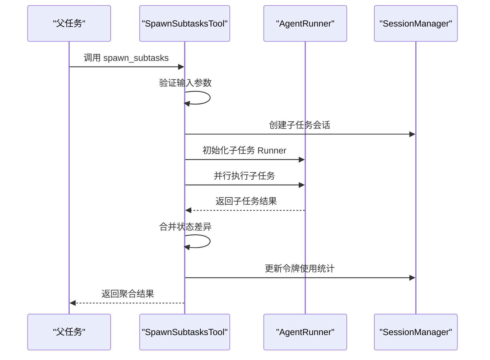

**图表来源**
- [src/ark_agentic/core/subtask/tool.py:106-165](file://src/ark_agentic/core/subtask/tool.py#L106-L165)
- [src/ark_agentic/core/subtask/tool.py:200-310](file://src/ark_agentic/core/subtask/tool.py#L200-L310)

### 错误处理

#### 常见错误类型
- **嵌套执行错误**：检测到 `:sub:` 标记时拒绝执行
- **空任务列表**：tasks 参数为空时返回错误
- **超时错误**：子任务执行超时，自动清理会话
- **状态冲突**：子任务间状态键冲突，采用最后写入获胜策略

#### 处理策略
- 记录详细的错误日志，包含任务标签和会话 ID
- 清理超时的子任务会话，释放系统资源
- 提供友好的错误信息，便于调试和用户理解

**章节来源**
- [src/ark_agentic/core/subtask/tool.py:61-319](file://src/ark_agentic/core/subtask/tool.py#L61-L319)

## 维基系统

**新增** Ark-Agentic 引入了完整的维基系统，提供双语文档服务，支持中文(zh)和英文(en)两种语言的文档浏览。

### 目录结构

维基系统采用 repowiki 目录结构，包含：

- `repowiki/zh/content/`：中文文档内容目录
- `repowiki/en/content/`：英文文档内容目录  
- `repowiki/zh/meta/`：中文元数据文件
- `repowiki/en/meta/`：英文元数据文件

### 核心组件

#### Wiki API 端点
- `/api/wiki/tree`：返回两种语言的目录树结构
- `/api/wiki/{lang}/{path}`：返回指定语言和路径的 Markdown 内容
- 支持目录遍历和文件内容检索

#### 目录树构建
- 从 `repowiki-metadata.json` 读取 `wiki_items` 顺序
- 按照 `wiki_catalogs` 中的目录顺序排序
- 支持递归遍历目录结构，过滤非 Markdown 文件

#### 页面渲染
- 前端使用 Marked.js 渲染 Markdown
- 支持 Mermaid 图表渲染
- 提供面包屑导航和语言切换功能

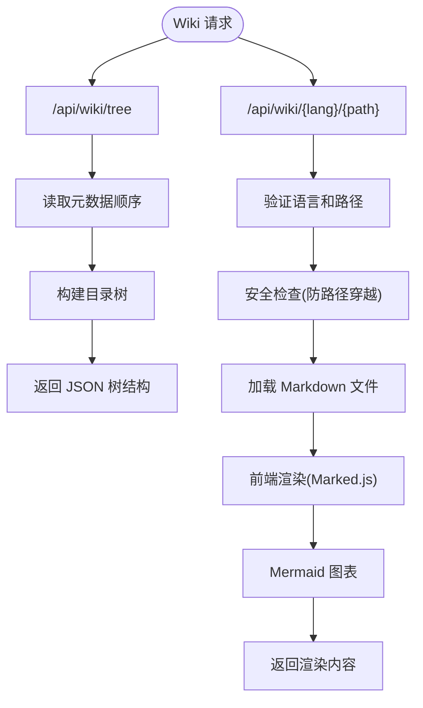

**图表来源**
- [src/ark_agentic/app.py:198-263](file://src/ark_agentic/app.py#L198-L263)
- [src/ark_agentic/static/home.html:1199-1352](file://src/ark_agentic/static/home.html#L1199-L1352)

### 维基系统特性

#### 双语支持
- 中文(zh)和英文(en)双语文档
- 独立的目录结构和内容文件
- 语言切换按钮支持

#### 元数据控制
- 通过 `repowiki-metadata.json` 控制显示顺序
- 支持目录分类和排序
- 保持文档组织的一致性

#### 安全性
- 路径穿越防护
- 文件类型验证(.md)
- 语言参数验证

**章节来源**
- [src/ark_agentic/app.py:198-263](file://src/ark_agentic/app.py#L198-L263)
- [src/ark_agentic/static/home.html:1199-1352](file://src/ark_agentic/static/home.html#L1199-L1352)

## 依赖关系分析
- 组件耦合
  - AgentRunner 与 SessionManager、LLMCaller、ToolRegistry、SkillLoader 强耦合，体现单一职责与清晰边界。
  - TaskFlow 框架通过 FlowEvaluatorRegistry 与 Runner 解耦，支持动态流程评估。
  - Studio 服务层与 API 层分离，实现业务逻辑与接口层的解耦。
  - 子任务工具与 Runner 通过上下文传递实现松耦合集成。
  - **新增** Wiki 系统与前端通过 API 端点解耦，支持独立部署和扩展。
- 外部依赖
  - LLM 后端（LangChain Chat 模型）、文件系统（会话与记忆）、SSE 输出格式化、**新增** repowiki 目录结构。
- 循环依赖
  - 未发现直接循环依赖；模块间通过接口与回调解耦。

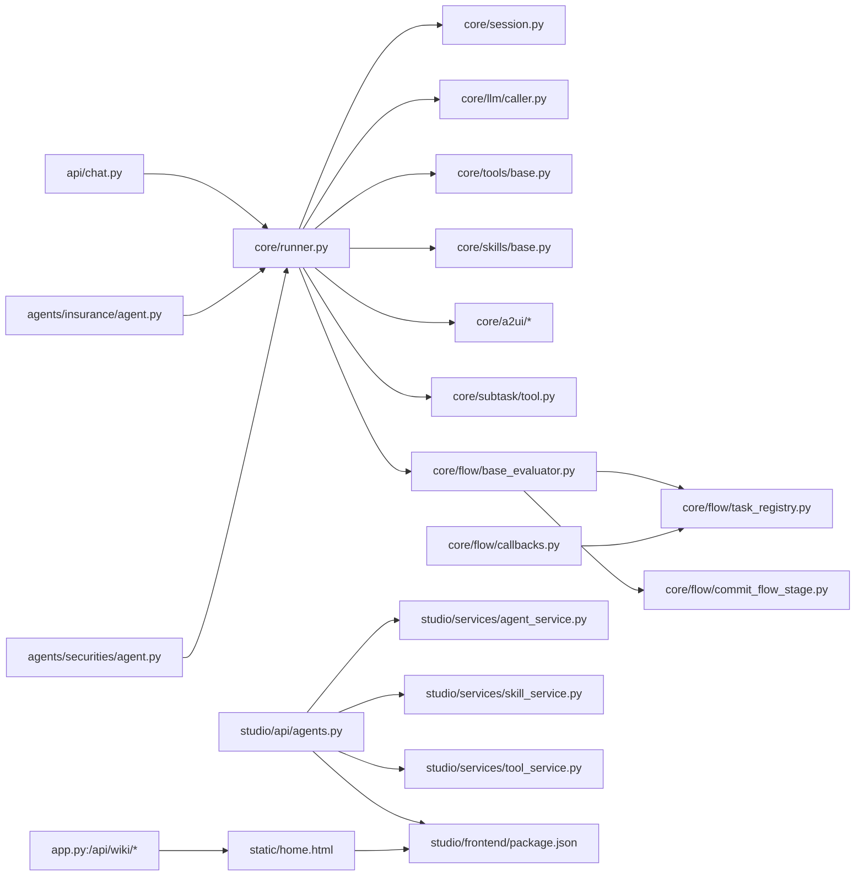

**图表来源**
- [src/ark_agentic/api/chat.py:27-176](file://src/ark_agentic/api/chat.py#L27-L176)
- [src/ark_agentic/core/runner.py:193-311](file://src/ark_agentic/core/runner.py#L193-L311)
- [src/ark_agentic/agents/insurance/agent.py:37-142](file://src/ark_agentic/agents/insurance/agent.py#L37-L142)
- [src/ark_agentic/agents/securities/agent.py:37-172](file://src/ark_agentic/agents/securities/agent.py#L37-L172)
- [src/ark_agentic/studio/api/agents.py:76-130](file://src/ark_agentic/studio/api/agents.py#L76-L130)
- [src/ark_agentic/studio/services/agent_service.py:60-198](file://src/ark_agentic/studio/services/agent_service.py#L60-L198)
- [src/ark_agentic/studio/services/skill_service.py:44-294](file://src/ark_agentic/studio/services/skill_service.py#L44-L294)
- [src/ark_agentic/studio/services/tool_service.py:42-239](file://src/ark_agentic/studio/services/tool_service.py#L42-L239)
- [src/ark_agentic/studio/frontend/package.json:1-32](file://src/ark_agentic/studio/frontend/package.json#L1-L32)
- [src/ark_agentic/app.py:198-263](file://src/ark_agentic/app.py#L198-L263)
- [src/ark_agentic/static/home.html:1199-1352](file://src/ark_agentic/static/home.html#L1199-L1352)

**章节来源**
- [src/ark_agentic/core/runner.py:214-283](file://src/ark_agentic/core/runner.py#L214-L283)
- [src/ark_agentic/core/session.py:24-67](file://src/ark_agentic/core/session.py#L24-L67)

## 性能考量
- 上下文压缩
  - 基于 LLM 摘要器的压缩策略，减少 Token 使用，提升吞吐。
- 工具执行
  - 单轮工具调用上限与超时控制，避免长尾阻塞。
- 流式输出
  - SSE 事件流式推送，降低前端等待时间。
- 重试与退避
  - LLM 调用与流式迭代统一重试策略，提升稳定性。
- 内存与 IO
  - 会话与记忆文件化存储，建议使用高性能磁盘与合理缓存策略。
- TaskFlow 持久化
  - 任务状态异步持久化，避免阻塞主流程执行。
- 子任务并行
  - 并发数量限制和超时控制，防止资源耗尽。
- 前端性能
  - React 19 的并发特性提升渲染性能，Vite 的热重载加速开发。
- **新增** Wiki 系统性能
  - 目录树构建使用元数据文件，避免深度遍历。
  - Markdown 渲染采用懒加载，提升页面响应速度。

## 故障排查指南
- 常见错误映射
  - 认证失败、配额不足、限流、超时、上下文溢出、内容过滤、服务器错误、网络异常等，Runner 将错误归类并返回用户友好提示。
- 诊断要点
  - 查看会话 Token 统计与压缩记录，定位上下文过长问题。
  - 检查工具调用参数与返回结果，确认工具可用性与权限。
  - 关注 before_loop_end 钩子返回的重试信号与响应。
  - TaskFlow 场景下检查评估器注册和阶段状态验证。
  - 子任务场景下监控并发数和超时情况。
  - **新增** Wiki 系统：检查 repowiki 目录结构和元数据文件完整性。
- 日志与追踪
  - 应用启动时初始化 TracerProvider，结合回调钩子事件进行端到端追踪。
  - TaskFlow 框架提供详细的流程状态日志。
  - 子任务工具记录详细的执行统计和错误信息。
  - **新增** Wiki API：检查文件权限和路径解析错误。

**章节来源**
- [src/ark_agentic/core/runner.py:592-610](file://src/ark_agentic/core/runner.py#L592-L610)
- [src/ark_agentic/core/session.py:362-379](file://src/ark_agentic/core/session.py#L362-L379)
- [src/ark_agentic/core/flow/base_evaluator.py:166-229](file://src/ark_agentic/core/flow/base_evaluator.py#L166-L229)
- [src/ark_agentic/core/subtask/tool.py:106-165](file://src/ark_agentic/core/subtask/tool.py#L106-L165)
- [src/ark_agentic/app.py:198-263](file://src/ark_agentic/app.py#L198-L263)

## 结论
Ark-Agentic 通过"多 Agent + 统一 Runner + TaskFlow 编排 + 服务层重构 + 维基系统"的架构，实现了高度模块化、可扩展和可维护的设计。TaskFlow 框架提供了确定性的流程状态管理，服务层重构实现了业务逻辑与接口层的解耦，前端现代化提升了开发体验和用户体验，**新增的维基系统**提供了完整的双语文档服务。该架构具备良好的扩展性与可维护性，适合在金融与企业服务场景中持续演进。

## 附录
- Agent 构建与注册
  - 保险与证券 Agent 分别构建工具注册表、会话管理器、技能加载器与 Runner 配置，并可选启用 Memory 与主动服务 Job。
- 类型与事件
  - 统一的消息、工具调用、工具结果与会话类型定义，以及 AG-UI 事件模型，确保前后端一致的契约。
- TaskFlow 使用场景
  - 适用于需要严格状态管理的业务流程，如保险理赔、证券交易等。
- Studio 服务层优势
  - 支持多种调用方式，提供一致的业务逻辑接口。
- 子任务并行执行适用场景
  - 用户同时提出多个独立需求，需要并行处理的场景。
- **新增** 维基系统优势
  - 双语文档支持，元数据控制显示顺序，安全性保障，易于扩展和维护。

**章节来源**
- [src/ark_agentic/agents/insurance/agent.py:37-142](file://src/ark_agentic/agents/insurance/agent.py#L37-L142)
- [src/ark_agentic/agents/securities/agent.py:37-172](file://src/ark_agentic/agents/securities/agent.py#L37-L172)
- [src/ark_agentic/core/types.py:18-422](file://src/ark_agentic/core/types.py#L18-L422)
- [src/ark_agentic/core/stream/events.py:67-115](file://src/ark_agentic/core/stream/events.py#L67-L115)
- [src/ark_agentic/core/flow/__init__.py:1-19](file://src/ark_agentic/core/flow/__init__.py#L1-L19)
- [src/ark_agentic/studio/__init__.py:27-102](file://src/ark_agentic/studio/__init__.py#L27-L102)
- [src/ark_agentic/core/subtask/tool.py:61-319](file://src/ark_agentic/core/subtask/tool.py#L61-L319)
- [src/ark_agentic/app.py:198-263](file://src/ark_agentic/app.py#L198-L263)
- [src/ark_agentic/static/home.html:1199-1352](file://src/ark_agentic/static/home.html#L1199-L1352)
- [README.md:1-200](file://README.md#L1-L200)