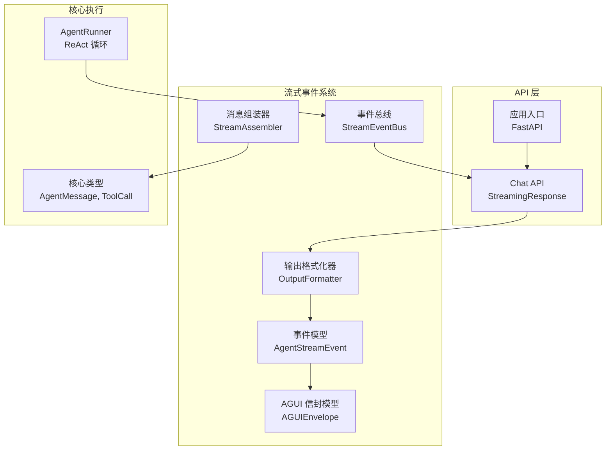
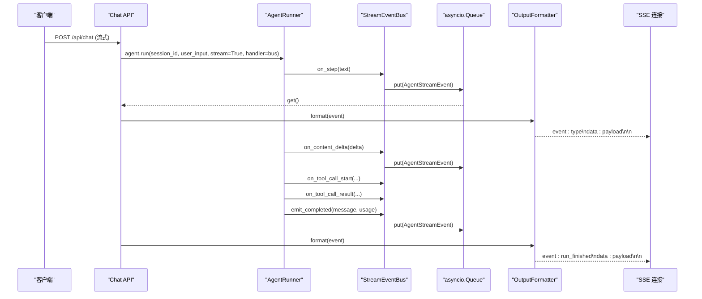
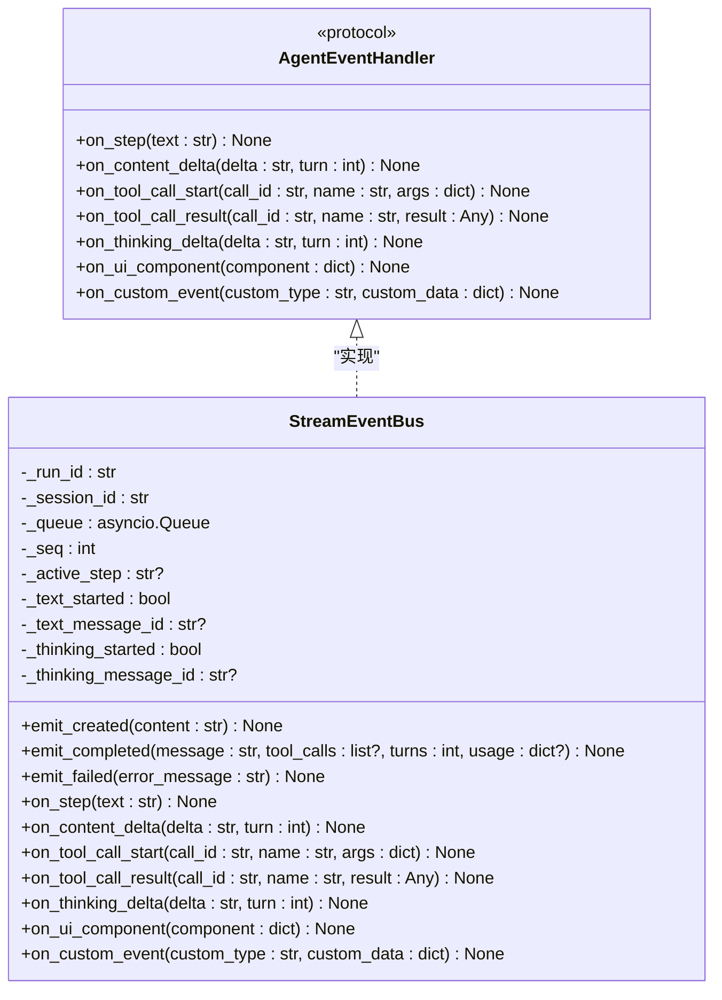
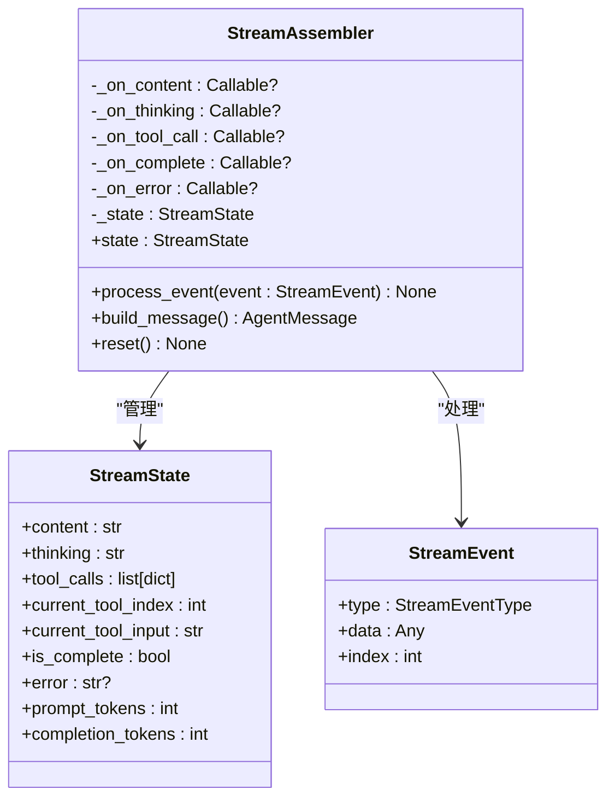
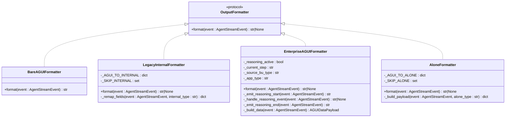
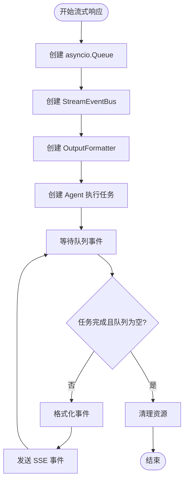
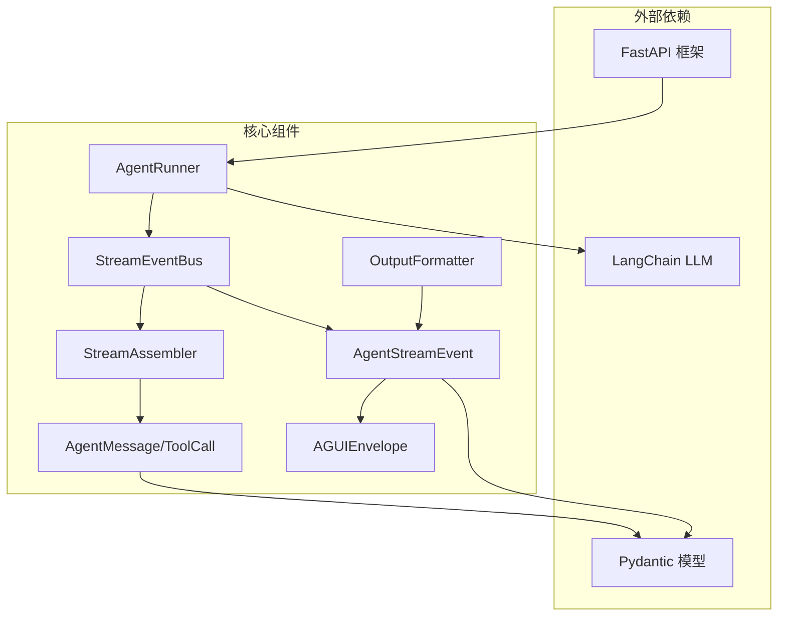

# 流式事件系统

<cite>
**本文档引用的文件**
- [event_bus.py](file://src/ark_agentic/core/stream/event_bus.py)
- [assembler.py](file://src/ark_agentic/core/stream/assembler.py)
- [output_formatter.py](file://src/ark_agentic/core/stream/output_formatter.py)
- [events.py](file://src/ark_agentic/core/stream/events.py)
- [agui_models.py](file://src/ark_agentic/core/stream/agui_models.py)
- [types.py](file://src/ark_agentic/core/types.py)
- [chat.py](file://src/ark_agentic/api/chat.py)
- [app.py](file://src/ark_agentic/app.py)
- [runner.py](file://src/ark_agentic/core/runner.py)
- [test_event_bus.py](file://tests/unit/core/test_event_bus.py)
- [test_output_formatter.py](file://tests/unit/core/test_output_formatter.py)
- [test_stream.py](file://tests/unit/core/test_stream.py)
</cite>

## 目录
1. [简介](#简介)
2. [项目结构](#项目结构)
3. [核心组件](#核心组件)
4. [架构概览](#架构概览)
5. [详细组件分析](#详细组件分析)
6. [依赖关系分析](#依赖关系分析)
7. [性能考虑](#性能考虑)
8. [故障排除指南](#故障排除指南)
9. [结论](#结论)

## 简介
本文件详细介绍 Ark-Agentic 项目的流式事件系统，包括事件总线设计模式、消息组装器的数据聚合机制以及输出格式化器的协议转换能力。系统基于 FastAPI 提供 SSE（Server-Sent Events）实时消息传输，支持多种协议格式（AG-UI 原生、企业 AGUI 信封、旧版 response.*、ALONE 协议），并具备完善的生命周期管理、错误处理和性能优化策略。

## 项目结构
流式事件系统位于 `src/ark_agentic/core/stream/` 目录下，主要包含以下模块：
- 事件总线：负责将 Runner 回调转换为 AG-UI 原生事件并推入队列
- 消息组装器：处理 LLM 流式响应，组装完整的消息内容
- 输出格式化器：将 AG-UI 事件适配到不同传输协议格式
- 事件模型：定义 AG-UI 协议标准事件类型和统一事件模型
- 企业 AGUI 信封模型：定义企业级 AGUI 信封结构



**图表来源**
- [event_bus.py:67-248](file://src/ark_agentic/core/stream/event_bus.py#L67-L248)
- [assembler.py:79-398](file://src/ark_agentic/core/stream/assembler.py#L79-L398)
- [output_formatter.py:59-444](file://src/ark_agentic/core/stream/output_formatter.py#L59-L444)
- [events.py:67-116](file://src/ark_agentic/core/stream/events.py#L67-L116)
- [agui_models.py:39-51](file://src/ark_agentic/core/stream/agui_models.py#L39-L51)

**章节来源**
- [event_bus.py:1-248](file://src/ark_agentic/core/stream/event_bus.py#L1-L248)
- [assembler.py:1-398](file://src/ark_agentic/core/stream/assembler.py#L1-L398)
- [output_formatter.py:1-444](file://src/ark_agentic/core/stream/output_formatter.py#L1-L444)
- [events.py:1-116](file://src/ark_agentic/core/stream/events.py#L1-L116)
- [agui_models.py:1-51](file://src/ark_agentic/core/stream/agui_models.py#L1-L51)

## 核心组件
流式事件系统包含四个核心组件，每个组件都有明确的职责和扩展点：

### 事件总线（StreamEventBus）
实现 `AgentEventHandler` 协议，负责将 Runner 内部回调翻译为 AG-UI 原生 `AgentStreamEvent` 并推入 `asyncio.Queue`。内部维护步骤和文本消息的活跃状态，自动配对 start/finish 事件。

### 消息组装器（StreamAssembler）
处理 LLM 的流式响应，组装完整的消息内容。支持文本内容累积、思考过程累积、工具调用参数累积和解析，以及事件回调。

### 输出格式化器（OutputFormatter）
将 AG-UI 原生事件适配到不同的传输协议格式，支持四种协议：
- agui：裸 AG-UI 事件（原生输出）
- enterprise：企业 AGUI 信封（AGUIEnvelope 包装）
- internal：旧版 response.* 格式（向后兼容）
- alone：旧版 ALONE 协议（sa_* 事件）

### 事件模型（AgentStreamEvent）
定义 AG-UI 协议标准事件类型（17种），作为内部事件总线的原生格式。所有 Agent 的实时输出都封装为此模型。

**章节来源**
- [event_bus.py:28-248](file://src/ark_agentic/core/stream/event_bus.py#L28-L248)
- [assembler.py:79-270](file://src/ark_agentic/core/stream/assembler.py#L79-L270)
- [output_formatter.py:48-444](file://src/ark_agentic/core/stream/output_formatter.py#L48-L444)
- [events.py:30-116](file://src/ark_agentic/core/stream/events.py#L30-L116)

## 架构概览
系统采用分层架构设计，从 API 层到核心执行层再到流式事件处理层，形成完整的实时消息传输链路。



**图表来源**
- [chat.py:115-177](file://src/ark_agentic/api/chat.py#L115-L177)
- [runner.py:312-371](file://src/ark_agentic/core/runner.py#L312-L371)
- [event_bus.py:146-248](file://src/ark_agentic/core/stream/event_bus.py#L146-L248)
- [output_formatter.py:59-150](file://src/ark_agentic/core/stream/output_formatter.py#L59-L150)

## 详细组件分析

### 事件总线组件分析

#### 设计模式与扩展性
事件总线采用依赖倒置原则（DIP），通过 `AgentEventHandler` 协议定义抽象接口，Runner 依赖此协议而非具体实现。新事件类型只需扩展协议接口，无需修改 Runner 核心逻辑。

#### 状态管理机制
内部维护以下活跃状态并自动管理其生命周期：
- 步骤状态：`_active_step` - 自动配对 step_started/step_finished
- 文本消息状态：`_text_started` 和 `_text_message_id` - 自动配对 text_message_start/text_message_end
- 思考消息状态：`_thinking_started` 和 `_thinking_message_id` - 自动配对 thinking_message_start/thinking_message_end



**图表来源**
- [event_bus.py:28-248](file://src/ark_agentic/core/stream/event_bus.py#L28-L248)

#### 事件生命周期管理
事件总线确保事件序列的完整性，通过状态跟踪实现自动配对：
- `on_step()`：自动关闭前一个活跃步骤，发送 step_finished，然后发送 step_started
- `on_content_delta()`：首次调用时自动启动文本消息，发送 text_message_start
- `on_thinking_delta()`：首次调用时自动启动思考消息，发送 thinking_message_start
- `emit_completed()` 和 `emit_failed()`：自动关闭所有活跃状态并发送终结事件

**章节来源**
- [event_bus.py:67-248](file://src/ark_agentic/core/stream/event_bus.py#L67-L248)
- [test_event_bus.py:24-253](file://tests/unit/core/test_event_bus.py#L24-L253)

### 消息组装器组件分析

#### 数据聚合机制
消息组装器采用状态模式管理流式数据的累积和解析：



**图表来源**
- [assembler.py:48-270](file://src/ark_agentic/core/stream/assembler.py#L48-L270)

#### 工具调用参数解析
支持工具调用参数的增量累积和 JSON 解析：
- 首次接收时记录当前工具索引和初始参数
- 通过 `TOOL_USE_DELTA` 事件累积参数字符串
- 在 `TOOL_USE_END` 事件时解析完整 JSON 参数
- 处理 JSON 解析异常，降级为原始字符串

#### LLM 格式转换
提供 Anthropic 和 OpenAI SSE 格式的解析器：
- Anthropic：支持 message_start/content_block_start/delta/stop/error
- OpenAI：支持 content/tool_calls/delta/finish_reason

**章节来源**
- [assembler.py:79-398](file://src/ark_agentic/core/stream/assembler.py#L79-L398)
- [test_stream.py:28-374](file://tests/unit/core/test_stream.py#L28-L374)

### 输出格式化器组件分析

#### 协议适配策略
输出格式化器采用策略模式，支持四种传输协议：



**图表来源**
- [output_formatter.py:48-444](file://src/ark_agentic/core/stream/output_formatter.py#L48-L444)

#### 企业 AGUI 信封格式
EnterpriseAGUIFormatter 实现企业级 AGUI 信封格式，包含以下特性：
- 自动管理 reasoning_start/reasoning_end 事件对
- 将思考过程映射为 reasoning_message_content 结构化 JSON
- 支持 ui_protocol 和 ui_data 的动态切换
- 通过 source_bu_type 和 app_type 注入企业信息

#### JSON 检测与处理
提供 `_try_extract_json()` 函数，支持代码围栏包裹的 JSON 文本解析：
- 支持 ```json ``` 和 ``` ``` 代码围栏
- 忽略大小写差异（JSON/JSON）
- 处理 CRLF 换行符
- 降级处理无效 JSON，返回 None

**章节来源**
- [output_formatter.py](file://src/ark_agentic/core/stream/output_formatter.py#L24-L444)
- [test_output_formatter.py](file://tests/unit/core/test_output_formatter.py#L1-L518)

### SSE 事件流实现分析

#### API 端点设计
Chat API 提供统一的流式响应端点，支持多种协议格式：
- POST `/api/chat`：支持流式和非流式响应
- 自动创建和管理会话
- 支持多协议格式选择（agui/internal/enterprise/alone）

#### 连接管理策略
API 层实现完整的连接生命周期管理：
- 使用 `asyncio.Queue` 存储事件，支持最大容量 100
- 通过 `done_event` 协调 Agent 执行和事件发送
- 实现优雅的取消和清理机制
- 处理客户端断开连接的异常情况



**图表来源**
- [chat.py](file://src/ark_agentic/api/chat.py#L115-L177)

**章节来源**
- [chat.py](file://src/ark_agentic/api/chat.py#L27-L177)
- [app.py](file://src/ark_agentic/app.py#L137-L249)

## 依赖关系分析

### 组件耦合度分析
系统采用松耦合设计，各组件间通过清晰的接口进行交互：



**图表来源**
- [runner.py:33-50](file://src/ark_agentic/core/runner.py#L33-L50)
- [event_bus.py:20-22](file://src/ark_agentic/core/stream/event_bus.py#L20-L22)
- [assembler.py:17-19](file://src/ark_agentic/core/stream/assembler.py#L17-L19)
- [output_formatter.py:20-21](file://src/ark_agentic/core/stream/output_formatter.py#L20-L21)

### 关键依赖链
1. **API 层** → **Runner**：通过 FastAPI 路由调用 AgentRunner
2. **Runner** → **EventBus**：Runner 将回调传递给事件总线
3. **EventBus** → **Queue**：事件总线将事件放入异步队列
4. **Queue** → **Formatter**：API 层从队列获取事件并格式化
5. **Formatter** → **SSE**：格式化后的事件通过 SSE 发送给客户端

**章节来源**
- [runner.py:613-621](file://src/ark_agentic/core/runner.py#L613-L621)
- [chat.py:115-177](file://src/ark_agentic/api/chat.py#L115-L177)

## 性能考虑

### 内存优化策略
- **队列容量限制**：SSE 队列最大容量为 100，防止慢消费者积压内存
- **工具结果截断**：超过 2000 字符的工具结果自动截断，避免内存溢出
- **状态重置**：消息组装器提供 reset() 方法，及时清理累积状态

### 并发处理优化
- **异步队列**：使用 `asyncio.Queue` 实现非阻塞的事件传递
- **任务协调**：通过 `asyncio.Event` 协调 Agent 执行和事件发送
- **超时处理**：队列获取操作设置超时，避免无限等待

### 序列化性能
- **事件模型优化**：使用 Pydantic 模型，支持高效的 JSON 序列化
- **条件格式化**：某些事件类型直接跳过格式化，减少不必要的处理
- **批量处理**：支持异步迭代器处理事件流，提高吞吐量

## 故障排除指南

### 常见问题诊断
1. **事件丢失问题**：检查事件总线的状态管理，确保自动配对机制正常工作
2. **内存泄漏**：验证队列容量限制和资源清理机制
3. **协议转换错误**：检查 OutputFormatter 的事件映射表和字段转换逻辑

### 错误处理策略
- **LLM 错误映射**：将底层 LLM 错误转换为用户友好的错误消息
- **工具调用异常**：捕获工具执行异常，发送标准化的错误事件
- **连接中断处理**：优雅处理客户端断开连接，清理相关资源

### 调试技巧
- **单元测试覆盖**：系统包含完整的单元测试，涵盖各种边界情况
- **日志记录**：详细的日志记录帮助定位问题
- **状态监控**：通过测试用例验证状态机的正确性

**章节来源**
- [test_event_bus.py:1-253](file://tests/unit/core/test_event_bus.py#L1-L253)
- [test_output_formatter.py:1-518](file://tests/unit/core/test_output_formatter.py#L1-L518)
- [test_stream.py:1-374](file://tests/unit/core/test_stream.py#L1-L374)

## 结论
Ark-Agentic 的流式事件系统通过清晰的分层架构和设计模式，实现了高效、可扩展的实时消息传输。系统的主要优势包括：

1. **模块化设计**：各组件职责明确，易于维护和扩展
2. **协议适配**：支持多种传输协议，满足不同客户端需求
3. **状态管理**：完善的生命周期管理确保事件序列的完整性
4. **性能优化**：通过异步处理和内存优化提升系统性能
5. **错误处理**：健壮的错误处理机制保证系统稳定性

该系统为复杂的 AI Agent 应用提供了可靠的实时通信基础，支持从简单对话到复杂工具调用的完整场景。