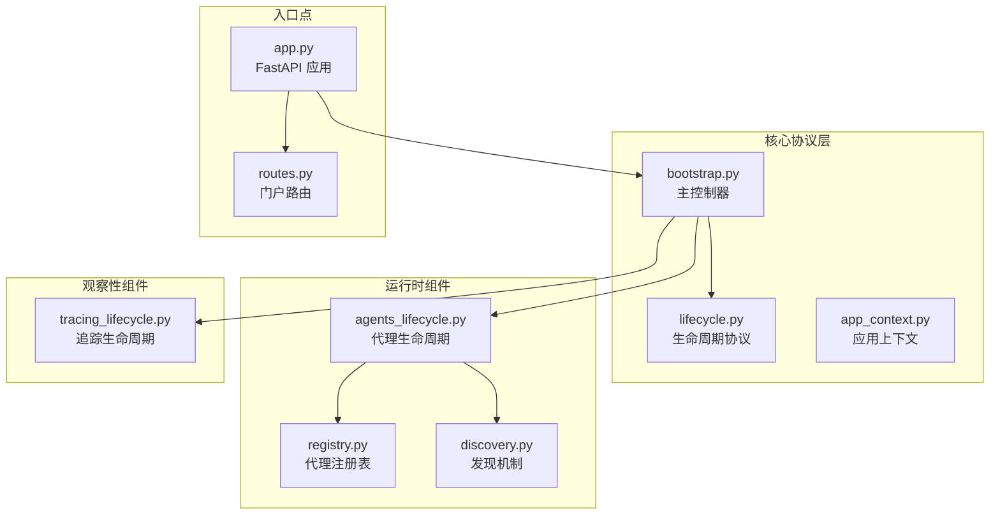
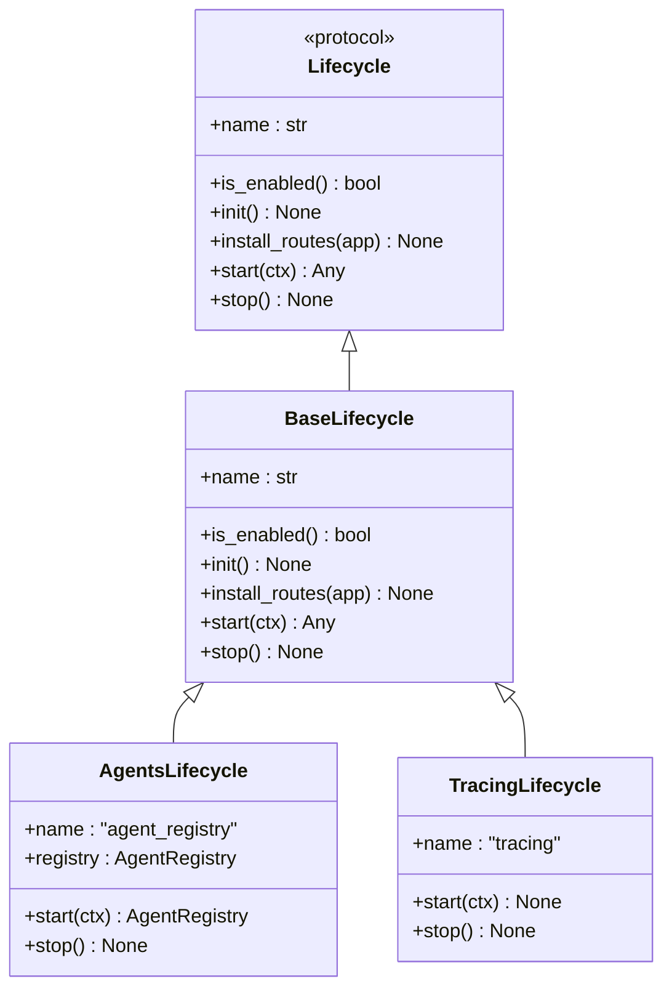
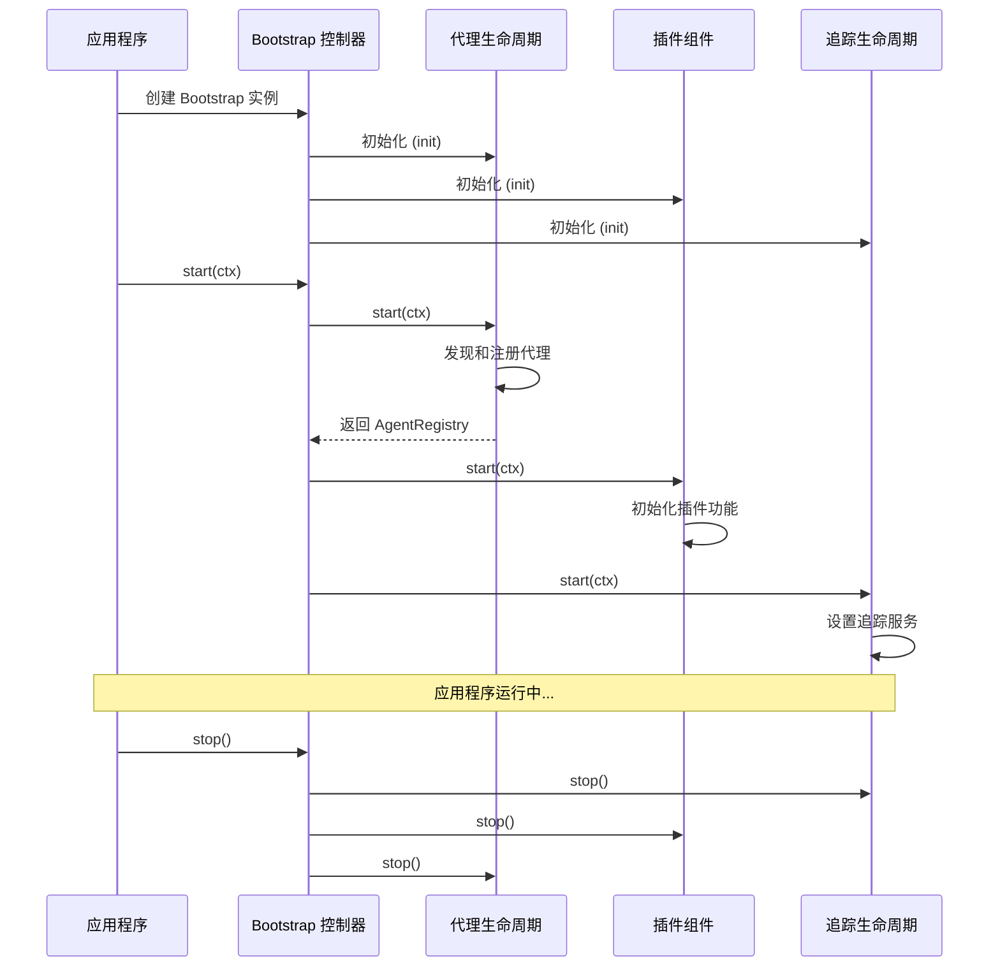
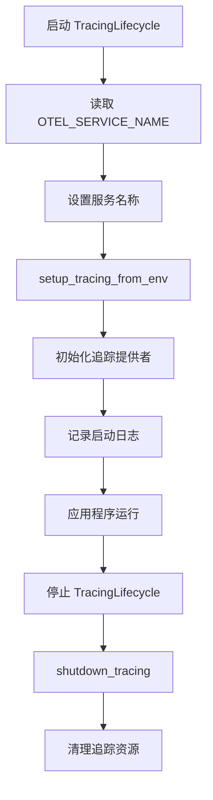
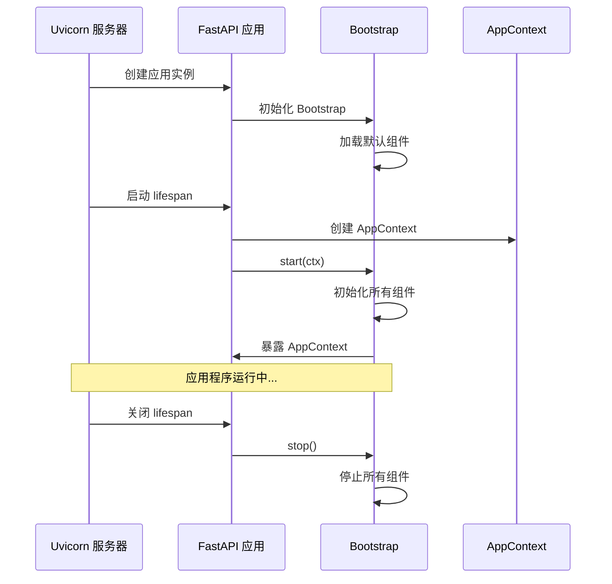
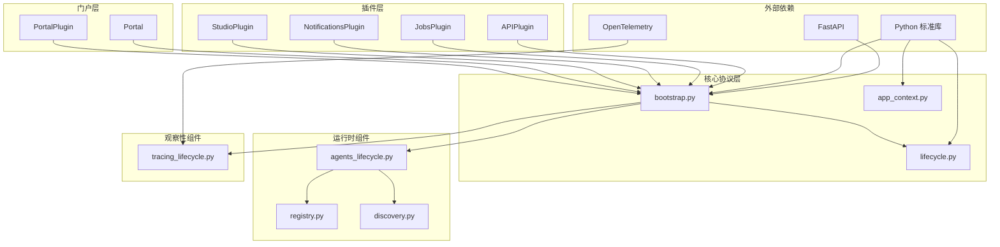
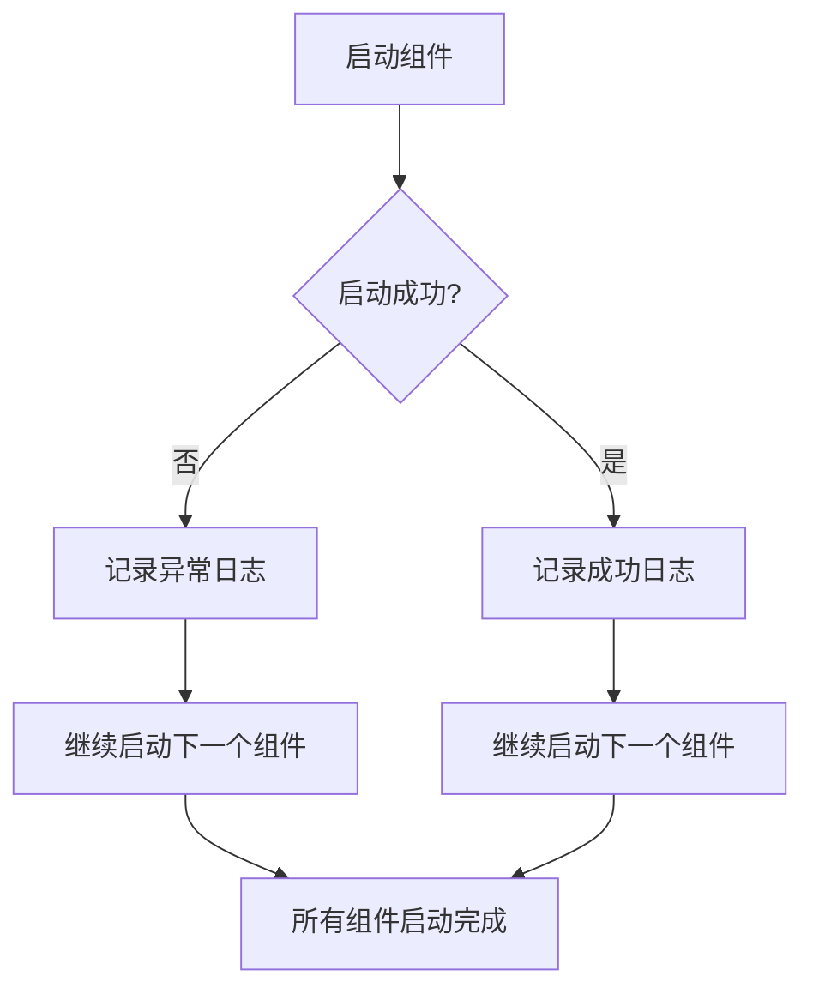

# Bootstrap 生命周期系统

<cite>
**本文档引用的文件**
- [bootstrap.py](file://src/ark_agentic/core/protocol/bootstrap.py)
- [lifecycle.py](file://src/ark_agentic/core/protocol/lifecycle.py)
- [agents_lifecycle.py](file://src/ark_agentic/core/runtime/agents_lifecycle.py)
- [tracing_lifecycle.py](file://src/ark_agentic/core/observability/tracing_lifecycle.py)
- [discovery.py](file://src/ark_agentic/core/runtime/discovery.py)
- [registry.py](file://src/ark_agentic/core/runtime/registry.py)
- [app_context.py](file://src/ark_agentic/core/protocol/app_context.py)
- [app.py](file://src/ark_agentic/app.py)
- [test_bootstrap.py](file://tests/unit/test_bootstrap.py)
- [plugin.py](file://src/ark_agentic/plugins/api/plugin.py)
- [routes.py](file://src/ark_agentic/portal/routes.py)
</cite>

## 目录
1. [简介](#简介)
2. [项目结构](#项目结构)
3. [核心组件](#核心组件)
4. [架构概览](#架构概览)
5. [详细组件分析](#详细组件分析)
6. [依赖关系分析](#依赖关系分析)
7. [性能考虑](#性能考虑)
8. [故障排除指南](#故障排除指南)
9. [结论](#结论)

## 简介

Bootstrap 生命周期系统是 ark-agentic 框架的核心基础设施，负责协调应用程序中各个组件的初始化、启动和停止过程。该系统采用统一的生命周期协议，确保所有组件按照预定义的顺序进行管理，同时提供了灵活的插件机制来扩展功能。

系统的主要特点包括：
- 统一的生命周期管理协议
- 强制性的核心组件（AgentsLifecycle 和 TracingLifecycle）
- 可选的插件组件
- 环境驱动的组件启用/禁用
- 严格的启动顺序保证
- 健壮的错误处理机制

## 项目结构

Bootstrap 生命周期系统主要分布在以下目录中：



**图表来源**
- [bootstrap.py:1-162](file://src/ark_agentic/core/protocol/bootstrap.py#L1-L162)
- [lifecycle.py:1-91](file://src/ark_agentic/core/protocol/lifecycle.py#L1-L91)
- [agents_lifecycle.py:1-80](file://src/ark_agentic/core/runtime/agents_lifecycle.py#L1-L80)

**章节来源**
- [bootstrap.py:1-162](file://src/ark_agentic/core/protocol/bootstrap.py#L1-L162)
- [app.py:1-94](file://src/ark_agentic/app.py#L1-L94)

## 核心组件

### Bootstrap 主控制器

Bootstrap 类是整个生命周期系统的核心控制器，负责协调所有组件的生命周期管理。它具有以下关键特性：

- **强制性组件**：自动加载 AgentsLifecycle（第一个）和 TracingLifecycle（最后一个）
- **可选插件**：用户自定义的插件位于强制性组件之间
- **延迟导入**：为避免循环依赖，核心组件在需要时才导入
- **状态管理**：跟踪已启动的组件，确保正确的停止顺序

### 生命周期协议

Lifecycle 协议定义了所有组件必须遵循的标准接口：



**图表来源**
- [lifecycle.py:23-91](file://src/ark_agentic/core/protocol/lifecycle.py#L23-L91)
- [agents_lifecycle.py:43-80](file://src/ark_agentic/core/runtime/agents_lifecycle.py#L43-L80)
- [tracing_lifecycle.py:21-42](file://src/ark_agentic/core/observability/tracing_lifecycle.py#L21-L42)

**章节来源**
- [lifecycle.py:1-91](file://src/ark_agentic/core/protocol/lifecycle.py#L1-L91)
- [bootstrap.py:48-162](file://src/ark_agentic/core/protocol/bootstrap.py#L48-L162)

## 架构概览

Bootstrap 生命周期系统采用分层架构设计，确保组件间的松耦合和高内聚：



**图表来源**
- [bootstrap.py:115-162](file://src/ark_agentic/core/protocol/bootstrap.py#L115-L162)
- [agents_lifecycle.py:56-80](file://src/ark_agentic/core/runtime/agents_lifecycle.py#L56-L80)
- [tracing_lifecycle.py:32-42](file://src/ark_agentic/core/observability/tracing_lifecycle.py#L32-L42)

## 详细组件分析

### 代理生命周期管理

AgentsLifecycle 是核心组件之一，负责代理系统的完整生命周期管理：

#### 代理发现机制

```mermaid
flowchart TD
A[启动 AgentsLifecycle] --> B[获取 AGENTS_ROOT]
B --> C[解析代理根目录]
C --> D[导入代理包路径]
D --> E[遍历子包]
E --> F{是否有 register 函数?}
F --> |是| G[调用 register(registry, **opts)]
F --> |否| E
G --> H[记录发现的代理]
H --> I[为每个代理执行 warmup]
I --> J[完成启动]
```

**图表来源**
- [agents_lifecycle.py:56-70](file://src/ark_agentic/core/runtime/agents_lifecycle.py#L56-L70)
- [discovery.py:50-107](file://src/ark_agentic/core/runtime/discovery.py#L50-L107)

#### 代理注册表

AgentRegistry 提供了代理的集中管理功能：

| 方法 | 功能描述 | 参数 |
|------|----------|------|
| `get(agent_id)` | 获取指定 ID 的代理实例 | `agent_id: str` |
| `register(agent_id, agent)` | 注册新的代理实例 | `agent_id: str, agent: AgentRunner` |
| `list_ids()` | 获取所有已注册代理的 ID 列表 | 无 |

**章节来源**
- [agents_lifecycle.py:1-80](file://src/ark_agentic/core/runtime/agents_lifecycle.py#L1-L80)
- [discovery.py:1-107](file://src/ark_agentic/core/runtime/discovery.py#L1-L107)
- [registry.py:1-29](file://src/ark_agentic/core/runtime/registry.py#L1-L29)

### 追踪生命周期管理

TracingLifecycle 负责 OpenTelemetry 追踪系统的生命周期管理：

#### 追踪配置流程



**图表来源**
- [tracing_lifecycle.py:32-42](file://src/ark_agentic/core/observability/tracing_lifecycle.py#L32-L42)

**章节来源**
- [tracing_lifecycle.py:1-42](file://src/ark_agentic/core/observability/tracing_lifecycle.py#L1-L42)

### 应用程序集成

FastAPI 应用程序通过 lifespan 管理器集成 Bootstrap 生命周期系统：

#### 应用启动流程



**图表来源**
- [app.py:60-78](file://src/ark_agentic/app.py#L60-L78)

**章节来源**
- [app.py:1-94](file://src/ark_agentic/app.py#L1-L94)

## 依赖关系分析

Bootstrap 生命周期系统的设计遵循了清晰的依赖层次结构：



**图表来源**
- [bootstrap.py:39-78](file://src/ark_agentic/core/protocol/bootstrap.py#L39-L78)
- [app.py:35-56](file://src/ark_agentic/app.py#L35-L56)

**章节来源**
- [bootstrap.py:1-162](file://src/ark_agentic/core/protocol/bootstrap.py#L1-L162)
- [app.py:1-94](file://src/ark_agentic/app.py#L1-L94)

## 性能考虑

Bootstrap 生命周期系统在设计时充分考虑了性能优化：

### 启动性能优化

1. **延迟导入**：核心组件采用延迟导入策略，避免不必要的模块加载
2. **异步初始化**：所有初始化操作都是异步的，不会阻塞主线程
3. **组件过滤**：禁用的组件会被完全跳过，减少启动时间

### 内存管理

1. **代理内存管理**：AgentsLifecycle 在停止时会正确关闭代理的内存资源
2. **追踪资源清理**：TracingLifecycle 确保追踪提供者的正确清理
3. **上下文隔离**：每个组件都有独立的生命周期，避免内存泄漏

### 可扩展性

1. **插件架构**：通过插件机制支持功能扩展
2. **环境配置**：支持通过环境变量控制组件启用状态
3. **动态发现**：代理通过文件系统动态发现，无需硬编码配置

## 故障排除指南

### 常见问题及解决方案

#### 组件启动失败

当某个组件启动失败时，Bootstrap 会继续尝试启动其他组件：



**图表来源**
- [bootstrap.py:153-162](file://src/ark_agentic/core/protocol/bootstrap.py#L153-L162)

#### 组件冲突检测

Bootstrap 会在启动时检测组件名称冲突：

```python
# 当两个组件发布相同的 ctx.slot 名称时会抛出异常
raise RuntimeError("Lifecycle name collision: ctx.{c.name} already set")
```

**章节来源**
- [bootstrap.py:140-151](file://src/ark_agentic/core/protocol/bootstrap.py#L140-L151)

#### 测试验证

单元测试验证了生命周期系统的正确行为：

- **启动顺序**：组件按照注册顺序启动
- **停止顺序**：组件按照相反顺序停止
- **幂等性**：init() 方法可以安全地重复调用
- **禁用组件**：is_enabled() 返回 False 的组件会被跳过

**章节来源**
- [test_bootstrap.py:1-235](file://tests/unit/test_bootstrap.py#L1-L235)

## 结论

Bootstrap 生命周期系统为 ark-agentic 框架提供了强大而灵活的基础架构。通过统一的生命周期协议、强制性的核心组件和可选的插件机制，系统实现了高度的模块化和可扩展性。

### 主要优势

1. **一致性**：所有组件都遵循相同的生命周期管理协议
2. **可靠性**：健壮的错误处理和资源清理机制
3. **可扩展性**：通过插件机制轻松添加新功能
4. **性能**：异步操作和延迟导入优化启动性能
5. **可维护性**：清晰的职责分离和依赖关系

### 设计亮点

- **强制性组件**：确保核心功能的完整性
- **环境驱动配置**：通过环境变量控制组件行为
- **严格顺序保证**：确保组件间正确的依赖关系
- **优雅降级**：单个组件失败不影响整体系统

该系统为构建复杂的人工智能代理应用提供了坚实的基础，支持从简单的命令行工具到复杂的 Web 服务的各种部署场景。