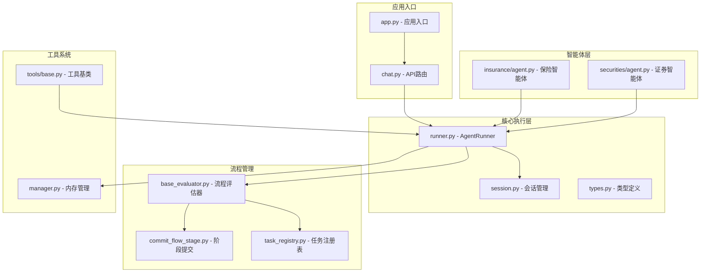
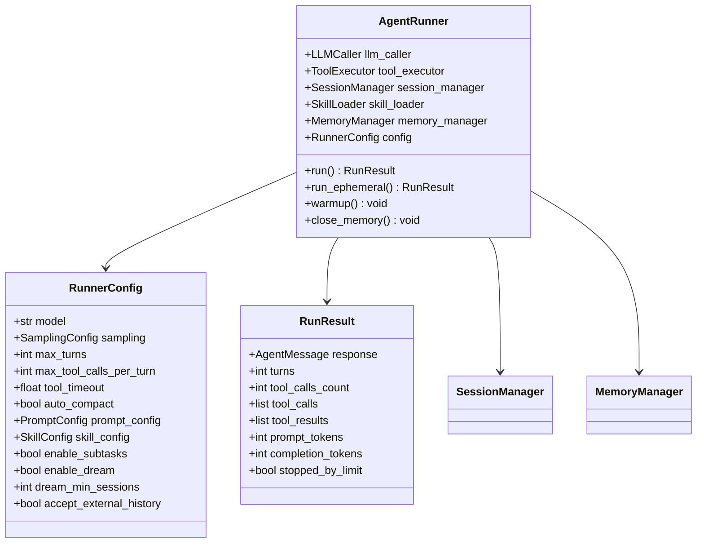
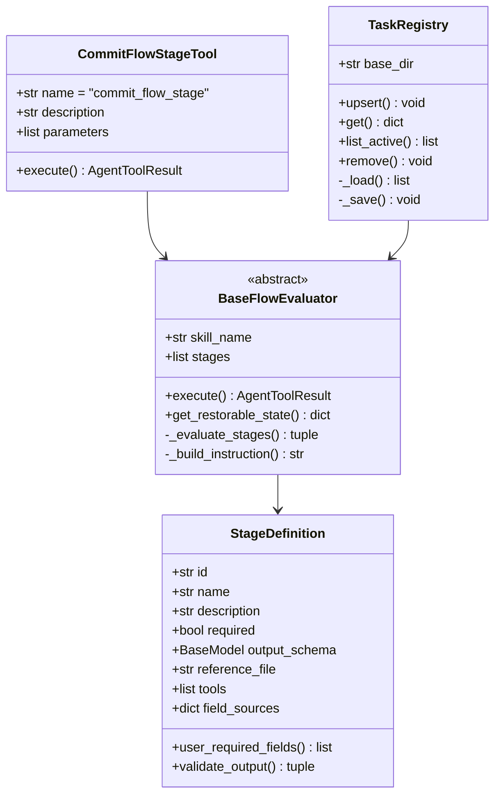
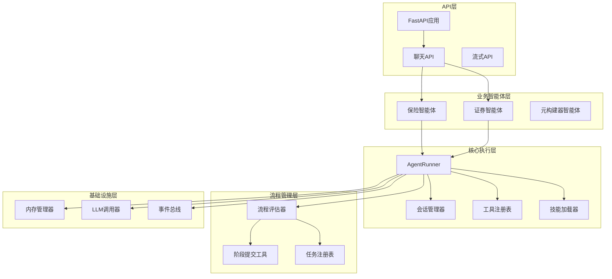
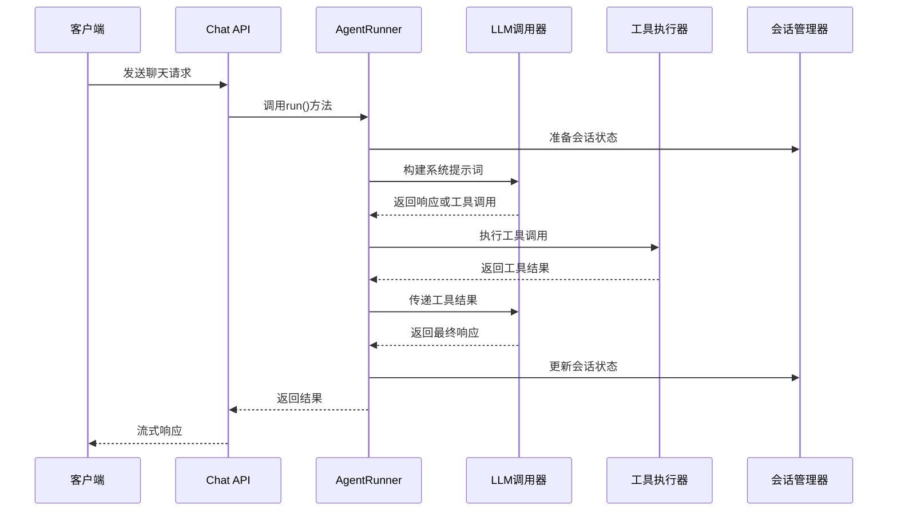
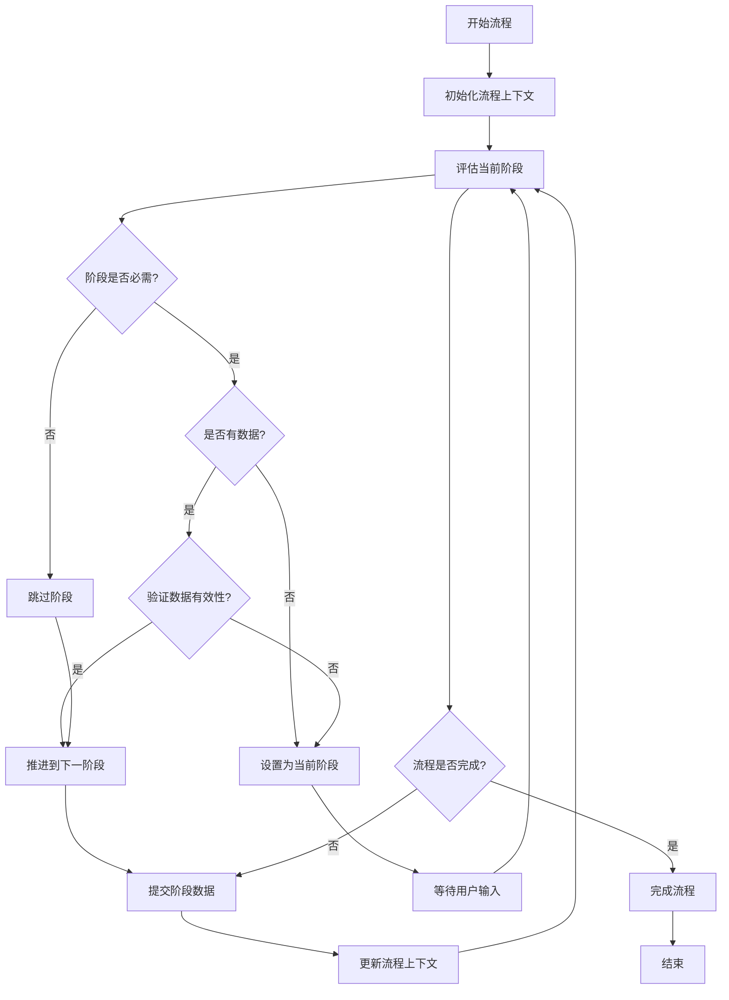
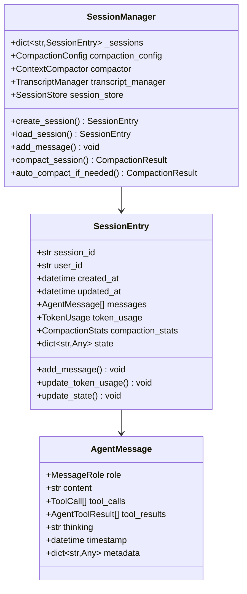
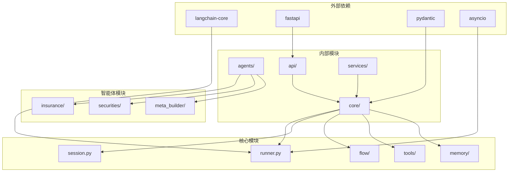

# TaskFlow 任务流框架

<cite>
**本文档引用的文件**
- [app.py](file://src/ark_agentic/app.py)
- [runner.py](file://src/ark_agentic/core/runner.py)
- [task_registry.py](file://src/ark_agentic/core/flow/task_registry.py)
- [base_evaluator.py](file://src/ark_agentic/core/flow/base_evaluator.py)
- [commit_flow_stage.py](file://src/ark_agentic/core/flow/commit_flow_stage.py)
- [types.py](file://src/ark_agentic/core/types.py)
- [agent.py](file://src/ark_agentic/agents/insurance/agent.py)
- [agent.py](file://src/ark_agentic/agents/securities/agent.py)
- [session.py](file://src/ark_agentic/core/session.py)
- [base.py](file://src/ark_agentic/core/tools/base.py)
- [chat.py](file://src/ark_agentic/api/chat.py)
- [SKILL.md](file://src/ark_agentic/agents/insurance/skills/withdraw_money_flow/SKILL.md)
- [manager.py](file://src/ark_agentic/core/memory/manager.py)
</cite>

## 目录
1. [简介](#简介)
2. [项目结构](#项目结构)
3. [核心组件](#核心组件)
4. [架构概览](#架构概览)
5. [详细组件分析](#详细组件分析)
6. [依赖关系分析](#依赖关系分析)
7. [性能考虑](#性能考虑)
8. [故障排除指南](#故障排除指南)
9. [结论](#结论)

## 简介

TaskFlow 任务流框架是 Ark-Agentic 项目中的核心执行引擎，基于 ReAct（Reasoning and Acting）范式构建，专门设计用于处理复杂的多步骤业务流程。该框架通过结构化的任务管理、智能的流程评估和强大的工具执行能力，实现了从简单问答到复杂业务流程的无缝衔接。

框架的核心特点包括：
- **结构化流程管理**：通过阶段化的 SOP（标准作业程序）处理复杂业务流程
- **智能状态恢复**：支持跨会话的任务中断恢复机制
- **动态工具集成**：灵活的工具注册和执行系统
- **流式响应支持**：实时的流式对话体验
- **内存管理系统**：持久化的用户记忆和上下文管理

## 项目结构

**图表来源**
- [app.py:1-184](file://src/ark_agentic/app.py#L1-L184)
- [runner.py:1-800](file://src/ark_agentic/core/runner.py#L1-L800)
- [base_evaluator.py:1-317](file://src/ark_agentic/core/flow/base_evaluator.py#L1-L317)

**章节来源**
- [app.py:1-184](file://src/ark_agentic/app.py#L1-L184)
- [runner.py:1-800](file://src/ark_agentic/core/runner.py#L1-L800)

## 核心组件

### AgentRunner - 智能体执行器

AgentRunner 是整个框架的核心执行引擎，实现了 ReAct 循环的完整生命周期管理：

**图表来源**
- [runner.py:176-375](file://src/ark_agentic/core/runner.py#L176-L375)
- [runner.py:75-136](file://src/ark_agentic/core/runner.py#L75-L136)
- [runner.py:114-136](file://src/ark_agentic/core/runner.py#L114-L136)

### 流程评估器系统

框架提供了完整的流程评估和管理能力：

**图表来源**
- [base_evaluator.py:134-230](file://src/ark_agentic/core/flow/base_evaluator.py#L134-L230)
- [commit_flow_stage.py:34-177](file://src/ark_agentic/core/flow/commit_flow_stage.py#L34-L177)
- [task_registry.py:32-124](file://src/ark_agentic/core/flow/task_registry.py#L32-L124)

**章节来源**
- [runner.py:176-800](file://src/ark_agentic/core/runner.py#L176-L800)
- [base_evaluator.py:134-317](file://src/ark_agentic/core/flow/base_evaluator.py#L134-L317)
- [commit_flow_stage.py:34-177](file://src/ark_agentic/core/flow/commit_flow_stage.py#L34-L177)

## 架构概览

TaskFlow 采用分层架构设计，确保了系统的可扩展性和可维护性：

**图表来源**
- [app.py:86-106](file://src/ark_agentic/app.py#L86-L106)
- [agent.py:52-161](file://src/ark_agentic/agents/insurance/agent.py#L52-L161)
- [agent.py:49-189](file://src/ark_agentic/agents/securities/agent.py#L49-L189)

## 详细组件分析

### ReAct 执行循环

框架的核心执行逻辑基于 ReAct 循环，实现了智能推理与行动的有机结合：

**图表来源**
- [runner.py:677-782](file://src/ark_agentic/core/runner.py#L677-L782)
- [chat.py:87-153](file://src/ark_agentic/api/chat.py#L87-L153)

### 任务流程管理

框架支持复杂的多步骤业务流程，通过阶段化的管理实现精确的流程控制：

**图表来源**
- [base_evaluator.py:166-230](file://src/ark_agentic/core/flow/base_evaluator.py#L166-L230)
- [commit_flow_stage.py:68-177](file://src/ark_agentic/core/flow/commit_flow_stage.py#L68-L177)

### 会话状态管理

框架提供了完整的会话生命周期管理，支持消息追踪、压缩和持久化：

**图表来源**
- [session.py:24-482](file://src/ark_agentic/core/session.py#L24-L482)
- [types.py:200-239](file://src/ark_agentic/core/types.py#L200-L239)

**章节来源**
- [runner.py:677-800](file://src/ark_agentic/core/runner.py#L677-L800)
- [session.py:24-482](file://src/ark_agentic/core/session.py#L24-L482)
- [types.py:200-423](file://src/ark_agentic/core/types.py#L200-L423)

## 依赖关系分析

框架采用了清晰的依赖层次结构，确保模块间的松耦合：

**图表来源**
- [runner.py:16-56](file://src/ark_agentic/core/runner.py#L16-L56)
- [app.py:28-41](file://src/ark_agentic/app.py#L28-L41)

**章节来源**
- [runner.py:16-56](file://src/ark_agentic/core/runner.py#L16-L56)
- [app.py:28-41](file://src/ark_agentic/app.py#L28-L41)

## 性能考虑

TaskFlow 框架在设计时充分考虑了性能优化：

### 上下文压缩
- **智能压缩算法**：基于 LLM 摘要的上下文压缩，减少 Token 使用量
- **阈值控制**：可配置的压缩触发条件，平衡性能和准确性
- **增量压缩**：支持部分消息的增量压缩，提高效率

### 并发处理
- **异步执行**：全面采用 asyncio 实现高并发处理
- **工具并行**：支持多个工具的并行执行
- **流式响应**：实时的流式数据传输

### 内存管理
- **智能缓存**：工具结果和中间状态的智能缓存
- **内存回收**：定期的内存清理和资源回收
- **持久化策略**：可配置的持久化策略，平衡性能和可靠性

## 故障排除指南

### 常见问题诊断

**LLM 调用错误**
- 检查 API 密钥配置
- 验证模型可用性和配额
- 查看网络连接状态

**工具执行失败**
- 确认工具依赖的环境变量
- 检查工具权限设置
- 验证输入参数格式

**会话管理异常**
- 检查磁盘空间和权限
- 验证会话文件完整性
- 查看并发访问冲突

### 调试技巧

1. **启用详细日志**：设置 LOG_LEVEL=DEBUG 获取详细执行信息
2. **监控 Token 使用**：关注 prompt_tokens 和 completion_tokens 指标
3. **分析执行时间**：监控各阶段的处理耗时
4. **检查内存使用**：监控内存占用和垃圾回收情况

**章节来源**
- [runner.py:617-636](file://src/ark_agentic/core/runner.py#L617-L636)
- [session.py:415-430](file://src/ark_agentic/core/session.py#L415-L430)

## 结论

TaskFlow 任务流框架通过其精心设计的架构和丰富的功能特性，为复杂的业务流程自动化提供了强大的技术支撑。框架的核心优势包括：

1. **结构化流程管理**：通过阶段化的 SOP 实现精确的流程控制
2. **智能状态恢复**：支持跨会话的任务中断恢复机制
3. **灵活的工具集成**：动态的工具注册和执行系统
4. **高性能执行**：基于 ReAct 循环的高效执行引擎
5. **完善的监控**：全面的性能指标和调试支持

该框架特别适用于需要处理复杂业务流程的应用场景，如保险理赔、证券交易、客户服务等领域的自动化解决方案。通过合理的配置和扩展，可以轻松适配各种业务需求，为企业数字化转型提供强有力的技术支撑。