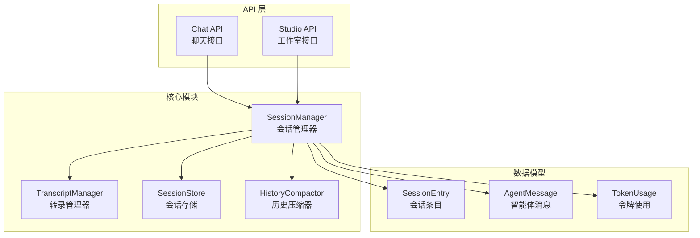
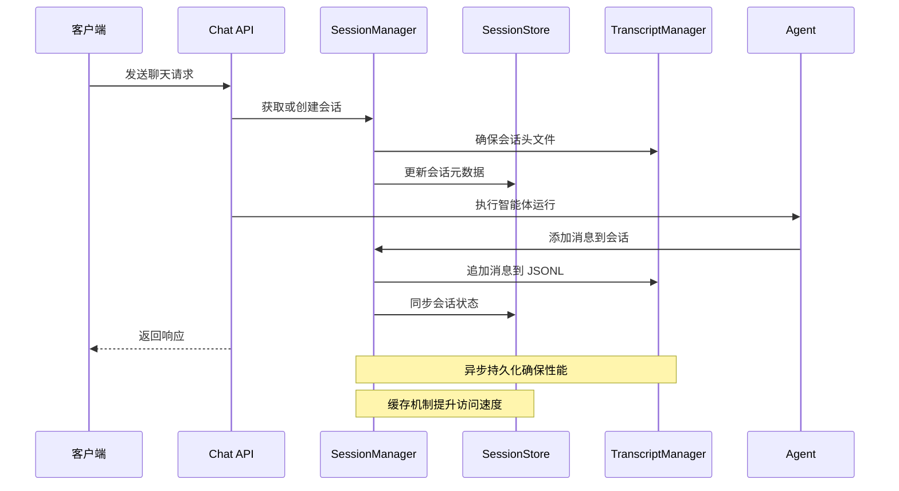
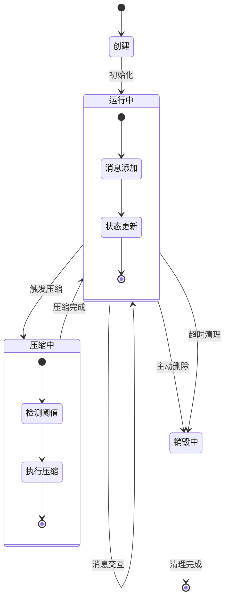
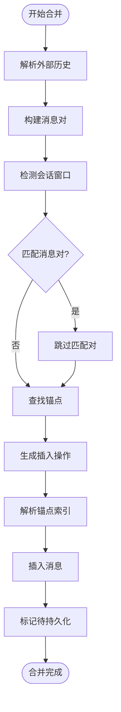
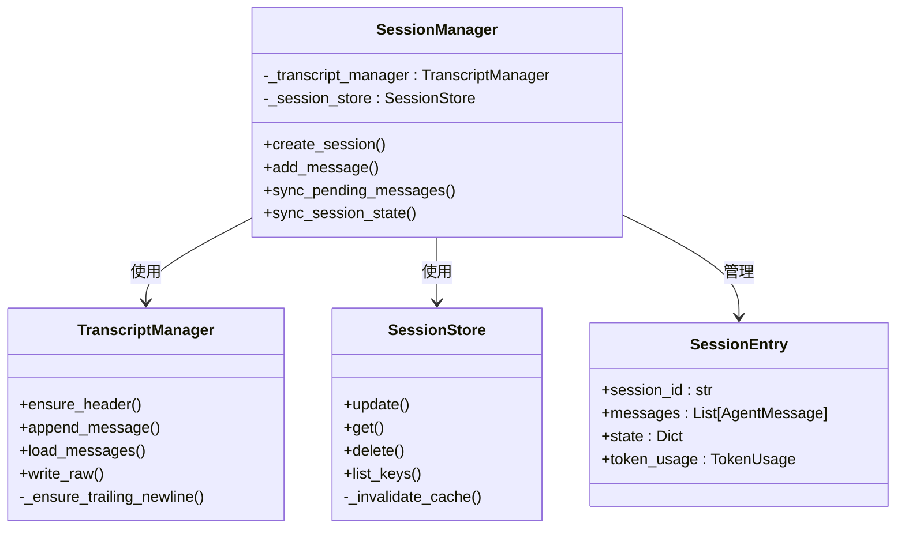
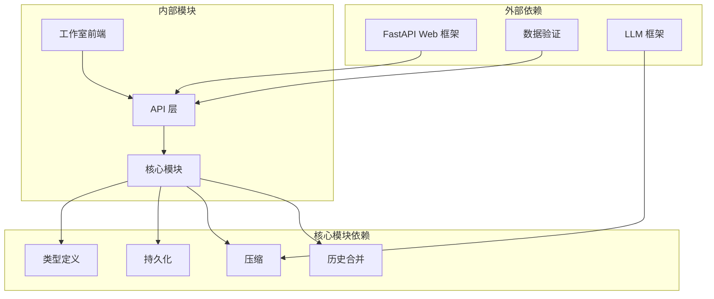

# 会话管理

<cite>
**本文档引用的文件**
- [session.py](file://src/ark_agentic/core/session.py)
- [persistence.py](file://src/ark_agentic/core/persistence.py)
- [history_merge.py](file://src/ark_agentic/core/history_merge.py)
- [types.py](file://src/ark_agentic/core/types.py)
- [chat.py](file://src/ark_agentic/api/chat.py)
- [sessions.py](file://src/ark_agentic/studio/api/sessions.py)
- [models.py](file://src/ark_agentic/api/models.py)
- [compaction.py](file://src/ark_agentic/core/compaction.py)
- [test_session.py](file://tests/unit/core/test_session.py)
- [test_persistence.py](file://tests/unit/core/test_persistence.py)
</cite>

## 目录
1. [简介](#简介)
2. [项目结构](#项目结构)
3. [核心组件](#核心组件)
4. [架构概览](#架构概览)
5. [详细组件分析](#详细组件分析)
6. [依赖分析](#依赖分析)
7. [性能考虑](#性能考虑)
8. [故障排除指南](#故障排除指南)
9. [结论](#结论)

## 简介

Ark-Agentic 会话管理系统是构建在 Ark-Agentic 框架中的核心组件，负责管理智能体与用户之间的对话交互。该系统提供了完整的会话生命周期管理、消息存储机制、历史合并策略和状态持久化功能。

本系统采用 JSONL（JSON Lines）格式存储会话数据，结合内存缓存机制，确保了高性能的会话管理能力。系统支持实时消息流式传输、上下文压缩、工具调用结果跟踪以及完整的会话状态管理。

## 项目结构

会话管理系统主要分布在以下核心模块中：



**图表来源**
- [session.py:24-482](file://src/ark_agentic/core/session.py#L24-L482)
- [persistence.py:392-787](file://src/ark_agentic/core/persistence.py#L392-L787)

**章节来源**
- [session.py:1-482](file://src/ark_agentic/core/session.py#L1-L482)
- [persistence.py:1-787](file://src/ark_agentic/core/persistence.py#L1-L787)

## 核心组件

### 会话管理器 (SessionManager)

会话管理器是系统的核心协调者，负责管理整个会话生命周期：

- **会话创建与销毁**：支持同步和异步两种创建模式
- **消息管理**：提供消息的添加、检索、清理功能
- **状态管理**：维护会话状态和令牌使用统计
- **上下文压缩**：自动检测和执行历史压缩
- **历史合并**：支持外部历史的智能合并

### 转录管理器 (TranscriptManager)

负责 JSONL 格式会话数据的持久化存储：

- **文件结构**：每个会话对应一个 .jsonl 文件
- **序列化机制**：支持消息、工具调用、工具结果的双向序列化
- **并发控制**：使用文件锁确保多进程安全
- **数据完整性**：提供校验和恢复机制

### 会话存储 (SessionStore)

管理会话元数据的内存缓存和持久化：

- **缓存策略**：基于 TTL 的智能缓存机制
- **文件锁**：跨平台文件锁定确保数据一致性
- **批量操作**：支持批量更新和删除操作

**章节来源**
- [session.py:24-482](file://src/ark_agentic/core/session.py#L24-L482)
- [persistence.py:392-787](file://src/ark_agentic/core/persistence.py#L392-L787)

## 架构概览

系统采用分层架构设计，确保各组件职责清晰、耦合度低：



**图表来源**
- [chat.py:27-177](file://src/ark_agentic/api/chat.py#L27-L177)
- [session.py:40-114](file://src/ark_agentic/core/session.py#L40-L114)

系统架构的关键特性：

1. **异步持久化**：消息添加到内存后异步写入磁盘
2. **智能缓存**：会话存储使用 TTL 缓存提升性能
3. **文件锁机制**：确保多进程环境下的数据一致性
4. **双向序列化**：支持复杂数据结构的完整序列化

## 详细组件分析

### 会话生命周期管理

会话生命周期包括创建、使用、更新和销毁四个阶段：



**图表来源**
- [session.py:40-114](file://src/ark_agentic/core/session.py#L40-L114)
- [compaction.py:450-517](file://src/ark_agentic/core/compaction.py#L450-L517)

#### 会话创建流程

会话创建支持两种模式：

1. **同步创建** (`create_session_sync`)
   - 仅创建内存会话对象
   - 不进行磁盘持久化
   - 适用于子任务继承场景

2. **异步创建** (`create_session`)
   - 创建内存会话对象
   - 确保会话头文件存在
   - 更新会话元数据存储
   - 完整的持久化流程

**章节来源**
- [session.py:40-92](file://src/ark_agentic/core/session.py#L40-L92)
- [session.py:103-122](file://src/ark_agentic/core/session.py#L103-L122)

### 消息存储机制

系统采用 JSONL 格式存储消息，确保数据的可读性和可解析性：

#### JSONL 文件结构

每个会话对应一个 .jsonl 文件，包含以下结构：

```mermaid
graph TB
Header[会话头文件<br/>{"type": "session", "version": 1, "id": "session_id"}]
Message1[第一条消息<br/>{"type": "message", "message": {...}, "timestamp": 1234567890}]
Message2[第二条消息<br/>{"type": "message", "message": {...}, "timestamp": 1234567900}]
MessageN[最后一条消息<br/>{"type": "message", "message": {...}, "timestamp": 1234568000}]
Header --> Message1
Message1 --> Message2
Message2 --> MessageN
```

**图表来源**
- [persistence.py:50-101](file://src/ark_agentic/core/persistence.py#L50-L101)
- [persistence.py:444-486](file://src/ark_agentic/core/persistence.py#L444-L486)

#### 消息序列化策略

系统支持多种消息类型的序列化：

| 消息类型 | 序列化字段 | 反序列化处理 |
|---------|-----------|-------------|
| 用户消息 | role, content | 基本内容解析 |
| 助手消息 | role, content, tool_calls, tool_results | 工具调用和结果解析 |
| 工具消息 | role, tool_results | 工具结果类型识别 |
| 思考消息 | role, thinking | 扩展思考内容 |

**章节来源**
- [persistence.py:189-258](file://src/ark_agentic/core/persistence.py#L189-L258)
- [types.py:199-238](file://src/ark_agentic/core/types.py#L199-L238)

### 历史合并策略

系统提供智能的历史合并功能，支持外部历史的无缝集成：



**图表来源**
- [history_merge.py:155-243](file://src/ark_agentic/core/history_merge.py#L155-L243)

#### 合并算法特点

1. **配对去重**：基于 (user, assistant) 消息对进行去重
2. **锚点定位**：使用时间戳作为锚点进行精确定位
3. **智能插入**：支持在锚点前或后插入消息
4. **兼容性处理**：支持不完整消息对的处理

**章节来源**
- [history_merge.py:155-243](file://src/ark_agentic/core/history_merge.py#L155-L243)

### 状态持久化机制

系统采用双重持久化策略确保数据可靠性：



**图表来源**
- [session.py:24-482](file://src/ark_agentic/core/session.py#L24-L482)
- [persistence.py:392-787](file://src/ark_agentic/core/persistence.py#L392-L787)

#### 持久化流程

1. **内存优先**：所有操作首先更新内存状态
2. **异步写入**：通过 `sync_pending_messages()` 异步写入磁盘
3. **状态同步**：通过 `sync_session_state()` 同步会话元数据
4. **错误处理**：提供完整的异常处理和回滚机制

**章节来源**
- [session.py:229-262](file://src/ark_agentic/core/session.py#L229-L262)
- [persistence.py:739-787](file://src/ark_agentic/core/persistence.py#L739-L787)

## 依赖分析

系统依赖关系清晰，各组件职责明确：



**图表来源**
- [chat.py:12-24](file://src/ark_agentic/api/chat.py#L12-L24)
- [sessions.py:13-22](file://src/ark_agentic/studio/api/sessions.py#L13-L22)

### 关键依赖关系

1. **类型系统**：所有组件共享统一的类型定义
2. **持久化层**：独立于业务逻辑的存储抽象
3. **压缩引擎**：可插拔的上下文压缩机制
4. **API 接口**：标准化的外部接口定义

**章节来源**
- [types.py:1-422](file://src/ark_agentic/core/types.py#L1-L422)
- [compaction.py:1-742](file://src/ark_agentic/core/compaction.py#L1-L742)

## 性能考虑

### 缓存策略

系统采用多层次缓存机制：

1. **会话存储缓存**：基于 TTL 的智能缓存，缺省 45 秒
2. **内存会话缓存**：完整的会话对象缓存
3. **文件锁缓存**：避免频繁的文件系统操作

### 异步处理

- **异步持久化**：消息添加立即返回，后台异步写入
- **批量操作**：支持批量消息追加和状态更新
- **并发控制**：文件锁确保多进程安全

### 上下文压缩

系统提供智能的上下文压缩功能：

- **触发阈值**：当使用率达到 80% 时触发压缩
- **分阶段摘要**：多阶段摘要生成，平衡质量和性能
- **保留最近消息**：确保最新交互的完整性

**章节来源**
- [persistence.py:709-717](file://src/ark_agentic/core/persistence.py#L709-L717)
- [compaction.py:450-517](file://src/ark_agentic/core/compaction.py#L450-L517)

## 故障排除指南

### 常见问题及解决方案

#### 会话创建失败

**症状**：会话创建过程中出现异常

**可能原因**：
1. 磁盘空间不足
2. 文件权限问题
3. 并发冲突

**解决方案**：
- 检查磁盘空间和权限
- 确认文件锁释放
- 重试操作或重启服务

#### 消息持久化异常

**症状**：消息添加成功但无法从磁盘读取

**可能原因**：
1. 文件损坏
2. 编码问题
3. 权限不足

**解决方案**：
- 检查文件完整性
- 验证 UTF-8 编码
- 修复文件权限

#### 历史合并失败

**症状**：外部历史合并不生效

**可能原因**：
1. 消息对不完整
2. 锚点时间戳不匹配
3. 内容重复检测失败

**解决方案**：
- 验证外部历史格式
- 检查时间戳精度
- 调整去重阈值

**章节来源**
- [test_session.py:225-266](file://tests/unit/core/test_session.py#L225-L266)
- [test_persistence.py:386-405](file://tests/unit/core/test_persistence.py#L386-L405)

## 结论

Ark-Agentic 会话管理系统通过精心设计的架构和实现，提供了高性能、可靠、易扩展的会话管理能力。系统的主要优势包括：

1. **高性能设计**：异步持久化和智能缓存确保了优秀的性能表现
2. **数据完整性**：文件锁和校验机制保证了数据的一致性和可靠性
3. **灵活扩展**：模块化设计支持功能的灵活扩展和定制
4. **易用性**：标准化的 API 和完善的文档降低了使用门槛

该系统为 Ark-Agentic 框架提供了坚实的会话管理基础，能够满足各种复杂的对话应用场景需求。