# 多 Provider 支持

<cite>
**本文档引用的文件**
- [src/ark_agentic/core/observability/providers/__init__.py](file://src/ark_agentic/core/observability/providers/__init__.py)
- [src/ark_agentic/core/observability/providers/console.py](file://src/ark_agentic/core/observability/providers/console.py)
- [src/ark_agentic/core/observability/providers/langfuse.py](file://src/ark_agentic/core/observability/providers/langfuse.py)
- [src/ark_agentic/core/observability/providers/otlp.py](file://src/ark_agentic/core/observability/providers/otlp.py)
- [src/ark_agentic/core/observability/providers/phoenix.py](file://src/ark_agentic/core/observability/providers/phoenix.py)
- [src/ark_agentic/core/observability/tracing.py](file://src/ark_agentic/core/observability/tracing.py)
- [.env-sample](file://.env-sample)
- [src/ark_agentic/core/llm/factory.py](file://src/ark_agentic/core/llm/factory.py)
- [src/ark_agentic/core/llm/pa_jt_llm.py](file://src/ark_agentic/core/llm/pa_jt_llm.py)
- [src/ark_agentic/core/llm/pa_sx_llm.py](file://src/ark_agentic/core/llm/pa_sx_llm.py)
- [src/ark_agentic/core/llm/sampling.py](file://src/ark_agentic/core/llm/sampling.py)
- [src/ark_agentic/core/tools/base.py](file://src/ark_agentic/core/tools/base.py)
- [src/ark_agentic/core/utils/env.py](file://src/ark_agentic/core/utils/env.py)
- [pyproject.toml](file://pyproject.toml)
</cite>

## 更新摘要
**变更内容**
- 更新了 langfuse 集成从独立 extras 迁移到统一追踪系统的说明
- 新增了统一追踪系统配置和依赖关系的详细说明
- 更新了环境变量配置和安装方式的相关内容
- 补充了新的依赖配置和安装命令

## 目录
1. [简介](#简介)
2. [项目结构](#项目结构)
3. [核心组件](#核心组件)
4. [架构概览](#架构概览)
5. [详细组件分析](#详细组件分析)
6. [依赖分析](#依赖分析)
7. [性能考虑](#性能考虑)
8. [故障排除指南](#故障排除指南)
9. [结论](#结论)

## 简介

本项目实现了完整的多 Provider 支持体系，主要体现在两个方面：

1. **可观测性多 Provider 支持**：通过统一的 TracingProvider 协议，支持 Phoenix、Langfuse、Console、OTLP 等多个监控后端的并行导出
2. **LLM 多 Provider 支持**：通过工厂模式支持 PA 内部模型和 OpenAI 兼容模型的统一管理

**更新** 项目现已采用统一的追踪系统配置，langfuse 集成不再作为独立的 extras，而是通过统一的 `ark-agentic[tracing]` 依赖进行管理。

这种设计提供了高度的灵活性和可扩展性，允许开发者根据需求选择合适的监控方案，并轻松添加新的 Provider。

## 项目结构

项目采用模块化的组织方式，核心的多 Provider 支持分布在以下关键目录：

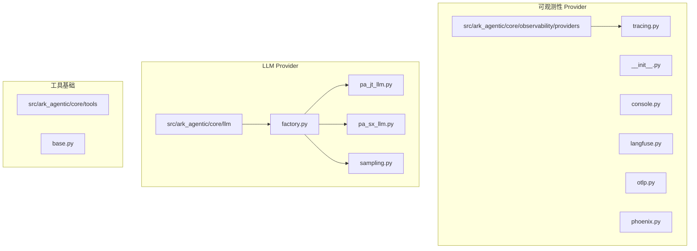

**图表来源**
- [src/ark_agentic/core/observability/providers/__init__.py:1-46](file://src/ark_agentic/core/observability/providers/__init__.py#L1-L46)
- [src/ark_agentic/core/llm/factory.py:1-275](file://src/ark_agentic/core/llm/factory.py#L1-L275)

**章节来源**
- [src/ark_agentic/core/observability/providers/__init__.py:1-46](file://src/ark_agentic/core/observability/providers/__init__.py#L1-L46)
- [src/ark_agentic/core/llm/factory.py:1-275](file://src/ark_agentic/core/llm/factory.py#L1-L275)

## 核心组件

### TracingProvider 协议

TracingProvider 是一个 Protocol 定义，确保所有 Provider 实现一致的接口：

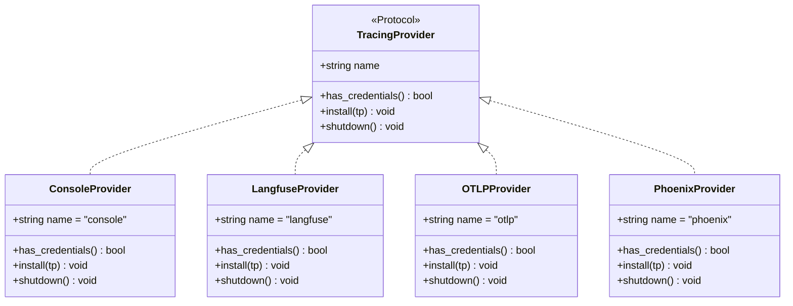

**图表来源**
- [src/ark_agentic/core/observability/providers/__init__.py:20-45](file://src/ark_agentic/core/observability/providers/__init__.py#L20-L45)

### LLM Provider 工厂

LLM 工厂模式支持多种模型提供商：

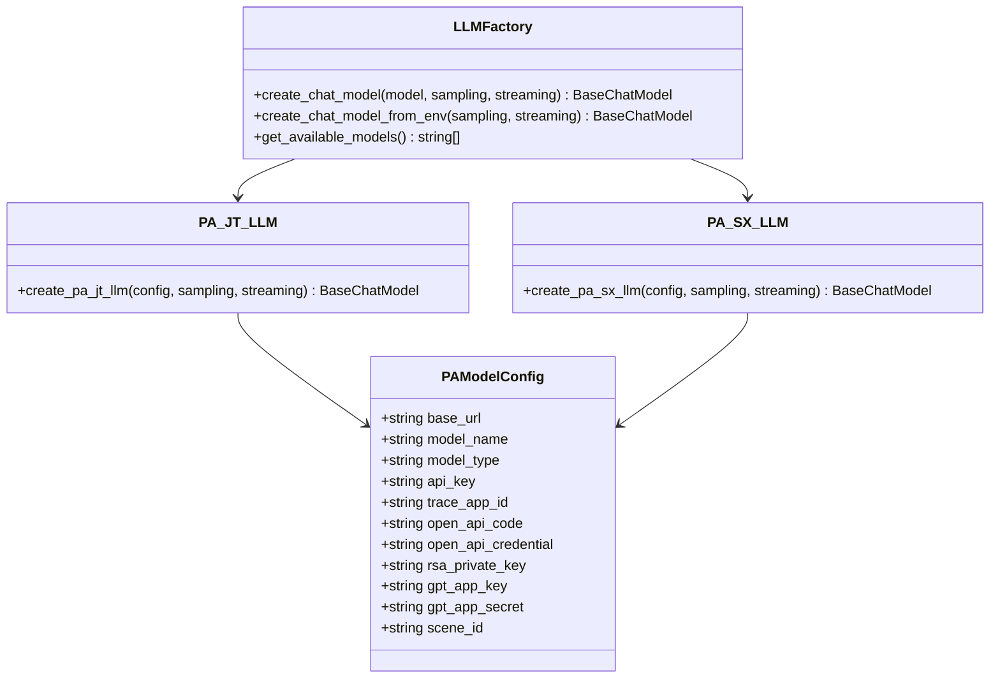

**图表来源**
- [src/ark_agentic/core/llm/factory.py:104-275](file://src/ark_agentic/core/llm/factory.py#L104-L275)
- [src/ark_agentic/core/llm/pa_jt_llm.py:125-166](file://src/ark_agentic/core/llm/pa_jt_llm.py#L125-L166)
- [src/ark_agentic/core/llm/pa_sx_llm.py:56-86](file://src/ark_agentic/core/llm/pa_sx_llm.py#L56-L86)

**章节来源**
- [src/ark_agentic/core/observability/providers/__init__.py:20-45](file://src/ark_agentic/core/observability/providers/__init__.py#L20-L45)
- [src/ark_agentic/core/llm/factory.py:104-275](file://src/ark_agentic/core/llm/factory.py#L104-L275)

## 架构概览

系统采用插件化的 Provider 架构，支持运行时动态配置和扩展：

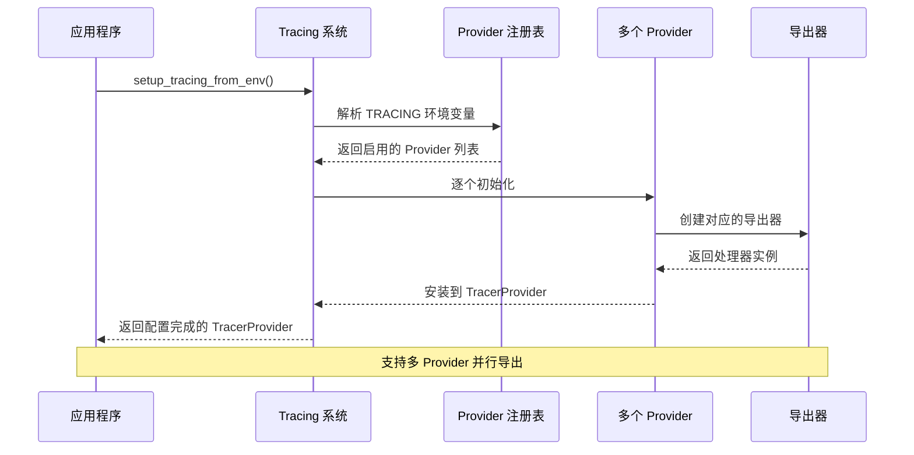

**图表来源**
- [src/ark_agentic/core/observability/tracing.py:56-99](file://src/ark_agentic/core/observability/tracing.py#L56-L99)
- [src/ark_agentic/core/observability/providers/__init__.py:30-35](file://src/ark_agentic/core/observability/providers/__init__.py#L30-L35)

## 详细组件分析

### 观察性 Provider 分析

#### Console Provider（控制台导出）

Console Provider 提供本地开发时的实时日志输出功能：

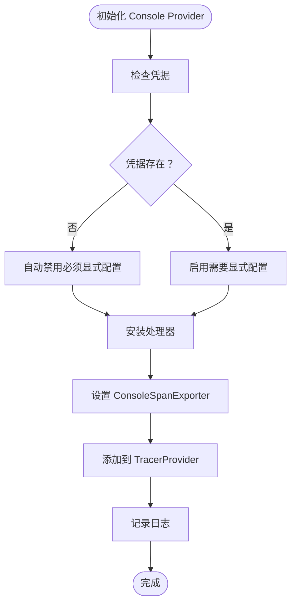

**图表来源**
- [src/ark_agentic/core/observability/providers/console.py:17-29](file://src/ark_agentic/core/observability/providers/console.py#L17-L29)

#### Langfuse Provider（Langfuse 云服务）

**更新** Langfuse Provider 现已集成到统一的追踪系统中，通过 `ark-agentic[tracing]` 依赖进行管理：

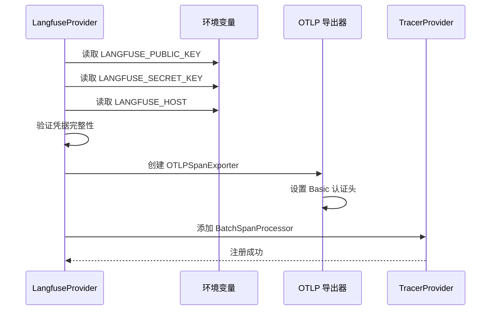

**图表来源**
- [src/ark_agentic/core/observability/providers/langfuse.py:19-42](file://src/ark_agentic/core/observability/providers/langfuse.py#L19-L42)

#### OTLP Provider（通用 OTLP 导出）

OTLP Provider 提供标准的 OpenTelemetry 协议支持：

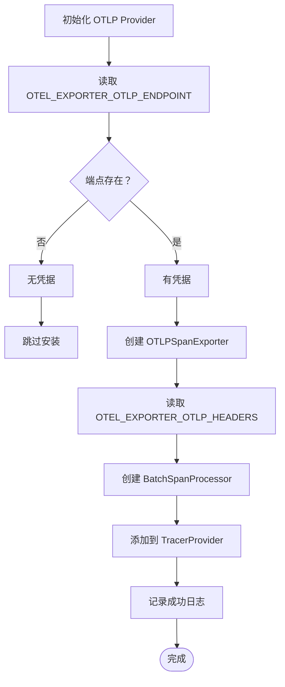

**图表来源**
- [src/ark_agentic/core/observability/providers/otlp.py:18-34](file://src/ark_agentic/core/observability/providers/otlp.py#L18-L34)

#### Phoenix Provider（本地收集器）

Phoenix Provider 专为本地开发环境设计：

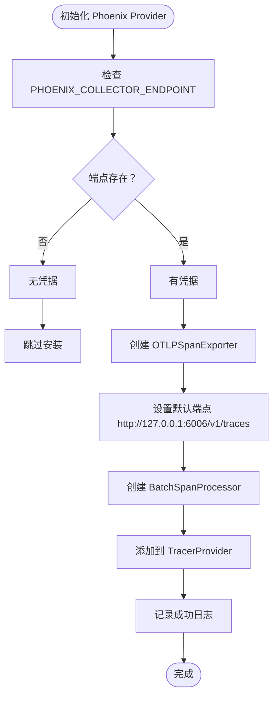

**图表来源**
- [src/ark_agentic/core/observability/providers/phoenix.py:18-34](file://src/ark_agentic/core/observability/providers/phoenix.py#L18-L34)

### LLM Provider 分析

#### PA-JT Provider（平安科技网关）

PA-JT Provider 实现了复杂的签名认证机制：

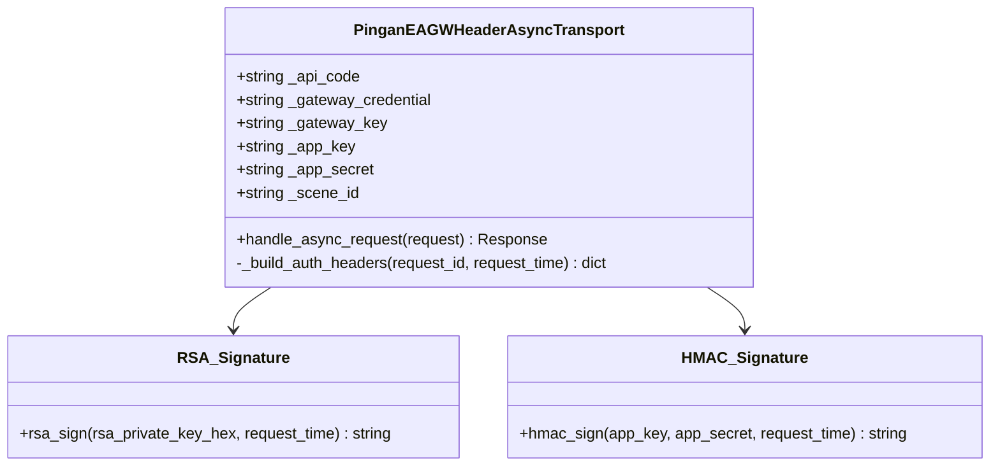

**图表来源**
- [src/ark_agentic/core/llm/pa_jt_llm.py:74-120](file://src/ark_agentic/core/llm/pa_jt_llm.py#L74-L120)

#### PA-SX Provider（平安SX传输）

PA-SX Provider 使用 trace 头部进行身份验证：

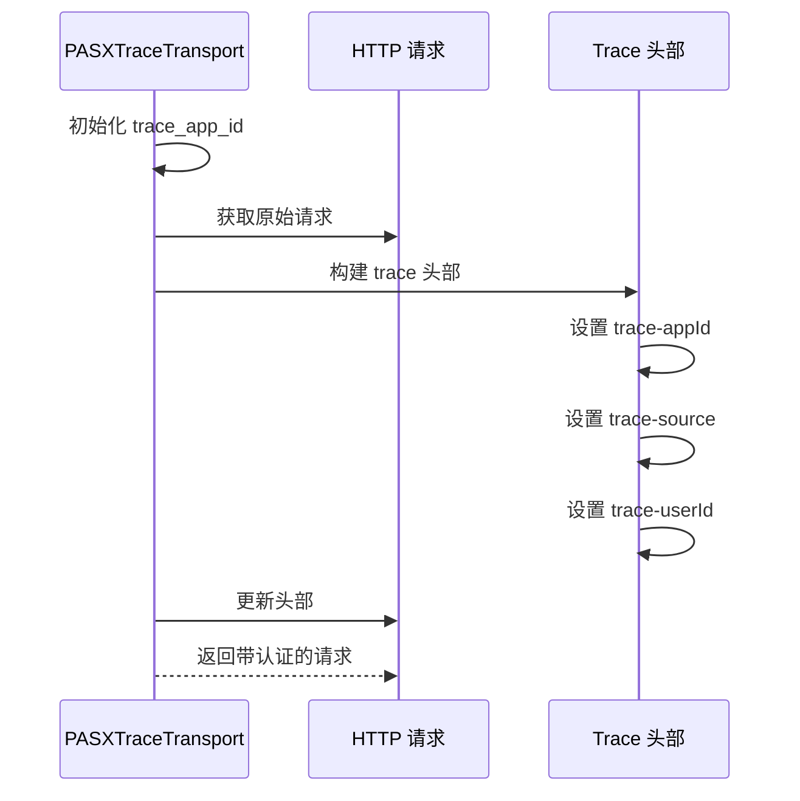

**图表来源**
- [src/ark_agentic/core/llm/pa_sx_llm.py:25-51](file://src/ark_agentic/core/llm/pa_sx_llm.py#L25-L51)

**章节来源**
- [src/ark_agentic/core/observability/providers/console.py:1-35](file://src/ark_agentic/core/observability/providers/console.py#L1-L35)
- [src/ark_agentic/core/observability/providers/langfuse.py:1-48](file://src/ark_agentic/core/observability/providers/langfuse.py#L1-L48)
- [src/ark_agentic/core/observability/providers/otlp.py:1-40](file://src/ark_agentic/core/observability/providers/otlp.py#L1-L40)
- [src/ark_agentic/core/observability/providers/phoenix.py:1-40](file://src/ark_agentic/core/observability/providers/phoenix.py#L1-L40)
- [src/ark_agentic/core/llm/pa_jt_llm.py:1-166](file://src/ark_agentic/core/llm/pa_jt_llm.py#L1-L166)
- [src/ark_agentic/core/llm/pa_sx_llm.py:1-86](file://src/ark_agentic/core/llm/pa_sx_llm.py#L1-L86)

## 依赖分析

**更新** 项目现在采用统一的追踪系统依赖配置：

系统采用松耦合的设计，通过协议和工厂模式实现依赖注入：

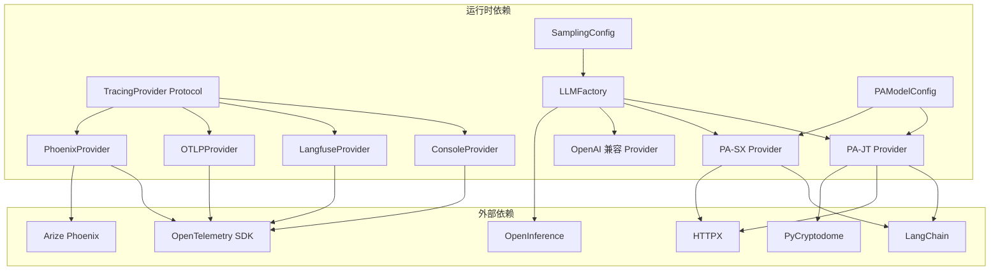

**图表来源**
- [src/ark_agentic/core/observability/providers/__init__.py:14-17](file://src/ark_agentic/core/observability/providers/__init__.py#L14-L17)
- [src/ark_agentic/core/llm/factory.py:149-157](file://src/ark_agentic/core/llm/factory.py#L149-L157)

**章节来源**
- [src/ark_agentic/core/observability/providers/__init__.py:14-17](file://src/ark_agentic/core/observability/providers/__init__.py#L14-L17)
- [src/ark_agentic/core/llm/factory.py:149-157](file://src/ark_agentic/core/llm/factory.py#L149-L157)

## 性能考虑

### Provider 选择策略

系统提供了多种 Provider 选择模式：

1. **单 Provider 模式**：`TRACING=console` 或 `TRACING=langfuse`
2. **多 Provider 模式**：`TRACING=phoenix,langfuse` 支持并行导出
3. **自动模式**：`TRACING=auto` 根据凭据自动启用可用的 Provider
4. **禁用模式**：未设置或为空字符串时完全禁用追踪

### 安装和配置更新

**更新** 由于 langfuse 集成已迁移到统一追踪系统，安装方式已简化：

- **统一安装**：`uv add 'ark-agentic[tracing]'` - 包含所有追踪相关的依赖
- **Phoenix 安装**：`uv add 'ark-agentic[phoenix]'` - 包含 Phoenix 特定的依赖
- **PA-JT 安装**：`uv add 'ark-agentic[pa-jt]'` - 包含 PA-JT 特定的加密依赖

### 性能优化建议

- **生产环境**：推荐使用 `TRACING=auto` 自动模式，避免不必要的网络开销
- **开发环境**：可以使用 `TRACING=console` 进行本地调试
- **混合部署**：对于关键应用，可以同时启用多个 Provider 确保监控可靠性

## 故障排除指南

### 常见问题及解决方案

#### Provider 无法启动

**症状**：Provider 报错无法安装
**原因**：缺少必要的环境变量或网络连接问题
**解决方案**：
1. 检查相应的环境变量是否正确设置
2. 验证网络连接和端点可达性
3. 查看应用日志获取详细错误信息

#### 多 Provider 冲突

**症状**：多个 Provider 同时导出导致数据重复
**原因**：配置了冲突的 Provider 组合
**解决方案**：
1. 检查 `TRACING` 环境变量配置
2. 移除不必要的 Provider，保持最小化配置
3. 确保每个 Provider 的凭据配置正确

#### 性能问题

**症状**：应用响应变慢
**原因**：过多的 Provider 或网络延迟
**解决方案**：
1. 减少启用的 Provider 数量
2. 优化网络连接
3. 调整批量导出大小和频率

#### 依赖安装问题

**更新** 由于依赖结构的变更，可能出现以下问题：

**症状**：安装失败或功能缺失
**原因**：旧的独立 extras 依赖已废弃
**解决方案**：
1. 升级到统一的追踪系统依赖
2. 使用新的安装命令：`uv add 'ark-agentic[tracing]'`
3. 确保所有必需的追踪依赖都已正确安装

**章节来源**
- [src/ark_agentic/core/observability/tracing.py:35-53](file://src/ark_agentic/core/observability/tracing.py#L35-L53)
- [src/ark_agentic/core/observability/tracing.py:102-114](file://src/ark_agentic/core/observability/tracing.py#L102-L114)

## 结论

**更新** 本项目通过精心设计的多 Provider 支持体系，为不同场景提供了灵活的监控和 LLM 服务选择。随着 langfuse 集成迁移到统一追踪系统，项目在依赖管理和配置复杂度方面得到了显著改善。

### 主要优势

1. **高度可扩展性**：通过 Protocol 和工厂模式，轻松添加新的 Provider
2. **运行时灵活性**：支持动态配置和多 Provider 并行导出
3. **环境友好**：针对不同环境提供最优的默认配置
4. **性能优化**：智能的凭据检测和自动模式减少不必要的开销
5. **简化依赖管理**：统一的追踪系统减少了依赖冲突的可能性

### 最佳实践

1. **开发环境**：使用 Console Provider 进行本地调试
2. **测试环境**：使用 Phoenix Provider 进行本地监控
3. **生产环境**：使用 Langfuse 或 OTLP Provider 进行云端监控
4. **混合部署**：结合多个 Provider 确保监控的可靠性
5. **依赖管理**：使用统一的追踪系统依赖，避免版本冲突

### 依赖配置最佳实践

**更新** 建议使用统一的追踪系统依赖配置：

- **完整功能**：`uv add 'ark-agentic[server,postgres,jobs,tracing,phoenix]'`
- **最小化配置**：`uv add 'ark-agentic[server,postgres,jobs]'` - 仅基础功能
- **自定义组合**：根据需要选择特定的 extras 组合

这种设计不仅满足了当前的功能需求，还为未来的扩展奠定了坚实的基础，使得系统能够适应不断变化的技术要求和业务场景。统一的追踪系统配置进一步简化了部署和维护工作，提高了系统的整体稳定性。