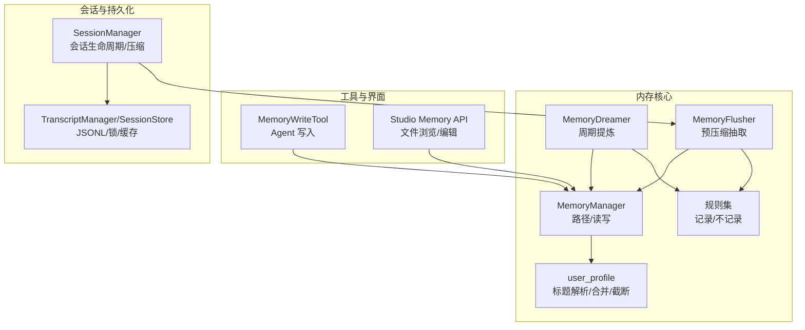
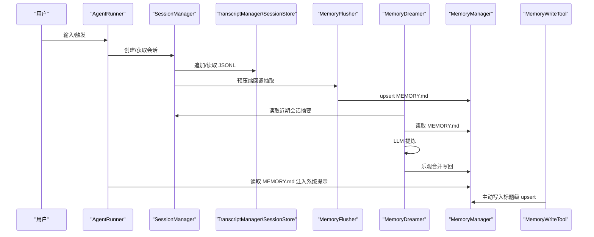
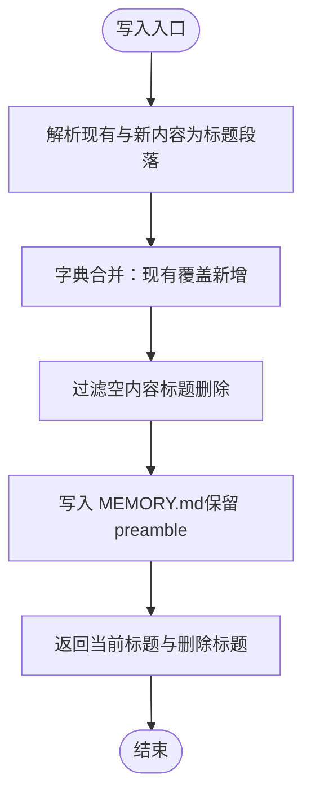
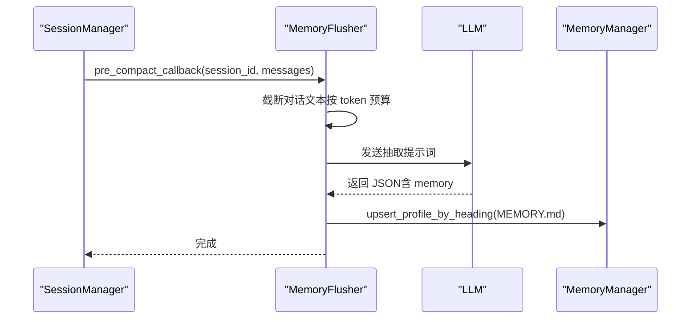
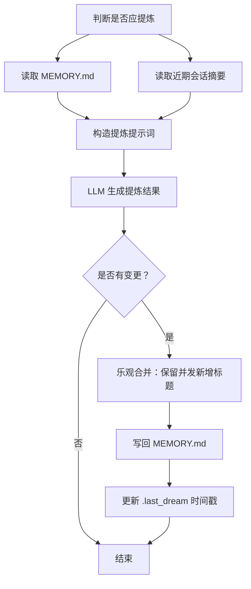
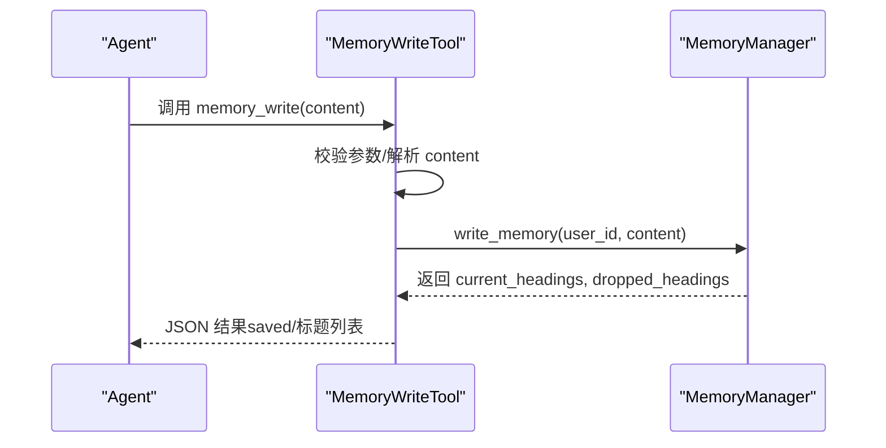
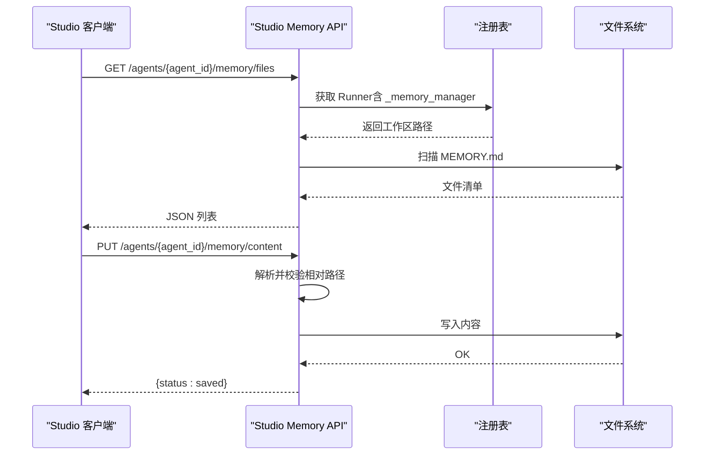
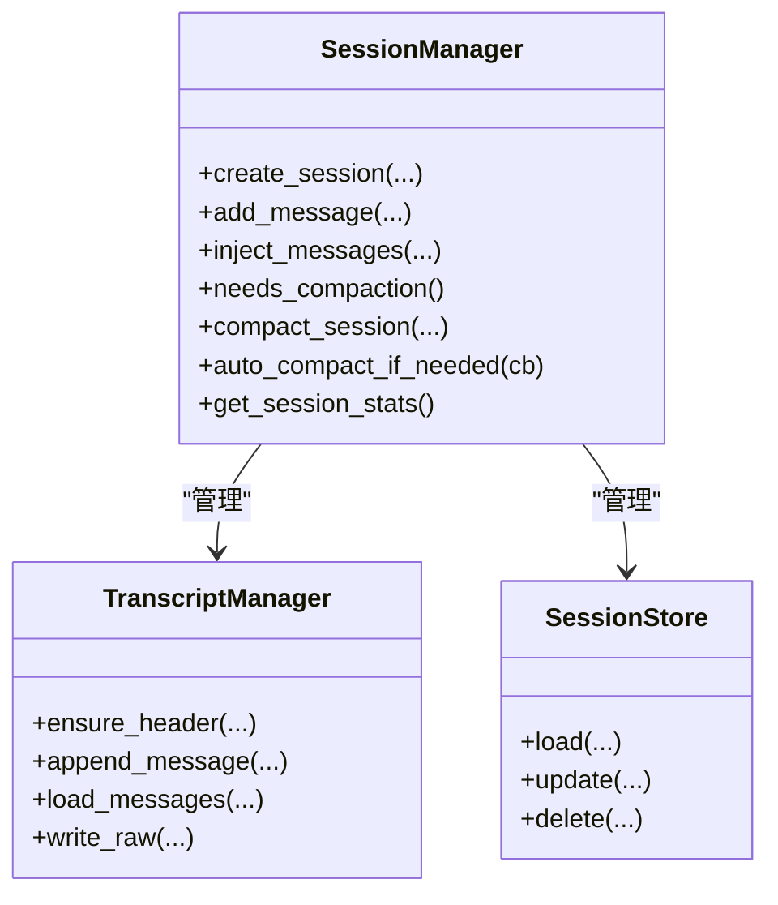
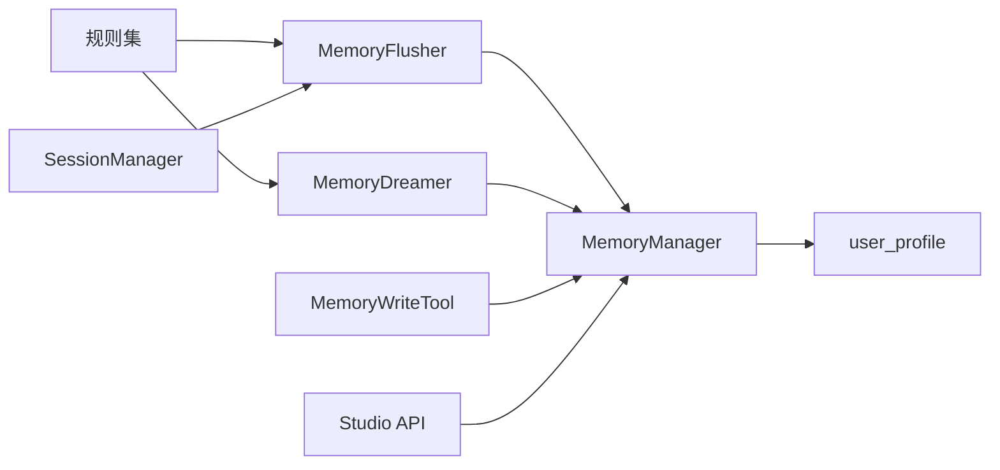

# 内存工具

<cite>
**本文档引用的文件**
- [src/ark_agentic/core/memory/__init__.py](file://src/ark_agentic/core/memory/__init__.py)
- [src/ark_agentic/core/memory/manager.py](file://src/ark_agentic/core/memory/manager.py)
- [src/ark_agentic/core/memory/dream.py](file://src/ark_agentic/core/memory/dream.py)
- [src/ark_agentic/core/memory/extractor.py](file://src/ark_agentic/core/memory/extractor.py)
- [src/ark_agentic/core/memory/user_profile.py](file://src/ark_agentic/core/memory/user_profile.py)
- [src/ark_agentic/core/memory/rules.py](file://src/ark_agentic/core/memory/rules.py)
- [src/ark_agentic/core/tools/memory.py](file://src/ark_agentic/core/tools/memory.py)
- [src/ark_agentic/studio/api/memory.py](file://src/ark_agentic/studio/api/memory.py)
- [src/ark_agentic/core/session.py](file://src/ark_agentic/core/session.py)
- [src/ark_agentic/core/persistence.py](file://src/ark_agentic/core/persistence.py)
- [tests/unit/core/test_memory_tools.py](file://tests/unit/core/test_memory_tools.py)
- [tests/unit/core/test_memory_unified.py](file://tests/unit/core/test_memory_unified.py)
- [tests/e2e/test_memory_e2e.py](file://tests/e2e/test_memory_e2e.py)
</cite>

## 目录
1. [简介](#简介)
2. [项目结构](#项目结构)
3. [核心组件](#核心组件)
4. [架构总览](#架构总览)
5. [详细组件分析](#详细组件分析)
6. [依赖关系分析](#依赖关系分析)
7. [性能考量](#性能考量)
8. [故障排查指南](#故障排查指南)
9. [结论](#结论)
10. [附录](#附录)

## 简介
本文件面向 Ark-Agentic 的内存工具体系，系统阐述其设计理念、会话状态管理、长期记忆存储与短期记忆处理流程，以及与智能体执行系统的协作方式。内存工具采用“单一文件、标题级 upsert”的极简模型：会话 JSONL（原始）→ MEMORY.md（提炼）→ 系统提示词（消费）。通过 MemoryManager、MemoryFlusher、MemoryDreamer、MemoryWriteTool 与 Studio API，实现从上下文压缩前的记忆抽取、周期性记忆提炼、用户主动写入与可视化管理的闭环。

## 项目结构
围绕内存工具的关键模块分布如下：
- 核心内存模块：manager、dream、extractor、user_profile、rules
- 工具层：tools/memory（Agent 写入工具）
- Studio API：studio/api/memory（文件列表、内容读写）
- 会话与持久化：core/session、core/persistence（JSONL 转录、锁与缓存）

图表来源
- [src/ark_agentic/core/memory/manager.py:24-92](file://src/ark_agentic/core/memory/manager.py#L24-L92)
- [src/ark_agentic/core/memory/dream.py:190-323](file://src/ark_agentic/core/memory/dream.py#L190-L323)
- [src/ark_agentic/core/memory/extractor.py:98-187](file://src/ark_agentic/core/memory/extractor.py#L98-L187)
- [src/ark_agentic/core/memory/user_profile.py:26-138](file://src/ark_agentic/core/memory/user_profile.py#L26-L138)
- [src/ark_agentic/core/memory/rules.py:7-32](file://src/ark_agentic/core/memory/rules.py#L7-L32)
- [src/ark_agentic/core/tools/memory.py:39-114](file://src/ark_agentic/core/tools/memory.py#L39-L114)
- [src/ark_agentic/studio/api/memory.py:105-160](file://src/ark_agentic/studio/api/memory.py#L105-L160)
- [src/ark_agentic/core/session.py:24-482](file://src/ark_agentic/core/session.py#L24-L482)
- [src/ark_agentic/core/persistence.py:392-787](file://src/ark_agentic/core/persistence.py#L392-L787)

章节来源
- [src/ark_agentic/core/memory/__init__.py:1-12](file://src/ark_agentic/core/memory/__init__.py#L1-L12)
- [src/ark_agentic/core/memory/manager.py:24-92](file://src/ark_agentic/core/memory/manager.py#L24-L92)
- [src/ark_agentic/core/memory/dream.py:190-323](file://src/ark_agentic/core/memory/dream.py#L190-L323)
- [src/ark_agentic/core/memory/extractor.py:98-187](file://src/ark_agentic/core/memory/extractor.py#L98-L187)
- [src/ark_agentic/core/memory/user_profile.py:26-138](file://src/ark_agentic/core/memory/user_profile.py#L26-L138)
- [src/ark_agentic/core/memory/rules.py:7-32](file://src/ark_agentic/core/memory/rules.py#L7-L32)
- [src/ark_agentic/core/tools/memory.py:39-114](file://src/ark_agentic/core/tools/memory.py#L39-L114)
- [src/ark_agentic/studio/api/memory.py:105-160](file://src/ark_agentic/studio/api/memory.py#L105-L160)
- [src/ark_agentic/core/session.py:24-482](file://src/ark_agentic/core/session.py#L24-L482)
- [src/ark_agentic/core/persistence.py:392-787](file://src/ark_agentic/core/persistence.py#L392-L787)

## 核心组件
- MemoryManager：提供工作区路径管理与 MEMORY.md 的读写封装，支持 heading-level upsert，返回当前标题与被删除标题集合。
- MemoryFlusher：在上下文压缩前，调用 LLM 从完整对话历史中抽取需要长期保存的信息，写入用户 MEMORY.md。
- MemoryDreamer：周期性地读取近期会话摘要与当前 MEMORY.md，经 LLM 提炼后进行乐观合并写回，保留并发写入的新增标题。
- MemoryWriteTool：Agent 主动写入工具，接收标题级 markdown 片段，执行同名覆盖、空内容删除、并发安全 upsert。
- Studio Memory API：提供内存文件扫描、内容读取与编辑能力，支持相对路径解析与越权防护。
- 规则集（rules）：统一“记录/不记录”标准，定义标题优先级，指导抽取与提炼。
- 用户画像工具（user_profile）：解析/格式化 heading-based markdown，执行 upsert 与按优先级截断。

章节来源
- [src/ark_agentic/core/memory/manager.py:24-92](file://src/ark_agentic/core/memory/manager.py#L24-L92)
- [src/ark_agentic/core/memory/extractor.py:98-187](file://src/ark_agentic/core/memory/extractor.py#L98-L187)
- [src/ark_agentic/core/memory/dream.py:190-323](file://src/ark_agentic/core/memory/dream.py#L190-L323)
- [src/ark_agentic/core/tools/memory.py:39-114](file://src/ark_agentic/core/tools/memory.py#L39-L114)
- [src/ark_agentic/studio/api/memory.py:105-160](file://src/ark_agentic/studio/api/memory.py#L105-L160)
- [src/ark_agentic/core/memory/rules.py:7-32](file://src/ark_agentic/core/memory/rules.py#L7-L32)
- [src/ark_agentic/core/memory/user_profile.py:26-138](file://src/ark_agentic/core/memory/user_profile.py#L26-L138)

## 架构总览
内存工具链路遵循“原始会话 → 长期记忆 → 系统提示”的生命周期：SessionManager 负责会话与压缩；MemoryFlusher 在压缩前抽取；MemoryDreamer 周期性提炼；MemoryManager 统一写入与读取；Studio API 支持可视化管理；规则集贯穿抽取与提炼。

图表来源
- [src/ark_agentic/core/session.py:383-431](file://src/ark_agentic/core/session.py#L383-L431)
- [src/ark_agentic/core/memory/extractor.py:152-187](file://src/ark_agentic/core/memory/extractor.py#L152-L187)
- [src/ark_agentic/core/memory/dream.py:289-323](file://src/ark_agentic/core/memory/dream.py#L289-L323)
- [src/ark_agentic/core/memory/manager.py:41-69](file://src/ark_agentic/core/memory/manager.py#L41-L69)
- [src/ark_agentic/core/tools/memory.py:67-108](file://src/ark_agentic/core/tools/memory.py#L67-L108)

## 详细组件分析

### MemoryManager：单一文件的长期记忆中心
- 职责
  - 按 user_id 定位 {workspace}/{user_id}/MEMORY.md
  - 提供 read/write 便捷方法
  - 作为 runner、tools、extractor 的统一依赖入口
- 写入语义
  - heading-level upsert：同名标题覆盖，新增标题追加
  - 空内容标题表示删除（body 为空）
  - 返回当前标题集合与被删除标题集合
- 并发与清理
  - 通过 heading 解析/合并保证幂等
  - 提示遗留 SQLite 索引目录（不再使用）可删除

图表来源
- [src/ark_agentic/core/memory/manager.py:45-69](file://src/ark_agentic/core/memory/manager.py#L45-L69)
- [src/ark_agentic/core/memory/user_profile.py:66-94](file://src/ark_agentic/core/memory/user_profile.py#L66-L94)

章节来源
- [src/ark_agentic/core/memory/manager.py:24-92](file://src/ark_agentic/core/memory/manager.py#L24-L92)
- [src/ark_agentic/core/memory/user_profile.py:26-138](file://src/ark_agentic/core/memory/user_profile.py#L26-L138)

### MemoryFlusher：预压缩记忆抽取
- 触发时机
  - SessionManager.auto_compact_if_needed 前置回调
- 流程
  - 限制对话文本长度（估算 token 后截断）
  - 构造抽取提示词，调用 LLM 返回 JSON
  - 解析 JSON，若包含 memory 字段则 upsert 写入 MEMORY.md
- 与规则集协同
  - 统一“记录/不记录”标准，避免短期信息进入长期记忆

图表来源
- [src/ark_agentic/core/memory/extractor.py:152-187](file://src/ark_agentic/core/memory/extractor.py#L152-L187)
- [src/ark_agentic/core/memory/extractor.py:108-144](file://src/ark_agentic/core/memory/extractor.py#L108-L144)
- [src/ark_agentic/core/session.py:415-431](file://src/ark_agentic/core/session.py#L415-L431)

章节来源
- [src/ark_agentic/core/memory/extractor.py:98-187](file://src/ark_agentic/core/memory/extractor.py#L98-L187)
- [src/ark_agentic/core/session.py:415-431](file://src/ark_agentic/core/session.py#L415-L431)

### MemoryDreamer：周期性记忆提炼
- 触发条件
  - 至少间隔 min_hours 或近期会话数达到 min_sessions
- 流程
  - 读取上次提炼时间戳，限定回溯范围
  - 读取近期会话摘要（用户+助理文本）
  - LLM 对 MEMORY.md 与会话摘要进行合并/删除/提取
  - 乐观合并写回：保留提炼窗口内并发新增的标题
  - 更新 .last_dream 时间戳
- 容量与优先级
  - 目标上限 2000 tokens，按优先级保留（身份信息 > 活跃偏好 > 持久业务偏好 > 风险偏好）

图表来源
- [src/ark_agentic/core/memory/dream.py:147-176](file://src/ark_agentic/core/memory/dream.py#L147-L176)
- [src/ark_agentic/core/memory/dream.py:289-323](file://src/ark_agentic/core/memory/dream.py#L289-L323)

章节来源
- [src/ark_agentic/core/memory/dream.py:147-323](file://src/ark_agentic/core/memory/dream.py#L147-L323)

### MemoryWriteTool：Agent 主动写入
- 参数与语义
  - content：标题级 markdown 片段（## 标题 + 内容）
  - 同名覆盖；空内容删除；多标题一次写入
- 上下文要求
  - 需包含 user:id，否则报错
- 结果反馈
  - saved、current_headings、dropped_headings（如有）

图表来源
- [src/ark_agentic/core/tools/memory.py:67-108](file://src/ark_agentic/core/tools/memory.py#L67-L108)
- [src/ark_agentic/core/memory/manager.py:45-69](file://src/ark_agentic/core/memory/manager.py#L45-L69)

章节来源
- [src/ark_agentic/core/tools/memory.py:39-114](file://src/ark_agentic/core/tools/memory.py#L39-L114)
- [tests/unit/core/test_memory_tools.py:28-171](file://tests/unit/core/test_memory_tools.py#L28-L171)

### Studio Memory API：可视化与编辑
- 能力
  - 列举工作区内可发现的 MEMORY.md（含全局与用户级）
  - 读取/写入指定内存文件（带路径遍历保护）
- 安全
  - 相对路径解析并校验越权
  - 未启用内存或代理不存在时返回相应错误

图表来源
- [src/ark_agentic/studio/api/memory.py:105-160](file://src/ark_agentic/studio/api/memory.py#L105-L160)

章节来源
- [src/ark_agentic/studio/api/memory.py:105-160](file://src/ark_agentic/studio/api/memory.py#L105-L160)

### 会话状态管理与历史注入
- SessionManager
  - 生命周期：创建/加载/删除/同步状态
  - 消息管理：追加/注入外部历史、清空、统计 token
  - 上下文压缩：按配置触发，支持预压缩回调（抽取记忆）
- TranscriptManager/SessionStore
  - JSONL 转录与锁机制（跨平台文件锁）
  - per-user sessions.json 元数据缓存与持久化
- 历史注入与系统提示
  - 通过 MEMORY.md 内容注入系统提示，确保上下文连贯

图表来源
- [src/ark_agentic/core/session.py:24-482](file://src/ark_agentic/core/session.py#L24-L482)
- [src/ark_agentic/core/persistence.py:392-787](file://src/ark_agentic/core/persistence.py#L392-L787)

章节来源
- [src/ark_agentic/core/session.py:24-482](file://src/ark_agentic/core/session.py#L24-L482)
- [src/ark_agentic/core/persistence.py:392-787](file://src/ark_agentic/core/persistence.py#L392-L787)

## 依赖关系分析
- 组件耦合
  - MemoryManager 与 user_profile 紧密协作（标题解析/合并/截断）
  - MemoryFlusher 与 MemoryDreamer 共用规则集，确保抽取/提炼一致性
  - SessionManager 与 MemoryFlusher 通过回调集成，形成“压缩前抽取”的流水线
  - Studio API 依赖注册表获取 Runner 的 MemoryManager 配置
- 外部依赖
  - LLM 调用（异步），用于抽取与提炼
  - 文件系统（JSONL/Markdown），受跨平台文件锁保护

图表来源
- [src/ark_agentic/core/memory/rules.py:7-32](file://src/ark_agentic/core/memory/rules.py#L7-L32)
- [src/ark_agentic/core/memory/extractor.py:98-187](file://src/ark_agentic/core/memory/extractor.py#L98-L187)
- [src/ark_agentic/core/memory/dream.py:190-323](file://src/ark_agentic/core/memory/dream.py#L190-L323)
- [src/ark_agentic/core/memory/manager.py:24-92](file://src/ark_agentic/core/memory/manager.py#L24-L92)
- [src/ark_agentic/core/tools/memory.py:39-114](file://src/ark_agentic/core/tools/memory.py#L39-L114)
- [src/ark_agentic/studio/api/memory.py:105-160](file://src/ark_agentic/studio/api/memory.py#L105-L160)

章节来源
- [src/ark_agentic/core/memory/rules.py:7-32](file://src/ark_agentic/core/memory/rules.py#L7-L32)
- [src/ark_agentic/core/memory/extractor.py:98-187](file://src/ark_agentic/core/memory/extractor.py#L98-L187)
- [src/ark_agentic/core/memory/dream.py:190-323](file://src/ark_agentic/core/memory/dream.py#L190-L323)
- [src/ark_agentic/core/memory/manager.py:24-92](file://src/ark_agentic/core/memory/manager.py#L24-L92)
- [src/ark_agentic/core/tools/memory.py:39-114](file://src/ark_agentic/core/tools/memory.py#L39-L114)
- [src/ark_agentic/studio/api/memory.py:105-160](file://src/ark_agentic/studio/api/memory.py#L105-L160)

## 性能考量
- Token 预算与截断
  - 抽取前对话文本按 6000 tokens 截断，避免 LLM 输入超限
  - 提炼阶段目标 2000 tokens，按优先级保留关键标题
- 压缩与持久化
  - SessionManager 在需要时触发压缩，减少 token 使用
  - JSONL 写入使用跨平台文件锁，保障并发安全
- 缓存与 I/O
  - per-user sessions.json 使用 TTL 缓存（默认 45 秒），降低频繁读取开销
- 写入幂等与并发
  - heading-level upsert 保证多次写入的一致性
  - 提炼阶段乐观合并，避免丢失并发期间新增标题

章节来源
- [src/ark_agentic/core/memory/extractor.py:28-120](file://src/ark_agentic/core/memory/extractor.py#L28-L120)
- [src/ark_agentic/core/memory/dream.py:54-66](file://src/ark_agentic/core/memory/dream.py#L54-L66)
- [src/ark_agentic/core/persistence.py:709-717](file://src/ark_agentic/core/persistence.py#L709-L717)
- [src/ark_agentic/core/session.py:383-431](file://src/ark_agentic/core/session.py#L383-L431)

## 故障排查指南
- 写入失败
  - 检查 content 是否包含标题（##）；空内容将被拒绝
  - 确认上下文包含 user:id；缺失将导致初始化失败
  - 查看返回的 current_headings 与 dropped_headings，确认标题是否正确更新
- 内存文件不可见
  - Studio API 返回空列表：确认工作区路径与权限
  - 路径越权：检查相对路径解析逻辑
- 提炼未生效
  - 检查 .last_dream 时间戳与会话数量/时间阈值
  - 确认 MEMORY.md 存在且非空；必要时手动写入初始内容
- 并发冲突
  - 提炼窗口内并发写入的标题会被保留（乐观合并）
  - 若出现异常，检查 .bak 备份是否存在

章节来源
- [src/ark_agentic/core/tools/memory.py:67-108](file://src/ark_agentic/core/tools/memory.py#L67-L108)
- [src/ark_agentic/studio/api/memory.py:125-160](file://src/ark_agentic/studio/api/memory.py#L125-L160)
- [src/ark_agentic/core/memory/dream.py:236-288](file://src/ark_agentic/core/memory/dream.py#L236-L288)
- [tests/e2e/test_memory_e2e.py:164-260](file://tests/e2e/test_memory_e2e.py#L164-L260)

## 结论
Ark-Agentic 的内存工具以“单一文件、标题级 upsert”为核心，结合预压缩抽取与周期性提炼，实现了从短期会话到长期记忆的稳健转换。通过规则集统一“记录/不记录”，配合并发安全的 upsert 与乐观合并，既保证了信息质量，也兼顾了性能与可靠性。与智能体执行系统的深度集成使得 MEMORY.md 能持续注入系统提示，支撑上下文连贯的历史对话管理。

## 附录

### API 接口定义（Studio Memory API）
- 列举内存文件
  - 方法：GET
  - 路径：/agents/{agent_id}/memory/files
  - 返回：文件清单（包含 user_id、路径、大小、修改时间）
- 读取内存内容
  - 方法：GET
  - 路径：/agents/{agent_id}/memory/content?file_path=...&user_id=...
  - 返回：纯文本内容
- 编辑内存内容
  - 方法：PUT
  - 路径：/agents/{agent_id}/memory/content?file_path=...&user_id=...
  - 请求体：纯文本
  - 返回：{"status": "saved"}

章节来源
- [src/ark_agentic/studio/api/memory.py:105-160](file://src/ark_agentic/studio/api/memory.py#L105-L160)

### 数据持久化策略
- 会话转录：JSONL（逐条消息，带时间戳与工具调用/结果）
- 元数据：per-user sessions.json（TTL 缓存 + 文件锁）
- 长期记忆：{workspace}/{user_id}/MEMORY.md（heading-based markdown）

章节来源
- [src/ark_agentic/core/persistence.py:392-787](file://src/ark_agentic/core/persistence.py#L392-L787)
- [src/ark_agentic/core/memory/manager.py:37-43](file://src/ark_agentic/core/memory/manager.py#L37-L43)

### 缓存机制
- SessionStore：每用户 sessions.json 缓存，默认 TTL 45 秒
- 作用：减少频繁读取，提升加载/更新性能

章节来源
- [src/ark_agentic/core/persistence.py:709-717](file://src/ark_agentic/core/persistence.py#L709-L717)

### 并发访问控制
- 文件锁：跨平台文件锁（Windows/Unix），支持过期检测与清理
- 写入原子性：JSONL 追加写入前确保尾部换行，避免损坏
- 乐观合并：MemoryDreamer 在提炼窗口内保留并发新增标题

章节来源
- [src/ark_agentic/core/persistence.py:264-387](file://src/ark_agentic/core/persistence.py#L264-L387)
- [src/ark_agentic/core/memory/dream.py:236-288](file://src/ark_agentic/core/memory/dream.py#L236-L288)

### 配置选项与最佳实践
- MemoryManager
  - workspace_dir：工作区根目录（默认临时目录，可通过构建函数传入）
- MemoryFlusher
  - 对话文本最大 token 预算：6000（自动截断）
- MemoryDreamer
  - 触发阈值：最少小时数与最少会话数（可调）
  - 提炼目标：2000 tokens，按优先级保留
- SessionManager
  - 压缩配置：context_window、preserve_recent 等
- 最佳实践
  - 使用标题级 upsert，避免重复与冲突
  - 在压缩前抽取关键偏好与业务偏好
  - 定期检查 .last_dream 与 MEMORY.md 大小，防止膨胀

章节来源
- [src/ark_agentic/core/memory/manager.py:72-82](file://src/ark_agentic/core/memory/manager.py#L72-L82)
- [src/ark_agentic/core/memory/extractor.py:28-120](file://src/ark_agentic/core/memory/extractor.py#L28-L120)
- [src/ark_agentic/core/memory/dream.py:147-176](file://src/ark_agentic/core/memory/dream.py#L147-L176)
- [src/ark_agentic/core/session.py:26-36](file://src/ark_agentic/core/session.py#L26-L36)

### 端到端验证要点
- 预压缩抽取：压缩前触发 flush，写入 MEMORY.md
- 系统提示注入：MEMORY.md 内容出现在系统提示中
- 主动写入：Agent 调用 memory_write，内容持久化

章节来源
- [tests/e2e/test_memory_e2e.py:100-260](file://tests/e2e/test_memory_e2e.py#L100-L260)
- [tests/unit/core/test_memory_tools.py:28-171](file://tests/unit/core/test_memory_tools.py#L28-L171)
- [tests/unit/core/test_memory_unified.py:35-160](file://tests/unit/core/test_memory_unified.py#L35-L160)