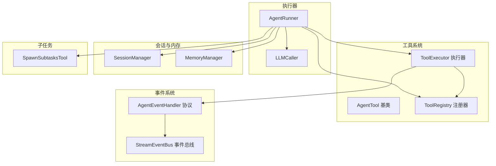
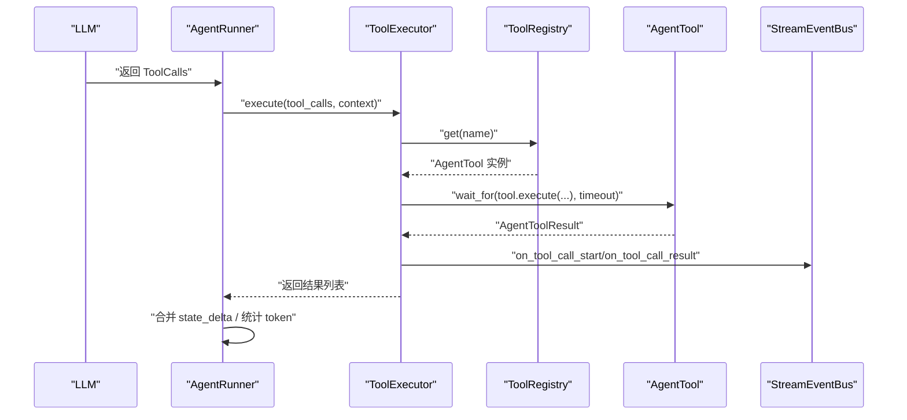
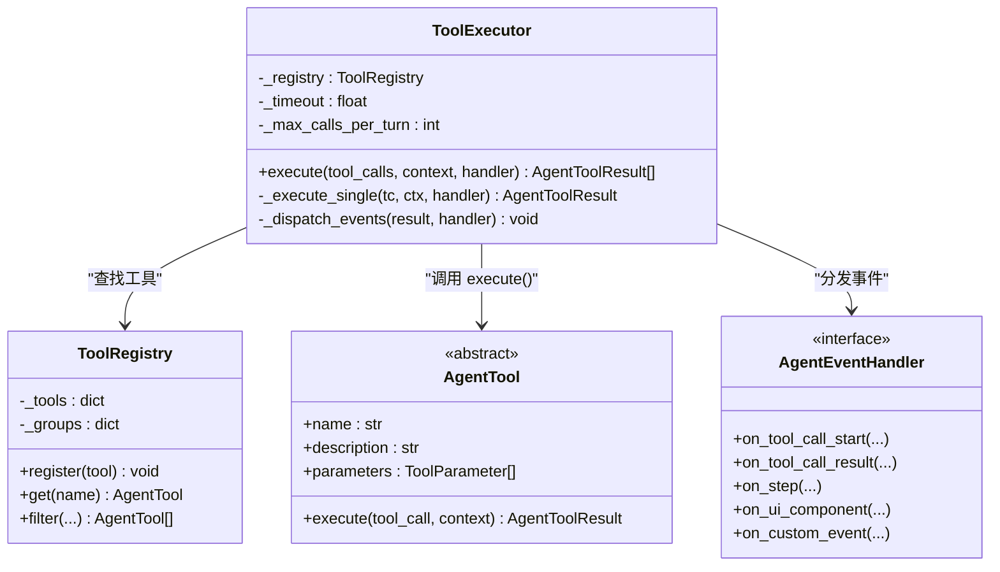
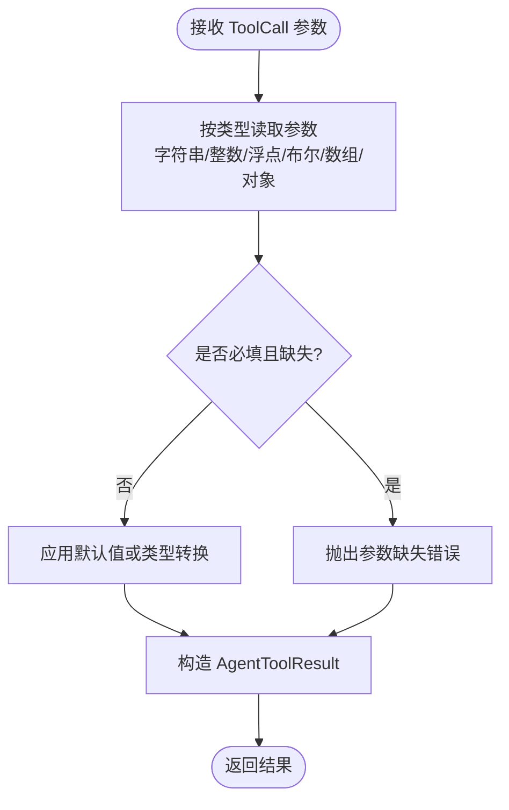
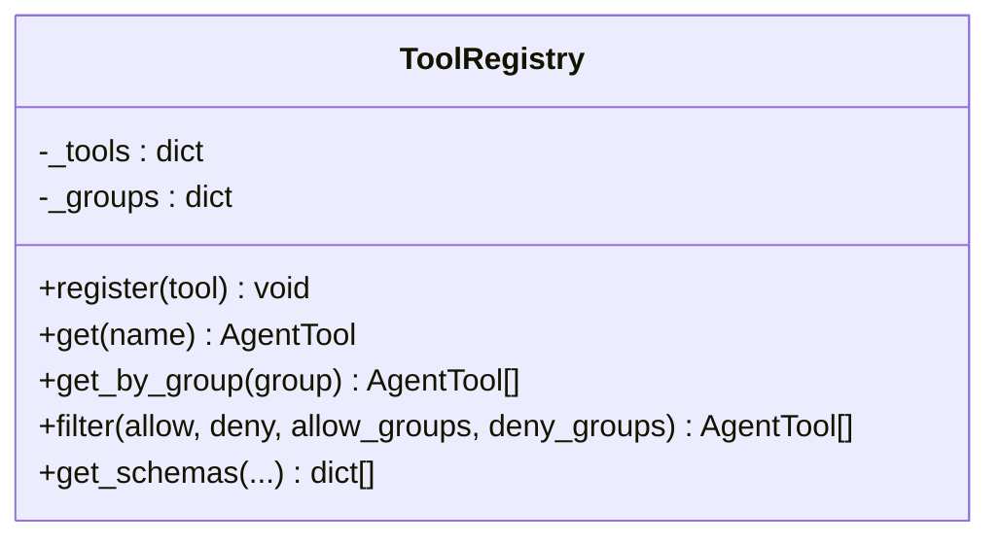
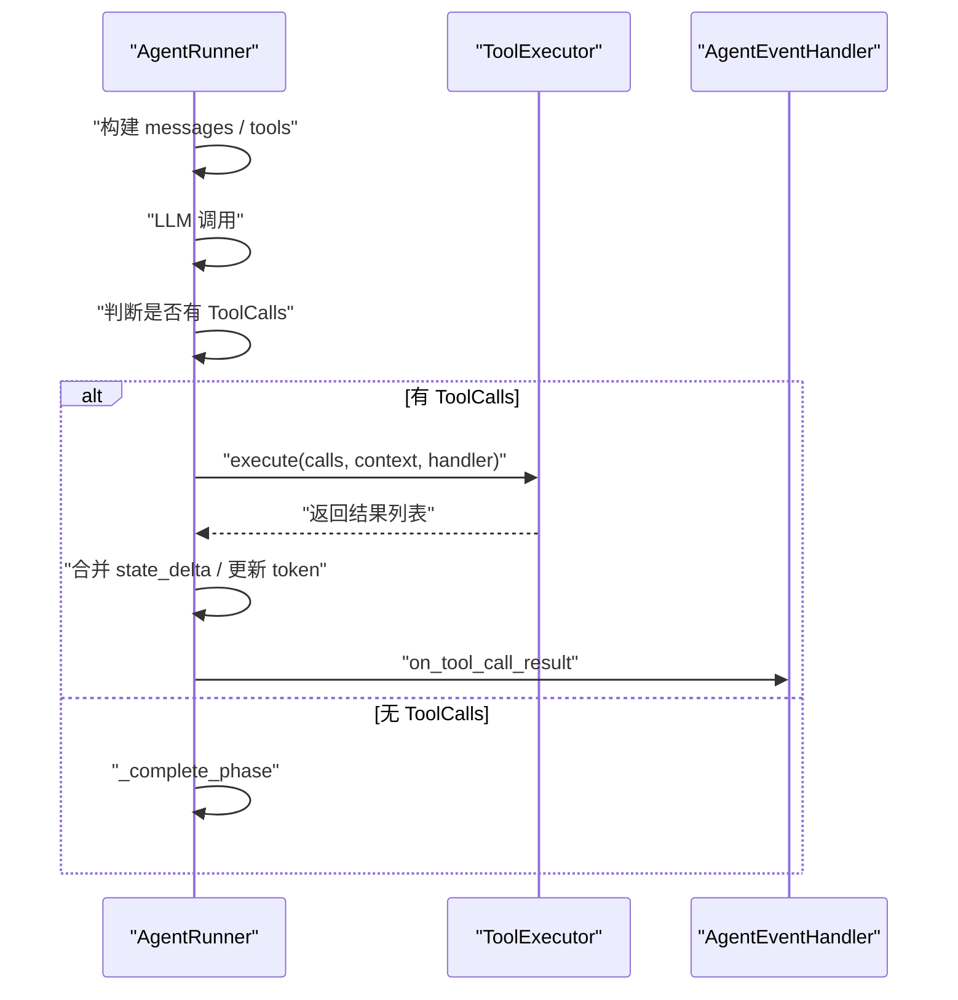
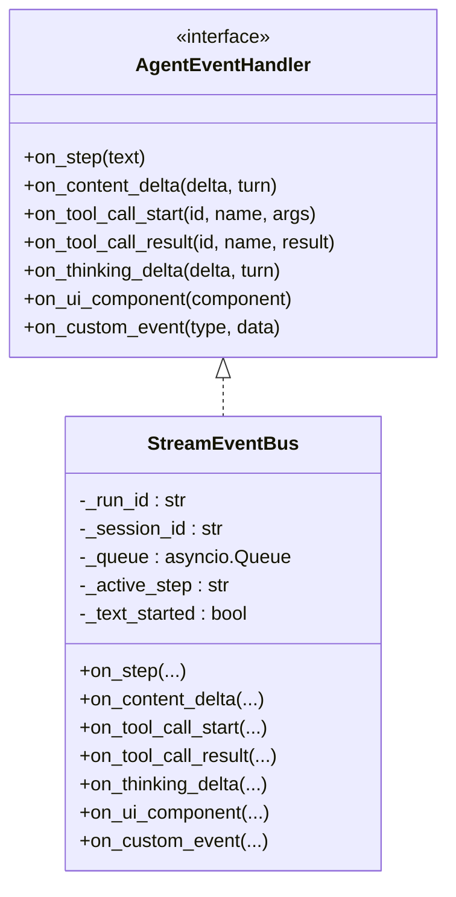
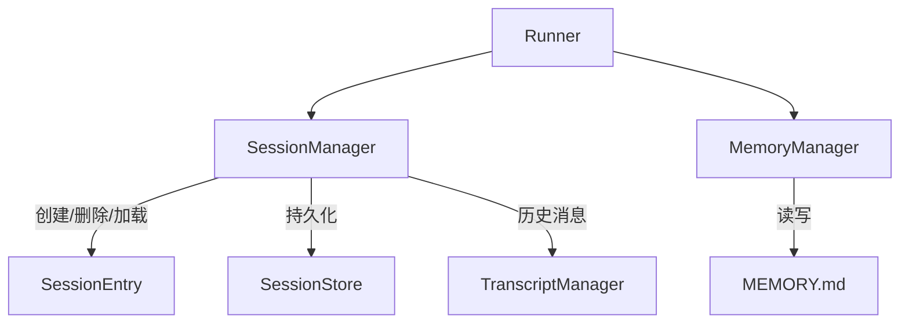
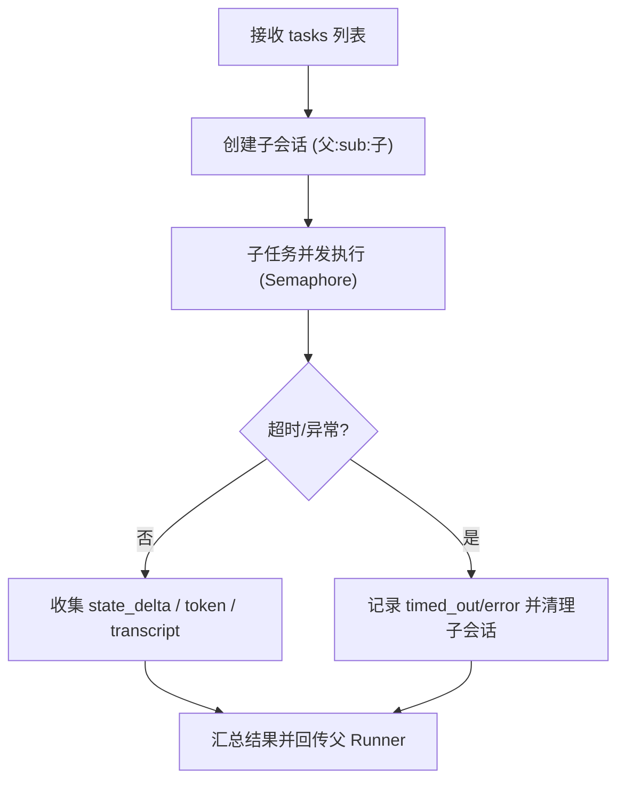
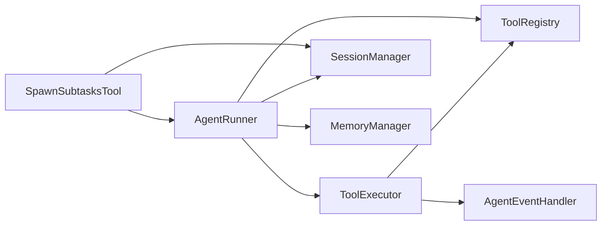

# 工具执行器

<cite>
**本文档引用的文件**
- [executor.py](file://src/ark_agentic/core/tools/executor.py)
- [base.py](file://src/ark_agentic/core/tools/base.py)
- [registry.py](file://src/ark_agentic/core/tools/registry.py)
- [runner.py](file://src/ark_agentic/core/runner.py)
- [types.py](file://src/ark_agentic/core/types.py)
- [session.py](file://src/ark_agentic/core/session.py)
- [event_bus.py](file://src/ark_agentic/core/stream/event_bus.py)
- [memory.py](file://src/ark_agentic/core/tools/memory.py)
- [read_skill.py](file://src/ark_agentic/core/tools/read_skill.py)
- [manager.py](file://src/ark_agentic/core/memory/manager.py)
- [tool.py](file://src/ark_agentic/core/subtask/tool.py)
- [test_tool_executor.py](file://tests/unit/core/test_tool_executor.py)
- [test_executor_parallel.py](file://tests/unit/core/test_executor_parallel.py)
- [test_subtask_tool.py](file://tests/unit/core/test_subtask_tool.py)
</cite>

## 目录
1. [简介](#简介)
2. [项目结构](#项目结构)
3. [核心组件](#核心组件)
4. [架构总览](#架构总览)
5. [详细组件分析](#详细组件分析)
6. [依赖关系分析](#依赖关系分析)
7. [性能考量](#性能考量)
8. [故障排查指南](#故障排查指南)
9. [结论](#结论)
10. [附录](#附录)

## 简介
本文件面向 Ark-Agentic 工具执行器，系统性阐述其设计架构、异步执行机制、并发控制与错误处理策略，覆盖工具调用流程、参数验证、执行上下文管理、结果处理与事件分发。文档还提供配置选项、性能监控与调试技巧，并解释工具执行器如何处理超时、重试与回滚，以及与内存系统和会话管理的集成方式。

## 项目结构
围绕工具执行器的关键模块包括：
- 工具系统：工具基类、工具注册器、工具执行器
- 执行器：AgentRunner 的工具阶段，协调 LLM 与工具执行
- 事件系统：流式事件总线，统一推送工具调用事件
- 会话与内存：SessionManager、MemoryManager，支撑上下文与记忆
- 子任务：SpawnSubtasksTool，支持并行子任务执行

**图表来源**
- [executor.py:29-127](file://src/ark_agentic/core/tools/executor.py#L29-L127)
- [base.py:46-116](file://src/ark_agentic/core/tools/base.py#L46-L116)
- [registry.py:14-93](file://src/ark_agentic/core/tools/registry.py#L14-L93)
- [runner.py:193-284](file://src/ark_agentic/core/runner.py#L193-L284)
- [event_bus.py:28-62](file://src/ark_agentic/core/stream/event_bus.py#L28-L62)
- [session.py:24-92](file://src/ark_agentic/core/session.py#L24-L92)
- [manager.py:24-71](file://src/ark_agentic/core/memory/manager.py#L24-L71)
- [tool.py:61-165](file://src/ark_agentic/core/subtask/tool.py#L61-L165)

**章节来源**
- [executor.py:1-127](file://src/ark_agentic/core/tools/executor.py#L1-L127)
- [base.py:1-289](file://src/ark_agentic/core/tools/base.py#L1-L289)
- [registry.py:1-178](file://src/ark_agentic/core/tools/registry.py#L1-L178)
- [runner.py:1-800](file://src/ark_agentic/core/runner.py#L1-L800)
- [types.py:1-200](file://src/ark_agentic/core/types.py#L1-L200)
- [session.py:1-200](file://src/ark_agentic/core/session.py#L1-L200)
- [event_bus.py:1-200](file://src/ark_agentic/core/stream/event_bus.py#L1-L200)
- [memory.py:1-114](file://src/ark_agentic/core/tools/memory.py#L1-L114)
- [read_skill.py:1-76](file://src/ark_agentic/core/tools/read_skill.py#L1-L76)
- [manager.py:1-92](file://src/ark_agentic/core/memory/manager.py#L1-L92)
- [tool.py:1-319](file://src/ark_agentic/core/subtask/tool.py#L1-L319)

## 核心组件
- 工具基类与参数验证：定义工具抽象、参数结构与 JSON Schema 生成，提供多种参数读取辅助函数，保障参数验证与类型安全。
- 工具注册器：集中管理工具注册、查找、分组与过滤，支持白名单/黑名单策略。
- 工具执行器：负责按序并行执行工具调用，统一超时与错误兜底，分发事件到事件处理器。
- AgentRunner 工具阶段：在 ReAct 循环中触发工具执行，聚合结果并进行后续处理。
- 事件总线：将工具调用事件标准化为 AG-UI 原生事件，支持流式推送。
- 会话与内存：提供上下文状态管理、会话生命周期与记忆写入能力。
- 子任务工具：支持在单轮对话中并行执行多个独立子任务，具备并发控制与超时管理。

**章节来源**
- [base.py:46-289](file://src/ark_agentic/core/tools/base.py#L46-L289)
- [registry.py:14-178](file://src/ark_agentic/core/tools/registry.py#L14-L178)
- [executor.py:29-127](file://src/ark_agentic/core/tools/executor.py#L29-L127)
- [runner.py:652-731](file://src/ark_agentic/core/runner.py#L652-L731)
- [event_bus.py:28-200](file://src/ark_agentic/core/stream/event_bus.py#L28-L200)
- [session.py:24-200](file://src/ark_agentic/core/session.py#L24-L200)
- [memory.py:39-114](file://src/ark_agentic/core/tools/memory.py#L39-L114)
- [tool.py:61-319](file://src/ark_agentic/core/subtask/tool.py#L61-L319)

## 架构总览
工具执行器位于 AgentRunner 的工具阶段，负责将 LLM 的工具调用请求转换为实际工具执行，并通过事件总线将中间状态与结果推送给前端。执行器采用全并行策略，结合超时与错误兜底，确保在复杂场景下的稳定性与可观测性。

**图表来源**
- [runner.py:700-720](file://src/ark_agentic/core/runner.py#L700-L720)
- [executor.py:43-100](file://src/ark_agentic/core/tools/executor.py#L43-L100)
- [registry.py:41-50](file://src/ark_agentic/core/tools/registry.py#L41-L50)
- [event_bus.py:173-200](file://src/ark_agentic/core/stream/event_bus.py#L173-L200)

## 详细组件分析

### 工具执行器（ToolExecutor）
- 设计职责：单一职责，专注工具执行与事件分发，不关心工具内部逻辑。
- 异步执行：使用 asyncio.gather 并行执行工具调用，限制每轮最大调用次数，避免资源耗尽。
- 超时与错误处理：对单个工具调用设置超时，捕获异常并返回错误结果，记录日志便于诊断。
- 事件分发：将工具结果中的事件统一分发至 AgentEventHandler，支持 UI 组件、自定义事件与步骤事件。

**图表来源**
- [executor.py:29-127](file://src/ark_agentic/core/tools/executor.py#L29-L127)
- [registry.py:14-93](file://src/ark_agentic/core/tools/registry.py#L14-L93)
- [base.py:46-116](file://src/ark_agentic/core/tools/base.py#L46-L116)
- [event_bus.py:28-62](file://src/ark_agentic/core/stream/event_bus.py#L28-L62)

**章节来源**
- [executor.py:29-127](file://src/ark_agentic/core/tools/executor.py#L29-L127)
- [test_tool_executor.py:1-162](file://tests/unit/core/test_tool_executor.py#L1-L162)
- [test_executor_parallel.py:41-143](file://tests/unit/core/test_executor_parallel.py#L41-L143)

### 工具基类与参数验证（AgentTool）
- 工具元信息：name、description、parameters、group、visibility、requires_confirmation、thinking_hint。
- JSON Schema：自动生成工具的 JSON Schema，用于 LLM 函数调用。
- 参数读取辅助：提供字符串、整数、浮点、布尔、数组、对象等参数读取与校验函数，支持必填与默认值。
- 适配 LangChain：可将工具适配为 LangChain StructuredTool，便于生态集成。

**图表来源**
- [base.py:169-288](file://src/ark_agentic/core/tools/base.py#L169-L288)

**章节来源**
- [base.py:46-289](file://src/ark_agentic/core/tools/base.py#L46-L289)

### 工具注册器（ToolRegistry）
- 注册与查找：按名称注册工具，支持按组获取与过滤。
- 分组管理：工具可归属分组，便于策略控制。
- 过滤策略：支持白名单/黑名单与分组过滤，简化工具暴露控制。

**图表来源**
- [registry.py:14-178](file://src/ark_agentic/core/tools/registry.py#L14-L178)

**章节来源**
- [registry.py:14-178](file://src/ark_agentic/core/tools/registry.py#L14-L178)

### AgentRunner 工具阶段
- 工具调用触发：在每轮 ReAct 循环中，若 LLM 返回工具调用，则进入工具阶段。
- 并发执行：委托 ToolExecutor 进行并行执行，限制每轮最大工具调用数量。
- 结果聚合：收集工具结果，合并 state_delta，更新 token 使用统计，触发事件分发。

**图表来源**
- [runner.py:652-731](file://src/ark_agentic/core/runner.py#L652-L731)
- [executor.py:43-61](file://src/ark_agentic/core/tools/executor.py#L43-L61)

**章节来源**
- [runner.py:652-731](file://src/ark_agentic/core/runner.py#L652-L731)

### 事件总线（StreamEventBus）
- 事件类型：step、tool_call_start、tool_call_args、tool_call_end、tool_call_result、ui_component、custom_event 等。
- 状态管理：自动配对 step_started/finished、text_message_start/end、thinking_message_start/end。
- 流式输出：将回调事件转化为 AG-UI 原生事件，支持多协议输出。

**图表来源**
- [event_bus.py:28-200](file://src/ark_agentic/core/stream/event_bus.py#L28-L200)

**章节来源**
- [event_bus.py:67-200](file://src/ark_agentic/core/stream/event_bus.py#L67-L200)

### 会话与内存系统
- 会话管理：创建、加载、删除会话，支持同步/异步创建，持久化与磁盘读取。
- 上下文状态：在工具执行期间通过 session.state 传递上下文，支持 temp:* 临时状态与 strip_temp_state 清理。
- 记忆系统：MemoryManager 提供 MEMORY.md 读写，heading-level upsert，支持写入工具 memory_write。

**图表来源**
- [session.py:24-200](file://src/ark_agentic/core/session.py#L24-L200)
- [manager.py:24-71](file://src/ark_agentic/core/memory/manager.py#L24-L71)
- [memory.py:39-114](file://src/ark_agentic/core/tools/memory.py#L39-L114)

**章节来源**
- [session.py:24-200](file://src/ark_agentic/core/session.py#L24-L200)
- [manager.py:24-92](file://src/ark_agentic/core/memory/manager.py#L24-L92)
- [memory.py:39-114](file://src/ark_agentic/core/tools/memory.py#L39-L114)

### 子任务工具（SpawnSubtasksTool）
- 并行子任务：接收任务列表，使用 asyncio.gather 并行执行，每子任务创建独立会话，实现上下文隔离。
- 并发控制：通过 asyncio.Semaphore 控制最大并发，支持超时与异常处理。
- 结果汇总：聚合子任务 state_delta、token 使用与 transcript，回传父 Runner。

**图表来源**
- [tool.py:106-319](file://src/ark_agentic/core/subtask/tool.py#L106-L319)

**章节来源**
- [tool.py:61-319](file://src/ark_agentic/core/subtask/tool.py#L61-L319)
- [test_subtask_tool.py:77-332](file://tests/unit/core/test_subtask_tool.py#L77-L332)

## 依赖关系分析
- 耦合与内聚：ToolExecutor 与 ToolRegistry 解耦，通过接口查找工具；与 AgentEventHandler 通过协议解耦，遵循依赖倒置原则。
- 外部依赖：依赖 asyncio 进行并发与超时控制；依赖事件总线进行可观测性输出。
- 循环依赖：未发现循环依赖，模块边界清晰。

**图表来源**
- [executor.py:29-127](file://src/ark_agentic/core/tools/executor.py#L29-L127)
- [runner.py:193-284](file://src/ark_agentic/core/runner.py#L193-L284)
- [tool.py:61-165](file://src/ark_agentic/core/subtask/tool.py#L61-L165)

**章节来源**
- [executor.py:29-127](file://src/ark_agentic/core/tools/executor.py#L29-L127)
- [runner.py:193-284](file://src/ark_agentic/core/runner.py#L193-L284)
- [tool.py:61-165](file://src/ark_agentic/core/subtask/tool.py#L61-L165)

## 性能考量
- 并行执行：工具阶段使用 asyncio.gather 并行执行，显著降低总延迟，测试表明三工具并发耗时接近单工具耗时。
- 资源限制：通过 max_calls_per_turn 限制每轮工具调用数量，避免资源耗尽。
- 超时控制：单工具超时阈值可配置，防止长时间阻塞影响整体吞吐。
- 事件开销：事件总线采用队列推送，建议在高并发场景下合理设置队列容量与消费速率。
- 记忆与压缩：会话压缩与记忆写入为异步操作，避免阻塞工具执行路径。

[本节为通用指导，不直接分析具体文件]

## 故障排查指南
- 工具未找到：当 ToolRegistry 中不存在对应工具时，执行器返回错误结果，检查工具注册与名称匹配。
- 超时问题：单工具超时会记录日志并返回错误，可通过增大超时阈值或优化工具实现。
- 并发冲突：并行执行时 state_delta 不互相可见，合并发生在 Runner 层，避免工具间状态竞争。
- 事件未到达前端：检查事件处理器是否正确实现 AgentEventHandler 接口，确认事件总线队列消费逻辑。
- 子任务异常：子任务超时或异常会返回 timed_out/error，检查子任务配置与并发限制。

**章节来源**
- [executor.py:77-98](file://src/ark_agentic/core/tools/executor.py#L77-L98)
- [test_tool_executor.py:48-70](file://tests/unit/core/test_tool_executor.py#L48-L70)
- [test_executor_parallel.py:107-143](file://tests/unit/core/test_executor_parallel.py#L107-L143)
- [test_subtask_tool.py:311-332](file://tests/unit/core/test_subtask_tool.py#L311-L332)

## 结论
工具执行器通过明确的职责划分、严格的超时与错误处理、以及事件驱动的可观测性设计，实现了在复杂业务场景下的稳定与高效。配合会话与内存系统，工具执行器能够可靠地承载多轮对话与多工具并发，满足生产级应用的需求。

[本节为总结性内容，不直接分析具体文件]

## 附录

### 配置选项与参数
- ToolExecutor
  - timeout：单个工具执行超时（秒）
  - max_calls_per_turn：每轮最大工具调用数
- AgentRunner.RunnerConfig
  - max_tool_calls_per_turn：每轮最大工具调用数
  - tool_timeout：单个工具超时（秒）
  - max_retries：LLM 调用重试次数
  - auto_compact：自动压缩上下文
  - enable_subtasks：启用并行子任务
  - enable_dream：启用记忆蒸馏
- SpawnSubtasksTool.SubtaskConfig
  - max_concurrent：最大并发数
  - timeout_seconds：单任务超时
  - tools_deny：禁用工具集合
  - keep_session：完成后是否保留子会话
  - max_turns：子任务最大轮次
  - persist_transcript：是否持久化子任务对话

**章节来源**
- [executor.py:32-42](file://src/ark_agentic/core/tools/executor.py#L32-L42)
- [runner.py:92-128](file://src/ark_agentic/core/runner.py#L92-L128)
- [tool.py:32-42](file://src/ark_agentic/core/subtask/tool.py#L32-L42)

### 性能监控与调试技巧
- 日志：关注工具开始/结束、超时与错误日志，定位瓶颈与异常。
- 事件：通过事件总线观察工具调用序列与前端事件，验证执行链路。
- 测试：利用单元测试验证并行执行、超时与错误处理行为，确保回归质量。
- 配置：根据业务负载调整并发与超时参数，平衡吞吐与稳定性。

**章节来源**
- [test_tool_executor.py:1-162](file://tests/unit/core/test_tool_executor.py#L1-L162)
- [test_executor_parallel.py:41-143](file://tests/unit/core/test_executor_parallel.py#L41-L143)
- [test_subtask_tool.py:1-467](file://tests/unit/core/test_subtask_tool.py#L1-L467)