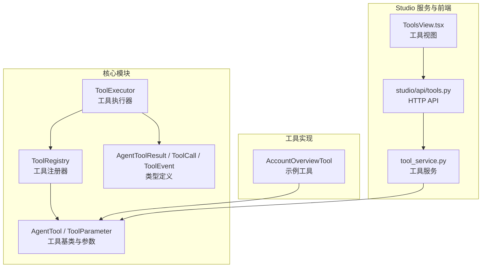
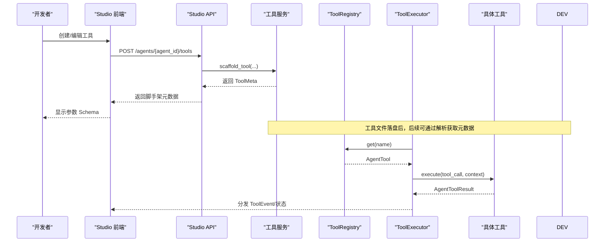
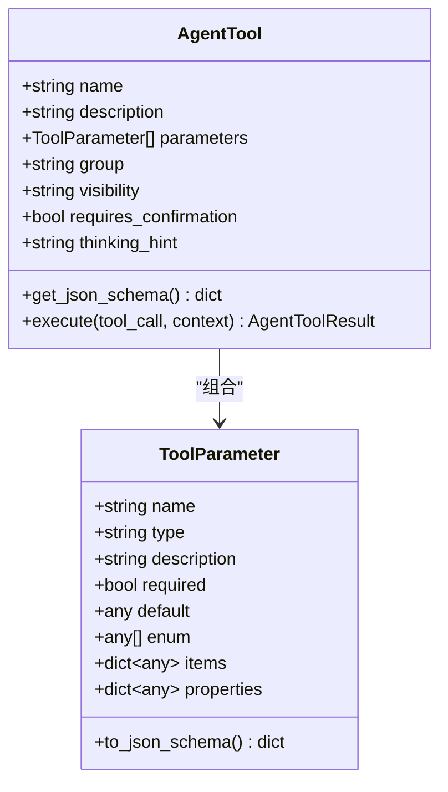
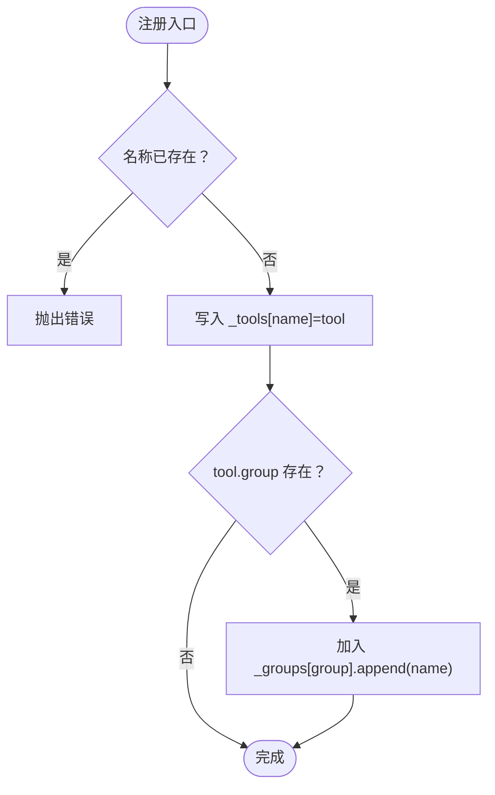
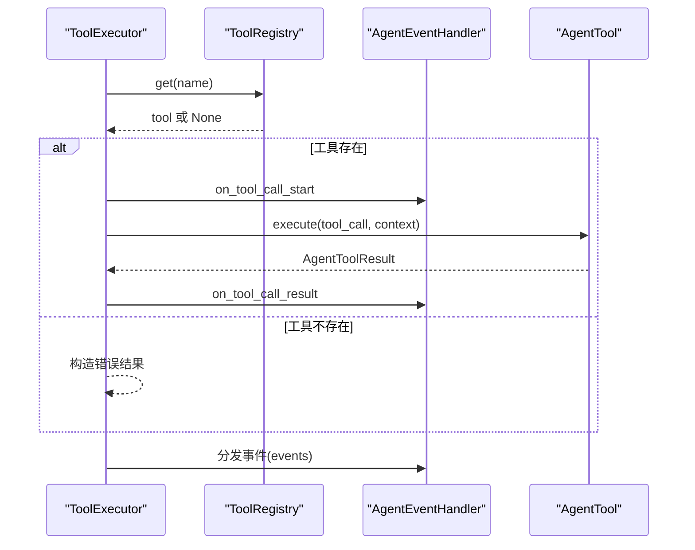
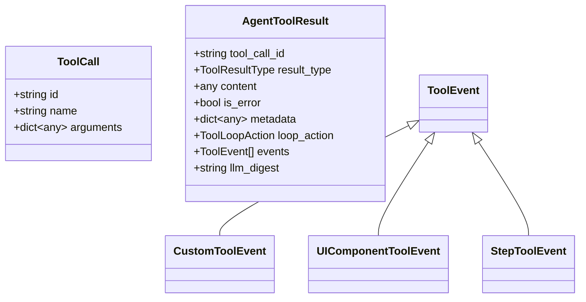
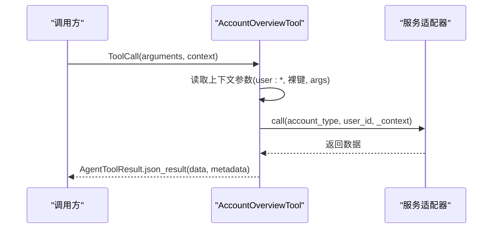
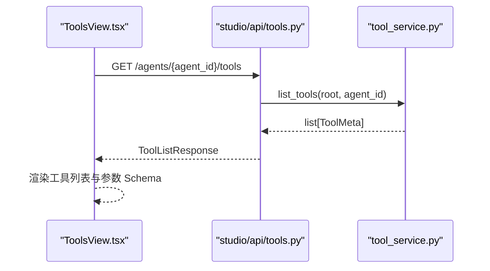
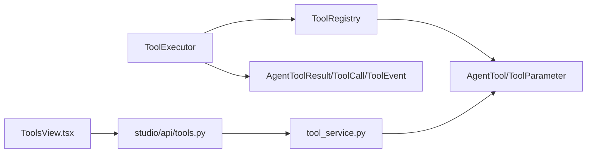

# 工具注册表

<cite>
**本文引用的文件**
- [registry.py](file://src/ark_agentic/core/tools/registry.py)
- [base.py](file://src/ark_agentic/core/tools/base.py)
- [executor.py](file://src/ark_agentic/core/tools/executor.py)
- [types.py](file://src/ark_agentic/core/types.py)
- [tool_service.py](file://src/ark_agentic/studio/services/tool_service.py)
- [tools.py](file://src/ark_agentic/studio/api/tools.py)
- [ToolsView.tsx](file://src/ark_agentic/studio/frontend/src/pages/ToolsView.tsx)
- [account_overview.py](file://src/ark_agentic/agents/securities/tools/agent/account_overview.py)
- [manage_tools.py](file://src/ark_agentic/agents/meta_builder/tools/manage_tools.py)
- [test_tools.py](file://tests/unit/core/test_tools.py)
</cite>

## 目录
1. [简介](#简介)
2. [项目结构](#项目结构)
3. [核心组件](#核心组件)
4. [架构总览](#架构总览)
5. [详细组件分析](#详细组件分析)
6. [依赖分析](#依赖分析)
7. [性能考虑](#性能考虑)
8. [故障排除指南](#故障排除指南)
9. [结论](#结论)
10. [附录](#附录)

## 简介
本技术文档围绕 Ark-Agentic 工具注册表展开，系统性阐述其架构设计、工具注册机制、工具发现与检索流程，并给出初始化过程、元数据管理、分类与分组策略、最佳实践、性能优化建议与故障排除指南。同时说明工具注册表与智能体执行系统的协作方式，以及如何支持动态工具加载与卸载。

## 项目结构
工具注册表位于核心模块，围绕工具基类、注册器、执行器与类型体系构建；同时提供 Studio 工具服务与前端页面，支撑工具的脚手架生成、元数据解析与可视化管理。

图表来源
- [registry.py:14-178](file://src/ark_agentic/core/tools/registry.py#L14-L178)
- [base.py:46-163](file://src/ark_agentic/core/tools/base.py#L46-L163)
- [executor.py:29-127](file://src/ark_agentic/core/tools/executor.py#L29-L127)
- [types.py:69-196](file://src/ark_agentic/core/types.py#L69-L196)
- [account_overview.py:57-108](file://src/ark_agentic/agents/securities/tools/agent/account_overview.py#L57-L108)
- [tool_service.py:40-177](file://src/ark_agentic/studio/services/tool_service.py#L40-L177)
- [tools.py:41-65](file://src/ark_agentic/studio/api/tools.py#L41-L65)
- [ToolsView.tsx:1-37](file://src/ark_agentic/studio/frontend/src/pages/ToolsView.tsx#L1-L37)

章节来源
- [registry.py:14-178](file://src/ark_agentic/core/tools/registry.py#L14-L178)
- [base.py:46-163](file://src/ark_agentic/core/tools/base.py#L46-L163)
- [executor.py:29-127](file://src/ark_agentic/core/tools/executor.py#L29-L127)
- [types.py:69-196](file://src/ark_agentic/core/types.py#L69-L196)
- [tool_service.py:40-177](file://src/ark_agentic/studio/services/tool_service.py#L40-L177)
- [tools.py:41-65](file://src/ark_agentic/studio/api/tools.py#L41-L65)
- [ToolsView.tsx:1-37](file://src/ark_agentic/studio/frontend/src/pages/ToolsView.tsx#L1-L37)

## 核心组件
- 工具基类与参数
  - AgentTool 定义工具抽象接口与 JSON Schema 生成能力，强制子类声明 name 与 description，支持 visibility、group、requires_confirmation、thinking_hint 等元数据。
  - ToolParameter 描述参数类型、枚举、默认值、对象/数组结构等，并可转换为 JSON Schema。
- 工具注册器
  - ToolRegistry 负责工具注册、查找、分组、批量注册、注销、清空、Schema 生成与策略过滤。
- 工具执行器
  - ToolExecutor 负责按序并发执行工具调用、超时控制、错误兜底、事件分发。
- 类型体系
  - ToolCall、AgentToolResult、ToolEvent、ToolResultType、ToolLoopAction 等统一工具调用与结果表达。
- Studio 工具服务与前端
  - tool_service 提供工具列表、脚手架生成、AST 解析工具元数据。
  - studio/api/tools 提供 HTTP 接口。
  - ToolsView.tsx 提供工具列表与参数 Schema 展示。

章节来源
- [base.py:46-163](file://src/ark_agentic/core/tools/base.py#L46-L163)
- [registry.py:14-178](file://src/ark_agentic/core/tools/registry.py#L14-L178)
- [executor.py:29-127](file://src/ark_agentic/core/tools/executor.py#L29-L127)
- [types.py:69-196](file://src/ark_agentic/core/types.py#L69-L196)
- [tool_service.py:40-177](file://src/ark_agentic/studio/services/tool_service.py#L40-L177)
- [tools.py:41-65](file://src/ark_agentic/studio/api/tools.py#L41-L65)
- [ToolsView.tsx:136-155](file://src/ark_agentic/studio/frontend/src/pages/ToolsView.tsx#L136-L155)

## 架构总览
工具注册表贯穿“定义—注册—发现—执行—反馈”的闭环，配合 Studio 支持动态脚手架与元数据解析，形成可扩展的工具生态。

图表来源
- [tools.py:52-65](file://src/ark_agentic/studio/api/tools.py#L52-L65)
- [tool_service.py:59-98](file://src/ark_agentic/studio/services/tool_service.py#L59-L98)
- [registry.py:41-50](file://src/ark_agentic/core/tools/registry.py#L41-L50)
- [executor.py:43-100](file://src/ark_agentic/core/tools/executor.py#L43-L100)

## 详细组件分析

### 工具基类与参数
- 设计要点
  - 强约束：子类必须显式定义 name 与 description，否则抛出异常。
  - JSON Schema：get_json_schema 输出 OpenAI 兼容格式，自动收集 parameters 中的 required 字段。
  - 参数读取辅助：提供字符串/整数/浮点/布尔/列表/字典等读取函数，含必填校验版本。
- 元数据字段
  - group：用于分组与策略过滤。
  - visibility：控制工具在工具列表中的可见性。
  - requires_confirmation：是否需要确认。
  - thinking_hint：UI 状态提示，不参与 LLM Schema。

图表来源
- [base.py:46-163](file://src/ark_agentic/core/tools/base.py#L46-L163)

章节来源
- [base.py:46-163](file://src/ark_agentic/core/tools/base.py#L46-L163)

### 工具注册器
- 职责
  - 注册/注销/批量注册/清空。
  - 按名称获取、按分组获取、列出所有、列出名称、列出分组。
  - 生成 JSON Schema 列表，支持按名称/分组/排除过滤。
  - 策略过滤：支持 allow/deny 与 allow_groups/deny_groups。
- 关键行为
  - 注册时若重复名称则抛错。
  - 注册时自动维护 group -> tool names 的映射。
  - get_required 在找不到时抛 KeyError。
  - unregister 会同步从分组中移除。

图表来源
- [registry.py:24-34](file://src/ark_agentic/core/tools/registry.py#L24-L34)

章节来源
- [registry.py:14-178](file://src/ark_agentic/core/tools/registry.py#L14-L178)

### 工具执行器
- 职责
  - 并行执行 ToolCall 列表，限制每轮最大调用次数，超时与异常兜底。
  - 将 AgentToolResult.events 统一分发至 AgentEventHandler。
  - 记录日志与 UI 状态提示。
- 关键流程
  - 从 ToolRegistry 获取工具实例。
  - 包装超时与异常，构造 AgentToolResult。
  - 分发 UIComponent/Custom/Step 等事件。

图表来源
- [executor.py:43-100](file://src/ark_agentic/core/tools/executor.py#L43-L100)

章节来源
- [executor.py:29-127](file://src/ark_agentic/core/tools/executor.py#L29-L127)
- [types.py:69-196](file://src/ark_agentic/core/types.py#L69-L196)

### 类型体系
- ToolCall：封装工具调用标识、名称与参数。
- AgentToolResult：封装结果类型、内容、错误标记、元数据、循环控制、事件与摘要。
- ToolEvent：事件基类，派生出 CustomToolEvent、UIComponentToolEvent、StepToolEvent。
- ToolResultType/ToolLoopAction：标准化结果与循环控制信号。

图表来源
- [types.py:69-196](file://src/ark_agentic/core/types.py#L69-L196)

章节来源
- [types.py:69-196](file://src/ark_agentic/core/types.py#L69-L196)

### 示例工具：账户总览
- 特点
  - 继承 AgentTool，定义 name/description/thinking_hint/parameters。
  - 从上下文读取参数，兼容 user: 前缀与裸键，支持默认值。
  - 调用服务适配器执行业务逻辑，返回 JSON 结果并携带 state_delta 元数据。

图表来源
- [account_overview.py:72-108](file://src/ark_agentic/agents/securities/tools/agent/account_overview.py#L72-L108)

章节来源
- [account_overview.py:57-108](file://src/ark_agentic/agents/securities/tools/agent/account_overview.py#L57-L108)

### Studio 工具服务与前端
- 工具服务
  - list_tools：遍历 Agent 的 tools 目录，AST 解析每个 Python 文件，提取 ToolMeta。
  - scaffold_tool：校验工具名合法性，渲染模板生成脚手架文件，并解析返回 ToolMeta。
  - parse_tool_file：解析类名、docstring、group、parameters 等元数据。
- HTTP API
  - GET /agents/{agent_id}/tools：返回工具列表。
  - POST /agents/{agent_id}/tools：生成脚手架。
- 前端视图
  - ToolsView.tsx：拉取工具列表，展示分组、源文件路径与参数 Schema。

图表来源
- [tools.py:41-49](file://src/ark_agentic/studio/api/tools.py#L41-L49)
- [tool_service.py:40-56](file://src/ark_agentic/studio/services/tool_service.py#L40-L56)
- [ToolsView.tsx:28-34](file://src/ark_agentic/studio/frontend/src/pages/ToolsView.tsx#L28-L34)

章节来源
- [tool_service.py:40-177](file://src/ark_agentic/studio/services/tool_service.py#L40-L177)
- [tools.py:41-65](file://src/ark_agentic/studio/api/tools.py#L41-L65)
- [ToolsView.tsx:1-37](file://src/ark_agentic/studio/frontend/src/pages/ToolsView.tsx#L1-L37)

### 动态工具加载与卸载
- 加载
  - 通过 Studio 脚手架生成工具文件，随后由工具服务解析元数据，注册器可按需注册实例。
  - 示例：Meta Builder 的 manage_tools 工具支持读取/更新/删除 Agent 下的工具文件，配合注册器进行动态注册。
- 卸载
  - 注销工具：ToolRegistry.unregister(name) 会移除工具并同步清理分组映射。
  - 删除文件：Studio API 的删除动作会直接删除工具文件，后续解析不再包含该工具。

章节来源
- [manage_tools.py:145-162](file://src/ark_agentic/agents/meta_builder/tools/manage_tools.py#L145-L162)
- [registry.py:73-87](file://src/ark_agentic/core/tools/registry.py#L73-L87)

## 依赖分析
- 内聚与耦合
  - ToolRegistry 与 AgentTool 强关联，但通过接口隔离，便于替换与扩展。
  - ToolExecutor 依赖 ToolRegistry 与类型体系，事件分发解耦于具体处理器。
  - Studio 服务与前端通过 API 解耦，工具服务独立于 HTTP 框架。
- 外部依赖
  - LangChain 适配（可选）：AgentTool.to_langchain_tool 需要 langchain-core。
  - 文件系统：Studio 工具服务依赖文件系统读写与 AST 解析。

图表来源
- [registry.py:14-178](file://src/ark_agentic/core/tools/registry.py#L14-L178)
- [base.py:46-163](file://src/ark_agentic/core/tools/base.py#L46-L163)
- [executor.py:29-127](file://src/ark_agentic/core/tools/executor.py#L29-L127)
- [types.py:69-196](file://src/ark_agentic/core/types.py#L69-L196)
- [tool_service.py:40-177](file://src/ark_agentic/studio/services/tool_service.py#L40-L177)
- [tools.py:41-65](file://src/ark_agentic/studio/api/tools.py#L41-L65)
- [ToolsView.tsx:1-37](file://src/ark_agentic/studio/frontend/src/pages/ToolsView.tsx#L1-L37)

章节来源
- [registry.py:14-178](file://src/ark_agentic/core/tools/registry.py#L14-L178)
- [base.py:46-163](file://src/ark_agentic/core/tools/base.py#L46-L163)
- [executor.py:29-127](file://src/ark_agentic/core/tools/executor.py#L29-L127)
- [types.py:69-196](file://src/ark_agentic/core/types.py#L69-L196)
- [tool_service.py:40-177](file://src/ark_agentic/studio/services/tool_service.py#L40-L177)
- [tools.py:41-65](file://src/ark_agentic/studio/api/tools.py#L41-L65)
- [ToolsView.tsx:1-37](file://src/ark_agentic/studio/frontend/src/pages/ToolsView.tsx#L1-L37)

## 性能考虑
- 并发与限流
  - ToolExecutor 对每轮工具调用数量进行限制，避免资源争抢与过载。
  - 并行执行工具调用，缩短整体延迟。
- 超时与错误处理
  - 统一超时控制与异常捕获，防止单个工具阻塞全局。
- Schema 生成与过滤
  - ToolRegistry.get_schemas/filter 支持按需生成/筛选，减少不必要的计算与传输。
- 文件解析成本
  - Studio 工具服务通过 AST 解析元数据，建议缓存解析结果或按需触发，避免频繁 IO。

## 故障排除指南
- 工具未找到
  - 现象：ToolExecutor 抛出“Tool not found”错误。
  - 排查：确认 ToolRegistry 是否已注册、名称是否一致、大小写是否正确。
- 重复注册
  - 现象：注册时报“已存在”错误。
  - 排查：检查是否重复注册同一名称工具；必要时先 unregister 再 register。
- 参数缺失或类型错误
  - 现象：工具执行报错或返回错误结果。
  - 排查：使用参数读取辅助函数进行校验；确保 ToolParameter 的 required 与类型匹配。
- LangChain 适配失败
  - 现象：调用 to_langchain_tool 抛 ImportError。
  - 排查：安装 langchain-core；仅在需要接入 LangChain 生态时启用。
- Studio 工具解析失败
  - 现象：工具列表为空或缺少参数 Schema。
  - 排查：确认工具文件符合 AgentTool 规范；检查 AST 解析逻辑是否能识别 ToolParameter 定义。

章节来源
- [executor.py:77-87](file://src/ark_agentic/core/tools/executor.py#L77-L87)
- [registry.py:26-27](file://src/ark_agentic/core/tools/registry.py#L26-L27)
- [base.py:118-162](file://src/ark_agentic/core/tools/base.py#L118-L162)
- [tool_service.py:101-177](file://src/ark_agentic/studio/services/tool_service.py#L101-L177)

## 结论
Ark-Agentic 工具注册表以清晰的抽象与强内聚的设计，实现了工具的标准化定义、高效注册与灵活检索；结合 Studio 的脚手架与元数据解析能力，支持动态工具加载与卸载。通过 ToolExecutor 的统一执行与事件分发，工具注册表与智能体执行系统紧密协作，满足复杂场景下的工具编排需求。

## 附录

### 初始化与使用流程
- 初始化
  - 创建 ToolRegistry 实例。
  - 定义 AgentTool 子类并设置 name/description/parameters/group 等元数据。
  - 通过 register/register_all 注册工具。
- 发现与检索
  - 通过 get/get_by_group/list_all/list_names/list_groups 进行发现。
  - 通过 get_schemas/filter 生成 JSON Schema 与策略过滤。
- 执行
  - ToolExecutor.execute 接收 ToolCall 列表，统一执行并分发事件。
- 动态管理
  - 通过 Studio API 生成脚手架、读取/更新/删除工具文件；必要时调用 unregister 清理。

章节来源
- [registry.py:24-178](file://src/ark_agentic/core/tools/registry.py#L24-L178)
- [executor.py:43-100](file://src/ark_agentic/core/tools/executor.py#L43-L100)
- [tools.py:52-65](file://src/ark_agentic/studio/api/tools.py#L52-L65)
- [manage_tools.py:145-162](file://src/ark_agentic/agents/meta_builder/tools/manage_tools.py#L145-L162)