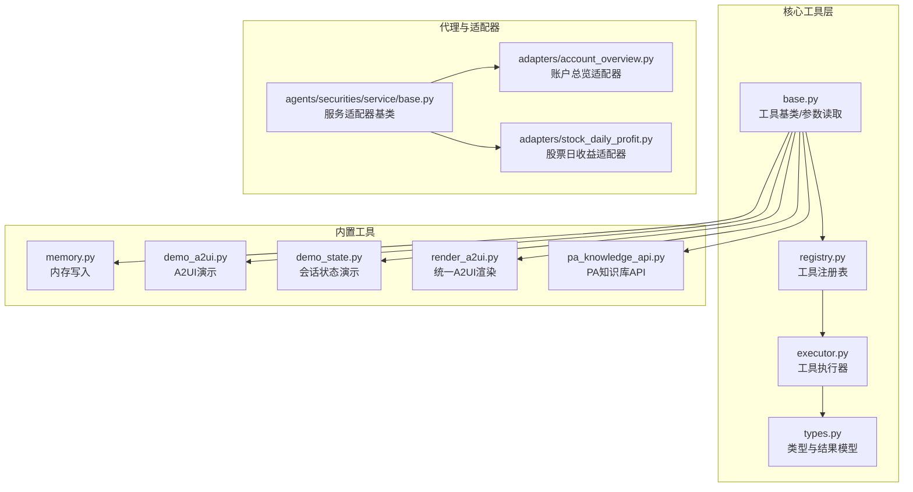
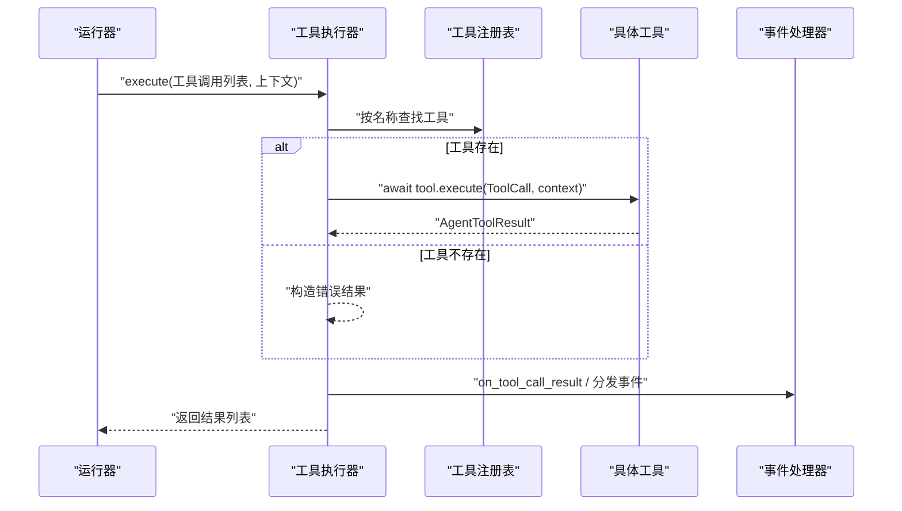
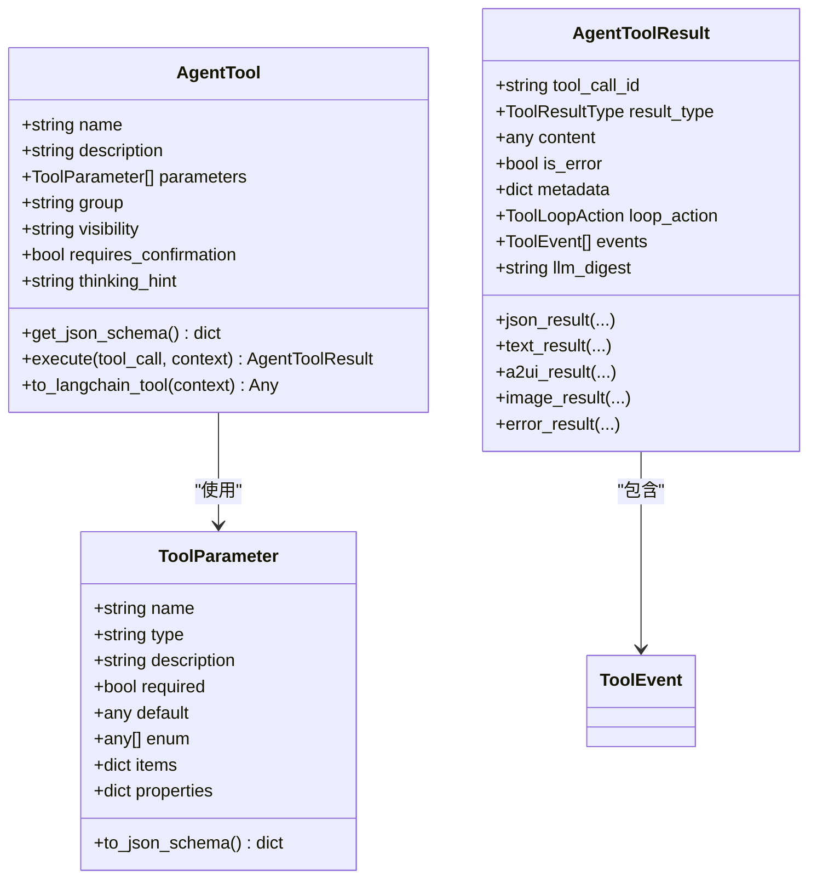
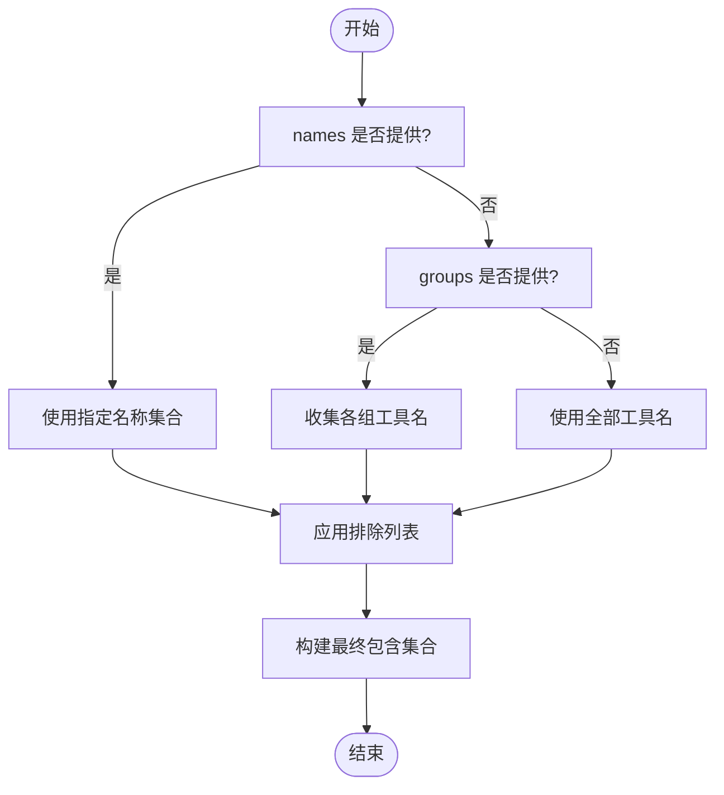
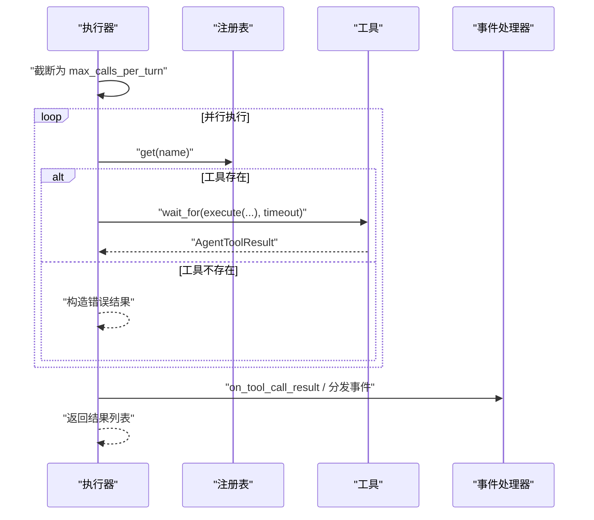
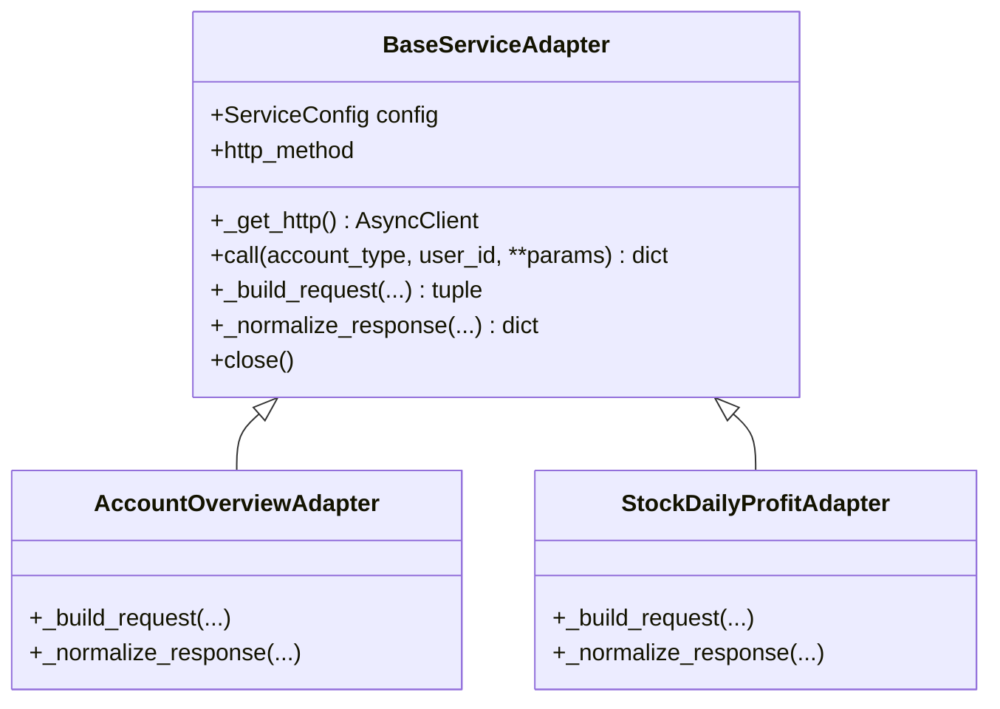
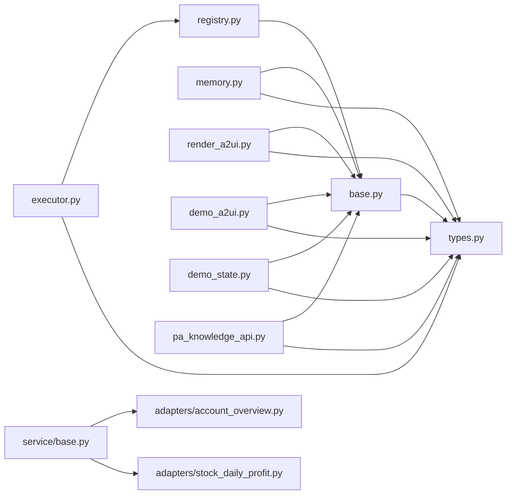

# 工具系统

<cite>
**本文引用的文件**
- [src/ark_agentic/core/tools/__init__.py](file://src/ark_agentic/core/tools/__init__.py)
- [src/ark_agentic/core/tools/base.py](file://src/ark_agentic/core/tools/base.py)
- [src/ark_agentic/core/tools/registry.py](file://src/ark_agentic/core/tools/registry.py)
- [src/ark_agentic/core/tools/executor.py](file://src/ark_agentic/core/tools/executor.py)
- [src/ark_agentic/core/tools/memory.py](file://src/ark_agentic/core/tools/memory.py)
- [src/ark_agentic/core/tools/demo_a2ui.py](file://src/ark_agentic/core/tools/demo_a2ui.py)
- [src/ark_agentic/core/tools/demo_state.py](file://src/ark_agentic/core/tools/demo_state.py)
- [src/ark_agentic/core/tools/render_a2ui.py](file://src/ark_agentic/core/tools/render_a2ui.py)
- [src/ark_agentic/core/tools/pa_knowledge_api.py](file://src/ark_agentic/core/tools/pa_knowledge_api.py)
- [src/ark_agentic/core/types.py](file://src/ark_agentic/core/types.py)
- [src/ark_agentic/agents/securities/tools/service/base.py](file://src/ark_agentic/agents/securities/tools/service/base.py)
- [src/ark_agentic/agents/securities/tools/service/adapters/account_overview.py](file://src/ark_agentic/agents/securities/tools/service/adapters/account_overview.py)
- [src/ark_agentic/agents/securities/tools/service/adapters/stock_daily_profit.py](file://src/ark_agentic/agents/securities/tools/service/adapters/stock_daily_profit.py)
- [tests/unit/core/test_tool_executor.py](file://tests/unit/core/test_tool_executor.py)
- [tests/unit/core/test_tools.py](file://tests/unit/core/test_tools.py)
</cite>

## 目录
1. [简介](#简介)
2. [项目结构](#项目结构)
3. [核心组件](#核心组件)
4. [架构总览](#架构总览)
5. [详细组件分析](#详细组件分析)
6. [依赖分析](#依赖分析)
7. [性能考虑](#性能考虑)
8. [故障排查指南](#故障排查指南)
9. [结论](#结论)
10. [附录](#附录)

## 简介
本文件面向 Ark-Agentic 工具系统，系统性阐述工具注册表架构、工具执行器设计、工具适配器模式以及自定义工具开发流程。文档覆盖工具接口规范、参数验证与返回值处理、生命周期管理、并发执行控制、超时与错误恢复机制，并提供最佳实践与性能优化建议。读者可据此快速理解并扩展工具生态。

## 项目结构
工具系统位于核心模块 core/tools 下，围绕“工具基类 + 注册表 + 执行器”的三层架构组织，并提供若干内置工具（内存写入、A2UI 渲染、演示工具、PA 知识库 API）。同时，在保险与证券代理中提供了服务适配器模式的实践案例，体现“工具层 + 适配器层”的解耦设计。

图表来源
- [src/ark_agentic/core/tools/base.py:1-289](file://src/ark_agentic/core/tools/base.py#L1-L289)
- [src/ark_agentic/core/tools/registry.py:1-178](file://src/ark_agentic/core/tools/registry.py#L1-L178)
- [src/ark_agentic/core/tools/executor.py:1-127](file://src/ark_agentic/core/tools/executor.py#L1-L127)
- [src/ark_agentic/core/tools/memory.py:1-114](file://src/ark_agentic/core/tools/memory.py#L1-L114)
- [src/ark_agentic/core/tools/demo_a2ui.py:1-74](file://src/ark_agentic/core/tools/demo_a2ui.py#L1-L74)
- [src/ark_agentic/core/tools/demo_state.py:1-113](file://src/ark_agentic/core/tools/demo_state.py#L1-L113)
- [src/ark_agentic/core/tools/render_a2ui.py:1-685](file://src/ark_agentic/core/tools/render_a2ui.py#L1-L685)
- [src/ark_agentic/core/tools/pa_knowledge_api.py:1-231](file://src/ark_agentic/core/tools/pa_knowledge_api.py#L1-L231)
- [src/ark_agentic/core/types.py:1-422](file://src/ark_agentic/core/types.py#L1-L422)
- [src/ark_agentic/agents/securities/tools/service/base.py:1-212](file://src/ark_agentic/agents/securities/tools/service/base.py#L1-L212)
- [src/ark_agentic/agents/securities/tools/service/adapters/account_overview.py:1-61](file://src/ark_agentic/agents/securities/tools/service/adapters/account_overview.py#L1-L61)
- [src/ark_agentic/agents/securities/tools/service/adapters/stock_daily_profit.py:1-50](file://src/ark_agentic/agents/securities/tools/service/adapters/stock_daily_profit.py#L1-L50)

章节来源
- [src/ark_agentic/core/tools/__init__.py:1-53](file://src/ark_agentic/core/tools/__init__.py#L1-L53)

## 核心组件
- 工具基类与参数读取：定义工具抽象、参数结构、JSON Schema 生成、LangChain 适配与参数读取辅助函数。
- 工具注册表：提供注册、查询、分组、过滤、Schema 导出等能力。
- 工具执行器：负责并发执行工具调用、超时控制、错误兜底、事件分发。
- 类型与结果模型：统一工具调用结果、事件类型、工具调用载荷等。
- 内置工具：内存写入、A2UI 渲染、演示工具、PA 知识库 API。
- 服务适配器：面向外部服务的适配层，封装认证、请求构建、响应标准化。

章节来源
- [src/ark_agentic/core/tools/base.py:1-289](file://src/ark_agentic/core/tools/base.py#L1-L289)
- [src/ark_agentic/core/tools/registry.py:1-178](file://src/ark_agentic/core/tools/registry.py#L1-L178)
- [src/ark_agentic/core/tools/executor.py:1-127](file://src/ark_agentic/core/tools/executor.py#L1-L127)
- [src/ark_agentic/core/types.py:1-422](file://src/ark_agentic/core/types.py#L1-L422)

## 架构总览
工具系统采用“工具层 + 执行层 + 适配层”的分层设计：
- 工具层：AgentTool 抽象 + 具体工具实现（内置工具 + 业务工具）。
- 执行层：ToolExecutor 负责并发执行、超时与错误处理、事件分发。
- 适配层：BaseServiceAdapter 封装 HTTP 客户端、认证、请求构建与响应标准化，便于对接外部服务。

图表来源
- [src/ark_agentic/core/tools/executor.py:43-100](file://src/ark_agentic/core/tools/executor.py#L43-L100)
- [src/ark_agentic/core/tools/registry.py:41-50](file://src/ark_agentic/core/tools/registry.py#L41-L50)
- [src/ark_agentic/core/types.py:85-196](file://src/ark_agentic/core/types.py#L85-L196)

## 详细组件分析

### 工具基类与参数读取
- 工具基类 AgentTool：强制子类定义 name/description；提供 JSON Schema 生成；支持 LangChain 适配。
- 参数结构 ToolParameter：支持基本类型、枚举、数组/对象 items/properties；导出 JSON Schema。
- 参数读取辅助函数：提供字符串/整数/浮点/布尔/列表/字典的读取与必填校验，增强健壮性。
- 结果模型：AgentToolResult 支持 JSON/TEXT/A2UI/IMAGE/ERROR 等类型，支持事件、循环控制、摘要等元数据。

图表来源
- [src/ark_agentic/core/tools/base.py:46-163](file://src/ark_agentic/core/tools/base.py#L46-L163)
- [src/ark_agentic/core/tools/base.py:16-44](file://src/ark_agentic/core/tools/base.py#L16-L44)
- [src/ark_agentic/core/types.py:85-196](file://src/ark_agentic/core/types.py#L85-L196)

章节来源
- [src/ark_agentic/core/tools/base.py:1-289](file://src/ark_agentic/core/tools/base.py#L1-L289)
- [src/ark_agentic/core/types.py:27-196](file://src/ark_agentic/core/types.py#L27-L196)

### 工具注册表
- 能力：注册/批量注册、查询、按组查询、列出名称/分组、过滤策略、生成 JSON Schema、清理。
- 分组管理：工具可归属分组，便于策略筛选。
- 过滤策略：支持白名单/黑名单与分组维度的允许/拒绝。

图表来源
- [src/ark_agentic/core/tools/registry.py:94-128](file://src/ark_agentic/core/tools/registry.py#L94-L128)

章节来源
- [src/ark_agentic/core/tools/registry.py:1-178](file://src/ark_agentic/core/tools/registry.py#L1-L178)

### 工具执行器
- 并发执行：限制每轮最大调用次数，使用 gather 并行执行，保证吞吐。
- 超时控制：对每个工具调用设置超时，超时返回错误结果。
- 错误兜底：捕获异常并构造错误结果，记录日志。
- 事件分发：将工具返回的事件统一转发到 AgentEventHandler，支持 UI 组件事件、自定义事件、步骤事件。
- 上下文隔离：复制上下文，避免并发场景下的共享状态污染。

图表来源
- [src/ark_agentic/core/tools/executor.py:43-100](file://src/ark_agentic/core/tools/executor.py#L43-L100)

章节来源
- [src/ark_agentic/core/tools/executor.py:1-127](file://src/ark_agentic/core/tools/executor.py#L1-L127)
- [tests/unit/core/test_tool_executor.py:1-162](file://tests/unit/core/test_tool_executor.py#L1-L162)

### 内置工具

#### 内存写入工具
- 功能：增量更新用户长期记忆，支持同名覆盖与空内容删除，返回当前标题与被丢弃标题。
- 参数：content（markdown heading-based）必填。
- 上下文要求：必须包含 user:id。

章节来源
- [src/ark_agentic/core/tools/memory.py:1-114](file://src/ark_agentic/core/tools/memory.py#L1-L114)

#### A2UI 渲染工具
- 功能：统一 A2UI 渲染入口，支持三种模式：
  - blocks：动态块组合，生成完整事件负载。
  - card_type：模板 + 提取器，生成完整事件负载。
  - preset_type：预设类型，返回前端就绪数据。
- 参数：三者互斥，支持 surface_id、card_args 等。
- 校验：严格模式下进行合同校验，输出警告与验证元数据。

章节来源
- [src/ark_agentic/core/tools/render_a2ui.py:1-685](file://src/ark_agentic/core/tools/render_a2ui.py#L1-L685)

#### 演示 A2UI 工具
- 功能：返回 A2UI 卡片组件，用于演示前端渲染能力。
- 参数：可选卡片标题与正文。

章节来源
- [src/ark_agentic/core/tools/demo_a2ui.py:1-74](file://src/ark_agentic/core/tools/demo_a2ui.py#L1-L74)

#### 会话状态演示工具
- 功能：set 与 get 会话状态，通过 metadata.state_delta 合并到 session.state。
- 参数：key/value（字符串）。

章节来源
- [src/ark_agentic/core/tools/demo_state.py:1-113](file://src/ark_agentic/core/tools/demo_state.py#L1-L113)

#### PA 知识库 API 工具
- 功能：并行检索多个 query，融合去重结果；支持动态 token（TTL 缓存 + 双重检查锁）或静态 token。
- 参数：queries（数组或字符串）。
- 并发：使用 gather 并行调用，部分失败不影响其他结果。

章节来源
- [src/ark_agentic/core/tools/pa_knowledge_api.py:1-231](file://src/ark_agentic/core/tools/pa_knowledge_api.py#L1-L231)

### 服务适配器模式
- 适配器基类 BaseServiceAdapter：封装 HTTP 客户端、认证头/体构建、请求发送、响应标准化、关闭连接。
- 典型适配器：
  - 账户总览适配器：基于 validatedata + signature 认证，标准化提取数据。
  - 股票日收益适配器：支持普通与两融账户，统一认证与响应检查。
- 与工具结合：适配器可作为工具内部的服务层，工具负责参数读取与结果封装。

图表来源
- [src/ark_agentic/agents/securities/tools/service/base.py:38-136](file://src/ark_agentic/agents/securities/tools/service/base.py#L38-L136)
- [src/ark_agentic/agents/securities/tools/service/adapters/account_overview.py:15-61](file://src/ark_agentic/agents/securities/tools/service/adapters/account_overview.py#L15-L61)
- [src/ark_agentic/agents/securities/tools/service/adapters/stock_daily_profit.py:16-50](file://src/ark_agentic/agents/securities/tools/service/adapters/stock_daily_profit.py#L16-L50)

章节来源
- [src/ark_agentic/agents/securities/tools/service/base.py:1-212](file://src/ark_agentic/agents/securities/tools/service/base.py#L1-L212)
- [src/ark_agentic/agents/securities/tools/service/adapters/account_overview.py:1-61](file://src/ark_agentic/agents/securities/tools/service/adapters/account_overview.py#L1-L61)
- [src/ark_agentic/agents/securities/tools/service/adapters/stock_daily_profit.py:1-50](file://src/ark_agentic/agents/securities/tools/service/adapters/stock_daily_profit.py#L1-L50)

## 依赖分析
- 工具层依赖类型系统（AgentToolResult、ToolCall、ToolEvent 等）。
- 执行器依赖注册表与事件处理器，负责调度与分发。
- 内置工具依赖类型系统与工具基类。
- 适配器依赖 httpx 与参数映射、字段提取等工具。

图表来源
- [src/ark_agentic/core/tools/base.py:1-289](file://src/ark_agentic/core/tools/base.py#L1-L289)
- [src/ark_agentic/core/tools/registry.py:1-178](file://src/ark_agentic/core/tools/registry.py#L1-L178)
- [src/ark_agentic/core/tools/executor.py:1-127](file://src/ark_agentic/core/tools/executor.py#L1-L127)
- [src/ark_agentic/core/tools/memory.py:1-114](file://src/ark_agentic/core/tools/memory.py#L1-L114)
- [src/ark_agentic/core/tools/render_a2ui.py:1-685](file://src/ark_agentic/core/tools/render_a2ui.py#L1-L685)
- [src/ark_agentic/core/tools/demo_a2ui.py:1-74](file://src/ark_agentic/core/tools/demo_a2ui.py#L1-L74)
- [src/ark_agentic/core/tools/demo_state.py:1-113](file://src/ark_agentic/core/tools/demo_state.py#L1-L113)
- [src/ark_agentic/core/tools/pa_knowledge_api.py:1-231](file://src/ark_agentic/core/tools/pa_knowledge_api.py#L1-L231)
- [src/ark_agentic/core/types.py:1-422](file://src/ark_agentic/core/types.py#L1-L422)
- [src/ark_agentic/agents/securities/tools/service/base.py:1-212](file://src/ark_agentic/agents/securities/tools/service/base.py#L1-L212)
- [src/ark_agentic/agents/securities/tools/service/adapters/account_overview.py:1-61](file://src/ark_agentic/agents/securities/tools/service/adapters/account_overview.py#L1-L61)
- [src/ark_agentic/agents/securities/tools/service/adapters/stock_daily_profit.py:1-50](file://src/ark_agentic/agents/securities/tools/service/adapters/stock_daily_profit.py#L1-L50)

## 性能考虑
- 并发执行：执行器默认并行执行工具调用，建议合理设置 max_calls_per_turn，避免资源争用。
- 超时控制：为每个工具调设定时时间，防止阻塞影响整体吞吐。
- 结果聚合：PA 知识库 API 使用 gather 并行请求并融合去重，提高召回稳定性。
- 事件分发：执行器仅负责事件分发，避免工具与 UI 层耦合，降低复杂度。
- 适配器缓存：PA 知识库 API 对 token 使用 TTL 缓存与双重检查锁，减少重复鉴权开销。
- 日志与可观测：执行器记录工具开始/完成、错误与超时，便于定位问题。

## 故障排查指南
- 工具未找到：执行器在工具不存在时返回错误结果，检查注册表是否正确注册。
- 超时错误：检查工具执行耗时与网络延迟，适当调整超时时间或拆分任务。
- 参数缺失：使用参数读取辅助函数的必填版本，确保 LLM 传参完整。
- 事件未到达前端：确认执行器已分发事件，且事件类型与协议匹配。
- 适配器认证失败：核对认证头/体构建逻辑与服务端要求一致，必要时开启严格模式校验。

章节来源
- [src/ark_agentic/core/tools/executor.py:77-100](file://src/ark_agentic/core/tools/executor.py#L77-L100)
- [tests/unit/core/test_tool_executor.py:48-162](file://tests/unit/core/test_tool_executor.py#L48-L162)
- [tests/unit/core/test_tools.py:285-344](file://tests/unit/core/test_tools.py#L285-L344)

## 结论
Ark-Agentic 工具系统通过清晰的分层与职责分离，实现了高内聚低耦合的工具生态：工具基类与参数体系提供统一接口，注册表与执行器负责编排与调度，内置工具与适配器分别满足通用能力与外部集成需求。配合严格的参数校验、超时与错误恢复机制，系统具备良好的可扩展性与稳定性。

## 附录

### 工具接口规范与最佳实践
- 工具命名与描述：子类必须定义 name 与 description，避免运行期异常。
- 参数定义：使用 ToolParameter 描述类型、枚举、默认值与必填项，导出 JSON Schema 供 LLM 使用。
- 结果封装：优先使用 AgentToolResult 的类型化构造方法，明确 result_type 与事件类型。
- 事件设计：通过 events 字段上报 UI 组件事件、自定义事件与步骤事件，保持工具与 UI 的解耦。
- 并发与限流：合理设置 max_calls_per_turn，避免并发过高导致资源瓶颈。
- 超时与重试：为外部调用设置超时，必要时在工具内部实现幂等与重试策略。
- 适配器复用：将认证、请求构建、响应标准化下沉到适配器，工具仅关注业务语义。

章节来源
- [src/ark_agentic/core/tools/base.py:71-117](file://src/ark_agentic/core/tools/base.py#L71-L117)
- [src/ark_agentic/core/tools/registry.py:130-169](file://src/ark_agentic/core/tools/registry.py#L130-L169)
- [src/ark_agentic/core/tools/executor.py:29-62](file://src/ark_agentic/core/tools/executor.py#L29-L62)
- [src/ark_agentic/core/types.py:85-196](file://src/ark_agentic/core/types.py#L85-L196)