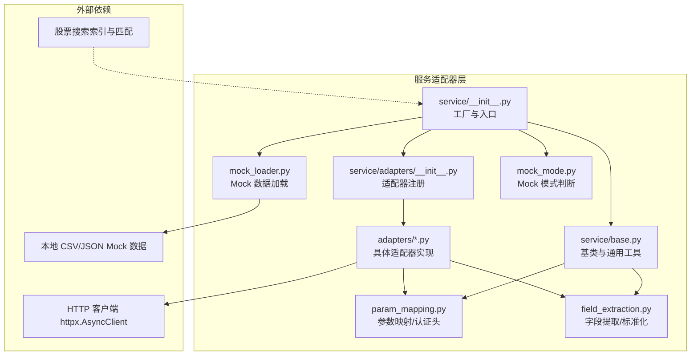
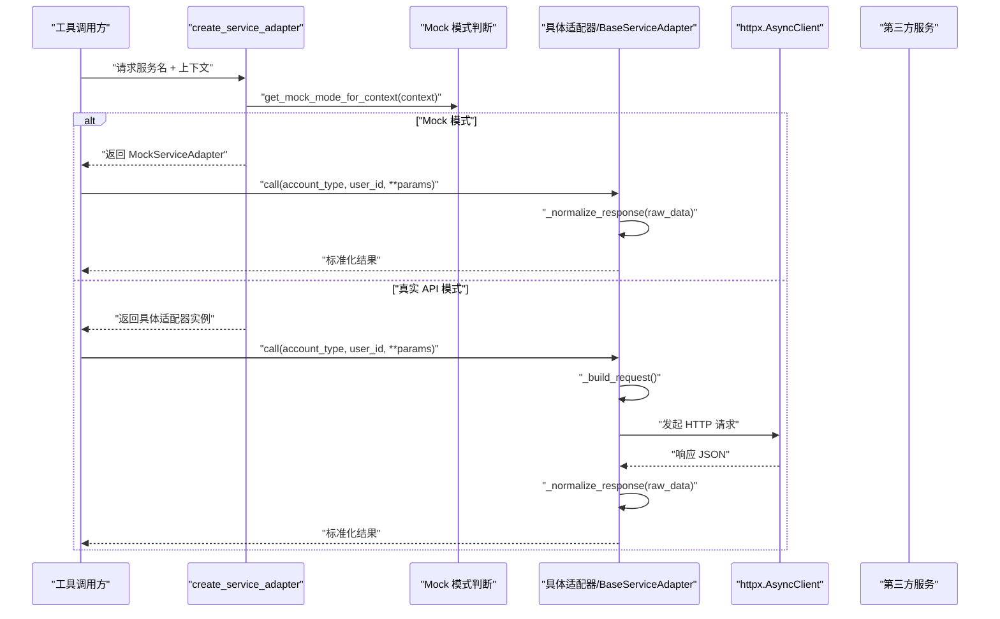
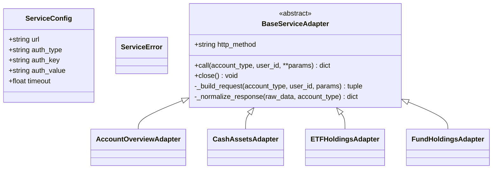
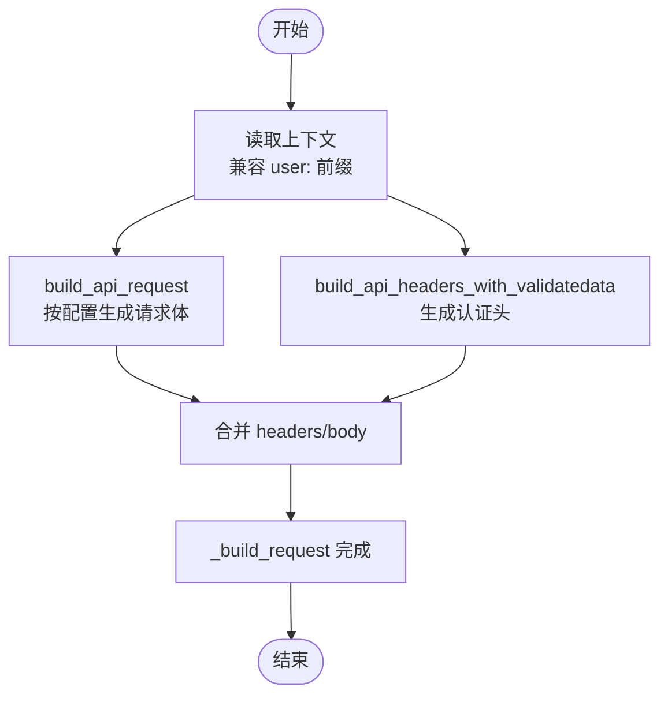
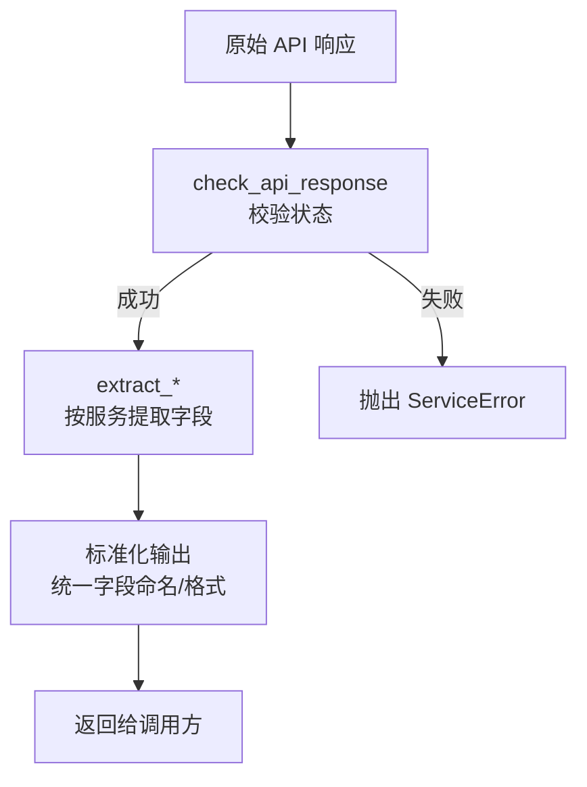
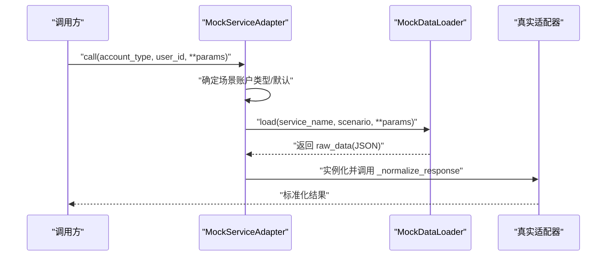
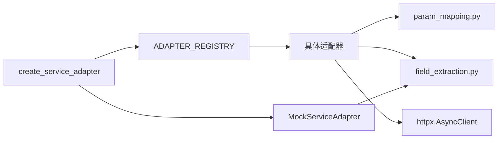

# 工具适配器

<cite>
**本文引用的文件**
- [src/ark_agentic/agents/securities/tools/service/__init__.py](file://src/ark_agentic/agents/securities/tools/service/__init__.py)
- [src/ark_agentic/agents/securities/tools/service/base.py](file://src/ark_agentic/agents/securities/tools/service/base.py)
- [src/ark_agentic/agents/securities/tools/service/adapters/__init__.py](file://src/ark_agentic/agents/securities/tools/service/adapters/__init__.py)
- [src/ark_agentic/agents/securities/tools/service/adapters/account_overview.py](file://src/ark_agentic/agents/securities/tools/service/adapters/account_overview.py)
- [src/ark_agentic/agents/securities/tools/service/adapters/cash_assets.py](file://src/ark_agentic/agents/securities/tools/service/adapters/cash_assets.py)
- [src/ark_agentic/agents/securities/tools/service/adapters/etf_holdings.py](file://src/ark_agentic/agents/securities/tools/service/adapters/etf_holdings.py)
- [src/ark_agentic/agents/securities/tools/service/adapters/fund_holdings.py](file://src/ark_agentic/agents/securities/tools/service/adapters/fund_holdings.py)
- [src/ark_agentic/agents/securities/tools/service/field_extraction.py](file://src/ark_agentic/agents/securities/tools/service/field_extraction.py)
- [src/ark_agentic/agents/securities/tools/service/param_mapping.py](file://src/ark_agentic/agents/securities/tools/service/param_mapping.py)
- [src/ark_agentic/agents/securities/tools/service/mock_loader.py](file://src/ark_agentic/agents/securities/tools/service/mock_loader.py)
- [src/ark_agentic/agents/securities/tools/service/mock_mode.py](file://src/ark_agentic/agents/securities/tools/service/mock_mode.py)
- [src/ark_agentic/agents/securities/tools/service/stock_search_service.py](file://src/ark_agentic/agents/securities/tools/service/stock_search_service.py)
- [src/ark_agentic/agents/securities/tools/service/stock_search/models.py](file://src/ark_agentic/agents/securities/tools/service/stock_search/models.py)
- [src/ark_agentic/agents/securities/tools/service/stock_search/__init__.py](file://src/ark_agentic/agents/securities/tools/service/stock_search/__init__.py)
- [tests/integration/test_mock_loader_and_service_adapter.py](file://tests/integration/test_mock_loader_and_service_adapter.py)
- [tests/unit/agents/securities/test_field_extraction.py](file://tests/unit/agents/securities/test_field_extraction.py)
- [tests/unit/agents/securities/test_param_mapping.py](file://tests/unit/agents/securities/test_param_mapping.py)
- [tests/unit/agents/securities/test_stock_info_search.py](file://tests/unit/agents/securities/test_stock_info_search.py)
</cite>

## 目录
1. [简介](#简介)
2. [项目结构](#项目结构)
3. [核心组件](#核心组件)
4. [架构总览](#架构总览)
5. [组件详解](#组件详解)
6. [依赖关系分析](#依赖关系分析)
7. [性能考量](#性能考量)
8. [故障排查指南](#故障排查指南)
9. [结论](#结论)
10. [附录](#附录)

## 简介
本文件面向 Ark-Agentic 工具适配器体系，系统性阐述其在“工具系统”中的适配器模式应用、第三方服务集成策略与数据转换机制。文档聚焦于证券类工具的适配层设计，涵盖：
- 抽象接口设计与具体适配器实现
- 参数映射与认证头构建
- 字段提取与数据标准化
- Mock 模式与环境配置
- 错误处理与异常映射
- 适配器开发指南、配置管理与测试策略
- 如何通过适配器模式实现服务解耦、支持多数据源与 API 接口标准化

## 项目结构
围绕“服务适配器”主题，核心目录与文件如下：
- 服务入口与工厂：service/__init__.py
- 基类与通用工具：service/base.py
- 适配器注册与实现：service/adapters/*
- 参数映射与认证：service/param_mapping.py
- 字段提取与标准化：service/field_extraction.py
- Mock 加载与模式：service/mock_loader.py, service/mock_mode.py
- 股票搜索服务：service/stock_search_service.py 与 stock_search/* 模型

图表来源
- [src/ark_agentic/agents/securities/tools/service/__init__.py:1-85](file://src/ark_agentic/agents/securities/tools/service/__init__.py#L1-L85)
- [src/ark_agentic/agents/securities/tools/service/base.py:1-212](file://src/ark_agentic/agents/securities/tools/service/base.py#L1-L212)
- [src/ark_agentic/agents/securities/tools/service/adapters/__init__.py:1-40](file://src/ark_agentic/agents/securities/tools/service/adapters/__init__.py#L1-L40)
- [src/ark_agentic/agents/securities/tools/service/param_mapping.py:1-479](file://src/ark_agentic/agents/securities/tools/service/param_mapping.py#L1-L479)
- [src/ark_agentic/agents/securities/tools/service/field_extraction.py:1-472](file://src/ark_agentic/agents/securities/tools/service/field_extraction.py#L1-L472)
- [src/ark_agentic/agents/securities/tools/service/mock_loader.py:1-178](file://src/ark_agentic/agents/securities/tools/service/mock_loader.py#L1-L178)
- [src/ark_agentic/agents/securities/tools/service/mock_mode.py:1-24](file://src/ark_agentic/agents/securities/tools/service/mock_mode.py#L1-L24)

章节来源
- [src/ark_agentic/agents/securities/tools/service/__init__.py:1-85](file://src/ark_agentic/agents/securities/tools/service/__init__.py#L1-L85)
- [src/ark_agentic/agents/securities/tools/service/base.py:1-212](file://src/ark_agentic/agents/securities/tools/service/base.py#L1-L212)

## 核心组件
- 服务配置与异常
  - ServiceConfig：封装 URL、认证方式、超时等
  - ServiceError：服务调用异常基类
- 适配器基类
  - BaseServiceAdapter：定义 call、_build_request、_normalize_response 抽象方法，内置 HTTP 客户端生命周期管理
- 适配器注册与工厂
  - ADAPTER_REGISTRY：服务名到适配器类的映射
  - create_service_adapter：按服务名与上下文选择真实 API 或 Mock 适配器
- 参数映射与认证
  - build_api_request/build_api_headers_with_validatedata：从上下文构建请求体与认证头
  - SERVICE_PARAM_CONFIGS/SERVICE_HEADER_CONFIGS：各服务参数与头配置注册表
- 字段提取与标准化
  - extract_*：针对不同服务的字段提取与格式化
  - SERVICE_FIELD_MAPPINGS：服务字段映射注册
- Mock 模式与数据加载
  - get_mock_mode/get_mock_mode_for_context：全局与会话级 Mock 判断
  - MockServiceAdapter/MockDataLoader：从本地 JSON 文件加载 Mock 数据，并复用真实适配器进行标准化

章节来源
- [src/ark_agentic/agents/securities/tools/service/base.py:14-212](file://src/ark_agentic/agents/securities/tools/service/base.py#L14-L212)
- [src/ark_agentic/agents/securities/tools/service/__init__.py:39-85](file://src/ark_agentic/agents/securities/tools/service/__init__.py#L39-L85)
- [src/ark_agentic/agents/securities/tools/service/adapters/__init__.py:14-40](file://src/ark_agentic/agents/securities/tools/service/adapters/__init__.py#L14-L40)
- [src/ark_agentic/agents/securities/tools/service/param_mapping.py:305-479](file://src/ark_agentic/agents/securities/tools/service/param_mapping.py#L305-L479)
- [src/ark_agentic/agents/securities/tools/service/field_extraction.py:436-472](file://src/ark_agentic/agents/securities/tools/service/field_extraction.py#L436-L472)
- [src/ark_agentic/agents/securities/tools/service/mock_loader.py:110-178](file://src/ark_agentic/agents/securities/tools/service/mock_loader.py#L110-L178)
- [src/ark_agentic/agents/securities/tools/service/mock_mode.py:7-24](file://src/ark_agentic/agents/securities/tools/service/mock_mode.py#L7-L24)

## 架构总览
适配器模式在此处的作用是将“工具调用”与“第三方服务细节”解耦。统一的 BaseServiceAdapter 规范了请求构建、认证、调用与响应标准化流程；具体适配器仅负责差异化部分（如请求体结构、认证头、字段提取）。工厂方法 create_service_adapter 根据 Mock 模式与环境变量动态选择真实适配器或 Mock 适配器。

图表来源
- [src/ark_agentic/agents/securities/tools/service/__init__.py:39-85](file://src/ark_agentic/agents/securities/tools/service/__init__.py#L39-L85)
- [src/ark_agentic/agents/securities/tools/service/base.py:55-136](file://src/ark_agentic/agents/securities/tools/service/base.py#L55-L136)
- [src/ark_agentic/agents/securities/tools/service/mock_mode.py:12-24](file://src/ark_agentic/agents/securities/tools/service/mock_mode.py#L12-L24)
- [src/ark_agentic/agents/securities/tools/service/mock_loader.py:118-178](file://src/ark_agentic/agents/securities/tools/service/mock_loader.py#L118-L178)

## 组件详解

### 抽象接口与工厂
- BaseServiceAdapter
  - 统一的异步调用入口：call(account_type, user_id, **params)
  - 请求构建：_build_request（默认 JSON + 认证头/体）
  - 响应标准化：_normalize_response（子类实现）
  - 异常映射：HTTPStatusError/RequestError 映射为 ServiceError
- 工厂 create_service_adapter
  - 依据上下文决定 Mock 或真实 API
  - 读取环境变量 SECURITIES_<SERVICE>_URL 等
  - 通过 ADAPTER_REGISTRY 获取适配器类并实例化

图表来源
- [src/ark_agentic/agents/securities/tools/service/base.py:14-136](file://src/ark_agentic/agents/securities/tools/service/base.py#L14-L136)
- [src/ark_agentic/agents/securities/tools/service/adapters/account_overview.py:15-61](file://src/ark_agentic/agents/securities/tools/service/adapters/account_overview.py#L15-L61)
- [src/ark_agentic/agents/securities/tools/service/adapters/cash_assets.py:15-61](file://src/ark_agentic/agents/securities/tools/service/adapters/cash_assets.py#L15-L61)
- [src/ark_agentic/agents/securities/tools/service/adapters/etf_holdings.py:15-58](file://src/ark_agentic/agents/securities/tools/service/adapters/etf_holdings.py#L15-L58)
- [src/ark_agentic/agents/securities/tools/service/adapters/fund_holdings.py:18-75](file://src/ark_agentic/agents/securities/tools/service/adapters/fund_holdings.py#L18-L75)

章节来源
- [src/ark_agentic/agents/securities/tools/service/base.py:38-136](file://src/ark_agentic/agents/securities/tools/service/base.py#L38-L136)
- [src/ark_agentic/agents/securities/tools/service/__init__.py:39-85](file://src/ark_agentic/agents/securities/tools/service/__init__.py#L39-L85)

### 参数映射与认证头
- build_api_request
  - 支持静态值、上下文取值、转换函数三类来源
  - 支持 user: 前缀与裸键兼容（优先 user:）
  - 支持点号路径构造嵌套请求体
- build_api_headers_with_validatedata
  - 统一的 validatedata + signature 认证头构建
- SERVICE_PARAM_CONFIGS/SERVICE_HEADER_CONFIGS
  - 注册各服务的参数与头配置，覆盖账户类型转换、默认 limit 等
- require_context_fields
  - 在非 Mock 模式下校验上下文必需字段，缺失时报错

图表来源
- [src/ark_agentic/agents/securities/tools/service/param_mapping.py:38-118](file://src/ark_agentic/agents/securities/tools/service/param_mapping.py#L38-L118)
- [src/ark_agentic/agents/securities/tools/service/param_mapping.py:256-303](file://src/ark_agentic/agents/securities/tools/service/param_mapping.py#L256-L303)
- [src/ark_agentic/agents/securities/tools/service/base.py:106-122](file://src/ark_agentic/agents/securities/tools/service/base.py#L106-L122)

章节来源
- [src/ark_agentic/agents/securities/tools/service/param_mapping.py:13-303](file://src/ark_agentic/agents/securities/tools/service/param_mapping.py#L13-L303)
- [src/ark_agentic/agents/securities/tools/service/base.py:138-160](file://src/ark_agentic/agents/securities/tools/service/base.py#L138-L160)

### 字段提取与数据标准化
- extract_* 函数族
  - 针对账户总览、现金资产、ETF 持仓、港股通持仓、资产历史收益曲线、股票每日收益明细、股票盈亏排行等服务
  - 支持点号路径提取与列表项映射
- SERVICE_FIELD_MAPPINGS
  - 服务字段映射注册，便于统一管理
- check_api_response
  - 校验 API 返回状态，失败抛出 ServiceError

图表来源
- [src/ark_agentic/agents/securities/tools/service/field_extraction.py:12-124](file://src/ark_agentic/agents/securities/tools/service/field_extraction.py#L12-L124)
- [src/ark_agentic/agents/securities/tools/service/field_extraction.py:350-391](file://src/ark_agentic/agents/securities/tools/service/field_extraction.py#L350-L391)
- [src/ark_agentic/agents/securities/tools/service/base.py:202-212](file://src/ark_agentic/agents/securities/tools/service/base.py#L202-L212)

章节来源
- [src/ark_agentic/agents/securities/tools/service/field_extraction.py:61-472](file://src/ark_agentic/agents/securities/tools/service/field_extraction.py#L61-L472)
- [src/ark_agentic/agents/securities/tools/service/base.py:202-212](file://src/ark_agentic/agents/securities/tools/service/base.py#L202-L212)

### Mock 模式与数据加载
- MockServiceAdapter
  - 从本地 JSON 文件加载 Mock 数据
  - 根据服务类型与账户类型选择场景文件
  - 复用真实适配器进行字段提取与标准化
- MockDataLoader
  - 支持按 security_code、场景名、默认文件顺序查找
  - 目录不存在时自动创建并告警
- get_mock_mode/get_mock_mode_for_context
  - 服务级默认与会话级覆盖优先级

图表来源
- [src/ark_agentic/agents/securities/tools/service/mock_loader.py:110-178](file://src/ark_agentic/agents/securities/tools/service/mock_loader.py#L110-L178)
- [src/ark_agentic/agents/securities/tools/service/mock_mode.py:12-24](file://src/ark_agentic/agents/securities/tools/service/mock_mode.py#L12-L24)

章节来源
- [src/ark_agentic/agents/securities/tools/service/mock_loader.py:17-178](file://src/ark_agentic/agents/securities/tools/service/mock_loader.py#L17-L178)
- [src/ark_agentic/agents/securities/tools/service/mock_mode.py:7-24](file://src/ark_agentic/agents/securities/tools/service/mock_mode.py#L7-L24)

### 具体适配器实现示例
- 账户总览 AccountOverviewAdapter
  - 使用 validatedata + signature 认证
  - 通过 extract_account_overview 标准化
- 现金资产 CashAssetsAdapter
  - 同上认证方式，提取现金相关字段并补结算日
- ETF 持仓 ETFHoldingsAdapter
  - 与账户类不同请求体结构，认证头相同
- 基金理财持仓 FundHoldingsAdapter
  - HTTP GET，query 参数，使用 FundHoldingsSchema 校验后再提取

章节来源
- [src/ark_agentic/agents/securities/tools/service/adapters/account_overview.py:15-61](file://src/ark_agentic/agents/securities/tools/service/adapters/account_overview.py#L15-L61)
- [src/ark_agentic/agents/securities/tools/service/adapters/cash_assets.py:15-61](file://src/ark_agentic/agents/securities/tools/service/adapters/cash_assets.py#L15-L61)
- [src/ark_agentic/agents/securities/tools/service/adapters/etf_holdings.py:15-58](file://src/ark_agentic/agents/securities/tools/service/adapters/etf_holdings.py#L15-L58)
- [src/ark_agentic/agents/securities/tools/service/adapters/fund_holdings.py:18-75](file://src/ark_agentic/agents/securities/tools/service/adapters/fund_holdings.py#L18-L75)

### 股票搜索服务
- StockSearchService
  - 进程内单例 StockLoader + MultiPathMatcher
  - 支持按代码/名称/拼音检索，可选附加分红信息
  - 日志记录匹配耗时与结果

章节来源
- [src/ark_agentic/agents/securities/tools/service/stock_search_service.py:32-84](file://src/ark_agentic/agents/securities/tools/service/stock_search_service.py#L32-L84)
- [src/ark_agentic/agents/securities/tools/service/stock_search/models.py:103-136](file://src/ark_agentic/agents/securities/tools/service/stock_search/models.py#L103-L136)
- [src/ark_agentic/agents/securities/tools/service/stock_search/__init__.py:1-16](file://src/ark_agentic/agents/securities/tools/service/stock_search/__init__.py#L1-L16)

## 依赖关系分析
- 低耦合高内聚
  - BaseServiceAdapter 与具体适配器通过抽象方法解耦
  - 参数映射与字段提取模块化，便于扩展新服务
- 关键依赖链
  - 工厂 → 适配器注册 → 适配器 → 参数映射/字段提取 → HTTP 客户端
  - Mock 模式下绕过 HTTP，直接走字段提取路径
- 循环依赖风险
  - MockServiceAdapter 在 _normalize_response 中动态导入适配器类，避免循环导入

图表来源
- [src/ark_agentic/agents/securities/tools/service/__init__.py:39-85](file://src/ark_agentic/agents/securities/tools/service/__init__.py#L39-L85)
- [src/ark_agentic/agents/securities/tools/service/adapters/__init__.py:14-40](file://src/ark_agentic/agents/securities/tools/service/adapters/__init__.py#L14-L40)
- [src/ark_agentic/agents/securities/tools/service/base.py:55-136](file://src/ark_agentic/agents/securities/tools/service/base.py#L55-L136)
- [src/ark_agentic/agents/securities/tools/service/mock_loader.py:142-178](file://src/ark_agentic/agents/securities/tools/service/mock_loader.py#L142-L178)

章节来源
- [src/ark_agentic/agents/securities/tools/service/__init__.py:39-85](file://src/ark_agentic/agents/securities/tools/service/__init__.py#L39-L85)
- [src/ark_agentic/agents/securities/tools/service/base.py:55-136](file://src/ark_agentic/agents/securities/tools/service/base.py#L55-L136)

## 性能考量
- HTTP 客户端复用
  - BaseServiceAdapter 内部维护 AsyncClient 生命周期，减少连接开销
- Mock 模式优化
  - Mock 模式下避免网络请求，直接从本地文件读取，适合快速迭代与回归测试
- 进程内缓存
  - 股票搜索服务使用进程内单例 Loader，避免重复 IO
- 建议
  - 对高频调用的服务启用 Mock 进行压测
  - 控制字段提取与转换逻辑复杂度，避免在热路径做重型计算

## 故障排查指南
- 常见错误与定位
  - 缺少环境变量 SECURITIES_<SERVICE>_URL：检查环境配置
  - 缺少上下文字段：在非 Mock 模式下 require_context_fields 会报错
  - API 返回状态非 1：check_api_response 抛出 ServiceError
  - HTTP 请求异常：ServiceError 包装 httpx 异常并记录 payload 与响应摘要
- Mock 数据问题
  - Mock 目录不存在或文件缺失：MockDataLoader 会告警并返回 error 字段
  - 场景选择：根据账户类型自动选择 normal_user/margin_user
- 调试建议
  - 开启日志查看请求与响应摘要
  - 使用 Mock 模式隔离第三方服务波动影响

章节来源
- [src/ark_agentic/agents/securities/tools/service/__init__.py:65-79](file://src/ark_agentic/agents/securities/tools/service/__init__.py#L65-L79)
- [src/ark_agentic/agents/securities/tools/service/base.py:79-101](file://src/ark_agentic/agents/securities/tools/service/base.py#L79-L101)
- [src/ark_agentic/agents/securities/tools/service/base.py:202-212](file://src/ark_agentic/agents/securities/tools/service/base.py#L202-L212)
- [src/ark_agentic/agents/securities/tools/service/mock_loader.py:67-71](file://src/ark_agentic/agents/securities/tools/service/mock_loader.py#L67-L71)

## 结论
通过适配器模式，Ark-Agentic 将“工具调用”与“第三方服务细节”解耦，实现了：
- 服务解耦：新增服务只需实现适配器与参数/字段配置
- 多数据源支持：统一 Mock 与真实 API 路径
- API 接口标准化：统一的请求构建、认证与响应标准化流程
- 易于测试与维护：Mock 模式、参数映射与字段提取模块化

## 附录

### 适配器开发指南
- 新增服务步骤
  - 在 adapters/__init__.py 中注册服务名到适配器类
  - 实现具体适配器类，重写 _build_request/_normalize_response
  - 在 param_mapping.py 中完善 SERVICE_PARAM_CONFIGS/SERVICE_HEADER_CONFIGS
  - 在 field_extraction.py 中完善字段映射与提取逻辑
  - 在 tests 中编写单元/集成测试
- 认证与参数
  - 优先使用 validatedata + signature 方案
  - 使用 _get_context_value 兼容 user: 前缀与裸键
- Mock 数据
  - 在 mock_data/<service> 下准备 default.json 与场景文件
  - 在 MockServiceAdapter 中确认场景选择逻辑

章节来源
- [src/ark_agentic/agents/securities/tools/service/adapters/__init__.py:14-40](file://src/ark_agentic/agents/securities/tools/service/adapters/__init__.py#L14-L40)
- [src/ark_agentic/agents/securities/tools/service/param_mapping.py:305-435](file://src/ark_agentic/agents/securities/tools/service/param_mapping.py#L305-L435)
- [src/ark_agentic/agents/securities/tools/service/field_extraction.py:436-472](file://src/ark_agentic/agents/securities/tools/service/field_extraction.py#L436-L472)
- [src/ark_agentic/agents/securities/tools/service/mock_loader.py:31-71](file://src/ark_agentic/agents/securities/tools/service/mock_loader.py#L31-L71)

### 配置管理
- 环境变量
  - SECURITIES_<SERVICE>_URL：服务地址
  - SECURITIES_<SERVICE>_AUTH_TYPE/AUTH_KEY/AUTH_VALUE：认证方式与凭据
  - SECURITIES_SERVICE_MOCK：服务级默认 Mock 开关
  - STOCKS_CSV_PATH：股票搜索 CSV 路径
- 上下文字段
  - validatedata、signature、token_id、account_type 等
  - 支持 user: 前缀与裸键

章节来源
- [src/ark_agentic/agents/securities/tools/service/__init__.py:65-78](file://src/ark_agentic/agents/securities/tools/service/__init__.py#L65-L78)
- [src/ark_agentic/agents/securities/tools/service/param_mapping.py:210-235](file://src/ark_agentic/agents/securities/tools/service/param_mapping.py#L210-L235)
- [src/ark_agentic/agents/securities/tools/service/stock_search_service.py:27-29](file://src/ark_agentic/agents/securities/tools/service/stock_search_service.py#L27-L29)

### 测试策略
- 单元测试
  - 参数映射：验证 build_api_request/build_api_headers_with_validatedata 行为
  - 字段提取：验证 extract_* 的映射与格式化
  - 股票搜索：验证匹配与分红附加逻辑
- 集成测试
  - Mock 加载与适配器：验证 MockServiceAdapter 正常工作
- 建议
  - 为每个服务编写至少一个 Mock 场景
  - 覆盖边界条件（缺字段、空数据、格式错误）

章节来源
- [tests/unit/agents/securities/test_param_mapping.py](file://tests/unit/agents/securities/test_param_mapping.py)
- [tests/unit/agents/securities/test_field_extraction.py](file://tests/unit/agents/securities/test_field_extraction.py)
- [tests/unit/agents/securities/test_stock_info_search.py](file://tests/unit/agents/securities/test_stock_info_search.py)
- [tests/integration/test_mock_loader_and_service_adapter.py](file://tests/integration/test_mock_loader_and_service_adapter.py)