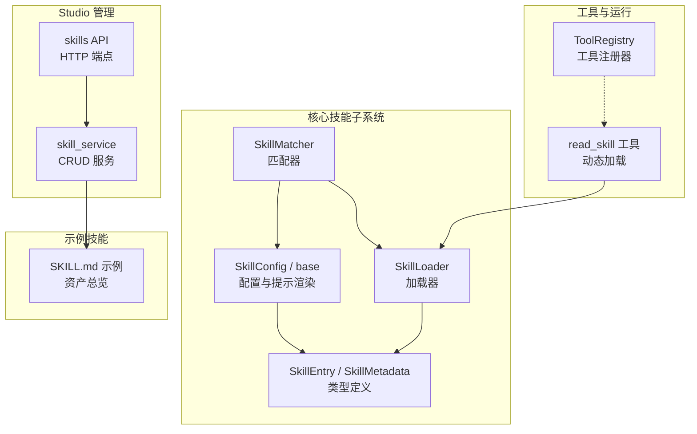
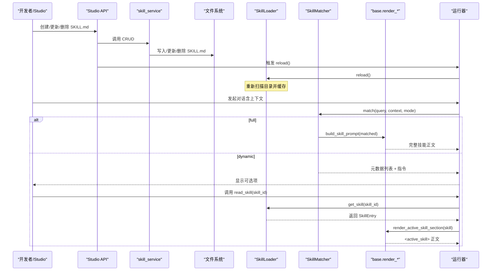
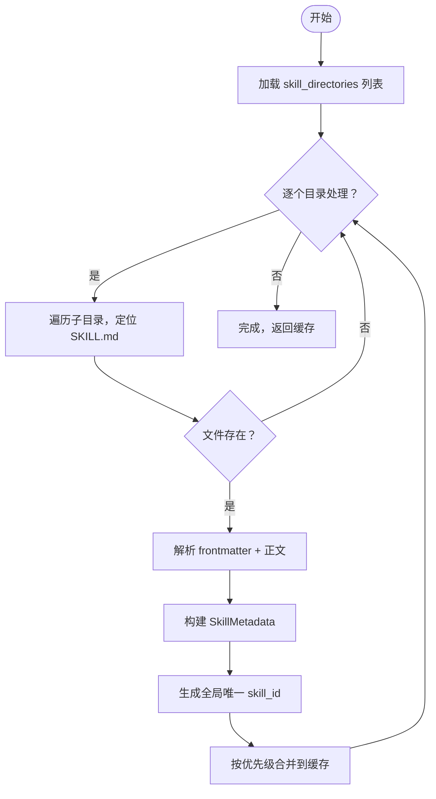
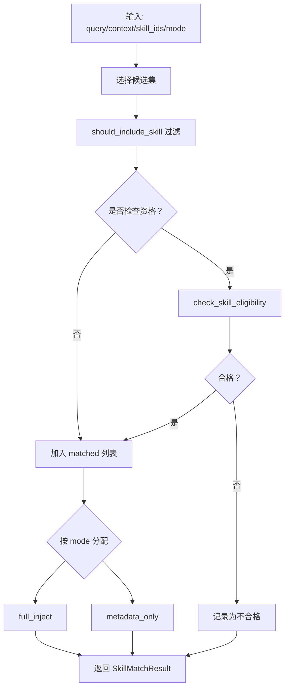
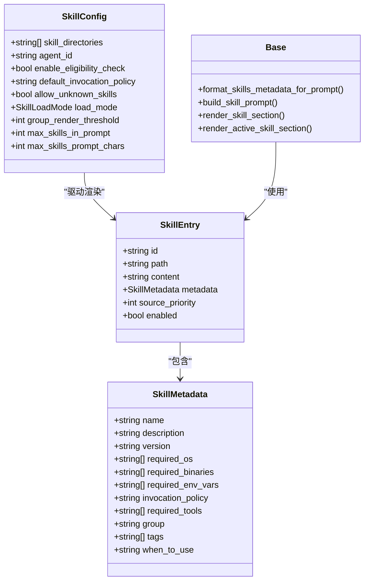
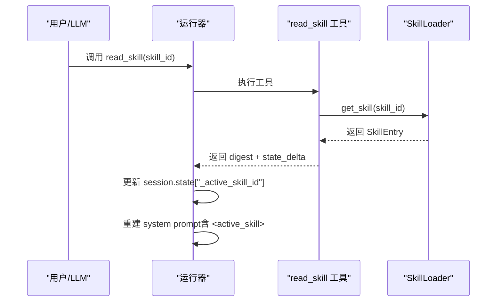
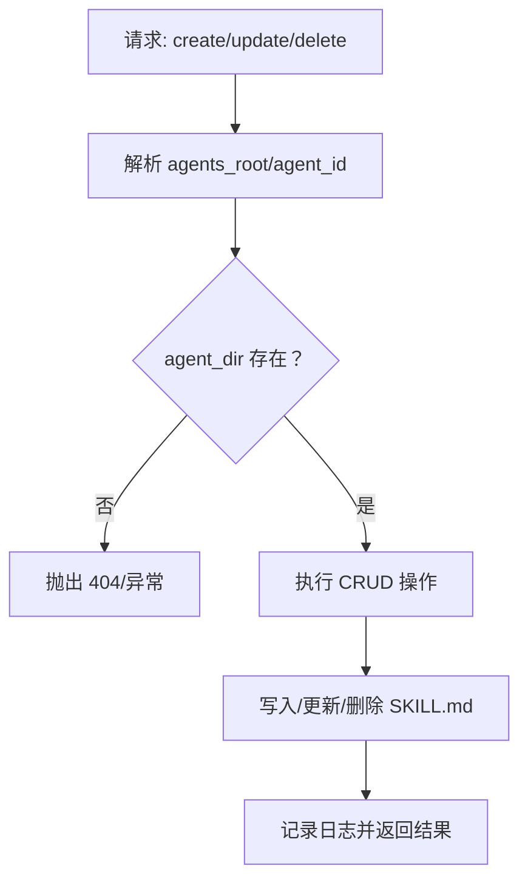
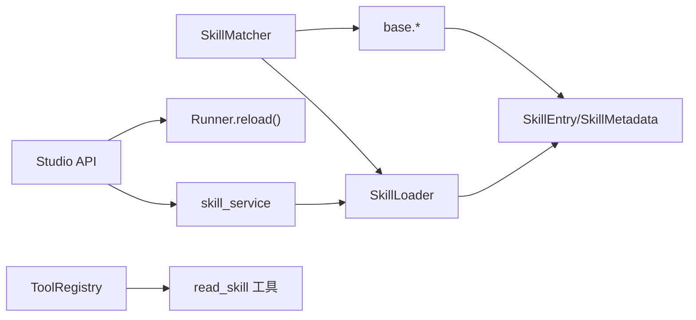

# 技能系统

<cite>
**本文引用的文件**
- [src/ark_agentic/core/skills/__init__.py](file://src/ark_agentic/core/skills/__init__.py)
- [src/ark_agentic/core/skills/base.py](file://src/ark_agentic/core/skills/base.py)
- [src/ark_agentic/core/skills/loader.py](file://src/ark_agentic/core/skills/loader.py)
- [src/ark_agentic/core/skills/matcher.py](file://src/ark_agentic/core/skills/matcher.py)
- [src/ark_agentic/core/tokens.py](file://src/ark_agentic/core/tokens.py)
- [src/ark_agentic/core/types.py](file://src/ark_agentic/core/types.py)
- [src/ark_agentic/core/utils/env.py](file://src/ark_agentic/core/utils/env.py)
- [src/ark_agentic/studio/services/skill_service.py](file://src/ark_agentic/studio/services/skill_service.py)
- [src/ark_agentic/studio/api/skills.py](file://src/ark_agentic/studio/api/skills.py)
- [src/ark_agentic/core/tools/read_skill.py](file://src/ark_agentic/core/tools/read_skill.py)
- [src/ark_agentic/core/tools/registry.py](file://src/ark_agentic/core/tools/registry.py)
- [src/ark_agentic/agents/securities/skills/asset_overview/SKILL.md](file://src/ark_agentic/agents/securities/skills/asset_overview/SKILL.md)
- [tests/unit/core/test_skills.py](file://tests/unit/core/test_skills.py)
- [tests/unit/core/test_runner_skill_load_mode.py](file://tests/unit/core/test_runner_skill_load_mode.py)
</cite>

## 目录
1. [简介](#简介)
2. [项目结构](#项目结构)
3. [核心组件](#核心组件)
4. [架构总览](#架构总览)
5. [详细组件分析](#详细组件分析)
6. [依赖分析](#依赖分析)
7. [性能考虑](#性能考虑)
8. [故障排查指南](#故障排查指南)
9. [结论](#结论)
10. [附录](#附录)

## 简介
本文件面向 Ark-Agentic 技能系统，提供从底层加载机制、匹配算法、配置管理到动态技能开发的完整技术文档。内容涵盖：
- 技能发现、解析、缓存与版本管理
- 技能匹配与资格检查策略
- 动态加载与 full/dynamic 两种注入模式
- 技能接口规范、配置文件格式与加载策略
- 开发指南与调试技巧

## 项目结构
技能系统位于 core/skills 子模块，并与工具注册、运行器、Studio 管理界面协同工作。关键文件与职责如下：
- core/skills：技能加载、匹配、提示渲染
- core/types：技能与运行期类型定义
- core/utils/env：环境与路径解析
- studio/services：技能 CRUD 服务
- studio/api：技能 API 端点
- core/tools：工具注册与 read_skill 动态加载工具
- agents/*/skills/*：技能示例与实际实现

**图表来源**
- [src/ark_agentic/core/skills/loader.py:25-177](file://src/ark_agentic/core/skills/loader.py#L25-L177)
- [src/ark_agentic/core/skills/matcher.py:55-152](file://src/ark_agentic/core/skills/matcher.py#L55-L152)
- [src/ark_agentic/core/skills/base.py:19-344](file://src/ark_agentic/core/skills/base.py#L19-L344)
- [src/ark_agentic/core/types.py:243-308](file://src/ark_agentic/core/types.py#L243-L308)
- [src/ark_agentic/core/tools/registry.py:14-178](file://src/ark_agentic/core/tools/registry.py#L14-L178)
- [src/ark_agentic/core/tools/read_skill.py:51-75](file://src/ark_agentic/core/tools/read_skill.py#L51-L75)
- [src/ark_agentic/studio/services/skill_service.py:42-289](file://src/ark_agentic/studio/services/skill_service.py#L42-L289)
- [src/ark_agentic/studio/api/skills.py:57-113](file://src/ark_agentic/studio/api/skills.py#L57-L113)
- [src/ark_agentic/agents/securities/skills/asset_overview/SKILL.md:1-186](file://src/ark_agentic/agents/securities/skills/asset_overview/SKILL.md#L1-L186)

**章节来源**
- [src/ark_agentic/core/skills/__init__.py:1-17](file://src/ark_agentic/core/skills/__init__.py#L1-L17)
- [src/ark_agentic/core/skills/base.py:1-344](file://src/ark_agentic/core/skills/base.py#L1-L344)
- [src/ark_agentic/core/skills/loader.py:1-177](file://src/ark_agentic/core/skills/loader.py#L1-L177)
- [src/ark_agentic/core/skills/matcher.py:1-152](file://src/ark_agentic/core/skills/matcher.py#L1-L152)
- [src/ark_agentic/core/types.py:243-308](file://src/ark_agentic/core/types.py#L243-L308)
- [src/ark_agentic/core/utils/env.py:1-59](file://src/ark_agentic/core/utils/env.py#L1-L59)
- [src/ark_agentic/studio/services/skill_service.py:1-289](file://src/ark_agentic/studio/services/skill_service.py#L1-L289)
- [src/ark_agentic/studio/api/skills.py:1-113](file://src/ark_agentic/studio/api/skills.py#L1-L113)
- [src/ark_agentic/core/tools/read_skill.py:51-75](file://src/ark_agentic/core/tools/read_skill.py#L51-L75)
- [src/ark_agentic/core/tools/registry.py:1-178](file://src/ark_agentic/core/tools/registry.py#L1-L178)
- [src/ark_agentic/agents/securities/skills/asset_overview/SKILL.md:1-186](file://src/ark_agentic/agents/securities/skills/asset_overview/SKILL.md#L1-L186)

## 核心组件
- SkillLoader：从多个目录扫描 SKILL.md，解析 YAML frontmatter，构建 SkillEntry，支持优先级覆盖与缓存。
- SkillMatcher：根据策略与资格过滤候选技能，按 load_mode 分配 full_inject 与 metadata_only。
- SkillConfig 与 base：配置项、预算控制、XML 渲染、动态模式提示与 active_skill 段落。
- 类型系统：SkillEntry、SkillMetadata、SkillLoadMode 等。
- 工具集成：ToolRegistry 管理工具；read_skill 工具用于动态加载技能正文。
- Studio 服务：skill_service 提供 CRUD；skills API 调用服务并触发缓存刷新。

**章节来源**
- [src/ark_agentic/core/skills/base.py:19-344](file://src/ark_agentic/core/skills/base.py#L19-L344)
- [src/ark_agentic/core/skills/loader.py:25-177](file://src/ark_agentic/core/skills/loader.py#L25-L177)
- [src/ark_agentic/core/skills/matcher.py:55-152](file://src/ark_agentic/core/skills/matcher.py#L55-L152)
- [src/ark_agentic/core/types.py:243-308](file://src/ark_agentic/core/types.py#L243-L308)
- [src/ark_agentic/core/tools/registry.py:14-178](file://src/ark_agentic/core/tools/registry.py#L14-L178)
- [src/ark_agentic/core/tools/read_skill.py:51-75](file://src/ark_agentic/core/tools/read_skill.py#L51-L75)
- [src/ark_agentic/studio/services/skill_service.py:42-289](file://src/ark_agentic/studio/services/skill_service.py#L42-L289)
- [src/ark_agentic/studio/api/skills.py:57-113](file://src/ark_agentic/studio/api/skills.py#L57-L113)

## 架构总览
技能系统围绕“发现—解析—缓存—匹配—注入”的流水线工作，支持 full 与 dynamic 两种注入模式：
- full：将技能正文注入 system prompt，适合稳定、可控的技能集。
- dynamic：仅注入元数据与指令，由 LLM 通过 read_skill 按需加载正文，适合动态扩展与隐私保护。

**图表来源**
- [src/ark_agentic/studio/api/skills.py:57-113](file://src/ark_agentic/studio/api/skills.py#L57-L113)
- [src/ark_agentic/studio/services/skill_service.py:42-289](file://src/ark_agentic/studio/services/skill_service.py#L42-L289)
- [src/ark_agentic/core/skills/loader.py:168-177](file://src/ark_agentic/core/skills/loader.py#L168-L177)
- [src/ark_agentic/core/skills/matcher.py:64-136](file://src/ark_agentic/core/skills/matcher.py#L64-L136)
- [src/ark_agentic/core/skills/base.py:282-344](file://src/ark_agentic/core/skills/base.py#L282-L344)
- [src/ark_agentic/core/tools/read_skill.py:51-75](file://src/ark_agentic/core/tools/read_skill.py#L51-L75)

## 详细组件分析

### 技能加载机制（SkillLoader）
- 发现与解析
  - 遍历配置的 skill_directories，按优先级顺序扫描每个目录下的子目录，若存在 SKILL.md 则加载。
  - 使用正则解析 YAML frontmatter，构建 SkillMetadata；正文去除 frontmatter 后保存。
  - 生成全局唯一 skill_id：agent_id.skill_name（若配置了 agent_id）。
- 优先级与覆盖
  - 目录按顺序处理，后序目录中相同 ID 的技能会覆盖前者（比较 source_priority）。
- 缓存与查询
  - 内部维护 {id: SkillEntry} 缓存，提供 get_skill/list_skills/list_skill_ids/reload。
- 错误处理
  - 目录不存在、frontmatter 解析失败、文件读取异常均记录日志并跳过。

**图表来源**
- [src/ark_agentic/core/skills/loader.py:35-107](file://src/ark_agentic/core/skills/loader.py#L35-L107)

**章节来源**
- [src/ark_agentic/core/skills/loader.py:25-177](file://src/ark_agentic/core/skills/loader.py#L25-L177)

### 技能匹配算法（SkillMatcher）
- 过滤步骤
  - should_include_skill：依据 invocation_policy 与上下文（如 manual 需要 requested_skills）决定是否包含。
  - check_skill_eligibility：检查 required_os、required_binaries、required_env_vars、required_tools（来自 context）。
- 分配策略
  - 若 skill_load_mode == "full"：全部进入 full_inject。
  - 否则：全部进入 metadata_only。
- 结果结构
  - SkillMatchResult：full_inject、metadata_only、ineligible_skills、excluded_skills；matched_skills 为二者并集。

**图表来源**
- [src/ark_agentic/core/skills/matcher.py:64-126](file://src/ark_agentic/core/skills/matcher.py#L64-L126)
- [src/ark_agentic/core/skills/base.py:104-138](file://src/ark_agentic/core/skills/base.py#L104-L138)

**章节来源**
- [src/ark_agentic/core/skills/matcher.py:27-152](file://src/ark_agentic/core/skills/matcher.py#L27-L152)
- [src/ark_agentic/core/skills/base.py:51-138](file://src/ark_agentic/core/skills/base.py#L51-L138)

### 配置管理与提示渲染（SkillConfig 与 base）
- 配置项
  - skill_directories：目录优先级列表
  - agent_id：用于生成全局唯一 skill id
  - enable_eligibility_check、default_invocation_policy、allow_unknown_skills
  - load_mode：full/dynamic
  - group_render_threshold、max_skills_in_prompt、max_skills_prompt_chars：预算与分组阈值
- 提示渲染
  - format_skills_metadata_for_prompt：按阈值选择扁平或分组 XML，应用数量与字符预算。
  - build_skill_prompt：full 模式下将每个技能包裹在 <skill> 标签内。
  - render_skill_section：根据 load_mode 决定返回完整正文还是仅元数据+指令。
  - render_active_skill_section：动态模式下渲染当前激活技能的 <active_skill> 段落。

**图表来源**
- [src/ark_agentic/core/skills/base.py:19-344](file://src/ark_agentic/core/skills/base.py#L19-L344)
- [src/ark_agentic/core/types.py:243-308](file://src/ark_agentic/core/types.py#L243-L308)

**章节来源**
- [src/ark_agentic/core/skills/base.py:19-344](file://src/ark_agentic/core/skills/base.py#L19-L344)
- [src/ark_agentic/core/types.py:243-308](file://src/ark_agentic/core/types.py#L243-L308)

### 动态技能开发与 read_skill
- 动态模式要点
  - 仅注入元数据与“先读取再调用”的指令；LLM 通过 read_skill(skill_id) 请求加载正文。
  - 运行器根据 session.state['\_active\_skill\_id'] 渲染 <active\_skill> 段落，工具可见性也随 active 技能变化。
- read_skill 工具
  - 参数：skill_id（非空）
  - 行为：校验 ID，返回 digest 并携带 state\_delta 更新 \_active\_skill\_id
- Studio 与缓存刷新
  - Studio API 在 CRUD 后调用 Runner 的 reload()，确保缓存与文件系统一致。

**图表来源**
- [src/ark_agentic/core/tools/read_skill.py:51-75](file://src/ark_agentic/core/tools/read_skill.py#L51-L75)
- [src/ark_agentic/core/skills/loader.py:156-158](file://src/ark_agentic/core/skills/loader.py#L156-L158)
- [src/ark_agentic/studio/api/skills.py:44-53](file://src/ark_agentic/studio/api/skills.py#L44-L53)

**章节来源**
- [src/ark_agentic/core/tools/read_skill.py:51-75](file://src/ark_agentic/core/tools/read_skill.py#L51-L75)
- [src/ark_agentic/studio/api/skills.py:44-53](file://src/ark_agentic/studio/api/skills.py#L44-L53)

### Studio 技能管理（CRUD 与版本）
- 路径解析
  - get_agents_root：优先环境变量，其次向上查找 pyproject.toml，回退策略定位 agents 根。
  - resolve_agent_dir：安全解析 agent 子目录，防止路径穿越。
- CRUD 服务
  - list_skills：扫描 agents_root/agent_id/skills，解析 SKILL.md 生成 SkillMeta。
  - create_skill：生成目录与 SKILL.md（含 frontmatter），支持自动生成默认正文。
  - update_skill：可只更新 frontmatter 或完整替换（若 content 以 --- 开头则视为完整 frontmatter+body）。
  - delete_skill：安全删除，路径穿越检测。
- 版本与元数据
  - frontmatter 支持 name/description/version/invocation_policy/group/tags/required_tools 等字段。
  - when_to_use 合并进 description，便于策略与资格判断。

**图表来源**
- [src/ark_agentic/studio/services/skill_service.py:42-289](file://src/ark_agentic/studio/services/skill_service.py#L42-L289)
- [src/ark_agentic/core/utils/env.py:9-59](file://src/ark_agentic/core/utils/env.py#L9-L59)

**章节来源**
- [src/ark_agentic/studio/services/skill_service.py:42-289](file://src/ark_agentic/studio/services/skill_service.py#L42-L289)
- [src/ark_agentic/core/utils/env.py:9-59](file://src/ark_agentic/core/utils/env.py#L9-L59)

### 技能接口规范与配置文件格式
- 文件位置与命名
  - 每个技能为 agents/<agent_id>/skills/<skill_id>/SKILL.md
- Frontmatter 字段
  - 必填：name
  - 常用：description、version、invocation_policy、group、tags、required_tools
  - 环境：required_os、required_binaries、required_env_vars
  - when_to_use：简述“何时使用”，将被合并进 description
- 内容结构
  - 建议包含：核心职责、触发关键词、意图与工具映射、路由边界、工具契约、执行流程、输出策略、错误处理、性能与安全约束
- 示例参考
  - 资产总览技能示例展示了完整 frontmatter 与正文结构

**章节来源**
- [src/ark_agentic/agents/securities/skills/asset_overview/SKILL.md:1-186](file://src/ark_agentic/agents/securities/skills/asset_overview/SKILL.md#L1-L186)
- [src/ark_agentic/studio/services/skill_service.py:187-207](file://src/ark_agentic/studio/services/skill_service.py#L187-L207)

## 依赖分析
- 组件耦合
  - SkillLoader 与 SkillEntry/SkillMetadata 强关联，负责数据源与缓存。
  - SkillMatcher 依赖 SkillLoader 与 base 工具（资格检查、提示构建）。
  - 动态模式依赖 ToolRegistry 与 read_skill 工具，配合运行器状态管理。
  - Studio 服务与 API 依赖 SkillLoader 的 reload 以保持缓存一致性。
- 外部依赖
  - YAML 解析（frontmatter）
  - 文件系统（SKILL.md）
  - 日志记录（warning/error）

**图表来源**
- [src/ark_agentic/core/skills/loader.py:25-177](file://src/ark_agentic/core/skills/loader.py#L25-L177)
- [src/ark_agentic/core/skills/matcher.py:55-152](file://src/ark_agentic/core/skills/matcher.py#L55-L152)
- [src/ark_agentic/core/skills/base.py:19-344](file://src/ark_agentic/core/skills/base.py#L19-L344)
- [src/ark_agentic/core/tools/registry.py:14-178](file://src/ark_agentic/core/tools/registry.py#L14-L178)
- [src/ark_agentic/core/tools/read_skill.py:51-75](file://src/ark_agentic/core/tools/read_skill.py#L51-L75)
- [src/ark_agentic/studio/api/skills.py:57-113](file://src/ark_agentic/studio/api/skills.py#L57-L113)
- [src/ark_agentic/studio/services/skill_service.py:42-289](file://src/ark_agentic/studio/services/skill_service.py#L42-L289)

**章节来源**
- [src/ark_agentic/core/skills/loader.py:25-177](file://src/ark_agentic/core/skills/loader.py#L25-L177)
- [src/ark_agentic/core/skills/matcher.py:55-152](file://src/ark_agentic/core/skills/matcher.py#L55-L152)
- [src/ark_agentic/core/skills/base.py:19-344](file://src/ark_agentic/core/skills/base.py#L19-L344)
- [src/ark_agentic/core/tools/registry.py:14-178](file://src/ark_agentic/core/tools/registry.py#L14-L178)
- [src/ark_agentic/core/tools/read_skill.py:51-75](file://src/ark_agentic/core/tools/read_skill.py#L51-L75)
- [src/ark_agentic/studio/api/skills.py:57-113](file://src/ark_agentic/studio/api/skills.py#L57-L113)
- [src/ark_agentic/studio/services/skill_service.py:42-289](file://src/ark_agentic/studio/services/skill_service.py#L42-L289)

## 性能考虑
- 预算控制
  - max_skills_in_prompt 与 max_skills_prompt_chars 控制注入规模，避免超出上下文限制。
  - 二分搜索在分组/扁平渲染中自动截断，隐藏多余条目并提示。
- 渲染优化
  - full 模式下按 XML 包裹技能正文，避免标题层级冲突。
  - 动态模式仅注入元数据与指令，显著降低单轮 token 消耗。
- 缓存与重载
  - SkillLoader 内部缓存减少重复 IO；Studio 写入后及时 reload，平衡一致性与性能。

[本节为通用指导，无需特定文件来源]

## 故障排查指南
- frontmatter 解析失败
  - 现象：日志 warning，frontmatter 为空
  - 排查：检查 YAML 语法、缩进与引号
  - 参考：frontmatter 解析与回退逻辑
- 技能未被包含
  - 现象：匹配结果 excluded_skills 非空
  - 排查：检查 invocation_policy、manual 模式下的 requested_skills
  - 参考：策略过滤与手动请求
- 资格检查失败
  - 现象：匹配结果 ineligible_skills 非空
  - 排查：required_os/binaries/env_vars/tools 是否满足
  - 参考：资格检查函数
- 动态模式正文未加载
  - 现象：<active_skill> 段落缺失
  - 排查：是否调用 read_skill；session.state 是否包含有效 \_active\_skill\_id
  - 参考：read_skill 工具与运行器状态更新
- Studio CRUD 后未生效
  - 现象：新增/修改技能未出现在提示中
  - 排查：确认 API 是否触发 Runner.reload；日志是否记录重新加载
  - 参考：Studio API 与 reload 流程

**章节来源**
- [src/ark_agentic/core/skills/loader.py:109-129](file://src/ark_agentic/core/skills/loader.py#L109-L129)
- [src/ark_agentic/core/skills/base.py:104-138](file://src/ark_agentic/core/skills/base.py#L104-L138)
- [src/ark_agentic/core/skills/matcher.py:105-112](file://src/ark_agentic/core/skills/matcher.py#L105-L112)
- [src/ark_agentic/core/tools/read_skill.py:51-75](file://src/ark_agentic/core/tools/read_skill.py#L51-L75)
- [src/ark_agentic/studio/api/skills.py:44-53](file://src/ark_agentic/studio/api/skills.py#L44-L53)

## 结论
Ark-Agentic 技能系统通过清晰的加载、匹配与渲染管线，提供了稳定与动态两种注入模式，兼顾性能与灵活性。结合 Studio 的 CRUD 能力与运行器的缓存刷新机制，实现了从开发到上线的闭环。建议在生产中：
- 使用 dynamic 模式以降低 token 消耗
- 严格维护 frontmatter，确保资格与策略正确
- 在 Studio 中通过 API 触发 reload，保证缓存一致性
- 为复杂技能编写详尽的 SKILL.md，明确工具契约与错误处理

[本节为总结，无需特定文件来源]

## 附录

### 技能接口规范（摘要）
- 文件：agents/<agent_id>/skills/<skill_id>/SKILL.md
- Frontmatter 字段：name（必填）、description、version、invocation_policy、group、tags、required_tools、required_os、required_binaries、required_env_vars、when_to_use
- 正文建议结构：核心职责、触发关键词、意图与工具映射、路由边界、工具契约、执行流程、输出策略、错误处理、性能与安全约束

**章节来源**
- [src/ark_agentic/agents/securities/skills/asset_overview/SKILL.md:1-186](file://src/ark_agentic/agents/securities/skills/asset_overview/SKILL.md#L1-L186)
- [src/ark_agentic/studio/services/skill_service.py:187-207](file://src/ark_agentic/studio/services/skill_service.py#L187-L207)

### 配置项速查
- SkillConfig
  - skill_directories：目录优先级列表
  - agent_id：全局唯一 skill id 前缀
  - default_invocation_policy：auto/manual/always
  - load_mode：full/dynamic
  - group_render_threshold：分组阈值
  - max_skills_in_prompt、max_skills_prompt_chars：预算控制
- SkillMetadata
  - name、description、version、required_os、required_binaries、required_env_vars、invocation_policy、required_tools、group、tags、when_to_use

**章节来源**
- [src/ark_agentic/core/skills/base.py:19-49](file://src/ark_agentic/core/skills/base.py#L19-L49)
- [src/ark_agentic/core/types.py:243-272](file://src/ark_agentic/core/types.py#L243-L272)

### 开发与调试清单
- 开发
  - 在 agents/<agent_id>/skills/<skill_id>/ 目录创建 SKILL.md
  - 填写 frontmatter，必要时设置 required_tools/required_os 等
  - 在 Studio 中创建/更新技能，验证提示渲染
- 调试
  - 查看日志：frontmatter 解析警告、技能加载/资格失败
  - 动态模式：确认 read_skill 调用与 \_active\_skill\_id 状态
  - 性能：调整 max_skills_in_prompt 与 group_render_threshold

**章节来源**
- [src/ark_agentic/studio/api/skills.py:57-113](file://src/ark_agentic/studio/api/skills.py#L57-L113)
- [src/ark_agentic/core/skills/base.py:207-262](file://src/ark_agentic/core/skills/base.py#L207-L262)
- [src/ark_agentic/core/skills/matcher.py:64-126](file://src/ark_agentic/core/skills/matcher.py#L64-L126)