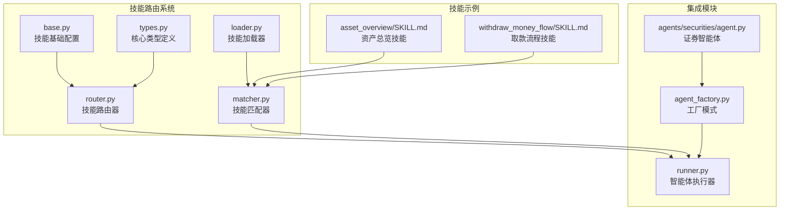
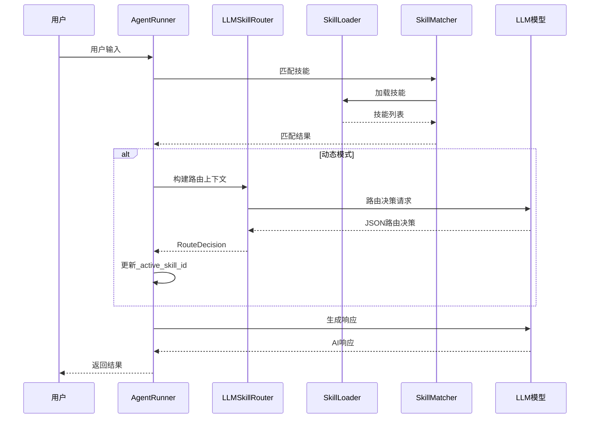
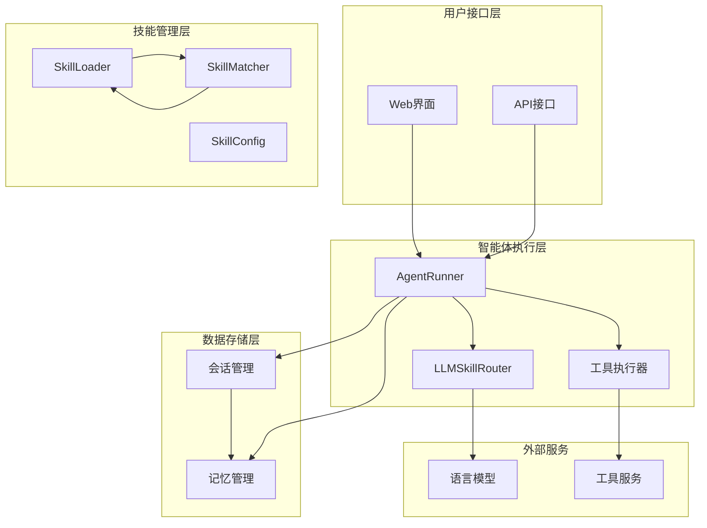
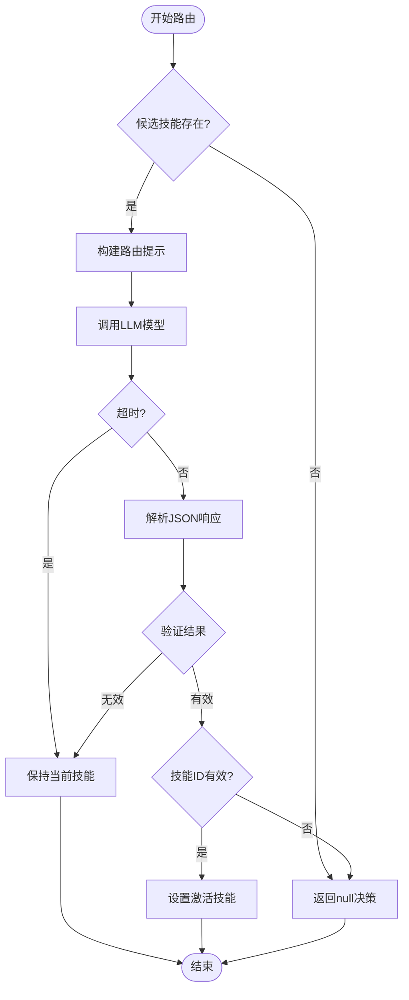
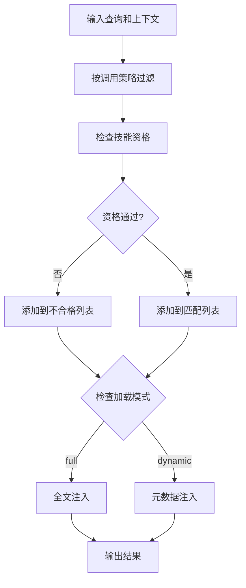
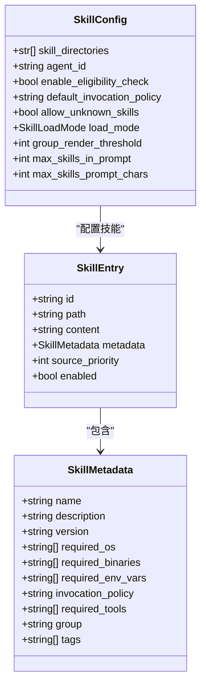
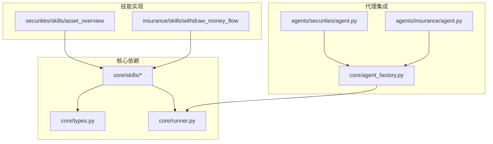

# 技能路由系统

<cite>
**本文档引用的文件**
- [router.py](file://src/ark_agentic/core/skills/router.py)
- [base.py](file://src/ark_agentic/core/skills/base.py)
- [loader.py](file://src/ark_agentic/core/skills/loader.py)
- [matcher.py](file://src/ark_agentic/core/skills/matcher.py)
- [types.py](file://src/ark_agentic/core/types.py)
- [runner.py](file://src/ark_agentic/core/runner.py)
- [agent_factory.py](file://src/ark_agentic/core/agent_factory.py)
- [agent.py](file://src/ark_agentic/agents/securities/agent.py)
- [SKILL.md](file://src/ark_agentic/agents/securities/skills/asset_overview/SKILL.md)
- [SKILL.md](file://src/ark_agentic/agents/insurance/skills/withdraw_money_flow/SKILL.md)
</cite>

## 目录
1. [简介](#简介)
2. [项目结构](#项目结构)
3. [核心组件](#核心组件)
4. [架构概览](#架构概览)
5. [详细组件分析](#详细组件分析)
6. [依赖关系分析](#依赖关系分析)
7. [性能考虑](#性能考虑)
8. [故障排除指南](#故障排除指南)
9. [结论](#结论)

## 简介

技能路由系统是 Ark Agentic Space 智能体平台的核心组件，负责在动态模式下智能地选择和激活最适合的技能来处理用户请求。该系统采用基于LLM的路由机制，能够根据对话上下文、用户意图和技能特性自动做出路由决策。

系统支持两种主要模式：
- **Full模式**：将所有技能的完整内容注入到系统提示中
- **Dynamic模式**：仅注入技能元数据，通过LLM按需加载具体技能

## 项目结构

技能路由系统位于 `src/ark_agentic/core/skills/` 目录下，包含以下核心模块：



**图表来源**
- [router.py:1-238](file://src/ark_agentic/core/skills/router.py#L1-L238)
- [loader.py:1-195](file://src/ark_agentic/core/skills/loader.py#L1-L195)
- [matcher.py:1-152](file://src/ark_agentic/core/skills/matcher.py#L1-L152)

**章节来源**
- [router.py:1-238](file://src/ark_agentic/core/skills/router.py#L1-L238)
- [base.py:1-344](file://src/ark_agentic/core/skills/base.py#L1-L344)
- [loader.py:1-195](file://src/ark_agentic/core/skills/loader.py#L1-L195)
- [matcher.py:1-152](file://src/ark_agentic/core/skills/matcher.py#L1-L152)

## 核心组件

### 技能路由器 (LLMSkillRouter)

技能路由器是系统的核心决策组件，采用基于LLM的路由策略：

- **协议设计**：定义了 `SkillRouter` 协议，确保路由实现的一致性
- **上下文感知**：分析用户输入、对话历史和当前激活技能
- **超时控制**：内置异步超时机制，确保系统稳定性
- **错误处理**：优雅处理LLM调用失败和解析错误

### 技能加载器 (SkillLoader)

负责从文件系统加载和管理技能：

- **目录扫描**：递归扫描技能目录，支持多级优先级覆盖
- **Frontmatter解析**：使用YAML解析技能元数据
- **引用文件处理**：支持技能参考文件的动态注入
- **全局ID生成**：为技能生成全局唯一的ID

### 技能匹配器 (SkillMatcher)

实现技能的智能匹配和过滤：

- **策略过滤**：根据调用策略（auto/manual/always）过滤技能
- **资格检查**：验证技能执行所需的环境和工具条件
- **模式适配**：根据加载模式（full/dynamic）分配注入方式
- **结果聚合**：组织匹配结果，支持向后兼容

**章节来源**
- [router.py:115-238](file://src/ark_agentic/core/skills/router.py#L115-L238)
- [loader.py:25-195](file://src/ark_agentic/core/skills/loader.py#L25-L195)
- [matcher.py:55-152](file://src/ark_agentic/core/skills/matcher.py#L55-L152)

## 架构概览

技能路由系统采用分层架构设计，实现了高度的模块化和可扩展性：



**图表来源**
- [runner.py:1216-1236](file://src/ark_agentic/core/runner.py#L1216-L1236)
- [router.py:132-159](file://src/ark_agentic/core/skills/router.py#L132-L159)

### 系统架构图



**图表来源**
- [agent_factory.py:59-173](file://src/ark_agentic/core/agent_factory.py#L59-L173)
- [runner.py:184-200](file://src/ark_agentic/core/runner.py#L184-L200)

## 详细组件分析

### LLMSkillRouter 实现分析

LLMSkillRouter 是技能路由系统的核心实现，采用了先进的异步编程模式：

#### 关键特性

1. **异步超时控制**：使用 `asyncio.wait_for` 确保路由决策在规定时间内完成
2. **JSON解析容错**：支持代码块包装的JSON输出，提高鲁棒性
3. **上下文窗口优化**：可配置的历史消息窗口大小
4. **A2UI兼容性**：自动检测和处理A2UI工具调用

#### 路由决策流程



**图表来源**
- [router.py:132-238](file://src/ark_agentic/core/skills/router.py#L132-L238)

**章节来源**
- [router.py:115-238](file://src/ark_agentic/core/skills/router.py#L115-L238)

### 技能加载器详细分析

SkillLoader 实现了复杂的技能发现和加载机制：

#### 目录优先级系统

系统支持多目录优先级加载，后加载的相同ID技能会覆盖先前的版本：

```python
# 目录优先级示例
directories = [
    "/opt/ark-agentic/agents/securities/skills",
    "/opt/ark-agentic/shared/skills",
    "/opt/ark-agentic/global/skills"
]
```

#### Frontmatter 元数据解析

技能文件使用YAML Frontmatter定义元数据：

```yaml
---
name: asset_overview
description: 负责处理用户关于账户整体资产状况...
version: "2.0"
invocation_policy: auto
group: securities
tags:
  - asset_overview
  - account
required_tools:
  - account_overview
  - render_a2ui
---
```

**章节来源**
- [loader.py:25-195](file://src/ark_agentic/core/skills/loader.py#L25-L195)

### 技能匹配器工作原理

SkillMatcher 实现了多层过滤和匹配机制：

#### 匹配流程



**图表来源**
- [matcher.py:64-126](file://src/ark_agentic/core/skills/matcher.py#L64-L126)

**章节来源**
- [matcher.py:55-152](file://src/ark_agentic/core/skills/matcher.py#L55-L152)

### 核心类型系统

系统使用强类型设计确保代码的健壮性和可维护性：

#### 技能配置类型



**图表来源**
- [base.py:19-50](file://src/ark_agentic/core/skills/base.py#L19-L50)
- [types.py:1-200](file://src/ark_agentic/core/types.py#L1-L200)

**章节来源**
- [types.py:1-200](file://src/ark_agentic/core/types.py#L1-L200)
- [base.py:19-50](file://src/ark_agentic/core/skills/base.py#L19-L50)

## 依赖关系分析

技能路由系统展现了清晰的依赖层次结构：



**图表来源**
- [agent_factory.py:59-173](file://src/ark_agentic/core/agent_factory.py#L59-L173)
- [agent.py:72-100](file://src/ark_agentic/agents/securities/agent.py#L72-L100)

### 依赖注入模式

系统采用依赖注入模式，通过工厂方法创建智能体实例：

```python
def build_standard_agent(
    defn: AgentDef,
    skills_dir: Path,
    tools: list[AgentTool],
    *,
    llm: BaseChatModel | None = None,
    enable_memory: bool = False,
    enable_dream: bool = False,
    callbacks: RunnerCallbacks | None = None,
    sampling: SamplingConfig | None = None,
    compaction_config: CompactionConfig | None = None,
    skill_router: SkillRouter | None = None,
) -> AgentRunner:
```

**章节来源**
- [agent_factory.py:59-173](file://src/ark_agentic/core/agent_factory.py#L59-L173)

## 性能考虑

技能路由系统在设计时充分考虑了性能优化：

### 内存管理

- **技能缓存**：加载的技能会缓存在内存中，避免重复I/O操作
- **历史窗口限制**：可配置的对话历史窗口，防止内存无限增长
- **预算控制**：技能提示的字符数和数量限制，确保LLM输入在合理范围内

### 并发处理

- **异步路由**：LLM调用采用异步模式，提高并发处理能力
- **超时保护**：内置超时机制，防止长时间阻塞
- **错误隔离**：路由失败不会影响整个智能体运行

### 优化策略

1. **动态技能加载**：仅在需要时加载技能内容，减少初始启动时间
2. **工具可见性控制**：根据当前激活技能动态调整工具可见性
3. **引用文件延迟加载**：仅在特定阶段加载相关的参考文件

## 故障排除指南

### 常见问题及解决方案

#### 技能加载失败

**症状**：技能无法加载或显示为空

**可能原因**：
- 技能目录不存在或权限不足
- SKILL.md 文件格式错误
- YAML Frontmatter解析失败

**解决步骤**：
1. 检查技能目录路径和权限
2. 验证SKILL.md文件格式
3. 确认YAML Frontmatter语法正确

#### 路由决策异常

**症状**：LLM路由返回非JSON格式或超时

**可能原因**：
- LLM输出格式不符合要求
- 网络连接不稳定
- 模型调用超时

**解决步骤**：
1. 检查LLM配置和连接
2. 调整超时参数
3. 验证路由提示格式

#### 技能资格检查失败

**症状**：技能虽然匹配但无法执行

**可能原因**：
- 缺少必需的工具
- 环境变量未设置
- 操作系统不兼容

**解决步骤**：
1. 检查必需工具的可用性
2. 验证环境变量设置
3. 确认操作系统兼容性

**章节来源**
- [router.py:147-157](file://src/ark_agentic/core/skills/router.py#L147-L157)
- [loader.py:54-84](file://src/ark_agentic/core/skills/loader.py#L54-L84)

## 结论

技能路由系统展现了现代智能体平台的先进设计理念，通过以下关键特性实现了高效的技能管理和智能路由：

### 主要优势

1. **模块化设计**：清晰的分层架构，便于维护和扩展
2. **动态路由**：基于上下文的智能技能选择
3. **性能优化**：异步处理和资源管理策略
4. **错误处理**：完善的异常处理和降级机制
5. **可扩展性**：支持自定义技能和路由策略

### 应用场景

该系统适用于各种复杂的智能体应用场景，特别是需要：
- 多技能协调工作的业务流程
- 动态环境下的灵活响应
- 大规模技能集合的管理
- 高并发请求处理

### 未来发展

系统具备良好的扩展基础，未来可以进一步增强：
- 更高级的路由算法
- 技能间的依赖关系管理
- 性能监控和优化
- 更丰富的错误恢复机制

通过持续的优化和扩展，技能路由系统将成为构建复杂智能体应用的强大基础设施。