# 插件系统架构

<cite>
**本文档引用的文件**
- [app.py](file://src/ark_agentic/app.py)
- [plugin.py](file://src/ark_agentic/core/protocol/plugin.py)
- [lifecycle.py](file://src/ark_agentic/core/protocol/lifecycle.py)
- [bootstrap.py](file://src/ark_agentic/core/protocol/bootstrap.py)
- [app_context.py](file://src/ark_agentic/core/protocol/app_context.py)
- [api/plugin.py](file://src/ark_agentic/plugins/api/plugin.py)
- [jobs/plugin.py](file://src/ark_agentic/plugins/jobs/plugin.py)
- [notifications/plugin.py](file://src/ark_agentic/plugins/notifications/plugin.py)
- [studio/plugin.py](file://src/ark_agentic/plugins/studio/plugin.py)
- [chat.py](file://src/ark_agentic/plugins/api/chat.py)
- [manager.py](file://src/ark_agentic/plugins/jobs/manager.py)
- [setup.py](file://src/ark_agentic/plugins/notifications/setup.py)
- [discovery.py](file://src/ark_agentic/core/runtime/discovery.py)
- [registry.py](file://src/ark_agentic/core/runtime/registry.py)
</cite>

## 目录
1. [简介](#简介)
2. [项目结构](#项目结构)
3. [核心组件](#核心组件)
4. [架构概览](#架构概览)
5. [详细组件分析](#详细组件分析)
6. [依赖关系分析](#依赖关系分析)
7. [性能考虑](#性能考虑)
8. [故障排除指南](#故障排除指南)
9. [结论](#结论)

## 简介

本项目采用模块化的插件系统架构，通过统一的生命周期协议来管理可选的功能模块。该系统的核心设计理念是将框架的必需组件与用户可选择的功能模块分离，提供灵活的扩展机制。

插件系统基于生命周期协议设计，包含三个主要层次：
- **核心生命周期组件**：始终启用的基础功能（如代理管理、追踪等）
- **插件组件**：用户可选择启用的功能模块
- **应用上下文**：运行时状态容器

## 项目结构

插件系统采用分层架构设计，主要目录结构如下：

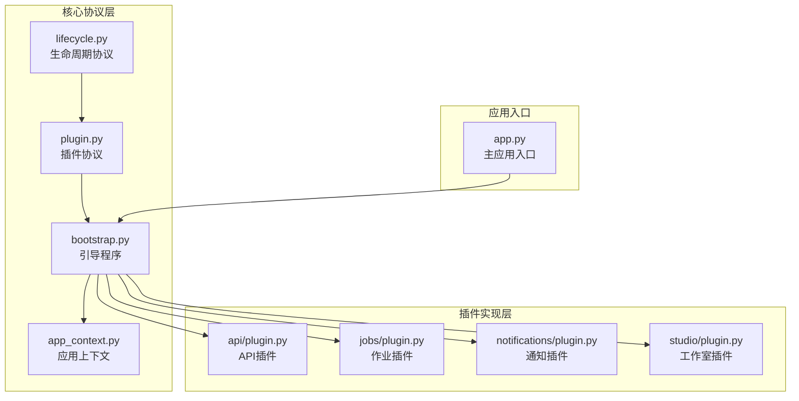

**图表来源**
- [app.py:1-94](file://src/ark_agentic/app.py#L1-L94)
- [plugin.py:1-35](file://src/ark_agentic/core/protocol/plugin.py#L1-L35)
- [lifecycle.py:1-91](file://src/ark_agentic/core/protocol/lifecycle.py#L1-L91)
- [bootstrap.py:1-162](file://src/ark_agentic/core/protocol/bootstrap.py#L1-L162)

**章节来源**
- [app.py:1-94](file://src/ark_agentic/app.py#L1-L94)
- [plugin.py:1-35](file://src/ark_agentic/core/protocol/plugin.py#L1-L35)
- [lifecycle.py:1-91](file://src/ark_agentic/core/protocol/lifecycle.py#L1-L91)

## 核心组件

### 生命周期协议系统

生命周期协议定义了插件系统的核心接口规范，确保所有组件遵循统一的启动、运行和停止流程。

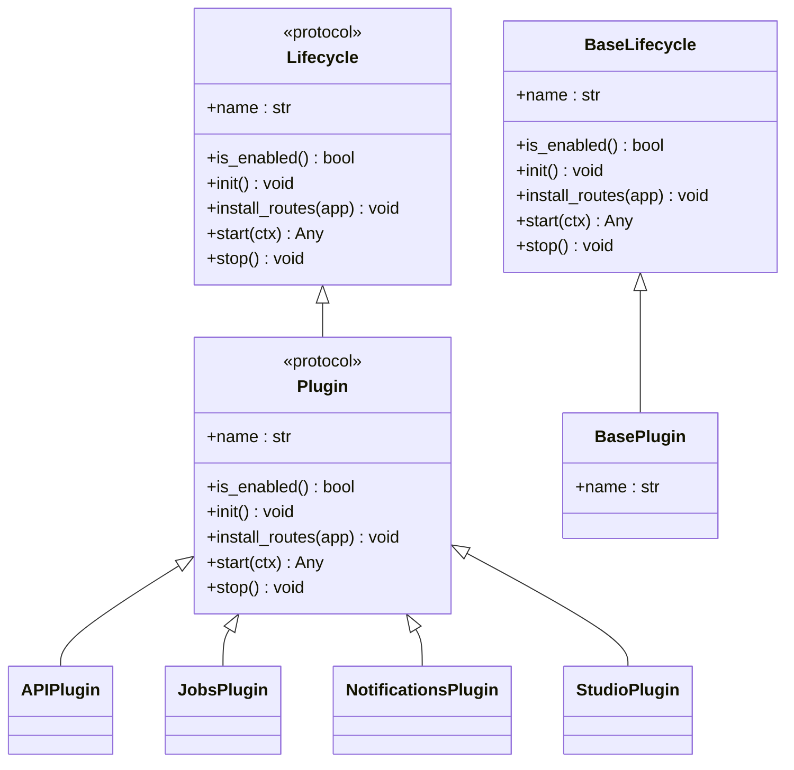

**图表来源**
- [lifecycle.py:23-91](file://src/ark_agentic/core/protocol/lifecycle.py#L23-L91)
- [plugin.py:20-35](file://src/ark_agentic/core/protocol/plugin.py#L20-L35)

### 引导程序架构

Bootstrap类负责协调所有生命周期组件的启动和停止过程，确保组件按照正确的顺序进行初始化。

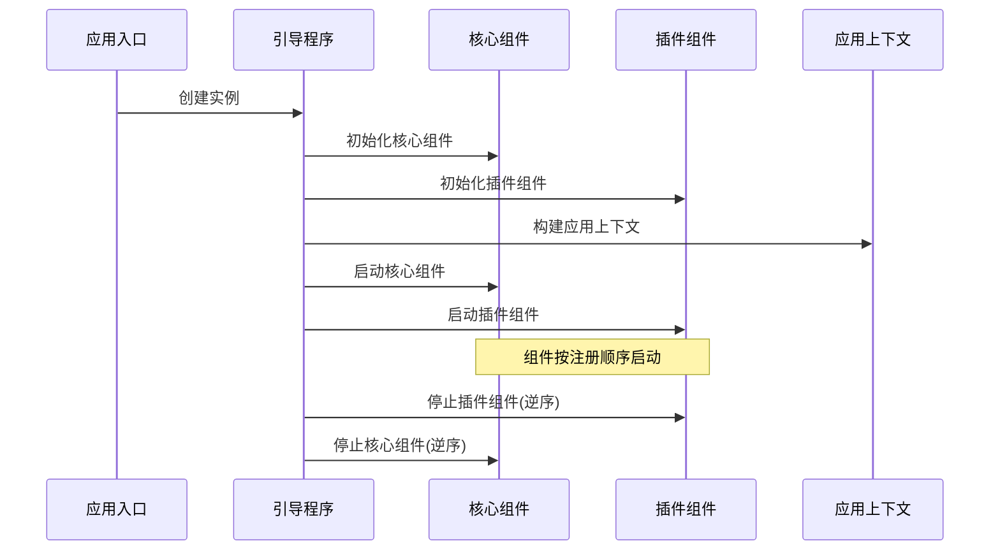

**图表来源**
- [bootstrap.py:48-162](file://src/ark_agentic/core/protocol/bootstrap.py#L48-L162)
- [app.py:50-78](file://src/ark_agentic/app.py#L50-L78)

**章节来源**
- [bootstrap.py:1-162](file://src/ark_agentic/core/protocol/bootstrap.py#L1-L162)
- [lifecycle.py:1-91](file://src/ark_agentic/core/protocol/lifecycle.py#L1-L91)

## 架构概览

插件系统采用分层架构设计，实现了高度的模块化和可扩展性。

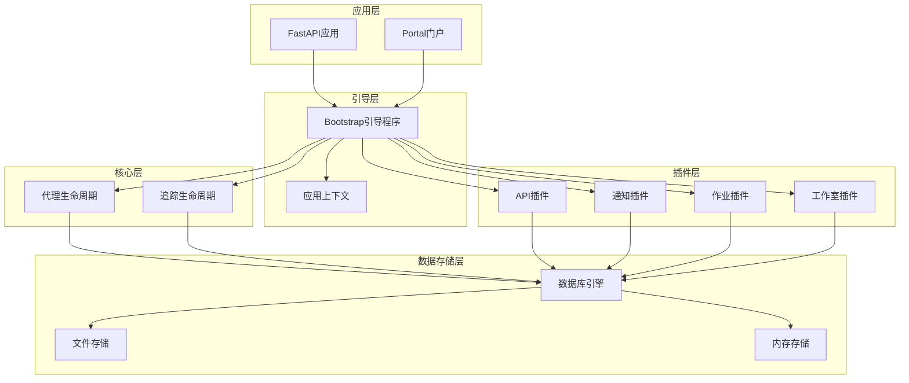

**图表来源**
- [app.py:35-56](file://src/ark_agentic/app.py#L35-L56)
- [bootstrap.py:67-76](file://src/ark_agentic/core/protocol/bootstrap.py#L67-L76)

## 详细组件分析

### API插件

API插件提供HTTP传输层，负责聊天API的路由管理和中间件配置。

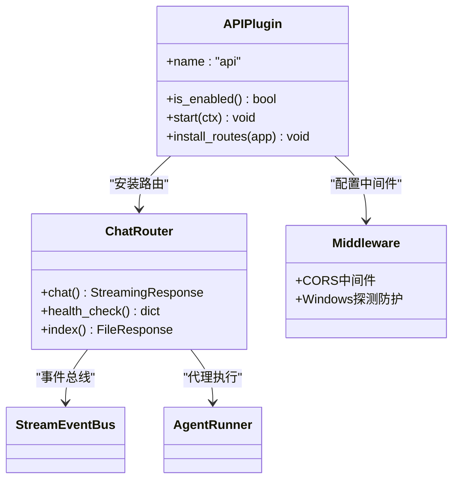

**图表来源**
- [api/plugin.py:27-87](file://src/ark_agentic/plugins/api/plugin.py#L27-L87)
- [chat.py:28-188](file://src/ark_agentic/plugins/api/chat.py#L28-L188)

#### API工作流程

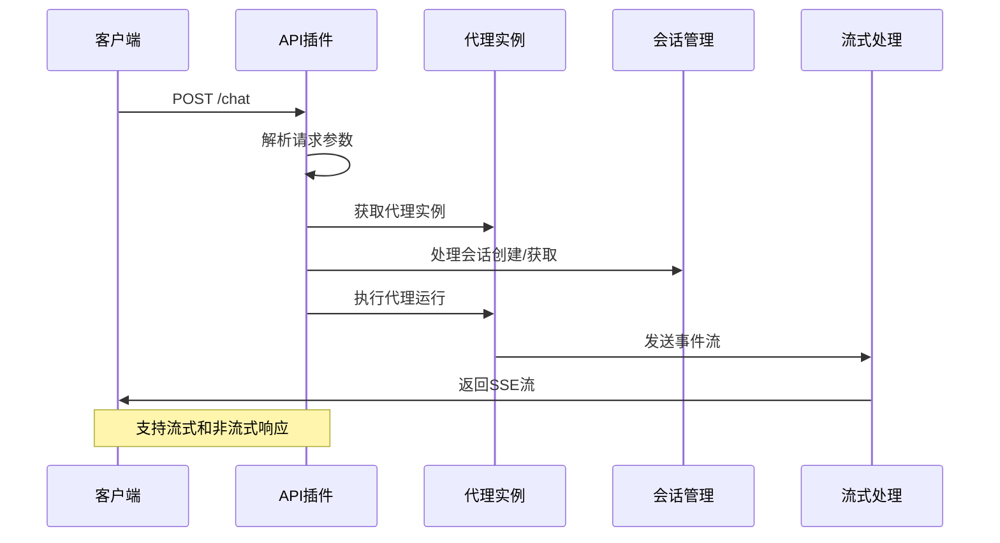

**图表来源**
- [chat.py:28-188](file://src/ark_agentic/plugins/api/chat.py#L28-L188)

**章节来源**
- [api/plugin.py:1-87](file://src/ark_agentic/plugins/api/plugin.py#L1-L87)
- [chat.py:1-188](file://src/ark_agentic/plugins/api/chat.py#L1-L188)

### 作业插件

作业插件提供主动作业调度和扫描功能，支持定时任务和批量处理。

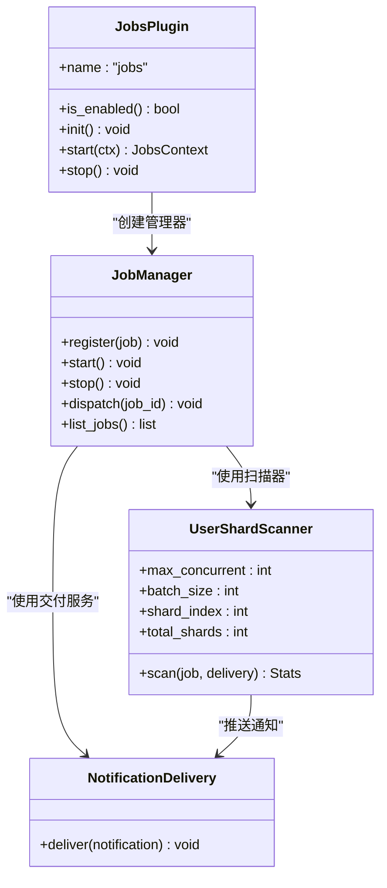

**图表来源**
- [jobs/plugin.py:34-99](file://src/ark_agentic/plugins/jobs/plugin.py#L34-L99)
- [manager.py:40-123](file://src/ark_agentic/plugins/jobs/manager.py#L40-L123)

#### 作业调度流程

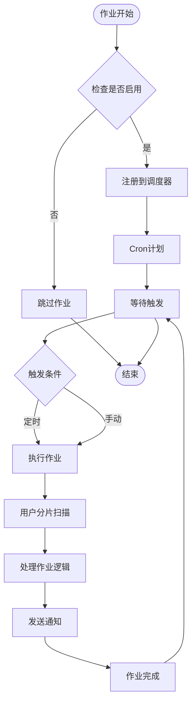

**图表来源**
- [manager.py:110-123](file://src/ark_agentic/plugins/jobs/manager.py#L110-L123)

**章节来源**
- [jobs/plugin.py:1-99](file://src/ark_agentic/plugins/jobs/plugin.py#L1-L99)
- [manager.py:1-123](file://src/ark_agentic/plugins/jobs/manager.py#L1-L123)

### 通知插件

通知插件提供通知服务和SSE（服务器发送事件）功能，支持实时消息推送。

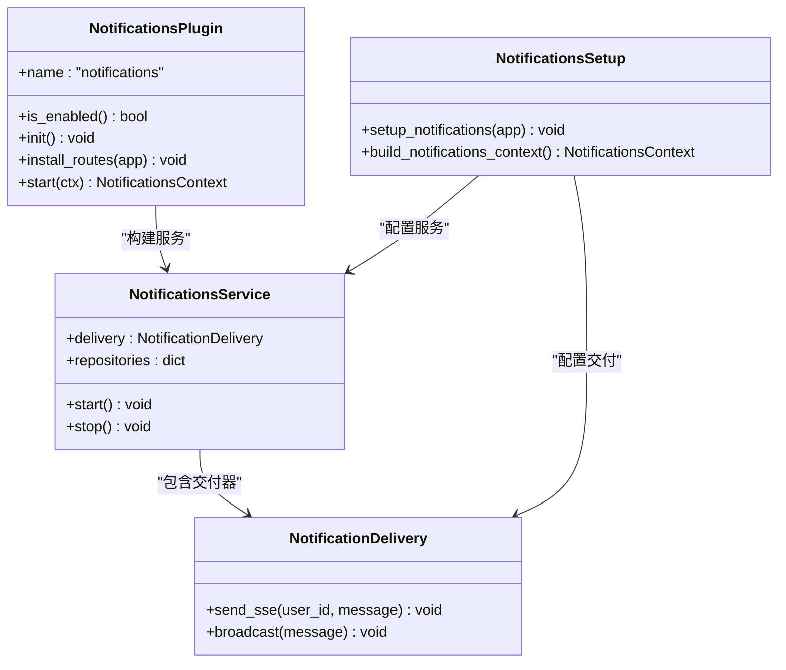

**图表来源**
- [notifications/plugin.py:12-41](file://src/ark_agentic/plugins/notifications/plugin.py#L12-L41)
- [setup.py:26-58](file://src/ark_agentic/plugins/notifications/setup.py#L26-L58)

**章节来源**
- [notifications/plugin.py:1-41](file://src/ark_agentic/plugins/notifications/plugin.py#L1-L41)
- [setup.py:1-58](file://src/ark_agentic/plugins/notifications/setup.py#L1-L58)

### 工作室插件

工作室插件提供管理控制台功能，包含React前端和后端API路由。

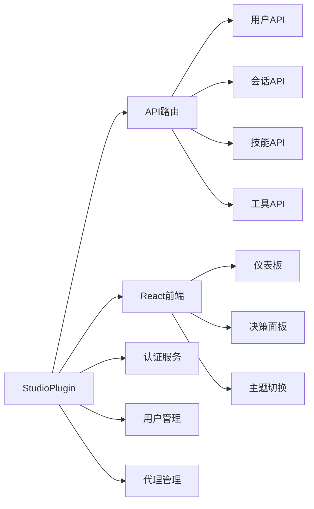

**图表来源**
- [studio/plugin.py:16-32](file://src/ark_agentic/plugins/studio/plugin.py#L16-L32)

**章节来源**
- [studio/plugin.py:1-32](file://src/ark_agentic/plugins/studio/plugin.py#L1-L32)

## 依赖关系分析

插件系统采用松耦合的设计原则，通过接口隔离和依赖注入实现模块间的解耦。

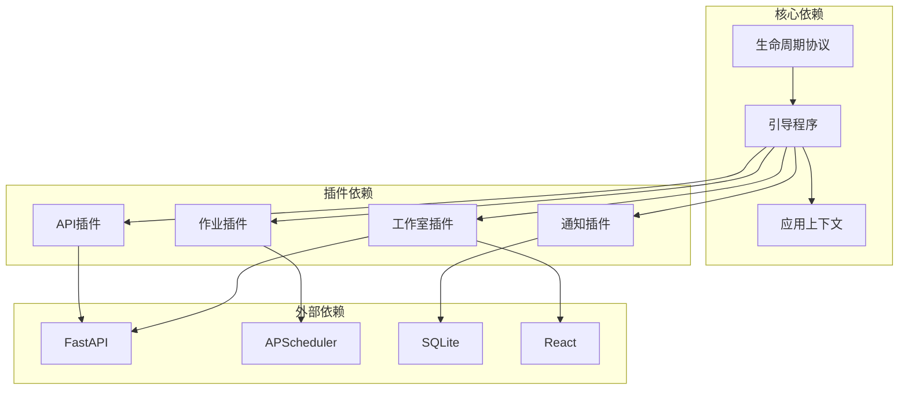

**图表来源**
- [bootstrap.py:39-76](file://src/ark_agentic/core/protocol/bootstrap.py#L39-L76)
- [app.py:35-42](file://src/ark_agentic/app.py#L35-L42)

### 组件间通信机制

插件系统通过以下机制实现组件间的通信和协作：

1. **应用上下文传递**：Bootstrap将启动的组件返回值存入AppContext
2. **依赖注入**：组件通过上下文访问其他组件提供的服务
3. **事件总线**：流式处理使用事件总线进行异步通信
4. **环境变量配置**：通过环境变量控制插件的启用和行为

**章节来源**
- [bootstrap.py:134-152](file://src/ark_agentic/core/protocol/bootstrap.py#L134-L152)
- [app_context.py:23-27](file://src/ark_agentic/core/protocol/app_context.py#L23-L27)

## 性能考虑

插件系统在设计时充分考虑了性能优化和资源管理：

### 内存管理
- 使用惰性导入避免循环依赖
- 组件按需启动，减少内存占用
- 流式处理使用队列机制避免内存泄漏

### 并发处理
- 作业插件使用AsyncIOScheduler支持异步调度
- API插件支持并发请求处理
- 事件总线使用异步队列保证消息传递效率

### 资源优化
- 插件启用状态通过环境变量控制
- 数据库连接池管理
- 缓存机制优化频繁操作

## 故障排除指南

### 常见问题及解决方案

#### 插件启动失败
**症状**：插件无法正常启动或报错
**原因**：
- 依赖组件未正确初始化
- 环境变量配置错误
- 权限不足

**解决方法**：
1. 检查插件的前置依赖是否已正确加载
2. 验证相关环境变量的设置
3. 查看日志中的具体错误信息

#### API路由冲突
**症状**：API路由无法访问或返回404错误
**原因**：
- 路由注册顺序问题
- 中间件冲突
- 静态文件路径错误

**解决方法**：
1. 确认路由注册的优先级
2. 检查中间件的配置
3. 验证静态文件目录的存在性

#### 作业调度异常
**症状**：定时任务不执行或执行失败
**原因**：
- Cron表达式格式错误
- 作业注册失败
- 数据库连接问题

**解决方法**：
1. 验证Cron表达式的正确性
2. 检查作业注册状态
3. 确认数据库连接可用性

**章节来源**
- [jobs/plugin.py:52-56](file://src/ark_agentic/plugins/jobs/plugin.py#L52-L56)
- [api/plugin.py:57-61](file://src/ark_agentic/plugins/api/plugin.py#L57-L61)

## 结论

本插件系统架构通过清晰的层次设计和标准化的生命周期协议，实现了高度模块化和可扩展的应用框架。系统的主要优势包括：

1. **模块化设计**：核心功能与可选插件分离，提供灵活的部署选项
2. **标准化接口**：统一的生命周期协议确保组件的一致性
3. **松耦合架构**：通过依赖注入和事件机制实现组件解耦
4. **可扩展性**：支持第三方插件开发和动态发现机制
5. **生产就绪**：完整的错误处理、监控和性能优化

该架构为复杂的企业级应用提供了坚实的基础，支持从简单到复杂的各种使用场景，同时保持了代码的可维护性和可测试性。