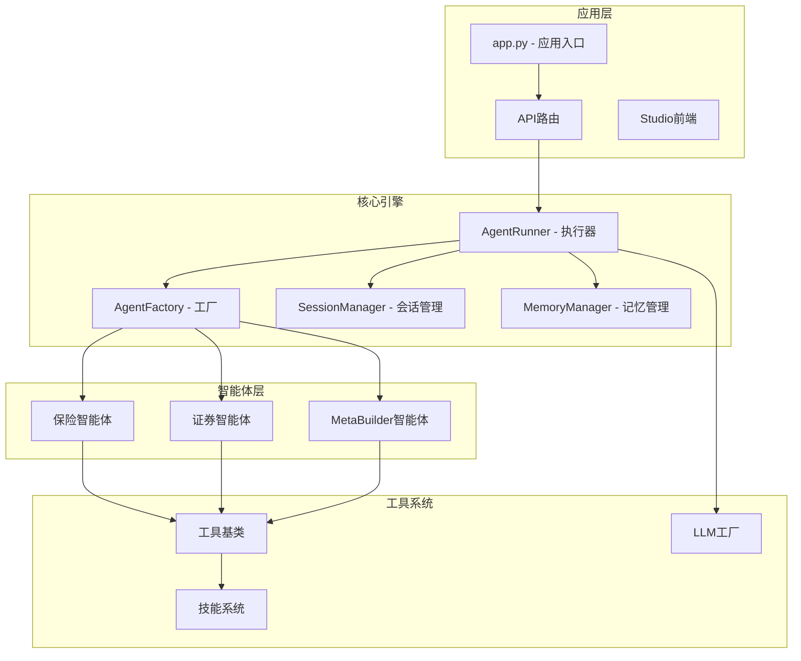
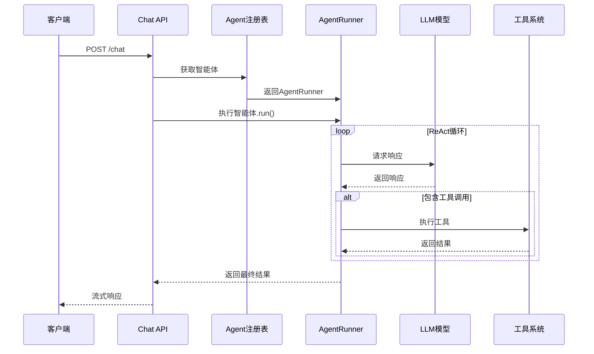
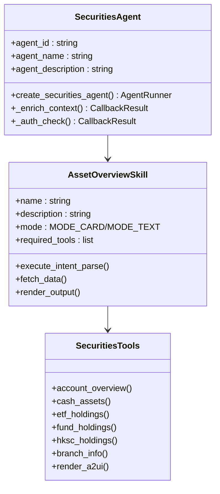
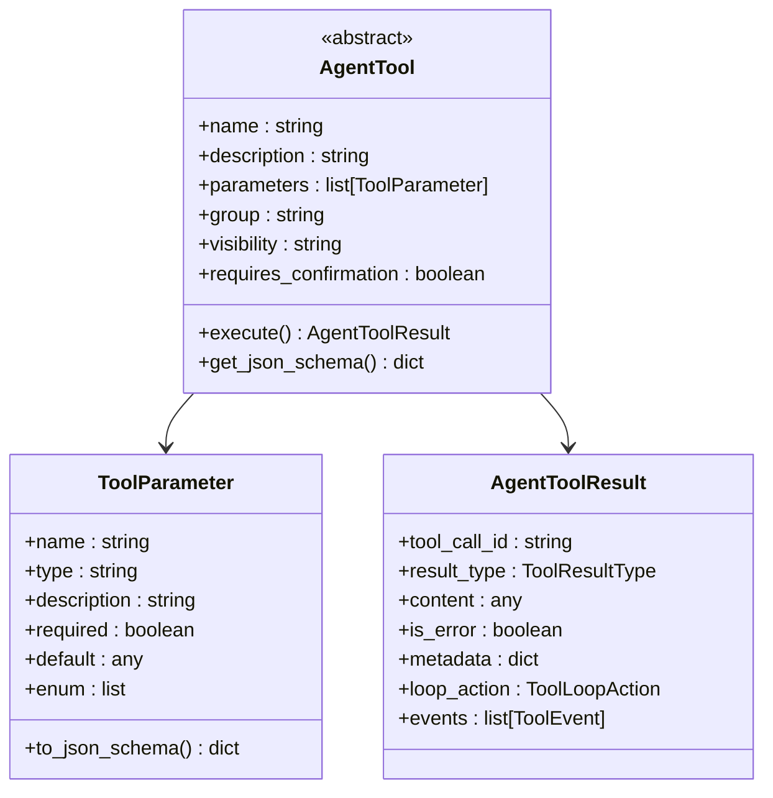
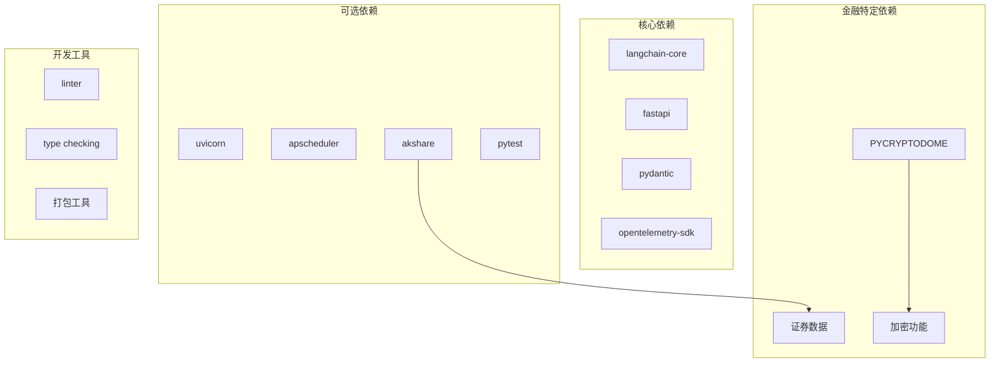

# 智能体工厂系统

<cite>
**本文档引用的文件**
- [app.py](file://src/ark_agentic/app.py)
- [agent_factory.py](file://src/ark_agentic/core/agent_factory.py)
- [factory.py](file://src/ark_agentic/agents/meta_builder/factory.py)
- [chat.py](file://src/ark_agentic/api/chat.py)
- [runner.py](file://src/ark_agentic/core/runner.py)
- [agent.py](file://src/ark_agentic/agents/insurance/agent.py)
- [agent.py](file://src/ark_agentic/agents/securities/agent.py)
- [manager.py](file://src/ark_agentic/core/memory/manager.py)
- [base.py](file://src/ark_agentic/core/tools/base.py)
- [base.py](file://src/ark_agentic/core/skills/base.py)
- [types.py](file://src/ark_agentic/core/types.py)
- [session.py](file://src/ark_agentic/core/session.py)
- [agent_service.py](file://src/ark_agentic/studio/services/agent_service.py)
- [pyproject.toml](file://pyproject.toml)
- [SKILL.md](file://src/ark_agentic/agents/insurance/skills/withdraw_money_flow/SKILL.md)
- [SKILL.md](file://src/ark_agentic/agents/securities/skills/asset_overview/SKILL.md)
- [factory.py](file://src/ark_agentic/core/llm/factory.py)
</cite>

## 目录
1. [简介](#简介)
2. [项目结构](#项目结构)
3. [核心组件](#核心组件)
4. [架构概览](#架构概览)
5. [详细组件分析](#详细组件分析)
6. [依赖分析](#依赖分析)
7. [性能考虑](#性能考虑)
8. [故障排除指南](#故障排除指南)
9. [结论](#结论)

## 简介

智能体工厂系统是一个基于 ReAct 框架的轻量级智能体平台，专为金融领域设计，支持保险和证券资产管理两大业务场景。该系统提供了标准化的智能体创建、管理和执行能力，具备强大的工具系统、技能管理和记忆功能。

系统采用模块化设计，通过统一的工厂模式创建不同领域的智能体，支持动态技能加载、流式响应、会话管理和持久化存储等功能。智能体能够处理复杂的金融业务流程，如保险取款、资产查询、账户分析等任务。

## 项目结构

**图表来源**
- [app.py:1-351](file://src/ark_agentic/app.py#L1-L351)
- [runner.py:1-800](file://src/ark_agentic/core/runner.py#L1-L800)
- [agent_factory.py:1-151](file://src/ark_agentic/core/agent_factory.py#L1-L151)

**章节来源**
- [app.py:1-351](file://src/ark_agentic/app.py#L1-L351)
- [pyproject.toml:1-112](file://pyproject.toml#L1-L112)

## 核心组件

### AgentFactory 工厂系统

AgentFactory 提供了标准化的智能体创建流程，通过声明式配置和约定优于配置的原则，简化了智能体的构建过程。

**核心特性：**
- 声明式 AgentDef 配置
- 自动化的技能加载
- 会话和记忆管理集成
- 可插拔的工具注册

### AgentRunner 执行引擎

AgentRunner 是系统的核心执行器，实现了 ReAct 框架的完整循环，包括模型推理、工具调用和结果处理。

**执行流程：**
1. 准备阶段：参数解析、回调钩子执行
2. 会话准备：历史合并、上下文注入
3. ReAct 循环：模型推理 → 工具调用 → 结果处理
4. 完成阶段：结果整理、持久化存储

### 会话管理系统

SessionManager 提供了完整的会话生命周期管理，包括消息追踪、上下文压缩和持久化存储。

**主要功能：**
- 消息历史管理
- 上下文压缩算法
- 会话状态持久化
- 外部历史合并

**章节来源**
- [agent_factory.py:1-151](file://src/ark_agentic/core/agent_factory.py#L1-L151)
- [runner.py:1-800](file://src/ark_agentic/core/runner.py#L1-L800)
- [session.py:1-482](file://src/ark_agentic/core/session.py#L1-L482)

## 架构概览

**图表来源**
- [chat.py:1-177](file://src/ark_agentic/api/chat.py#L1-L177)
- [runner.py:292-378](file://src/ark_agentic/core/runner.py#L292-L378)

## 详细组件分析

### 保险智能体系统

保险智能体专注于保险业务场景，实现了完整的取款流程管理。

**图表来源**
- [SKILL.md:24-61](file://src/ark_agentic/agents/insurance/skills/withdraw_money_flow/SKILL.md#L24-L61)

**核心特点：**
- 四阶段 SOP 流程设计
- 跨会话恢复机制
- 完善的错误处理策略
- A2UI 卡片渲染支持

**章节来源**
- [agent.py:1-75](file://src/ark_agentic/agents/insurance/agent.py#L1-L75)
- [SKILL.md:1-61](file://src/ark_agentic/agents/insurance/skills/withdraw_money_flow/SKILL.md#L1-L61)

### 证券资产管理智能体

证券智能体提供全面的资产查询和分析功能，支持多种资产类型的综合管理。

**图表来源**
- [agent.py:1-100](file://src/ark_agentic/agents/securities/agent.py#L1-L100)
- [SKILL.md:1-186](file://src/ark_agentic/agents/securities/skills/asset_overview/SKILL.md#L1-L186)

**核心功能：**
- 账户整体资产概览
- 现金状况查询
- 持仓列表分析
- 营业部信息查询
- MODE_CARD/MODE_TEXT 模式切换

**章节来源**
- [agent.py:1-100](file://src/ark_agentic/agents/securities/agent.py#L1-L100)
- [SKILL.md:1-186](file://src/ark_agentic/agents/securities/skills/asset_overview/SKILL.md#L1-L186)

### MetaBuilder 智能体

MetaBuilder 是一个特殊的智能体，用于创建和管理其他智能体、技能和工具。

**核心能力：**
- 智能体脚手架创建
- 技能模板生成
- 工具代码生成
- 文件系统操作

**章节来源**
- [factory.py:1-100](file://src/ark_agentic/agents/meta_builder/factory.py#L1-L100)

### 工具系统架构

**图表来源**
- [base.py:1-289](file://src/ark_agentic/core/tools/base.py#L1-L289)

**章节来源**
- [base.py:1-289](file://src/ark_agentic/core/tools/base.py#L1-L289)

### 记忆管理系统

记忆系统提供了轻量级的记忆存储和管理功能，采用纯文本文件存储，避免复杂的数据库依赖。

**核心特性：**
- MEMORY.md 文件存储
- 标题级别内容管理
- 自动去重和更新
- 轻量级实现

**章节来源**
- [manager.py:1-92](file://src/ark_agentic/core/memory/manager.py#L1-L92)

## 依赖分析

**图表来源**
- [pyproject.toml:1-112](file://pyproject.toml#L1-L112)

**章节来源**
- [pyproject.toml:1-112](file://pyproject.toml#L1-L112)

## 性能考虑

### 上下文压缩优化

系统实现了智能的上下文压缩机制，通过总结算法减少 Token 使用量：

- **压缩阈值**：超过配置阈值时自动触发压缩
- **总结算法**：使用 LLM 进行内容摘要
- **统计跟踪**：记录压缩效果和性能指标

### 并发处理

- **异步执行**：支持异步工具调用和流式响应
- **任务队列**：Proactive 作业使用 APScheduler 管理
- **资源池**：LLM 调用使用连接池优化性能

### 缓存策略

- **记忆缓存**：MEMORY.md 文件缓存最近更新
- **会话缓存**：内存中的会话状态管理
- **工具结果缓存**：重复调用的结果缓存

## 故障排除指南

### 常见问题诊断

**LLM 连接问题：**
- 检查 MODEL_NAME 环境变量
- 验证 API_KEY 配置
- 确认网络连接状态

**工具调用失败：**
- 查看工具参数验证
- 检查外部服务可用性
- 验证权限配置

**会话管理异常：**
- 检查磁盘空间
- 验证文件权限
- 查看日志错误信息

### 调试工具

系统提供了多种调试和监控功能：

- **OTEL 追踪**：完整的链路追踪
- **日志记录**：详细的执行日志
- **性能指标**：Token 使用和响应时间统计

**章节来源**
- [runner.py:621-640](file://src/ark_agentic/core/runner.py#L621-L640)

## 结论

智能体工厂系统提供了一个完整、可扩展的智能体平台，具有以下优势：

1. **模块化设计**：清晰的组件分离和职责划分
2. **金融专业性**：针对保险和证券领域的深度定制
3. **可扩展性**：支持动态技能加载和工具注册
4. **生产就绪**：完善的错误处理和监控机制
5. **易用性**：标准化的工厂模式和约定优于配置

该系统适合构建复杂的金融智能体应用，能够处理从简单的问答到复杂的业务流程自动化等各种场景。通过合理的配置和扩展，可以轻松适配不同的业务需求和技术栈。