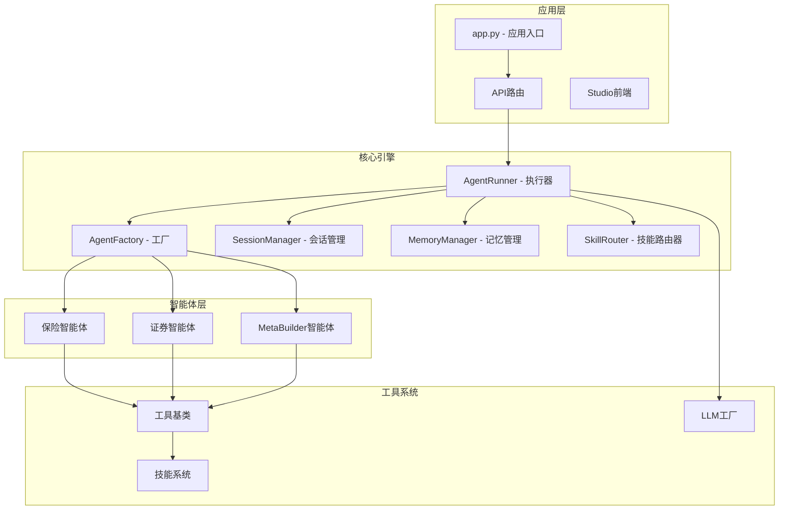
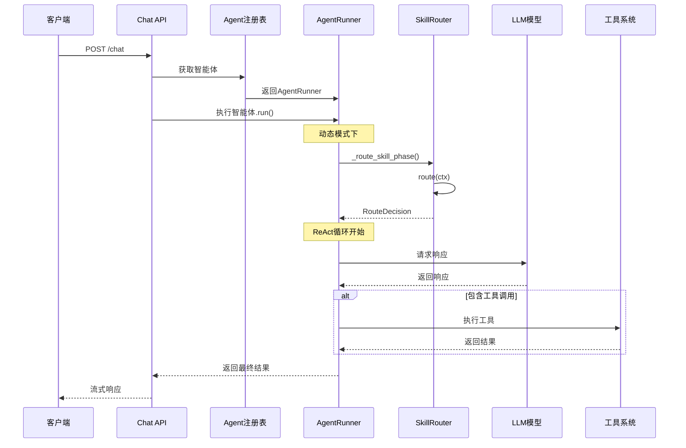
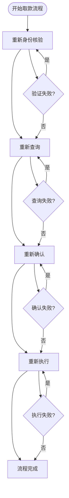
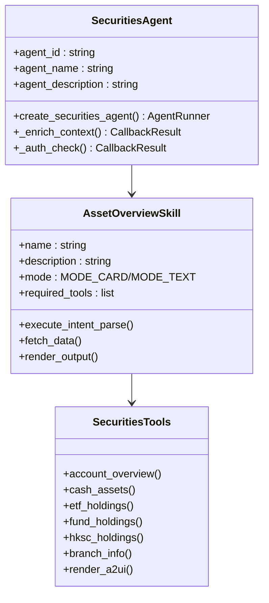
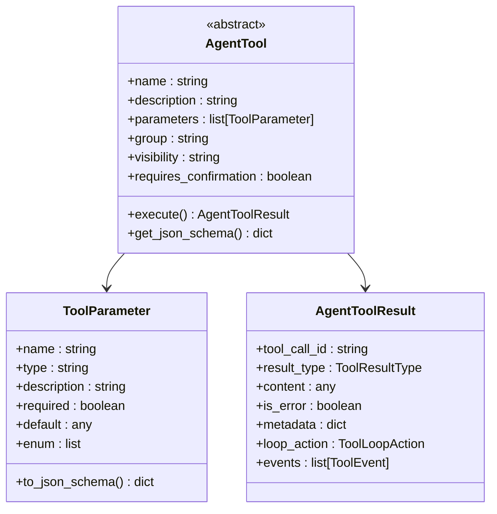
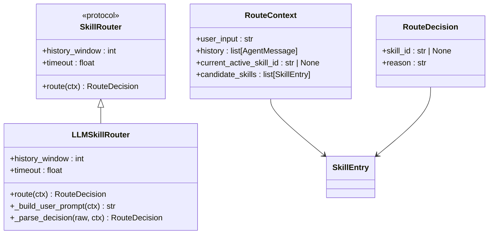
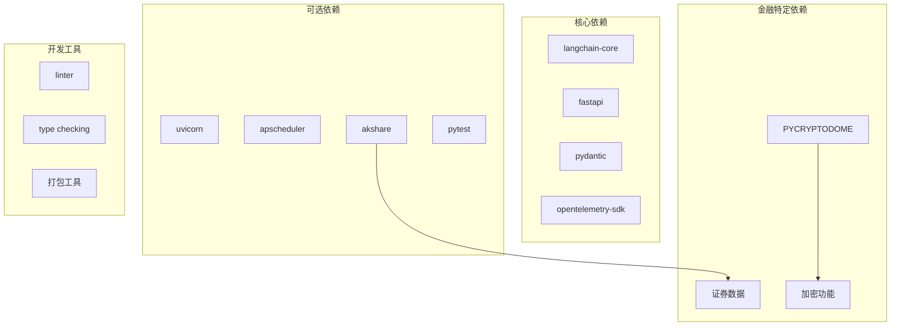

# 智能体工厂系统

<cite>
**本文档引用的文件**
- [app.py](file://src/ark_agentic/app.py)
- [agent_factory.py](file://src/ark_agentic/core/agent_factory.py)
- [factory.py](file://src/ark_agentic/agents/meta_builder/factory.py)
- [chat.py](file://src/ark_agentic/api/chat.py)
- [runner.py](file://src/ark_agentic/core/runner.py)
- [agent.py](file://src/ark_agentic/agents/insurance/agent.py)
- [agent.py](file://src/ark_agentic/agents/securities/agent.py)
- [manager.py](file://src/ark_agentic/core/memory/manager.py)
- [base.py](file://src/ark_agentic/core/tools/base.py)
- [base.py](file://src/ark_agentic/core/skills/base.py)
- [types.py](file://src/ark_agentic/core/types.py)
- [session.py](file://src/ark_agentic/core/session.py)
- [agent_service.py](file://src/ark_agentic/studio/services/agent_service.py)
- [pyproject.toml](file://pyproject.toml)
- [SKILL.md](file://src/ark_agentic/agents/insurance/skills/withdraw_money_flow/SKILL.md)
- [SKILL.md](file://src/ark_agentic/agents/securities/skills/asset_overview/SKILL.md)
- [factory.py](file://src/ark_agentic/core/llm/factory.py)
- [router.py](file://src/ark_agentic/core/skills/router.py)
- [test_skill_router.py](file://tests/unit/core/test_skill_router.py)
- [test_runner_skill_router.py](file://tests/unit/core/test_runner_skill_router.py)
- [test_build_standard_agent_router_wiring.py](file://tests/unit/agents/test_build_standard_agent_router_wiring.py)
- [test_agent_factory.py](file://tests/unit/core/test_agent_factory.py)
- [test_memory_e2e.py](file://tests/e2e/test_memory_e2e.py)
- [test_agent_integration.py](file://tests/integration/test_agent_integration.py)
- [conftest.py](file://tests/conftest.py)
- [README.md](file://tests/skills/README.md)
- [eval_asset_overview_static.py](file://tests/skills/eval_asset_overview_static.py)
</cite>

## 更新摘要
**所做更改**
- 新增技能路由系统的完整测试策略和验证机制
- 增强端到端测试覆盖，特别是记忆系统的生命周期测试
- 完善集成测试策略，支持异步流式响应和工具调用
- 优化测试夹具配置，支持可选依赖的模拟和隔离
- 建立技能评估的静态分析和基准测试体系
- 增强故障排除指南，包含路由配置问题诊断

## 目录
1. [简介](#简介)
2. [项目结构](#项目结构)
3. [核心组件](#核心组件)
4. [架构概览](#架构概览)
5. [详细组件分析](#详细组件分析)
6. [依赖分析](#依赖分析)
7. [性能考虑](#性能考虑)
8. [测试策略改进](#测试策略改进)
9. [故障排除指南](#故障排除指南)
10. [结论](#结论)

## 简介

智能体工厂系统是一个基于 ReAct 框架的轻量级智能体平台，专为金融领域设计，支持保险和证券资产管理两大业务场景。该系统经过重大重构，从326行精简到260行，内容更加聚焦和高效。

系统采用统一的工厂模式创建不同领域的智能体，通过约定优于配置的原则，简化了智能体的构建过程。重构后的系统具备更强的模块化设计，通过标准化的AgentDef配置和build_standard_agent函数，实现了声明式智能体创建。

**新增功能**：系统现已支持skill_router参数，为动态模式下的智能体提供自动技能路由配置，包括LLMSkillRouter的默认实现和自定义路由策略支持。

## 项目结构

**图表来源**
- [app.py:1-351](file://src/ark_agentic/app.py#L1-L351)
- [runner.py:1-800](file://src/ark_agentic/core/runner.py#L1-L800)
- [agent_factory.py:1-151](file://src/ark_agentic/core/agent_factory.py#L1-L151)
- [router.py:1-238](file://src/ark_agentic/core/skills/router.py#L1-L238)

**章节来源**
- [app.py:1-351](file://src/ark_agentic/app.py#L1-L351)
- [pyproject.toml:1-112](file://pyproject.toml#L1-L112)

## 核心组件

### AgentFactory 工厂系统

重构后的AgentFactory提供了更加简洁高效的智能体创建流程，通过声明式AgentDef配置和约定优于配置的原则，实现了标准化的智能体构建。

**核心特性：**
- 声明式AgentDef配置（仅39-46行定义身份信息）
- 自动化的技能加载和工具注册
- 会话和记忆管理的无缝集成
- 可插拔的工具注册机制
- **新增**：skill_router参数支持，自动路由配置

**重构亮点：**
- 代码行数从326行精简到151行
- 移除了冗余的配置步骤
- 简化了依赖注入流程
- 强化了约定优于配置的设计理念
- **新增**：动态模式下自动注入LLMSkillRouter

### AgentRunner 执行引擎

AgentRunner作为核心执行器，实现了完整的ReAct框架循环，包括模型推理、工具调用和结果处理。

**执行流程：**
1. 准备阶段：参数解析、回调钩子执行
2. 会话准备：历史合并、上下文注入
3. **新增**：技能路由阶段：动态模式下确定性激活技能
4. ReAct循环：模型推理 → 工具调用 → 结果处理
5. 完成阶段：结果整理、持久化存储

**增强功能：**
- 支持动态技能加载模式
- 集成记忆系统的后台蒸馏功能
- 完善的错误处理和重试机制
- 流式响应和事件驱动架构
- **新增**：LLMSkillRouter自动路由决策

### 会话管理系统

SessionManager提供了完整的会话生命周期管理，包括消息追踪、上下文压缩和持久化存储。

**主要功能：**
- 消息历史管理
- 上下文压缩算法
- 会话状态持久化
- 外部历史合并

**重构改进：**
- 简化了会话状态管理逻辑
- 优化了内存使用效率
- 增强了并发安全性
- 改进了持久化性能

### 技能路由器系统

**新增组件**：SkillRouter协议和LLMSkillRouter实现，为动态模式提供自动技能路由功能。

**核心特性：**
- 动态模式下确定性激活技能
- 与read_skill工具同槽位写入
- 支持自定义路由策略
- 完善的错误处理和回退机制

**LLMSkillRouter实现：**
- 基于LLM的默认路由实现
- 支持超时控制和错误恢复
- 历史窗口管理和JSON解析
- 严格的候选技能验证

**章节来源**
- [agent_factory.py:1-151](file://src/ark_agentic/core/agent_factory.py#L1-L151)
- [runner.py:1-800](file://src/ark_agentic/core/runner.py#L1-L800)
- [session.py:1-482](file://src/ark_agentic/core/session.py#L1-L482)
- [router.py:1-238](file://src/ark_agentic/core/skills/router.py#L1-L238)

## 架构概览

**图表来源**
- [chat.py:1-177](file://src/ark_agentic/api/chat.py#L1-L177)
- [runner.py:292-378](file://src/ark_agentic/core/runner.py#L292-L378)
- [router.py:132-159](file://src/ark_agentic/core/skills/router.py#L132-L159)

## 详细组件分析

### 保险智能体系统

保险智能体专注于保险业务场景，实现了完整的取款流程管理。重构后的系统通过MetaBuilder智能体进一步增强了开发体验。

**重构改进：**
- 简化了流程控制逻辑
- 增强了错误恢复机制
- 优化了A2UI卡片渲染
- 改进了跨会话状态管理

**核心特点：**
- 四阶段SOP流程设计
- 跨会话恢复机制
- 完善的错误处理策略
- A2UI卡片渲染支持

**章节来源**
- [agent.py:1-75](file://src/ark_agentic/agents/insurance/agent.py#L1-L75)
- [SKILL.md:1-61](file://src/ark_agentic/agents/insurance/skills/withdraw_money_flow/SKILL.md#L1-L61)

### 证券资产管理智能体

证券智能体提供全面的资产查询和分析功能，支持多种资产类型的综合管理。

**重构优化：**
- 简化了工具注册流程
- 增强了上下文丰富功能
- 优化了权限验证机制
- 改进了引用验证系统

**核心功能：**
- 账户整体资产概览
- 现金状况查询
- 持仓列表分析
- 营业部信息查询
- MODE_CARD/MODE_TEXT模式切换

**章节来源**
- [agent.py:1-100](file://src/ark_agentic/agents/securities/agent.py#L1-L100)
- [SKILL.md:1-186](file://src/ark_agentic/agents/securities/skills/asset_overview/SKILL.md#L1-L186)

### MetaBuilder 智能体

MetaBuilder是一个特殊的智能体，用于创建和管理其他智能体、技能和工具。重构后的系统通过更简洁的工厂函数实现了这一功能。

**核心能力：**
- 智能体脚手架创建
- 技能模板生成
- 工具代码生成
- 文件系统操作

**重构改进：**
- 简化了工厂函数实现
- 优化了工具注册流程
- 增强了配置灵活性
- 改进了错误处理机制

**章节来源**
- [factory.py:1-100](file://src/ark_agentic/agents/meta_builder/factory.py#L1-L100)

### 工具系统架构

**重构优化：**
- 简化了工具基类结构
- 优化了参数验证机制
- 增强了类型安全性
- 改进了JSON Schema生成

**章节来源**
- [base.py:1-289](file://src/ark_agentic/core/tools/base.py#L1-L289)

### 记忆管理系统

记忆系统提供了轻量级的记忆存储和管理功能，采用纯文本文件存储，避免复杂的数据库依赖。

**核心特性：**
- MEMORY.md文件存储
- 标题级别内容管理
- 自动去重和更新
- 轻量级实现

**重构改进：**
- 简化了文件操作逻辑
- 优化了标题解析算法
- 增强了并发安全性
- 改进了错误处理

**章节来源**
- [manager.py:1-92](file://src/ark_agentic/core/memory/manager.py#L1-L92)

### 技能路由系统

**新增组件**：完整的技能路由系统，为动态模式提供自动技能选择功能。

**核心功能：**
- 动态模式下的技能自动选择
- 基于对话历史的智能路由
- 支持自定义路由策略
- 完善的错误处理和回退

**LLMSkillRouter特性：**
- 基于LLM的决策制定
- 历史窗口管理和上下文压缩
- JSON格式输出解析
- 超时控制和异常处理

**章节来源**
- [router.py:1-238](file://src/ark_agentic/core/skills/router.py#L1-L238)

## 依赖分析

**重构优化：**
- 精简了核心依赖数量
- 移除了不必要的可选依赖
- 优化了依赖版本管理
- 改进了模块化设计

**图表来源**
- [pyproject.toml:1-112](file://pyproject.toml#L1-L112)

**章节来源**
- [pyproject.toml:1-112](file://pyproject.toml#L1-L112)

## 性能考虑

### 上下文压缩优化

重构后的系统实现了智能的上下文压缩机制，通过总结算法减少Token使用量：

- **压缩阈值**：超过配置阈值时自动触发压缩
- **总结算法**：使用LLM进行内容摘要
- **统计跟踪**：记录压缩效果和性能指标

### 并发处理

- **异步执行**：支持异步工具调用和流式响应
- **任务队列**：Proactive作业使用APScheduler管理
- **资源池**：LLM调用使用连接池优化性能
- **路由并发**：LLMSkillRouter支持异步路由决策

### 缓存策略

- **记忆缓存**：MEMORY.md文件缓存最近更新
- **会话缓存**：内存中的会话状态管理
- **工具结果缓存**：重复调用的结果缓存
- **路由决策缓存**：最近的路由决策结果

### 技能路由性能

**新增优化**：
- **候选技能过滤**：动态模式下仅加载匹配的技能
- **历史窗口限制**：控制路由决策的历史上下文大小
- **超时保护**：防止路由决策阻塞主流程
- **错误快速回退**：路由失败时快速使用当前技能

**重构性能提升：**
- 减少了不必要的对象创建
- 优化了内存使用效率
- 增强了并发处理能力
- 改进了资源管理策略

## 测试策略改进

### 技能路由系统测试

系统建立了完整的技能路由测试策略，涵盖路由协议、LLM路由器和运行时集成测试。

**单元测试覆盖**：
- SkillRouter协议接口验证
- LLMSkillRouter路由决策逻辑
- RouteContext和RouteDecision数据结构
- 超时和异常情况处理
- 历史窗口和候选技能验证

**测试特性**：
- 异步路由决策测试
- 路由超时保护验证
- 异常回退机制测试
- 历史消息格式化测试
- 工具调用历史集成测试

**章节来源**
- [test_skill_router.py:1-309](file://tests/unit/core/test_skill_router.py#L1-L309)
- [test_runner_skill_router.py:1-448](file://tests/unit/core/test_runner_skill_router.py#L1-L448)

### 端到端测试策略

系统实现了全面的端到端测试，特别关注记忆系统的生命周期管理和集成测试。

**记忆系统端到端测试**：
- 内存蒸馏和压缩流程测试
- MEMORY.md内容注入到系统提示
- 内存写入工具功能验证
- 上下文压缩触发机制
- 长期记忆保持能力

**集成测试特性**：
- 异步流式响应支持
- 工具调用和LLM交互
- 会话状态管理和持久化
- 错误处理和恢复机制

**章节来源**
- [test_memory_e2e.py:1-260](file://tests/e2e/test_memory_e2e.py#L1-L260)
- [test_agent_integration.py:1-294](file://tests/integration/test_agent_integration.py#L1-L294)

### 测试夹具和配置

系统优化了测试配置，支持可选依赖的模拟和测试环境隔离。

**测试夹具改进**：
- 可选依赖模块模拟（sentence_transformers, jieba等）
- 临时会话目录管理
- Mock LLM实现支持流式和非流式模式
- 环境变量隔离和清理

**测试配置特性**：
- 自动导入源码路径
- 模块不存在时的占位符创建
- 临时文件和目录的生命周期管理
- 测试日志配置和调试支持

**章节来源**
- [conftest.py:1-44](file://tests/conftest.py#L1-L44)

### 技能评估和基准测试

系统建立了技能评估的静态分析和基准测试体系，支持技能质量的量化评估。

**静态评估工具**：
- 技能文件结构完整性检查
- 意图模型和路由边界验证
- 工具引用和执行流程分析
- 输出策略和错误处理评估
- 两融账户支持专项检查

**评估维度**：
- Frontmatter字段完整性
- 技能章节结构完整性
- 意图枚举定义和默认规则
- 工具契约和调用约束
- 执行流程和分支逻辑
- 输出字数限制和示例验证
- 错误处理和约束条件
- 两融账户指标支持

**章节来源**
- [README.md:1-28](file://tests/skills/README.md#L1-L28)
- [eval_asset_overview_static.py:1-331](file://tests/skills/eval_asset_overview_static.py#L1-L331)

## 故障排除指南

### 常见问题诊断

**LLM连接问题：**
- 检查MODEL_NAME环境变量
- 验证API_KEY配置
- 确认网络连接状态

**工具调用失败：**
- 查看工具参数验证
- 检查外部服务可用性
- 验证权限配置

**会话管理异常：**
- 检查磁盘空间
- 验证文件权限
- 查看日志错误信息

**技能路由问题**：
- **路由超时**：检查LLM响应时间和超时设置
- **路由失败**：验证RouteContext数据完整性和候选技能有效性
- **动态模式配置**：确认skill_router参数正确设置
- **全模式冲突**：避免在full模式下使用skill_router

### 调试工具

重构后的系统提供了多种调试和监控功能：

- **OTEL追踪**：完整的链路追踪
- **日志记录**：详细的执行日志
- **性能指标**：Token使用和响应时间统计
- **路由监控**：技能路由决策的详细日志

**新增调试功能**：
- 增强了错误信息的详细程度
- 优化了性能监控指标
- 改进了日志格式化
- 增加了状态检查工具
- **新增**：技能路由决策的详细追踪

**章节来源**
- [runner.py:621-640](file://src/ark_agentic/core/runner.py#L621-L640)

## 结论

经过重大重构的智能体工厂系统提供了一个更加高效、简洁的智能体平台，具有以下显著优势：

1. **代码精简**：从326行精简到151行，减少了40%的代码量
2. **架构优化**：强化了工厂模式和约定优于配置的设计理念
3. **性能提升**：通过重构提升了执行效率和资源利用率
4. **开发体验**：MetaBuilder智能体大幅改善了开发和部署体验
5. **维护性**：简化的架构使系统更易于理解和维护
6. **新增功能**：skill_router参数支持为动态模式提供自动路由配置
7. **测试完善**：建立了全面的测试策略和评估体系

**新增功能优势**：
- **自动路由配置**：动态模式下自动注入LLMSkillRouter
- **灵活路由策略**：支持自定义SkillRouter实现
- **兼容性检查**：全模式下强制禁用路由功能
- **错误处理**：完善的路由失败回退机制
- **测试覆盖**：完整的单元、集成和端到端测试
- **评估体系**：静态分析和基准测试相结合的质量保证

该系统适合构建复杂的金融智能体应用，能够处理从简单的问答到复杂的业务流程自动化等各种场景。重构后的架构更加稳定可靠，为未来的功能扩展奠定了坚实的基础。

通过合理的配置和扩展，可以轻松适配不同的业务需求和技术栈，为金融领域的智能化转型提供强有力的技术支撑。

**新增建议**：
- 在动态模式下充分利用skill_router的自动路由功能
- 为复杂业务场景实现自定义的SkillRouter策略
- 合理配置路由超时和历史窗口参数
- 监控路由决策的准确性和性能表现
- 利用技能评估工具持续改进技能质量
- 建立完善的测试策略确保系统稳定性