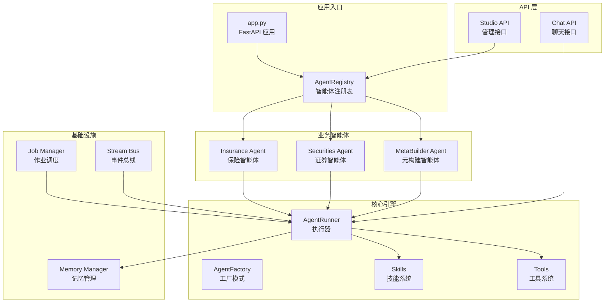
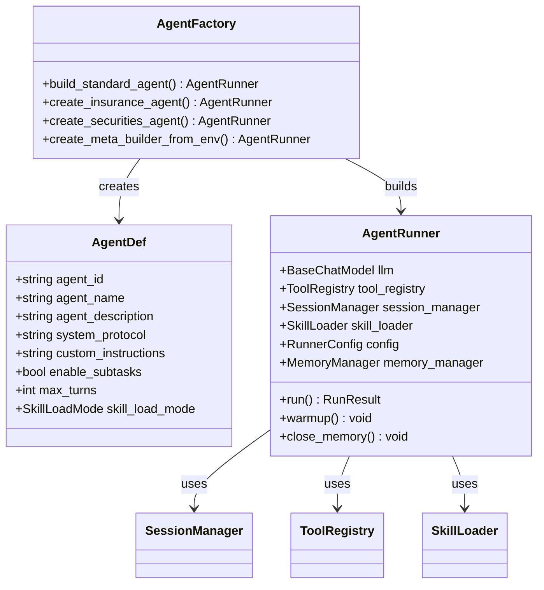
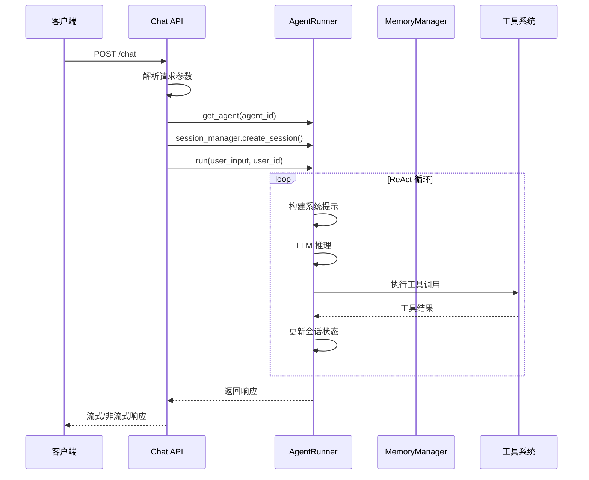
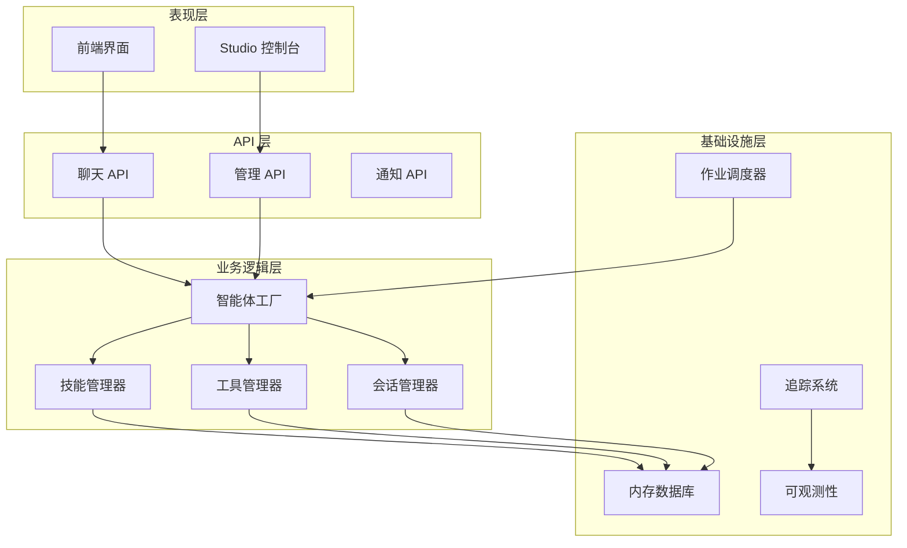
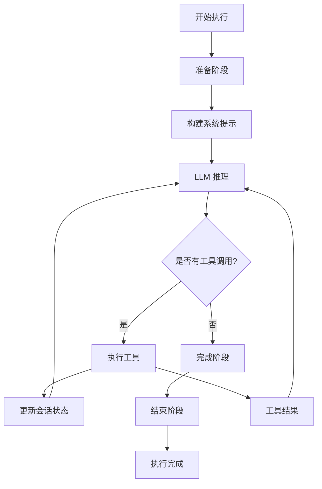
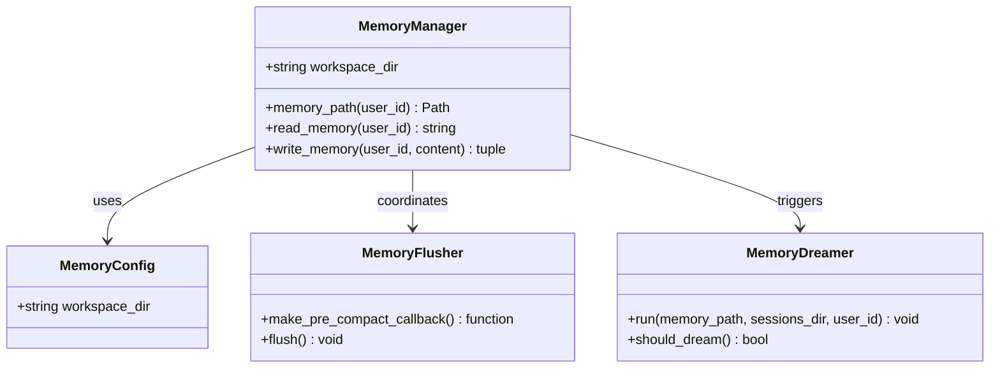
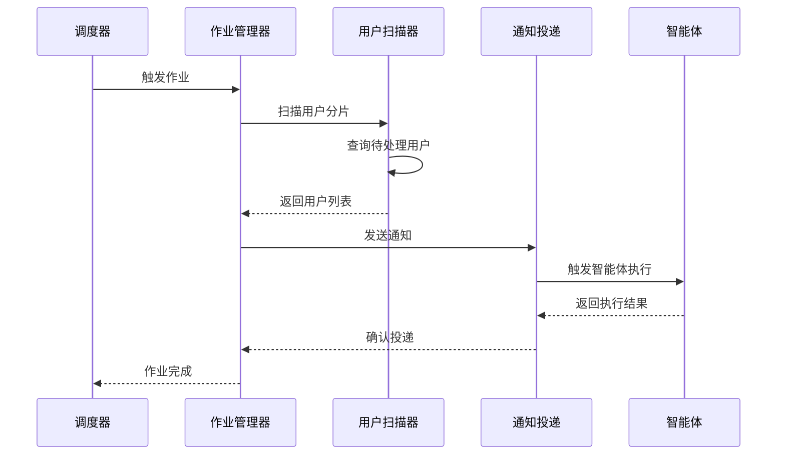
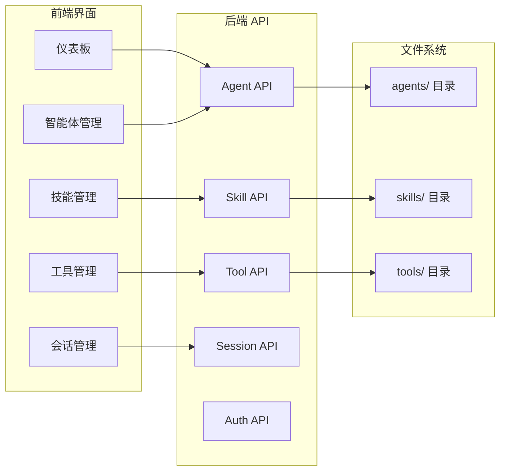
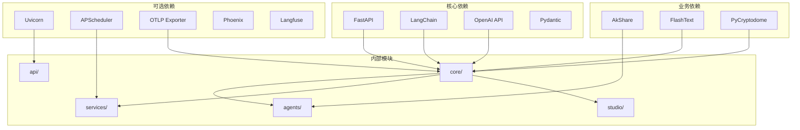

# 智能体工厂系统

<cite>
**本文档引用的文件**
- [app.py](file://src/ark_agentic/app.py)
- [agent_factory.py](file://src/ark_agentic/core/agent_factory.py)
- [studio/__init__.py](file://src/ark_agentic/studio/__init__.py)
- [factory.py](file://src/ark_agentic/agents/meta_builder/factory.py)
- [chat.py](file://src/ark_agentic/api/chat.py)
- [runner.py](file://src/ark_agentic/core/runner.py)
- [agent.py](file://src/ark_agentic/agents/insurance/agent.py)
- [agent.py](file://src/ark_agentic/agents/securities/agent.py)
- [manager.py](file://src/ark_agentic/core/memory/manager.py)
- [manager.py](file://src/ark_agentic/services/jobs/manager.py)
- [base.py](file://src/ark_agentic/core/tools/base.py)
- [base.py](file://src/ark_agentic/core/skills/base.py)
- [agents.py](file://src/ark_agentic/studio/api/agents.py)
- [pyproject.toml](file://pyproject.toml)
</cite>

## 目录
1. [简介](#简介)
2. [项目结构](#项目结构)
3. [核心组件](#核心组件)
4. [架构概览](#架构概览)
5. [详细组件分析](#详细组件分析)
6. [依赖分析](#依赖分析)
7. [性能考虑](#性能考虑)
8. [故障排除指南](#故障排除指南)
9. [结论](#结论)

## 简介

智能体工厂系统是一个基于 ReAct 框架的轻量级智能体平台，专为金融领域设计。该系统提供了统一的 API 接口，支持保险和证券资产管理两大核心业务场景，具备强大的工具调用能力和记忆管理系统。

系统采用模块化设计，通过工厂模式创建和管理不同类型的智能体，支持动态技能加载、流式响应处理和可观察性追踪。核心特性包括：

- **多智能体架构**：支持保险智能体和证券智能体的并行运行
- **动态技能系统**：按需加载技能，优化性能和用户体验
- **工具调用机制**：丰富的工具集支持复杂的业务操作
- **记忆管理**：轻量级记忆系统支持用户状态持久化
- **可观察性**：完整的追踪和监控能力
- **Studio 控制台**：可视化的管理界面

## 项目结构

**图表来源**
- [app.py:45-105](file://src/ark_agentic/app.py#L45-L105)
- [agent_factory.py:58-151](file://src/ark_agentic/core/agent_factory.py#L58-L151)
- [runner.py:176-264](file://src/ark_agentic/core/runner.py#L176-L264)

**章节来源**
- [app.py:1-351](file://src/ark_agentic/app.py#L1-L351)
- [pyproject.toml:1-112](file://pyproject.toml#L1-L112)

## 核心组件

### 智能体工厂系统

智能体工厂系统的核心是 AgentFactory 模式，提供标准化的智能体创建流程：

**图表来源**
- [agent_factory.py:34-151](file://src/ark_agentic/core/agent_factory.py#L34-L151)
- [runner.py:176-264](file://src/ark_agentic/core/runner.py#L176-L264)

### API 路由系统

系统提供统一的 API 接口，支持流式和非流式响应：

**图表来源**
- [chat.py:27-177](file://src/ark_agentic/api/chat.py#L27-L177)
- [runner.py:292-378](file://src/ark_agentic/core/runner.py#L292-L378)

**章节来源**
- [agent_factory.py:1-151](file://src/ark_agentic/core/agent_factory.py#L1-L151)
- [chat.py:1-177](file://src/ark_agentic/api/chat.py#L1-L177)

## 架构概览

智能体工厂系统采用分层架构设计，各层职责明确：

**图表来源**
- [app.py:171-203](file://src/ark_agentic/app.py#L171-L203)
- [studio/__init__.py:27-102](file://src/ark_agentic/studio/__init__.py#L27-L102)

## 详细组件分析

### 智能体运行器 (AgentRunner)

AgentRunner 是系统的核心执行组件，实现了 ReAct 框架的完整流程：

**图表来源**
- [runner.py:681-787](file://src/ark_agentic/core/runner.py#L681-L787)

#### 关键特性

1. **ReAct 循环**: 实现推理-行动-观察的迭代过程
2. **工具执行**: 支持并发工具调用和超时控制
3. **会话管理**: 自动压缩和历史合并
4. **回调系统**: 支持前置和后置钩子
5. **错误处理**: 完善的异常捕获和恢复机制

**章节来源**
- [runner.py:1-800](file://src/ark_agentic/core/runner.py#L1-L800)

### 记忆管理系统

系统提供轻量级的记忆管理功能：

**图表来源**
- [manager.py:18-82](file://src/ark_agentic/core/memory/manager.py#L18-L82)

#### 功能特点

- **纯文本存储**: 使用 MEMORY.md 文件存储记忆内容
- **标题级操作**: 支持按标题级别进行增删改查
- **自动蒸馏**: 后台进行记忆内容的总结和压缩
- **状态同步**: 与会话状态自动同步

**章节来源**
- [manager.py:1-92](file://src/ark_agentic/core/memory/manager.py#L1-L92)

### 作业调度系统

Proactive 作业调度系统支持定时任务和通知管理：

**图表来源**
- [manager.py:110-123](file://src/ark_agentic/services/jobs/manager.py#L110-L123)

**章节来源**
- [manager.py:1-123](file://src/ark_agentic/services/jobs/manager.py#L1-L123)

### Studio 管理控制台

Studio 提供可视化的智能体管理界面：

**图表来源**
- [studio/__init__.py:27-102](file://src/ark_agentic/studio/__init__.py#L27-L102)
- [agents.py:76-131](file://src/ark_agentic/studio/api/agents.py#L76-L131)

**章节来源**
- [studio/__init__.py:1-102](file://src/ark_agentic/studio/__init__.py#L1-L102)
- [agents.py:1-131](file://src/ark_agentic/studio/api/agents.py#L1-L131)

## 依赖分析

系统采用模块化依赖设计，主要依赖关系如下：

**图表来源**
- [pyproject.toml:7-55](file://pyproject.toml#L7-L55)

**章节来源**
- [pyproject.toml:1-112](file://pyproject.toml#L1-L112)

## 性能考虑

### 内存管理

系统采用轻量级内存管理策略：

1. **延迟加载**: 技能和工具按需加载，减少启动时间
2. **自动压缩**: 会话历史自动压缩，控制内存使用
3. **缓存机制**: 工具调用结果缓存，避免重复计算
4. **异步处理**: 并发执行多个任务，提高吞吐量

### 扩展性设计

- **插件化架构**: 支持动态添加新智能体和工具
- **配置驱动**: 通过环境变量和配置文件控制行为
- **水平扩展**: 支持多实例部署和负载均衡
- **资源隔离**: 每个智能体拥有独立的内存空间

## 故障排除指南

### 常见问题

1. **智能体启动失败**
   - 检查 LLM 配置和 API 密钥
   - 验证技能文件完整性
   - 查看日志获取详细错误信息

2. **工具调用超时**
   - 检查网络连接和 API 限流
   - 调整工具超时参数
   - 优化工具执行逻辑

3. **内存使用过高**
   - 启用自动压缩功能
   - 检查会话历史长度
   - 清理不必要的记忆数据

4. **Studio 无法访问**
   - 确认 ENABLE_STUDIO 环境变量
   - 检查前端构建产物
   - 验证路由配置

**章节来源**
- [runner.py:621-640](file://src/ark_agentic/core/runner.py#L621-L640)

## 结论

智能体工厂系统提供了一个完整、可扩展的智能体平台，具有以下优势：

1. **模块化设计**: 清晰的分层架构便于维护和扩展
2. **功能完整**: 支持复杂的业务场景和高级功能
3. **易于使用**: 标准化的 API 和配置简化了开发流程
4. **性能优秀**: 优化的内存管理和并发处理机制
5. **可观测性强**: 完善的追踪和监控能力

系统特别适合金融领域的智能体应用，为保险和证券资产管理提供了强大的技术支持。通过灵活的配置和丰富的扩展能力，开发者可以快速构建和部署各种智能体应用。