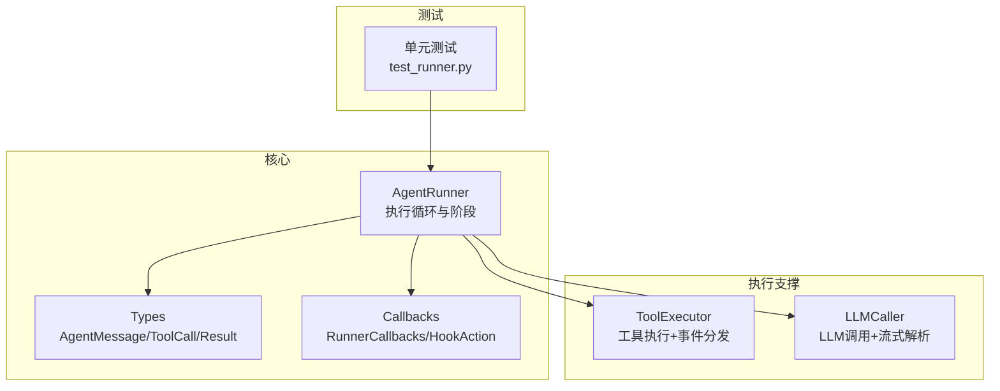
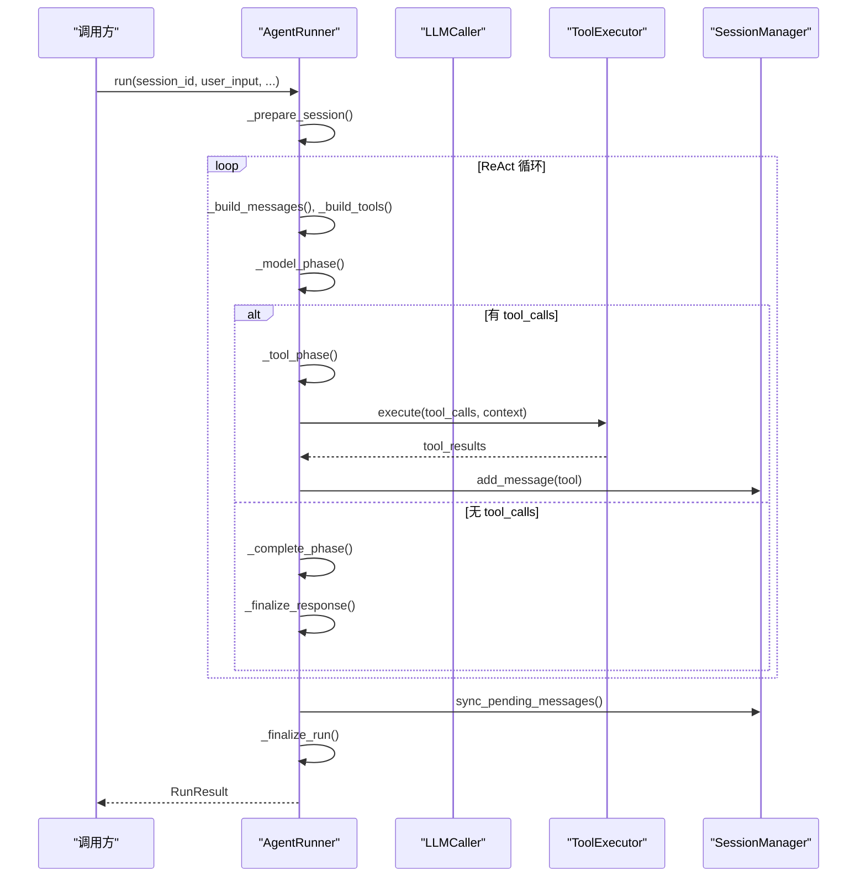
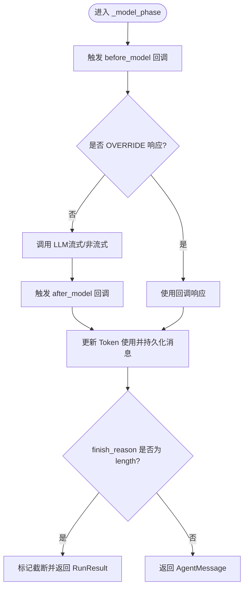
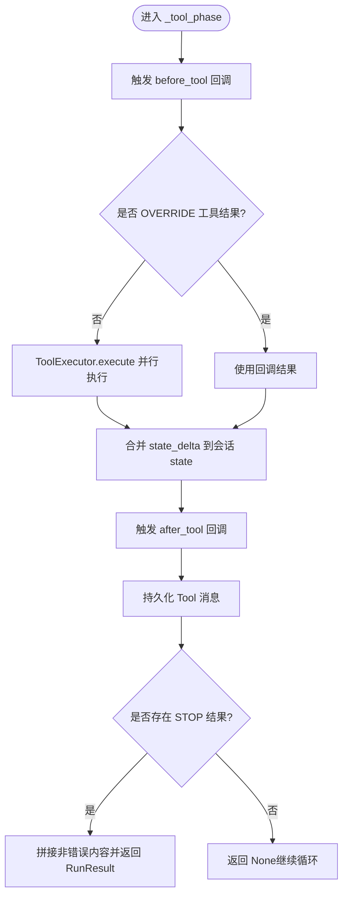
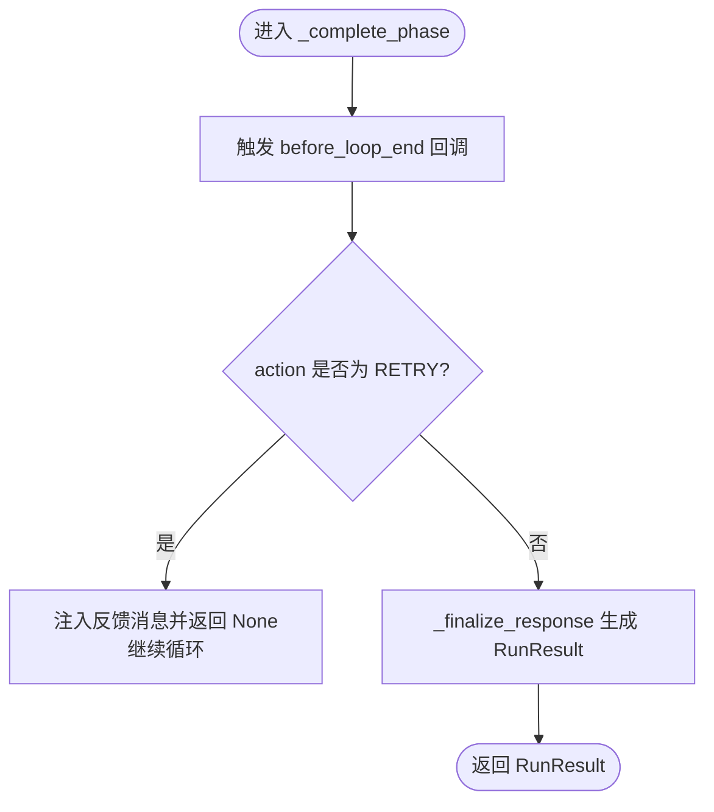
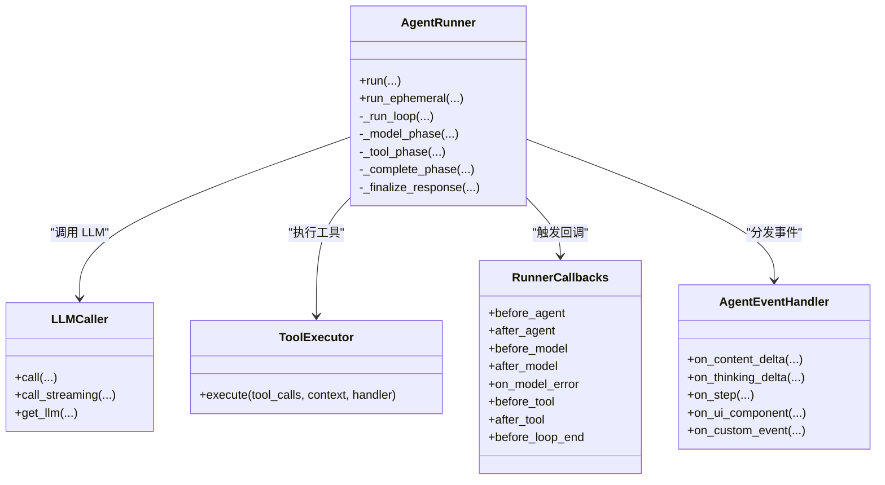

# ReAct 执行循环

<cite>
**本文引用的文件**
- [runner.py](file://src/ark_agentic/core/runner.py)
- [types.py](file://src/ark_agentic/core/types.py)
- [callbacks.py](file://src/ark_agentic/core/callbacks.py)
- [executor.py](file://src/ark_agentic/core/tools/executor.py)
- [caller.py](file://src/ark_agentic/core/llm/caller.py)
- [test_runner.py](file://tests/unit/core/test_runner.py)
</cite>

## 目录
1. [简介](#简介)
2. [项目结构](#项目结构)
3. [核心组件](#核心组件)
4. [架构总览](#架构总览)
5. [详细组件分析](#详细组件分析)
6. [依赖分析](#依赖分析)
7. [性能考虑](#性能考虑)
8. [故障排查指南](#故障排查指南)
9. [结论](#结论)
10. [附录](#附录)

## 简介
本文件面向 ReAct 执行循环的实现，聚焦 AgentRunner 的核心执行循环，系统性阐述四个阶段：
- 模型推理阶段（_model_phase）
- 工具调用阶段（_tool_phase）
- 完成阶段（_complete_phase）
- 循环控制逻辑（_run_loop）

文档同时覆盖输入输出、内部状态管理、错误处理机制、回调触发时机、轮次限制、工具调用限制、超时处理、性能优化建议与常见问题排查。

## 项目结构
围绕 ReAct 执行循环的关键模块如下：
- 核心执行器：AgentRunner（runner.py）
- 类型与枚举：AgentMessage、ToolCall、AgentToolResult、ToolLoopAction 等（types.py）
- 生命周期回调：RunnerCallbacks、HookAction、CallbackContext、CallbackResult（callbacks.py）
- 工具执行器：ToolExecutor（executor.py）
- LLM 调用器：LLMCaller（caller.py）
- 单元测试：验证执行循环行为（test_runner.py）

图表来源
- [runner.py:193-284](file://src/ark_agentic/core/runner.py#L193-L284)
- [types.py:70-120](file://src/ark_agentic/core/types.py#L70-L120)
- [callbacks.py:43-197](file://src/ark_agentic/core/callbacks.py#L43-L197)
- [executor.py:29-127](file://src/ark_agentic/core/tools/executor.py#L29-L127)
- [caller.py:26-218](file://src/ark_agentic/core/llm/caller.py#L26-L218)
- [test_runner.py:141-195](file://tests/unit/core/test_runner.py#L141-L195)

章节来源
- [runner.py:193-284](file://src/ark_agentic/core/runner.py#L193-L284)
- [types.py:70-120](file://src/ark_agentic/core/types.py#L70-L120)
- [callbacks.py:43-197](file://src/ark_agentic/core/callbacks.py#L43-L197)
- [executor.py:29-127](file://src/ark_agentic/core/tools/executor.py#L29-L127)
- [caller.py:26-218](file://src/ark_agentic/core/llm/caller.py#L26-L218)
- [test_runner.py:141-195](file://tests/unit/core/test_runner.py#L141-L195)

## 核心组件
- AgentRunner：负责构建系统提示、调用 LLM、执行工具、状态合并、回调与事件分发、循环控制与结果汇总。
- RunnerConfig：包含轮次上限、工具调用上限、工具超时、采样参数、自动压缩等配置。
- _LoopState：累积每轮统计（轮次、工具调用总数、Token 使用、工具调用与结果列表）。
- RunResult：最终结果封装（响应、轮次、工具调用次数、工具调用与结果、Token 使用、是否因限制停止）。
- LLMCaller：封装非流式与流式 LLM 调用，支持指数退避重试、Thinking 模型 reasoning_content 分发。
- ToolExecutor：并发执行工具调用，超时与异常兜底，事件分发。
- 回调系统：before_agent/after_agent、before_model/after_model/on_model_error、before_tool/after_tool、before_loop_end。

章节来源
- [runner.py:92-187](file://src/ark_agentic/core/runner.py#L92-L187)
- [runner.py:652-730](file://src/ark_agentic/core/runner.py#L652-L730)
- [runner.py:760-880](file://src/ark_agentic/core/runner.py#L760-L880)
- [runner.py:882-964](file://src/ark_agentic/core/runner.py#L882-L964)
- [runner.py:966-983](file://src/ark_agentic/core/runner.py#L966-L983)
- [caller.py:26-218](file://src/ark_agentic/core/llm/caller.py#L26-L218)
- [executor.py:29-127](file://src/ark_agentic/core/tools/executor.py#L29-L127)
- [callbacks.py:43-197](file://src/ark_agentic/core/callbacks.py#L43-L197)

## 架构总览
ReAct 执行循环以 AgentRunner 为中心，贯穿以下关键流程：
- 准备阶段：准备会话、注入 input_context、外部历史合并、自动压缩、记录用户输入。
- 循环阶段：构建消息与工具 schema → 模型推理（before_model → LLM → after_model → 持久化）→ 工具调用（before_tool → 并行执行 → after_tool → 持久化）→ 完成阶段（before_loop_end → finalize）。
- 终止条件：达到轮次上限、工具调用触发 STOP、LLM finish_reason 为 length、模型错误（on_model_error）。
- 结果汇总：RunResult 包含响应、统计与标志位。

图表来源
- [runner.py:312-370](file://src/ark_agentic/core/runner.py#L312-L370)
- [runner.py:652-730](file://src/ark_agentic/core/runner.py#L652-L730)
- [runner.py:760-880](file://src/ark_agentic/core/runner.py#L760-L880)
- [runner.py:882-964](file://src/ark_agentic/core/runner.py#L882-L964)
- [runner.py:966-983](file://src/ark_agentic/core/runner.py#L966-L983)
- [executor.py:43-61](file://src/ark_agentic/core/tools/executor.py#L43-L61)
- [caller.py:70-94](file://src/ark_agentic/core/llm/caller.py#L70-L94)

## 详细组件分析

### AgentRunner 执行循环（_run_loop）
- 控制流：根据轮次上限循环，每轮构建消息与工具 schema，依次进入模型推理、工具调用、完成阶段。
- 统计与状态：_LoopState 累积轮次、工具调用数量、Token 使用、工具调用与结果列表。
- 终止条件：
  - 达到 max_turns：返回最后一条助手消息并标记 stopped_by_limit=True。
  - LLM finish_reason 为 length：截断并标记 stopped_by_limit=True。
  - 工具调用包含 STOP：立即返回，内容来自工具结果的非错误内容拼接。
  - 模型错误：on_model_error 触发，生成用户友好错误消息并返回 RunResult。

章节来源
- [runner.py:652-730](file://src/ark_agentic/core/runner.py#L652-L730)

### 模型推理阶段（_model_phase）
- 输入：
  - messages：系统提示 + 历史消息（工具调用与结果按规则转换）。
  - tools：工具 schema（按技能加载模式筛选）。
  - use_streaming：是否流式。
  - model_override/sampling_override：模型与采样覆盖。
  - handler：事件处理器（内容增量、思考增量、步骤、UI 组件、自定义事件）。
  - cb_ctx：回调上下文。
- 处理：
  - before_model：可注入消息或短路（OVERRIDE）。
  - LLM 调用：非流式或流式；流式识别 Thinking 模型 reasoning_content 并路由到思考回调。
  - after_model：可替换响应。
  - 持久化：更新 Token 使用、追加消息到会话。
  - finish_reason：若为 length，标记截断。
- 错误处理：
  - on_model_error：记录错误原因与可重试性，生成用户友好消息，追加到会话并返回 RunResult。
- 输出：AgentMessage 或 RunResult（错误时）。

图表来源
- [runner.py:760-880](file://src/ark_agentic/core/runner.py#L760-L880)
- [callbacks.py:116-131](file://src/ark_agentic/core/callbacks.py#L116-L131)
- [caller.py:70-192](file://src/ark_agentic/core/llm/caller.py#L70-L192)

章节来源
- [runner.py:760-880](file://src/ark_agentic/core/runner.py#L760-L880)
- [callbacks.py:116-131](file://src/ark_agentic/core/callbacks.py#L116-L131)
- [caller.py:70-192](file://src/ark_agentic/core/llm/caller.py#L70-L192)

### 工具调用阶段（_tool_phase）
- 输入：
  - response：上一轮模型输出（包含 tool_calls）。
  - session/state：会话与状态上下文。
  - handler：事件处理器。
  - cb_ctx：回调上下文。
- 处理：
  - before_tool：可短路（OVERRIDE）直接返回工具结果。
  - ToolExecutor.execute：并发执行工具调用，限制每轮工具调用数量，超时与异常兜底。
  - 合并 state_delta：将工具结果中的 state_delta 合并到会话 state。
  - after_tool：可替换工具结果。
  - 持久化：将工具结果封装为 Tool 消息并追加到会话。
  - STOP 检查：若存在 ToolLoopAction.STOP 的结果，拼接非错误内容并返回 RunResult。
  - 全部错误：记录警告。
- 输出：None（继续循环）或 RunResult（STOP 或错误）。

图表来源
- [runner.py:882-964](file://src/ark_agentic/core/runner.py#L882-L964)
- [executor.py:43-100](file://src/ark_agentic/core/tools/executor.py#L43-L100)
- [callbacks.py:142-155](file://src/ark_agentic/core/callbacks.py#L142-L155)

章节来源
- [runner.py:882-964](file://src/ark_agentic/core/runner.py#L882-L964)
- [executor.py:43-100](file://src/ark_agentic/core/tools/executor.py#L43-L100)
- [callbacks.py:142-155](file://src/ark_agentic/core/callbacks.py#L142-L155)

### 完成阶段（_complete_phase）
- 输入：
  - response：最终（非工具调用）的模型输出。
  - session/state/handler/cb_ctx。
- 处理：
  - before_loop_end：可触发 RETRY，注入反馈消息并继续循环。
  - _finalize_response：记录统计并生成 RunResult。
- 输出：RunResult 或 None（RETRY 时返回 None，驱动循环继续）。

图表来源
- [runner.py:734-758](file://src/ark_agentic/core/runner.py#L734-L758)
- [callbacks.py:158-166](file://src/ark_agentic/core/callbacks.py#L158-L166)

章节来源
- [runner.py:734-758](file://src/ark_agentic/core/runner.py#L734-L758)
- [callbacks.py:158-166](file://src/ark_agentic/core/callbacks.py#L158-L166)

### 循环控制逻辑（_run_loop）
- 轮次控制：while ls.turns < max_turns。
- 每轮：
  - 构建 messages 与 tools。
  - 进入 _model_phase。
  - 若有 tool_calls：进入 _tool_phase；否则进入 _complete_phase。
  - 若 _complete_phase 返回 None（RETRY），则继续循环。
- 终止：
  - 达到 max_turns：返回最后一条助手消息并标记 stopped_by_limit=True。
  - LLM finish_reason 为 length：返回 RunResult 并标记 stopped_by_limit=True。
  - 工具调用触发 STOP：返回 RunResult。

章节来源
- [runner.py:652-730](file://src/ark_agentic/core/runner.py#L652-L730)

### 数据结构与复杂度
- RunResult：封装最终响应与统计，O(1) 构造。
- _LoopState：累积统计，O(1) 更新，O(n) 汇总（n 为轮次）。
- 消息构建（_build_messages）：遍历历史消息，O(m)（m 为消息数），工具调用与结果转换 O(k)（k 为工具调用/结果数）。
- 工具执行（ToolExecutor.execute）：并发执行 O(t) 个工具调用，受限于 max_calls_per_turn。

章节来源
- [runner.py:131-187](file://src/ark_agentic/core/runner.py#L131-L187)
- [runner.py:985-1072](file://src/ark_agentic/core/runner.py#L985-L1072)
- [executor.py:43-61](file://src/ark_agentic/core/tools/executor.py#L43-L61)

## 依赖分析
- AgentRunner 依赖：
  - LLMCaller：封装 LLM 调用与重试、流式解析。
  - ToolExecutor：并发执行工具、事件分发、超时与异常兜底。
  - SessionManager：消息持久化、Token 使用统计、会话状态管理。
  - ToolRegistry/SkillMatcher：工具与技能的动态加载与筛选。
  - 回调系统：RunnerCallbacks/HookAction/CallbackContext/CallbackResult。
- 关键耦合点：
  - LLMCaller 与 ToolExecutor 的 SRP 设计降低耦合。
  - 回调系统通过 HookAction 控制流程（PASS/ABORT/OVERRIDE/RETRY）。
  - 事件分发通过 AgentEventHandler 接口解耦前端渲染。

图表来源
- [runner.py:193-284](file://src/ark_agentic/core/runner.py#L193-L284)
- [caller.py:26-218](file://src/ark_agentic/core/llm/caller.py#L26-L218)
- [executor.py:29-127](file://src/ark_agentic/core/tools/executor.py#L29-L127)
- [callbacks.py:172-197](file://src/ark_agentic/core/callbacks.py#L172-L197)

章节来源
- [runner.py:193-284](file://src/ark_agentic/core/runner.py#L193-L284)
- [callbacks.py:172-197](file://src/ark_agentic/core/callbacks.py#L172-L197)

## 性能考虑
- 并发工具执行：ToolExecutor.execute 使用 asyncio.gather 并行执行工具调用，提升吞吐。
- 流式 LLM：LLMCaller.call_streaming 支持增量内容与思考内容回调，降低首屏延迟。
- Token 与历史压缩：RunnerConfig.auto_compact 与 MemoryFlusher/MemoryDreamer 机制减少上下文长度，提高稳定性。
- 事件分发：ToolExecutor._dispatch_events 将工具事件统一分发，避免工具与 UI 的紧耦合。
- 重试策略：LLMCaller 使用 with_retry/with_retry_iterator 指数退避重试，提升鲁棒性。
- 限制与保护：
  - max_turns：防止无限循环。
  - max_tool_calls_per_turn：限制每轮工具调用数量。
  - tool_timeout：单个工具超时保护。
  - finish_reason 为 length：避免过长响应。

章节来源
- [executor.py:43-61](file://src/ark_agentic/core/tools/executor.py#L43-L61)
- [caller.py:70-192](file://src/ark_agentic/core/llm/caller.py#L70-L192)
- [runner.py:92-106](file://src/ark_agentic/core/runner.py#L92-L106)
- [runner.py:876-878](file://src/ark_agentic/core/runner.py#L876-L878)

## 故障排查指南
- 模型错误（LLMError）：
  - 触发 on_model_error 回调，记录原因与可重试性，生成用户友好消息并返回 RunResult。
  - 常见原因：认证失败、配额不足、速率限制、超时、上下文溢出、内容过滤、服务器错误、网络问题。
- 工具超时/异常：
  - ToolExecutor._execute_single 捕获超时与异常，返回错误结果并记录日志。
  - handler.on_step 会提示“工具调用遇到问题，正在尝试其他方式…”。
- 截断与轮次限制：
  - finish_reason 为 length：标记截断并返回 RunResult。
  - 达到 max_turns：返回最后助手消息并标记 stopped_by_limit=True。
- 回调短路与重试：
  - before_model 的 OVERRIDE：跳过 LLM 调用，使用回调响应。
  - before_tool 的 OVERRIDE：跳过真实工具，使用回调结果。
  - before_loop_end 的 RETRY：注入反馈消息并继续循环。
- A2UI 历史遮蔽：
  - _build_messages 对 render_a2ui 的工具调用参数保留，结果内容进行遮蔽，避免泄露敏感数据。

章节来源
- [runner.py:592-610](file://src/ark_agentic/core/runner.py#L592-L610)
- [runner.py:816-840](file://src/ark_agentic/core/runner.py#L816-L840)
- [executor.py:80-100](file://src/ark_agentic/core/tools/executor.py#L80-L100)
- [callbacks.py:116-166](file://src/ark_agentic/core/callbacks.py#L116-L166)
- [runner.py:1006-1071](file://src/ark_agentic/core/runner.py#L1006-L1071)

## 结论
AgentRunner 的 ReAct 执行循环通过清晰的阶段划分、严格的限制与保护、完善的回调与事件机制，实现了稳定、可观测且可扩展的智能体执行框架。模型推理、工具调用、完成阶段与循环控制逻辑相互协作，配合 LLMCaller 与 ToolExecutor 的 SRP 设计，确保了高吞吐与高可用性。通过合理的配置与回调策略，可在安全边界内灵活扩展业务能力。

## 附录
- 钩子与动作速查（来自 README 的钩子说明）：
  - before_agent：一次，ABORT 拒绝请求。
  - after_agent：一次，后处理。
  - before_model：每轮，OVERRIDE 跳过 LLM。
  - after_model：每轮，响应替换。
  - on_model_error：错误路径，独立触发。
  - before_tool：每轮，OVERRIDE 跳过工具。
  - after_tool：每轮，结果替换。
  - before_loop_end：最终回答前，RETRY 注入反馈继续循环。

章节来源
- [test_runner.py:141-195](file://tests/unit/core/test_runner.py#L141-L195)
- [README.md:436-468](file://README.md#L436-L468)