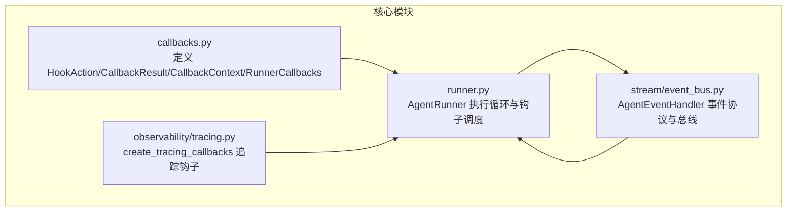
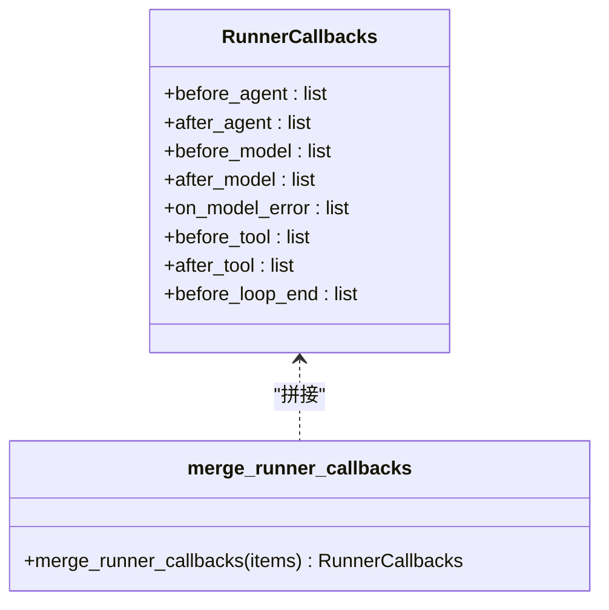
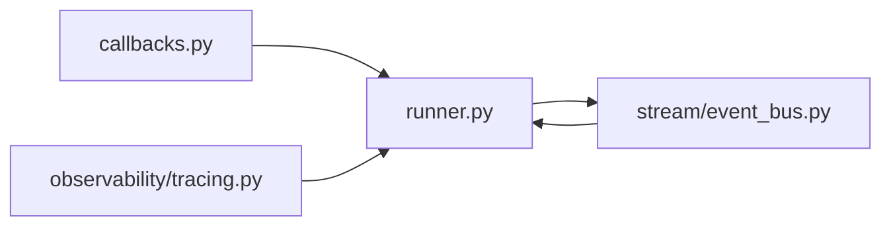

# 回调系统

<cite>
**本文档引用的文件**
- [callbacks.py](file://src/ark_agentic/core/callbacks.py)
- [runner.py](file://src/ark_agentic/core/runner.py)
- [tracing.py](file://src/ark_agentic/core/observability/tracing.py)
- [event_bus.py](file://src/ark_agentic/core/stream/event_bus.py)
- [test_callbacks.py](file://tests/unit/core/test_callbacks.py)
- [test_runner_dispatch_and_loop_state.py](file://tests/unit/core/test_runner_dispatch_and_loop_state.py)
</cite>

## 目录
1. [简介](#简介)
2. [项目结构](#项目结构)
3. [核心组件](#核心组件)
4. [架构总览](#架构总览)
5. [详细组件分析](#详细组件分析)
6. [依赖关系分析](#依赖关系分析)
7. [性能考量](#性能考量)
8. [故障排查指南](#故障排查指南)
9. [结论](#结论)
10. [附录](#附录)

## 简介
本文件面向智能体执行回调系统，系统性阐述 RunnerCallbacks 的设计模式与 HookAction 的执行机制。重点覆盖以下方面：
- 生命周期钩子：before_agent、after_agent、before_model、after_model、on_model_error、before_tool、after_tool、before_loop_end
- 回调函数签名、参数传递、上下文更新与事件分发
- 回调链执行顺序、短路机制与错误处理策略
- 回调容器合并、追踪回调集成与事件总线对接
- 实践建议与调试技巧

## 项目结构
回调系统位于核心模块，围绕 RunnerCallbacks 容器组织，Runner 负责在 ReAct 循环各阶段触发相应钩子，并通过统一的事件分发与上下文更新机制协调外部扩展。



图表来源
- [callbacks.py:1-198](file://src/ark_agentic/core/callbacks.py#L1-L198)
- [runner.py:18-50](file://src/ark_agentic/core/runner.py#L18-L50)
- [tracing.py:227-481](file://src/ark_agentic/core/observability/tracing.py#L227-L481)
- [event_bus.py:28-61](file://src/ark_agentic/core/stream/event_bus.py#L28-L61)

章节来源
- [callbacks.py:1-198](file://src/ark_agentic/core/callbacks.py#L1-L198)
- [runner.py:18-50](file://src/ark_agentic/core/runner.py#L18-L50)

## 核心组件
- HookAction：枚举型动作意图，决定回调对默认流程的影响（PASS/ABORT/OVERRIDE/RETRY）
- CallbackResult：回调声明的变更意图，包含 action、response、tool_results、context_updates、event
- CallbackContext：回调共享上下文，贯穿整个 run 生命周期
- RunnerCallbacks：回调容器，聚合所有钩子列表
- AgentRunner：执行器，负责在 ReAct 循环各阶段触发钩子，应用短路与上下文更新

章节来源
- [callbacks.py:43-70](file://src/ark_agentic/core/callbacks.py#L43-L70)
- [callbacks.py:75-93](file://src/ark_agentic/core/callbacks.py#L75-L93)
- [callbacks.py:172-182](file://src/ark_agentic/core/callbacks.py#L172-L182)
- [runner.py:193-242](file://src/ark_agentic/core/runner.py#L193-L242)

## 架构总览
回调系统采用“容器 + 执行器”的分层设计：
- 容器层：RunnerCallbacks 聚合各钩子列表
- 执行层：AgentRunner 在生命周期关键节点调用钩子，遵循短路与上下文更新规则
- 扩展层：observability 提供追踪钩子，stream 提供事件总线协议

```mermaid
sequenceDiagram
participant U as "调用方"
participant AR as "AgentRunner"
participant CB as "RunnerCallbacks"
participant EH as "AgentEventHandler"
U->>AR : run(session_id, user_input, ...)
AR->>CB : before_agent 链
CB-->>AR : CallbackResult(action, context_updates, event)
AR->>EH : 分发事件
AR->>AR : 更新 input_context
alt action == ABORT
AR-->>U : 返回 RunResult
else 继续
loop ReAct 循环
AR->>CB : before_model 链
AR->>AR : LLM 调用
opt 成功
AR->>CB : after_model 链
end
opt 工具调用
AR->>CB : before_tool 链
AR->>AR : 执行工具
AR->>CB : after_tool 链
end
AR->>CB : before_loop_end 链
opt action == RETRY
AR->>AR : 注入反馈消息
else
AR->>AR : _finalize_response
end
end
AR->>CB : after_agent 链
AR-->>U : 返回 RunResult
end
```

图表来源
- [runner.py:312-370](file://src/ark_agentic/core/runner.py#L312-L370)
- [runner.py:406-493](file://src/ark_agentic/core/runner.py#L406-L493)
- [runner.py:652-720](file://src/ark_agentic/core/runner.py#L652-L720)
- [runner.py:734-758](file://src/ark_agentic/core/runner.py#L734-L758)
- [runner.py:882-964](file://src/ark_agentic/core/runner.py#L882-L964)
- [runner.py:966-983](file://src/ark_agentic/core/runner.py#L966-L983)
- [runner.py:495-516](file://src/ark_agentic/core/runner.py#L495-L516)

## 详细组件分析

### RunnerCallbacks 设计与合并
- RunnerCallbacks 以列表形式持有各钩子集合，便于按序执行与短路
- merge_runner_callbacks 支持将多个容器按顺序拼接，保持调用顺序
- 容器构建时通过 _build_runner_callbacks 将内部追踪钩子与外部钩子组合，内部钩子优先



图表来源
- [callbacks.py:172-198](file://src/ark_agentic/core/callbacks.py#L172-L198)
- [runner.py:58-72](file://src/ark_agentic/core/runner.py#L58-L72)

章节来源
- [callbacks.py:172-198](file://src/ark_agentic/core/callbacks.py#L172-L198)
- [runner.py:58-72](file://src/ark_agentic/core/runner.py#L58-L72)

### HookAction 与 CallbackResult
- HookAction.PASS：不干预，默认流程
- HookAction.ABORT：before_agent 拒绝请求，直接返回
- HookAction.OVERRIDE：before_model/before_tool 替换默认输出/结果
- HookAction.RETRY：before_loop_end 注入反馈消息，继续循环
- CallbackResult 支持 response/tool_results/context_updates/event，字段为 None 表示不变更

章节来源
- [callbacks.py:43-70](file://src/ark_agentic/core/callbacks.py#L43-L70)

### 回调容器与钩子协议
- BeforeAgentCallback：一次触发，可 ABORT 并返回 response
- AfterAgentCallback：一次触发，接收最终 RunResult
- BeforeModelCallback：每轮 LLM 调用前，可 OVERRIDE
- AfterModelCallback：LLM 成功后，可替换 response
- OnModelErrorCallback：LLMError 时触发，与 after_model 互斥
- BeforeToolCallback：每轮工具批执行前，可 OVERRIDE
- AfterToolCallback：工具执行后，可替换 tool_results
- BeforeLoopEndCallback：最终回答前，可 RETRY 注入反馈

章节来源
- [callbacks.py:98-166](file://src/ark_agentic/core/callbacks.py#L98-L166)

### 回调链执行与短路机制
_run_hooks 的执行策略：
- 顺序遍历钩子，遇到非 None 的 CallbackResult 即应用 context_updates/event
- 若 action != PASS，则立即返回该结果（短路），不再执行后续钩子
- 返回最后一个非 None 结果，或 None

_dispatch_event 将 CallbackEvent 路由到 AgentEventHandler：
- type="step" → on_step
- type="ui_component" → on_ui_component
- 其他 → on_custom_event

章节来源
- [runner.py:622-650](file://src/ark_agentic/core/runner.py#L622-L650)
- [runner.py:612-621](file://src/ark_agentic/core/runner.py#L612-L621)

### 生命周期钩子触发时机与作用
- before_agent：进入 ReAct 循环前，一次；可 ABORT 拒绝请求
- after_agent：循环结束后，一次；可替换最终 response
- before_model：每轮 LLM 调用前；可 OVERRIDE 跳过 LLM
- after_model：LLM 成功后，before persist；可替换 response
- on_model_error：LLMError 时触发；与 after_model 互斥
- before_tool：每轮工具批执行前；可 OVERRIDE 跳过工具
- after_tool：工具执行后；可替换 tool_results
- before_loop_end：最终回答（非工具调用）落地前；可 RETRY 注入反馈

章节来源
- [runner.py:406-493](file://src/ark_agentic/core/runner.py#L406-L493)
- [runner.py:734-758](file://src/ark_agentic/core/runner.py#L734-L758)
- [runner.py:760-880](file://src/ark_agentic/core/runner.py#L760-L880)
- [runner.py:882-964](file://src/ark_agentic/core/runner.py#L882-L964)

### 上下文更新与事件分发
- _run_hooks 在每次回调返回非 None 时，将 context_updates 合并到 input_context
- _run_hooks 在存在 event 且提供 handler 时，调用 _dispatch_event
- _dispatch_event 将事件路由到 handler 对应方法
- 追踪回调通过 CallbackContext.metadata 保存 span 管理器，实现生命周期 span 管理

章节来源
- [runner.py:622-650](file://src/ark_agentic/core/runner.py#L622-L650)
- [runner.py:612-621](file://src/ark_agentic/core/runner.py#L612-L621)
- [tracing.py:187-203](file://src/ark_agentic/core/observability/tracing.py#L187-L203)

### 错误处理策略
- LLMError 时触发 on_model_error 链，记录友好错误消息并返回 RunResult
- after_model 不在 LLMError 路径触发，确保错误路径与成功路径分离
- 追踪回调在 on_model_error 关闭模型 span 并记录错误属性

章节来源
- [runner.py:816-840](file://src/ark_agentic/core/runner.py#L816-L840)
- [tracing.py:354-358](file://src/ark_agentic/core/observability/tracing.py#L354-L358)

### 回调链组合与顺序
- _compose_runner_callbacks 将内部钩子与外部钩子组合，内部钩子优先
- merge_runner_callbacks 按参数顺序拼接，保持调用顺序
- 追踪回调通过 create_tracing_callbacks 注入，提供可观测性

章节来源
- [runner.py:58-72](file://src/ark_agentic/core/runner.py#L58-L72)
- [runner.py:75-86](file://src/ark_agentic/core/runner.py#L75-L86)
- [tracing.py:227-481](file://src/ark_agentic/core/observability/tracing.py#L227-L481)

### 事件总线与 UI 展示
- AgentEventHandler 定义事件协议，Runner 通过 _dispatch_event 路由
- StreamEventBus 实现 AgentEventHandler，将事件转换为 AG-UI 原生事件并入队
- 支持 step、content_delta、thinking_delta、ui_component、custom_event 等

章节来源
- [event_bus.py:28-61](file://src/ark_agentic/core/stream/event_bus.py#L28-L61)
- [event_bus.py:67-248](file://src/ark_agentic/core/stream/event_bus.py#L67-L248)
- [runner.py:612-621](file://src/ark_agentic/core/runner.py#L612-L621)

## 依赖关系分析
回调系统的关键依赖如下：
- callbacks.py：定义 HookAction、CallbackResult、CallbackContext、RunnerCallbacks
- runner.py：AgentRunner 调度钩子、应用短路与上下文更新、触发错误路径
- observability/tracing.py：提供 create_tracing_callbacks，注入追踪钩子
- stream/event_bus.py：定义 AgentEventHandler 协议与 StreamEventBus 实现



图表来源
- [callbacks.py:18-24](file://src/ark_agentic/core/callbacks.py#L18-L24)
- [runner.py:18-50](file://src/ark_agentic/core/runner.py#L18-L50)
- [tracing.py:17-18](file://src/ark_agentic/core/observability/tracing.py#L17-L18)
- [event_bus.py:20-21](file://src/ark_agentic/core/stream/event_bus.py#L20-L21)

章节来源
- [callbacks.py:18-24](file://src/ark_agentic/core/callbacks.py#L18-L24)
- [runner.py:18-50](file://src/ark_agentic/core/runner.py#L18-L50)
- [tracing.py:17-18](file://src/ark_agentic/core/observability/tracing.py#L17-L18)
- [event_bus.py:20-21](file://src/ark_agentic/core/stream/event_bus.py#L20-L21)

## 性能考量
- 钩子链短路：一旦回调返回非 PASS，立即终止后续钩子，降低开销
- 事件分发轻量：_dispatch_event 仅根据 type 路由，避免复杂分支
- 追踪钩子无 Provider 时为 NoOp，零成本降级
- 上下文更新按需合并，避免不必要的字典拷贝

## 故障排查指南
- 钩子未生效
  - 检查 RunnerCallbacks 是否正确注入到 AgentRunner
  - 确认钩子返回值是否为 None，导致未被应用
- 短路问题
  - 确认回调 action 是否为 PASS；非 PASS 将短路后续钩子
- 事件未到达前端
  - 检查 _dispatch_event 的 event.type 是否与 handler 方法匹配
  - 确认 handler 是否传入 Runner
- 追踪异常
  - 确认 OTel Provider 是否可用；无 Provider 时追踪钩子为 NoOp
  - 检查 CallbackContext.metadata 中的 _tracing_spans 是否正确管理

章节来源
- [runner.py:622-650](file://src/ark_agentic/core/runner.py#L622-L650)
- [runner.py:612-621](file://src/ark_agentic/core/runner.py#L612-L621)
- [tracing.py:227-236](file://src/ark_agentic/core/observability/tracing.py#L227-L236)

## 结论
回调系统通过 RunnerCallbacks 容器与 AgentRunner 的统一调度，实现了对智能体执行生命周期的细粒度控制。HookAction 的短路机制与 CallbackResult 的上下文更新能力，使得回调既能灵活干预执行流程，又保持与核心逻辑的解耦。结合追踪钩子与事件总线，系统具备良好的可观测性与前端交互能力。

## 附录

### 回调注册与使用示例（路径指引）
- 注册自定义回调
  - 在 RunnerCallbacks 中追加对应钩子列表
  - 参考：[test_callbacks.py:52-58](file://tests/unit/core/test_callbacks.py#L52-L58)
- 处理回调结果
  - 在钩子中返回 CallbackResult，设置 action/response/tool_results/context_updates/event
  - 参考：[callbacks.py:58-70](file://src/ark_agentic/core/callbacks.py#L58-L70)
- 实现回调链组合
  - 使用 merge_runner_callbacks 拼接多个容器
  - 参考：[callbacks.py:185-198](file://src/ark_agentic/core/callbacks.py#L185-L198)
- 事件分发与 UI 展示
  - 通过 CallbackEvent.type 路由到 AgentEventHandler
  - 参考：[runner.py:612-621](file://src/ark_agentic/core/runner.py#L612-L621)，[event_bus.py:28-61](file://src/ark_agentic/core/stream/event_bus.py#L28-L61)

### 回调系统最佳实践
- 明确 action 语义：仅在必要时使用 ABORT/OVERRIDE/RETRY，避免过度干预
- 保持幂等：钩子不应依赖外部状态，或显式声明副作用
- 事件命名规范：统一 event.type，避免歧义
- 上下文最小化：仅在 context_updates 中更新必要字段
- 追踪与日志：利用 create_tracing_callbacks 与日志记录关键路径