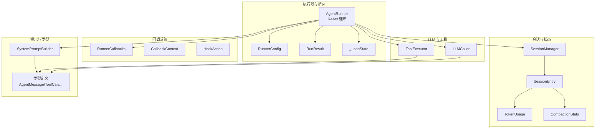
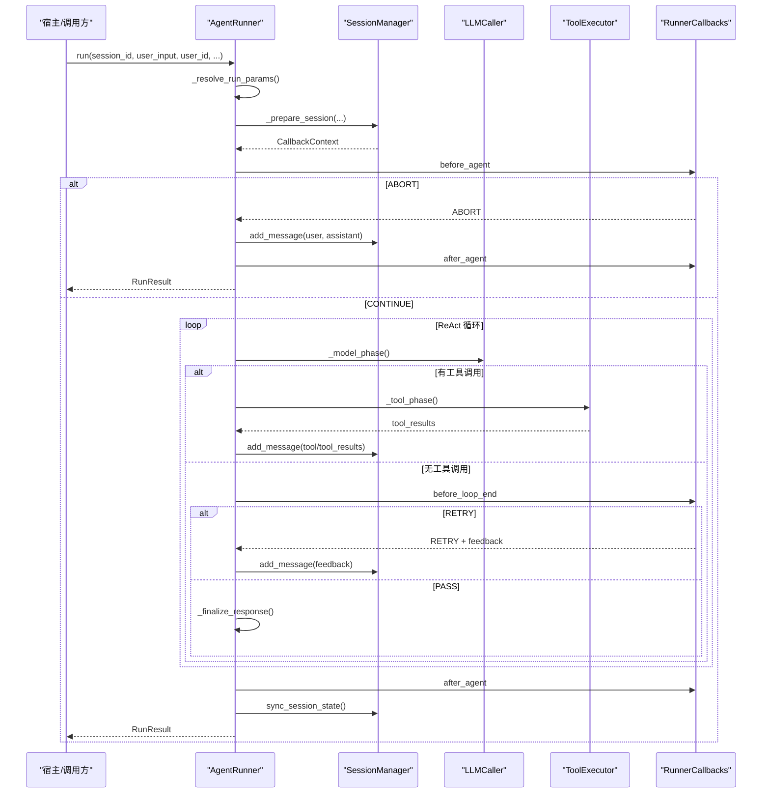
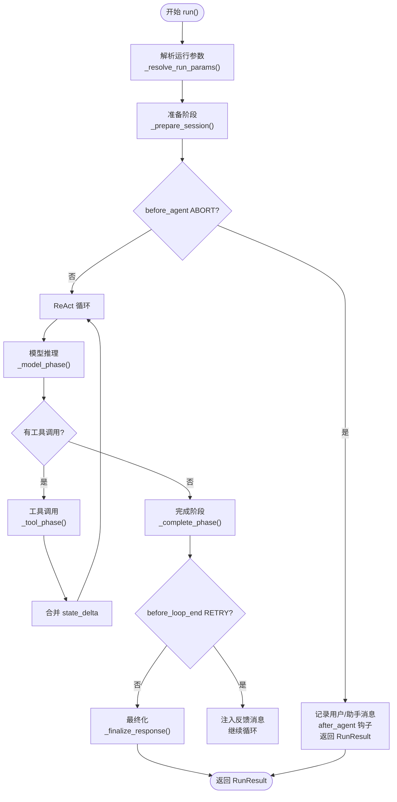
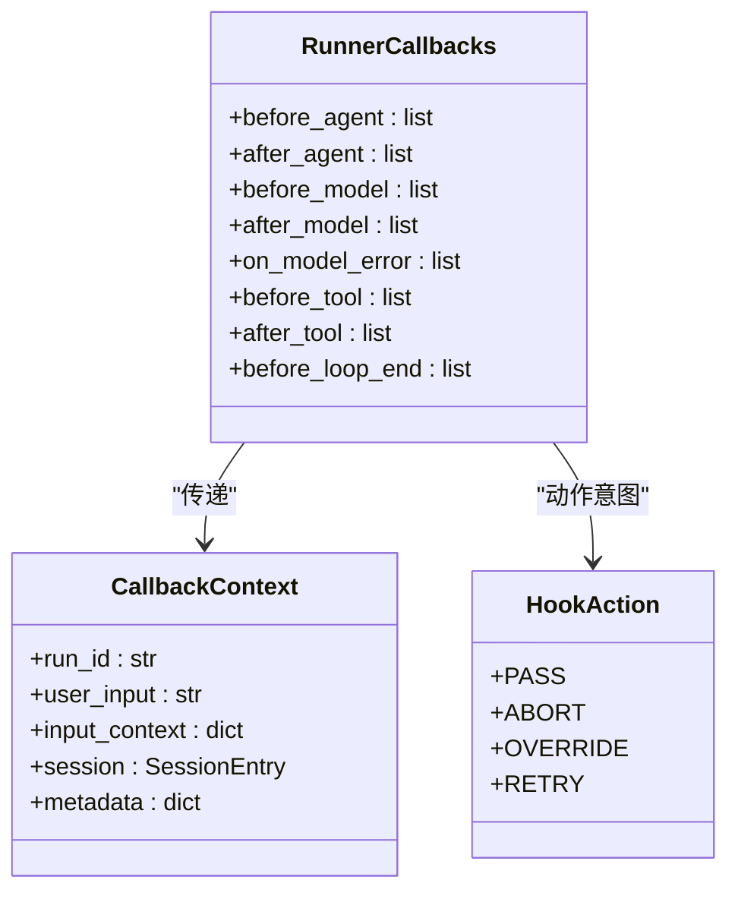
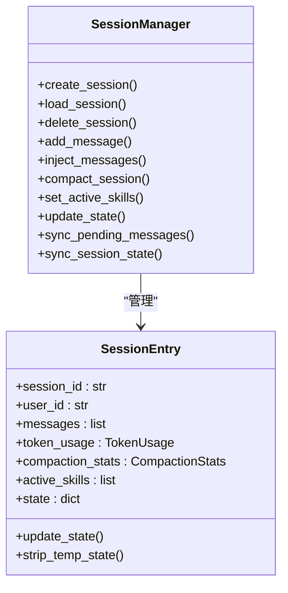
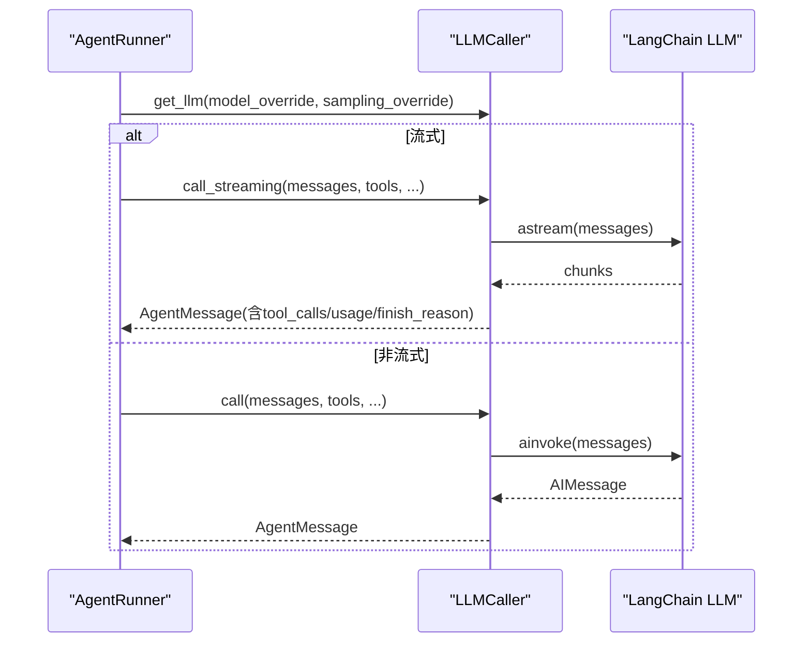
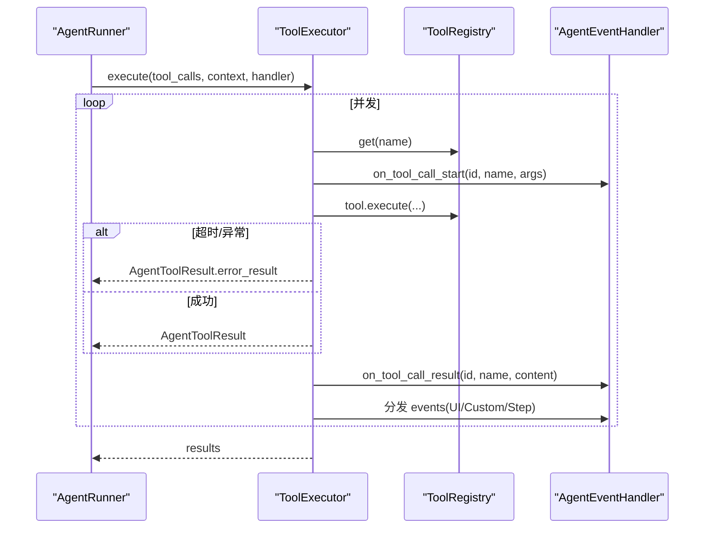
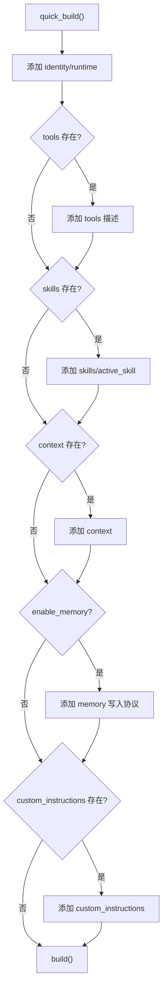
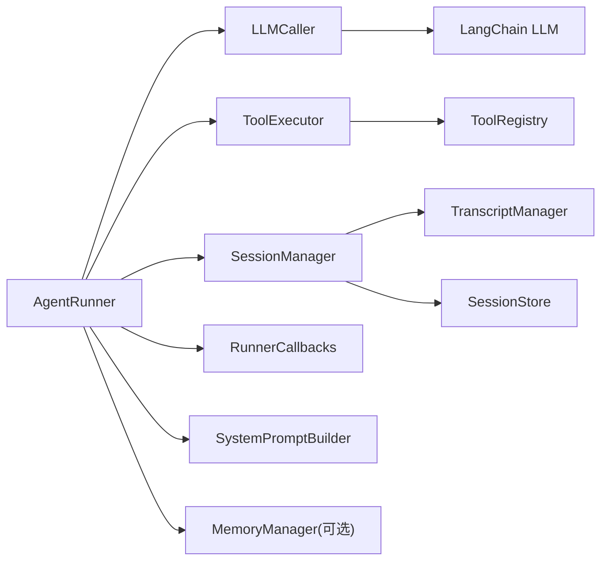

# 智能体执行系统

<cite>
**本文引用的文件**
- [runner.py](file://src/ark_agentic/core/runner.py)
- [callbacks.py](file://src/ark_agentic/core/callbacks.py)
- [session.py](file://src/ark_agentic/core/session.py)
- [types.py](file://src/ark_agentic/core/types.py)
- [manager.py](file://src/ark_agentic/core/memory/manager.py)
- [executor.py](file://src/ark_agentic/core/tools/executor.py)
- [caller.py](file://src/ark_agentic/core/llm/caller.py)
- [builder.py](file://src/ark_agentic/core/prompt/builder.py)
- [test_runner.py](file://tests/unit/core/test_runner.py)
</cite>

## 目录
1. [简介](#简介)
2. [项目结构](#项目结构)
3. [核心组件](#核心组件)
4. [架构总览](#架构总览)
5. [详细组件分析](#详细组件分析)
6. [依赖分析](#依赖分析)
7. [性能考量](#性能考量)
8. [故障排除指南](#故障排除指南)
9. [结论](#结论)
10. [附录](#附录)

## 简介
本文件面向 Ark-Agentic 智能体执行系统，聚焦 AgentRunner 的 ReAct 执行循环实现，系统性阐述生命周期管理、回调机制、错误处理、会话状态与内存管理，并提供配置项、参数说明、使用模式、故障排除与性能优化建议。文档同时给出关键流程的可视化图示，帮助读者快速把握 AgentRunner 的内部工作机理。

## 项目结构
围绕 AgentRunner 的核心模块包括：
- 执行器与循环：AgentRunner、RunnerConfig、RunResult、_LoopState
- 回调系统：RunnerCallbacks、CallbackContext、HookAction、各阶段钩子
- 会话与状态：SessionManager、SessionEntry、TokenUsage、CompactionStats
- LLM 调用：LLMCaller（封装 LangChain Chat 模型调用、流式/非流式、重试）
- 工具执行：ToolExecutor（并发执行工具、事件分发）
- 提示构建：SystemPromptBuilder（动态拼装系统提示）
- 类型与常量：AgentMessage、ToolCall、AgentToolResult、ToolResultType、ToolLoopAction 等

图表来源
- [runner.py:193-284](file://src/ark_agentic/core/runner.py#L193-L284)
- [callbacks.py:172-183](file://src/ark_agentic/core/callbacks.py#L172-L183)
- [session.py:24-67](file://src/ark_agentic/core/session.py#L24-L67)
- [types.py:350-422](file://src/ark_agentic/core/types.py#L350-L422)
- [caller.py:26-69](file://src/ark_agentic/core/llm/caller.py#L26-L69)
- [executor.py:29-42](file://src/ark_agentic/core/tools/executor.py#L29-L42)
- [builder.py:72-86](file://src/ark_agentic/core/prompt/builder.py#L72-L86)

章节来源
- [runner.py:193-284](file://src/ark_agentic/core/runner.py#L193-L284)
- [session.py:24-67](file://src/ark_agentic/core/session.py#L24-L67)

## 核心组件
- AgentRunner：ReAct 执行循环的核心，负责准备、模型推理、工具调用、完成阶段、结果汇总与生命周期收尾。
- RunnerConfig：执行配置，包含模型、采样、重试、轮次限制、工具超时、自动压缩、提示配置、技能配置、子任务开关、Dream 开关与阈值、外部历史合并开关等。
- RunResult：执行结果聚合，包含最终响应、轮次、工具调用次数、工具调用与结果列表、Token 统计、是否因限制停止等。
- _LoopState：ReAct 循环累积状态，跟踪轮次、工具调用总数、Token 统计、工具调用与结果列表。
- RunnerCallbacks：回调容器，包含 before_agent/after_agent、before_model/after_model/on_model_error、before_tool/after_tool、before_loop_end 等钩子。
- SessionManager：会话生命周期管理，消息持久化、压缩、状态更新、Token 统计、技能快照、外部历史合并等。
- LLMCaller：LLM 调用封装，支持非流式与流式调用、指数退避重试、Thinking 模型 reasoning_content 识别、消息格式转换。
- ToolExecutor：工具执行器，按序并发执行工具调用，超时与异常兜底，事件统一分发。
- SystemPromptBuilder：系统提示构建器，动态拼装 identity、runtime、tools、skills、context、memory、custom_instructions 等段落。
- 类型系统：AgentMessage、ToolCall、AgentToolResult、ToolResultType、ToolLoopAction、SessionEntry、TokenUsage、CompactionStats 等。

章节来源
- [runner.py:92-153](file://src/ark_agentic/core/runner.py#L92-L153)
- [callbacks.py:172-183](file://src/ark_agentic/core/callbacks.py#L172-L183)
- [session.py:24-67](file://src/ark_agentic/core/session.py#L24-L67)
- [types.py:18-422](file://src/ark_agentic/core/types.py#L18-L422)
- [caller.py:26-69](file://src/ark_agentic/core/llm/caller.py#L26-L69)
- [executor.py:29-42](file://src/ark_agentic/core/tools/executor.py#L29-L42)
- [builder.py:72-86](file://src/ark_agentic/core/prompt/builder.py#L72-L86)

## 架构总览
AgentRunner 的执行生命周期分为 resolve → prepare → execute → finalize 四个阶段，其中 execute 阶段内嵌 ReAct 循环：模型推理 → 工具调用 → 再推理 → … → 完成阶段。每个阶段都可被回调系统接管，实现灵活扩展。

图表来源
- [runner.py:312-370](file://src/ark_agentic/core/runner.py#L312-L370)
- [runner.py:406-493](file://src/ark_agentic/core/runner.py#L406-L493)
- [runner.py:652-730](file://src/ark_agentic/core/runner.py#L652-L730)
- [runner.py:734-758](file://src/ark_agentic/core/runner.py#L734-L758)
- [runner.py:882-964](file://src/ark_agentic/core/runner.py#L882-L964)
- [runner.py:495-517](file://src/ark_agentic/core/runner.py#L495-L517)

## 详细组件分析

### AgentRunner：ReAct 执行循环与生命周期
- 生命周期阶段
  - resolve：解析 RunOptions 与 RunnerConfig，生成运行参数（模型、采样覆盖、技能加载模式）。
  - prepare：before_agent 钩子、合并 input_context 到 session.state、注入外部历史、记录用户输入、自动压缩、设置 temp:user_input。
  - execute：ReAct 循环，每轮构建消息与工具、模型推理、工具调用、状态合并、事件分发、完成阶段。
  - finalize：after_agent 钩子、清理 temp 状态、同步会话状态、可能触发 Dream。
- ReAct 循环阶段
  - 模型推理阶段（_model_phase）：before_model → LLM 调用（流式/非流式）→ after_model → 持久化 → Token 统计 → finish_reason 处理。
  - 工具调用阶段（_tool_phase）：before_tool → 并发执行 → 合并 state_delta → after_tool → 持久化 → STOP 检查。
  - 完成阶段（_complete_phase/_finalize_response）：before_loop_end（RETRY 机制）→ 结果汇总。
- 错误处理
  - LLMError 捕获与 on_model_error 钩子，友好错误消息、错误元数据、记录到会话、返回 RunResult。
  - 工具超时与异常：ToolExecutor 超时与异常兜底，统一返回 AgentToolResult.error_result。
- 会话状态与内存
  - _merge_tool_state_deltas：将工具结果中的 state_delta 合并到 session.state。
  - strip_temp_state：在 finalize 中清理 temp: 前缀键。
  - auto_compact：根据阈值自动压缩历史，必要时触发 MemoryFlusher 预压缩回调。
  - Dream：满足阈值后后台触发 MemoryDreamer，失败重试保护，超过阈值推进 last_dream。

图表来源
- [runner.py:312-370](file://src/ark_agentic/core/runner.py#L312-L370)
- [runner.py:406-493](file://src/ark_agentic/core/runner.py#L406-L493)
- [runner.py:652-730](file://src/ark_agentic/core/runner.py#L652-L730)
- [runner.py:734-758](file://src/ark_agentic/core/runner.py#L734-L758)
- [runner.py:882-964](file://src/ark_agentic/core/runner.py#L882-L964)
- [runner.py:966-983](file://src/ark_agentic/core/runner.py#L966-L983)

章节来源
- [runner.py:312-370](file://src/ark_agentic/core/runner.py#L312-L370)
- [runner.py:406-493](file://src/ark_agentic/core/runner.py#L406-L493)
- [runner.py:652-730](file://src/ark_agentic/core/runner.py#L652-L730)
- [runner.py:734-758](file://src/ark_agentic/core/runner.py#L734-L758)
- [runner.py:882-964](file://src/ark_agentic/core/runner.py#L882-L964)
- [runner.py:966-983](file://src/ark_agentic/core/runner.py#L966-L983)

### 回调系统：RunnerCallbacks 与 HookAction
- 钩子类型
  - Agent 级：before_agent、after_agent
  - ReAct 轮级：before_model、after_model、before_tool、after_tool
  - 完成阶段：before_loop_end
  - 错误路径：on_model_error
- HookAction
  - PASS：不干预
  - ABORT：拒绝请求（仅 before_agent）
  - OVERRIDE：替换默认输出（before_model、before_tool）
  - RETRY：注入反馈消息，允许模型自我纠正（before_loop_end）
- 回调执行
  - _run_hooks 顺序执行，遇到非 PASS 的 action 即停止，支持 context_updates 与事件分发。

图表来源
- [callbacks.py:172-183](file://src/ark_agentic/core/callbacks.py#L172-L183)
- [callbacks.py:75-93](file://src/ark_agentic/core/callbacks.py#L75-L93)
- [callbacks.py:43-49](file://src/ark_agentic/core/callbacks.py#L43-L49)

章节来源
- [callbacks.py:172-183](file://src/ark_agentic/core/callbacks.py#L172-L183)
- [callbacks.py:75-93](file://src/ark_agentic/core/callbacks.py#L75-L93)
- [callbacks.py:43-49](file://src/ark_agentic/core/callbacks.py#L43-L49)

### 会话管理与状态：SessionManager
- 会话生命周期：创建、加载、删除、同步待持久化消息、同步会话状态（Token、压缩统计、活跃技能、state）。
- 消息管理：添加消息、注入外部历史、清空消息、获取消息、估计 Token。
- 上下文压缩：needs_compaction/auto_compact_if_needed/compact_session，记录压缩统计。
- 技能管理：设置/获取活跃技能。
- 状态管理：更新/获取/清理 temp: 前缀状态。

图表来源
- [session.py:24-67](file://src/ark_agentic/core/session.py#L24-L67)
- [session.py:350-422](file://src/ark_agentic/core/session.py#L350-L422)

章节来源
- [session.py:24-67](file://src/ark_agentic/core/session.py#L24-L67)
- [session.py:350-422](file://src/ark_agentic/core/session.py#L350-L422)

### LLM 调用：LLMCaller
- 支持模型与采样覆盖（get_llm），非流式与流式调用（call/call_streaming）。
- 流式识别 Thinking 模型的 reasoning_content 字段，路由到 thinking_callback。
- 统一重试包装 with_retry / with_retry_iterator，指数退避 + 抖动。
- 输出转换：AIMessage → AgentMessage，提取 finish_reason 与 usage。

图表来源
- [runner.py:800-880](file://src/ark_agentic/core/runner.py#L800-L880)
- [caller.py:70-192](file://src/ark_agentic/core/llm/caller.py#L70-L192)

章节来源
- [runner.py:800-880](file://src/ark_agentic/core/runner.py#L800-L880)
- [caller.py:70-192](file://src/ark_agentic/core/llm/caller.py#L70-L192)

### 工具执行：ToolExecutor
- 并发执行工具调用，受 max_calls_per_turn 限制，超时与异常统一兜底。
- 事件统一分发：UIComponentToolEvent、CustomToolEvent、StepToolEvent。
- 与 AgentEventHandler 对接，上报工具调用开始/结果、步骤状态、UI 组件。

图表来源
- [runner.py:914-938](file://src/ark_agentic/core/runner.py#L914-L938)
- [executor.py:43-101](file://src/ark_agentic/core/tools/executor.py#L43-L101)
- [executor.py:110-127](file://src/ark_agentic/core/tools/executor.py#L110-L127)

章节来源
- [runner.py:914-938](file://src/ark_agentic/core/runner.py#L914-L938)
- [executor.py:43-101](file://src/ark_agentic/core/tools/executor.py#L43-L101)
- [executor.py:110-127](file://src/ark_agentic/core/tools/executor.py#L110-L127)

### 提示构建：SystemPromptBuilder
- 动态拼装 identity、runtime、tools、skills、context、memory、custom_instructions 等段落。
- dynamic 模式下将行为指令与元数据分离，避免被名词标签淹没。
- quick_build 快速构建，确保 tools 与 skills 与 API schema 同源。

图表来源
- [builder.py:276-325](file://src/ark_agentic/core/prompt/builder.py#L276-L325)

章节来源
- [builder.py:276-325](file://src/ark_agentic/core/prompt/builder.py#L276-L325)

### 配置选项与参数说明
- RunnerConfig
  - model：模型名称覆盖
  - sampling：采样配置（温度、top_p 等）
  - max_retries：LLM 调用重试次数
  - max_turns：最大对话轮数
  - max_tool_calls_per_turn：单轮最大工具调用数
  - tool_timeout：单个工具执行超时（秒）
  - auto_compact：自动压缩开关
  - prompt_config：提示配置（包含 agent_name、include_tool_descriptions 等）
  - skill_config：技能配置（load_mode）
  - enable_subtasks：子任务开关
  - enable_dream：Dream 开关
  - dream_min_sessions：Dream 触发最小会话数
  - accept_external_history：接受外部历史合并
- RunOptions（按请求覆盖）
  - model：模型名称覆盖
  - temperature：采样温度覆盖（0.0-2.0）

章节来源
- [runner.py:92-128](file://src/ark_agentic/core/runner.py#L92-L128)
- [types.py:310-320](file://src/ark_agentic/core/types.py#L310-L320)

### 使用模式
- 基本文本回复：单轮模型推理，无工具调用。
- 工具调用：模型返回工具调用，执行工具，合并状态，继续推理直至完成。
- 流式输出：支持 on_content_delta、on_thinking_delta、on_tool_call_*、on_ui_component、on_step 等事件。
- 临时状态：input_context 中 temp:* 键在运行期间可用，结束后自动清理。
- A2UI 结果：工具返回 A2UI 结果，前端接收 on_ui_component，历史中以中性标记替代原始 payload。

章节来源
- [test_runner.py:141-195](file://tests/unit/core/test_runner.py#L141-L195)
- [test_runner.py:197-315](file://tests/unit/core/test_runner.py#L197-L315)
- [test_runner.py:421-471](file://tests/unit/core/test_runner.py#L421-L471)
- [test_runner.py:505-592](file://tests/unit/core/test_runner.py#L505-L592)

## 依赖分析
- 组件耦合
  - AgentRunner 依赖 LLMCaller、ToolExecutor、SessionManager、RunnerCallbacks、SystemPromptBuilder、MemoryManager（可选）。
  - LLMCaller 依赖 LangChain Chat 模型与重试机制。
  - ToolExecutor 依赖 ToolRegistry 与 AgentEventHandler。
  - SessionManager 依赖 TranscriptManager 与 SessionStore，负责消息持久化与状态同步。
- 外部依赖
  - LangChain Chat 模型（BaseChatModel）
  - 异步事件总线（AgentEventHandler）
  - 文件系统（会话与记忆文件）

图表来源
- [runner.py:233-284](file://src/ark_agentic/core/runner.py#L233-L284)
- [caller.py:15-21](file://src/ark_agentic/core/llm/caller.py#L15-L21)
- [executor.py:14-24](file://src/ark_agentic/core/tools/executor.py#L14-L24)
- [session.py:17-36](file://src/ark_agentic/core/session.py#L17-L36)

章节来源
- [runner.py:233-284](file://src/ark_agentic/core/runner.py#L233-L284)
- [session.py:17-36](file://src/ark_agentic/core/session.py#L17-L36)

## 性能考量
- 流式输出：开启流式可降低首屏延迟，提升用户体验；注意流式模式下的 reasoning_content 识别与事件分发。
- 工具并发：ToolExecutor 并发执行工具，受 max_calls_per_turn 限制，避免过度并发导致资源争用。
- 自动压缩：auto_compact 在阈值触发时进行上下文压缩，减少 Token 使用，提高推理效率。
- 采样覆盖：background 调用（flush/dream/summarize）使用专用采样配置，避免影响主对话质量。
- 重试策略：LLMCaller 使用指数退避 + 抖动，减少瞬时错误对吞吐的影响。

[本节为通用指导，无需特定文件来源]

## 故障排除指南
- LLM 错误处理
  - on_model_error 钩子：捕获 LLMError，生成用户友好提示，记录错误原因与可重试性，将错误消息写入会话并返回 RunResult。
  - 常见原因：认证失败、配额不足、限流、超时、上下文溢出、内容过滤、服务器错误、网络错误。
- 工具超时与异常
  - ToolExecutor 对超时与异常进行兜底，返回 AgentToolResult.error_result，并在 handler 上报步骤状态。
- 会话状态残留
  - 确认 finalize 中 strip_temp_state 是否执行，检查 input_context 中 temp:* 键是否正确清理。
- A2UI 结果显示
  - 确保 on_ui_component 事件被正确分发；历史中 A2UI 结果会被中性标记替代，避免泄露敏感内容。
- 回调覆盖与中断
  - before_agent ABORT、before_model OVERRIDE、before_tool OVERRIDE、before_loop_end RETRY 的行为需按 HookAction 语义验证。

章节来源
- [runner.py:592-611](file://src/ark_agentic/core/runner.py#L592-L611)
- [runner.py:816-840](file://src/ark_agentic/core/runner.py#L816-L840)
- [executor.py:80-100](file://src/ark_agentic/core/tools/executor.py#L80-L100)
- [test_runner.py:505-592](file://tests/unit/core/test_runner.py#L505-L592)

## 结论
AgentRunner 通过清晰的生命周期与回调机制，实现了可插拔、可观测、可扩展的 ReAct 执行框架。结合 LLMCaller、ToolExecutor、SessionManager 与 SystemPromptBuilder，系统在保证稳定性的同时提供了强大的定制能力。合理配置 RunnerConfig 与 RunOptions，配合回调钩子与事件总线，可满足复杂业务场景下的智能体执行需求。

[本节为总结，无需特定文件来源]

## 附录
- 关键 API 与路径
  - AgentRunner.run：执行入口，返回 RunResult
  - AgentRunner.run_ephemeral：无持久化 ReAct 循环
  - SessionManager.create_session/load_session/add_message/inject_messages/compact_session/sync_session_state
  - LLMCaller.call/call_streaming/get_llm
  - ToolExecutor.execute
  - SystemPromptBuilder.quick_build

章节来源
- [runner.py:372-387](file://src/ark_agentic/core/runner.py#L372-L387)
- [session.py:40-227](file://src/ark_agentic/core/session.py#L40-L227)
- [caller.py:70-192](file://src/ark_agentic/core/llm/caller.py#L70-L192)
- [executor.py:43-101](file://src/ark_agentic/core/tools/executor.py#L43-L101)
- [builder.py:276-325](file://src/ark_agentic/core/prompt/builder.py#L276-L325)