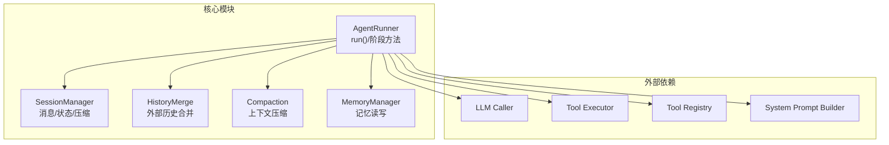
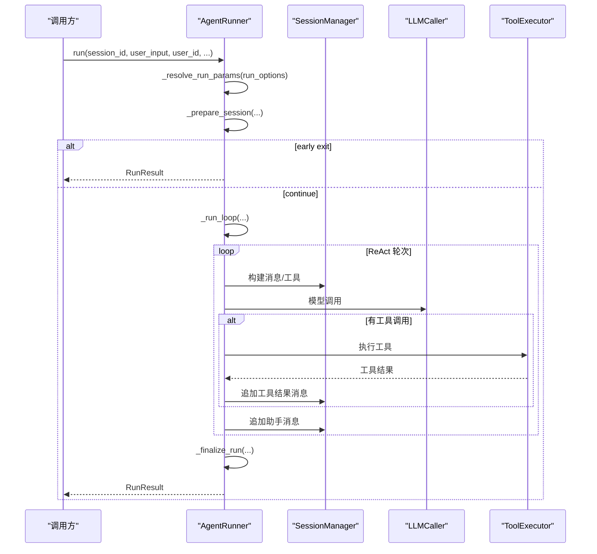
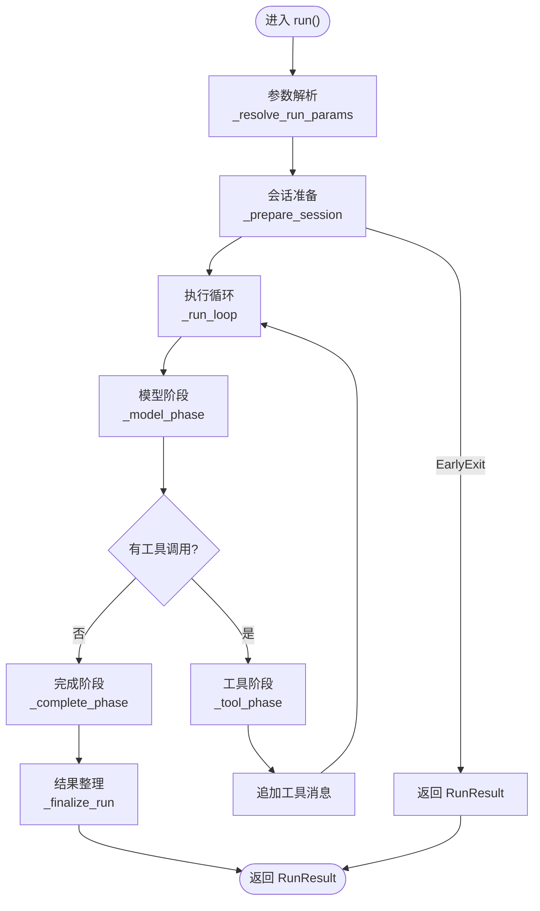
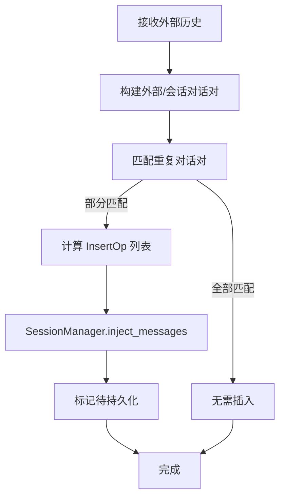
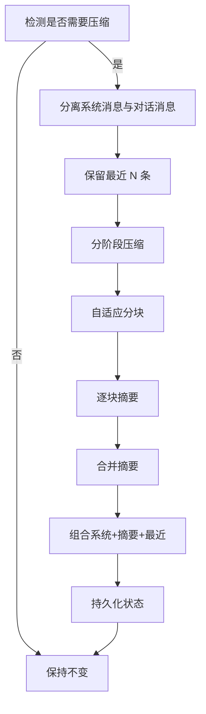
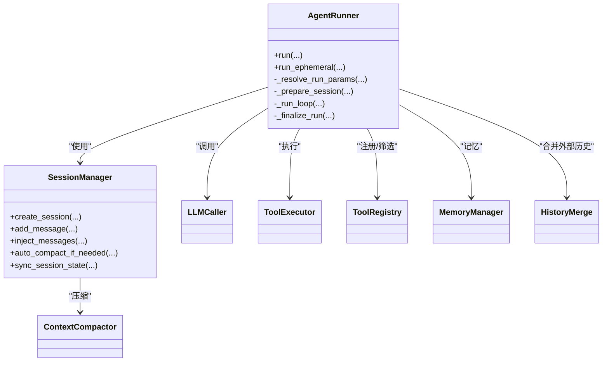

# 生命周期管理

<cite>
**本文引用的文件**
- [runner.py](file://src/ark_agentic/core/runner.py)
- [session.py](file://src/ark_agentic/core/session.py)
- [history_merge.py](file://src/ark_agentic/core/history_merge.py)
- [compaction.py](file://src/ark_agentic/core/compaction.py)
- [manager.py](file://src/ark_agentic/core/memory/manager.py)
- [test_runner.py](file://tests/unit/core/test_runner.py)
- [README.md](file://README.md)
</cite>

## 目录
1. [简介](#简介)
2. [项目结构](#项目结构)
3. [核心组件](#核心组件)
4. [架构总览](#架构总览)
5. [详细组件分析](#详细组件分析)
6. [依赖分析](#依赖分析)
7. [性能考量](#性能考量)
8. [故障排除指南](#故障排除指南)
9. [结论](#结论)
10. [附录](#附录)

## 简介
本文件面向智能体执行生命周期管理，围绕 AgentRunner 的 run() 方法展开，系统性阐述其完整生命周期：参数解析（_resolve_run_params）、会话准备（_prepare_session）、执行循环（_run_loop）、结果整理（_finalize_run）以及资源清理。文档同时解释会话状态管理、历史消息合并、自动压缩机制与临时状态清理，并提供调用顺序与数据流图示、最佳实践与故障排除建议，帮助开发者与使用者高效理解与使用该生命周期。

## 项目结构
- 核心执行器位于 core/runner.py，封装 run() 生命周期与各阶段方法。
- 会话管理位于 core/session.py，负责消息持久化、压缩、状态同步与历史注入。
- 历史合并位于 core/history_merge.py，提供外部历史去重与锚定插入。
- 上下文压缩位于 core/compaction.py，提供自适应分块、摘要与压缩策略。
- 内存管理位于 core/memory/manager.py，为记忆抽取与梦境（Dream）提供基础能力。
- 测试位于 tests/unit/core/test_runner.py，验证 run() 生命周期的关键行为。

图表来源
- [runner.py:193-387](file://src/ark_agentic/core/runner.py#L193-L387)
- [session.py:24-482](file://src/ark_agentic/core/session.py#L24-L482)
- [history_merge.py:155-243](file://src/ark_agentic/core/history_merge.py#L155-L243)
- [compaction.py:421-518](file://src/ark_agentic/core/compaction.py#L421-L518)
- [manager.py:24-92](file://src/ark_agentic/core/memory/manager.py#L24-L92)

章节来源
- [runner.py:193-387](file://src/ark_agentic/core/runner.py#L193-L387)
- [session.py:24-482](file://src/ark_agentic/core/session.py#L24-L482)

## 核心组件
- AgentRunner：执行器主体，负责 run() 生命周期编排、阶段方法调度、钩子回调、错误处理与资源清理。
- SessionManager：会话生命周期与状态管理，负责消息持久化、历史注入、自动压缩、状态同步。
- HistoryMerge：外部历史合并算法，基于对话对去重与锚定插入。
- Compaction：上下文压缩引擎，提供自适应分块、摘要与压缩策略。
- MemoryManager：轻量记忆管理，为记忆抽取与梦境提供统一入口。
- LLMCaller/ToolExecutor：底层调用与工具执行抽象，分别负责模型调用与工具执行。

章节来源
- [runner.py:193-387](file://src/ark_agentic/core/runner.py#L193-L387)
- [session.py:24-482](file://src/ark_agentic/core/session.py#L24-L482)
- [history_merge.py:155-243](file://src/ark_agentic/core/history_merge.py#L155-L243)
- [compaction.py:421-518](file://src/ark_agentic/core/compaction.py#L421-L518)
- [manager.py:24-92](file://src/ark_agentic/core/memory/manager.py#L24-L92)

## 架构总览
run() 生命周期遵循“resolve → prepare → execute → finalize”的顺序，贯穿参数解析、会话准备、循环执行与结果整理四个阶段，并在 finally 中确保挂起消息同步与状态持久化。

图表来源
- [runner.py:327-370](file://src/ark_agentic/core/runner.py#L327-L370)
- [runner.py:652-731](file://src/ark_agentic/core/runner.py#L652-L731)
- [runner.py:760-880](file://src/ark_agentic/core/runner.py#L760-L880)
- [runner.py:882-964](file://src/ark_agentic/core/runner.py#L882-L964)
- [runner.py:966-984](file://src/ark_agentic/core/runner.py#L966-L984)

章节来源
- [runner.py:327-370](file://src/ark_agentic/core/runner.py#L327-L370)
- [README.md:410-434](file://README.md#L410-L434)

## 详细组件分析

### run() 生命周期阶段详解
- 参数解析（_resolve_run_params）
  - 输入：run_options（可选）
  - 输出：_RunParams（包含 model、sampling_override、skill_load_mode）
  - 作用：从 run_options 与 RunnerConfig 默认值中纯计算解析运行参数，不产生副作用
  - 关键点：当 run_options.temperature 存在时，复制 SamplingConfig 并覆盖 temperature
- 会话准备（_prepare_session）
  - 输入：session_id、user_id、user_input、input_context、handler、history、use_history、run_id、run_metadata
  - 输出：RunResult（早期退出）或 CallbackContext（继续执行）
  - 作用：懒初始化、before_agent 钩子、input_context 合并、外部历史合并、记录用户消息、自动压缩、设置临时状态
  - 早期退出：before_agent 返回 ABORT 时，记录用户与助手消息并返回 RunResult
  - 外部历史合并：当 accept_external_history 且 use_history 为真时，调用 merge_external_history 计算 InsertOp 并注入
  - 自动压缩：根据 auto_compact 与 needs_compaction 决定是否执行 auto_compact_if_needed
  - 临时状态：在 session.state["temp:user_input"] 写入当前用户输入，供工具访问
- 执行循环（_run_loop）
  - 输入：session_id、use_streaming、model_override、sampling_override、skill_load_mode、handler、cb_ctx
  - 输出：RunResult
  - 控制：最大轮次 max_turns 限制，每轮构建消息与工具，调用模型，处理工具调用，最终完成回合
  - 模型阶段（_model_phase）：before_model → LLM 调用 → after_model → 持久化 → 统计 token → finish_reason 处理
  - 工具阶段（_tool_phase）：before_tool → 执行工具 → 合并状态变更 → after_tool → 追加工具消息 → STOP 检查
  - 完成阶段（_complete_phase）：before_loop_end → 决策（RETRY 或 _finalize_response）
- 结果整理（_finalize_run）
  - 输入：session_id、user_id、result、cb_ctx、handler
  - 输出：无（更新 RunResult 并清理临时状态）
  - 作用：after_agent 钩子、清理临时状态（strip_temp_state）、同步会话状态（sync_session_state）

图表来源
- [runner.py:327-370](file://src/ark_agentic/core/runner.py#L327-L370)
- [runner.py:652-731](file://src/ark_agentic/core/runner.py#L652-L731)
- [runner.py:760-880](file://src/ark_agentic/core/runner.py#L760-L880)
- [runner.py:882-964](file://src/ark_agentic/core/runner.py#L882-L964)
- [runner.py:966-984](file://src/ark_agentic/core/runner.py#L966-L984)

章节来源
- [runner.py:391-404](file://src/ark_agentic/core/runner.py#L391-L404)
- [runner.py:406-493](file://src/ark_agentic/core/runner.py#L406-L493)
- [runner.py:652-731](file://src/ark_agentic/core/runner.py#L652-L731)
- [runner.py:760-880](file://src/ark_agentic/core/runner.py#L760-L880)
- [runner.py:882-964](file://src/ark_agentic/core/runner.py#L882-L964)
- [runner.py:966-984](file://src/ark_agentic/core/runner.py#L966-L984)

### 会话状态管理与历史合并
- 状态管理
  - input_context 合并：_merge_input_context 将 input_context 合并到 session.state，覆盖既有键
  - 临时状态：_prepare_session 在 session.state["temp:user_input"] 写入当前用户输入，_finalize_run 清理 strip_temp_state
  - 状态同步：_finalize_run 调用 sync_session_state，将内存中的状态与 token 使用持久化
- 历史合并
  - 外部历史去重：merge_external_history 将 raw_history 按 (user, assistant) 对分组，基于模糊相似度判断重复
  - 锚定插入：根据会话窗口内匹配结果，确定插入锚点（anchor_message_id），支持在锚点前/后插入
  - 注入执行：SessionManager.inject_messages 将 InsertOp 解析为实际索引并插入，标记待持久化

图表来源
- [history_merge.py:155-243](file://src/ark_agentic/core/history_merge.py#L155-L243)
- [session.py:291-334](file://src/ark_agentic/core/session.py#L291-L334)

章节来源
- [runner.py:462-493](file://src/ark_agentic/core/runner.py#L462-L493)
- [history_merge.py:155-243](file://src/ark_agentic/core/history_merge.py#L155-L243)
- [session.py:291-334](file://src/ark_agentic/core/session.py#L291-L334)

### 自动压缩机制
- 触发条件：needs_compaction 基于安全边界估算总 token 数与触发阈值比较
- 压缩流程：分离系统消息与对话消息，保留最近 N 条，对历史进行自适应分块，逐块摘要，合并摘要，最后组合系统消息、摘要与最近消息
- 预处理回调：auto_compact_if_needed 支持 pre_compact_callback（如记忆抽取 flush）在压缩前执行
- 摘要策略：SimpleSummarizer 截断回退；LLMSummarizer 基于 LLM 的摘要生成

图表来源
- [compaction.py:450-457](file://src/ark_agentic/core/compaction.py#L450-L457)
- [compaction.py:458-518](file://src/ark_agentic/core/compaction.py#L458-L518)
- [compaction.py:519-618](file://src/ark_agentic/core/compaction.py#L519-L618)
- [session.py:415-430](file://src/ark_agentic/core/session.py#L415-L430)

章节来源
- [runner.py:473-487](file://src/ark_agentic/core/runner.py#L473-L487)
- [compaction.py:450-518](file://src/ark_agentic/core/compaction.py#L450-L518)
- [session.py:415-430](file://src/ark_agentic/core/session.py#L415-L430)

### 临时状态清理
- 写入位置：_prepare_session 在 session.state["temp:user_input"] 写入当前用户输入
- 清理时机：_finalize_run 调用 session.state.strip_temp_state() 清理临时键
- 作用：为工具提供当前用户输入的只读访问，避免污染长期状态

章节来源
- [runner.py:489-493](file://src/ark_agentic/core/runner.py#L489-L493)
- [runner.py:515-516](file://src/ark_agentic/core/runner.py#L515-L516)

### run_ephemeral 与无持久化循环
- 用途：用于临时子任务，调用方负责会话创建与清理
- 行为：直接添加用户消息到会话，跳过 _prepare_session 与 _finalize_run 的持久化、钩子与压缩生命周期
- 适用场景：内部子任务、快速评估、临时对话

章节来源
- [runner.py:372-387](file://src/ark_agentic/core/runner.py#L372-L387)

## 依赖分析
- AgentRunner 依赖
  - SessionManager：消息持久化、历史注入、自动压缩、状态同步
  - LLMCaller：模型调用（支持流式与非流式）
  - ToolExecutor：工具执行（限制每轮工具调用次数、超时）
  - ToolRegistry：工具注册与筛选
  - MemoryManager：记忆读写（用于记忆抽取与梦境）
  - SystemPromptBuilder：系统提示构建
- SessionManager 依赖
  - TranscriptManager：会话文件与消息持久化
  - SessionStore：会话元数据存储
  - ContextCompactor：上下文压缩器
- HistoryMerge 与 Compaction 独立纯函数，无外部状态依赖

图表来源
- [runner.py:193-387](file://src/ark_agentic/core/runner.py#L193-L387)
- [session.py:24-482](file://src/ark_agentic/core/session.py#L24-L482)
- [history_merge.py:155-243](file://src/ark_agentic/core/history_merge.py#L155-L243)
- [compaction.py:421-518](file://src/ark_agentic/core/compaction.py#L421-L518)

章节来源
- [runner.py:193-387](file://src/ark_agentic/core/runner.py#L193-L387)
- [session.py:24-482](file://src/ark_agentic/core/session.py#L24-L482)

## 性能考量
- Token 估算与安全边界：compaction 模块使用保守估算（安全系数 1.2），避免过度压缩导致上下文溢出
- 自适应分块：根据平均消息大小动态调整分块比例，平衡压缩效果与成本
- 摘要回退：LLMSummarizer 失败时回退至 SimpleSummarizer，保障稳定性
- 每轮限制：max_turns、max_tool_calls_per_turn、tool_timeout 控制执行成本
- 流式输出：use_streaming 降低首吞吐延迟，提升交互体验

章节来源
- [compaction.py:20-28](file://src/ark_agentic/core/compaction.py#L20-L28)
- [compaction.py:164-189](file://src/ark_agentic/core/compaction.py#L164-L189)
- [runner.py:92-107](file://src/ark_agentic/core/runner.py#L92-L107)

## 故障排除指南
- 模型错误处理
  - on_model_error 钩子：捕获 LLMError，生成用户友好错误消息并记录错误元数据
  - 重试策略：on_model_error 可结合 HookAction.RETRY 实现反馈重试
- 上下文溢出
  - 自动压缩：开启 auto_compact 时，_prepare_session 会在需要时触发 auto_compact_if_needed
  - 用户提示：_get_user_friendly_error_message 对 CONTEXT_OVERFLOW 返回“自动压缩历史消息后重试”
- 工具执行失败
  - _tool_phase 收集工具结果，若全部失败记录警告；STOP 结果可提前结束
- 会话状态异常
  - 确保 finally 中 sync_pending_messages 被调用，避免消息丢失
  - _finalize_run 调用 strip_temp_state，避免临时状态残留

章节来源
- [runner.py:816-841](file://src/ark_agentic/core/runner.py#L816-L841)
- [runner.py:592-611](file://src/ark_agentic/core/runner.py#L592-L611)
- [runner.py:366-367](file://src/ark_agentic/core/runner.py#L366-L367)
- [runner.py:515-516](file://src/ark_agentic/core/runner.py#L515-L516)

## 结论
AgentRunner 的 run() 生命周期通过清晰的阶段划分与完善的钩子体系，实现了从参数解析、会话准备、循环执行到结果整理的完整闭环。配合 SessionManager 的消息持久化、历史合并与自动压缩，以及 MemoryManager 的记忆能力，系统在复杂对话场景下仍能保持稳定与高性能。建议在生产环境中启用 auto_compact、合理设置 max_turns 与 tool_timeout，并利用钩子扩展业务逻辑。

## 附录
- 生命周期时序参考（来自 README）
  - run() → [before_agent] → ReAct Loop → [before_model]/[after_model]/[before_tool]/[after_tool] → [before_loop_end] → _finalize_response → [after_agent]
- 测试参考
  - 基础文本响应、工具调用、流式输出等用例可参考 tests/unit/core/test_runner.py

章节来源
- [README.md:410-434](file://README.md#L410-L434)
- [test_runner.py:141-200](file://tests/unit/core/test_runner.py#L141-L200)