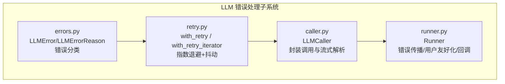
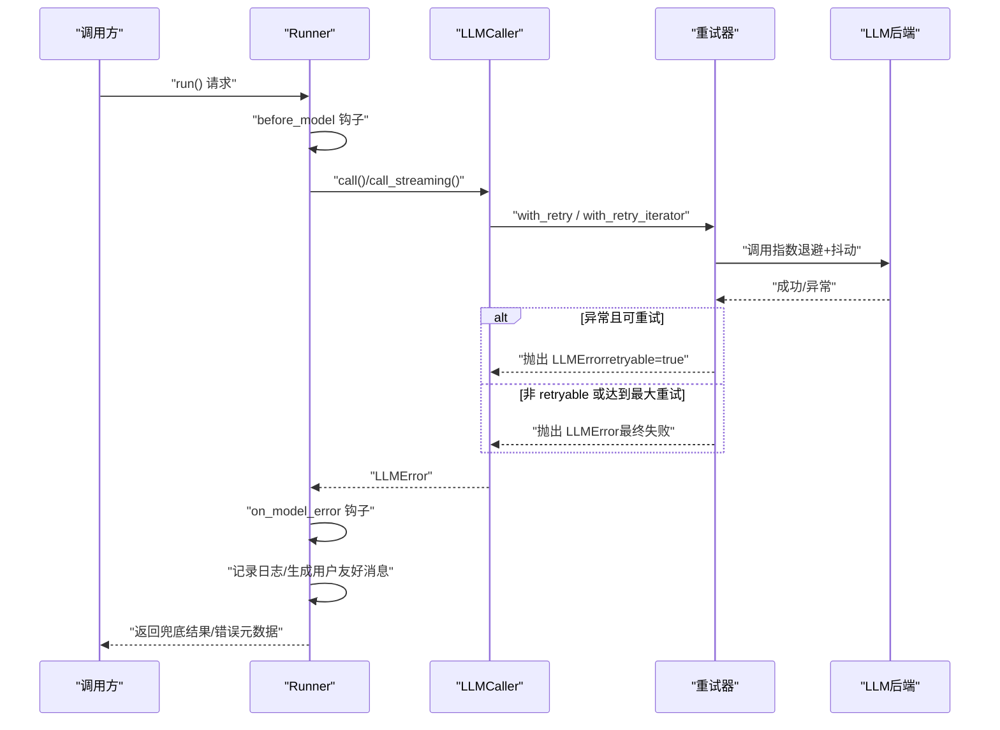
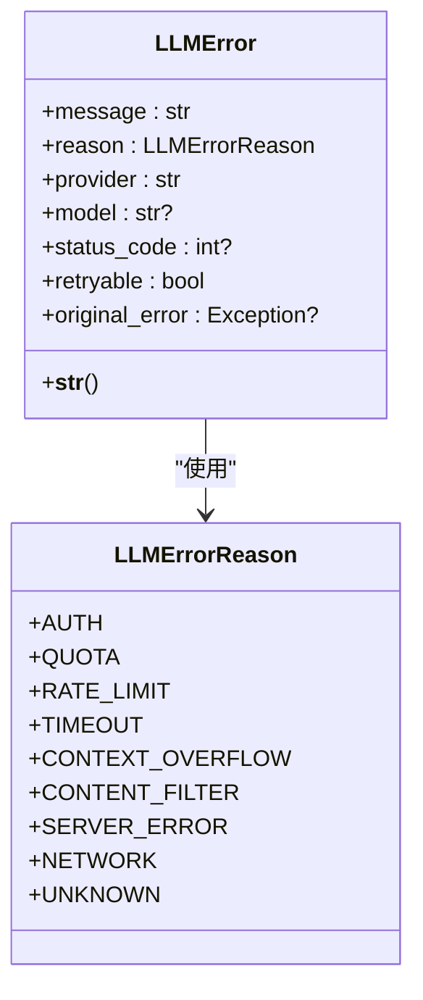
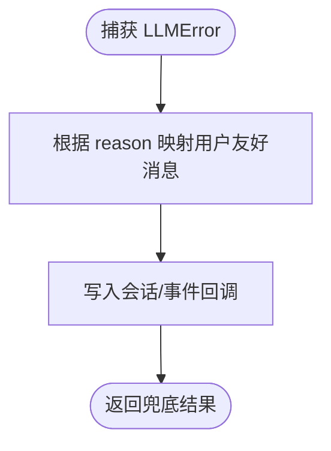
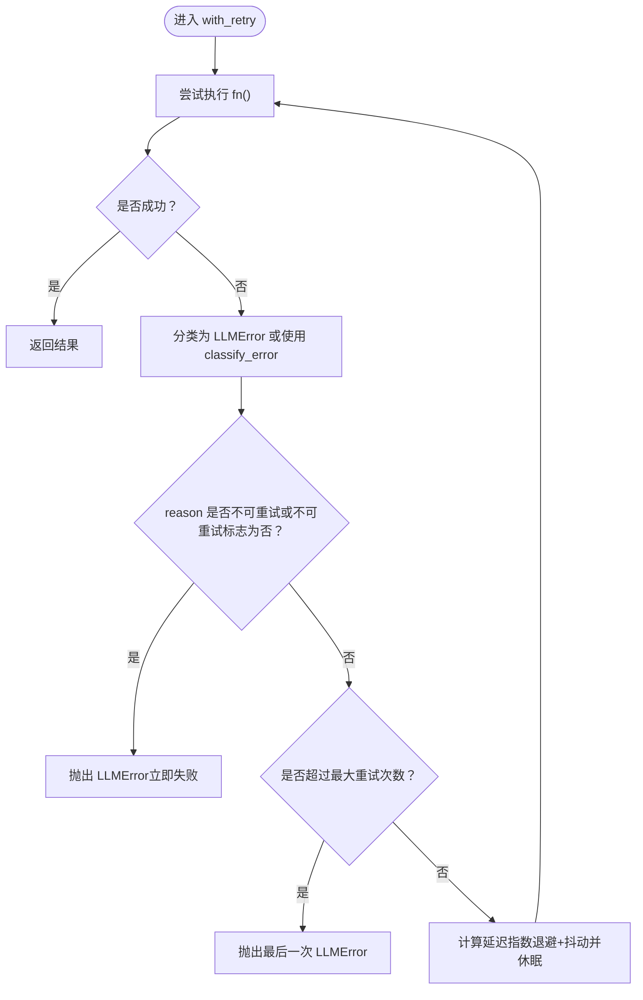
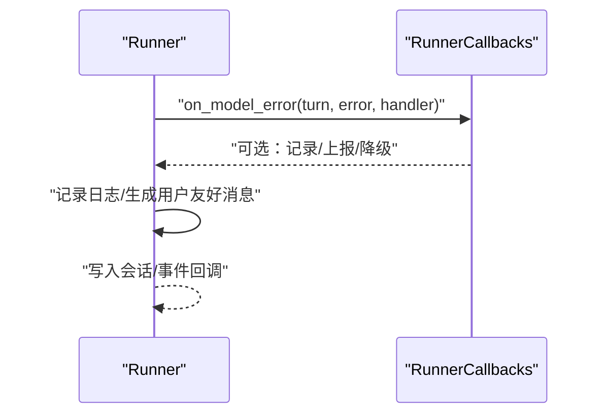
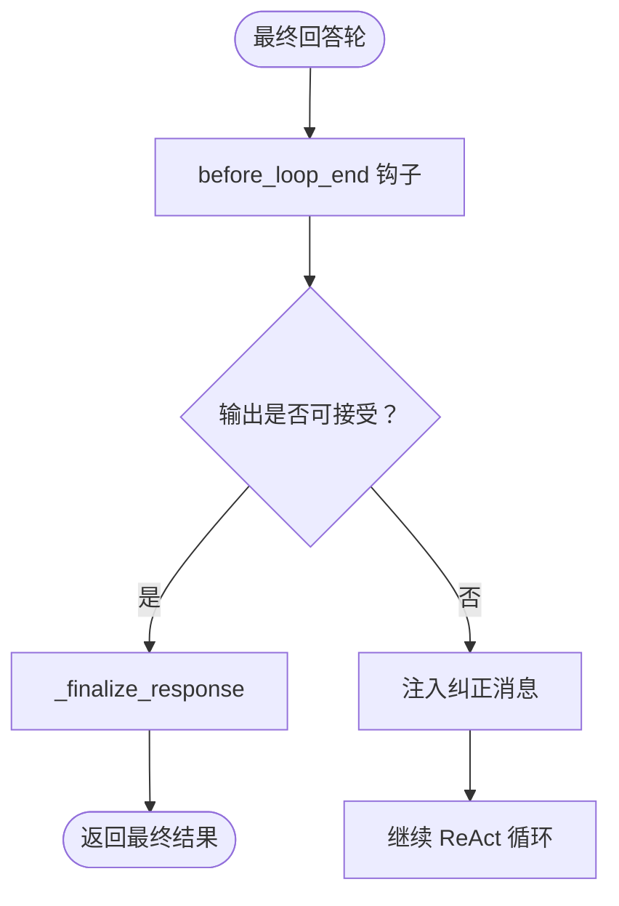
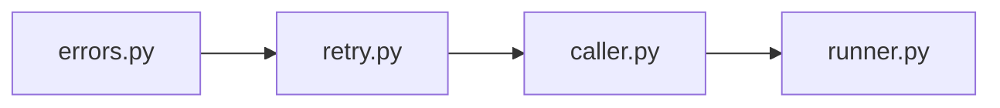

# 错误处理

<cite>
**本文引用的文件**
- [errors.py](file://src/ark_agentic/core/llm/errors.py)
- [retry.py](file://src/ark_agentic/core/llm/retry.py)
- [caller.py](file://src/ark_agentic/core/llm/caller.py)
- [runner.py](file://src/ark_agentic/core/runner.py)
- [test_retry.py](file://tests/unit/core/test_retry.py)
- [test_securities_validation.py](file://tests/unit/agents/test_securities_validation.py)
- [README.md](file://README.md)
</cite>

## 目录
1. [简介](#简介)
2. [项目结构](#项目结构)
3. [核心组件](#核心组件)
4. [架构总览](#架构总览)
5. [详细组件分析](#详细组件分析)
6. [依赖关系分析](#依赖关系分析)
7. [性能考量](#性能考量)
8. [故障排查指南](#故障排查指南)
9. [结论](#结论)
10. [附录](#附录)

## 简介
本文件面向智能体执行错误处理系统，聚焦 LLMError 的分类体系与错误原因枚举，涵盖认证失败、配额不足、速率限制、超时、上下文溢出、内容过滤、服务器错误与网络问题等场景；同时系统性阐述错误消息的用户友好化处理、指数退避重试机制、错误传播与回调集成、不同阶段的错误处理策略、错误恢复与降级逻辑，并提供监控、日志与故障排除的最佳实践。

## 项目结构
围绕 LLM 错误处理的关键模块与文件如下：
- 错误定义与分类：src/ark_agentic/core/llm/errors.py
- 重试与指数退避：src/ark_agentic/core/llm/retry.py
- LLM 调用封装与流式处理：src/ark_agentic/core/llm/caller.py
- 错误传播与用户友好化：src/ark_agentic/core/runner.py
- 单元测试与行为验证：tests/unit/core/test_retry.py、tests/unit/agents/test_securities_validation.py
- 生命周期与回调说明：README.md

**图表来源**
- [errors.py:17-159](file://src/ark_agentic/core/llm/errors.py#L17-L159)
- [retry.py:45-162](file://src/ark_agentic/core/llm/retry.py#L45-L162)
- [caller.py:26-218](file://src/ark_agentic/core/llm/caller.py#L26-L218)
- [runner.py:592-840](file://src/ark_agentic/core/runner.py#L592-L840)

**章节来源**
- [errors.py:17-159](file://src/ark_agentic/core/llm/errors.py#L17-L159)
- [retry.py:45-162](file://src/ark_agentic/core/llm/retry.py#L45-L162)
- [caller.py:26-218](file://src/ark_agentic/core/llm/caller.py#L26-L218)
- [runner.py:592-840](file://src/ark_agentic/core/runner.py#L592-L840)
- [README.md:406-468](file://README.md#L406-L468)

## 核心组件
- LLMErrorReason：错误原因枚举，覆盖认证、配额、速率限制、超时、上下文溢出、内容过滤、服务器错误、网络、未知等九类。
- LLMError：结构化错误对象，包含 message、reason、provider、model、status_code、retryable、original_error 等字段。
- classify_error：基于字符串关键词的智能分类器，将底层异常映射到 LLMErrorReason。
- with_retry / with_retry_iterator：指数退避（含抖动）+ 最大延迟限制的重试包装器，区分普通调用与流式迭代。
- LLMCaller：封装非流式与流式 LLM 调用，统一接入重试与流式解析。
- Runner：在模型阶段捕获 LLMError，触发 on_model_error 回调，记录日志，生成用户友好消息并落盘，必要时中断循环返回兜底结果。

**章节来源**
- [errors.py:17-159](file://src/ark_agentic/core/llm/errors.py#L17-L159)
- [retry.py:45-162](file://src/ark_agentic/core/llm/retry.py#L45-L162)
- [caller.py:26-218](file://src/ark_agentic/core/llm/caller.py#L26-L218)
- [runner.py:592-840](file://src/ark_agentic/core/runner.py#L592-L840)

## 架构总览
下图展示了从 LLM 调用到错误处理与用户反馈的端到端流程，以及重试与回调的集成点。

**图表来源**
- [runner.py:799-840](file://src/ark_agentic/core/runner.py#L799-L840)
- [retry.py:45-162](file://src/ark_agentic/core/llm/retry.py#L45-L162)
- [caller.py:70-192](file://src/ark_agentic/core/llm/caller.py#L70-L192)

## 详细组件分析

### LLMError 分类体系与错误原因枚举
- 分类维度：认证失败、配额不足、速率限制、超时、上下文溢出、内容过滤、服务器错误、网络问题、未知。
- 关键特征：
  - QUOTA：通常关联状态码 402 与“余额不足/配额耗尽”等关键词。
  - AUTH：常见“未授权/无效 API Key/认证”等关键词。
  - RATE_LIMIT：常见“速率限制/请求过多/429”等关键词。
  - TIMEOUT：常见“超时/连接超时”等关键词。
  - CONTEXT_OVERFLOW：常见“上下文长度/令牌限制/上下文溢出”等关键词。
  - CONTENT_FILTER：常见“内容过滤/安全过滤/内容策略”等关键词。
  - SERVER_ERROR：常见“500/502/503/504/服务器错误/内部错误”等关键词。
  - NETWORK：常见“连接/网络/DNS/主机/不可达”等关键词。
  - UNKNOWN：默认兜底分类。

**图表来源**
- [errors.py:17-53](file://src/ark_agentic/core/llm/errors.py#L17-L53)

**章节来源**
- [errors.py:17-159](file://src/ark_agentic/core/llm/errors.py#L17-L159)

### 用户友好化错误消息（_get_user_friendly_error_message）
- Runner 在捕获 LLMError 后，根据 reason 选择对应的中文提示文案，形成用户可理解的错误消息。
- 该消息会被写入会话并可通过事件回调推送给前端，同时保留 error 元数据（reason、message、retryable）便于诊断。

**图表来源**
- [runner.py:592-610](file://src/ark_agentic/core/runner.py#L592-L610)
- [runner.py:824-840](file://src/ark_agentic/core/runner.py#L824-L840)

**章节来源**
- [runner.py:592-610](file://src/ark_agentic/core/runner.py#L592-L610)
- [runner.py:824-840](file://src/ark_agentic/core/runner.py#L824-L840)

### 重试机制（指数退避策略）
- 策略要点：
  - 仅对 retryable=True 的错误重试（网络、速率限制、超时、服务器错误）。
  - AUTH、QUOTA、CONTEXT_OVERFLOW、CONTENT_FILTER 直接抛出，不重试。
  - 指数退避：delay = min(base_delay * 2^attempt, max_delay) × jitter(0.5~1.0)。
  - with_retry：适用于普通异步函数；with_retry_iterator：适用于异步生成器，仅在“开流前”失败时重试，避免中途重试导致重复输出。
- 行为验证：
  - 单测覆盖首次成功、重试后成功、最大延迟边界、非 retryable 错误直抛、零重试、最终错误保留等场景。

**图表来源**
- [retry.py:45-96](file://src/ark_agentic/core/llm/retry.py#L45-L96)

**章节来源**
- [retry.py:22-96](file://src/ark_agentic/core/llm/retry.py#L22-L96)
- [test_retry.py:25-161](file://tests/unit/core/test_retry.py#L25-L161)

### 错误传播机制与回调集成
- Runner 在模型阶段捕获 LLMError，触发 on_model_error 回调，记录日志，生成用户友好消息并落盘，随后返回兜底 RunResult。
- README 文档明确列出 Runner 生命周期回调，其中 on_model_error 为错误路径的独立钩子，与成功路径互斥，用于观测与告警。

**图表来源**
- [runner.py:816-840](file://src/ark_agentic/core/runner.py#L816-L840)
- [README.md:406-468](file://README.md#L406-L468)

**章节来源**
- [runner.py:816-840](file://src/ark_agentic/core/runner.py#L816-L840)
- [README.md:406-468](file://README.md#L406-L468)

### 不同阶段的错误处理策略、恢复与降级
- 模型阶段（_model_phase）：
  - 捕获 LLMError，触发 on_model_error，记录日志，生成用户友好消息，写入会话并返回兜底结果。
- 工具阶段（_tool_phase）：
  - 工具执行失败时记录警告，若全部失败则给出提示；可通过 before_tool/after_tool 钩子进行 Override 或审计。
- 最终回答阶段（_complete_phase）：
  - 可通过 before_loop_end 的 RETRY 动作注入反馈消息，触发模型自反思并重入循环，实现“输出校验+自我修正”的降级恢复。
- 二阶段降级（Grounding 缓存）：
  - 历史缓存命中后评分达到安全阈值，不进行重试，避免过度重试；否则进入 RETRY 路径。

**图表来源**
- [runner.py:744-758](file://src/ark_agentic/core/runner.py#L744-L758)
- [test_securities_validation.py:104-147](file://tests/unit/agents/test_securities_validation.py#L104-L147)

**章节来源**
- [runner.py:744-758](file://src/ark_agentic/core/runner.py#L744-L758)
- [test_securities_validation.py:104-147](file://tests/unit/agents/test_securities_validation.py#L104-L147)

### LLMCaller 与流式处理中的错误处理
- 非流式调用：通过 with_retry 包裹，统一处理 retryable 错误。
- 流式调用：通过 with_retry_iterator 包裹，仅在“开流前”失败时重试；一旦产出首个 chunk，后续错误直接抛出，避免重复输出。
- 思维流（Thinking）识别：针对特定模型的 reasoning_content 字段进行识别并路由到思考回调，保持 UI 一致性。

**章节来源**
- [caller.py:70-192](file://src/ark_agentic/core/llm/caller.py#L70-L192)
- [retry.py:99-162](file://src/ark_agentic/core/llm/retry.py#L99-L162)

## 依赖关系分析
- errors.py 为 retry.py 与 caller.py 的上游依赖，提供错误分类与结构化错误对象。
- retry.py 为 caller.py 的直接依赖，封装重试策略。
- caller.py 为 runner.py 的直接依赖，负责模型调用与消息转换。
- runner.py 通过回调系统与外部可观测性（如 Phoenix/Langfuse）集成，实现错误追踪与指标采集。

**图表来源**
- [errors.py:17-159](file://src/ark_agentic/core/llm/errors.py#L17-L159)
- [retry.py:16-42](file://src/ark_agentic/core/llm/retry.py#L16-L42)
- [caller.py:18-21](file://src/ark_agentic/core/llm/caller.py#L18-L21)
- [runner.py:816-840](file://src/ark_agentic/core/runner.py#L816-L840)

**章节来源**
- [errors.py:17-159](file://src/ark_agentic/core/llm/errors.py#L17-L159)
- [retry.py:16-42](file://src/ark_agentic/core/llm/retry.py#L16-L42)
- [caller.py:18-21](file://src/ark_agentic/core/llm/caller.py#L18-L21)
- [runner.py:816-840](file://src/ark_agentic/core/runner.py#L816-L840)

## 性能考量
- 指数退避+抖动可降低热点竞争与级联失败风险，配合最大延迟上限避免无限延长。
- 流式重试仅在“开流前”生效，减少中途重试带来的重复输出与资源浪费。
- 非 retryable 错误快速失败，避免不必要的等待与资源消耗。
- 建议结合可观测性（Tracing）对重试次数、延迟分布、错误率进行监控，动态调整 base_delay 与 max_delay。

## 故障排查指南
- 如何定位错误原因
  - 查看 Runner 日志中的 turn、reason、retryable 字段，结合错误元数据（error.reason、error.message、error.retryable）快速定位。
  - 使用 on_model_error 钩子记录额外上下文（如 streaming、model、tool_count），辅助复现。
- 常见问题与处置
  - AUTH/QUOTA：检查 API 凭据与配额状态，必要时充值或更换密钥。
  - RATE_LIMIT/TIMEOUT：增大 base_delay 或 max_delay，或降低并发；检查网络与后端可用性。
  - CONTEXT_OVERFLOW：压缩历史消息或启用自动上下文压缩；必要时新建会话。
  - CONTENT_FILTER：修正输入内容，避免敏感词；必要时开启内容过滤白名单策略。
  - SERVER_ERROR/NETWORK：检查服务健康与网络连通性；增加重试上限或切换可用节点。
- 单元测试参考
  - 使用测试用例验证重试行为、抖动上限、非 retryable 错误直抛、零重试等关键行为。

**章节来源**
- [runner.py:824-840](file://src/ark_agentic/core/runner.py#L824-L840)
- [test_retry.py:25-161](file://tests/unit/core/test_retry.py#L25-L161)

## 结论
本系统通过清晰的错误分类、严格的重试策略、完善的错误传播与用户友好化机制，实现了在复杂 LLM 场景下的稳健执行。结合生命周期回调与可观测性，可在保障用户体验的同时，提供可诊断、可监控、可优化的错误处理闭环。

## 附录
- 回调系统与生命周期（on_model_error 独立于成功路径）
  - before_agent / after_agent：请求级鉴权与后处理。
  - before_model / after_model：每轮模型调用前后注入/替换。
  - before_tool / after_tool：工具执行前后拦截/增强。
  - before_loop_end：最终回答落地前的输出校验与 RETRY 注入。
  - on_model_error：错误路径独立钩子，用于观测与告警。

**章节来源**
- [README.md:406-468](file://README.md#L406-L468)