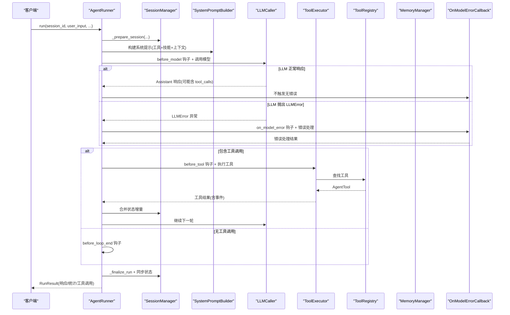
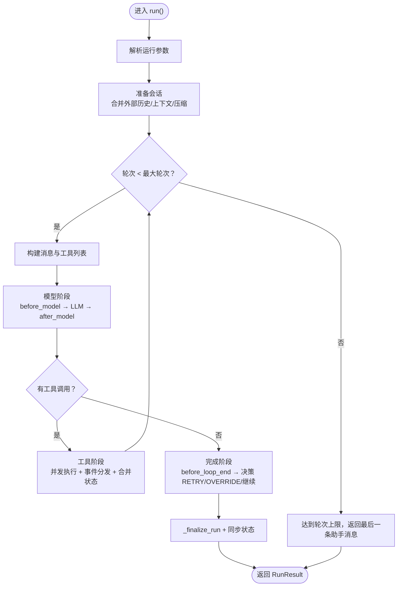
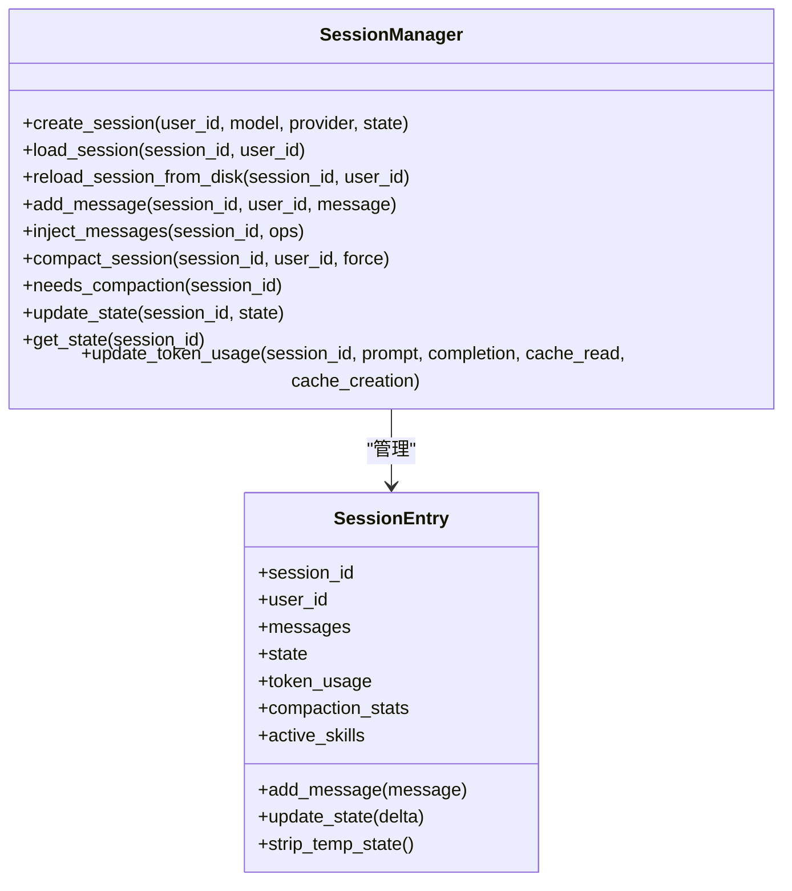
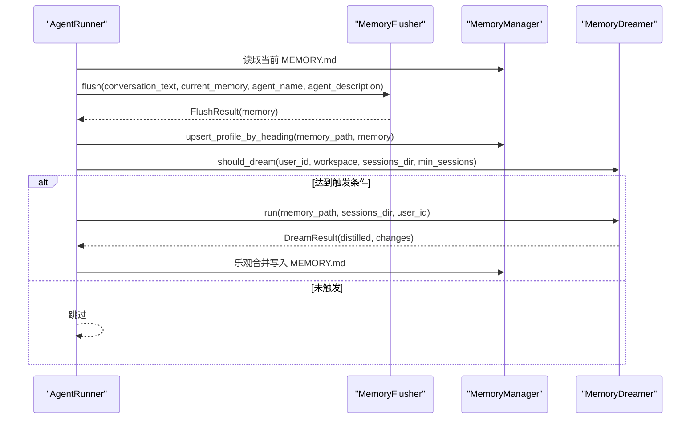
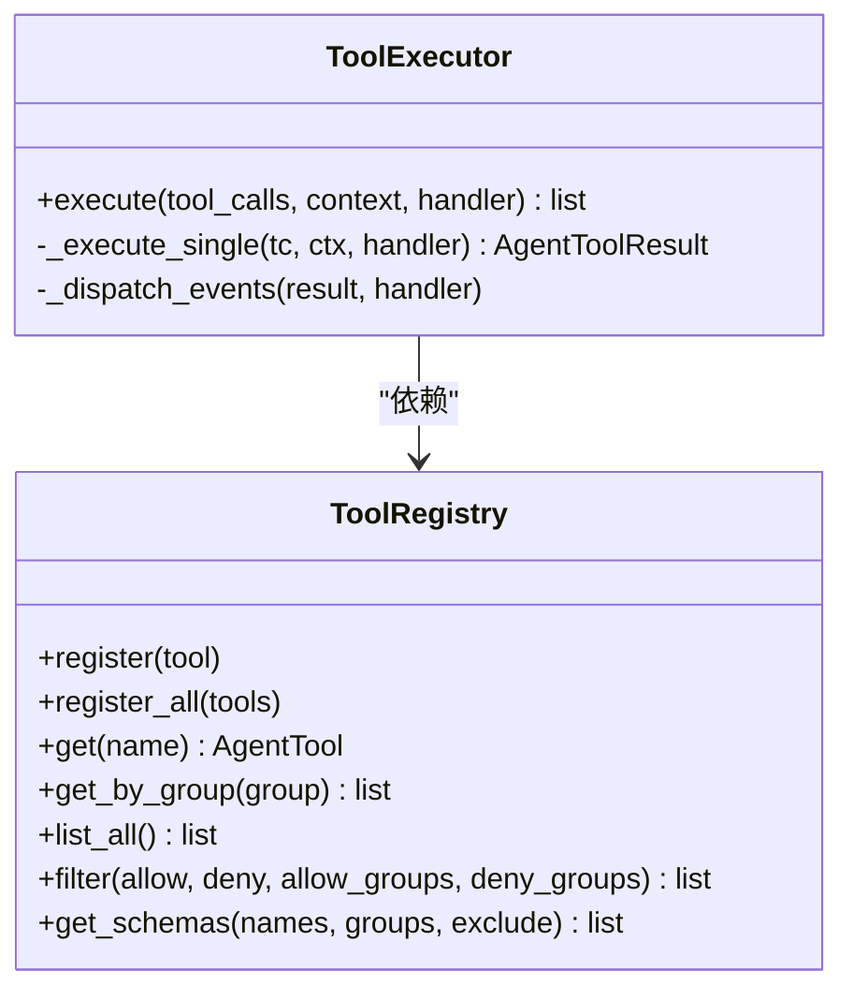
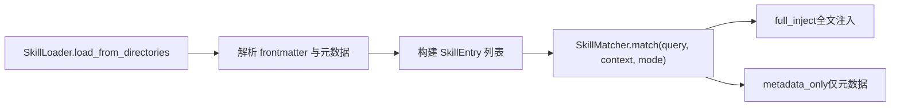
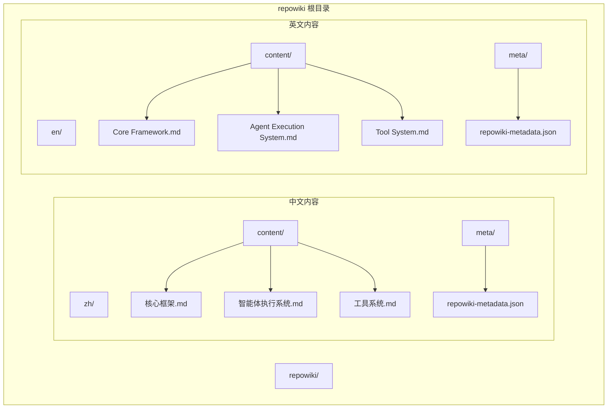
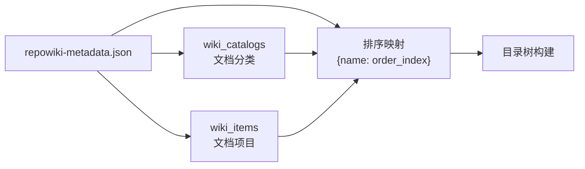
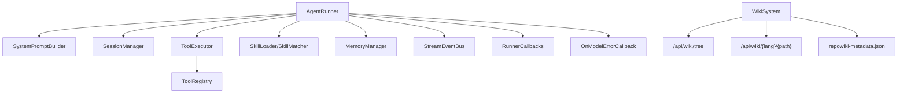

# 核心框架

<cite>
**本文引用的文件**
- [runner.py](file://src/ark_agentic/core/runner.py)
- [session.py](file://src/ark_agentic/core/session.py)
- [manager.py](file://src/ark_agentic/core/memory/manager.py)
- [registry.py](file://src/ark_agentic/core/tools/registry.py)
- [loader.py](file://src/ark_agentic/core/skills/loader.py)
- [matcher.py](file://src/ark_agentic/core/skills/matcher.py)
- [types.py](file://src/ark_agentic/core/types.py)
- [base.py](file://src/ark_agentic/core/tools/base.py)
- [executor.py](file://src/ark_agentic/core/tools/executor.py)
- [callbacks.py](file://src/ark_agentic/core/callbacks.py)
- [event_bus.py](file://src/ark_agentic/core/stream/event_bus.py)
- [builder.py](file://src/ark_agentic/core/prompt/builder.py)
- [dream.py](file://src/ark_agentic/core/memory/dream.py)
- [extractor.py](file://src/ark_agentic/core/memory/extractor.py)
- [agent.py（保险）](file://src/ark_agentic/agents/insurance/agent.py)
- [agent.py（证券）](file://src/ark_agentic/agents/securities/agent.py)
- [app.py](file://src/ark_agentic/app.py)
</cite>

## 更新摘要
**变更内容**
- 新增了专门的错误处理钩子 `on_model_error`，提供独立的错误路径处理
- 改进了上下文管理系统，从 `runtime` 字段升级为 `metadata` 字段，支持开放字典扩展
- 增强了回调系统，所有钩子协议现在支持 `**kwargs` 参数，可传递执行上下文元数据
- 优化了 LLM 错误处理流程，提供更精细的错误恢复机制
- **新增** 完整的维基系统架构，包含双语（中英）文档结构、目录树构建和API接口

## 目录
1. [简介](#简介)
2. [项目结构](#项目结构)
3. [核心组件](#核心组件)
4. [架构总览](#架构总览)
5. [详细组件分析](#详细组件分析)
6. [维基系统架构](#维基系统架构)
7. [依赖分析](#依赖分析)
8. [性能考量](#性能考量)
9. [故障排除指南](#故障排除指南)
10. [结论](#结论)
11. [附录](#附录)

## 简介
本技术文档聚焦 Ark-Agentic 核心框架，围绕 AgentRunner 的 ReAct 执行循环、会话管理、记忆系统、工具注册表与技能加载系统展开，系统阐述其架构设计、数据流、处理逻辑、集成点、生命周期管理与扩展点，并提供故障排除与性能优化建议。文档同时给出面向非专业读者的渐进式说明与可视化图示。

**更新** 本版本反映了回调系统的重大增强，包括新增的错误处理钩子和改进的上下文管理机制，显著提升了智能体执行系统的扩展能力和错误处理能力。**新增** 完整的维基系统架构，为框架提供了标准化的文档管理和知识分享平台。

## 项目结构
- 核心模块位于 src/ark_agentic/core 下，涵盖执行器、会话、记忆、工具、技能、提示、流式事件、回调钩子等。
- 代理示例位于 src/ark_agentic/agents 下，分别演示保险与证券两类 Agent 的装配与配置。
- 文档与示例位于 docs 与静态资源目录，便于理解与演示。
- **新增** 维基系统位于 repowiki 目录，提供双语（中英）文档结构和标准化的知识管理体系。

```mermaid
graph TB
subgraph "核心"
R["AgentRunner<br/>执行器"]
S["SessionManager<br/>会话管理"]
M["MemoryManager<br/>记忆管理"]
TR["ToolRegistry<br/>工具注册表"]
TL["SkillLoader<br/>技能加载器"]
TM["SkillMatcher<br/>技能匹配器"]
PB["SystemPromptBuilder<br/>系统提示构建器"]
TE["ToolExecutor<br/>工具执行器"]
CB["RunnerCallbacks<br/>回调钩子"]
EB["StreamEventBus<br/>事件总线"]
OEM["OnModelErrorCallback<br/>错误处理钩子"]
CC["CallbackContext<br/>上下文管理"]
END
subgraph "代理示例"
AI["保险 Agent"]
AS["证券 Agent"]
END
subgraph "维基系统"
WS["WikiSystem<br/>维基系统"]
WT["WikiTreeBuilder<br/>目录树构建器"]
WP["WikiPageHandler<br/>页面处理器"]
WM["WikiMetadata<br/>元数据管理"]
END
R --> S
R --> TR
R --> TL
R --> TM
R --> PB
R --> TE
R --> CB
R --> EB
R --> M
R --> OEM
R --> CC
AI --> R
AS --> R
WS --> WT
WS --> WP
WS --> WM
```

**图表来源**
- [runner.py:193-388](file://src/ark_agentic/core/runner.py#L193-L388)
- [session.py:24-482](file://src/ark_agentic/core/session.py#L24-L482)
- [manager.py:24-92](file://src/ark_agentic/core/memory/manager.py#L24-L92)
- [registry.py:14-178](file://src/ark_agentic/core/tools/registry.py#L14-L178)
- [loader.py:25-177](file://src/ark_agentic/core/skills/loader.py#L25-L177)
- [matcher.py:55-152](file://src/ark_agentic/core/skills/matcher.py#L55-L152)
- [builder.py:72-328](file://src/ark_agentic/core/prompt/builder.py#L72-L328)
- [executor.py:29-127](file://src/ark_agentic/core/tools/executor.py#L29-L127)
- [callbacks.py:75-198](file://src/ark_agentic/core/callbacks.py#L75-L198)
- [event_bus.py:67-248](file://src/ark_agentic/core/stream/event_bus.py#L67-L248)
- [agent.py（保险）:47-143](file://src/ark_agentic/agents/insurance/agent.py#L47-L143)
- [agent.py（证券）:37-173](file://src/ark_agentic/agents/securities/agent.py#L37-L173)
- [app.py:198-263](file://src/ark_agentic/app.py#L198-L263)

**章节来源**
- [runner.py:193-388](file://src/ark_agentic/core/runner.py#L193-L388)
- [session.py:24-482](file://src/ark_agentic/core/session.py#L24-L482)
- [agent.py（保险）:47-143](file://src/ark_agentic/agents/insurance/agent.py#L47-L143)
- [agent.py（证券）:37-173](file://src/ark_agentic/agents/securities/agent.py#L37-L173)
- [app.py:198-263](file://src/ark_agentic/app.py#L198-L263)

## 核心组件
- AgentRunner：ReAct 执行器，负责构建系统提示、调用 LLM、执行工具、流式事件分发、生命周期钩子与结果汇总。
- SessionManager：会话生命周期与消息持久化，支持上下文压缩、令牌统计、状态管理与外部历史合并。
- MemoryManager：轻量记忆管理，基于 heading-based markdown 的 upsert 写入与路径管理。
- ToolRegistry：工具注册与筛选，提供 JSON Schema 生成与分组能力。
- SkillLoader/SkillMatcher：技能加载与匹配，支持 full/dynamic 两种注入模式与资格/策略过滤。
- SystemPromptBuilder：系统提示动态构建，按模式注入技能与工具描述。
- ToolExecutor：工具执行器，统一错误处理、超时控制与事件分发。
- RunnerCallbacks/StreamEventBus：回调钩子与事件总线，解耦 UI 与业务逻辑。
- **新增** OnModelErrorCallback：专门的 LLM 错误处理钩子，提供独立的错误路径处理。
- **改进** CallbackContext：增强的上下文管理系统，支持开放字典扩展的 metadata 字段。
- **新增** WikiSystem：维基系统，提供双语文档管理、目录树构建和API接口。
- 示例 Agent：保险与证券 Agent 展示如何装配 Runner、配置记忆与主动服务 Job。

**章节来源**
- [runner.py:193-388](file://src/ark_agentic/core/runner.py#L193-L388)
- [session.py:24-482](file://src/ark_agentic/core/session.py#L24-L482)
- [manager.py:24-92](file://src/ark_agentic/core/memory/manager.py#L24-L92)
- [registry.py:14-178](file://src/ark_agentic/core/tools/registry.py#L14-L178)
- [loader.py:25-177](file://src/ark_agentic/core/skills/loader.py#L25-L177)
- [matcher.py:55-152](file://src/ark_agentic/core/skills/matcher.py#L55-L152)
- [builder.py:72-328](file://src/ark_agentic/core/prompt/builder.py#L72-L328)
- [executor.py:29-127](file://src/ark_agentic/core/tools/executor.py#L29-L127)
- [callbacks.py:75-198](file://src/ark_agentic/core/callbacks.py#L75-L198)
- [event_bus.py:67-248](file://src/ark_agentic/core/stream/event_bus.py#L67-L248)
- [agent.py（保险）:47-143](file://src/ark_agentic/agents/insurance/agent.py#L47-L143)
- [agent.py（证券）:37-173](file://src/ark_agentic/agents/securities/agent.py#L37-L173)
- [app.py:198-263](file://src/ark_agentic/app.py#L198-L263)

## 架构总览
AgentRunner 作为中枢，串联会话、记忆、工具、技能与提示构建模块，并通过回调与事件总线与上层应用解耦。ReAct 循环在每轮内依次经历"模型阶段 → 工具阶段 → 完成阶段"，并在必要时触发记忆抽取与蒸馏。

**更新** 新增了专门的错误处理路径，当 LLM 调用抛出 LLMError 时，系统会触发 `on_model_error` 钩子，而不是继续执行正常的 `after_model` 钩子。



**图表来源**
- [runner.py:312-370](file://src/ark_agentic/core/runner.py#L312-L370)
- [runner.py:652-731](file://src/ark_agentic/core/runner.py#L652-L731)
- [runner.py:760-800](file://src/ark_agentic/core/runner.py#L760-L800)
- [executor.py:43-101](file://src/ark_agentic/core/tools/executor.py#L43-L101)
- [builder.py:275-325](file://src/ark_agentic/core/prompt/builder.py#L275-L325)
- [session.py:495-520](file://src/ark_agentic/core/session.py#L495-L520)
- [callbacks.py:155-167](file://src/ark_agentic/core/callbacks.py#L155-L167)

## 详细组件分析

### AgentRunner 与 ReAct 执行循环
- 生命周期与阶段
  - 解析运行参数、准备会话、执行 ReAct 循环、收尾与持久化。
  - 每轮包含模型阶段、工具阶段与完成阶段，支持钩子覆盖/重试/中止。
- 关键配置
  - RunnerConfig：模型、采样、重试次数、最大轮次、每轮最大工具调用数、工具超时、自动压缩、提示配置、技能配置、子任务开关、Dream 开关与阈值、外部历史合并开关。
  - RunOptions：按请求覆盖模型与温度。
- ReAct 循环要点
  - 模型阶段：before_model → LLM → after_model → 持久化消息 → 统计 Token。
  - **新增** 错误处理：当 LLM 抛出 LLMError 时，触发 on_model_error 钩子，跳过 after_model 钩子。
  - 工具阶段：并发执行工具调用，分发事件，合并状态增量。
  - 完成阶段：before_loop_end → 决策 RETRY/OVERRIDE/继续 → 最终响应。
- 错误处理
  - LLMError 映射为用户友好提示；工具超时/异常统一包装为错误结果。
  - **新增** 专门的错误处理钩子提供细粒度的错误恢复策略。
- 流式输出
  - 通过事件总线分发思考/文本增量、工具调用开始/结果、UI 组件与自定义事件。



**图表来源**
- [runner.py:391-404](file://src/ark_agentic/core/runner.py#L391-L404)
- [runner.py:406-494](file://src/ark_agentic/core/runner.py#L406-L494)
- [runner.py:652-731](file://src/ark_agentic/core/runner.py#L652-L731)
- [runner.py:734-758](file://src/ark_agentic/core/runner.py#L734-L758)
- [runner.py:760-800](file://src/ark_agentic/core/runner.py#L760-L800)

**章节来源**
- [runner.py:92-129](file://src/ark_agentic/core/runner.py#L92-L129)
- [runner.py:312-370](file://src/ark_agentic/core/runner.py#L312-L370)
- [runner.py:652-731](file://src/ark_agentic/core/runner.py#L652-L731)
- [runner.py:760-800](file://src/ark_agentic/core/runner.py#L760-L800)
- [runner.py:592-611](file://src/ark_agentic/core/runner.py#L592-L611)

### 会话管理机制（SessionManager）
- 会话生命周期：创建/加载/删除/列表；支持从磁盘重载与同步。
- 消息管理：追加/批量化追加/注入外部历史；支持清理系统消息与限制数量。
- 上下文压缩：估算令牌、触发压缩、记录压缩统计；支持预压缩回调（如记忆抽取）。
- 状态管理：会话状态字典，支持临时键清理；令牌统计与活跃技能快照。
- 持久化：TranscriptManager 与 SessionStore 双通道，确保消息与状态一致落盘。



**图表来源**
- [session.py:24-482](file://src/ark_agentic/core/session.py#L24-L482)
- [types.py:350-422](file://src/ark_agentic/core/types.py#L350-L422)

**章节来源**
- [session.py:40-183](file://src/ark_agentic/core/session.py#L40-L183)
- [session.py:184-289](file://src/ark_agentic/core/session.py#L184-L289)
- [session.py:291-431](file://src/ark_agentic/core/session.py#L291-L431)
- [session.py:432-482](file://src/ark_agentic/core/session.py#L432-L482)
- [types.py:350-422](file://src/ark_agentic/core/types.py#L350-L422)

### 记忆系统设计（MemoryManager、MemoryFlusher、MemoryDreamer）
- MemoryManager：定位用户 MEMORY.md 路径，提供读写便捷方法；heading-level upsert，返回新增/删除的标题。
- MemoryFlusher：在压缩前从完整对话抽取结构化记忆，写入 MEMORY.md；使用低温度/可复现采样。
- MemoryDreamer：周期性蒸馏近期会话与现有记忆，生成新的记忆并乐观合并；具备失败保护与阈值控制。



**图表来源**
- [runner.py:520-573](file://src/ark_agentic/core/runner.py#L520-L573)
- [runner.py:574-573](file://src/ark_agentic/core/runner.py#L574-L573)
- [extractor.py:108-151](file://src/ark_agentic/core/memory/extractor.py#L108-L151)
- [extractor.py:152-187](file://src/ark_agentic/core/memory/extractor.py#L152-L187)
- [dream.py:147-176](file://src/ark_agentic/core/memory/dream.py#L147-L176)
- [dream.py:289-323](file://src/ark_agentic/core/memory/dream.py#L289-L323)

**章节来源**
- [manager.py:24-92](file://src/ark_agentic/core/memory/manager.py#L24-L92)
- [extractor.py:98-187](file://src/ark_agentic/core/memory/extractor.py#L98-L187)
- [dream.py:190-323](file://src/ark_agentic/core/memory/dream.py#L190-L323)

### 工具注册表架构（ToolRegistry 与 ToolExecutor）
- ToolRegistry：注册/查找/筛选工具，生成 JSON Schema；支持分组与白/黑名单策略。
- ToolExecutor：并发执行工具调用，统一超时与错误处理；将 AgentToolResult.events 统一分发至事件总线。



**图表来源**
- [registry.py:14-178](file://src/ark_agentic/core/tools/registry.py#L14-L178)
- [executor.py:29-127](file://src/ark_agentic/core/tools/executor.py#L29-L127)
- [base.py:46-117](file://src/ark_agentic/core/tools/base.py#L46-L117)

**章节来源**
- [registry.py:24-93](file://src/ark_agentic/core/tools/registry.py#L24-L93)
- [executor.py:43-101](file://src/ark_agentic/core/tools/executor.py#L43-L101)
- [base.py:79-117](file://src/ark_agentic/core/tools/base.py#L79-L117)

### 技能加载系统（SkillLoader 与 SkillMatcher）
- SkillLoader：从多目录加载 SKILL.md，解析 frontmatter，构建 SkillEntry，支持优先级覆盖。
- SkillMatcher：按策略与资格过滤，结合 SkillLoadMode 决定 full_inject 与 metadata_only；支持按标签/分组检索。



**图表来源**
- [loader.py:35-84](file://src/ark_agentic/core/skills/loader.py#L35-L84)
- [loader.py:85-108](file://src/ark_agentic/core/skills/loader.py#L85-L108)
- [matcher.py:64-127](file://src/ark_agentic/core/skills/matcher.py#L64-L127)

**章节来源**
- [loader.py:25-177](file://src/ark_agentic/core/skills/loader.py#L25-L177)
- [matcher.py:55-152](file://src/ark_agentic/core/skills/matcher.py#L55-L152)
- [base.py:19-50](file://src/ark_agentic/core/skills/base.py#L19-L50)

### 提示系统与系统提示构建（SystemPromptBuilder）
- 动态构建系统提示，支持身份、运行时信息、工具描述、技能（full/dynamic）、上下文、用户画像、自定义指令与记忆写入协议。
- 在 dynamic 模式下将"技能加载指令"与"可用技能元数据"拆分为独立段落，避免名词标签淹没行为指令。

**章节来源**
- [builder.py:72-328](file://src/ark_agentic/core/prompt/builder.py#L72-L328)

### 回调与流式事件（RunnerCallbacks 与 StreamEventBus）
- RunnerCallbacks：**新增** 8 类钩子覆盖 Agent 生命周期，包括新增的 `on_model_error` 错误处理钩子。
- **改进** CallbackContext：从 `runtime` 字段升级为 `metadata` 字段，支持开放字典扩展，提供更好的扩展能力。
- StreamEventBus：将 Runner 内部回调翻译为 AG-UI 原生事件，自动配对 step/text_message/thinking_message 的 start/finish，终结事件自动关闭活跃状态。

**更新** 新增的错误处理钩子提供了专门的错误路径处理，与成功路径完全分离，支持独立的错误恢复策略。

**章节来源**
- [callbacks.py:43-198](file://src/ark_agentic/core/callbacks.py#L43-L198)
- [event_bus.py:67-248](file://src/ark_agentic/core/stream/event_bus.py#L67-L248)

### 示例 Agent 装配（保险与证券）
- 保险 Agent：注册保险专属工具，启用记忆与 Dream，配置主动服务 Job。
- 证券 Agent：注册证券工具，启用记忆与主动服务 Job，注入上下文增强与鉴权拦截回调，以及引用校验钩子。

**章节来源**
- [agent.py（保险）:47-143](file://src/ark_agentic/agents/insurance/agent.py#L47-L143)
- [agent.py（证券）:37-173](file://src/ark_agentic/agents/securities/agent.py#L37-L173)

## 维基系统架构

**新增** Ark-Agentic 框架包含一个完整的维基系统，为用户提供双语（中英）文档访问和知识管理能力。

### 维基系统概述
- **双语支持**：同时支持中文（zh）和英文（en）文档内容
- **标准化结构**：采用 repowiki 目录结构，包含 content 和 meta 子目录
- **元数据驱动**：通过 repowiki-metadata.json 控制文档目录顺序和分类
- **API 集成**：提供 RESTful API 接口用于文档树构建和页面获取

### 目录结构设计


**图表来源**
- [app.py:173](file://src/ark_agentic/app.py#L173)
- [app.py:204-246](file://src/ark_agentic/app.py#L204-L246)

### 维基 API 接口
维基系统提供两个主要的 API 接口：

#### 目录树构建接口
- **端点**：`GET /api/wiki/tree`
- **功能**：返回双语维基系统的目录树结构
- **返回格式**：JSON 对象，包含 zh 和 en 两个语言的目录树
- **排序规则**：基于 repowiki-metadata.json 中的 wiki_items 顺序

#### 文档页面接口
- **端点**：`GET /api/wiki/{lang}/{path:path}`
- **参数**：
  - `{lang}`：语言代码（zh 或 en）
  - `{path}`：文档路径（相对 content 目录）
- **功能**：返回指定语言和路径的 Markdown 文档内容
- **安全检查**：防止路径穿越攻击

### 元数据管理
维基系统使用 JSON 元数据文件来控制文档结构和排序：



**图表来源**
- [app.py:204-219](file://src/ark_agentic/app.py#L204-L219)

### 目录树构建算法
维基系统使用递归算法构建目录树，支持以下特性：

1. **路径排序**：根据元数据中的顺序映射进行排序
2. **文件过滤**：仅包含 .md 文件，忽略其他类型
3. **安全验证**：防止路径穿越攻击
4. **层级遍历**：递归遍历所有子目录

**章节来源**
- [app.py:198-263](file://src/ark_agentic/app.py#L198-L263)

## 依赖分析
- 组件耦合与内聚
  - AgentRunner 高内聚于执行循环，通过 ToolExecutor、SystemPromptBuilder、SessionManager、MemoryManager 等模块解耦。
  - ToolRegistry 与 SkillLoader/SkillMatcher 通过接口与类型解耦，支持策略化筛选与动态注入。
  - RunnerCallbacks 与 StreamEventBus 采用协议解耦 UI 与业务逻辑。
  - **新增** OnModelErrorCallback 与 AgentRunner 形成独立的错误处理依赖关系。
  - **新增** WikiSystem 与核心框架解耦，通过 API 接口提供文档访问能力。
- 外部依赖
  - LLM 后端（LangChain Chat 模型）、异步事件队列、文件系统（会话与记忆存储）、**新增** 文件系统（维基文档存储）。
- 潜在循环依赖
  - 未见直接循环依赖；各模块通过接口与类型进行弱耦合。



**图表来源**
- [runner.py:203-284](file://src/ark_agentic/core/runner.py#L203-L284)
- [builder.py:72-328](file://src/ark_agentic/core/prompt/builder.py#L72-L328)
- [session.py:24-482](file://src/ark_agentic/core/session.py#L24-L482)
- [executor.py:29-127](file://src/ark_agentic/core/tools/executor.py#L29-L127)
- [registry.py:14-178](file://src/ark_agentic/core/tools/registry.py#L14-L178)
- [loader.py:25-177](file://src/ark_agentic/core/skills/loader.py#L25-L177)
- [matcher.py:55-152](file://src/ark_agentic/core/skills/matcher.py#L55-L152)
- [manager.py:24-92](file://src/ark_agentic/core/memory/manager.py#L24-L92)
- [event_bus.py:67-248](file://src/ark_agentic/core/stream/event_bus.py#L67-L248)
- [callbacks.py:172-198](file://src/ark_agentic/core/callbacks.py#L172-L198)
- [app.py:198-263](file://src/ark_agentic/app.py#L198-L263)

## 性能考量
- 令牌与上下文管理
  - 启用自动压缩与预压缩回调，降低上下文长度，减少 Token 消耗。
  - 控制每轮工具调用数量与工具超时，避免阻塞与资源浪费。
- 并发与限流
  - 工具执行并发但受每轮调用上限限制；合理设置 max_tool_calls_per_turn。
  - LLM 调用重试采用指数退避，避免雪崩。
- 记忆与蒸馏
  - MemoryFlusher 使用低温度采样，保证抽取一致性；Dream 周期性触发，避免频繁重算。
- I/O 与持久化
  - 会话与记忆写入采用延迟同步与批量化追加，减少磁盘压力。
- **新增** 维基系统性能优化
  - 目录树构建使用缓存机制，避免重复计算。
  - 文档内容采用懒加载策略，按需读取。
  - 元数据文件缓存，减少文件系统访问。
- **新增** 错误处理性能
  - 专门的错误处理钩子避免了错误情况下的额外开销，提高了错误恢复效率。

## 故障排除指南
- LLM 错误映射
  - 认证失败、配额不足、速率限制、超时、上下文溢出、内容过滤、服务器错误、网络异常等均有用户友好提示。
  - **新增** 专门的错误处理钩子提供细粒度的错误恢复策略。
- 工具调用失败
  - 超时/异常统一包装为错误结果；事件总线会发出工具调用结束与结果事件，便于前端展示。
- 会话与压缩
  - 若出现上下文过长，检查自动压缩是否触发；必要时手动触发压缩并查看压缩统计。
- 记忆写入
  - 检查 heading-level upsert 结果与返回的新增/删除标题；确认文件权限与路径。
- 回调与事件
  - 若 UI 未显示预期事件，检查回调链返回的 HookAction 与事件分发逻辑。
  - **新增** 检查错误处理钩子的配置与实现，确保错误路径正确执行。
- **新增** 维基系统故障排除
  - 目录树接口返回空数组：检查 repowiki 目录是否存在和权限设置。
  - 文档页面 404：确认文档路径正确且文件存在。
  - 元数据文件解析错误：检查 JSON 格式和字段完整性。
  - 路径穿越防护：确保请求路径不包含 .. 符号。

**章节来源**
- [runner.py:592-611](file://src/ark_agentic/core/runner.py#L592-L611)
- [executor.py:80-100](file://src/ark_agentic/core/tools/executor.py#L80-L100)
- [session.py:387-431](file://src/ark_agentic/core/session.py#L387-L431)
- [manager.py:45-69](file://src/ark_agentic/core/memory/manager.py#L45-L69)
- [callbacks.py:43-70](file://src/ark_agentic/core/callbacks.py#L43-L70)
- [event_bus.py:146-201](file://src/ark_agentic/core/stream/event_bus.py#L146-L201)
- [app.py:249-263](file://src/ark_agentic/app.py#L249-L263)

## 结论
Ark-Agentic 核心框架以 AgentRunner 为中心，通过清晰的生命周期与 ReAct 循环、完善的会话与记忆管理、灵活的工具与技能系统、可插拔的回调与事件总线，实现了高内聚、低耦合、可扩展的智能体执行平台。

**更新** 本次增强显著提升了系统的健壮性和扩展能力，新增的错误处理钩子提供了专门的错误恢复机制，改进的上下文管理系统支持更灵活的元数据扩展，为复杂的生产环境提供了更好的支持。**新增** 完整的维基系统架构为框架提供了标准化的知识管理和文档访问能力，支持双语文档和元数据驱动的目录管理。

示例 Agent 展示了如何在真实场景中装配与配置，兼顾功能完整性与工程可维护性。

## 附录
- 配置项速查
  - RunnerConfig：模型、采样、重试、轮次与工具限制、自动压缩、提示与技能配置、子任务与 Dream 开关、外部历史合并。
  - RunOptions：按请求覆盖模型与温度。
  - PromptConfig：身份、运行时信息、工具描述、自定义指令、系统协议、模型信息。
  - SkillConfig：技能目录、Agent ID、资格检查、默认调用策略、加载模式、分组阈值与预算。
  - **新增** WikiConfig：维基根目录路径、元数据文件位置、目录树缓存策略。
- 使用模式
  - full 模式：技能全文注入，适合确定性强的任务。
  - dynamic 模式：仅注入元数据，按需 read_skill，适合复杂多变任务。
- 扩展点
  - 自定义工具：实现 AgentTool 接口并注册到 ToolRegistry。
  - 自定义技能：编写 SKILL.md 并通过 SkillLoader 加载。
  - **新增** 自定义错误处理：实现 OnModelErrorCallback 协议处理特定错误场景。
  - **改进** 自定义回调：利用增强的 CallbackContext 和 metadata 字段传递执行上下文。
  - 自定义事件：扩展 AgentEventHandler 协议并接入事件总线。
  - **新增** 自定义维基内容：在 repowiki 目录下添加新的文档内容。
  - **新增** 自定义维基元数据：编辑 repowiki-metadata.json 控制文档结构。
- **新增** 维基系统最佳实践
  - 使用 repowiki 目录结构组织文档内容。
  - 在 meta 目录下维护元数据文件，确保正确的目录顺序。
  - 利用 API 接口提供文档访问，避免直接文件系统操作。
  - 实施适当的缓存策略，提升文档加载性能。
  - 使用双语文档覆盖不同用户群体的需求。
  - 定期维护元数据文件，确保文档结构的准确性。
- **新增** 错误处理最佳实践
  - 使用 on_model_error 钩子处理特定类型的 LLM 错误。
  - 在 CallbackContext.metadata 中存储运行时元数据，避免硬编码。
  - 利用 kwargs 参数传递执行上下文，如 streaming、model、tool_count 等。