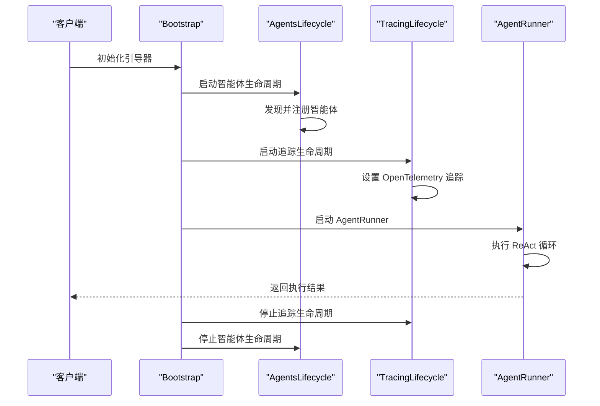
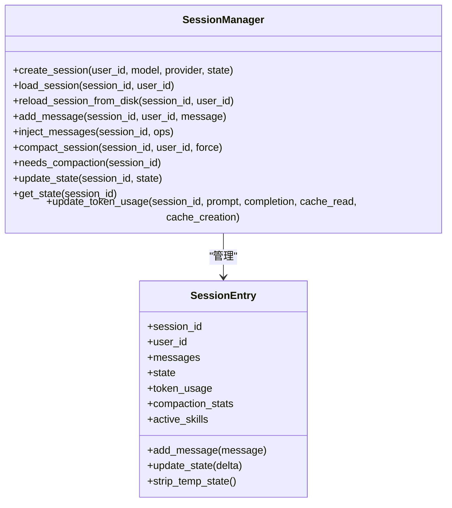
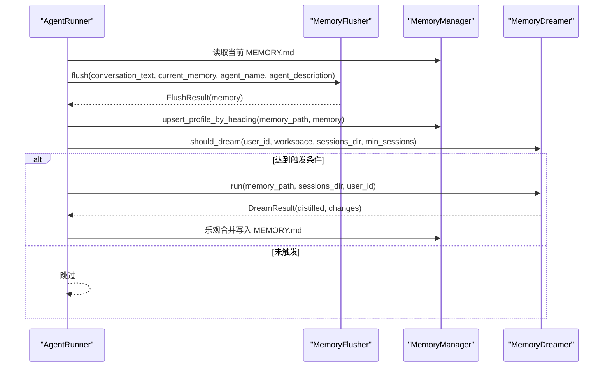
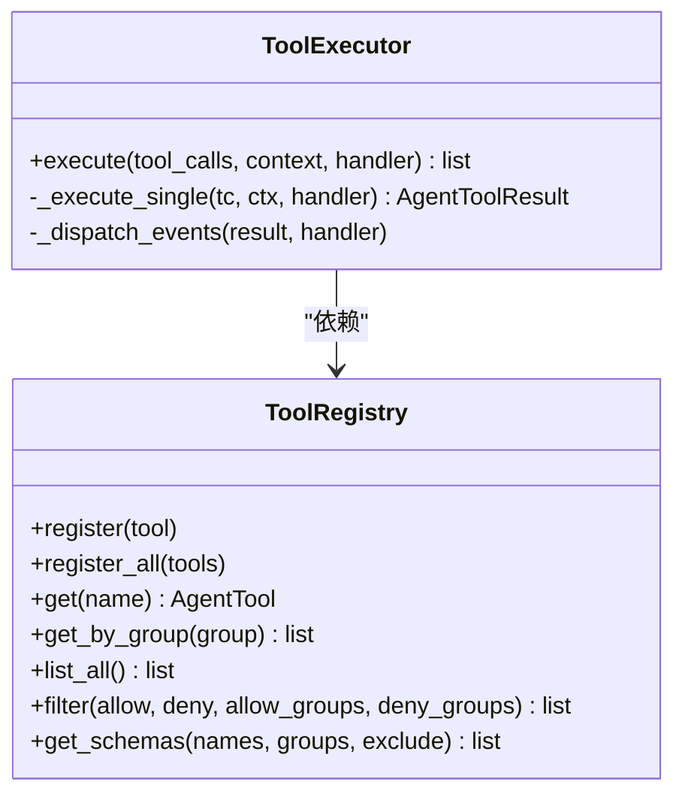
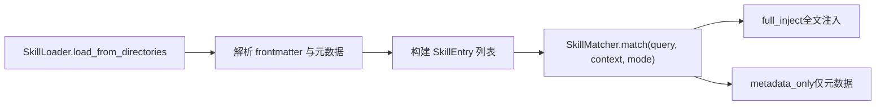
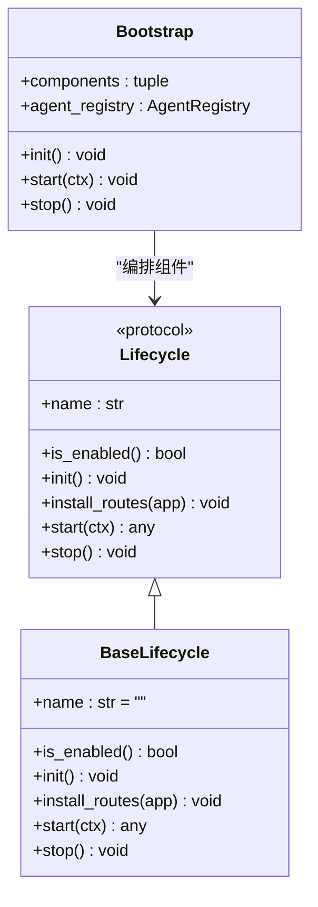
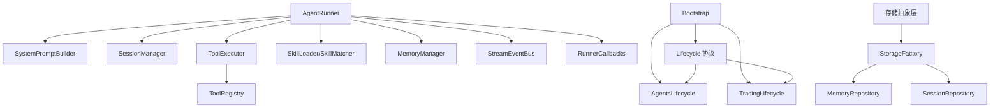

# 核心框架

<cite>
**本文引用的文件**
- [runner.py](file://src/ark_agentic/core/runner.py)
- [session.py](file://src/ark_agentic/core/session.py)
- [manager.py](file://src/ark_agentic/core/memory/manager.py)
- [registry.py](file://src/ark_agentic/core/tools/registry.py)
- [loader.py](file://src/ark_agentic/core/skills/loader.py)
- [matcher.py](file://src/ark_agentic/core/skills/matcher.py)
- [types.py](file://src/ark_agentic/core/types.py)
- [base.py](file://src/ark_agentic/core/tools/base.py)
- [executor.py](file://src/ark_agentic/core/tools/executor.py)
- [callbacks.py](file://src/ark_agentic/core/callbacks.py)
- [event_bus.py](file://src/ark_agentic/core/stream/event_bus.py)
- [builder.py](file://src/ark_agentic/core/prompt/builder.py)
- [dream.py](file://src/ark_agentic/core/memory/dream.py)
- [extractor.py](file://src/ark_agentic/core/memory/extractor.py)
- [agent.py（保险）](file://src/ark_agentic/agents/insurance/agent.py)
- [agent.py（证券）](file://src/ark_agentic/agents/securities/agent.py)
- [app.py](file://src/ark_agentic/app.py)
- [lifecycle.py](file://src/ark_agentic/core/protocol/lifecycle.py)
- [bootstrap.py](file://src/ark_agentic/core/protocol/bootstrap.py)
- [agents_lifecycle.py](file://src/ark_agentic/core/runtime/agents_lifecycle.py)
- [tracing_lifecycle.py](file://src/ark_agentic/core/observability/tracing_lifecycle.py)
- [storage_init.py](file://src/ark_agentic/core/storage/__init__.py)
- [mode.py](file://src/ark_agentic/core/storage/mode.py)
- [factory.py](file://src/ark_agentic/core/storage/factory.py)
- [memory_protocol.py](file://src/ark_agentic/core/storage/protocols/memory.py)
- [session_protocol.py](file://src/ark_agentic/core/storage/protocols/session.py)
</cite>

## 更新摘要
**变更内容**
- 核心框架重构：runtime 组件重新组织，引入统一的生命周期管理协议
- AgentLifecycle 和 TracingLifecycle 重构：采用新的生命周期协议，提供更清晰的组件管理
- 新增存储抽象层：hexagonal architecture 设计，支持文件和数据库两种存储模式
- Bootstrap 重构：统一的组件生命周期编排器，支持核心组件和插件的有序启动

## 目录
1. [简介](#简介)
2. [项目结构](#项目结构)
3. [核心组件](#核心组件)
4. [架构总览](#架构总览)
5. [详细组件分析](#详细组件分析)
6. [存储抽象层](#存储抽象层)
7. [生命周期管理](#生命周期管理)
8. [依赖分析](#依赖分析)
9. [性能考量](#性能考量)
10. [故障排除指南](#故障排除指南)
11. [结论](#结论)
12. [附录](#附录)

## 简介
本技术文档聚焦 Ark-Agentic 核心框架，围绕 AgentRunner 的 ReAct 执行循环、会话管理、记忆系统、工具注册表与技能加载系统展开，系统阐述其架构设计、数据流、处理逻辑、集成点、生命周期管理与扩展点，并提供故障排除与性能优化建议。文档同时给出面向非专业读者的渐进式说明与可视化图示。

**更新** 本版本反映了核心框架的重大重构，包括统一的生命周期管理协议、新的存储抽象层设计以及重构的 AgentLifecycle 和 TracingLifecycle 组件。这些变更显著提升了框架的可扩展性、可维护性和部署灵活性。

## 项目结构
- 核心模块位于 src/ark_agentic/core 下，涵盖执行器、会话、记忆、工具、技能、提示、流式事件、回调钩子等。
- **新增** 协议层位于 src/ark_agentic/core/protocol，提供统一的生命周期管理接口。
- **新增** 运行时组件位于 src/ark_agentic/core/runtime，包含 AgentLifecycle 等核心运行时组件。
- **新增** 存储抽象层位于 src/ark_agentic/core/storage，提供 hexagonal architecture 设计的存储解决方案。
- 代理示例位于 src/ark_agentic/agents 下，分别演示保险与证券两类 Agent 的装配与配置。
- 文档与示例位于 docs 与静态资源目录，便于理解与演示。

```mermaid
graph TB
subgraph "核心框架"
R["AgentRunner<br/>执行器"]
S["SessionManager<br/>会话管理"]
M["MemoryManager<br/>记忆管理"]
TR["ToolRegistry<br/>工具注册表"]
TL["SkillLoader<br/>技能加载器"]
TM["SkillMatcher<br/>技能匹配器"]
PB["SystemPromptBuilder<br/>系统提示构建器"]
TE["ToolExecutor<br/>工具执行器"]
CB["RunnerCallbacks<br/>回调钩子"]
EB["StreamEventBus<br/>事件总线"]
END
subgraph "协议层"
LC["Lifecycle<br/>生命周期协议"]
BS["Bootstrap<br/>引导器"]
END
subgraph "运行时组件"
AL["AgentsLifecycle<br/>智能体生命周期"]
TL["TracingLifecycle<br/>追踪生命周期"]
END
subgraph "存储抽象层"
SM["StorageMode<br/>存储模式"]
SF["StorageFactory<br/>存储工厂"]
MP["MemoryProtocol<br/>内存协议"]
SP["SessionProtocol<br/>会话协议"]
END
subgraph "代理示例"
AI["保险 Agent"]
AS["证券 Agent"]
END
R --> S
R --> TR
R --> TL
R --> TM
R --> PB
R --> TE
R --> CB
R --> EB
R --> M
LC --> AL
LC --> TL
BS --> LC
SM --> SF
SF --> MP
SF --> SP
AI --> R
AS --> R
```

**图表来源**
- [runner.py:193-388](file://src/ark_agentic/core/runner.py#L193-L388)
- [session.py:24-482](file://src/ark_agentic/core/session.py#L24-L482)
- [manager.py:24-92](file://src/ark_agentic/core/memory/manager.py#L24-L92)
- [lifecycle.py:23-91](file://src/ark_agentic/core/protocol/lifecycle.py#L23-L91)
- [bootstrap.py:48-162](file://src/ark_agentic/core/protocol/bootstrap.py#L48-L162)
- [agents_lifecycle.py:43-80](file://src/ark_agentic/core/runtime/agents_lifecycle.py#L43-L80)
- [tracing_lifecycle.py:21-41](file://src/ark_agentic/core/observability/tracing_lifecycle.py#L21-L41)
- [storage_init.py:1-10](file://src/ark_agentic/core/storage/__init__.py#L1-L10)
- [mode.py:19-32](file://src/ark_agentic/core/storage/mode.py#L19-L32)
- [factory.py:30-68](file://src/ark_agentic/core/storage/factory.py#L30-L68)

**章节来源**
- [runner.py:193-388](file://src/ark_agentic/core/runner.py#L193-L388)
- [session.py:24-482](file://src/ark_agentic/core/session.py#L24-L482)
- [lifecycle.py:1-91](file://src/ark_agentic/core/protocol/lifecycle.py#L1-L91)
- [bootstrap.py:1-162](file://src/ark_agentic/core/protocol/bootstrap.py#L1-L162)
- [agents_lifecycle.py:1-80](file://src/ark_agentic/core/runtime/agents_lifecycle.py#L1-L80)
- [tracing_lifecycle.py:1-41](file://src/ark_agentic/core/observability/tracing_lifecycle.py#L1-L41)
- [storage_init.py:1-10](file://src/ark_agentic/core/storage/__init__.py#L1-L10)
- [mode.py:1-32](file://src/ark_agentic/core/storage/mode.py#L1-L32)
- [factory.py:1-68](file://src/ark_agentic/core/storage/factory.py#L1-L68)

## 核心组件
- AgentRunner：ReAct 执行器，负责构建系统提示、调用 LLM、执行工具、流式事件分发、生命周期钩子与结果汇总。
- SessionManager：会话生命周期与消息持久化，支持上下文压缩、令牌统计、状态管理与外部历史合并。
- MemoryManager：轻量记忆管理，基于 heading-based markdown 的 upsert 写入与路径管理。
- ToolRegistry：工具注册与筛选，提供 JSON Schema 生成与分组能力。
- SkillLoader/SkillMatcher：技能加载与匹配，支持 full/dynamic 两种注入模式与资格/策略过滤。
- SystemPromptBuilder：系统提示动态构建，按模式注入技能与工具描述。
- ToolExecutor：工具执行器，统一错误处理、超时控制与事件分发。
- RunnerCallbacks/StreamEventBus：回调钩子与事件总线，解耦 UI 与业务逻辑。
- **新增** Lifecycle 协议：统一的组件生命周期管理接口，区分核心组件与插件组件。
- **新增** Bootstrap 引导器：统一的组件生命周期编排器，支持有序启动和资源管理。
- **新增** AgentsLifecycle：核心智能体注册表编排组件，支持文件系统驱动的智能体发现。
- **新增** TracingLifecycle：OpenTelemetry 追踪组件，提供统一的分布式追踪能力。
- **新增** 存储抽象层：hexagonal architecture 设计，支持文件和数据库两种存储模式。
- **新增** StorageFactory：存储仓库工厂，根据环境变量选择合适的存储后端。
- **新增** MemoryProtocol/SessionProtocol：存储协议接口，定义内存和会话存储的标准接口。

**章节来源**
- [runner.py:193-388](file://src/ark_agentic/core/runner.py#L193-L388)
- [session.py:24-482](file://src/ark_agentic/core/session.py#L24-L482)
- [lifecycle.py:23-91](file://src/ark_agentic/core/protocol/lifecycle.py#L23-L91)
- [bootstrap.py:48-162](file://src/ark_agentic/core/protocol/bootstrap.py#L48-L162)
- [agents_lifecycle.py:43-80](file://src/ark_agentic/core/runtime/agents_lifecycle.py#L43-L80)
- [tracing_lifecycle.py:21-41](file://src/ark_agentic/core/observability/tracing_lifecycle.py#L21-L41)
- [storage_init.py:1-10](file://src/ark_agentic/core/storage/__init__.py#L1-L10)
- [factory.py:30-68](file://src/ark_agentic/core/storage/factory.py#L30-L68)
- [memory_protocol.py:8-56](file://src/ark_agentic/core/storage/protocols/memory.py#L8-L56)
- [session_protocol.py:17-194](file://src/ark_agentic/core/storage/protocols/session.py#L17-L194)

## 架构总览
AgentRunner 作为中枢，串联会话、记忆、工具、技能与提示构建模块，并通过回调与事件总线与上层应用解耦。**更新** 新的生命周期管理架构通过 Bootstrap 统一编排所有组件，包括核心的 AgentsLifecycle 和 TracingLifecycle。存储抽象层提供灵活的数据持久化方案，支持文件和数据库两种模式。



**图表来源**
- [bootstrap.py:134-162](file://src/ark_agentic/core/protocol/bootstrap.py#L134-L162)
- [agents_lifecycle.py:56-80](file://src/ark_agentic/core/runtime/agents_lifecycle.py#L56-L80)
- [tracing_lifecycle.py:32-41](file://src/ark_agentic/core/observability/tracing_lifecycle.py#L32-L41)
- [runner.py:312-370](file://src/ark_agentic/core/runner.py#L312-L370)

## 详细组件分析

### AgentRunner 与 ReAct 执行循环
- 生命周期与阶段
  - 解析运行参数、准备会话、执行 ReAct 循环、收尾与持久化。
  - 每轮包含模型阶段、工具阶段与完成阶段，支持钩子覆盖/重试/中止。
- 关键配置
  - RunnerConfig：模型、采样、重试次数、最大轮次、每轮最大工具调用数、工具超时、自动压缩、提示配置、技能配置、子任务开关、Dream 开关与阈值、外部历史合并开关。
  - RunOptions：按请求覆盖模型与温度。
- ReAct 循环要点
  - 模型阶段：before_model → LLM → after_model → 持久化消息 → 统计 Token。
  - 工具阶段：并发执行工具调用，分发事件，合并状态增量。
  - 完成阶段：before_loop_end → 决策 RETRY/OVERRIDE/继续 → 最终响应。
- 错误处理
  - LLMError 映射为用户友好提示；工具超时/异常统一包装为错误结果。
- 流式输出
  - 通过事件总线分发思考/文本增量、工具调用开始/结果、UI 组件与自定义事件。


**图表来源**
- [runner.py:391-404](file://src/ark_agentic/core/runner.py#L391-L404)
- [runner.py:406-494](file://src/ark_agentic/core/runner.py#L406-L494)
- [runner.py:652-731](file://src/ark_agentic/core/runner.py#L652-L731)
- [runner.py:734-758](file://src/ark_agentic/core/runner.py#L734-L758)
- [runner.py:760-800](file://src/ark_agentic/core/runner.py#L760-L800)

**章节来源**
- [runner.py:92-129](file://src/ark_agentic/core/runner.py#L92-L129)
- [runner.py:312-370](file://src/ark_agentic/core/runner.py#L312-L370)
- [runner.py:652-731](file://src/ark_agentic/core/runner.py#L652-L731)
- [runner.py:760-800](file://src/ark_agentic/core/runner.py#L760-L800)
- [runner.py:592-611](file://src/ark_agentic/core/runner.py#L592-L611)

### 会话管理机制（SessionManager）
- 会话生命周期：创建/加载/删除/列表；支持从磁盘重载与同步。
- 消息管理：追加/批量化追加/注入外部历史；支持清理系统消息与限制数量。
- 上下文压缩：估算令牌、触发压缩、记录压缩统计；支持预压缩回调（如记忆抽取）。
- 状态管理：会话状态字典，支持临时键清理；令牌统计与活跃技能快照。
- 持久化：TranscriptManager 与 SessionStore 双通道，确保消息与状态一致落盘。



**图表来源**
- [session.py:24-482](file://src/ark_agentic/core/session.py#L24-L482)
- [types.py:350-422](file://src/ark_agentic/core/types.py#L350-L422)

**章节来源**
- [session.py:40-183](file://src/ark_agentic/core/session.py#L40-L183)
- [session.py:184-289](file://src/ark_agentic/core/session.py#L184-L289)
- [session.py:291-431](file://src/ark_agentic/core/session.py#L291-L431)
- [session.py:432-482](file://src/ark_agentic/core/session.py#L432-L482)
- [types.py:350-422](file://src/ark_agentic/core/types.py#L350-L422)

### 记忆系统设计（MemoryManager、MemoryFlusher、MemoryDreamer）
- MemoryManager：定位用户 MEMORY.md 路径，提供读写便捷方法；heading-level upsert，返回新增/删除的标题。
- MemoryFlusher：在压缩前从完整对话抽取结构化记忆，写入 MEMORY.md；使用低温度/可复现采样。
- MemoryDreamer：周期性蒸馏近期会话与现有记忆，生成新的记忆并乐观合并；具备失败保护与阈值控制。



**图表来源**
- [runner.py:520-573](file://src/ark_agentic/core/runner.py#L520-L573)
- [runner.py:574-573](file://src/ark_agentic/core/runner.py#L574-L573)
- [extractor.py:108-151](file://src/ark_agentic/core/memory/extractor.py#L108-L151)
- [extractor.py:152-187](file://src/ark_agentic/core/memory/extractor.py#L152-L187)
- [dream.py:147-176](file://src/ark_agentic/core/memory/dream.py#L147-L176)
- [dream.py:289-323](file://src/ark_agentic/core/memory/dream.py#L289-L323)

**章节来源**
- [manager.py:24-92](file://src/ark_agentic/core/memory/manager.py#L24-L92)
- [extractor.py:98-187](file://src/ark_agentic/core/memory/extractor.py#L98-L187)
- [dream.py:190-323](file://src/ark_agentic/core/memory/dream.py#L190-L323)

### 工具注册表架构（ToolRegistry 与 ToolExecutor）
- ToolRegistry：注册/查找/筛选工具，生成 JSON Schema；支持分组与白/黑名单策略。
- ToolExecutor：并发执行工具调用，统一超时与错误处理；将 AgentToolResult.events 统一分发至事件总线。



**图表来源**
- [registry.py:14-178](file://src/ark_agentic/core/tools/registry.py#L14-L178)
- [executor.py:29-127](file://src/ark_agentic/core/tools/executor.py#L29-L127)
- [base.py:46-117](file://src/ark_agentic/core/tools/base.py#L46-L117)

**章节来源**
- [registry.py:24-93](file://src/ark_agentic/core/tools/registry.py#L24-L93)
- [executor.py:43-101](file://src/ark_agentic/core/tools/executor.py#L43-L101)
- [base.py:79-117](file://src/ark_agentic/core/tools/base.py#L79-L117)

### 技能加载系统（SkillLoader 与 SkillMatcher）
- SkillLoader：从多目录加载 SKILL.md，解析 frontmatter，构建 SkillEntry，支持优先级覆盖。
- SkillMatcher：按策略与资格过滤，结合 SkillLoadMode 决定 full_inject 与 metadata_only；支持按标签/分组检索。



**图表来源**
- [loader.py:35-84](file://src/ark_agentic/core/skills/loader.py#L35-L84)
- [loader.py:85-108](file://src/ark_agentic/core/skills/loader.py#L85-L108)
- [matcher.py:64-127](file://src/ark_agentic/core/skills/matcher.py#L64-L127)

**章节来源**
- [loader.py:25-177](file://src/ark_agentic/core/skills/loader.py#L25-L177)
- [matcher.py:55-152](file://src/ark_agentic/core/skills/matcher.py#L55-L152)
- [base.py:19-50](file://src/ark_agentic/core/skills/base.py#L19-L50)

### 提示系统与系统提示构建（SystemPromptBuilder）
- 动态构建系统提示，支持身份、运行时信息、工具描述、技能（full/dynamic）、上下文、用户画像、自定义指令与记忆写入协议。
- 在 dynamic 模式下将"技能加载指令"与"可用技能元数据"拆分为独立段落，避免名词标签淹没行为指令。

**章节来源**
- [builder.py:72-328](file://src/ark_agentic/core/prompt/builder.py#L72-L328)

### 回调与流式事件（RunnerCallbacks 与 StreamEventBus）
- RunnerCallbacks：8 类钩子覆盖 Agent 生命周期。
- StreamEventBus：将 Runner 内部回调翻译为 AG-UI 原生事件，自动配对 step/text_message/thinking_message 的 start/finish，终结事件自动关闭活跃状态。

**章节来源**
- [callbacks.py:43-198](file://src/ark_agentic/core/callbacks.py#L43-L198)
- [event_bus.py:67-248](file://src/ark_agentic/core/stream/event_bus.py#L67-L248)

### 示例 Agent 装配（保险与证券）
- 保险 Agent：注册保险专属工具，启用记忆与 Dream，配置主动服务 Job。
- 证券 Agent：注册证券工具，启用记忆与主动服务 Job，注入上下文增强与鉴权拦截回调，以及引用校验钩子。

**章节来源**
- [agent.py（保险）:47-143](file://src/ark_agentic/agents/insurance/agent.py#L47-L143)
- [agent.py（证券）:37-173](file://src/ark_agentic/agents/securities/agent.py#L37-L173)

## 存储抽象层

**新增** Ark-Agentic 框架引入了完整的存储抽象层，采用 hexagonal architecture 设计，提供灵活的数据持久化解决方案。

### 存储抽象层概述
- **模式驱动**：通过 DB_TYPE 环境变量选择存储模式（file 或 sqlite）
- **协议优先**：业务层只依赖 protocols/ 中的接口，实现与接口分离
- **后端可插拔**：支持文件后端和数据库后端，未来可扩展更多存储类型
- **统一工厂**：通过 StorageFactory 根据模式选择合适的存储实现

### 存储模式选择
```mermaid
graph TB
subgraph "存储模式"
FILE["文件模式<br/>DB_TYPE=file 或未设置"]
SQLITE["SQLite 模式<br/>DB_TYPE=sqlite"]
END
subgraph "存储工厂"
FACTORY["StorageFactory"]
END
subgraph "文件后端"
FMR["FileMemoryRepository"]
FSR["FileSessionRepository"]
END
subgraph "数据库后端"
DMR["SqliteMemoryRepository"]
DSR["SqliteSessionRepository"]
END
FILE --> FMR
FILE --> FSR
SQLITE --> DMR
SQLITE --> DSR
FACTORY --> FMR
FACTORY --> FSR
FACTORY --> DMR
FACTORY --> DSR
```

**图表来源**
- [mode.py:19-32](file://src/ark_agentic/core/storage/mode.py#L19-L32)
- [factory.py:30-68](file://src/ark_agentic/core/storage/factory.py#L30-L68)

### 存储协议设计
存储抽象层定义了清晰的协议接口，确保不同存储后端的一致性：

#### 内存存储协议（MemoryRepository）
- 读取用户记忆：read(user_id)
- 标题级 upsert：upsert_headings(user_id, content)
- 完整覆盖：overwrite(user_id, content)
- 用户列表：list_users(limit, offset, order_by_updated_desc)
- 最后蒸馏时间：get_last_dream_at(user_id), set_last_dream_at(user_id, timestamp)

#### 会话存储协议（SessionRepository）
- 消息存储：SessionMessageStore（创建、追加、加载、最终化）
- 元数据存储：SessionMetaStore（更新、加载、列表、删除）
- 转录存储：SessionTranscriptStore（原始转录读取/写入）
- 管理员存储：SessionAdminStore（跨用户会话列表）

**章节来源**
- [storage_init.py:1-10](file://src/ark_agentic/core/storage/__init__.py#L1-L10)
- [mode.py:19-32](file://src/ark_agentic/core/storage/mode.py#L19-L32)
- [factory.py:30-68](file://src/ark_agentic/core/storage/factory.py#L30-L68)
- [memory_protocol.py:8-56](file://src/ark_agentic/core/storage/protocols/memory.py#L8-L56)
- [session_protocol.py:17-194](file://src/ark_agentic/core/storage/protocols/session.py#L17-L194)

## 生命周期管理

**新增** Ark-Agentic 框架引入了统一的生命周期管理协议，将核心组件与插件组件明确区分开来。

### 生命周期协议设计
Lifecycle 协议定义了组件的标准生命周期接口：



**图表来源**
- [lifecycle.py:23-91](file://src/ark_agentic/core/protocol/lifecycle.py#L23-L91)
- [bootstrap.py:48-162](file://src/ark_agentic/core/protocol/bootstrap.py#L48-L162)

### Bootstrap 编排器
Bootstrap 作为统一的组件编排器，负责：

- **组件发现**：自动加载核心组件（AgentsLifecycle、TracingLifecycle）和用户插件
- **有序启动**：按照固定顺序启动组件，确保依赖关系正确
- **上下文管理**：将组件的返回值发布到 AppContext 中供其他组件使用
- **资源清理**：按相反顺序停止组件，确保资源正确释放

### 核心组件重构

#### AgentsLifecycle（智能体生命周期）
- **职责**：管理框架内所有智能体的注册、预热和关闭
- **发现机制**：基于文件系统的智能体发现，支持多包部署
- **预热策略**：为每个智能体执行 warmup 操作，确保运行时性能
- **内存管理**：在停止时释放智能体使用的内存资源

#### TracingLifecycle（追踪生命周期）
- **职责**：管理 OpenTelemetry 分布式追踪的启动和停止
- **服务名称**：从环境变量读取服务名称，支持多宿主部署
- **生命周期**：与 Bootstrap 同步启动和停止，确保追踪一致性

**章节来源**
- [lifecycle.py:1-91](file://src/ark_agentic/core/protocol/lifecycle.py#L1-L91)
- [bootstrap.py:1-162](file://src/ark_agentic/core/protocol/bootstrap.py#L1-L162)
- [agents_lifecycle.py:1-80](file://src/ark_agentic/core/runtime/agents_lifecycle.py#L1-L80)
- [tracing_lifecycle.py:1-41](file://src/ark_agentic/core/observability/tracing_lifecycle.py#L1-L41)

## 依赖分析
- 组件耦合与内聚
  - AgentRunner 高内聚于执行循环，通过 ToolExecutor、SystemPromptBuilder、SessionManager、MemoryManager 等模块解耦。
  - ToolRegistry 与 SkillLoader/SkillMatcher 通过接口与类型解耦，支持策略化筛选与动态注入。
  - RunnerCallbacks 与 StreamEventBus 采用协议解耦 UI 与业务逻辑。
  - **新增** Bootstrap 通过 Lifecycle 协议统一管理所有组件，提供清晰的依赖关系。
  - **新增** 存储抽象层通过协议接口解耦业务逻辑与具体存储实现。
- 外部依赖
  - LLM 后端（LangChain Chat 模型）、异步事件队列、文件系统（会话与记忆存储）、**新增** 数据库引擎（SQLAlchemy）。
- 潜在循环依赖
  - 通过协议接口和延迟导入避免了循环依赖问题。



**图表来源**
- [runner.py:203-284](file://src/ark_agentic/core/runner.py#L203-L284)
- [bootstrap.py:134-162](file://src/ark_agentic/core/protocol/bootstrap.py#L134-L162)
- [agents_lifecycle.py:43-80](file://src/ark_agentic/core/runtime/agents_lifecycle.py#L43-L80)
- [tracing_lifecycle.py:21-41](file://src/ark_agentic/core/observability/tracing_lifecycle.py#L21-L41)
- [factory.py:30-68](file://src/ark_agentic/core/storage/factory.py#L30-L68)

## 性能考量
- 令牌与上下文管理
  - 启用自动压缩与预压缩回调，降低上下文长度，减少 Token 消耗。
  - 控制每轮工具调用数量与工具超时，避免阻塞与资源浪费。
- 并发与限流
  - 工具执行并发但受每轮调用上限限制；合理设置 max_tool_calls_per_turn。
  - LLM 调用重试采用指数退避，避免雪崩。
- 记忆与蒸馏
  - MemoryFlusher 使用低温度采样，保证抽取一致性；Dream 周期性触发，避免频繁重算。
- I/O 与持久化
  - 会话与记忆写入采用延迟同步与批量化追加，减少磁盘压力。
  - **新增** 存储抽象层支持多种存储后端，可根据部署需求选择最优方案。
- **新增** 生命周期管理性能
  - Bootstrap 采用异步启动，避免阻塞主线程。
  - 组件按需启动，支持环境驱动的组件启用/禁用。
- **新增** 存储性能优化
  - 文件后端适用于单机部署，避免数据库连接开销。
  - SQLite 后端支持事务和索引，适合中小规模部署。
  - 存储工厂按需加载后端实现，减少内存占用。

## 故障排除指南
- LLM 错误映射
  - 认证失败、配额不足、速率限制、超时、上下文溢出、内容过滤、服务器错误、网络异常等均有用户友好提示。
- 工具调用失败
  - 超时/异常统一包装为错误结果；事件总线会发出工具调用结束与结果事件，便于前端展示。
- 会话与压缩
  - 若出现上下文过长，检查自动压缩是否触发；必要时手动触发压缩并查看压缩统计。
- 记忆写入
  - 检查 heading-level upsert 结果与返回的新增/删除标题；确认文件权限与路径。
- 回调与事件
  - 若 UI 未显示预期事件，检查回调链返回的 HookAction 与事件分发逻辑。
- **新增** 生命周期管理故障排除
  - 组件启动失败：检查组件的 is_enabled() 返回值和环境变量配置。
  - 组件冲突：检查是否有多个组件使用相同的 name 属性。
  - Bootstrap 初始化错误：确认所有组件都正确实现了 Lifecycle 协议。
- **新增** 存储抽象层故障排除
  - 存储模式错误：检查 DB_TYPE 环境变量设置，确认支持的模式值。
  - 存储工厂初始化失败：确认所需的存储后端依赖已正确安装。
  - 协议实现不完整：检查存储实现类是否完整实现了相应的协议接口。
  - 文件权限问题：确认文件后端的目录具有正确的读写权限。
  - 数据库连接问题：检查数据库后端的连接配置和网络连通性。

**章节来源**
- [runner.py:592-611](file://src/ark_agentic/core/runner.py#L592-L611)
- [executor.py:80-100](file://src/ark_agentic/core/tools/executor.py#L80-L100)
- [session.py:387-431](file://src/ark_agentic/core/session.py#L387-L431)
- [manager.py:45-69](file://src/ark_agentic/core/memory/manager.py#L45-L69)
- [callbacks.py:43-70](file://src/ark_agentic/core/callbacks.py#L43-L70)
- [event_bus.py:146-201](file://src/ark_agentic/core/stream/event_bus.py#L146-L201)
- [bootstrap.py:134-162](file://src/ark_agentic/core/protocol/bootstrap.py#L134-L162)
- [agents_lifecycle.py:56-80](file://src/ark_agentic/core/runtime/agents_lifecycle.py#L56-L80)
- [tracing_lifecycle.py:32-41](file://src/ark_agentic/core/observability/tracing_lifecycle.py#L32-L41)
- [factory.py:30-68](file://src/ark_agentic/core/storage/factory.py#L30-L68)

## 结论
Ark-Agentic 核心框架经过重构后，形成了更加清晰和可维护的架构。通过引入统一的生命周期管理协议、Bootstrap 编排器和存储抽象层，框架在保持原有功能的基础上，显著提升了可扩展性、可维护性和部署灵活性。

**更新** 新的架构设计体现了现代软件工程的最佳实践：
- **生命周期管理**：通过 Lifecycle 协议和 Bootstrap 编排器，实现了组件的统一管理。
- **存储抽象**：hexagonal architecture 设计支持多种存储后端，满足不同部署需求。
- **协议优先**：业务层只依赖协议接口，实现与接口分离，便于测试和替换。
- **环境驱动**：通过环境变量控制组件启用和存储模式，支持灵活的部署配置。

示例 Agent 展示了如何在新架构下装配与配置，兼顾功能完整性与工程可维护性。

## 附录
- 配置项速查
  - RunnerConfig：模型、采样、重试、轮次与工具限制、自动压缩、提示与技能配置、子任务与 Dream 开关、外部历史合并。
  - RunOptions：按请求覆盖模型与温度。
  - PromptConfig：身份、运行时信息、工具描述、自定义指令、系统协议、模型信息。
  - SkillConfig：技能目录、Agent ID、资格检查、默认调用策略、加载模式、分组阈值与预算。
  - **新增** StorageConfig：DB_TYPE 环境变量、存储模式选择、文件后端路径配置。
  - **新增** LifecycleConfig：组件启用/禁用、Bootstrap 配置、服务名称设置。
- 使用模式
  - full 模式：技能全文注入，适合确定性强的任务。
  - dynamic 模式：仅注入元数据，按需 read_skill，适合复杂多变任务。
  - **新增** 文件存储模式：DB_TYPE=file，适用于单机部署和开发环境。
  - **新增** SQLite 存储模式：DB_TYPE=sqlite，适用于中小规模生产部署。
- 扩展点
  - 自定义工具：实现 AgentTool 接口并注册到 ToolRegistry。
  - 自定义技能：编写 SKILL.md 并通过 SkillLoader 加载。
  - 自定义组件：实现 Lifecycle 协议并注册到 Bootstrap。
  - **新增** 自定义存储后端：实现 MemoryRepository/SessionRepository 协议。
  - 自定义存储工厂：扩展 StorageFactory 以支持新的存储类型。
  - 自定义生命周期组件：继承 BaseLifecycle 并实现特定的启动/停止逻辑。
  - 自定义回调：利用增强的 CallbackContext 和 metadata 字段传递执行上下文。
  - 自定义事件：扩展 AgentEventHandler 协议并接入事件总线。
- **新增** 存储抽象层最佳实践
  - 开发环境：使用文件存储模式，简化部署和调试。
  - 生产环境：根据数据规模选择 SQLite 或其他数据库后端。
  - 性能优化：合理设置存储模式，避免不必要的数据库连接开销。
  - 数据迁移：利用存储抽象层的协议接口，平滑迁移数据格式。
  - 监控告警：通过存储后端的日志和指标监控数据持久化性能。
- **新增** 生命周期管理最佳实践
  - 组件设计：遵循 Lifecycle 协议，提供清晰的启用条件和资源管理。
  - Bootstrap 配置：合理安排组件启动顺序，确保依赖关系正确。
  - 环境配置：使用环境变量控制组件启用/禁用，支持灵活的部署配置。
  - 错误处理：在组件启动和停止过程中妥善处理异常，避免影响其他组件。
  - 资源清理：确保组件正确释放资源，避免内存泄漏和文件句柄泄露。