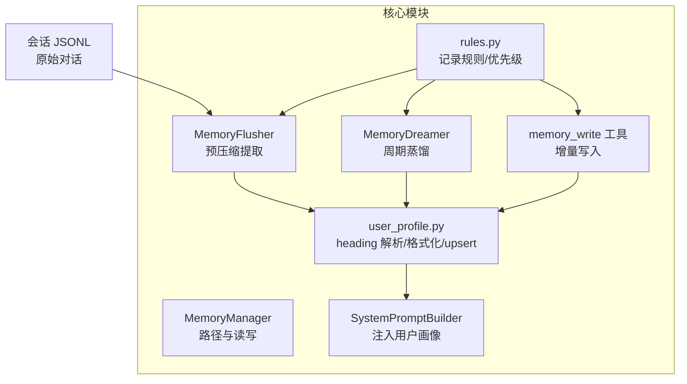
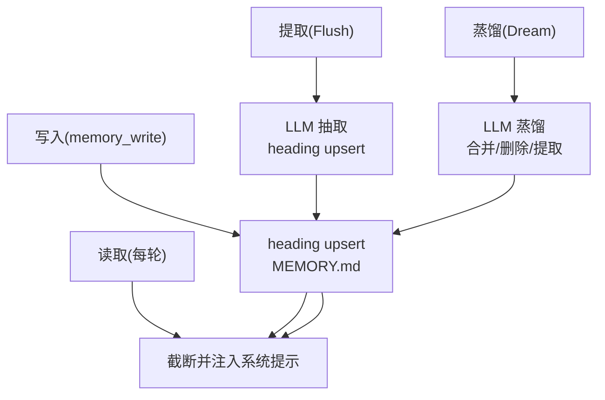
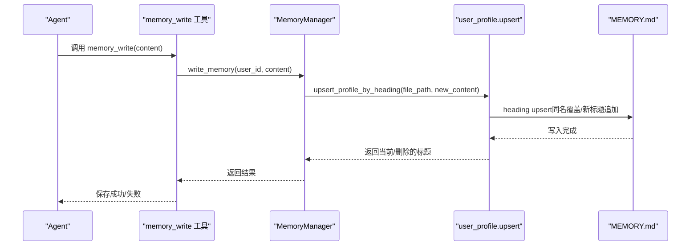
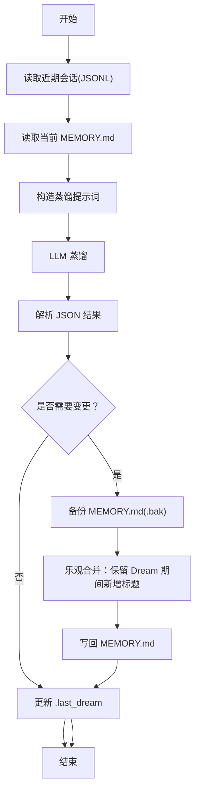
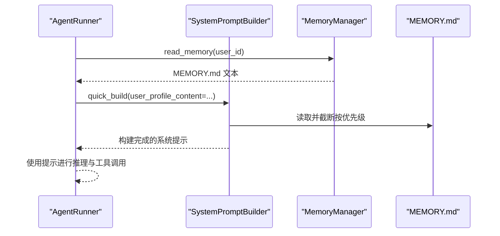
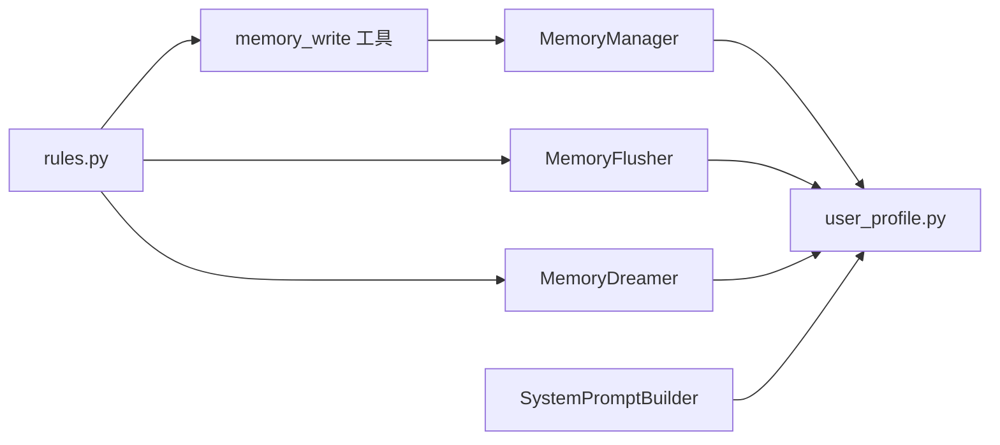

# 用户画像

<cite>
**本文档引用的文件**
- [user_profile.py](file://src/ark_agentic/core/memory/user_profile.py)
- [manager.py](file://src/ark_agentic/core/memory/manager.py)
- [rules.py](file://src/ark_agentic/core/memory/rules.py)
- [extractor.py](file://src/ark_agentic/core/memory/extractor.py)
- [dream.py](file://src/ark_agentic/core/memory/dream.py)
- [memory.py](file://src/ark_agentic/core/tools/memory.py)
- [builder.py](file://src/ark_agentic/core/prompt/builder.py)
- [memory.md](file://docs/core/memory.md)
- [MEMORY.md 示例](file://data/ark_memory/insurance/U001/MEMORY.md)
- [test_user_profile.py](file://tests/unit/core/test_user_profile.py)
- [test_memory_v2_changes.py](file://tests/unit/core/test_memory_v2_changes.py)
- [test_prompt.py](file://tests/unit/core/test_prompt.py)
- [data_service.py](file://src/ark_agentic/agents/insurance/tools/data_service.py)
</cite>

## 目录
1. [简介](#简介)
2. [项目结构](#项目结构)
3. [核心组件](#核心组件)
4. [架构总览](#架构总览)
5. [详细组件分析](#详细组件分析)
6. [依赖关系分析](#依赖关系分析)
7. [性能考量](#性能考量)
8. [故障排查指南](#故障排查指南)
9. [结论](#结论)
10. [附录](#附录)

## 简介
本文件面向 Ark-Agentic 用户画像系统，系统性阐述用户画像的构建机制、数据模型与更新策略。围绕 heading-based markdown 的用户记忆（MEMORY.md）展开，说明从用户交互历史、偏好设置与行为模式中抽取特征、构建个性化档案以及维护动态更新的全流程。同时给出字段定义、权重计算思路、隐私保护与数据安全策略、画像质量评估方法、个性化推荐算法建议与用户体验优化实践。

## 项目结构
用户画像系统位于 core/memory 子模块，采用“原始会话 → 蒸馏记忆 → 系统提示注入”的三层架构，结合 MemoryFlusher、MemoryDreamer 与 MemoryWrite 工具，形成闭环的写入、提取与蒸馏机制。

**图表来源**
- [memory.md:24-40](file://docs/core/memory.md#L24-L40)
- [user_profile.py:21-94](file://src/ark_agentic/core/memory/user_profile.py#L21-L94)
- [manager.py:24-69](file://src/ark_agentic/core/memory/manager.py#L24-L69)
- [extractor.py:98-186](file://src/ark_agentic/core/memory/extractor.py#L98-L186)
- [dream.py:190-322](file://src/ark_agentic/core/memory/dream.py#L190-L322)
- [memory.py:39-108](file://src/ark_agentic/core/tools/memory.py#L39-L108)
- [builder.py:138-151](file://src/ark_agentic/core/prompt/builder.py#L138-L151)
- [rules.py:7-31](file://src/ark_agentic/core/memory/rules.py#L7-L31)

**章节来源**
- [memory.md:1-174](file://docs/core/memory.md#L1-L174)

## 核心组件
- heading-based 用户记忆（MEMORY.md）：以“## 标题 + 内容”的结构存储用户偏好、需求与行为模式，支持同名标题覆盖与 preamble 保护。
- MemoryManager：提供按 user_id 定位的 MEMORY.md 路径与读写接口，封装 heading upsert 语义。
- MemoryFlusher：在上下文压缩前，基于 LLM 将完整对话历史中的长期有效信息抽取为 heading-based markdown 并写入 MEMORY.md。
- MemoryDreamer：周期性读取近期会话与当前 MEMORY.md，通过 LLM 合并、删除过时、提取新信息并进行乐观合并写回。
- memory_write 工具：Agent 在对话中主动保存/更新记忆，遵循记录规则与标题规范。
- SystemPromptBuilder：将 MEMORY.md 内容截断并注入系统提示，作为背景参考，指导工具调用与回复风格。
- 记录规则与优先级：统一“记录/不记录”的判断标准，定义 heading 保留优先级，确保关键信息不丢失。

**章节来源**
- [user_profile.py:1-138](file://src/ark_agentic/core/memory/user_profile.py#L1-L138)
- [manager.py:1-92](file://src/ark_agentic/core/memory/manager.py#L1-L92)
- [extractor.py:1-187](file://src/ark_agentic/core/memory/extractor.py#L1-L187)
- [dream.py:1-323](file://src/ark_agentic/core/memory/dream.py#L1-L323)
- [memory.py:1-114](file://src/ark_agentic/core/tools/memory.py#L1-L114)
- [builder.py:1-328](file://src/ark_agentic/core/prompt/builder.py#L1-L328)
- [rules.py:1-32](file://src/ark_agentic/core/memory/rules.py#L1-L32)

## 架构总览
用户画像生命周期分为四步：写入（对话中）、提取（压缩前）、读取（每轮对话）、蒸馏（周期性）。系统通过 MemoryFlusher 与 MemoryDreamer 在不同阶段抽取与整合信息，最终以 heading-based markdown 形式注入系统提示。

**图表来源**
- [memory.md:59-78](file://docs/core/memory.md#L59-L78)
- [extractor.py:98-186](file://src/ark_agentic/core/memory/extractor.py#L98-L186)
- [dream.py:190-322](file://src/ark_agentic/core/memory/dream.py#L190-L322)
- [builder.py:138-151](file://src/ark_agentic/core/prompt/builder.py#L138-L151)

## 详细组件分析

### 用户画像数据模型与字段定义
- 结构：MEMORY.md 采用 heading-based markdown，首行 preamble（如标题行）永久保留，其余为若干“## 标题 + 内容”的条目。
- 字段类别（示例）：
  - 身份信息：姓名、职业、组织、家庭结构等
  - 风险偏好：风险倾向、可承受波动范围、对本金损失的容忍度
  - 回复风格：简洁、详细、正式、亲切等
  - 持久业务偏好：对产品类型、渠道、操作方式的长期偏好
  - 近期决策与行为模式：近期倾向、决策模式、对成本的认知与取舍
  - 潜在需求：基于对话推断的隐性需求或关注点
- 标题规范：使用通用、简短的一级分类标题，避免过度具体导致重复与碎片化。

**章节来源**
- [user_profile.py:26-63](file://src/ark_agentic/core/memory/user_profile.py#L26-L63)
- [MEMORY.md 示例:1-19](file://data/ark_memory/insurance/U001/MEMORY.md#L1-L19)
- [memory.md:80-104](file://docs/core/memory.md#L80-L104)

### 写入机制与更新策略
- heading upsert：同名标题覆盖，新标题追加，preamble 保留；空内容可触发删除（格式化时会过滤空体）。
- 写入时机：
  - 对话中：Agent 调用 memory_write 工具，遵循记录规则与标题规范。
  - 压缩前：MemoryFlusher 基于 LLM 从完整对话中抽取长期有效信息并写入。
  - 周期蒸馏：MemoryDreamer 读取近期会话与当前 MEMORY.md，合并重复、删除过时、提取新信息并乐观合并写回。
- 并发控制：Dream 期间若有 memory_write 新增标题，apply 阶段通过乐观合并保留这些新标题，避免丢失。

**图表来源**
- [memory.py:39-108](file://src/ark_agentic/core/tools/memory.py#L39-L108)
- [manager.py:45-69](file://src/ark_agentic/core/memory/manager.py#L45-L69)
- [user_profile.py:66-93](file://src/ark_agentic/core/memory/user_profile.py#L66-L93)

**章节来源**
- [memory.py:1-114](file://src/ark_agentic/core/tools/memory.py#L1-L114)
- [manager.py:24-69](file://src/ark_agentic/core/memory/manager.py#L24-L69)
- [user_profile.py:66-93](file://src/ark_agentic/core/memory/user_profile.py#L66-L93)
- [memory.md:122-144](file://docs/core/memory.md#L122-L144)

### 记忆提取与蒸馏流程
- MemoryFlusher：在上下文压缩前，构造提示词，调用 LLM 从完整对话中提取需要长期保存的信息，返回 heading-based markdown 并写入 MEMORY.md。
- MemoryDreamer：周期性读取近期会话与当前 MEMORY.md，通过 LLM 合并相似标题、删除过时信息、提取新信息，再进行乐观合并写回，并更新 .last_dream 时间戳。

**图表来源**
- [dream.py:190-322](file://src/ark_agentic/core/memory/dream.py#L190-L322)
- [extractor.py:98-186](file://src/ark_agentic/core/memory/extractor.py#L98-L186)

**章节来源**
- [extractor.py:41-144](file://src/ark_agentic/core/memory/extractor.py#L41-L144)
- [dream.py:35-322](file://src/ark_agentic/core/memory/dream.py#L35-L322)

### 系统提示注入与个性化应用
- SystemPromptBuilder 将 MEMORY.md 内容作为“背景参考”注入系统提示，避免将其误认为当前指令；同时支持快速构建包含用户画像的提示。
- 注入时会对内容进行 token 截断，优先保留高优先级 heading（如身份信息、回复风格、业务偏好、风险偏好），确保关键偏好始终可见。

**图表来源**
- [builder.py:138-151](file://src/ark_agentic/core/prompt/builder.py#L138-L151)
- [builder.py:275-325](file://src/ark_agentic/core/prompt/builder.py#L275-L325)
- [user_profile.py:96-137](file://src/ark_agentic/core/memory/user_profile.py#L96-L137)

**章节来源**
- [builder.py:138-151](file://src/ark_agentic/core/prompt/builder.py#L138-L151)
- [builder.py:275-325](file://src/ark_agentic/core/prompt/builder.py#L275-L325)
- [user_profile.py:96-137](file://src/ark_agentic/core/memory/user_profile.py#L96-L137)

### 字段定义、权重与优先级
- 字段定义：以 heading 为单位，每个 heading 代表一类用户特征；标题需通用、简短，便于合并与检索。
- 优先级：注入时按“身份信息 > 回复风格 > 业务偏好 > 风险偏好”顺序保留，确保关键偏好优先可见。
- 权重计算：当前实现为“优先级保留 + 截断”，未显式实现数值权重；可在上层业务中引入“偏好强度”作为扩展（例如在 heading 内容中量化程度，或在外部映射表中定义权重）。

**章节来源**
- [rules.py:30-31](file://src/ark_agentic/core/memory/rules.py#L30-L31)
- [user_profile.py:96-137](file://src/ark_agentic/core/memory/user_profile.py#L96-L137)

### 隐私保护与数据安全策略
- 数据隔离：MEMORY.md 按 user_id 分目录存储，不同用户互不干扰。
- 内容最小化：仅记录长期有效信息，短期/一次性信息、公开数据、寒暄等不记录。
- 备份与恢复：蒸馏阶段写入 .bak 备份，失败时可回滚。
- 访问控制：MemoryManager 与 memory_write 工具均需 user_id 上下文，防止误写或越权访问。

**章节来源**
- [manager.py:37-69](file://src/ark_agentic/core/memory/manager.py#L37-L69)
- [memory.py:24-36](file://src/ark_agentic/core/tools/memory.py#L24-L36)
- [dream.py:251-259](file://src/ark_agentic/core/memory/dream.py#L251-L259)

### 画像质量评估方法
- 可靠性：通过单元测试验证 heading 解析/格式化、截断策略、优先级保留与 empty 内容处理。
- 一致性：测试覆盖“空内容不写入”、“同名覆盖”、“preamble 保留”、“优先级截断”等关键行为。
- 可观测性：日志记录写入数量、截断警告、蒸馏变更说明，便于审计与问题定位。

**章节来源**
- [test_user_profile.py:23-191](file://tests/unit/core/test_user_profile.py#L23-L191)
- [test_memory_v2_changes.py:135-170](file://tests/unit/core/test_memory_v2_changes.py#L135-L170)
- [test_prompt.py:191-287](file://tests/unit/core/test_prompt.py#L191-L287)

### 个性化推荐与用户体验优化建议
- 推荐策略（概念性建议）：
  - 特征提取：从 MEMORY.md 中抽取“风险偏好”“业务偏好”“回复风格”等 heading，作为用户画像特征向量。
  - 权重融合：对不同 heading 的重要性赋予权重（如风险偏好权重更高），结合历史交互行为进行加权评分。
  - 排序策略：对候选产品/方案按用户偏好与评分排序，优先展示符合偏好的选项。
  - 交互反馈：允许用户对推荐结果进行反馈（满意/不满意），用于动态调整权重与模型参数。
- 用户体验优化：
  - 简化展示：优先展示“零成本”“不影响保障”等用户明确偏好的选项，减少认知负担。
  - 一致性：严格遵循用户回复风格与沟通偏好，提升交互舒适度。
  - 透明度：在展示推荐理由时，标注依据的偏好来源（如“基于您对零成本的偏好”）。

[本节为概念性建议，不直接分析具体文件]

## 依赖关系分析
用户画像系统内部模块耦合度低，职责清晰：MemoryManager 与 user_profile.py 提供基础读写能力；MemoryFlusher 与 MemoryDreamer 分别负责压缩前提取与周期蒸馏；memory_write 工具与 SystemPromptBuilder 分别负责写入与注入；rules.py 提供统一的记录规则与优先级。

**图表来源**
- [manager.py:24-69](file://src/ark_agentic/core/memory/manager.py#L24-L69)
- [user_profile.py:66-93](file://src/ark_agentic/core/memory/user_profile.py#L66-L93)
- [extractor.py:98-186](file://src/ark_agentic/core/memory/extractor.py#L98-L186)
- [dream.py:190-322](file://src/ark_agentic/core/memory/dream.py#L190-L322)
- [memory.py:39-108](file://src/ark_agentic/core/tools/memory.py#L39-L108)
- [builder.py:138-151](file://src/ark_agentic/core/prompt/builder.py#L138-L151)
- [rules.py:7-31](file://src/ark_agentic/core/memory/rules.py#L7-L31)

**章节来源**
- [manager.py:1-92](file://src/ark_agentic/core/memory/manager.py#L1-L92)
- [user_profile.py:1-138](file://src/ark_agentic/core/memory/user_profile.py#L1-L138)
- [extractor.py:1-187](file://src/ark_agentic/core/memory/extractor.py#L1-L187)
- [dream.py:1-323](file://src/ark_agentic/core/memory/dream.py#L1-L323)
- [memory.py:1-114](file://src/ark_agentic/core/tools/memory.py#L1-L114)
- [builder.py:1-328](file://src/ark_agentic/core/prompt/builder.py#L1-L328)
- [rules.py:1-32](file://src/ark_agentic/core/memory/rules.py#L1-L32)

## 性能考量
- Token 截断：在注入系统提示前对 MEMORY.md 进行 token 截断，优先保留高优先级 heading，避免超限。
- LLM 调用：MemoryFlusher 与 MemoryDreamer 仅在必要时触发，减少不必要的大文本处理。
- 文件 I/O：heading upsert 为小范围写入，避免全量重写；.bak 备份在磁盘空间充足时进行，失败可忽略但不影响主流程。
- 并发合并：乐观合并策略降低锁竞争，提高吞吐。

[本节为通用性能讨论，不直接分析具体文件]

## 故障排查指南
- 写入失败：检查 memory_write 的 content 是否包含 heading（如“## 回复风格\n简洁”），否则会被视为无效内容。
- 截断异常：若 MEMORY.md 被截断，系统会记录警告日志，检查 heading 数量与长度，适当调整优先级或减少非关键 heading。
- 蒸馏失败：若 LLM 返回非 JSON，系统会记录调试日志；检查提示词与上下文长度，确保不超过 token 预算。
- 并发冲突：Dream 期间若有 memory_write 新增标题，apply 阶段会保留这些标题；若出现异常，检查 .bak 是否存在以及写入权限。

**章节来源**
- [memory.py:73-108](file://src/ark_agentic/core/tools/memory.py#L73-L108)
- [user_profile.py:132-137](file://src/ark_agentic/core/memory/user_profile.py#L132-L137)
- [extractor.py:134-143](file://src/ark_agentic/core/memory/extractor.py#L134-L143)
- [dream.py:251-259](file://src/ark_agentic/core/memory/dream.py#L251-L259)

## 结论
Ark-Agentic 用户画像系统以 heading-based markdown 为核心数据模型，通过 MemoryManager、MemoryFlusher、MemoryDreamer 与 memory_write 工具形成完整的写入、提取与蒸馏闭环。结合 SystemPromptBuilder 的注入机制，系统能够在每轮对话中尊重并应用用户偏好，实现个性化与一致性的平衡。通过严格的记录规则、优先级保留与备份合并策略，系统在保证隐私与安全的同时，提供了良好的可维护性与可观测性。

## 附录

### 代码示例路径（不含具体代码内容）
- heading 解析与格式化
  - [parse_heading_sections:26-54](file://src/ark_agentic/core/memory/user_profile.py#L26-L54)
  - [format_heading_sections:57-63](file://src/ark_agentic/core/memory/user_profile.py#L57-L63)
- heading upsert 与截断
  - [upsert_profile_by_heading:66-93](file://src/ark_agentic/core/memory/user_profile.py#L66-L93)
  - [truncate_profile:96-137](file://src/ark_agentic/core/memory/user_profile.py#L96-L137)
- 写入与读取
  - [MemoryManager.write_memory:45-69](file://src/ark_agentic/core/memory/manager.py#L45-L69)
  - [MemoryManager.read_memory:41-43](file://src/ark_agentic/core/memory/manager.py#L41-L43)
- 记忆提取与蒸馏
  - [MemoryFlusher.flush/save:108-150](file://src/ark_agentic/core/memory/extractor.py#L108-L150)
  - [MemoryDreamer.run/apply:289-322](file://src/ark_agentic/core/memory/dream.py#L289-L322)
- 系统提示注入
  - [SystemPromptBuilder.add_memory_context:138-151](file://src/ark_agentic/core/prompt/builder.py#L138-L151)
  - [SystemPromptBuilder.quick_build:275-325](file://src/ark_agentic/core/prompt/builder.py#L275-L325)
- 记录规则与优先级
  - [MEMORY_FILTER_RULES/HEADING_PRIORITY:7-31](file://src/ark_agentic/core/memory/rules.py#L7-L31)