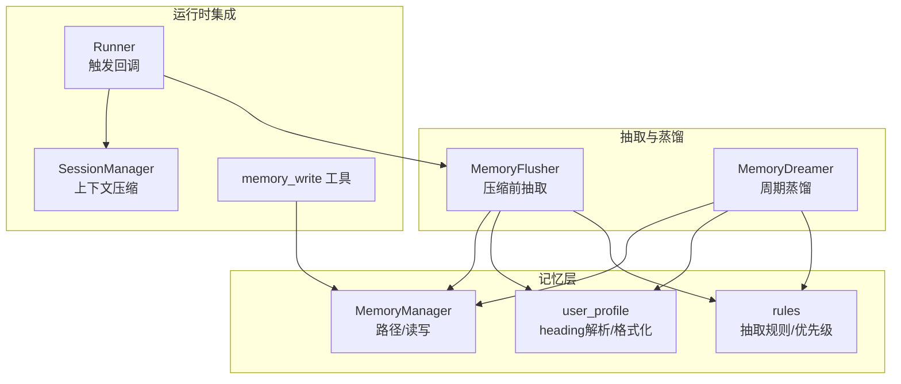
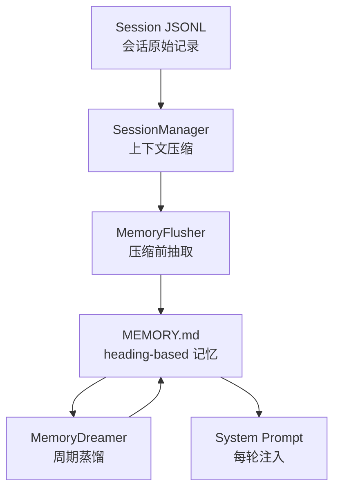
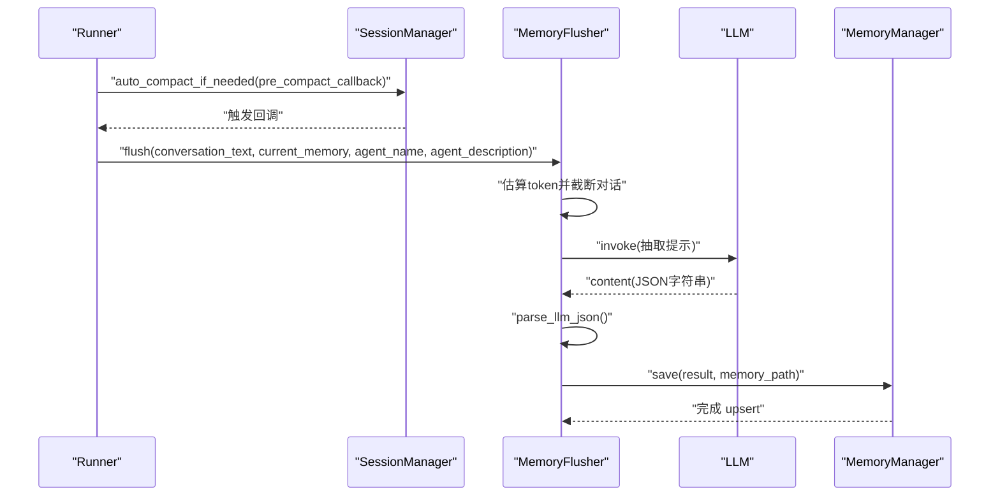
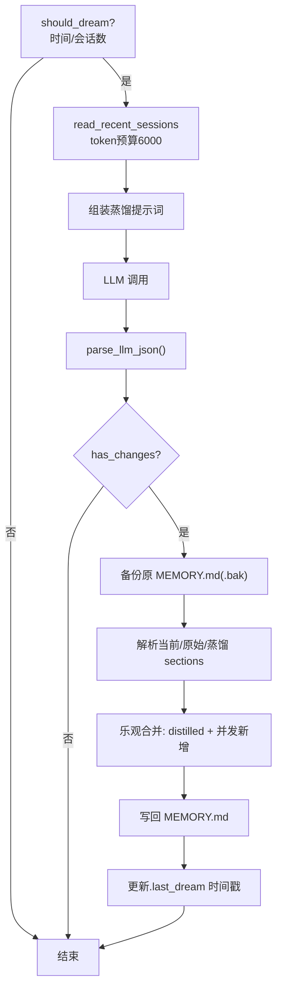
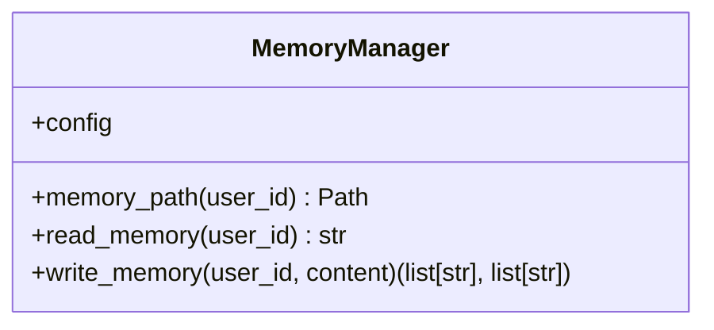
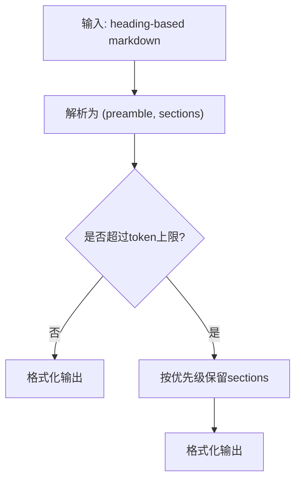
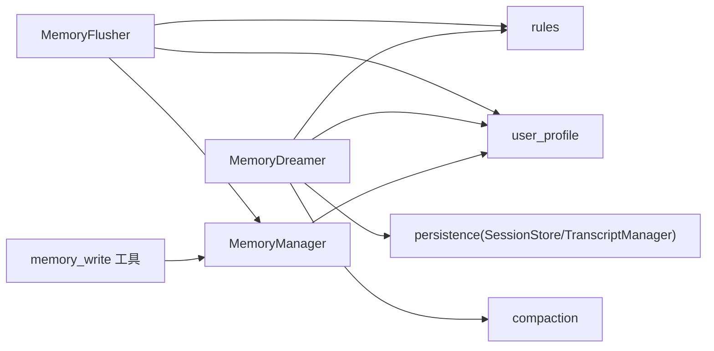

# 记忆抽取器

<cite>
**本文引用的文件**
- [extractor.py](file://src/ark_agentic/core/memory/extractor.py)
- [dream.py](file://src/ark_agentic/core/memory/dream.py)
- [manager.py](file://src/ark_agentic/core/memory/manager.py)
- [user_profile.py](file://src/ark_agentic/core/memory/user_profile.py)
- [rules.py](file://src/ark_agentic/core/memory/rules.py)
- [memory.py](file://src/ark_agentic/core/tools/memory.py)
- [runner.py](file://src/ark_agentic/core/runner.py)
- [session.py](file://src/ark_agentic/core/session.py)
- [types.py](file://src/ark_agentic/core/types.py)
- [test_memory_e2e.py](file://tests/e2e/test_memory_e2e.py)
- [memory.md](file://docs/core/memory.md)
- [README.md](file://README.md)
</cite>

## 目录
1. [简介](#简介)
2. [项目结构](#项目结构)
3. [核心组件](#核心组件)
4. [架构总览](#架构总览)
5. [详细组件分析](#详细组件分析)
6. [依赖分析](#依赖分析)
7. [性能考量](#性能考量)
8. [故障排查指南](#故障排查指南)
9. [结论](#结论)
10. [附录](#附录)

## 简介
本文件面向 Ark-Agentic 记忆抽取器，系统性阐述其工作原理、抽取策略、数据转换机制与质量保障方法。重点包括：
- 从对话历史、工具调用结果与系统事件中提取有价值记忆的策略
- 抽取规则配置与上下文感知抽取流程
- 关键信息提取算法与记忆格式标准化过程
- 抽取质量评估方法、性能监控指标与调试技巧

## 项目结构
围绕记忆抽取器的关键模块如下：
- 抽取与蒸馏：MemoryFlusher（压缩前抽取）、MemoryDreamer（周期蒸馏）
- 存储与格式：MemoryManager（路径与读写）、heading-based markdown 解析/格式化、规则与优先级
- 工具接口：memory_write 工具（主动写入）
- 生命周期集成：Runner 与 SessionManager 在压缩前触发抽取

**图表来源**
- [extractor.py:98-186](file://src/ark_agentic/core/memory/extractor.py#L98-L186)
- [dream.py:190-323](file://src/ark_agentic/core/memory/dream.py#L190-L323)
- [manager.py:24-92](file://src/ark_agentic/core/memory/manager.py#L24-L92)
- [user_profile.py:26-138](file://src/ark_agentic/core/memory/user_profile.py#L26-L138)
- [rules.py:7-32](file://src/ark_agentic/core/memory/rules.py#L7-L32)
- [memory.py:39-114](file://src/ark_agentic/core/tools/memory.py#L39-L114)
- [runner.py:473-487](file://src/ark_agentic/core/runner.py#L473-L487)
- [session.py:24-37](file://src/ark_agentic/core/session.py#L24-L37)

**章节来源**
- [memory.md:9-20](file://docs/core/memory.md#L9-L20)
- [README.md:524-531](file://README.md#L524-L531)

## 核心组件
- MemoryFlusher：在上下文压缩前，基于 LLM 将完整对话历史中的“长期有效”信息抽取为 heading-based markdown，并写入 MEMORY.md
- MemoryDreamer：周期性读取近期会话与当前记忆，通过一次 LLM 调用进行合并、去重、删除过时信息与提取新信息，采用乐观合并回写
- MemoryManager：提供按 user_id 的 MEMORY.md 路径管理与 heading-level upsert 写入
- user_profile：提供 heading-based markdown 的解析、格式化与截断策略
- rules：统一的抽取规则与 heading 优先级
- memory_write 工具：Agent 主动增量写入记忆，支持同名覆盖与空内容删除
- Runner/SessionManager：在自动压缩时注册 pre_compact 回调，触发 MemoryFlusher

**章节来源**
- [extractor.py:98-186](file://src/ark_agentic/core/memory/extractor.py#L98-L186)
- [dream.py:190-323](file://src/ark_agentic/core/memory/dream.py#L190-L323)
- [manager.py:24-92](file://src/ark_agentic/core/memory/manager.py#L24-L92)
- [user_profile.py:26-138](file://src/ark_agentic/core/memory/user_profile.py#L26-L138)
- [rules.py:7-32](file://src/ark_agentic/core/memory/rules.py#L7-L32)
- [memory.py:39-114](file://src/ark_agentic/core/tools/memory.py#L39-L114)
- [runner.py:473-487](file://src/ark_agentic/core/runner.py#L473-L487)
- [session.py:24-37](file://src/ark_agentic/core/session.py#L24-L37)

## 架构总览
记忆系统遵循“原始会话 → 蒸馏记忆 → 注入提示”的三层结构，零数据库依赖，纯文件存储 + LLM 蒸馏。

**图表来源**
- [memory.md:24-41](file://docs/core/memory.md#L24-L41)
- [runner.py:473-487](file://src/ark_agentic/core/runner.py#L473-L487)
- [session.py:24-37](file://src/ark_agentic/core/session.py#L24-L37)
- [extractor.py:98-186](file://src/ark_agentic/core/memory/extractor.py#L98-L186)
- [dream.py:190-323](file://src/ark_agentic/core/memory/dream.py#L190-L323)

## 详细组件分析

### MemoryFlusher：压缩前抽取
- 触发时机：Runner 在自动压缩前注册 pre_compact 回调，调用 MemoryFlusher
- 输入：完整对话文本（过滤系统/工具噪声）、当前 MEMORY.md 内容、智能体名称与职责
- 处理流程：
  - 估算 token 并按阈值截断对话文本
  - 组装抽取提示词（包含规则与上下文）
  - LLM 调用并解析 JSON 输出（支持去除代码块包装）
  - heading-level upsert 写入 MEMORY.md
- 输出：FlushResult（含 memory 字段）

**图表来源**
- [runner.py:473-487](file://src/ark_agentic/core/runner.py#L473-L487)
- [extractor.py:108-186](file://src/ark_agentic/core/memory/extractor.py#L108-L186)
- [manager.py:45-69](file://src/ark_agentic/core/memory/manager.py#L45-L69)

**章节来源**
- [extractor.py:98-186](file://src/ark_agentic/core/memory/extractor.py#L98-L186)
- [runner.py:473-487](file://src/ark_agentic/core/runner.py#L473-L487)

### MemoryDreamer：周期蒸馏
- 触发条件：距离上次 dream ≥ 24h 且新增会话数 ≥ 3
- 输入：当前 MEMORY.md、近期会话摘要（user+assistant 文本，跳过工具噪声）
- 处理流程：
  - 读取近期会话（token 预算 6000），拼接摘要
  - 组装蒸馏提示词（合并/删除/保留/提取规则、容量约束、优先级）
  - LLM 单次调用生成 distilled 与 changes 描述
  - 乐观合并：保留 dream 期间由 memory_write 新增的标题，备份原文件
- 输出：DreamResult（distilled、changes）

**图表来源**
- [dream.py:147-323](file://src/ark_agentic/core/memory/dream.py#L147-L323)
- [user_profile.py:26-138](file://src/ark_agentic/core/memory/user_profile.py#L26-L138)

**章节来源**
- [dream.py:190-323](file://src/ark_agentic/core/memory/dream.py#L190-L323)

### MemoryManager：路径与写入
- 职责：按 user_id 定位 MEMORY.md 路径，提供 read/write 方法
- 写入语义：heading-level upsert（同名覆盖、空内容删除），返回当前与丢弃的标题集合

**图表来源**
- [manager.py:24-92](file://src/ark_agentic/core/memory/manager.py#L24-L92)

**章节来源**
- [manager.py:24-92](file://src/ark_agentic/core/memory/manager.py#L24-L92)

### user_profile：heading-based 解析与格式化
- 解析：将 heading-based markdown 分割为 preamble 与 sections 映射
- 格式化：将 preamble 与 sections 重新组合为 markdown
- 截断：按优先级保留完整 section，避免半句截断

**图表来源**
- [user_profile.py:26-138](file://src/ark_agentic/core/memory/user_profile.py#L26-L138)
- [rules.py:30-31](file://src/ark_agentic/core/memory/rules.py#L30-L31)

**章节来源**
- [user_profile.py:26-138](file://src/ark_agentic/core/memory/user_profile.py#L26-L138)
- [rules.py:30-31](file://src/ark_agentic/core/memory/rules.py#L30-L31)

### rules：抽取规则与优先级
- 记录项：身份信息、沟通风格偏好、持久业务偏好、风险偏好、用户明确要求
- 不记录项：单次操作决策、临时计算/行情数据、寒暄闲聊、未变化内容
- 判断方法：正反例对（例如“这次取 5 万” vs “以后每次都取 5 万”）
- 优先级：身份信息 > 回复风格 > 业务偏好 > 风险偏好

**章节来源**
- [rules.py:7-31](file://src/ark_agentic/core/memory/rules.py#L7-L31)

### memory_write 工具：主动写入
- 参数：content（heading-based markdown 片段）
- 语义：同名覆盖、空内容删除；返回当前与丢弃的标题列表
- 用途：Agent 在用户表达偏好/身份/决策时主动写入

**章节来源**
- [memory.py:39-114](file://src/ark_agentic/core/tools/memory.py#L39-L114)

### Runner/SessionManager 集成
- Runner 在自动压缩时注册 pre_compact 回调，传入 agent 名称与描述、MemoryManager
- SessionManager 在达到压缩阈值时触发回调，MemoryFlusher 读取完整对话并抽取

**章节来源**
- [runner.py:473-487](file://src/ark_agentic/core/runner.py#L473-L487)
- [session.py:24-37](file://src/ark_agentic/core/session.py#L24-L37)

## 依赖分析
- MemoryFlusher 依赖：
  - rules：抽取规则
  - user_profile：heading upsert
  - compaction：token 估算
  - MemoryManager：读取当前记忆、定位文件路径
- MemoryDreamer 依赖：
  - user_profile：heading 解析/格式化
  - rules：抽取规则
  - persistence：SessionStore/TranscriptManager（读取近期会话）
  - compaction：token 估算
- MemoryManager 依赖：
  - user_profile：heading upsert
- memory_write 工具依赖：
  - MemoryManager：写入

**图表来源**
- [extractor.py:16-24](file://src/ark_agentic/core/memory/extractor.py#L16-L24)
- [dream.py:19-26](file://src/ark_agentic/core/memory/dream.py#L19-L26)
- [manager.py:51-68](file://src/ark_agentic/core/memory/manager.py#L51-L68)
- [memory.py:12-17](file://src/ark_agentic/core/tools/memory.py#L12-L17)

**章节来源**
- [extractor.py:16-24](file://src/ark_agentic/core/memory/extractor.py#L16-L24)
- [dream.py:19-26](file://src/ark_agentic/core/memory/dream.py#L19-L26)
- [manager.py:51-68](file://src/ark_agentic/core/memory/manager.py#L51-L68)
- [memory.py:12-17](file://src/ark_agentic/core/tools/memory.py#L12-L17)

## 性能考量
- token 控制
  - MemoryFlusher 对对话文本进行 token 估算与截断（阈值常量）
  - MemoryDreamer 对近期会话摘要设定 token 预算（默认 6000）
  - user_profile.truncate_profile 按优先级保留完整 section，避免截断
- I/O 优化
  - MemoryManager.write_memory 采用 heading-level upsert，减少全量写入
  - MemoryDreamer 写入前先备份（.bak），失败可回滚
- LLM 调用成本
  - MemoryFlusher：单次调用，输出 JSON
  - MemoryDreamer：单次调用，输出 JSON
- 触发频率
  - MemoryFlusher：在自动压缩前触发，频率受上下文窗口与保留策略影响
  - MemoryDreamer：按时间与会话数量门控，避免频繁蒸馏

**章节来源**
- [extractor.py:28-120](file://src/ark_agentic/core/memory/extractor.py#L28-L120)
- [dream.py:99-139](file://src/ark_agentic/core/memory/dream.py#L99-L139)
- [user_profile.py:96-137](file://src/ark_agentic/core/memory/user_profile.py#L96-L137)

## 故障排查指南
- 抽取失败
  - 现象：MemoryFlusher 返回空结果或日志警告
  - 排查：确认 LLM 返回内容是否为合法 JSON（parse_llm_json 支持去除代码块包装）
  - 参考：[extractor.py:75-95](file://src/ark_agentic/core/memory/extractor.py#L75-L95)
- 蒸馏失败
  - 现象：MemoryDreamer 返回空 distilled 或日志警告
  - 排查：检查会话读取是否成功、提示词是否正确、token 估算是否异常
  - 参考：[dream.py:200-234](file://src/ark_agentic/core/memory/dream.py#L200-L234)
- 写入异常
  - 现象：memory_write 返回错误或未写入
  - 排查：确认 content 是否包含 heading、是否传入 user:id、MemoryManager 是否可用
  - 参考：[memory.py:67-108](file://src/ark_agentic/core/tools/memory.py#L67-L108)
- 内存溢出/截断
  - 现象：MEMORY.md 被截断
  - 排查：检查 user_profile.truncate_profile 的优先级与 token 预算
  - 参考：[user_profile.py:96-137](file://src/ark_agentic/core/memory/user_profile.py#L96-L137)
- 端到端验证
  - 使用 e2e 测试验证抽取与注入行为
  - 参考：[test_memory_e2e.py:100-162](file://tests/e2e/test_memory_e2e.py#L100-L162)、[test_memory_e2e.py:164-209](file://tests/e2e/test_memory_e2e.py#L164-L209)、[test_memory_e2e.py:211-260](file://tests/e2e/test_memory_e2e.py#L211-L260)

**章节来源**
- [extractor.py:75-95](file://src/ark_agentic/core/memory/extractor.py#L75-L95)
- [dream.py:200-234](file://src/ark_agentic/core/memory/dream.py#L200-L234)
- [memory.py:67-108](file://src/ark_agentic/core/tools/memory.py#L67-L108)
- [user_profile.py:96-137](file://src/ark_agentic/core/memory/user_profile.py#L96-L137)
- [test_memory_e2e.py:100-162](file://tests/e2e/test_memory_e2e.py#L100-L162)
- [test_memory_e2e.py:164-209](file://tests/e2e/test_memory_e2e.py#L164-L209)
- [test_memory_e2e.py:211-260](file://tests/e2e/test_memory_e2e.py#L211-L260)

## 结论
Ark-Agentic 记忆抽取器通过“压缩前抽取 + 周期蒸馏”的双通道机制，结合统一的抽取规则与 heading-based 格式，实现了从对话历史、工具调用与系统事件中提取长期有效记忆的目标。其设计强调：
- 规则一致：抽取规则与优先级贯穿抽取与蒸馏
- 格式标准：heading-based markdown 确保结构化与可解析性
- 性能稳健：token 估算与截断、备份与乐观合并降低风险
- 易于验证：端到端测试覆盖关键行为

## 附录

### 抽取策略与数据转换要点
- 抽取策略
  - 记录：身份信息、沟通风格偏好、持久业务偏好、风险偏好、用户明确要求
  - 不记录：单次操作决策、临时数据、寒暄、未变化内容
  - 判断：正反例对（如“这次取 5 万” vs “以后每次都取 5 万”）
- 数据转换
  - heading-based markdown：解析/格式化/截断
  - JSON 输出：抽取/蒸馏均要求 LLM 输出 JSON，支持去除代码块包装
  - upsert 语义：同名覆盖、空内容删除

**章节来源**
- [rules.py:7-31](file://src/ark_agentic/core/memory/rules.py#L7-L31)
- [user_profile.py:26-138](file://src/ark_agentic/core/memory/user_profile.py#L26-L138)
- [extractor.py:75-95](file://src/ark_agentic/core/memory/extractor.py#L75-L95)
- [dream.py:224-234](file://src/ark_agentic/core/memory/dream.py#L224-L234)

### 示例：从对话历史中提取记忆
- 场景：用户多次表达偏好与身份信息
- 步骤：
  - Runner 在自动压缩前触发 MemoryFlusher
  - MemoryFlusher 读取完整对话，过滤系统/工具噪声
  - 组装抽取提示词，调用 LLM，解析 JSON
  - heading-level upsert 写入 MEMORY.md
- 验证：端到端测试断言 MEMORY.md 包含提取内容

**章节来源**
- [runner.py:473-487](file://src/ark_agentic/core/runner.py#L473-L487)
- [extractor.py:108-186](file://src/ark_agentic/core/memory/extractor.py#L108-L186)
- [test_memory_e2e.py:100-162](file://tests/e2e/test_memory_e2e.py#L100-L162)

### 示例：从工具调用结果中提取记忆
- 场景：Agent 调用 memory_write 主动写入偏好
- 步骤：
  - Agent 生成 tool_call(memory_write, content)
  - memory_write 工具解析参数，调用 MemoryManager.write_memory
  - heading-level upsert 写入 MEMORY.md
- 验证：端到端测试断言 MEMORY.md 包含写入内容

**章节来源**
- [memory.py:67-108](file://src/ark_agentic/core/tools/memory.py#L67-L108)
- [test_memory_e2e.py:211-260](file://tests/e2e/test_memory_e2e.py#L211-L260)

### 示例：从系统事件中提取记忆
- 场景：周期性触发 MemoryDreamer，合并近期会话与当前记忆
- 步骤：
  - should_dream 判定触发条件
  - read_recent_sessions 读取近期会话摘要
  - 组装蒸馏提示词，调用 LLM，解析 JSON
  - 乐观合并并回写 MEMORY.md
- 验证：端到端测试断言蒸馏后内容符合预期

**章节来源**
- [dream.py:147-323](file://src/ark_agentic/core/memory/dream.py#L147-L323)
- [test_memory_e2e.py:164-209](file://tests/e2e/test_memory_e2e.py#L164-L209)

### 抽取质量评估与监控
- 质量评估
  - 人工抽样：对比抽取前后 MEMORY.md 内容，核对规则一致性
  - 行为回归：端到端测试覆盖抽取、写入、注入与蒸馏
- 监控指标
  - LLM 调用成功率与耗时
  - 抽取/蒸馏输出 JSON 解析成功率
  - MEMORY.md 写入次数与标题变更统计
  - token 估算误差与截断频率

**章节来源**
- [test_memory_e2e.py:100-162](file://tests/e2e/test_memory_e2e.py#L100-L162)
- [test_memory_e2e.py:164-209](file://tests/e2e/test_memory_e2e.py#L164-L209)
- [test_memory_e2e.py:211-260](file://tests/e2e/test_memory_e2e.py#L211-L260)