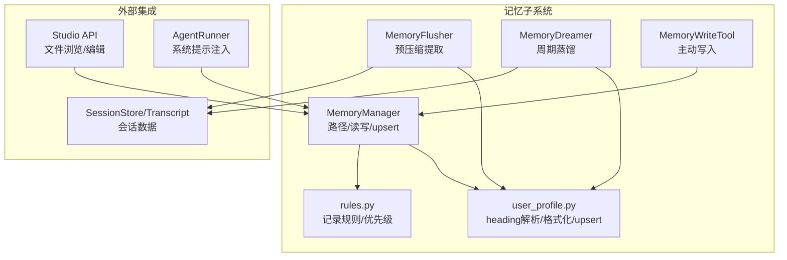
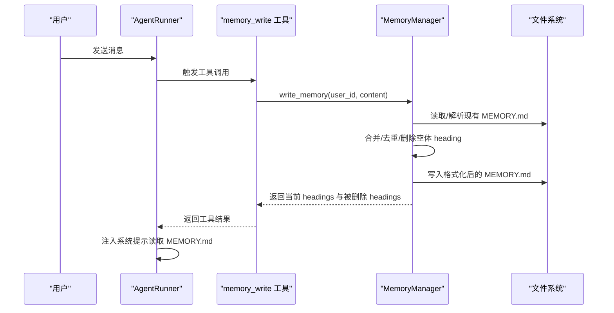
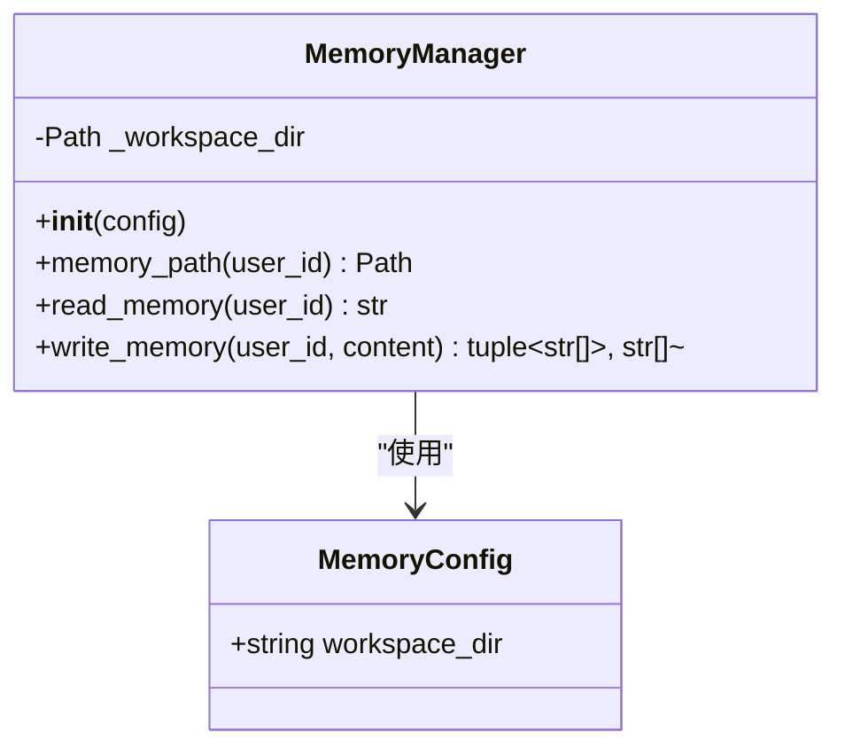
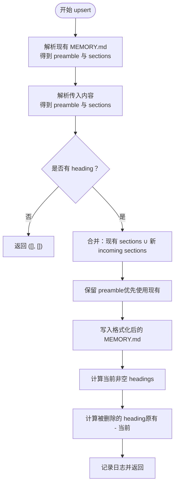
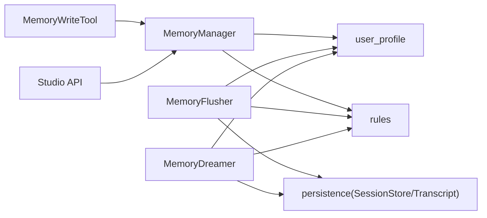
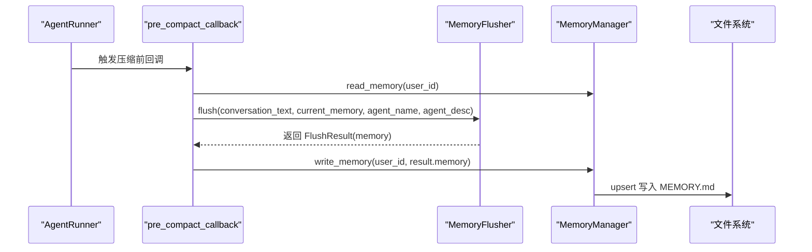

# 记忆管理器

<cite>
**本文档引用的文件**
- [manager.py](file://src/ark_agentic/core/memory/manager.py)
- [user_profile.py](file://src/ark_agentic/core/memory/user_profile.py)
- [rules.py](file://src/ark_agentic/core/memory/rules.py)
- [extractor.py](file://src/ark_agentic/core/memory/extractor.py)
- [dream.py](file://src/ark_agentic/core/memory/dream.py)
- [memory.py（工具）](file://src/ark_agentic/core/tools/memory.py)
- [memory.py（Studio API）](file://src/ark_agentic/studio/api/memory.py)
- [__init__.py（memory 模块）](file://src/ark_agentic/core/memory/__init__.py)
- [types.py](file://src/ark_agentic/core/types.py)
- [persistence.py](file://src/ark_agentic/core/persistence.py)
- [test_memory_e2e.py](file://tests/e2e/test_memory_e2e.py)
- [test_memory_tools.py](file://tests/unit/core/test_memory_tools.py)
- [test_memory_unified.py](file://tests/unit/core/test_memory_unified.py)
</cite>

## 目录
1. [简介](#简介)
2. [项目结构](#项目结构)
3. [核心组件](#核心组件)
4. [架构总览](#架构总览)
5. [详细组件分析](#详细组件分析)
6. [依赖关系分析](#依赖关系分析)
7. [性能考量](#性能考量)
8. [故障排查指南](#故障排查指南)
9. [结论](#结论)
10. [附录](#附录)

## 简介
本文件面向 Ark-Agentic 记忆管理器，聚焦 MemoryManager 类的设计架构、配置管理、文件路径管理与读写操作机制。文档深入解释 heading-level upsert 的工作原理、用户 ID 到文件路径映射规则、内存中缓存策略与文件系统安全考虑，并提供配置项说明、错误处理机制与性能优化建议。读者可据此理解从会话到记忆再到系统提示词注入的完整生命周期。

## 项目结构
记忆子系统围绕“单文件 per 用户”的设计展开，核心文件如下：
- manager.py：MemoryManager 负责路径解析、读写与 upsert 逻辑
- user_profile.py：heading-based 解析/格式化、profile upsert、截断
- rules.py：统一的记忆记录规则与优先级
- extractor.py：预压缩阶段的记忆提取器，将对话历史提炼为 heading-based 内容
- dream.py：周期性记忆蒸馏（LLM 驱动），合并/删除/保留偏好
- tools/memory.py：memory_write 工具，供 Agent 主动写入记忆
- studio/api/memory.py：Studio 管理界面的内存文件浏览与编辑接口
- tests/*：端到端与单元测试，验证 upsert、注入、工具行为等

图表来源
- [manager.py:24-92](file://src/ark_agentic/core/memory/manager.py#L24-L92)
- [user_profile.py:26-94](file://src/ark_agentic/core/memory/user_profile.py#L26-L94)
- [rules.py:7-32](file://src/ark_agentic/core/memory/rules.py#L7-L32)
- [extractor.py:98-187](file://src/ark_agentic/core/memory/extractor.py#L98-L187)
- [dream.py:190-323](file://src/ark_agentic/core/memory/dream.py#L190-L323)
- [memory.py（工具）:39-114](file://src/ark_agentic/core/tools/memory.py#L39-L114)
- [memory.py（Studio API）:105-160](file://src/ark_agentic/studio/api/memory.py#L105-L160)

章节来源
- [__init__.py（memory 模块）:1-12](file://src/ark_agentic/core/memory/__init__.py#L1-L12)

## 核心组件
- MemoryManager：提供用户级 MEMORY.md 的路径解析、读取与 heading-level upsert 写入；支持构建函数以兼容旧签名。
- MemoryConfig：承载 workspace_dir 配置。
- MemoryWriteTool：Agent 主动写入工具，参数校验后委托 MemoryManager 执行 upsert。
- MemoryFlusher：在上下文压缩前，从完整对话中提取需要持久化的 heading-based 内容并写入 MEMORY.md。
- MemoryDreamer：周期性蒸馏，基于 LLM 合并/删除/保留偏好，乐观合并并发写入。
- Studio API：列出/读取/写入内存文件，含路径穿越防护。
- 规则与优先级：统一的记录规则与 heading 保留优先级，确保一致性。

章节来源
- [manager.py:18-92](file://src/ark_agentic/core/memory/manager.py#L18-L92)
- [memory.py（工具）:39-114](file://src/ark_agentic/core/tools/memory.py#L39-L114)
- [extractor.py:98-187](file://src/ark_agentic/core/memory/extractor.py#L98-L187)
- [dream.py:190-323](file://src/ark_agentic/core/memory/dream.py#L190-L323)
- [memory.py（Studio API）:105-160](file://src/ark_agentic/studio/api/memory.py#L105-L160)
- [rules.py:7-32](file://src/ark_agentic/core/memory/rules.py#L7-L32)

## 架构总览
记忆系统的生命周期：Session JSONL（原始）→ MEMORY.md（蒸馏）→ System Prompt（消费）。

图表来源
- [memory.py（工具）:67-109](file://src/ark_agentic/core/tools/memory.py#L67-L109)
- [manager.py:45-69](file://src/ark_agentic/core/memory/manager.py#L45-L69)

## 详细组件分析

### MemoryManager 设计与实现
- 职责
  - 将 user_id 映射到 {workspace}/{user_id}/MEMORY.md
  - 提供 read_memory 与 write_memory 接口
  - 支持构建函数 build_memory_manager，兼容旧签名
- 路径规则
  - 用户文件：{workspace}/{user_id}/MEMORY.md
  - 全局文件扫描：{workspace}/MEMORY.md 与 {workspace}/memory/*.md
- 读写机制
  - read_memory：若文件不存在返回空字符串
  - write_memory：heading-level upsert，空内容删除对应 heading，返回当前 headings 与被删除 headings
- 缓存策略
  - 无内存缓存：每次读写均访问文件系统，保证一致性但增加 IO
- 安全性
  - Studio API 对路径进行解析与穿越检测
  - 构建函数确保 workspace 存在，避免意外目录创建

图表来源
- [manager.py:18-92](file://src/ark_agentic/core/memory/manager.py#L18-L92)

章节来源
- [manager.py:24-92](file://src/ark_agentic/core/memory/manager.py#L24-L92)
- [memory.py（Studio API）:83-88](file://src/ark_agentic/studio/api/memory.py#L83-L88)
- [__init__.py（memory 模块）:6-11](file://src/ark_agentic/core/memory/__init__.py#L6-L11)

### heading-level upsert 机制
- 解析与格式化
  - parse_heading_sections：将文本拆分为 preamble 与 {heading: content} 映射
  - format_heading_sections：将 preamble 与 sections 组合为 heading-based markdown
- upsert 语义
  - 同名 heading 覆盖；空内容删除对应 heading；无 heading 返回空结果
  - 保留 preamble，合并 sections，最终写回
- 并发与乐观合并
  - MemoryDreamer 在蒸馏后采用“备份 + 重新读取 + 保留并发新增”策略，避免丢失用户侧写入

图表来源
- [manager.py:45-69](file://src/ark_agentic/core/memory/manager.py#L45-L69)
- [user_profile.py:26-94](file://src/ark_agentic/core/memory/user_profile.py#L26-L94)

章节来源
- [user_profile.py:26-94](file://src/ark_agentic/core/memory/user_profile.py#L26-L94)
- [manager.py:45-69](file://src/ark_agentic/core/memory/manager.py#L45-L69)

### 用户 ID 到文件路径映射规则
- 用户级 MEMORY.md：{workspace}/{user_id}/MEMORY.md
- 全局扫描：{workspace}/MEMORY.md 与 {workspace}/memory/*.md
- Studio API 使用路径解析与穿越保护，确保仅在 workspace 目录内操作

章节来源
- [manager.py:37-39](file://src/ark_agentic/core/memory/manager.py#L37-L39)
- [memory.py（Studio API）:53-78](file://src/ark_agentic/studio/api/memory.py#L53-L78)
- [memory.py（Studio API）:83-88](file://src/ark_agentic/studio/api/memory.py#L83-L88)

### 配置管理与构建
- MemoryConfig：workspace_dir 字段
- build_memory_manager：默认临时目录，确保目录存在，警告遗留索引目录
- MemoryManager.__init__：接收 MemoryConfig，内部缓存 Path 对象

章节来源
- [manager.py:18-36](file://src/ark_agentic/core/memory/manager.py#L18-L36)
- [manager.py:72-82](file://src/ark_agentic/core/memory/manager.py#L72-L82)

### 读写操作与工具集成
- MemoryWriteTool
  - 参数 content 必填，必须包含 heading（如 "## 标题\n内容"）
  - 空内容删除对应 heading
  - 返回 saved、current_headings、dropped_headings 等元信息
- MemoryFlusher
  - 在上下文压缩前提取 heading-based 内容，写入 MEMORY.md
  - 通过回调在压缩前触发，使用 MemoryManager 读取/写入
- MemoryDreamer
  - 周期性蒸馏，合并/删除/保留偏好，乐观合并并发写入

章节来源
- [memory.py（工具）:39-114](file://src/ark_agentic/core/tools/memory.py#L39-L114)
- [extractor.py:98-187](file://src/ark_agentic/core/memory/extractor.py#L98-L187)
- [dream.py:190-323](file://src/ark_agentic/core/memory/dream.py#L190-L323)

### Studio API 与文件系统安全
- 列出文件：扫描全局 MEMORY.md 与 memory/*.md，以及各用户目录下的 MEMORY.md
- 读取/写入：解析相对路径，进行路径穿越检测，仅允许在 workspace 内部
- 错误处理：文件不存在、路径穿越、Agent 未启用内存等场景返回相应状态码

章节来源
- [memory.py（Studio API）:105-160](file://src/ark_agentic/studio/api/memory.py#L105-L160)
- [memory.py（Studio API）:83-88](file://src/ark_agentic/studio/api/memory.py#L83-L88)

## 依赖关系分析
- MemoryManager 依赖 user_profile 的 heading 解析/格式化
- MemoryFlusher 依赖 rules 与 user_profile，同时依赖会话存储读取最近对话
- MemoryDreamer 依赖 rules、user_profile、会话存储与 LLM
- MemoryWriteTool 依赖 MemoryManager
- Studio API 依赖 MemoryManager 配置与路径解析

图表来源
- [manager.py:51-51](file://src/ark_agentic/core/memory/manager.py#L51-L51)
- [extractor.py:16-24](file://src/ark_agentic/core/memory/extractor.py#L16-L24)
- [dream.py:19-26](file://src/ark_agentic/core/memory/dream.py#L19-L26)
- [memory.py（Studio API）:91-100](file://src/ark_agentic/studio/api/memory.py#L91-L100)

章节来源
- [manager.py:51-51](file://src/ark_agentic/core/memory/manager.py#L51-L51)
- [extractor.py:16-24](file://src/ark_agentic/core/memory/extractor.py#L16-L24)
- [dream.py:19-26](file://src/ark_agentic/core/memory/dream.py#L19-L26)
- [persistence.py:1-200](file://src/ark_agentic/core/persistence.py#L1-L200)

## 性能考量
- IO 模式
  - 无内存缓存，每次读写均访问磁盘，适合小规模部署与一致性优先场景
- heading 解析复杂度
  - O(n) 行遍历，n 为内容行数；upsert 为字典合并，平均 O(k)（k 为 heading 数）
- 截断与蒸馏
  - user_profile.truncate_profile 按优先级保留 heading，避免随机截断
  - MemoryDreamer 限制目标 token 上限，保守合并策略减少无效写入
- 建议
  - 大规模部署可引入内存缓存层（LRU/时间戳失效），结合文件监控增量同步
  - 对频繁写入场景，合并多次 upsert 请求后再落盘
  - 控制会话窗口大小与蒸馏频率，平衡成本与效果

[本节为通用性能讨论，不直接分析具体文件]

## 故障排查指南
- 写入无效果
  - 检查 content 是否包含 heading；无 heading 将被拒绝
  - 确认 user_id 上下文是否提供
- 内容被删除
  - 空内容写入会删除对应 heading
- 路径穿越错误
  - Studio API 返回 403，确认 file_path 在 workspace 目录内
- Agent 未启用内存
  - Studio API 返回空列表或 404，确认 runner._memory_manager 已配置
- 蒸馏未生效
  - 检查 .last_dream 时间戳与会话数量阈值
- 测试验证
  - 使用端到端与单元测试覆盖 upsert、注入、工具行为等关键路径

章节来源
- [memory.py（工具）:73-108](file://src/ark_agentic/core/tools/memory.py#L73-L108)
- [memory.py（Studio API）:135-136](file://src/ark_agentic/studio/api/memory.py#L135-L136)
- [memory.py（Studio API）:95-100](file://src/ark_agentic/studio/api/memory.py#L95-L100)
- [dream.py:147-176](file://src/ark_agentic/core/memory/dream.py#L147-L176)
- [test_memory_e2e.py:100-260](file://tests/e2e/test_memory_e2e.py#L100-L260)
- [test_memory_tools.py:40-163](file://tests/unit/core/test_memory_tools.py#L40-L163)
- [test_memory_unified.py:35-160](file://tests/unit/core/test_memory_unified.py#L35-L160)

## 结论
Ark-Agentic 记忆管理器采用“单文件 per 用户 + heading-based upsert”的极简设计，通过 MemoryManager 统一路径与读写，配合 MemoryWriteTool、MemoryFlusher 与 MemoryDreamer 形成从会话到记忆再到系统提示的闭环。规则与优先级确保记录标准一致，Studio API 提供可视化管理入口。对于大规模部署，建议引入缓存与批量写入策略以提升性能。

[本节为总结性内容，不直接分析具体文件]

## 附录

### 配置选项说明
- MemoryConfig
  - workspace_dir：记忆文件根目录，默认由构建函数设置为临时目录
- build_memory_manager
  - 默认创建目录并警告遗留索引目录（不再使用）

章节来源
- [manager.py:18-36](file://src/ark_agentic/core/memory/manager.py#L18-L36)
- [manager.py:72-92](file://src/ark_agentic/core/memory/manager.py#L72-L92)

### API 一览（Studio）
- GET /agents/{agent_id}/memory/files：列出可发现的内存文件（按用户分组）
- GET /agents/{agent_id}/memory/content：读取指定内存文件内容
- PUT /agents/{agent_id}/memory/content：写入内存文件内容（路径穿越保护）

章节来源
- [memory.py（Studio API）:105-160](file://src/ark_agentic/studio/api/memory.py#L105-L160)

### 关键流程图：预压缩提取到写入

图表来源
- [extractor.py:152-187](file://src/ark_agentic/core/memory/extractor.py#L152-L187)
- [manager.py:45-69](file://src/ark_agentic/core/memory/manager.py#L45-L69)