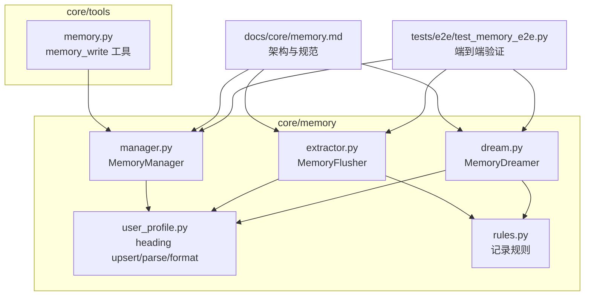
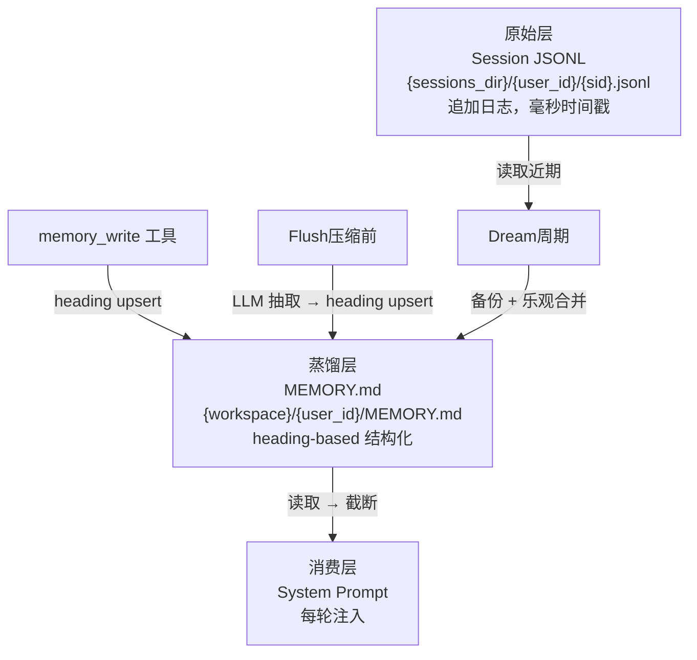
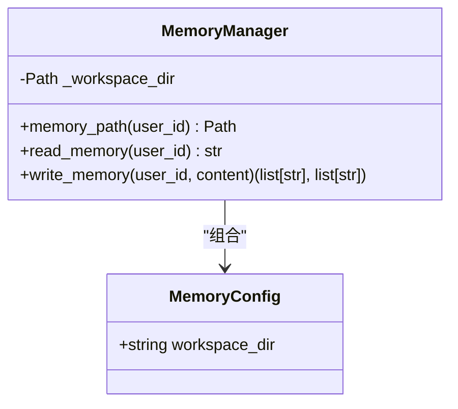
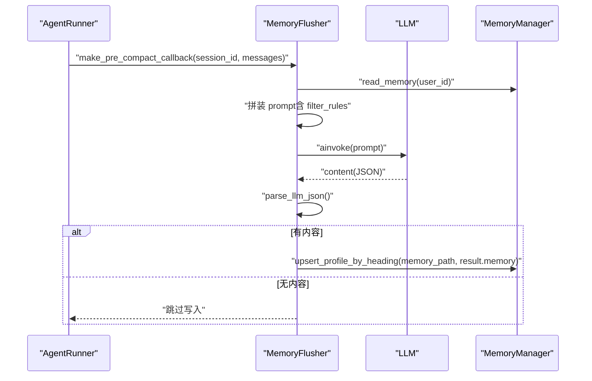
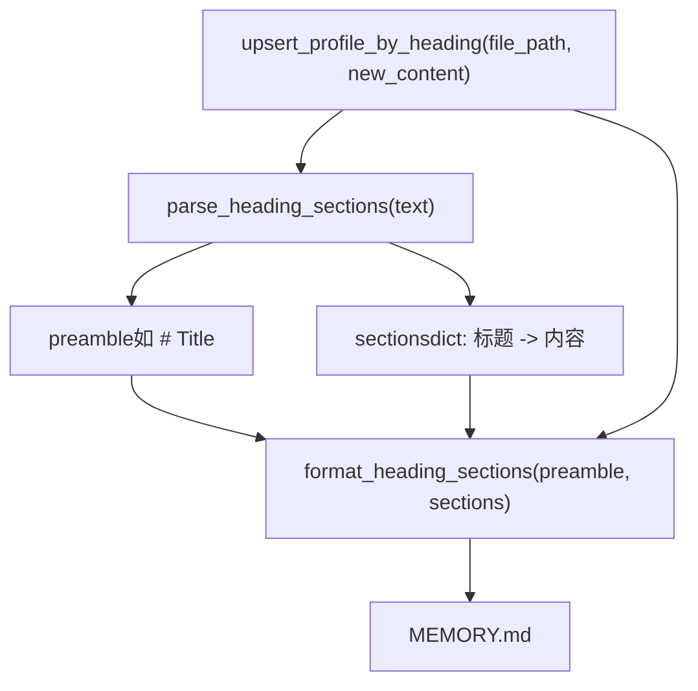
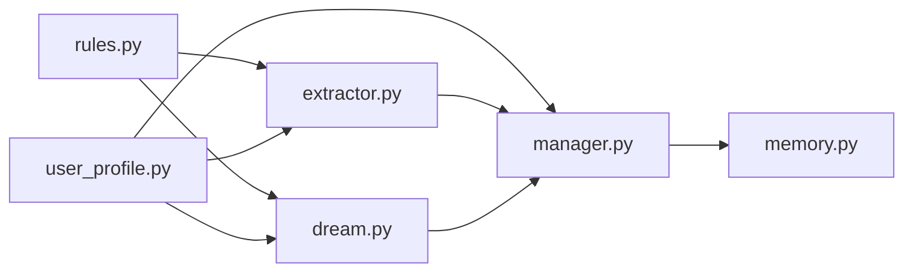

# 记忆系统

<cite>
**本文档引用的文件**
- [manager.py](file://src/ark_agentic/core/memory/manager.py)
- [user_profile.py](file://src/ark_agentic/core/memory/user_profile.py)
- [extractor.py](file://src/ark_agentic/core/memory/extractor.py)
- [dream.py](file://src/ark_agentic/core/memory/dream.py)
- [rules.py](file://src/ark_agentic/core/memory/rules.py)
- [memory.py](file://src/ark_agentic/core/tools/memory.py)
- [memory.md](file://docs/core/memory.md)
- [test_memory_e2e.py](file://tests/e2e/test_memory_e2e.py)
- [paths.py](file://src/ark_agentic/core/paths.py)
- [__init__.py](file://src/ark_agentic/core/memory/__init__.py)
</cite>

## 目录
1. [简介](#简介)
2. [项目结构](#项目结构)
3. [核心组件](#核心组件)
4. [架构总览](#架构总览)
5. [详细组件分析](#详细组件分析)
6. [依赖关系分析](#依赖关系分析)
7. [性能考量](#性能考量)
8. [故障排查指南](#故障排查指南)
9. [结论](#结论)
10. [附录](#附录)

## 简介
本文件面向 Ark-Agentic 记忆系统的使用者与维护者，系统性阐述记忆管理器设计、记忆抽取机制、记忆蒸馏过程与用户画像管理。文档聚焦以下关键点：
- 生命周期模型：Session JSONL（原始）→ MEMORY.md（蒸馏）→ System Prompt（消费）
- 记忆写入、抽取与蒸馏的实现与接口规范
- heading-based 结构化存储与 upsert 语义
- 短期记忆、长期记忆与上下文记忆的区分与转换机制
- 配置指南与性能调优建议

## 项目结构
记忆系统位于 core/memory 与 core/tools 下，并配套文档说明与端到端测试验证。

图表来源
- [manager.py:1-92](file://src/ark_agentic/core/memory/manager.py#L1-L92)
- [user_profile.py:1-138](file://src/ark_agentic/core/memory/user_profile.py#L1-L138)
- [extractor.py:1-187](file://src/ark_agentic/core/memory/extractor.py#L1-L187)
- [dream.py:1-323](file://src/ark_agentic/core/memory/dream.py#L1-L323)
- [rules.py:1-32](file://src/ark_agentic/core/memory/rules.py#L1-L32)
- [memory.py:1-114](file://src/ark_agentic/core/tools/memory.py#L1-L114)
- [memory.md:1-174](file://docs/core/memory.md#L1-L174)
- [test_memory_e2e.py:1-260](file://tests/e2e/test_memory_e2e.py#L1-L260)

章节来源
- [memory.md:1-174](file://docs/core/memory.md#L1-L174)
- [__init__.py:1-12](file://src/ark_agentic/core/memory/__init__.py#L1-L12)

## 核心组件
- MemoryManager：负责按 user_id 定位 MEMORY.md 路径，提供读写便捷方法，作为 runner、tools、extractor 的统一依赖入口。
- MemoryFlusher：在上下文压缩前，基于 LLM 从完整对话历史中抽取需要长期保存的信息，写入 MEMORY.md（heading upsert）。
- MemoryDreamer：周期性读取近期会话与当前记忆，通过单次 LLM 调用进行合并、删除、提取与精简，采用乐观合并写回。
- user_profile：提供 heading-based 解析/格式化、upsert、截断等能力，保证 preamble 与标题的幂等合并。
- rules：统一的“可记录/不可记录”规则与标题优先级，确保三条写入路径一致性。
- memory_write 工具：Agent 主动增量更新用户记忆，遵循 heading upsert 语义。

章节来源
- [manager.py:24-92](file://src/ark_agentic/core/memory/manager.py#L24-L92)
- [extractor.py:98-187](file://src/ark_agentic/core/memory/extractor.py#L98-L187)
- [dream.py:190-323](file://src/ark_agentic/core/memory/dream.py#L190-L323)
- [user_profile.py:26-138](file://src/ark_agentic/core/memory/user_profile.py#L26-L138)
- [rules.py:7-32](file://src/ark_agentic/core/memory/rules.py#L7-L32)
- [memory.py:39-114](file://src/ark_agentic/core/tools/memory.py#L39-L114)

## 架构总览
记忆系统采用“三层”架构：原始层（Session JSONL）、蒸馏层（MEMORY.md）与消费层（System Prompt）。Agent 在每轮对话前从 MEMORY.md 读取并截断注入 system prompt，形成“长期记忆”的稳定上下文。

图表来源
- [memory.md:24-40](file://docs/core/memory.md#L24-L40)
- [manager.py:37-69](file://src/ark_agentic/core/memory/manager.py#L37-L69)
- [extractor.py:108-187](file://src/ark_agentic/core/memory/extractor.py#L108-L187)
- [dream.py:190-323](file://src/ark_agentic/core/memory/dream.py#L190-L323)

## 详细组件分析

### MemoryManager（记忆管理器）
- 职责
  - 按 user_id 定位 MEMORY.md 路径
  - 提供 read_memory / write_memory
  - 统一依赖入口，供 runner、tools、extractor 使用
- 关键行为
  - write_memory：以 heading-level upsert 语义合并，返回当前标题与被删除标题列表
  - build_memory_manager：兼容旧签名，默认工作目录 data/ark_memory 或环境变量 MEMORY_DIR

图表来源
- [manager.py:18-92](file://src/ark_agentic/core/memory/manager.py#L18-L92)

章节来源
- [manager.py:24-92](file://src/ark_agentic/core/memory/manager.py#L24-L92)
- [paths.py:19-24](file://src/ark_agentic/core/paths.py#L19-L24)

### MemoryFlusher（记忆抽取器）
- 触发时机：上下文压缩前
- 输入：完整对话文本、当前 MEMORY.md、Agent 名称与描述
- 处理：估算 token 数，必要时截断对话；构造 prompt；调用 LLM；解析 JSON；写入 heading upsert
- 输出：FlushResult（含 memory 字段）

图表来源
- [extractor.py:108-187](file://src/ark_agentic/core/memory/extractor.py#L108-L187)
- [manager.py:41-69](file://src/ark_agentic/core/memory/manager.py#L41-L69)
- [rules.py:7-32](file://src/ark_agentic/core/memory/rules.py#L7-L32)

章节来源
- [extractor.py:98-187](file://src/ark_agentic/core/memory/extractor.py#L98-L187)
- [rules.py:7-32](file://src/ark_agentic/core/memory/rules.py#L7-L32)

### MemoryDreamer（记忆蒸馏器）
- 触发条件：should_dream（距离上次 ≥ 24 小时 且 近期新增 ≥ 3 个会话）
- 输入：MEMORY.md、近期会话摘要（user+assistant 文本，跳过 tool 噪声，token 预算 6000）
- 处理：单次 LLM 调用，合并重复、删除过时、提取新信息与潜在需求；按优先级截断至 2000 tokens
- 应用：乐观合并（保留 dream 期间新增的标题）+ 备份（.bak）

图表来源
- [dream.py:190-323](file://src/ark_agentic/core/memory/dream.py#L190-L323)
- [rules.py:7-32](file://src/ark_agentic/core/memory/rules.py#L7-L32)

章节来源
- [dream.py:147-323](file://src/ark_agentic/core/memory/dream.py#L147-L323)
- [memory.md:70-79](file://docs/core/memory.md#L70-L79)

### 用户画像与 heading-based 存储
- 存储格式：heading-based markdown（## 标题 + 内容），每个标题代表一个属性
- upsert 语义：同名标题始终覆盖；空内容触发删除；保留 preamble
- 截断策略：按优先级保留（身份信息 > 回复风格 > 业务偏好 > 风险偏好），不破坏标题边界
- 读取注入：每轮对话前从 MEMORY.md 读取并截断，注入 system prompt

图表来源
- [user_profile.py:26-138](file://src/ark_agentic/core/memory/user_profile.py#L26-L138)

章节来源
- [user_profile.py:26-138](file://src/ark_agentic/core/memory/user_profile.py#L26-L138)
- [memory.md:80-121](file://docs/core/memory.md#L80-L121)

### 记忆接口规范
- memory_write 工具
  - 参数：content（heading-based markdown，如 “## 回复风格\n简洁直接”）
  - 语义：同名覆盖；空内容删除；可一次写多个标题
  - 返回：saved、current_headings、dropped_headings（如有）

章节来源
- [memory.py:39-114](file://src/ark_agentic/core/tools/memory.py#L39-L114)

### 数据存储格式与检索策略
- 存储位置：{workspace}/{user_id}/MEMORY.md
- 格式：heading-based markdown，preamble 永远保留
- 检索：每轮对话前读取 → 截断（默认 2000 tokens，按优先级）→ 注入 system prompt
- 并发：dream 期间的 memory_write 新增标题会被乐观保留

章节来源
- [memory.md:42-121](file://docs/core/memory.md#L42-L121)
- [user_profile.py:96-138](file://src/ark_agentic/core/memory/user_profile.py#L96-L138)

### 短期记忆、长期记忆与上下文记忆
- 短期记忆：会话 JSONL 中的即时对话片段（由会话压缩与摘要策略控制）
- 长期记忆：MEMORY.md 中结构化 heading 信息（身份、偏好、需求等）
- 上下文记忆：每轮注入 system prompt 的蒸馏后记忆片段（受 token 限制）
- 转换机制：
  - 写入阶段：memory_write 直接 upsert
  - 压缩阶段：MemoryFlusher 从完整对话抽取并 upsert
  - 周期阶段：MemoryDreamer 合并/删除/提取，乐观合并写回

章节来源
- [memory.md:59-79](file://docs/core/memory.md#L59-L79)

## 依赖关系分析
- 组件耦合
  - MemoryManager 与 user_profile：write_memory 依赖 upsert/profile 解析/格式化
  - MemoryFlusher 与 MemoryManager：flush/save 依赖路径与 upsert
  - MemoryDreamer 与 user_profile：读取/解析/格式化与截断
  - MemoryFlusher/MemoryDreamer 共享 rules：统一记录规则
- 外部依赖
  - LLM 调用：通过工厂函数延迟获取实例
  - 会话存储：SessionStore/TranscriptManager 读取近期会话

图表来源
- [rules.py:7-32](file://src/ark_agentic/core/memory/rules.py#L7-L32)
- [user_profile.py:26-138](file://src/ark_agentic/core/memory/user_profile.py#L26-L138)
- [manager.py:41-69](file://src/ark_agentic/core/memory/manager.py#L41-L69)
- [extractor.py:108-187](file://src/ark_agentic/core/memory/extractor.py#L108-L187)
- [dream.py:190-323](file://src/ark_agentic/core/memory/dream.py#L190-L323)
- [memory.py:39-114](file://src/ark_agentic/core/tools/memory.py#L39-L114)

## 性能考量
- Token 预算
  - Flush 前对话截断：最大 6000 tokens
  - Dream 截断：目标上限 2000 tokens，按优先级保留
- I/O 优化
  - heading-level upsert：仅变更部分写入，减少磁盘写放大
  - 乐观合并：先备份（.bak），再重读当前状态，避免并发丢失
- 并发控制
  - 同一用户（dream 与 memory_write 竞态）：通过乐观合并与 .bak 保证一致性
- 配置建议
  - MEMORY_DIR 环境变量：统一内存目录，便于迁移与运维
  - sessions_dir：合理设置会话窗口与摘要策略，降低 flush 与 dream 的负担

章节来源
- [extractor.py:28-120](file://src/ark_agentic/core/memory/extractor.py#L28-L120)
- [dream.py:196-235](file://src/ark_agentic/core/memory/dream.py#L196-L235)
- [user_profile.py:96-138](file://src/ark_agentic/core/memory/user_profile.py#L96-L138)
- [paths.py:19-24](file://src/ark_agentic/core/paths.py#L19-L24)

## 故障排查指南
- 写入无效
  - 确认 content 包含 heading（如 “## 回复风格\n简洁”）
  - 检查返回的 current_headings 是否为空
- LLM 返回非 JSON
  - flush/dream 的响应解析失败时会记录调试日志，确认 prompt 与模型输出格式
- 并发冲突
  - 检查 .bak 是否存在；确认乐观合并是否保留了 dream 期间新增标题
- 旧版索引目录
  - 启动时若出现 .memory 目录警告，可安全删除

章节来源
- [memory.py:73-108](file://src/ark_agentic/core/tools/memory.py#L73-L108)
- [extractor.py:134-144](file://src/ark_agentic/core/memory/extractor.py#L134-L144)
- [dream.py:242-288](file://src/ark_agentic/core/memory/dream.py#L242-L288)
- [manager.py:84-92](file://src/ark_agentic/core/memory/manager.py#L84-L92)

## 结论
Ark-Agentic 记忆系统以“零数据库依赖”的纯文件存储 + LLM 蒸馏为核心，通过 heading-based 结构化与 upsert 语义，实现了稳定、可追踪、可演进的用户长期记忆。结合 flush 与 dream 的双通道记忆管理，系统在保证一致性的同时兼顾性能与可维护性。建议在生产环境中配合合理的 token 预算、并发控制与监控告警，持续优化记忆质量与成本。

## 附录

### 配置指南
- 目录配置
  - MEMORY_DIR：记忆工作目录（默认 data/ark_memory）
  - SESSIONS_DIR：会话目录（默认 data/ark_sessions）
- 初始化示例
  - 使用 build_memory_manager 指定工作目录
  - 在 AgentRunner 中注入 memory_manager

章节来源
- [paths.py:19-24](file://src/ark_agentic/core/paths.py#L19-L24)
- [memory.md:146-158](file://docs/core/memory.md#L146-L158)

### 端到端验证要点
- 压缩触发 flush：上下文压缩后应写入 MEMORY.md
- 每轮注入：MEMORY.md 内容应出现在 system prompt
- memory_write 工具：Agent 调用后应持久化并返回 saved=true

章节来源
- [test_memory_e2e.py:100-260](file://tests/e2e/test_memory_e2e.py#L100-L260)