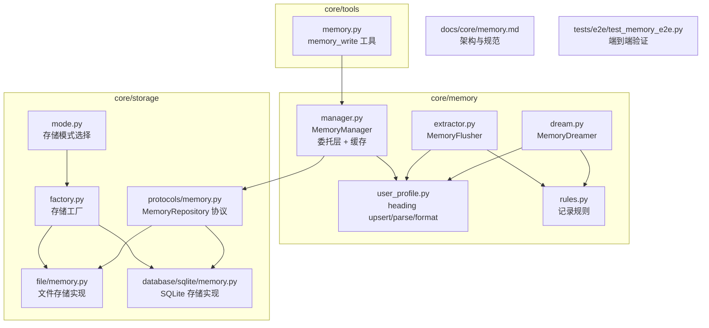
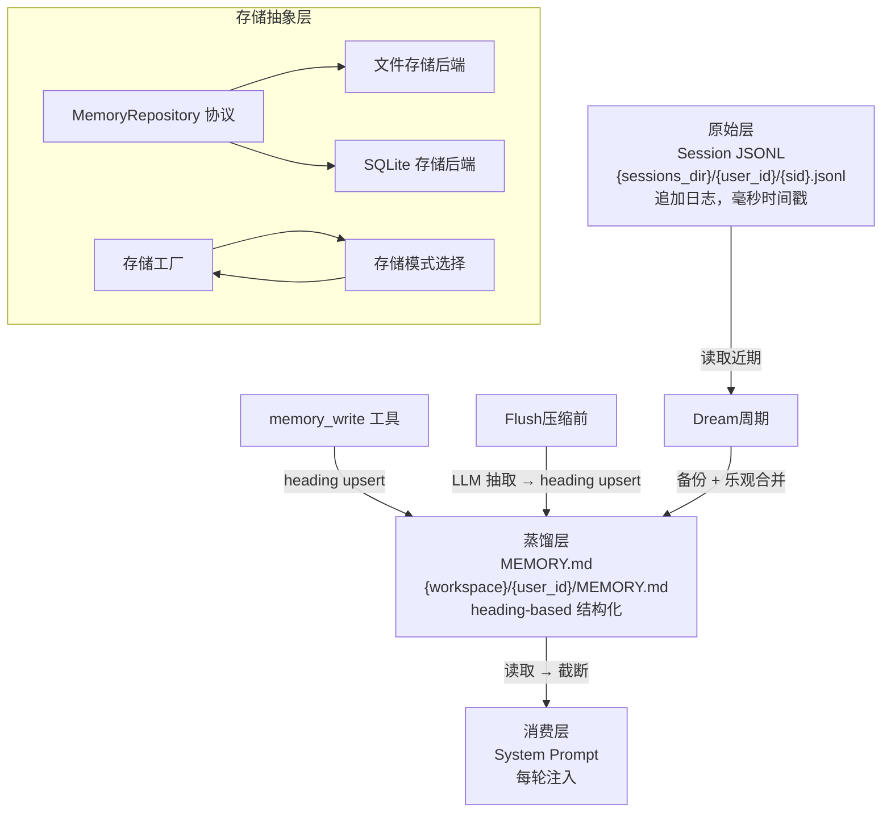
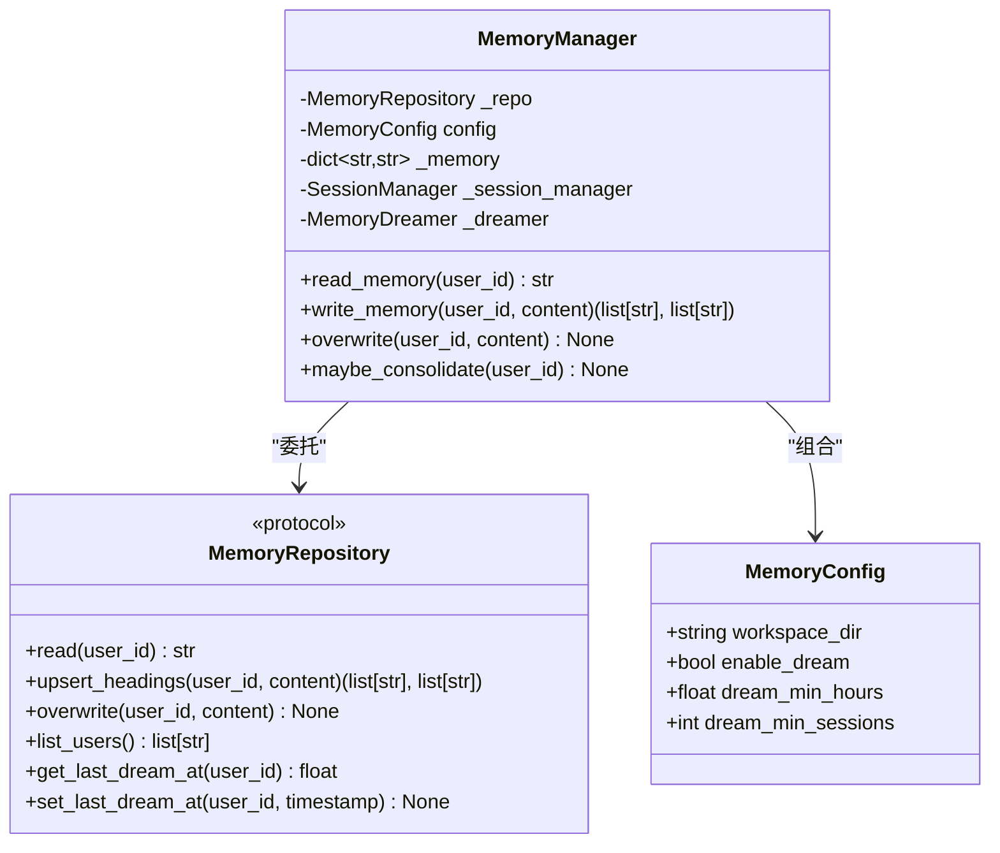
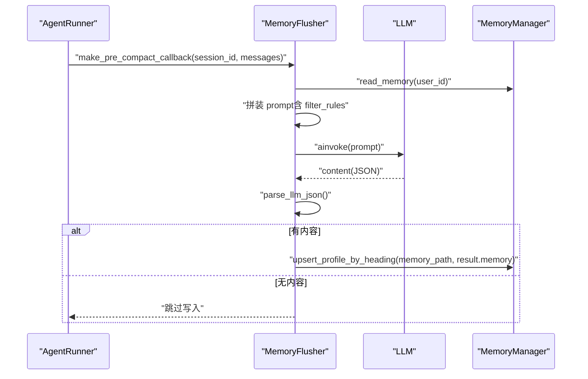
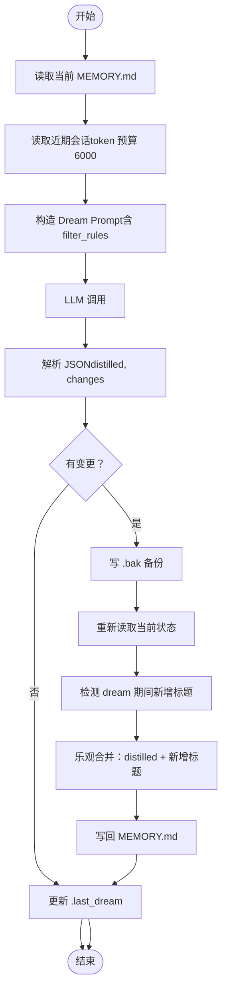
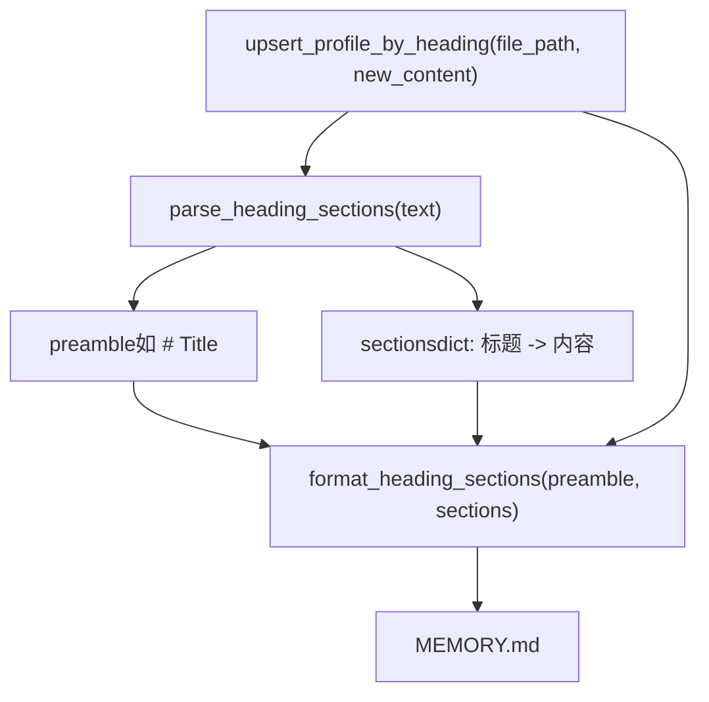
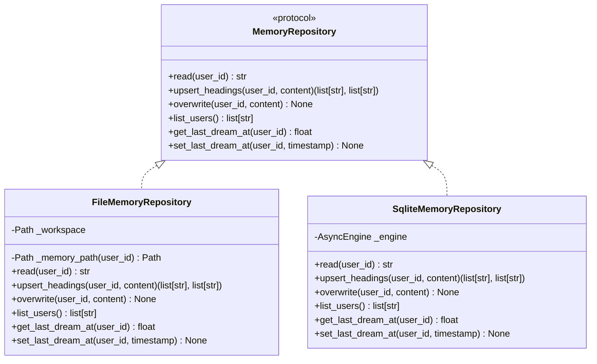
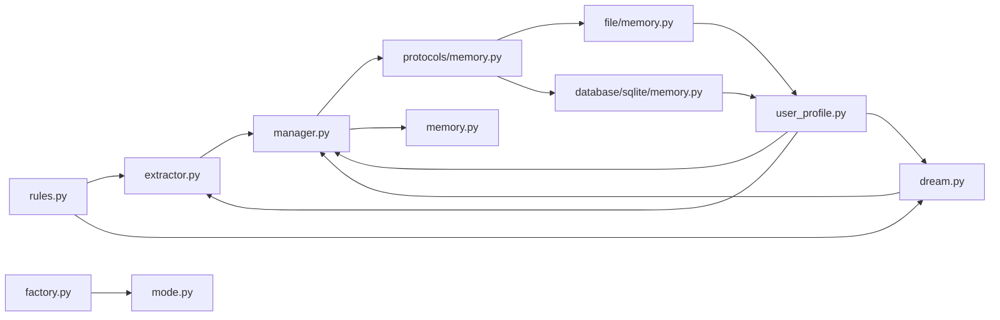

# 记忆系统

<cite>
**本文档引用的文件**
- [manager.py](file://src/ark_agentic/core/memory/manager.py)
- [user_profile.py](file://src/ark_agentic/core/memory/user_profile.py)
- [extractor.py](file://src/ark_agentic/core/memory/extractor.py)
- [dream.py](file://src/ark_agentic/core/memory/dream.py)
- [rules.py](file://src/ark_agentic/core/memory/rules.py)
- [memory.py](file://src/ark_agentic/core/tools/memory.py)
- [memory.md](file://docs/core/memory.md)
- [test_memory_e2e.py](file://tests/e2e/test_memory_e2e.py)
- [paths.py](file://src/ark_agentic/core/paths.py)
- [__init__.py](file://src/ark_agentic/core/memory/__init__.py)
- [factory.py](file://src/ark_agentic/core/storage/factory.py)
- [memory.py](file://src/ark_agentic/core/storage/protocols/memory.py)
- [memory.py](file://src/ark_agentic/core/storage/file/memory.py)
- [memory.py](file://src/ark_agentic/core/storage/database/sqlite/memory.py)
- [mode.py](file://src/ark_agentic/core/storage/mode.py)
</cite>

## 更新摘要
**所做更改**
- 更新了存储抽象层架构，包括新的 MemoryRepository 协议和存储后端实现
- 重构了 MemoryManager 设计，引入委托层模式和进程内活跃用户缓存
- 新增了存储模式选择机制（DB_TYPE 环境变量驱动）
- 更新了文件存储和 SQLite 存储的具体实现细节
- 增强了内存管理器的配置选项和功能

## 目录
1. [简介](#简介)
2. [项目结构](#项目结构)
3. [核心组件](#核心组件)
4. [架构总览](#架构总览)
5. [详细组件分析](#详细组件分析)
6. [存储抽象层](#存储抽象层)
7. [依赖关系分析](#依赖关系分析)
8. [性能考量](#性能考量)
9. [故障排查指南](#故障排查指南)
10. [结论](#结论)
11. [附录](#附录)

## 简介
本文件面向 Ark-Agentic 记忆系统的使用者与维护者，系统性阐述记忆管理器设计、记忆抽取机制、记忆蒸馏过程与用户画像管理。文档聚焦以下关键点：
- 生命周期模型：Session JSONL（原始）→ MEMORY.md（蒸馏）→ System Prompt（消费）
- 记忆写入、抽取与蒸馏的实现与接口规范
- heading-based 结构化存储与 upsert 语义
- 短期记忆、长期记忆与上下文记忆的区分与转换机制
- 配置指南与性能调优建议
- **新增**：存储抽象层支持多种后端（文件系统、SQLite）

## 项目结构
记忆系统位于 core/memory 与 core/tools 下，并配套文档说明与端到端测试验证。**更新后**，系统引入了存储抽象层，支持多种存储后端。

**图表来源**
- [manager.py:1-183](file://src/ark_agentic/core/memory/manager.py#L1-L183)
- [factory.py:1-68](file://src/ark_agentic/core/storage/factory.py#L1-L68)
- [mode.py:1-32](file://src/ark_agentic/core/storage/mode.py#L1-L32)
- [memory.py:1-56](file://src/ark_agentic/core/storage/protocols/memory.py#L1-L56)
- [memory.py:1-171](file://src/ark_agentic/core/storage/file/memory.py#L1-L171)
- [memory.py:1-141](file://src/ark_agentic/core/storage/database/sqlite/memory.py#L1-L141)

**章节来源**
- [memory.md:1-174](file://docs/core/memory.md#L1-L174)
- [__init__.py:1-12](file://src/ark_agentic/core/memory/__init__.py#L1-L12)

## 核心组件
- **MemoryManager**：重构后的轻量记忆管理器，采用委托层模式，负责按 user_id 定位 MEMORY.md 路径，提供读写便捷方法，并持有进程内活跃用户缓存。
- **MemoryRepository 协议**：新的存储抽象层接口，定义了统一的内存读写操作规范。
- **存储工厂**：根据 DB_TYPE 环境变量动态选择存储后端（文件系统或 SQLite）。
- **MemoryFlusher**：在上下文压缩前，基于 LLM 从完整对话历史中抽取需要长期保存的信息，写入 MEMORY.md（heading upsert）。
- **MemoryDreamer**：周期性读取近期会话与当前记忆，通过单次 LLM 调用进行合并、删除、提取与精简，采用乐观合并写回。
- **user_profile**：提供 heading-based 解析/格式化、upsert、截断等能力，保证 preamble 与标题的幂等合并。
- **rules**：统一的"可记录/不可记录"规则与标题优先级，确保三条写入路径一致性。
- **memory_write 工具**：Agent 主动增量更新用户记忆，遵循 heading upsert 语义。

**章节来源**
- [manager.py:52-183](file://src/ark_agentic/core/memory/manager.py#L52-L183)
- [memory.py:9-56](file://src/ark_agentic/core/storage/protocols/memory.py#L9-L56)
- [factory.py:50-68](file://src/ark_agentic/core/storage/factory.py#L50-L68)
- [extractor.py:96-188](file://src/ark_agentic/core/memory/extractor.py#L96-L188)
- [dream.py:184-391](file://src/ark_agentic/core/memory/dream.py#L184-L391)
- [user_profile.py:26-138](file://src/ark_agentic/core/memory/user_profile.py#L26-L138)
- [rules.py:7-32](file://src/ark_agentic/core/memory/rules.py#L7-L32)
- [memory.py:39-114](file://src/ark_agentic/core/tools/memory.py#L39-L114)

## 架构总览
记忆系统采用"三层"架构：原始层（Session JSONL）、蒸馏层（MEMORY.md）与消费层（System Prompt）。**更新后**，系统引入了存储抽象层，支持多种存储后端，同时保持对外接口的一致性。

**图表来源**
- [memory.md:24-40](file://docs/core/memory.md#L24-L40)
- [manager.py:97-143](file://src/ark_agentic/core/memory/manager.py#L97-L143)
- [factory.py:50-68](file://src/ark_agentic/core/storage/factory.py#L50-L68)
- [mode.py:19-32](file://src/ark_agentic/core/storage/mode.py#L19-L32)

## 详细组件分析

### MemoryManager（重构后的记忆管理器）
**更新**：MemoryManager 从简单的文件操作封装升级为委托层架构，引入了进程内活跃用户缓存和配置管理。

- **职责**
  - 业务层统一入口，签名稳定
  - 委托所有 R/W 给注入的 MemoryRepository
  - 内存镜像活跃用户的 memory 内容，避免每个 chat turn 都打 I/O
  - **不暴露文件路径** —— 通过 repository 间接访问
  - 内部构造/持有 MemoryDreamer；外部仅通过 maybe_consolidate 触发
- **关键行为**
  - read_memory：支持进程内缓存，首次读取后缓存内容
  - write_memory：以 heading-level upsert 语义合并，返回当前标题与被删除标题列表
  - overwrite：全量替换，用于 dream 合并，缓存预热
  - maybe_consolidate：按条件触发记忆蒸馏，支持并发控制

**图表来源**
- [manager.py:35-183](file://src/ark_agentic/core/memory/manager.py#L35-L183)
- [memory.py:9-56](file://src/ark_agentic/core/storage/protocols/memory.py#L9-L56)

**章节来源**
- [manager.py:52-183](file://src/ark_agentic/core/memory/manager.py#L52-L183)
- [paths.py:19-24](file://src/ark_agentic/core/paths.py#L19-L24)

### MemoryRepository 协议（新增）
**新增**：存储抽象层的核心接口，定义了统一的内存操作规范。

- **职责**
  - 定义 MemoryRepository 协议，屏蔽具体存储实现细节
  - 提供统一的异步接口：read、upsert_headings、overwrite、list_users
  - 支持 last_dream_at 时间戳管理
- **关键方法**
  - read：读取用户记忆内容
  - upsert_headings：按标题级别合并更新
  - overwrite：全量覆盖写入
  - list_users：列出所有用户 ID
  - get_last_dream_at/set_last_dream_at：蒸馏时间戳管理

**章节来源**
- [memory.py:9-56](file://src/ark_agentic/core/storage/protocols/memory.py#L9-L56)

### 存储工厂与模式选择（新增）
**新增**：根据 DB_TYPE 环境变量动态选择存储后端的工厂模式。

- **存储模式**
  - file：文件系统存储，适合开发和小规模部署
  - sqlite：SQLite 数据库存储，适合生产环境
- **工厂方法**
  - build_memory_repository：构建内存存储仓库
  - build_session_repository：构建会话存储仓库
- **模式选择**
  - current()：根据 DB_TYPE 环境变量返回当前存储模式
  - is_database()：判断是否为数据库模式

**章节来源**
- [factory.py:50-68](file://src/ark_agentic/core/storage/factory.py#L50-L68)
- [mode.py:19-32](file://src/ark_agentic/core/storage/mode.py#L19-L32)

### MemoryFlusher（记忆抽取器）
- **触发时机**：上下文压缩前
- **输入**：完整对话文本、当前 MEMORY.md、Agent 名称与描述
- **处理**：估算 token 数，必要时截断对话；构造 prompt；调用 LLM；解析 JSON；写入 heading upsert
- **输出**：FlushResult（含 memory 字段）

**图表来源**
- [extractor.py:154-188](file://src/ark_agentic/core/memory/extractor.py#L154-L188)
- [manager.py:97-104](file://src/ark_agentic/core/memory/manager.py#L97-L104)
- [rules.py:7-32](file://src/ark_agentic/core/memory/rules.py#L7-L32)

**章节来源**
- [extractor.py:96-188](file://src/ark_agentic/core/memory/extractor.py#L96-L188)
- [rules.py:7-32](file://src/ark_agentic/core/memory/rules.py#L7-L32)

### MemoryDreamer（记忆蒸馏器）
- **触发条件**：should_dream（距离上次 ≥ 24 小时 且 近期新增 ≥ 3 个会话）
- **输入**：MEMORY.md、近期会话摘要（user+assistant 文本，跳过 tool 噪声，token 预算 6000）
- **处理**：单次 LLM 调用，合并重复、删除过时、提取新信息与潜在需求；按优先级截断至 2000 tokens
- **应用**：乐观合并（保留 dream 期间新增的标题）+ 备份（.bak）

**图表来源**
- [dream.py:311-391](file://src/ark_agentic/core/memory/dream.py#L311-L391)
- [rules.py:7-32](file://src/ark_agentic/core/memory/rules.py#L7-L32)

**章节来源**
- [dream.py:184-391](file://src/ark_agentic/core/memory/dream.py#L184-L391)
- [memory.md:70-79](file://docs/core/memory.md#L70-L79)

### 用户画像与 heading-based 存储
- **存储格式**：heading-based markdown（## 标题 + 内容），每个标题代表一个属性
- **upsert 语义**：同名标题始终覆盖；空内容触发删除；保留 preamble
- **截断策略**：按优先级保留（身份信息 > 回复风格 > 业务偏好 > 风险偏好），不破坏标题边界
- **读取注入**：每轮对话前从 MEMORY.md 读取并截断，注入 system prompt

**图表来源**
- [user_profile.py:26-138](file://src/ark_agentic/core/memory/user_profile.py#L26-L138)

**章节来源**
- [user_profile.py:26-138](file://src/ark_agentic/core/memory/user_profile.py#L26-L138)
- [memory.md:80-121](file://docs/core/memory.md#L80-L121)

### 记忆接口规范
- **memory_write 工具**
  - 参数：content（heading-based markdown，如 "## 回复风格\n简洁直接"）
  - 语义：同名覆盖；空内容删除；可一次写多个标题
  - 返回：saved、current_headings、dropped_headings（如有）

**章节来源**
- [memory.py:39-114](file://src/ark_agentic/core/tools/memory.py#L39-L114)

### 数据存储格式与检索策略
- **存储位置**：{workspace}/{user_id}/MEMORY.md
- **格式**：heading-based markdown，preamble 永远保留
- **检索**：每轮对话前读取 → 截断（默认 2000 tokens，按优先级）→ 注入 system prompt
- **并发**：dream 期间的 memory_write 新增标题会被乐观保留

**章节来源**
- [memory.md:42-121](file://docs/core/memory.md#L42-L121)
- [user_profile.py:96-138](file://src/ark_agentic/core/memory/user_profile.py#L96-L138)

### 短期记忆、长期记忆与上下文记忆
- **短期记忆**：会话 JSONL 中的即时对话片段（由会话压缩与摘要策略控制）
- **长期记忆**：MEMORY.md 中结构化 heading 信息（身份、偏好、需求等）
- **上下文记忆**：每轮注入 system prompt 的蒸馏后记忆片段（受 token 限制）
- **转换机制**：
  - 写入阶段：memory_write 直接 upsert
  - 压缩阶段：MemoryFlusher 从完整对话抽取并 upsert
  - 周期阶段：MemoryDreamer 合并/删除/提取，乐观合并写回

**章节来源**
- [memory.md:59-79](file://docs/core/memory.md#L59-L79)

## 存储抽象层
**新增**：Ark-Agentic 引入了完整的存储抽象层，支持多种存储后端，提供统一的接口和一致的行为。

### 存储后端实现

#### 文件存储后端（FileMemoryRepository）
- **职责**：基于文件系统的内存存储实现
- **特点**：
  - 直接操作 {workspace}/{user_id}/MEMORY.md 文件
  - 支持原子写入（临时文件 + 重命名）
  - 提供 last_dream_at 时间戳文件
- **优势**：简单可靠，适合开发和小规模部署

#### SQLite 存储后端（SqliteMemoryRepository）
- **职责**：基于 SQLite 的内存存储实现
- **特点**：
  - 使用 UserMemory 表存储完整 markdown 内容
  - 事务性操作确保数据一致性
  - 支持 last_dream_at 字段存储蒸馏时间戳
- **优势**：适合生产环境，支持并发访问

**图表来源**
- [memory.py:9-56](file://src/ark_agentic/core/storage/protocols/memory.py#L9-L56)
- [memory.py:27-171](file://src/ark_agentic/core/storage/file/memory.py#L27-L171)
- [memory.py:25-141](file://src/ark_agentic/core/storage/database/sqlite/memory.py#L25-L141)

### 存储模式配置
- **DB_TYPE 环境变量**：
  - file：使用文件系统存储（默认）
  - sqlite：使用 SQLite 存储
- **工厂模式**：build_memory_repository 根据当前模式返回相应实现
- **进程内缓存**：MemoryManager 内部维护活跃用户的内存缓存

**章节来源**
- [factory.py:50-68](file://src/ark_agentic/core/storage/factory.py#L50-L68)
- [mode.py:19-32](file://src/ark_agentic/core/storage/mode.py#L19-L32)
- [manager.py:74-104](file://src/ark_agentic/core/memory/manager.py#L74-L104)

## 依赖关系分析
**更新**：依赖关系更加清晰，引入了存储抽象层的分层架构。

- **组件耦合**
  - MemoryManager 与 MemoryRepository：通过协议解耦，支持多种后端实现
  - MemoryManager 与 user_profile：write_memory 依赖 upsert/profile 解析/格式化
  - MemoryFlusher 与 MemoryManager：flush/save 依赖路径与 upsert
  - MemoryDreamer 与 user_profile：读取/解析/格式化与截断
  - MemoryFlusher/MemoryDreamer 共享 rules：统一记录规则
- **存储层依赖**
  - MemoryManager 依赖 MemoryRepository 协议
  - 存储工厂依赖当前存储模式
  - 具体存储实现依赖共享的用户画像解析函数
- **外部依赖**
  - LLM 调用：通过工厂函数延迟获取实例
  - 会话存储：SessionStore/TranscriptManager 读取近期会话

**图表来源**
- [rules.py:7-32](file://src/ark_agentic/core/memory/rules.py#L7-L32)
- [user_profile.py:26-138](file://src/ark_agentic/core/memory/user_profile.py#L26-L138)
- [manager.py:97-143](file://src/ark_agentic/core/memory/manager.py#L97-L143)
- [memory.py:9-56](file://src/ark_agentic/core/storage/protocols/memory.py#L9-L56)
- [factory.py:50-68](file://src/ark_agentic/core/storage/factory.py#L50-L68)
- [mode.py:19-32](file://src/ark_agentic/core/storage/mode.py#L19-L32)

## 性能考量
**更新**：性能考量增加了存储抽象层的相关优化。

- **Token 预算**
  - Flush 前对话截断：最大 6000 tokens
  - Dream 截断：目标上限 2000 tokens，按优先级保留
- **I/O 优化**
  - **新增**：进程内活跃用户缓存，避免重复磁盘 I/O
  - heading-level upsert：仅变更部分写入，减少磁盘写放大
  - 乐观合并：先备份（.bak），再重读当前状态，避免并发丢失
  - **新增**：存储后端的原子写入（文件：临时文件 + 重命名；SQLite：事务）
- **并发控制**
  - 同一用户（dream 与 memory_write 竞态）：通过乐观合并与 .bak 保证一致性
  - **新增**：MemoryManager 内部缓存失效策略，确保数据一致性
- **存储层优化**
  - **新增**：文件存储的同步 I/O 包装为异步操作
  - **新增**：SQLite 存储的批量事务操作
  - **新增**：用户列表的分页查询支持
- **配置建议**
  - MEMORY_DIR 环境变量：记忆工作目录（默认 data/ark_memory）
  - DB_TYPE 环境变量：存储模式选择（file/sqlite）
  - sessions_dir：合理设置会话窗口与摘要策略，降低 flush 与 dream 的负担

**章节来源**
- [extractor.py:26-120](file://src/ark_agentic/core/memory/extractor.py#L26-L120)
- [dream.py:229-275](file://src/ark_agentic/core/memory/dream.py#L229-L275)
- [user_profile.py:96-138](file://src/ark_agentic/core/memory/user_profile.py#L96-L138)
- [paths.py:19-24](file://src/ark_agentic/core/paths.py#L19-L24)
- [manager.py:74-104](file://src/ark_agentic/core/memory/manager.py#L74-L104)

## 故障排查指南
**更新**：故障排查指南增加了存储抽象层相关的诊断信息。

- **写入无效**
  - 确认 content 包含 heading（如 "## 回复风格\n简洁"）
  - 检查返回的 current_headings 是否为空
  - **新增**：检查存储后端是否正确初始化
- **LLM 返回非 JSON**
  - flush/dream 的响应解析失败时会记录调试日志，确认 prompt 与模型输出格式
- **并发冲突**
  - 检查 .bak 是否存在；确认乐观合并是否保留了 dream 期间新增标题
- **存储后端问题**
  - **新增**：检查 DB_TYPE 环境变量设置是否正确
  - **新增**：验证存储目录权限和可用空间
  - **新增**：确认 SQLite 数据库文件是否存在且可访问
- **旧版索引目录**
  - 启动时若出现 .memory 目录警告，可安全删除

**章节来源**
- [memory.py:73-108](file://src/ark_agentic/core/tools/memory.py#L73-L108)
- [extractor.py:133-145](file://src/ark_agentic/core/memory/extractor.py#L133-L145)
- [dream.py:257-267](file://src/ark_agentic/core/memory/dream.py#L257-L267)
- [manager.py:84-92](file://src/ark_agentic/core/memory/manager.py#L84-L92)

## 结论
Ark-Agentic 记忆系统经过重构后，采用了更加现代化的架构设计。通过引入存储抽象层，系统现在支持多种存储后端（文件系统和 SQLite），同时保持对外接口的一致性。新的 MemoryManager 采用委托层模式和进程内缓存，显著提升了性能和可扩展性。

系统以"零数据库依赖"的纯文件存储 + LLM 蒸馏为核心，通过 heading-based 结构化与 upsert 语义，实现了稳定、可追踪、可演进的用户长期记忆。结合 flush 与 dream 的双通道记忆管理，系统在保证一致性的同时兼顾性能与可维护性。

**新增的存储抽象层**使得系统能够灵活适应不同的部署场景：开发环境可以使用简单的文件存储，生产环境可以使用可靠的 SQLite 存储。这种设计为未来的扩展（如支持 PostgreSQL、MySQL 等）奠定了良好的基础。

建议在生产环境中配合合理的 token 预算、并发控制与监控告警，持续优化记忆质量与成本。

## 附录

### 配置指南
**更新**：配置指南增加了存储抽象层的相关配置项。

- **目录配置**
  - MEMORY_DIR：记忆工作目录（默认 data/ark_memory）
  - SESSIONS_DIR：会话目录（默认 data/ark_sessions）
- **存储配置**
  - DB_TYPE：存储模式（file 默认，sqlite）
  - SQLite 环境：SQLALCHEMY_DATABASE_URL（当 DB_TYPE=sqlite 时）
- **初始化示例**
  - 使用 build_memory_manager 指定工作目录
  - 在 AgentRunner 中注入 memory_manager
  - **新增**：根据部署环境设置 DB_TYPE 环境变量

**章节来源**
- [paths.py:19-24](file://src/ark_agentic/core/paths.py#L19-L24)
- [memory.md:146-158](file://docs/core/memory.md#L146-L158)
- [factory.py:50-68](file://src/ark_agentic/core/storage/factory.py#L50-L68)

### 端到端验证要点
- **更新**：端到端验证要点增加了存储抽象层的验证。

- 压缩触发 flush：上下文压缩后应写入 MEMORY.md
- 每轮注入：MEMORY.md 内容应出现在 system prompt
- memory_write 工具：Agent 调用后应持久化并返回 saved=true
- **新增**：存储后端切换验证：DB_TYPE=file 与 DB_TYPE=sqlite 的功能一致性
- **新增**：进程内缓存验证：连续读取同一用户记忆的性能提升

**章节来源**
- [test_memory_e2e.py:100-260](file://tests/e2e/test_memory_e2e.py#L100-L260)

### 存储后端对比表

| 特性 | 文件存储 | SQLite 存储 |
|------|----------|-------------|
| 部署复杂度 | 低 | 中等 |
| 数据一致性 | 文件锁 | ACID 事务 |
| 并发支持 | 有限 | 良好 |
| 性能 | 适中 | 较好 |
| 可扩展性 | 有限 | 良好 |
| 配置要求 | 仅 MEMORY_DIR | MEMORY_DIR + 数据库连接 |
| 适用场景 | 开发/小规模 | 生产/大规模 |

**章节来源**
- [factory.py:50-68](file://src/ark_agentic/core/storage/factory.py#L50-L68)
- [memory.py:27-171](file://src/ark_agentic/core/storage/file/memory.py#L27-L171)
- [memory.py:25-141](file://src/ark_agentic/core/storage/database/sqlite/memory.py#L25-L141)