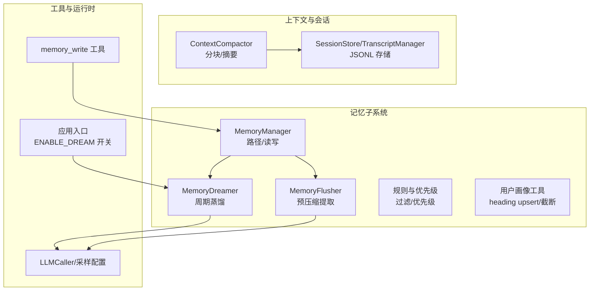
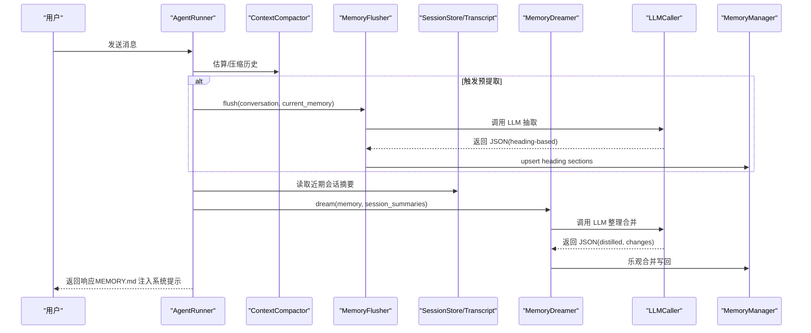
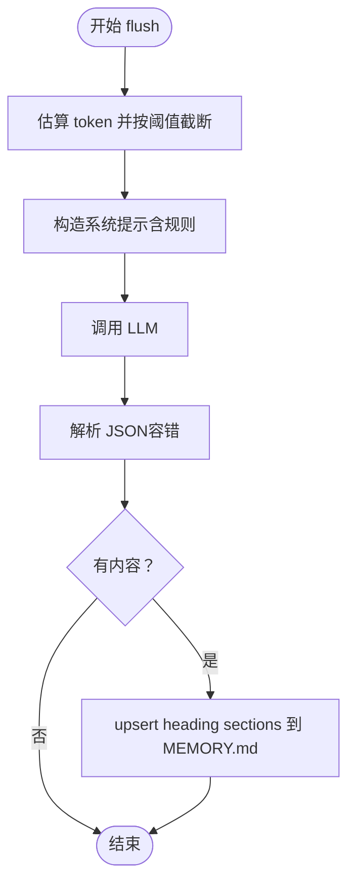
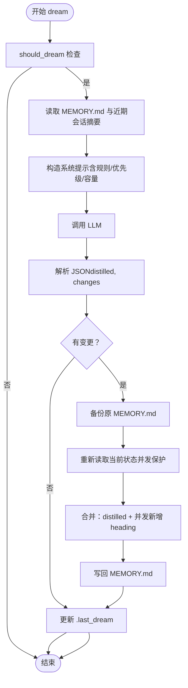
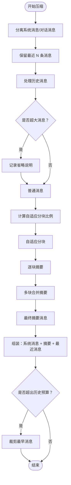
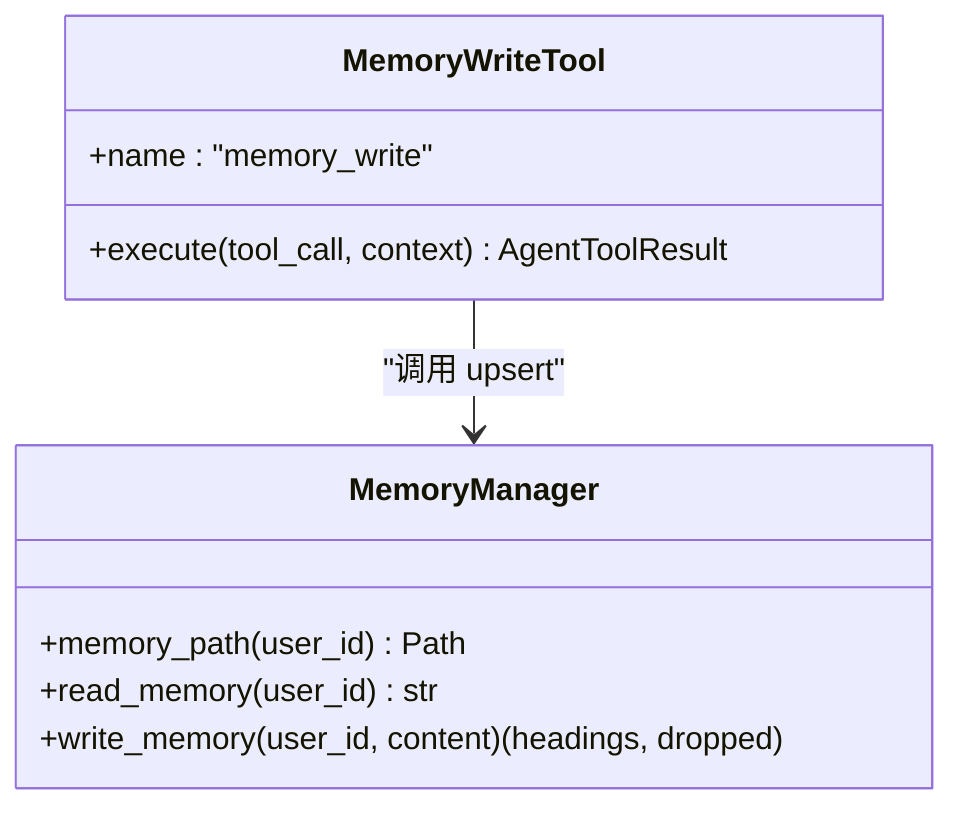
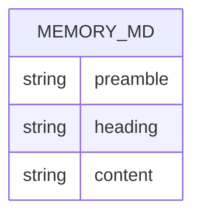
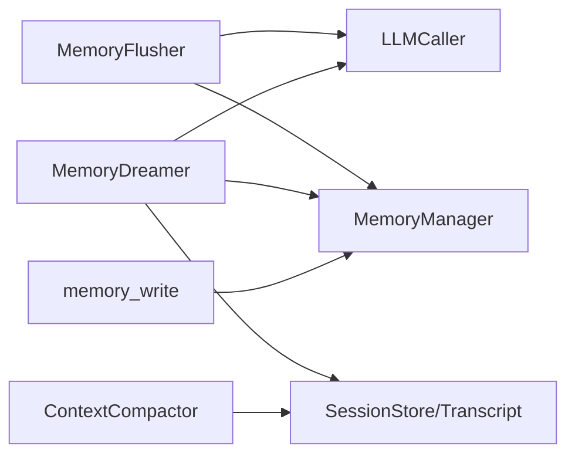

# 记忆蒸馏

<cite>
**本文档引用的文件**
- [src/ark_agentic/core/memory/dream.py](file://src/ark_agentic/core/memory/dream.py)
- [src/ark_agentic/core/memory/extractor.py](file://src/ark_agentic/core/memory/extractor.py)
- [src/ark_agentic/core/memory/user_profile.py](file://src/ark_agentic/core/memory/user_profile.py)
- [src/ark_agentic/core/memory/rules.py](file://src/ark_agentic/core/memory/rules.py)
- [src/ark_agentic/core/memory/manager.py](file://src/ark_agentic/core/memory/manager.py)
- [src/ark_agentic/core/memory/__init__.py](file://src/ark_agentic/core/memory/__init__.py)
- [src/ark_agentic/core/compaction.py](file://src/ark_agentic/core/compaction.py)
- [src/ark_agentic/core/persistence.py](file://src/ark_agentic/core/persistence.py)
- [src/ark_agentic/core/tools/memory.py](file://src/ark_agentic/core/tools/memory.py)
- [tests/e2e/test_memory_e2e.py](file://tests/e2e/test_memory_e2e.py)
- [src/ark_agentic/app.py](file://src/ark_agentic/app.py)
- [src/ark_agentic/core/llm/caller.py](file://src/ark_agentic/core/llm/caller.py)
- [src/ark_agentic/core/llm/sampling.py](file://src/ark_agentic/core/llm/sampling.py)
</cite>

## 目录
1. [引言](#引言)
2. [项目结构](#项目结构)
3. [核心组件](#核心组件)
4. [架构总览](#架构总览)
5. [详细组件分析](#详细组件分析)
6. [依赖分析](#依赖分析)
7. [性能考量](#性能考量)
8. [故障排查指南](#故障排查指南)
9. [结论](#结论)
10. [附录](#附录)

## 引言
本文件面向 Ark-Agentic 记忆蒸馏系统，系统性阐述“记忆蒸馏”的概念、算法实现与优化策略。蒸馏的目标是将大量原始会话与上下文压缩为高质量、结构化的长期记忆（MEMORY.md），并通过两类机制实现：
- 预压缩提取（Flush）：在上下文压缩前，由 LLM 从完整对话中抽取需要长期保存的信息，写入 MEMORY.md。
- 周期性蒸馏（Dream）：周期性读取近期会话摘要与现有记忆，经 LLM 整理合并、去重、精简，形成更稳定的长期知识。

蒸馏过程中涉及的关键技术包括：基于 heading 的 Markdown 结构化存储、基于 token 的容量预算与截断、基于规则的过滤与优先级、乐观并发合并写入、以及 LLM 摘要与系统提示工程。

## 项目结构
记忆蒸馏相关模块集中在 core/memory 下，配合上下文压缩、会话持久化与工具系统协同工作：
- memory：记忆管理、预提取、周期蒸馏、规则与用户画像工具
- compaction：上下文压缩、分块、摘要生成
- persistence：会话 JSONL 存储与转录
- tools/memory：memory_write 工具
- llm：LLM 调用与采样配置（蒸馏与摘要专用）

**图表来源**
- [src/ark_agentic/core/memory/manager.py:24-92](file://src/ark_agentic/core/memory/manager.py#L24-L92)
- [src/ark_agentic/core/memory/extractor.py:98-187](file://src/ark_agentic/core/memory/extractor.py#L98-L187)
- [src/ark_agentic/core/memory/dream.py:190-323](file://src/ark_agentic/core/memory/dream.py#L190-L323)
- [src/ark_agentic/core/memory/rules.py:7-32](file://src/ark_agentic/core/memory/rules.py#L7-L32)
- [src/ark_agentic/core/memory/user_profile.py:26-138](file://src/ark_agentic/core/memory/user_profile.py#L26-L138)
- [src/ark_agentic/core/compaction.py:421-742](file://src/ark_agentic/core/compaction.py#L421-L742)
- [src/ark_agentic/core/persistence.py:392-591](file://src/ark_agentic/core/persistence.py#L392-L591)
- [src/ark_agentic/core/tools/memory.py:39-114](file://src/ark_agentic/core/tools/memory.py#L39-L114)
- [src/ark_agentic/app.py:95-102](file://src/ark_agentic/app.py#L95-L102)
- [src/ark_agentic/core/llm/caller.py:45-45](file://src/ark_agentic/core/llm/caller.py#L45-L45)
- [src/ark_agentic/core/llm/sampling.py:23-58](file://src/ark_agentic/core/llm/sampling.py#L23-L58)

**章节来源**
- [src/ark_agentic/core/memory/__init__.py:1-12](file://src/ark_agentic/core/memory/__init__.py#L1-L12)
- [src/ark_agentic/core/memory/manager.py:24-92](file://src/ark_agentic/core/memory/manager.py#L24-L92)
- [src/ark_agentic/core/memory/extractor.py:98-187](file://src/ark_agentic/core/memory/extractor.py#L98-L187)
- [src/ark_agentic/core/memory/dream.py:190-323](file://src/ark_agentic/core/memory/dream.py#L190-L323)
- [src/ark_agentic/core/memory/rules.py:7-32](file://src/ark_agentic/core/memory/rules.py#L7-L32)
- [src/ark_agentic/core/memory/user_profile.py:26-138](file://src/ark_agentic/core/memory/user_profile.py#L26-L138)
- [src/ark_agentic/core/compaction.py:421-742](file://src/ark_agentic/core/compaction.py#L421-L742)
- [src/ark_agentic/core/persistence.py:392-591](file://src/ark_agentic/core/persistence.py#L392-L591)
- [src/ark_agentic/core/tools/memory.py:39-114](file://src/ark_agentic/core/tools/memory.py#L39-L114)
- [src/ark_agentic/app.py:95-102](file://src/ark_agentic/app.py#L95-L102)
- [src/ark_agentic/core/llm/caller.py:45-45](file://src/ark_agentic/core/llm/caller.py#L45-L45)
- [src/ark_agentic/core/llm/sampling.py:23-58](file://src/ark_agentic/core/llm/sampling.py#L23-L58)

## 核心组件
- MemoryManager：负责按 user_id 定位 MEMORY.md 路径，提供 heading-level upsert 的读写接口，作为运行器、工具与提取器的统一依赖入口。
- MemoryFlusher：在上下文压缩前，调用 LLM 从完整对话中抽取需要长期保存的信息，写入 MEMORY.md。
- MemoryDreamer：周期性读取近期会话摘要与现有记忆，经 LLM 整理合并、去重、精简，形成更稳定的长期知识。
- 用户画像工具：解析/格式化 heading-based markdown，执行 upsert 与按优先级的截断。
- 规则与优先级：统一“记录/不记录”的判断标准，以及 heading 保留优先级。
- 上下文压缩：自适应分块、LLM 摘要、分阶段合并、预算裁剪，支撑预提取与蒸馏的输入规模控制。
- 会话持久化：JSONL 转录与会话元数据存储，为蒸馏提供近期会话摘要来源。
- memory_write 工具：Agent 主动写入/更新长期记忆，遵循 heading-level upsert 语义。
- LLM 调用与采样：蒸馏与摘要使用专用采样配置，保证稳定性与一致性。

**章节来源**
- [src/ark_agentic/core/memory/manager.py:24-92](file://src/ark_agentic/core/memory/manager.py#L24-L92)
- [src/ark_agentic/core/memory/extractor.py:98-187](file://src/ark_agentic/core/memory/extractor.py#L98-L187)
- [src/ark_agentic/core/memory/dream.py:190-323](file://src/ark_agentic/core/memory/dream.py#L190-L323)
- [src/ark_agentic/core/memory/user_profile.py:26-138](file://src/ark_agentic/core/memory/user_profile.py#L26-L138)
- [src/ark_agentic/core/memory/rules.py:7-32](file://src/ark_agentic/core/memory/rules.py#L7-L32)
- [src/ark_agentic/core/compaction.py:421-742](file://src/ark_agentic/core/compaction.py#L421-L742)
- [src/ark_agentic/core/persistence.py:392-591](file://src/ark_agentic/core/persistence.py#L392-L591)
- [src/ark_agentic/core/tools/memory.py:39-114](file://src/ark_agentic/core/tools/memory.py#L39-L114)
- [src/ark_agentic/core/llm/sampling.py:23-58](file://src/ark_agentic/core/llm/sampling.py#L23-L58)

## 架构总览
记忆蒸馏贯穿“原始会话 → 结构化记忆 → 系统提示注入”的生命周期。系统通过以下路径实现：
- 预压缩提取：当上下文接近阈值时，MemoryFlusher 从完整对话中抽取长期信息，写入 MEMORY.md。
- 周期蒸馏：MemoryDreamer 周期性读取近期会话摘要与 MEMORY.md，经 LLM 整理后乐观合并写回。
- 系统提示注入：MEMORY.md 内容被注入到系统提示中，随每次对话注入，确保上下文一致性。

**图表来源**
- [src/ark_agentic/core/memory/extractor.py:108-187](file://src/ark_agentic/core/memory/extractor.py#L108-L187)
- [src/ark_agentic/core/memory/dream.py:196-323](file://src/ark_agentic/core/memory/dream.py#L196-L323)
- [src/ark_agentic/core/compaction.py:458-518](file://src/ark_agentic/core/compaction.py#L458-L518)
- [src/ark_agentic/core/persistence.py:392-591](file://src/ark_agentic/core/persistence.py#L392-L591)
- [src/ark_agentic/core/llm/caller.py:45-45](file://src/ark_agentic/core/llm/caller.py#L45-L45)

## 详细组件分析

### 预压缩提取（MemoryFlusher）
- 输入：完整对话文本、当前 MEMORY.md、Agent 名称与描述
- 处理：估算 token，必要时截断；构造系统提示；调用 LLM；解析 JSON；upsert 写入
- 关键点：仅输出“新发现或需要更新的信息”，避免重复；支持回调集成到压缩前流程

**图表来源**
- [src/ark_agentic/core/memory/extractor.py:108-144](file://src/ark_agentic/core/memory/extractor.py#L108-L144)
- [src/ark_agentic/core/memory/user_profile.py:66-94](file://src/ark_agentic/core/memory/user_profile.py#L66-L94)

**章节来源**
- [src/ark_agentic/core/memory/extractor.py:98-187](file://src/ark_agentic/core/memory/extractor.py#L98-L187)
- [src/ark_agentic/core/memory/rules.py:7-32](file://src/ark_agentic/core/memory/rules.py#L7-L32)
- [src/ark_agentic/core/memory/user_profile.py:66-94](file://src/ark_agentic/core/memory/user_profile.py#L66-L94)

### 周期蒸馏（MemoryDreamer）
- 触发：根据 .last_dream 时间戳与会话数量判定是否需要蒸馏
- 输入：MEMORY.md、近期会话摘要（来自 JSONL 转录）
- 处理：构造系统提示（含规则、优先级、容量约束）→ LLM 整理 → 乐观合并写回
- 关键点：保守策略（宁可保留冗余）；合并时保留最新、最具体描述；按优先级截断

**图表来源**
- [src/ark_agentic/core/memory/dream.py:147-323](file://src/ark_agentic/core/memory/dream.py#L147-L323)
- [src/ark_agentic/core/memory/rules.py:7-32](file://src/ark_agentic/core/memory/rules.py#L7-L32)
- [src/ark_agentic/core/memory/user_profile.py:96-138](file://src/ark_agentic/core/memory/user_profile.py#L96-L138)

**章节来源**
- [src/ark_agentic/core/memory/dream.py:190-323](file://src/ark_agentic/core/memory/dream.py#L190-L323)
- [src/ark_agentic/core/memory/rules.py:7-32](file://src/ark_agentic/core/memory/rules.py#L7-L32)
- [src/ark_agentic/core/memory/user_profile.py:96-138](file://src/ark_agentic/core/memory/user_profile.py#L96-L138)

### 上下文压缩与摘要（ContextCompactor/LLMSummarizer）
- 自适应分块：根据消息平均 token 与上下文窗口动态调整分块比例
- 超大消息处理：超过阈值的消息单独成块并标注省略
- 分阶段摘要：多块摘要 → 合并摘要 → 统一摘要
- 预算裁剪：按历史占比预算裁剪最早消息
- 采样配置：蒸馏/摘要专用采样，降低随机性，提升稳定性

**图表来源**
- [src/ark_agentic/core/compaction.py:458-618](file://src/ark_agentic/core/compaction.py#L458-L618)
- [src/ark_agentic/core/compaction.py:647-669](file://src/ark_agentic/core/compaction.py#L647-L669)
- [src/ark_agentic/core/llm/sampling.py:23-58](file://src/ark_agentic/core/llm/sampling.py#L23-L58)

**章节来源**
- [src/ark_agentic/core/compaction.py:421-742](file://src/ark_agentic/core/compaction.py#L421-L742)
- [src/ark_agentic/core/llm/sampling.py:23-58](file://src/ark_agentic/core/llm/sampling.py#L23-L58)

### 记忆管理与工具（MemoryManager/memory_write）
- MemoryManager：heading-level upsert，支持空内容删除（即“清空标题”实现删除）
- memory_write 工具：Agent 主动写入/更新长期记忆，遵循 heading-level 语义

**图表来源**
- [src/ark_agentic/core/memory/manager.py:24-92](file://src/ark_agentic/core/memory/manager.py#L24-L92)
- [src/ark_agentic/core/tools/memory.py:39-114](file://src/ark_agentic/core/tools/memory.py#L39-L114)

**章节来源**
- [src/ark_agentic/core/memory/manager.py:24-92](file://src/ark_agentic/core/memory/manager.py#L24-L92)
- [src/ark_agentic/core/tools/memory.py:39-114](file://src/ark_agentic/core/tools/memory.py#L39-L114)

### 数据模型与规则
- heading-based markdown：每个 heading 代表一个属性，upsert 同名覆盖
- 记录规则：明确“记录/不记录”的判断方法与正反例
- 优先级：身份信息 > 沟通风格 > 业务偏好 > 风险偏好

**图表来源**
- [src/ark_agentic/core/memory/user_profile.py:26-64](file://src/ark_agentic/core/memory/user_profile.py#L26-L64)
- [src/ark_agentic/core/memory/rules.py:7-32](file://src/ark_agentic/core/memory/rules.py#L7-L32)

**章节来源**
- [src/ark_agentic/core/memory/user_profile.py:26-138](file://src/ark_agentic/core/memory/user_profile.py#L26-L138)
- [src/ark_agentic/core/memory/rules.py:7-32](file://src/ark_agentic/core/memory/rules.py#L7-L32)

## 依赖分析
- 组件耦合
  - MemoryFlusher/MemoryDreamer 依赖 LLMCaller 与采样配置，确保蒸馏/摘要稳定性
  - ContextCompactor 依赖会话持久化（SessionStore/TranscriptManager）读取近期会话摘要
  - MemoryManager 作为统一入口被工具与提取器调用
- 外部依赖
  - LLM：LangChain BaseChatModel（支持 ainvoke）
  - 文件系统：MEMORY.md 与 JSONL 存储
- 潜在循环依赖
  - 模块间通过接口与工厂解耦，未见直接循环导入

**图表来源**
- [src/ark_agentic/core/memory/extractor.py:105-107](file://src/ark_agentic/core/memory/extractor.py#L105-L107)
- [src/ark_agentic/core/memory/dream.py:193-194](file://src/ark_agentic/core/memory/dream.py#L193-L194)
- [src/ark_agentic/core/compaction.py:434-441](file://src/ark_agentic/core/compaction.py#L434-L441)
- [src/ark_agentic/core/persistence.py:392-591](file://src/ark_agentic/core/persistence.py#L392-L591)
- [src/ark_agentic/core/tools/memory.py:64-66](file://src/ark_agentic/core/tools/memory.py#L64-L66)

**章节来源**
- [src/ark_agentic/core/memory/extractor.py:105-107](file://src/ark_agentic/core/memory/extractor.py#L105-L107)
- [src/ark_agentic/core/memory/dream.py:193-194](file://src/ark_agentic/core/memory/dream.py#L193-L194)
- [src/ark_agentic/core/compaction.py:434-441](file://src/ark_agentic/core/compaction.py#L434-L441)
- [src/ark_agentic/core/persistence.py:392-591](file://src/ark_agentic/core/persistence.py#L392-L591)
- [src/ark_agentic/core/tools/memory.py:64-66](file://src/ark_agentic/core/tools/memory.py#L64-L66)

## 性能考量
- Token 估算与安全边界：采用字符/词估算并引入 20% 安全余量，避免越界
- 自适应分块：根据消息平均 token 与上下文窗口动态调整分块比例，平衡吞吐与稳定性
- 超大消息处理：超过阈值的消息单独成块并省略，避免摘要失败影响整体流程
- 截断与优先级：按优先级保留完整 section，避免截断半句话
- 乐观合并写入：备份 + 重新读取 + 并发新增 heading 保留，降低写冲突风险
- 采样配置：蒸馏/摘要使用专用采样，降低随机性，提高一致性

[本节为通用性能讨论，无需特定文件来源]

## 故障排查指南
- LLM 返回非 JSON
  - 预提取与蒸馏均对 LLM 返回进行 JSON 解析与容错，若失败记录调试日志并跳过写入
  - 参考：解析与容错逻辑
- 写入失败或并发冲突
  - MemoryManager 的 upsert 语义与 MemoryDreamer 的乐观合并写入，均包含错误日志与回退
  - 参考：写入与合并流程
- 会话读取异常
  - SessionStore/TranscriptManager 加载失败时记录调试日志并跳过对应会话
  - 参考：会话读取与错误处理
- 测试验证
  - 端到端测试覆盖预提取写入、系统提示注入、memory_write 工具生效等关键路径

**章节来源**
- [src/ark_agentic/core/memory/extractor.py:134-144](file://src/ark_agentic/core/memory/extractor.py#L134-L144)
- [src/ark_agentic/core/memory/dream.py:224-235](file://src/ark_agentic/core/memory/dream.py#L224-L235)
- [src/ark_agentic/core/memory/dream.py:251-287](file://src/ark_agentic/core/memory/dream.py#L251-L287)
- [src/ark_agentic/core/persistence.py:525-548](file://src/ark_agentic/core/persistence.py#L525-L548)
- [tests/e2e/test_memory_e2e.py:100-260](file://tests/e2e/test_memory_e2e.py#L100-L260)

## 结论
Ark-Agentic 记忆蒸馏系统通过“预压缩提取 + 周期蒸馏”的双通道机制，将海量会话转化为高质量、结构化的长期记忆。系统以 heading-based markdown 为知识载体，结合规则过滤、优先级截断与乐观合并写入，确保知识的准确性与一致性。上下文压缩与 LLM 摘要在保证稳定性的同时，兼顾吞吐效率。建议在生产环境中：
- 使用 LLM 摘要替代简单截断，提升摘要质量
- 调整压缩阈值与分块比例以适配业务对话长度
- 通过采样配置进一步稳定蒸馏/摘要行为
- 结合端到端测试持续验证蒸馏效果与系统鲁棒性

[本节为总结性内容，无需特定文件来源]

## 附录

### 蒸馏质量评估标准
- 结构完整性：heading 数量与覆盖度是否满足业务偏好、沟通风格、风险偏好等维度
- 一致性：同一主题不同表述是否被正确合并，是否存在矛盾信息
- 最新性：最新对话是否有效纳入，过时信息是否被删除
- 压缩比：distilled 后 token 数与原始会话相比的压缩率
- 可读性：摘要语言是否简洁、完整，便于后续对话继续

[本节为通用评估建议，无需特定文件来源]

### 参数调优指南
- 压缩阈值与目标：根据上下文窗口与输出预留设置 trigger_threshold 与 target_tokens
- 分块比例：根据消息平均长度与上下文窗口动态调整，避免过度分块
- 摘要长度：summary_max_tokens 控制摘要粒度，避免过长导致上下文拥挤
- 采样配置：蒸馏/摘要使用专用采样，降低随机性，提升稳定性
- 蒸馏频率：通过 .last_dream 与会话数量门限控制周期蒸馏频率

**章节来源**
- [src/ark_agentic/core/compaction.py:354-407](file://src/ark_agentic/core/compaction.py#L354-L407)
- [src/ark_agentic/core/llm/sampling.py:23-58](file://src/ark_agentic/core/llm/sampling.py#L23-L58)
- [src/ark_agentic/core/memory/dream.py:147-176](file://src/ark_agentic/core/memory/dream.py#L147-L176)

### 性能基准测试建议
- 基准数据集：构造不同长度与复杂度的对话样本，覆盖业务场景
- 指标：吞吐（消息/秒）、延迟（首次响应/总耗时）、内存占用、distilled token 数
- 场景：预提取触发频率、摘要生成次数、合并写入成功率
- 方法：对比简单截断与 LLM 摘要、不同分块比例与阈值组合

[本节为通用测试建议，无需特定文件来源]