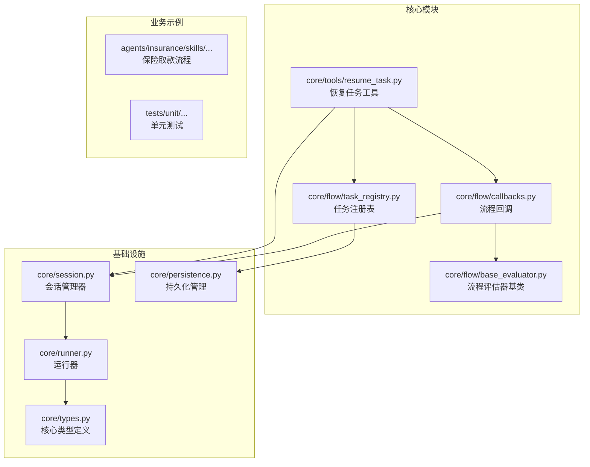
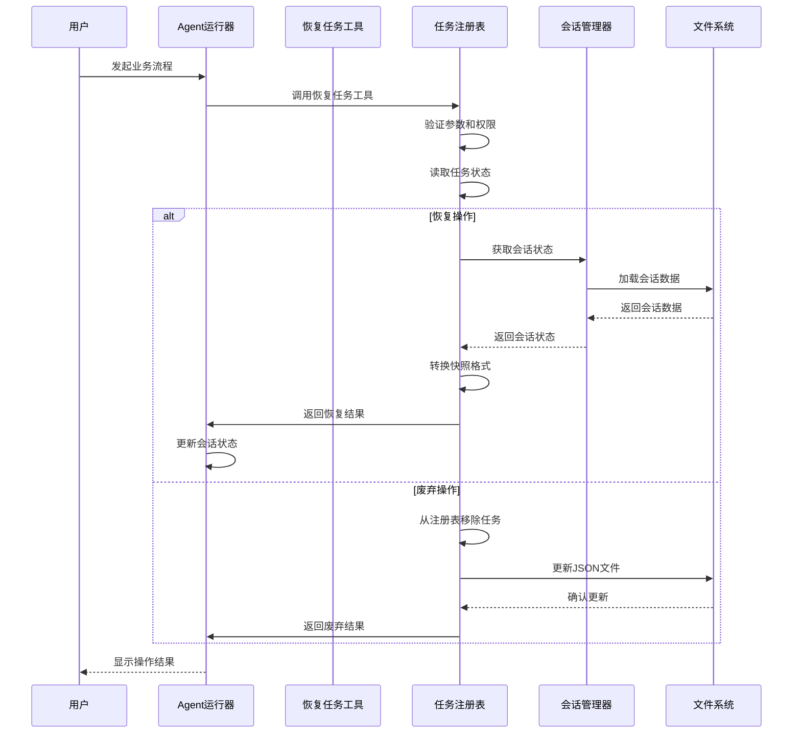
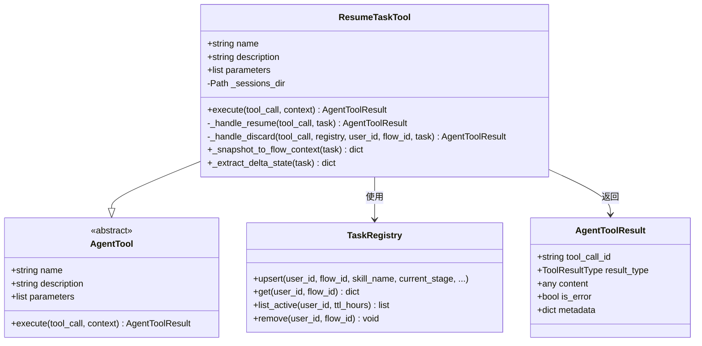
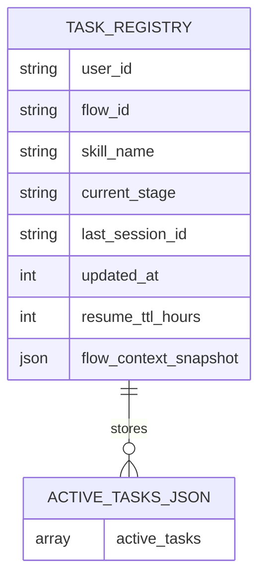
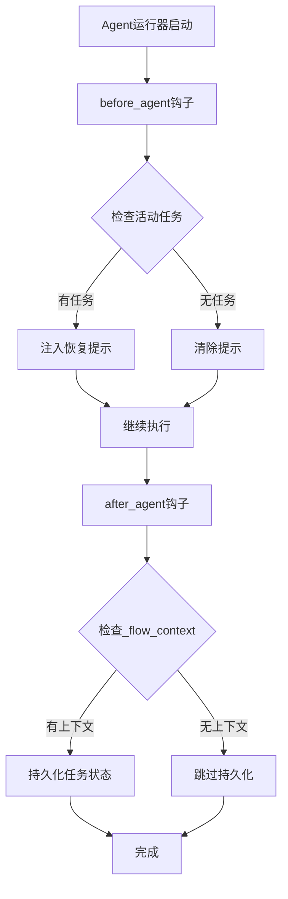
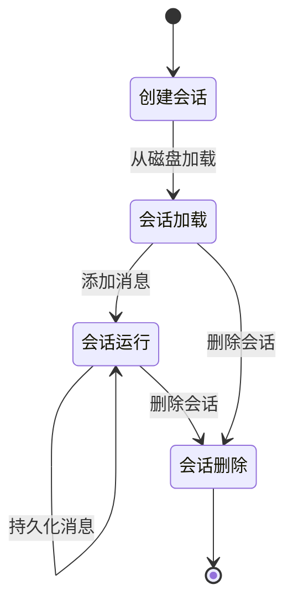
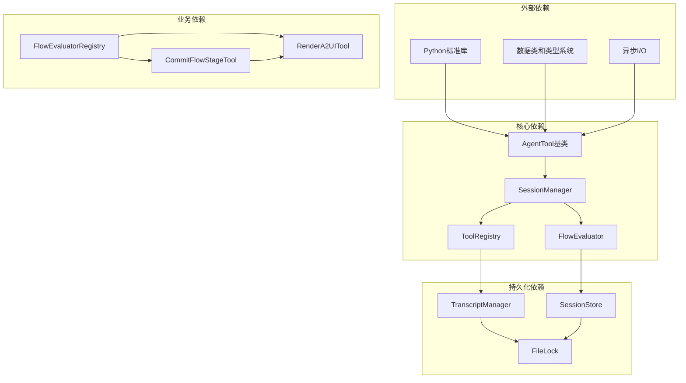

# 跨会话任务恢复工具

<cite>
**本文档引用的文件**
- [resume_task.py](file://src/ark_agentic/core/tools/resume_task.py)
- [task_registry.py](file://src/ark_agentic/core/flow/task_registry.py)
- [callbacks.py](file://src/ark_agentic/core/flow/callbacks.py)
- [base_evaluator.py](file://src/ark_agentic/core/flow/base_evaluator.py)
- [runner.py](file://src/ark_agentic/core/runner.py)
- [session.py](file://src/ark_agentic/core/session.py)
- [persistence.py](file://src/ark_agentic/core/persistence.py)
- [types.py](file://src/ark_agentic/core/types.py)
- [SKILL.md](file://src/ark_agentic/agents/insurance/skills/withdraw_money_flow/SKILL.md)
- [test_withdrawal_multiturn.py](file://tests/unit/agents/insurance/test_withdrawal_multiturn.py)
</cite>

## 目录
1. [简介](#简介)
2. [项目结构](#项目结构)
3. [核心组件](#核心组件)
4. [架构概览](#架构概览)
5. [详细组件分析](#详细组件分析)
6. [依赖关系分析](#依赖关系分析)
7. [性能考量](#性能考量)
8. [故障排除指南](#故障排除指南)
9. [结论](#结论)

## 简介

跨会话任务恢复工具是 Ark-Agentic 框架中的一个关键组件，它允许智能体在用户中断业务流程后，能够在重新进入时恢复之前的进度。该工具通过持久化流程状态、管理活动任务列表以及提供恢复和废弃操作，实现了完整的跨会话状态管理。

该工具主要服务于保险取款等复杂的多阶段业务流程，确保用户可以在任何时间点中断操作，然后在稍后的时间重新开始，而不会丢失已经完成的工作。

## 项目结构

Ark-Agentic 框架采用模块化设计，跨会话任务恢复功能分布在多个核心模块中：

**图表来源**
- [resume_task.py:1-193](file://src/ark_agentic/core/tools/resume_task.py#L1-L193)
- [task_registry.py:1-124](file://src/ark_agentic/core/flow/task_registry.py#L1-L124)
- [callbacks.py:1-143](file://src/ark_agentic/core/flow/callbacks.py#L1-L143)

**章节来源**
- [resume_task.py:1-193](file://src/ark_agentic/core/tools/resume_task.py#L1-L193)
- [task_registry.py:1-124](file://src/ark_agentic/core/flow/task_registry.py#L1-L124)
- [callbacks.py:1-143](file://src/ark_agentic/core/flow/callbacks.py#L1-L143)

## 核心组件

跨会话任务恢复系统由以下核心组件构成：

### 1. 恢复任务工具 (ResumeTaskTool)
这是系统的主要入口点，提供两种操作模式：
- **恢复操作** (`action="resume"`): 将流程进度恢复到当前会话
- **废弃操作** (`action="discard"`): 从待恢复列表中移除任务

### 2. 任务注册表 (TaskRegistry)
管理用户的活动任务列表，提供：
- 任务的增删改查操作
- TTL（生存时间）过期管理
- JSON 文件持久化存储

### 3. 流程回调系统
集成到 Agent 运行器中，自动处理：
- 任务状态的持久化
- 用户未完成任务的提示注入
- 流程上下文的恢复

### 4. 会话管理系统
提供完整的会话生命周期管理，包括：
- 会话创建、加载、删除
- 消息持久化和加载
- 状态同步和压缩

**章节来源**
- [resume_task.py:22-84](file://src/ark_agentic/core/tools/resume_task.py#L22-L84)
- [task_registry.py:32-96](file://src/ark_agentic/core/flow/task_registry.py#L32-L96)
- [callbacks.py:36-142](file://src/ark_agentic/core/flow/callbacks.py#L36-L142)

## 架构概览

跨会话任务恢复系统采用分层架构设计，确保各个组件职责清晰且松耦合：

**图表来源**
- [resume_task.py:54-141](file://src/ark_agentic/core/tools/resume_task.py#L54-L141)
- [task_registry.py:77-96](file://src/ark_agentic/core/flow/task_registry.py#L77-L96)
- [session.py:184-227](file://src/ark_agentic/core/session.py#L184-L227)

## 详细组件分析

### 恢复任务工具 (ResumeTaskTool)

#### 类设计分析

**图表来源**
- [resume_task.py:22-192](file://src/ark_agentic/core/tools/resume_task.py#L22-L192)

#### 核心功能实现

##### 参数验证和错误处理
工具提供了完善的参数验证机制：
- 必填参数检查 (`flow_id` 必须存在)
- 枚举值验证 (`action` 仅接受 "resume"/"discard")
- 用户身份验证 (`user_id` 必须存在)

##### 恢复操作流程
当执行恢复操作时，工具会：
1. 从任务注册表获取任务详情
2. 将快照格式转换为运行时格式
3. 提取 delta 状态并应用到会话状态
4. 返回恢复结果和状态增量

##### 废弃操作流程
废弃操作相对简单：
1. 从任务注册表中移除指定任务
2. 记录操作日志
3. 返回废弃确认信息

**章节来源**
- [resume_task.py:54-141](file://src/ark_agentic/core/tools/resume_task.py#L54-L141)

### 任务注册表 (TaskRegistry)

#### 数据结构设计

任务注册表采用 JSON 文件存储格式，支持 TTL（生存时间）过期管理：

**图表来源**
- [task_registry.py:5-18](file://src/ark_agentic/core/flow/task_registry.py#L5-L18)

#### 核心方法分析

##### 任务持久化 (upsert)
提供任务的创建和更新功能：
- 自动生成时间戳
- 支持任务完成状态的自动清理
- 保持向后兼容性

##### 任务查询 (get/list_active)
提供灵活的任务查询能力：
- 支持按用户 ID 查询
- 自动过滤过期任务
- 支持自定义 TTL 配置

##### 任务管理 (remove)
提供任务的删除功能：
- 精确的任务删除
- 文件系统级别的原子操作

**章节来源**
- [task_registry.py:42-124](file://src/ark_agentic/core/flow/task_registry.py#L42-L124)

### 流程回调系统

#### 回调机制设计

流程回调系统通过钩子函数集成到 Agent 运行器中，提供自动化的任务管理：

**图表来源**
- [callbacks.py:50-141](file://src/ark_agentic/core/flow/callbacks.py#L50-L141)

#### 核心回调功能

##### 注入流程提示 (inject_flow_hint)
在每次对话开始时检查用户的活动任务，并向系统提示中注入相应的恢复信息。提示内容包括：
- 活动任务的数量和状态
- 恢复操作的具体指令
- 安全操作的警告信息

##### 持久化流程上下文 (persist_flow_context)
在对话结束后自动保存流程状态到任务注册表中，确保下次会话可以正确恢复。

**章节来源**
- [callbacks.py:48-142](file://src/ark_agentic/core/flow/callbacks.py#L48-L142)

### 会话管理系统

#### 会话生命周期管理

会话管理系统提供了完整的会话生命周期管理功能：

**图表来源**
- [session.py:40-121](file://src/ark_agentic/core/session.py#L40-L121)

#### 核心功能特性

##### 消息持久化
- 支持批量消息持久化
- 提供 JSONL 格式存储
- 自动处理文件锁机制

##### 状态同步
- 实时同步会话状态
- 支持内存和磁盘状态一致性
- 提供状态缓存机制

##### 会话压缩
- 自动检测和执行上下文压缩
- 支持多种压缩算法
- 优化存储空间和性能

**章节来源**
- [session.py:24-482](file://src/ark_agentic/core/session.py#L24-L482)

## 依赖关系分析

跨会话任务恢复系统涉及多个模块间的复杂依赖关系：

**图表来源**
- [resume_task.py:16-17](file://src/ark_agentic/core/tools/resume_task.py#L16-L17)
- [runner.py:29-36](file://src/ark_agentic/core/runner.py#L29-L36)

### 模块间耦合度分析

系统采用了合理的解耦设计：

1. **低耦合设计**: 各组件通过接口和抽象类进行交互
2. **依赖注入**: 通过构造函数注入依赖，便于测试和扩展
3. **事件驱动**: 使用回调机制实现松耦合的组件通信

### 循环依赖防护

系统通过以下机制避免循环依赖：
- 明确的模块边界划分
- 接口抽象层的设计
- 延迟导入机制

**章节来源**
- [runner.py:196-263](file://src/ark_agentic/core/runner.py#L196-L263)
- [persistence.py:26-28](file://src/ark_agentic/core/persistence.py#L26-L28)

## 性能考量

跨会话任务恢复系统在设计时充分考虑了性能优化：

### 1. 异步I/O优化
- 使用异步文件操作减少阻塞
- 实现文件锁机制避免并发冲突
- 支持批量持久化操作

### 2. 内存管理优化
- 会话状态缓存机制
- 智能的垃圾回收策略
- 内存使用监控和告警

### 3. 存储优化
- JSONL格式的高效存储
- 分层存储结构设计
- TTL过期清理机制

### 4. 网络传输优化
- 增量状态同步
- 压缩传输机制
- 断线重连处理

## 故障排除指南

### 常见问题诊断

#### 1. 任务恢复失败
**症状**: 调用恢复工具后返回错误
**可能原因**:
- `flow_id` 参数为空或无效
- 用户身份验证失败
- 任务状态文件损坏

**解决方案**:
- 检查 `flow_id` 参数的有效性
- 验证用户身份信息
- 重新生成任务状态文件

#### 2. 会话加载异常
**症状**: 会话数据无法正确加载
**可能原因**:
- JSONL文件格式错误
- 文件权限问题
- 存储空间不足

**解决方案**:
- 验证JSONL文件格式
- 检查文件权限设置
- 清理存储空间

#### 3. 并发访问冲突
**症状**: 文件锁获取超时
**可能原因**:
- 长时间未释放的锁文件
- 系统资源不足
- 网络文件系统延迟

**解决方案**:
- 清理过期的锁文件
- 增加系统资源
- 优化网络配置

### 日志分析

系统提供了详细的日志记录机制，便于问题诊断：

#### 关键日志级别
- **DEBUG**: 详细的操作跟踪和状态信息
- **INFO**: 正常操作的确认信息
- **WARNING**: 可能的问题和异常情况
- **ERROR**: 严重的错误和异常

#### 日志分析要点
- 检查操作的完整性和一致性
- 关注异常情况的上下文信息
- 监控性能指标和资源使用

**章节来源**
- [resume_task.py:122-127](file://src/ark_agentic/core/tools/resume_task.py#L122-L127)
- [persistence.py:289-290](file://src/ark_agentic/core/persistence.py#L289-L290)

## 结论

跨会话任务恢复工具是 Ark-Agentic 框架中的重要组成部分，它通过精心设计的架构和实现，为复杂的多阶段业务流程提供了可靠的跨会话状态管理能力。

### 主要优势

1. **完整的状态管理**: 支持从会话状态到任务状态的全方位管理
2. **灵活的操作模式**: 提供恢复和废弃两种操作模式满足不同需求
3. **高可靠性设计**: 采用异步I/O、文件锁等机制确保数据一致性
4. **良好的扩展性**: 模块化设计便于功能扩展和定制

### 应用场景

该工具特别适用于以下业务场景：
- 保险取款等金融业务
- 复杂的审批流程
- 需要长时间完成的业务操作
- 多步骤的客户服务流程

### 未来发展

随着业务需求的不断增长，该系统可以在以下方面进一步优化：
- 增强错误恢复能力
- 优化性能表现
- 扩展支持更多的业务场景
- 提供更丰富的监控和管理功能

通过持续的改进和完善，跨会话任务恢复工具将继续为 Ark-Agentic 框架提供强大的状态管理能力，支撑更多复杂的业务应用场景。