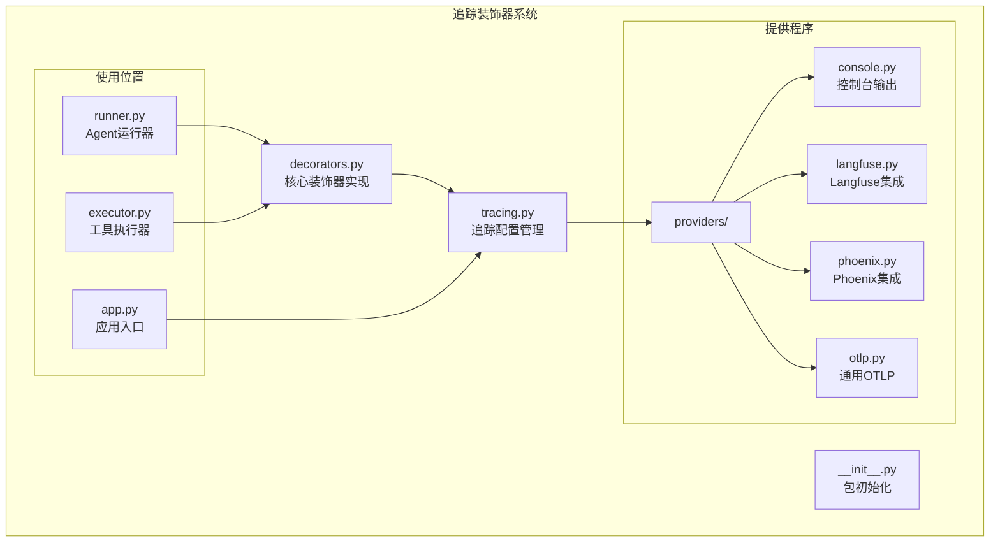
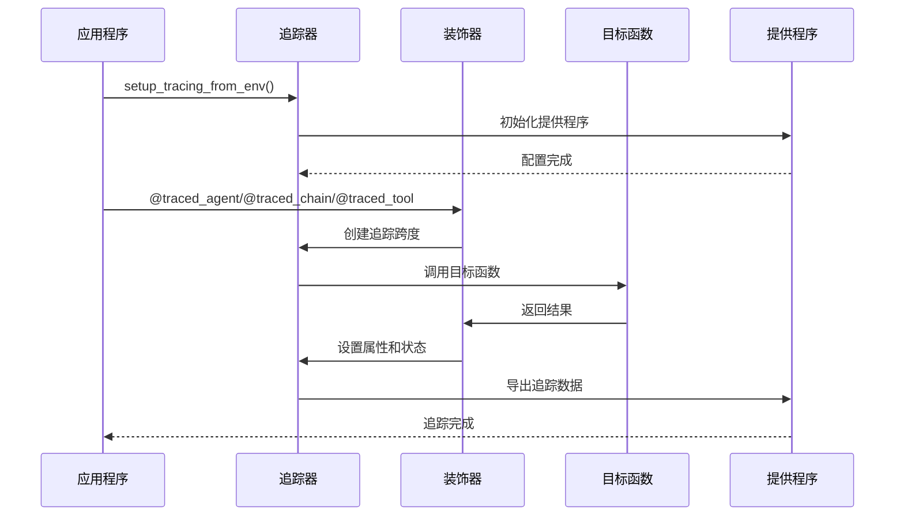
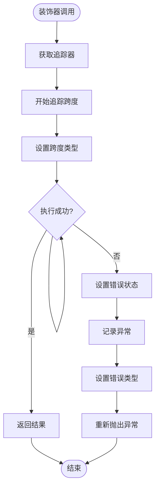
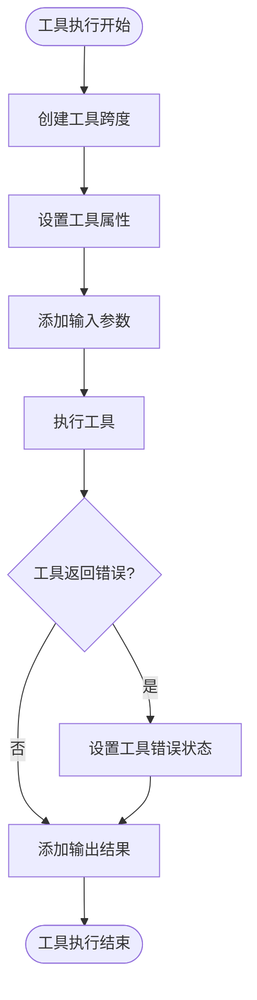
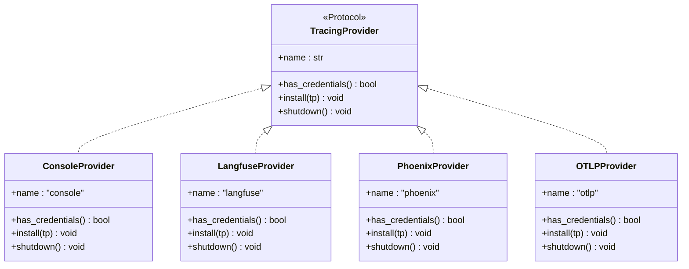
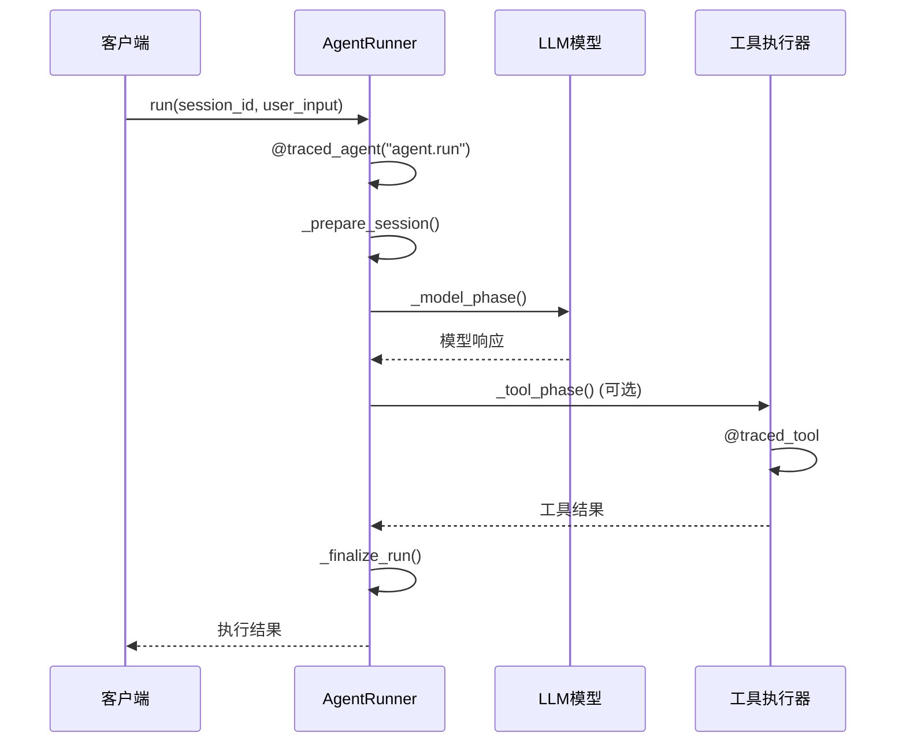
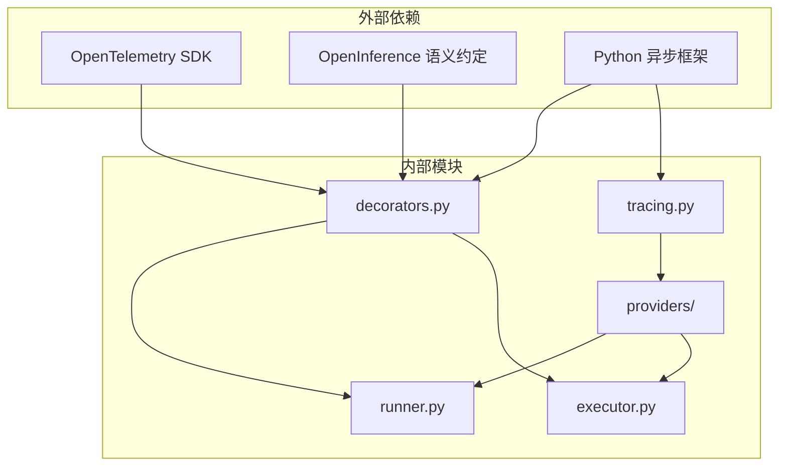

# 追踪装饰器

<cite>
**本文档引用的文件**
- [decorators.py](file://src/ark_agentic/core/observability/decorators.py)
- [tracing.py](file://src/ark_agentic/core/observability/tracing.py)
- [runner.py](file://src/ark_agentic/core/runner.py)
- [executor.py](file://src/ark_agentic/core/tools/executor.py)
- [app.py](file://src/ark_agentic/app.py)
- [test_tracing.py](file://tests/unit/core/test_tracing.py)
- [providers/__init__.py](file://src/ark_agentic/core/observability/providers/__init__.py)
- [providers/console.py](file://src/ark_agentic/core/observability/providers/console.py)
- [providers/langfuse.py](file://src/ark_agentic/core/observability/providers/langfuse.py)
- [providers/phoenix.py](file://src/ark_agentic/core/observability/providers/phoenix.py)
- [providers/otlp.py](file://src/ark_agentic/core/observability/providers/otlp.py)
</cite>

## 目录
1. [简介](#简介)
2. [项目结构](#项目结构)
3. [核心组件](#核心组件)
4. [架构概览](#架构概览)
5. [详细组件分析](#详细组件分析)
6. [依赖关系分析](#依赖关系分析)
7. [性能考虑](#性能考虑)
8. [故障排除指南](#故障排除指南)
9. [结论](#结论)

## 简介

追踪装饰器是 Ark-Agentic 智能体框架中的核心可观测性组件，基于 OpenTelemetry 和 OpenInference 语义约定构建。该系统提供了三个主要的装饰器来追踪智能体执行过程中的关键操作：`traced_agent`、`traced_chain` 和 `traced_tool`。

这些装饰器为智能体的执行周期提供了完整的追踪能力，包括 Agent 运行、链式处理阶段和工具调用等关键环节。通过统一的追踪接口，开发者可以轻松地监控和调试智能体的行为，同时支持多种追踪后端提供商。

## 项目结构

追踪装饰器系统位于 `src/ark_agentic/core/observability/` 目录下，采用模块化设计：

**图表来源**
- [decorators.py:1-189](file://src/ark_agentic/core/observability/decorators.py#L1-L189)
- [tracing.py:1-119](file://src/ark_agentic/core/observability/tracing.py#L1-L119)

**章节来源**
- [decorators.py:1-189](file://src/ark_agentic/core/observability/decorators.py#L1-L189)
- [tracing.py:1-119](file://src/ark_agentic/core/observability/tracing.py#L1-L119)

## 核心组件

追踪装饰器系统包含以下核心组件：

### 1. 装饰器工厂函数

系统提供三个主要的装饰器工厂函数：

- **`traced_agent`**: 包装 AgentRunner.run 方法，创建 AGENT 类型的追踪跨度
- **`traced_chain`**: 包装运行器的各个阶段方法，创建 CHAIN 类型的追踪跨度  
- **`traced_tool`**: 包装 ToolExecutor._execute_single 方法，创建 TOOL 类型的追踪跨度

### 2. 动态属性助手

提供三个辅助函数来动态添加追踪属性：

- **`add_span_attributes`**: 添加任意键值对属性到当前活动跨度
- **`add_span_input`**: 添加输入参数到当前跨度（JSON格式）
- **`add_span_output`**: 添加输出结果到当前跨度（JSON格式）

### 3. 追踪提供程序

支持四种不同的追踪后端：

- **ConsoleProvider**: 控制台输出，适合本地开发
- **LangfuseProvider**: Langfuse 云服务集成
- **PhoenixProvider**: Phoenix 收集器集成
- **OTLPProvider**: 通用 OpenTelemetry 协议支持

**章节来源**
- [decorators.py:78-144](file://src/ark_agentic/core/observability/decorators.py#L78-L144)
- [decorators.py:149-189](file://src/ark_agentic/core/observability/decorators.py#L149-L189)
- [providers/__init__.py:30-35](file://src/ark_agentic/core/observability/providers/__init__.py#L30-L35)

## 架构概览

追踪装饰器系统采用装饰器模式和工厂模式相结合的设计：

**图表来源**
- [tracing.py:56-99](file://src/ark_agentic/core/observability/tracing.py#L56-L99)
- [decorators.py:78-95](file://src/ark_agentic/core/observability/decorators.py#L78-L95)

## 详细组件分析

### 装饰器实现分析

#### `_traced` 工厂函数

这是所有追踪装饰器的基础实现：

**图表来源**
- [decorators.py:78-95](file://src/ark_agentic/core/observability/decorators.py#L78-L95)

#### `traced_tool` 特殊处理

工具追踪装饰器具有额外的逻辑来处理工具调用结果：

**图表来源**
- [decorators.py:111-144](file://src/ark_agentic/core/observability/decorators.py#L111-L144)

**章节来源**
- [decorators.py:78-144](file://src/ark_agentic/core/observability/decorators.py#L78-L144)

### 追踪配置管理

#### 环境变量驱动的配置

追踪系统通过单一环境变量 `TRACING` 来控制激活的提供程序：

| TRACING 值 | 行为 | 用途 |
|------------|------|------|
| `console` | 启用控制台输出 | 本地开发调试 |
| `phoenix` | 启用 Phoenix 收集器 | 本地或内网部署 |
| `langfuse` | 启用 Langfuse 云服务 | 生产环境监控 |
| `otlp` | 启用通用 OTLP 导出 | 自定义收集器 |
| `auto` | 自动检测凭据 | 智能选择可用提供程序 |

#### 提供程序注册机制

**图表来源**
- [providers/__init__.py:20-27](file://src/ark_agentic/core/observability/providers/__init__.py#L20-L27)
- [providers/console.py:13-19](file://src/ark_agentic/core/observability/providers/console.py#L13-L19)

**章节来源**
- [tracing.py:35-53](file://src/ark_agentic/core/observability/tracing.py#L35-L53)
- [providers/__init__.py:30-35](file://src/ark_agentic/core/observability/providers/__init__.py#L30-L35)

### 在智能体中的应用

#### AgentRunner 中的追踪使用

AgentRunner 类使用追踪装饰器来监控整个智能体执行流程：

**图表来源**
- [runner.py:296-383](file://src/ark_agentic/core/runner.py#L296-L383)
- [runner.py:707-770](file://src/ark_agentic/core/runner.py#L707-L770)

#### ToolExecutor 中的工具追踪

工具执行器使用 `traced_tool` 装饰器来追踪每个工具的执行：

**章节来源**
- [runner.py:296-383](file://src/ark_agentic/core/runner.py#L296-L383)
- [executor.py:64-102](file://src/ark_agentic/core/tools/executor.py#L64-L102)

## 依赖关系分析

追踪装饰器系统的依赖关系如下：

**图表来源**
- [decorators.py:25-26](file://src/ark_agentic/core/observability/decorators.py#L25-L26)
- [tracing.py:26-30](file://src/ark_agentic/core/observability/tracing.py#L26-L30)

系统的主要依赖包括：

1. **OpenTelemetry SDK**: 提供追踪基础设施
2. **OpenInference 语义约定**: 定义标准化的追踪属性
3. **Python 异步框架**: 支持异步装饰器实现

**章节来源**
- [decorators.py:25-26](file://src/ark_agentic/core/observability/decorators.py#L25-L26)
- [tracing.py:26-30](file://src/ark_agentic/core/observability/tracing.py#L26-L30)

## 性能考虑

### 零成本抽象

追踪装饰器设计遵循零成本抽象原则：

- **无配置时**: 使用 NoOp 追踪器，所有操作都是空操作
- **内存安全**: 使用 `with` 语句确保跨度正确关闭
- **异常安全**: 通过上下文管理器确保异常路径也能正确关闭跨度

### 序列化优化

工具结果序列化采用懒加载策略：

- **延迟序列化**: 只在需要时进行 JSON 序列化
- **错误处理**: 序列化失败不会影响主业务流程
- **类型安全**: 支持多种结果类型的统一处理

### 并发安全性

系统支持高并发场景：

- **异步装饰器**: 使用 `async def` 实现非阻塞追踪
- **线程安全**: OpenTelemetry SDK 提供线程安全保障
- **资源管理**: 自动资源清理和生命周期管理

## 故障排除指南

### 常见问题诊断

#### 追踪未生效

**症状**: 追踪数据没有输出

**排查步骤**:
1. 检查 `TRACING` 环境变量是否正确设置
2. 验证提供程序凭据是否完整
3. 确认应用生命周期中正确调用了 `setup_tracing_from_env`

#### 工具追踪异常

**症状**: 工具调用没有被正确追踪

**排查步骤**:
1. 确认工具执行器使用了 `@traced_tool` 装饰器
2. 检查工具调用对象是否包含必要的属性
3. 验证工具返回结果符合预期格式

#### 性能问题

**症状**: 追踪导致性能下降

**解决方案**:
1. 考虑禁用某些提供程序
2. 调整采样策略
3. 优化工具结果序列化

**章节来源**
- [test_tracing.py:56-94](file://tests/unit/core/test_tracing.py#L56-L94)
- [test_tracing.py:127-145](file://tests/unit/core/test_tracing.py#L127-L145)

## 结论

追踪装饰器系统为 Ark-Agentic 智能体框架提供了强大而灵活的可观测性能力。通过精心设计的装饰器模式和提供程序架构，系统实现了：

1. **统一的追踪接口**: 一致的 API 设计简化了使用复杂度
2. **多后端支持**: 灵活的提供程序机制支持各种部署场景
3. **零成本抽象**: 在无配置情况下完全透明
4. **生产就绪**: 经过充分测试和验证，适合生产环境使用

该系统不仅满足了当前的监控需求，还为未来的功能扩展奠定了坚实基础。通过模块化设计和清晰的接口定义，开发者可以轻松地集成新的追踪功能和提供程序。