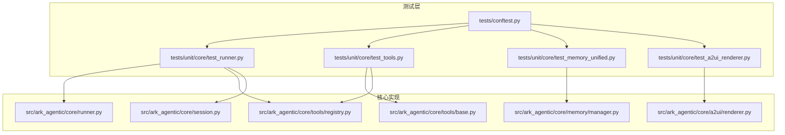
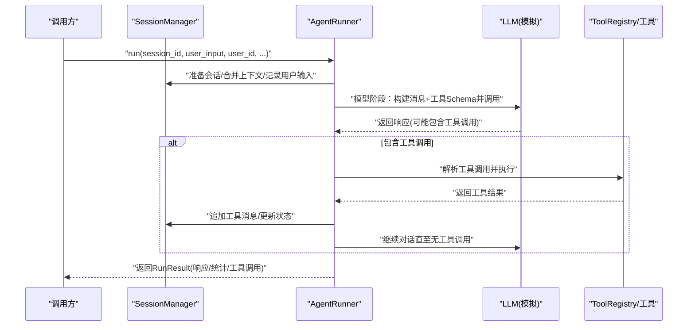
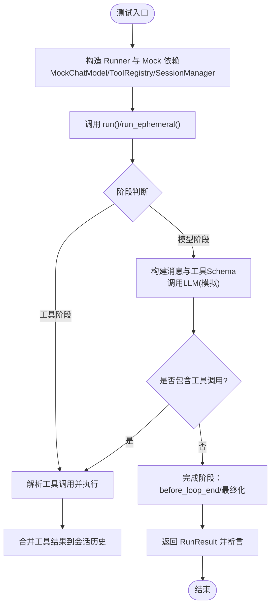
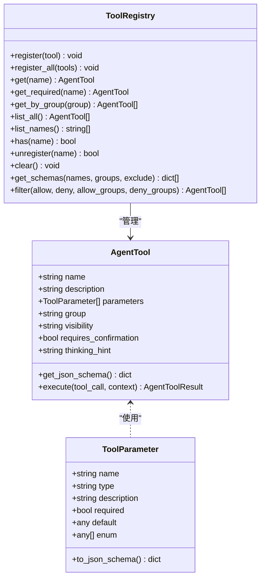
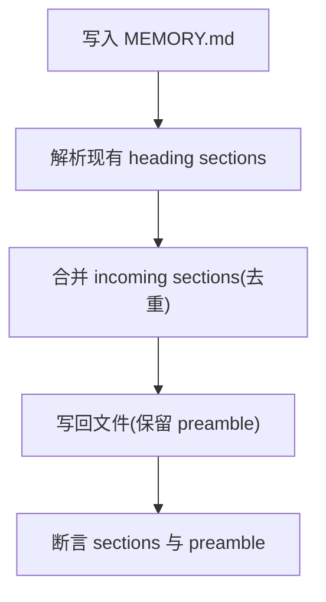
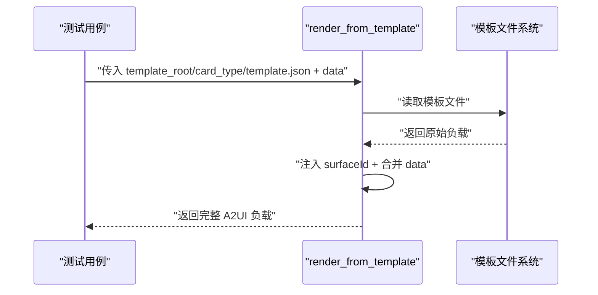
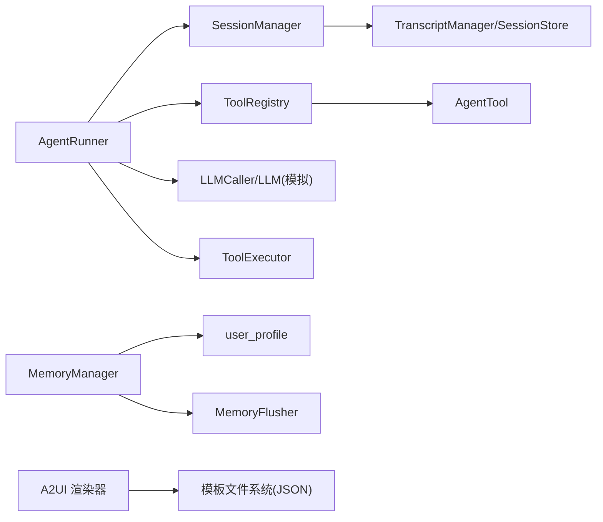

# 单元测试

<cite>
**本文引用的文件**
- [tests/conftest.py](file://tests/conftest.py)
- [src/ark_agentic/core/runner.py](file://src/ark_agentic/core/runner.py)
- [src/ark_agentic/core/tools/base.py](file://src/ark_agentic/core/tools/base.py)
- [src/ark_agentic/core/tools/registry.py](file://src/ark_agentic/core/tools/registry.py)
- [src/ark_agentic/core/memory/manager.py](file://src/ark_agentic/core/memory/manager.py)
- [src/ark_agentic/core/a2ui/renderer.py](file://src/ark_agentic/core/a2ui/renderer.py)
- [src/ark_agentic/core/session.py](file://src/ark_agentic/core/session.py)
- [tests/unit/core/test_runner.py](file://tests/unit/core/test_runner.py)
- [tests/unit/core/test_tools.py](file://tests/unit/core/test_tools.py)
- [tests/unit/core/test_memory_unified.py](file://tests/unit/core/test_memory_unified.py)
- [tests/unit/core/test_a2ui_renderer.py](file://tests/unit/core/test_a2ui_renderer.py)
</cite>

## 目录
1. [简介](#简介)
2. [项目结构](#项目结构)
3. [核心组件](#核心组件)
4. [架构总览](#架构总览)
5. [详细组件分析](#详细组件分析)
6. [依赖分析](#依赖分析)
7. [性能考虑](#性能考虑)
8. [故障排查指南](#故障排查指南)
9. [结论](#结论)
10. [附录](#附录)

## 简介
本文件面向 Ark-Agentic 的单元测试体系，聚焦核心模块的测试策略与最佳实践，涵盖 AgentRunner、工具系统（AgentTool/ToolRegistry）、内存管理（MemoryManager）、A2UI 渲染器以及会话管理（SessionManager）。文档提供测试用例设计模式、Mock 使用技巧、断言验证方法，并总结测试隔离、依赖注入与测试数据管理的实践经验。

## 项目结构
围绕单元测试的关键目录与文件：
- 测试配置与通用夹具：tests/conftest.py
- 核心运行器：src/ark_agentic/core/runner.py
- 工具系统：src/ark_agentic/core/tools/base.py、src/ark_agentic/core/tools/registry.py
- 内存管理：src/ark_agentic/core/memory/manager.py
- A2UI 渲染：src/ark_agentic/core/a2ui/renderer.py
- 会话管理：src/ark_agentic/core/session.py
- 单测用例：tests/unit/core 下各模块测试文件

图表来源
- [tests/conftest.py:1-39](file://tests/conftest.py#L1-L39)
- [tests/unit/core/test_runner.py:1-784](file://tests/unit/core/test_runner.py#L1-L784)
- [tests/unit/core/test_tools.py:1-344](file://tests/unit/core/test_tools.py#L1-L344)
- [tests/unit/core/test_memory_unified.py:1-160](file://tests/unit/core/test_memory_unified.py#L1-L160)
- [tests/unit/core/test_a2ui_renderer.py:1-95](file://tests/unit/core/test_a2ui_renderer.py#L1-L95)
- [src/ark_agentic/core/runner.py:1-800](file://src/ark_agentic/core/runner.py#L1-L800)
- [src/ark_agentic/core/tools/base.py:1-289](file://src/ark_agentic/core/tools/base.py#L1-L289)
- [src/ark_agentic/core/tools/registry.py:1-178](file://src/ark_agentic/core/tools/registry.py#L1-L178)
- [src/ark_agentic/core/memory/manager.py:1-92](file://src/ark_agentic/core/memory/manager.py#L1-L92)
- [src/ark_agentic/core/a2ui/renderer.py:1-53](file://src/ark_agentic/core/a2ui/renderer.py#L1-L53)
- [src/ark_agentic/core/session.py:1-482](file://src/ark_agentic/core/session.py#L1-L482)

章节来源
- [tests/conftest.py:1-39](file://tests/conftest.py#L1-L39)
- [tests/unit/core/test_runner.py:1-784](file://tests/unit/core/test_runner.py#L1-L784)
- [tests/unit/core/test_tools.py:1-344](file://tests/unit/core/test_tools.py#L1-L344)
- [tests/unit/core/test_memory_unified.py:1-160](file://tests/unit/core/test_memory_unified.py#L1-L160)
- [tests/unit/core/test_a2ui_renderer.py:1-95](file://tests/unit/core/test_a2ui_renderer.py#L1-L95)

## 核心组件
- AgentRunner：ReAct 执行器，负责构建提示、调用 LLM、执行工具、流式事件分发与回调钩子编排。
- 工具系统：AgentTool 抽象与 ToolRegistry 注册器，提供参数读取辅助函数与 JSON Schema 生成。
- 内存管理：MemoryManager 轻量内存管理器，提供工作区路径、heading upsert 与读写能力。
- A2UI 渲染：从模板目录读取模板，注入 surfaceId 并合并数据，输出完整 A2UI 负载。
- 会话管理：SessionManager 管理会话生命周期、消息持久化、上下文压缩与状态管理。

章节来源
- [src/ark_agentic/core/runner.py:193-800](file://src/ark_agentic/core/runner.py#L193-L800)
- [src/ark_agentic/core/tools/base.py:46-289](file://src/ark_agentic/core/tools/base.py#L46-L289)
- [src/ark_agentic/core/tools/registry.py:14-178](file://src/ark_agentic/core/tools/registry.py#L14-L178)
- [src/ark_agentic/core/memory/manager.py:24-92](file://src/ark_agentic/core/memory/manager.py#L24-L92)
- [src/ark_agentic/core/a2ui/renderer.py:15-53](file://src/ark_agentic/core/a2ui/renderer.py#L15-L53)
- [src/ark_agentic/core/session.py:24-482](file://src/ark_agentic/core/session.py#L24-L482)

## 架构总览
以下序列图展示 AgentRunner 的核心执行流程与关键交互点，便于理解测试关注点与断言位置。

图表来源
- [src/ark_agentic/core/runner.py:312-730](file://src/ark_agentic/core/runner.py#L312-L730)
- [src/ark_agentic/core/session.py:40-120](file://src/ark_agentic/core/session.py#L40-L120)
- [src/ark_agentic/core/tools/registry.py:14-178](file://src/ark_agentic/core/tools/registry.py#L14-L178)

## 详细组件分析

### AgentRunner 单元测试策略
- 测试目标
  - 正常文本响应、流式响应与工具调用链路
  - 回调钩子（before_agent/after_agent/before_model/after_model/on_model_error/before_tool/after_tool/before_loop_end）行为
  - 临时状态与输入上下文合并、状态合并与清理
  - A2UI 结果的历史标记与 UI 组件事件触发
  - 记忆标记兼容性（SQLite 移除后的 no-op）
- 关键测试用例与断言模式
  - 文本响应与回合数统计
  - 流式内容增量与工具调用开始事件
  - 思维提示 on_step 分发与工具思考提示优先
  - state_delta 合并与 temp: 前缀键清理
  - A2UI 历史标记（neutral JSON）与 on_ui_component 触发
  - render_a2ui 参数保留与非 A2UI 参数不红化
  - mark_memory_dirty 保持 API 兼容的 no-op
- Mock 使用技巧
  - 使用自定义 MockChatModel 替代 LangChain 接口，支持 ainvoke/astream 并跟踪调用次数
  - 使用 AsyncMock/MagicMock 注入 LLM/会话存储/压缩回调等外部依赖
  - 使用临时目录作为 sessions_dir，确保测试隔离
- 断言验证方法
  - RunResult 字段：response.content、turns、tool_calls_count、token 统计
  - 会话历史：消息顺序、工具消息、A2UI 标记
  - 事件回调：捕获 on_content_delta/on_tool_call_start/on_ui_component 等
  - 状态管理：session.state 与 strip_temp_state 行为

图表来源
- [tests/unit/core/test_runner.py:141-784](file://tests/unit/core/test_runner.py#L141-L784)
- [src/ark_agentic/core/runner.py:652-730](file://src/ark_agentic/core/runner.py#L652-L730)

章节来源
- [tests/unit/core/test_runner.py:122-784](file://tests/unit/core/test_runner.py#L122-L784)
- [src/ark_agentic/core/runner.py:193-800](file://src/ark_agentic/core/runner.py#L193-L800)

### 工具系统（AgentTool/ToolRegistry）测试策略
- 测试目标
  - ToolParameter JSON Schema 转换（基础/枚举/默认值）
  - AgentTool 子类约束（name/description 必填）
  - JSON Schema 生成（OpenAI 函数调用格式）
  - ToolRegistry 注册/查找/过滤/Schema 输出
  - 参数读取辅助函数（字符串/整数/浮点/布尔/列表/字典）
- 关键测试用例与断言模式
  - ToolParameter.to_json_schema() 输出字段完整性
  - AgentTool 子类缺失必填字段抛出异常
  - get_json_schema() 生成 OpenAI 兼容格式，required 字段正确
  - ToolRegistry.register/unregister/get_schemas/filter 行为
  - 参数读取函数对缺省值与类型转换的健壮性
- Mock 使用技巧
  - 使用 type() 动态创建工具类，绕过 __init_subclass__ 校验
  - 使用 AsyncMock 返回 AgentToolResult
- 断言验证方法
  - JSON Schema 结构与 required 字段
  - 注册器工具数量与名称集合
  - 参数读取函数返回值与异常

图表来源
- [src/ark_agentic/core/tools/base.py:46-289](file://src/ark_agentic/core/tools/base.py#L46-L289)
- [src/ark_agentic/core/tools/registry.py:14-178](file://src/ark_agentic/core/tools/registry.py#L14-L178)

章节来源
- [tests/unit/core/test_tools.py:1-344](file://tests/unit/core/test_tools.py#L1-L344)
- [src/ark_agentic/core/tools/base.py:46-289](file://src/ark_agentic/core/tools/base.py#L46-L289)
- [src/ark_agentic/core/tools/registry.py:14-178](file://src/ark_agentic/core/tools/registry.py#L14-L178)

### 内存管理（MemoryManager）测试策略
- 测试目标
  - 单文件 per-user 内存模型：写入 {workspace}/{user_id}/MEMORY.md
  - Heading-level upsert 语义与 preamble 保留
  - Flush 回调写入与预压缩回调集成
  - 系统提示读取工作区路径（无用户画像导入）
- 关键测试用例与断言模式
  - memory_path 与读写行为
  - 同 heading 重复写入去重与合并
  - preamble 保留与 sections 合并
  - Flush 回调通过 LLM 生成并写入用户目录
  - 系统提示源码中不再引入用户画像加载
- Mock 使用技巧
  - 使用临时目录作为 workspace_dir，避免真实文件系统副作用
  - 使用 AsyncMock/MagicMock 模拟 LLM 与 MemoryFlusher
- 断言验证方法
  - 文件存在性与内容片段
  - sections 合并后的唯一性与值
  - 回调执行后文件内容

图表来源
- [tests/unit/core/test_memory_unified.py:45-160](file://tests/unit/core/test_memory_unified.py#L45-L160)
- [src/ark_agentic/core/memory/manager.py:41-70](file://src/ark_agentic/core/memory/manager.py#L41-L70)

章节来源
- [tests/unit/core/test_memory_unified.py:1-160](file://tests/unit/core/test_memory_unified.py#L1-L160)
- [src/ark_agentic/core/memory/manager.py:24-92](file://src/ark_agentic/core/memory/manager.py#L24-L92)

### A2UI 渲染器测试策略
- 测试目标
  - 从模板目录读取 template.json，注入 surfaceId
  - data 合并与模板字段覆盖
  - session_id 前缀注入 surfaceId
  - 缺少模板文件抛出 FileNotFoundError
- 关键测试用例与断言模式
  - 输出负载包含 beginRendering/version/rootComponentId/components/data
  - surfaceId 以 card_type-session_id 前缀生成
  - data 字段覆盖与模板字段保留
  - 异常场景：模板不存在
- Mock 使用技巧
  - 使用真实模板路径（保险模块模板）进行集成式验证
- 断言验证方法
  - 负载结构字段与 data 合并结果
  - surfaceId 前缀规则

图表来源
- [tests/unit/core/test_a2ui_renderer.py:23-95](file://tests/unit/core/test_a2ui_renderer.py#L23-L95)
- [src/ark_agentic/core/a2ui/renderer.py:15-53](file://src/ark_agentic/core/a2ui/renderer.py#L15-L53)

章节来源
- [tests/unit/core/test_a2ui_renderer.py:1-95](file://tests/unit/core/test_a2ui_renderer.py#L1-L95)
- [src/ark_agentic/core/a2ui/renderer.py:15-53](file://src/ark_agentic/core/a2ui/renderer.py#L15-L53)

### 会话管理（SessionManager）测试策略
- 测试目标
  - 会话生命周期：创建/加载/删除/同步
  - 消息管理：追加、注入外部历史、清理
  - 上下文压缩：自动压缩阈值与回调
  - 状态管理：更新/获取/临时状态清理
- 关键测试用例与断言模式
  - create_session/create_session_sync 行为差异
  - load_session/reload_session_from_disk 数据一致性
  - inject_messages 插入锚点解析与顺序
  - auto_compact_if_needed 预压缩回调与压缩结果
  - 状态合并与 temp: 前缀清理
- Mock 使用技巧
  - 使用临时目录与内存会话，避免磁盘耦合
  - 使用 AsyncMock 模拟 TranscriptManager/SessionStore
- 断言验证方法
  - 会话消息数量与角色分布
  - 压缩前后消息与 token 统计
  - 状态字段存在性与清理

章节来源
- [src/ark_agentic/core/session.py:24-482](file://src/ark_agentic/core/session.py#L24-L482)

## 依赖分析
- 测试配置与夹具
  - tests/conftest.py 将 src 加入 sys.path，动态 mock 可选模块，提供 tmp_sessions_dir 夹具
- 组件间依赖
  - AgentRunner 依赖 SessionManager、ToolRegistry、LLMCaller、ToolExecutor、回调系统
  - 工具系统依赖 types/回调/流事件
  - 内存管理依赖 user_profile/extractor/types
  - A2UI 渲染依赖模板文件系统与 JSON 解析
  - 会话管理依赖 compaction/persistence/types

图表来源
- [src/ark_agentic/core/runner.py:193-300](file://src/ark_agentic/core/runner.py#L193-L300)
- [src/ark_agentic/core/tools/registry.py:14-178](file://src/ark_agentic/core/tools/registry.py#L14-L178)
- [src/ark_agentic/core/memory/manager.py:24-92](file://src/ark_agentic/core/memory/manager.py#L24-L92)
- [src/ark_agentic/core/a2ui/renderer.py:15-53](file://src/ark_agentic/core/a2ui/renderer.py#L15-L53)
- [src/ark_agentic/core/session.py:24-120](file://src/ark_agentic/core/session.py#L24-L120)

章节来源
- [tests/conftest.py:12-39](file://tests/conftest.py#L12-L39)
- [src/ark_agentic/core/runner.py:193-300](file://src/ark_agentic/core/runner.py#L193-L300)
- [src/ark_agentic/core/tools/registry.py:14-178](file://src/ark_agentic/core/tools/registry.py#L14-L178)
- [src/ark_agentic/core/memory/manager.py:24-92](file://src/ark_agentic/core/memory/manager.py#L24-L92)
- [src/ark_agentic/core/a2ui/renderer.py:15-53](file://src/ark_agentic/core/a2ui/renderer.py#L15-L53)
- [src/ark_agentic/core/session.py:24-120](file://src/ark_agentic/core/session.py#L24-L120)

## 性能考虑
- 测试隔离与 I/O
  - 使用临时目录与内存会话，避免磁盘与网络依赖，提升测试稳定性与速度
- Mock 策略
  - 对 LLM/存储/压缩器使用 AsyncMock/MagicMock，减少真实调用开销
- 并发与流式
  - 流式测试通过 astream/astream_chunk 模拟，验证事件回调与增量输出
- 断言粒度
  - 优先断言关键指标（回合数、工具调用数、token 统计），避免过度断言导致脆弱性

## 故障排查指南
- 常见问题
  - 模板文件缺失：render_from_template 抛出 FileNotFoundError，检查模板路径与 card_type
  - 工具注册冲突：ToolRegistry.register 重复注册抛出 ValueError，检查工具名称唯一性
  - 会话未找到：SessionManager.get_session_required 抛出 KeyError，确认 session_id 有效性
  - LLM 调用次数超限：MockChatModel 超出响应次数抛出 RuntimeError，核对测试期望的调用次数
- 排查步骤
  - 使用最小化用例复现问题
  - 检查 Mock 依赖是否按预期注入
  - 核对断言字段与期望值范围
  - 查看日志与回调事件（on_content_delta/on_ui_component 等）

章节来源
- [tests/unit/core/test_a2ui_renderer.py:74-79](file://tests/unit/core/test_a2ui_renderer.py#L74-L79)
- [tests/unit/core/test_tools.py:217-224](file://tests/unit/core/test_tools.py#L217-L224)
- [tests/unit/core/test_runner.py:70-75](file://tests/unit/core/test_runner.py#L70-L75)

## 结论
Ark-Agentic 的单元测试围绕核心模块建立清晰的测试金字塔：以 AgentRunner 为主线，串联工具系统、内存管理与 A2UI 渲染，结合会话管理与回调机制，形成可验证的执行闭环。通过合理的 Mock 策略、严格的断言与测试隔离，确保关键功能在演进中保持稳定与可维护性。

## 附录
- 测试夹具与环境
  - tests/conftest.py 提供可选模块 mock 与 tmp_sessions_dir 夹具，确保测试可在不同环境下运行
- 测试数据管理
  - 使用临时目录与内存会话，避免跨测试污染；通过 ToolCall/AgentMessage 构造精确输入
- 依赖注入最佳实践
  - 在测试中显式注入 ToolRegistry/SessionManager/LangChain 模拟对象，避免全局状态耦合

章节来源
- [tests/conftest.py:17-39](file://tests/conftest.py#L17-L39)