# 智能体工厂单元测试

<cite>
**本文档引用的文件**
- [agent_factory.py](file://src/ark_agentic/core/agent_factory.py)
- [test_agent_factory.py](file://tests/unit/core/test_agent_factory.py)
- [test_skill_router.py](file://tests/unit/core/test_skill_router.py)
- [test_runner_skill_router.py](file://tests/unit/core/test_runner_skill_router.py)
- [test_build_standard_agent_router_wiring.py](file://tests/unit/agents/test_build_standard_agent_router_wiring.py)
- [runner.py](file://src/ark_agentic/core/runner.py)
- [types.py](file://src/ark_agentic/core/types.py)
- [base.py](file://src/ark_agentic/core/skills/base.py)
- [builder.py](file://src/ark_agentic/core/prompt/builder.py)
- [manager.py](file://src/ark_agentic/core/memory/manager.py)
- [session.py](file://src/ark_agentic/core/session.py)
- [router.py](file://src/ark_agentic/core/skills/router.py)
</cite>

## 更新摘要
**变更内容**
- 新增skill_router参数和路由功能的测试覆盖说明
- 增加LLMSkillRouter动态路由机制的详细分析
- 扩展工厂函数测试，涵盖路由策略的集成验证
- 完善路由功能的异常处理和边界条件测试

## 目录
1. [简介](#简介)
2. [项目结构](#项目结构)
3. [核心组件](#核心组件)
4. [架构概览](#架构概览)
5. [详细组件分析](#详细组件分析)
6. [skill_router参数和路由功能](#skill_router参数和路由功能)
7. [依赖关系分析](#依赖关系分析)
8. [性能考虑](#性能考虑)
9. [故障排除指南](#故障排除指南)
10. [结论](#结论)

## 简介

本文档深入分析智能体工厂的单元测试，重点关注 `AgentDef` 数据类、`build_standard_agent` 工厂函数以及新增的 `skill_router` 参数和路由功能的测试覆盖。该测试套件确保智能体构建过程的正确性和可靠性，验证从声明式配置到完整智能体运行器实例的整个流水线，包括动态技能路由机制。

智能体工厂是 Ark 智能体系统的核心组件，采用约定优于配置的设计理念，通过 `AgentDef` 数据类提供声明式的智能体定制能力，并通过 `build_standard_agent` 函数将这些配置转换为可执行的 `AgentRunner` 实例。新增的 `skill_router` 参数为动态模式下的智能体提供了自动技能选择能力。

## 项目结构

智能体工厂单元测试位于项目的 `tests/unit/core/` 和 `tests/unit/agents/` 目录下，主要包含以下关键文件：

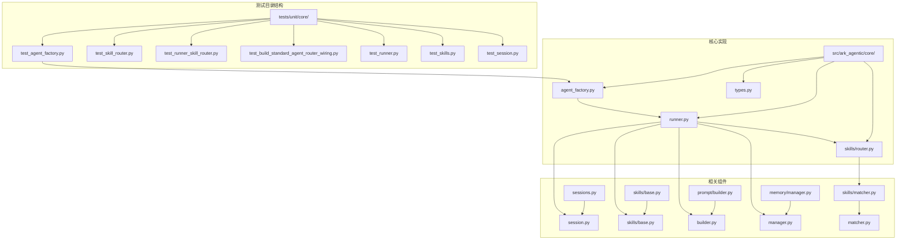

**图表来源**
- [test_agent_factory.py:1-137](file://tests/unit/core/test_agent_factory.py#L1-L137)
- [test_skill_router.py:1-309](file://tests/unit/core/test_skill_router.py#L1-L309)
- [test_runner_skill_router.py:1-448](file://tests/unit/core/test_runner_skill_router.py#L1-L448)
- [test_build_standard_agent_router_wiring.py:1-109](file://tests/unit/agents/test_build_standard_agent_router_wiring.py#L1-L109)

**章节来源**
- [test_agent_factory.py:1-137](file://tests/unit/core/test_agent_factory.py#L1-L137)
- [agent_factory.py:1-173](file://src/ark_agentic/core/agent_factory.py#L1-L173)

## 核心组件

### AgentDef 数据类测试

`AgentDef` 是智能体工厂的核心数据结构，采用数据类设计提供声明式的智能体配置能力：

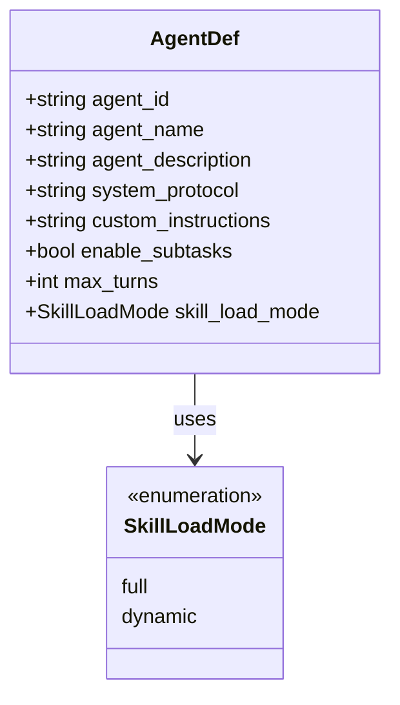

**图表来源**
- [agent_factory.py:35-56](file://src/ark_agentic/core/agent_factory.py#L35-L56)
- [types.py:304-309](file://src/ark_agentic/core/types.py#L304-L309)

测试覆盖了以下关键功能：
- 必需字段验证（`agent_id`、`agent_name`、`agent_description`）
- 默认值设置验证
- 可选字段自定义验证
- 缺失必需字段时的异常处理

**章节来源**
- [agent_factory.py:35-56](file://src/ark_agentic/core/agent_factory.py#L35-L56)
- [test_agent_factory.py:12-47](file://tests/unit/core/test_agent_factory.py#L12-L47)

### build_standard_agent 工厂函数测试

`build_standard_agent` 函数是智能体工厂的核心，负责将 `AgentDef` 配置转换为完整的 `AgentRunner` 实例：

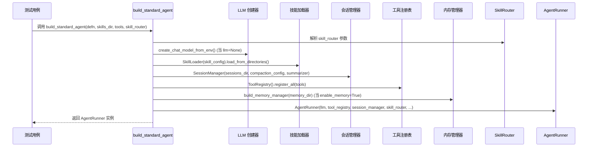

**图表来源**
- [agent_factory.py:59-173](file://src/ark_agentic/core/agent_factory.py#L59-L173)

**章节来源**
- [agent_factory.py:59-173](file://src/ark_agentic/core/agent_factory.py#L59-L173)
- [test_agent_factory.py:49-137](file://tests/unit/core/test_agent_factory.py#L49-L137)

## 架构概览

智能体工厂采用分层架构设计，确保关注点分离和模块化：

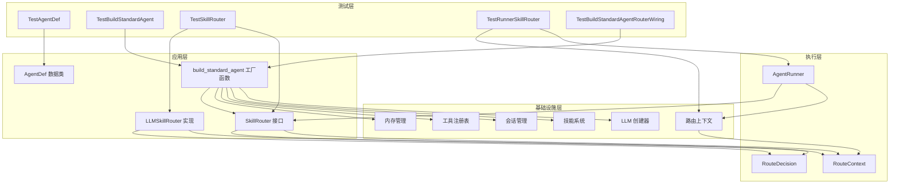

**图表来源**
- [test_agent_factory.py:12-137](file://tests/unit/core/test_agent_factory.py#L12-L137)
- [test_skill_router.py:1-309](file://tests/unit/core/test_skill_router.py#L1-L309)
- [test_runner_skill_router.py:1-448](file://tests/unit/core/test_runner_skill_router.py#L1-L448)
- [test_build_standard_agent_router_wiring.py:1-109](file://tests/unit/agents/test_build_standard_agent_router_wiring.py#L1-L109)

## 详细组件分析

### AgentDef 数据类测试分析

#### 必需字段验证测试

测试确保 `AgentDef` 正确接受必需的三个身份字段：

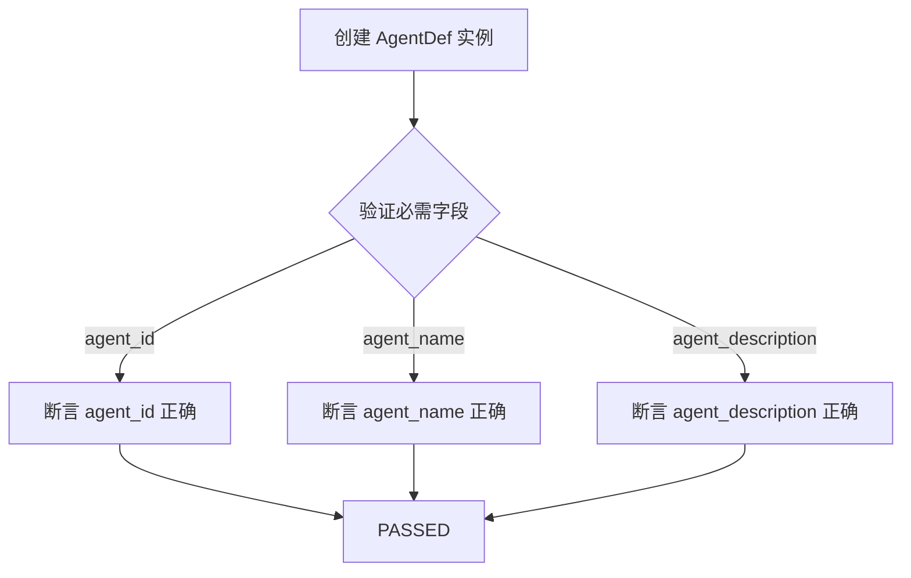

**图表来源**
- [test_agent_factory.py:13-21](file://tests/unit/core/test_agent_factory.py#L13-L21)

#### 默认值验证测试

验证 `AgentDef` 的可选字段是否具有正确的默认值：

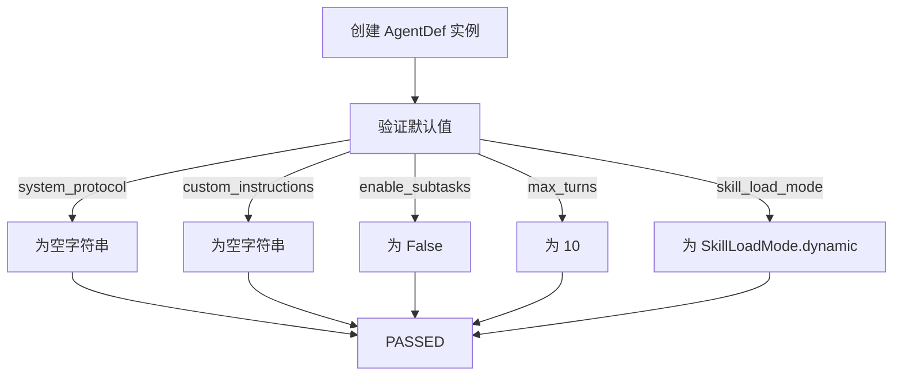

**图表来源**
- [test_agent_factory.py:23-29](file://tests/unit/core/test_agent_factory.py#L23-L29)

#### 可选字段自定义测试

验证用户可以正确自定义可选字段：

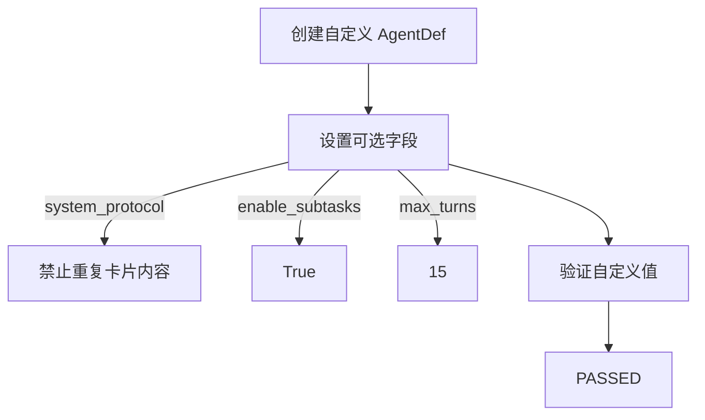

**图表来源**
- [test_agent_factory.py:31-42](file://tests/unit/core/test_agent_factory.py#L31-L42)

**章节来源**
- [test_agent_factory.py:12-47](file://tests/unit/core/test_agent_factory.py#L12-L47)

### build_standard_agent 工厂函数测试分析

#### AgentRunner 实例返回测试

验证工厂函数正确返回 `AgentRunner` 实例：

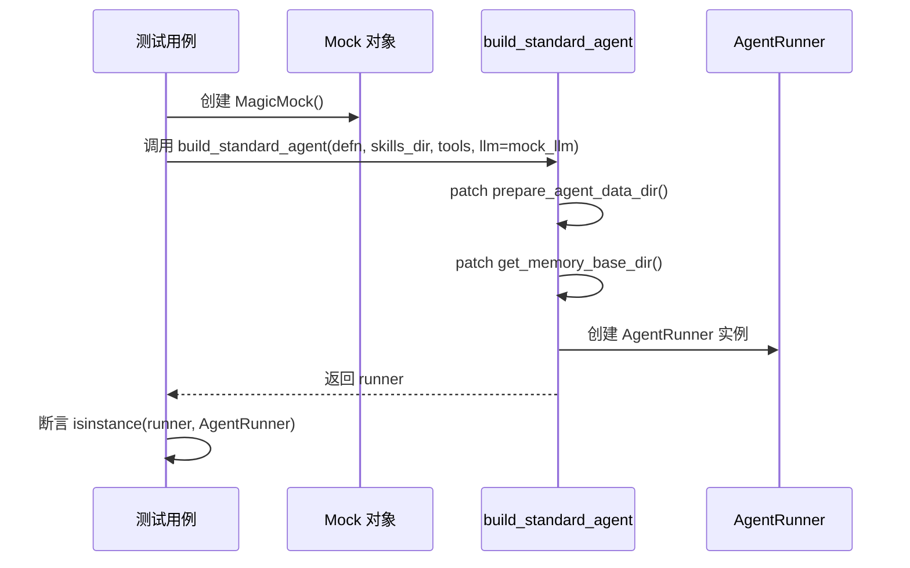

**图表来源**
- [test_agent_factory.py:57-64](file://tests/unit/core/test_agent_factory.py#L57-L64)

#### AgentID 传播测试

验证 `agent_id` 正确传播到技能配置中：

```mermaid
flowchart TD
A[创建 AgentDef("my_agent")] --> B[调用 build_standard_agent]
B --> C[创建 Runner 实例]
C --> D[访问 runner.config.skill_config.agent_id]
D --> E[断言等于 "my_agent"]
E --> F[PASSED]
```

**图表来源**
- [test_agent_factory.py:66-73](file://tests/unit/core/test_agent_factory.py#L66-L73)

#### 提示配置构建测试

验证 `PromptConfig` 正确从 `AgentDef` 构建：

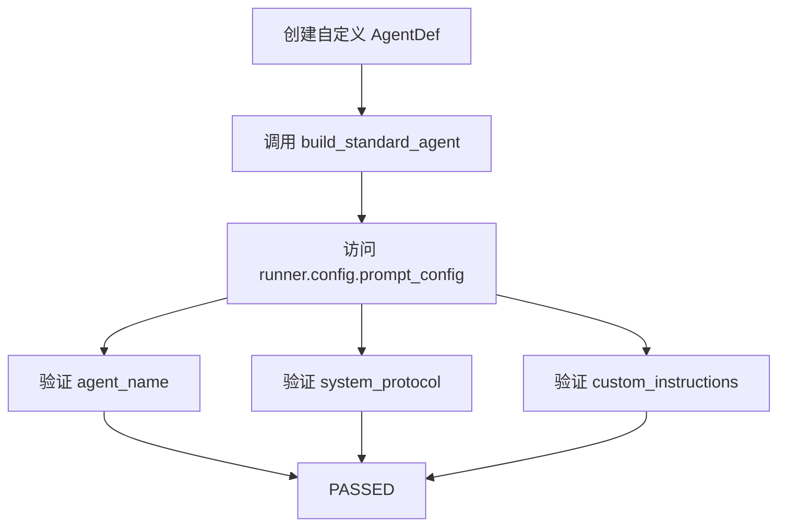

**图表来源**
- [test_agent_factory.py:75-89](file://tests/unit/core/test_agent_factory.py#L75-L89)

#### 内存管理器条件创建测试

验证 `enable_memory` 参数正确控制内存管理器的创建：

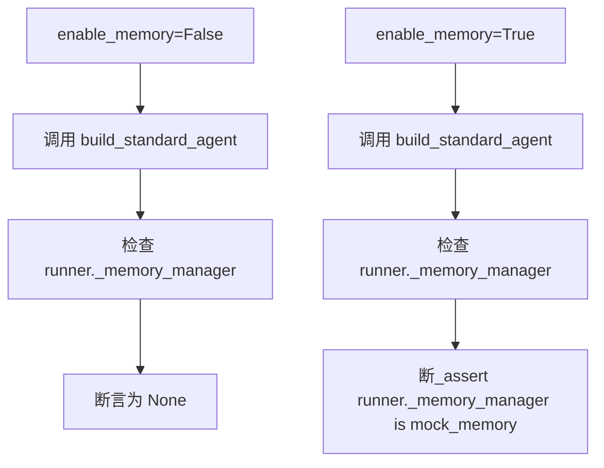

**图表来源**
- [test_agent_factory.py:91-108](file://tests/unit/core/test_agent_factory.py#L91-L108)

#### LLM 创建器调用测试

验证当 `llm=None` 时正确调用 `create_chat_model_from_env`：

```mermaid
flowchart TD
A[llm=None] --> B[调用 build_standard_agent]
B --> C[patch create_chat_model_from_env]
C --> D[断言 mock_factory.assert_called_once()]
D --> E[断言 runner.llm is mock_llm]
E --> F[PASSED]
```

**图表来源**
- [test_agent_factory.py:110-117](file://tests/unit/core/test_agent_factory.py#L110-L117)

#### 技能目录添加测试

验证 `skills_dir` 正确添加到技能配置中：

```mermaid
flowchart TD
A[创建 skills_path 目录] --> B[调用 build_standard_agent]
B --> C[检查 runner.config.skill_config.skill_directories]
C --> D[断言 str(skills_path) 在列表中]
D --> E[PASSED]
```

**图表来源**
- [test_agent_factory.py:127-136](file://tests/unit/core/test_agent_factory.py#L127-L136)

**章节来源**
- [test_agent_factory.py:49-137](file://tests/unit/core/test_agent_factory.py#L49-L137)

## skill_router参数和路由功能

### SkillRouter 接口和 LLMSkillRouter 实现

新增的 `skill_router` 参数为智能体提供了动态技能路由能力。`SkillRouter` 是一个协议接口，定义了路由决策的标准：

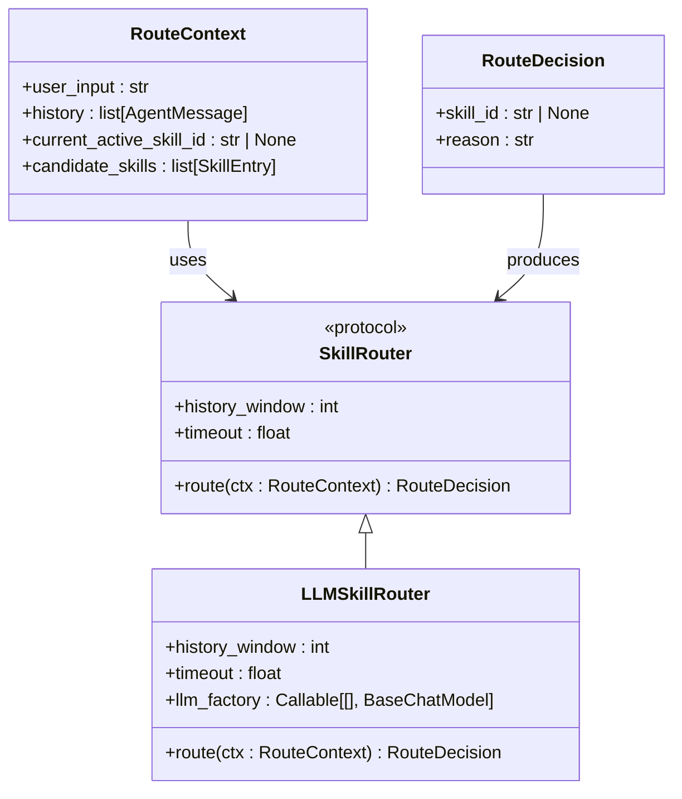

**图表来源**
- [router.py:1-237](file://src/ark_agentic/core/skills/router.py#L1-L237)

### 工厂函数中的 skill_router 集成测试

`build_standard_agent` 函数正确处理了 `skill_router` 参数的不同配置：

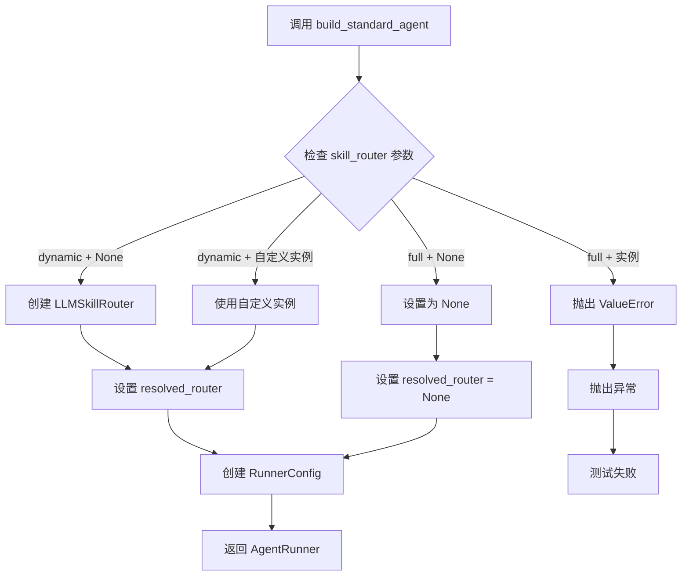

**图表来源**
- [test_build_standard_agent_router_wiring.py:60-109](file://tests/unit/agents/test_build_standard_agent_router_wiring.py#L60-L109)

**章节来源**
- [test_build_standard_agent_router_wiring.py:1-109](file://tests/unit/agents/test_build_standard_agent_router_wiring.py#L1-L109)
- [agent_factory.py:69-111](file://src/ark_agentic/core/agent_factory.py#L69-L111)

### LLMSkillRouter 路由决策测试

`LLMSkillRouter` 类提供了基于大语言模型的智能路由决策：

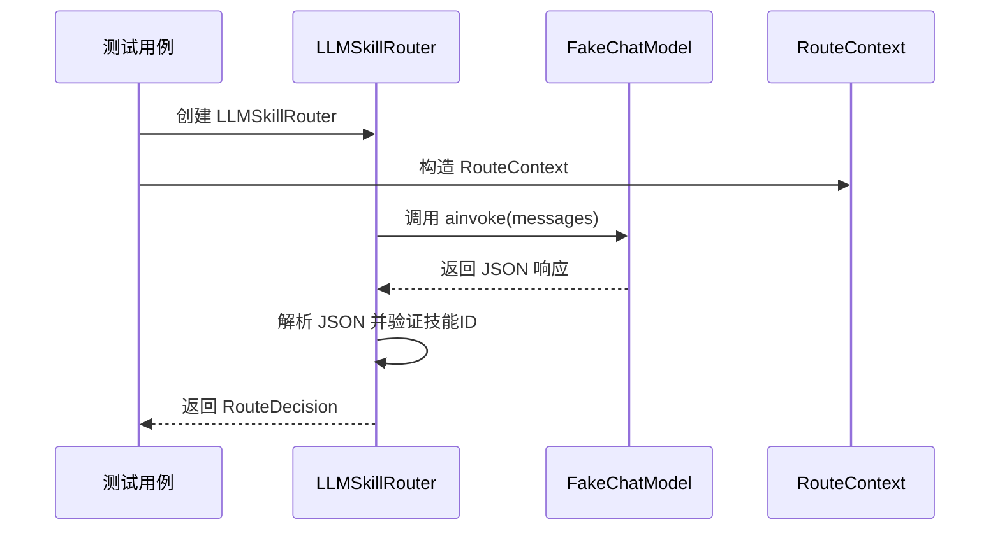

**图表来源**
- [test_skill_router.py:89-107](file://tests/unit/core/test_skill_router.py#L89-L107)

**章节来源**
- [test_skill_router.py:1-309](file://tests/unit/core/test_skill_router.py#L1-L309)

### AgentRunner 中的路由集成测试

`AgentRunner` 正确集成了 `skill_router` 功能，在每次对话循环开始前进行技能路由：

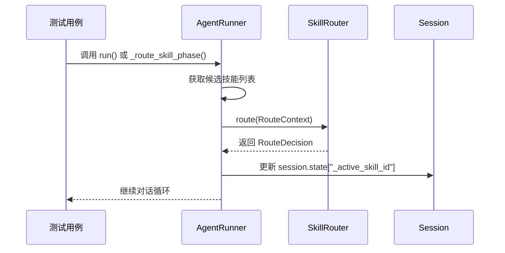

**图表来源**
- [test_runner_skill_router.py:118-142](file://tests/unit/core/test_runner_skill_router.py#L118-L142)

**章节来源**
- [test_runner_skill_router.py:1-448](file://tests/unit/core/test_runner_skill_router.py#L1-L448)
- [runner.py:1195-1233](file://src/ark_agentic/core/runner.py#L1195-L1233)

## 依赖关系分析

智能体工厂测试涉及多个核心组件的交互关系：

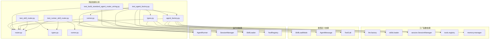

**图表来源**
- [test_agent_factory.py:1-137](file://tests/unit/core/test_agent_factory.py#L1-L137)
- [test_skill_router.py:1-309](file://tests/unit/core/test_skill_router.py#L1-L309)
- [test_runner_skill_router.py:1-448](file://tests/unit/core/test_runner_skill_router.py#L1-L448)
- [test_build_standard_agent_router_wiring.py:1-109](file://tests/unit/agents/test_build_standard_agent_router_wiring.py#L1-L109)

**章节来源**
- [agent_factory.py:1-173](file://src/ark_agentic/core/agent_factory.py#L1-L173)
- [types.py:304-309](file://src/ark_agentic/core/types.py#L304-L309)

## 性能考虑

智能体工厂测试在性能方面的考虑包括：

1. **Mock 对象使用**：测试中广泛使用 `MagicMock` 和 `patch` 装饰器，避免实际的外部依赖调用
2. **临时文件系统**：使用 `tmp_path` 作为临时目录，确保测试隔离性
3. **最小化依赖**：测试专注于核心逻辑验证，避免不必要的复杂初始化
4. **并发安全**：测试用例相互独立，不会产生竞态条件
5. **路由性能优化**：`LLMSkillRouter` 使用超时机制和历史窗口限制，确保路由决策的及时性

## 故障排除指南

### 常见测试失败场景

#### AgentDef 字段缺失错误
**症状**：`TypeError` 异常
**原因**：缺少必需的 `agent_id` 字段
**解决方案**：确保在创建 `AgentDef` 时提供 `agent_id`、`agent_name` 和 `agent_description`

#### 内存管理器创建失败
**症状**：`AttributeError` 或 `None` 值
**原因**：`enable_memory` 参数设置不正确
**解决方案**：确保在需要内存功能时设置 `enable_memory=True`

#### LLM 创建器调用失败
**症状**：`create_chat_model_from_env` 未被调用
**原因**：`llm` 参数不是 `None`
**解决方案**：当需要使用模拟 LLM 时，确保传入 `None` 或适当的 `BaseChatModel` 实例

#### skill_router 参数错误
**症状**：`ValueError` 异常，包含 "dynamic mode" 关键字
**原因**：在 `full` 模式下传递了 `skill_router` 参数
**解决方案**：仅在 `dynamic` 模式下使用 `skill_router` 参数，或在 `full` 模式下省略该参数

#### 路由器异常处理失败
**症状**：路由器异常导致测试中断
**原因**：自定义路由器实现违反了协议规范
**解决方案**：确保自定义路由器实现符合 `SkillRouter` 协议，正确处理异常情况

**章节来源**
- [test_agent_factory.py:44-47](file://tests/unit/core/test_agent_factory.py#L44-L47)
- [test_agent_factory.py:91-97](file://tests/unit/core/test_agent_factory.py#L91-L97)
- [test_agent_factory.py:110-117](file://tests/unit/core/test_agent_factory.py#L110-L117)
- [test_build_standard_agent_router_wiring.py:98-109](file://tests/unit/agents/test_build_standard_agent_router_wiring.py#L98-L109)

## 结论

智能体工厂单元测试展现了全面的测试覆盖率和清晰的测试结构。测试套件成功验证了以下关键方面：

1. **数据类完整性**：`AgentDef` 正确处理必需字段、默认值和可选配置
2. **工厂函数正确性**：`build_standard_agent` 正确传播配置并创建完整的 `AgentRunner` 实例
3. **路由功能集成**：`skill_router` 参数正确集成到工厂函数中，支持动态技能路由
4. **LLMSkillRouter 实现**：基于大语言模型的智能路由决策功能得到充分验证
5. **异常处理机制**：路由功能的异常处理和边界条件得到妥善处理
6. **依赖注入**：所有必要的依赖项（LLM、技能、会话、工具、内存、路由器）都正确配置
7. **条件逻辑**：基于配置参数的条件创建逻辑得到充分验证

新增的 `skill_router` 参数和路由功能为智能体系统提供了强大的自动化能力，使得智能体能够在动态模式下根据对话内容自动选择最合适的技能。测试设计遵循了最佳实践，使用了适当的 Mock 对象和 patch 技术，确保测试的独立性和可维护性。

整体而言，这个测试套件为智能体工厂提供了可靠的质量保证，确保系统的稳定性和可预测性，同时为未来的功能扩展奠定了坚实的基础。